# Lastentaudit

Tyypilliseen tapaan useina vuosina toistuvat kysymykset jätetty toistamatta tässä ja jokainen yksittäinen tärppi otettu vain kerran käsiteltäväksi. 

## 2025

### Essee: Lasten unihäiriöt {#Unihairiot-essee}

  <button class="solution-button"
          data-label="Vastaus"
          data-hide-label="Piilota vastaus">
    Vastaus
  </button>
  

      
Niin vastasyntyneiden, taaperoiden, imeväisikäisten, leikki-ikäisten, kouluikäisten kuin teini-ikäisten unihäiriöt ovat yleisiä ja jokaiselle ajanjaksolle lapsen kehityksessä on omat tyyppiongelmansa. Lapsiperheiden vanhemmat kertovat usein neuvolassa erilaisista lasten uniongelmista ja toivovat niihin nopeita ratkaisuja. **Uniongelmat kuormittavat usein niin lasta kuin koko perhettäkin** ja niiden selvittely ja asianmukainen hoito on tärkeää. 

On hyvä tiedostaa lapsuuden **unen rakenteen kehityksen vaiheista** tärkeimmät piirteet: 

<li>Vastasyntyneellä ei ole normaalia unen rakennetta (N1,N2,N3,REM), vaan vain syvän unen esiasteena pidettyä rauhallista unta ja vilkeunen esiastetta, aktiivista unta (sekä näiden välimuotoa, joka häviää puoleen vuoteen mennessä). Jopa yli puolet vastasyntyneen kokonaisunesta on vilkeunta, mutta sen osuus vähenee voimakkaasti ensimmäisen elinvuoden aikana (leikki-iässä ja myöhemminkin enää n. 20%). Samalla syvän unen suhteellinen määrä kasvaa tasaisesti (leikki-iässä 30% ja aikuisiällä laskee hieman n. 20%:iin).</li>
<li>Yhden unijakson pituus on puolivuotiaalla noin tunti. Jakso pitenee leikki-ikään mennessä 1,5 tuntiin, mikä on unijakson pituus myöhemminkin elämässä.</li>
  <ul>
    <li>**Vauvan unen rakenne siis altistaa yöheräilylle, koska havahtumiset ja heräilyt tapahtuvat usein unijaksojen taitteissa (heräämiskynnys pieni) -> vauva herää luonnollisesti useammin kuin vanhempansa. Myös heräämiskynnys vilkeunesta on matalampi kuin syvästä unesta ja vauvallahan oli vilkeunta suhteellisesti enemmän kuin aikuisilla.**</li>
  </ul>
<li>Melatoniinin syklinen eritys ja nukahtamiseen liittyvä lämpötilan lasku kypsyvät yleensä 3kk ikään mennessä.</li>

---

Lasten unihäiriöitä kannattaa arvioida neljän ulottuvuuden kautta: unen saanti, unen tarve, vuorokausirytmi ja unihäiriön luonne (sekä unen laatuun vaikuttavat ympäristötekijät). Tutkimisessa ja anamneesissa kannattaa myös kysellä fyysisistä vaivoista, jotka voivat häiritä unta, kuten allergiat, kilpirauhasongelmat yms. Myös psyykkeestä on hyvä kysellä varsinkin nuorilla (masennus, ahdistus yms uniongelmien taustalla).  

<li>**Unen määrä:**</li>
  <ul>
    <li>Vanhempien subjektiivinen arvio lapsen unen määrästä on harvoin tarkka. Luotettavan arvion saamiseksi tarvitaankin unipäiväkirjan pitoa 7–14 vuorokauden ajan. Unipäiväkirjan perusteella lasketaan keskimääräinen unensaanti.</li>
  </ul>
<li>**Unen tarve (riittääkö unen määrä lapselle):**</li>
  <ul>
    <li>Lasten unentarve vaihtelee suuresti (ikäryhmäkeskiarvot toimivat kliinisessä työssä vain suuntaa antavana tukena) ja vähenee iän lisääntyessä alle kuukauden ikäisen imeväisen jopa 20 t:n unesta murrosikäisen keskimäärin 9 t:n uneen. Riippuen lähteestä vastasyntynyt nukkuu keskimäärin 16+ tuntia vuorokaudessa, 1-vuotias noin 12–13 t/vrk ja 7-vuotias noin 9–10 t/vrk. Kaikkein nopeinta unentarpeen väheneminen on siis ensimmäisten 12 kk:n aikana. Unen tarve vähenee ensimmäisen ikävuoden aikana keskimäärin 3–4 t ja sen jälkeen keskimäärin 20 min/ikävuosi murrosikään saakka. </li>
    <li>Keskiarvotiedon perusteella riittävästi nukkuva lapsi voi kärsiä unen puutteesta, jos unen tarve on keskimääräistä suurempi tai unen laatu on huono. Toisaalta lyhytuninen lapsi ei kärsi univajeesta, jos hänen biologinen unentarpeensa on vähäinen.</li>
    <li>Univajeesta kärsivä lapsi oireilee päivisin olemalla ärtynyt ja levoton. **Jos lapsi on päivisin virkeä, rauhallinen ja hyväntuulinen, merkittävä univaje on epätodennäköinen.** Epäselvissä tapauksissa unen pituutta tulisi kokeeksi pidentää asteittain esimerkiksi tunnilla vuorokaudessa ja seurata miten se vaikuttaa lapsen vointiin. Pienen vauvan unen pituuteen voi olla vaikea suoraan vaikuttaa, ja tällöin tulee pyrkiä korjaamaan ensisijaisesti vuorokausirytmiä ja unen laatua.</li>
  </ul>
<li>**Vuorokausirytmi ja sopiva uniaika (tässäkin unipäiväkirja hyvä):**</li>
  <ul>
    <li>Arvioidaan, onko tarjolla oleva uniaika (vanhempien ylläpitämä tai toivoma vuorokausirytmi) sopiva suhteessa lapsen unentarpeeseen. **Uniaikojen tulee vastata lapsen unentarvetta.** Liian pitkä tarjolla oleva uniaika voi ilmetä nukahtamisvaikeutena tai yöheräilynä. Jos yöllinen unipaine jää vähäiseksi, lapsi herättelee öisin tiheään eikä nuku sikeästi. Tällöin uni- ja valveajan eroja tulee korostaa ja lyhentää kokonaisuniajan kestoa niin, että yöhön saadaan selkeä yhtäjaksoinen sikeän unen jakso. Varsinkin leikki- tai kouluiässä nukahtamisvaikeuden taustalta löytyy toisinaan liian pitkä tarjolla oleva uniaika. Tällöin vanhemmat eivät ole huomanneet sopeuttaa vuorokausirytmiä lapsen iän mukana vähenevään unentarpeeseen.</li>
    <li>Vuorokausirytmin on oltava säännöllinen eikä sen kannata vaihdella päivästä toiseen tai merkittävästi viikonloppuisinkaan. On kuitenkin hyvä tiedostaa, että päiväunien asteittain vähentyessä muutoksia rytmissä tapahtuu ainakin 2–3 vuoden ikään saakka. </li>
    <li>Vauvalla ei ensimmäisten elinkuukausien aikana ole juuri vuorokausirytmiä. Vanhempien voi olla joskus vaikea hyväksyä tätä, ja he saattavat esittää toiveita, että vauvan unirytmiin yritettäisiin vaikuttaa erilaisilla ns. unikoulumenetelmillä. Varsinaiset unikoulumenetelmät eivät kuitenkaan sovellu näin pienen lapsen nukkumisopetukseen hermoston kypsymättömyyden takia. Sen sijaan neuvoloissa olisi hyvä jakaa kirjallista tietoa unen kehitykseen ja häiriöihin liittyvistä seikoista jo heti lapsen syntymän jälkeen – tai jopa ennen sitä. Tämän on todettu vähentävän myöhemmin uneen liittyviä ongelmia.  Lisäksi yksinkertaisilla perusohjeilla (esim. vanhempien säännöllinen vuorokausirytmi, unihygienia (nukutaan pimeässä ja hoidetaan yöaikaiset syötyt mahdollisimman elettomästi ja virikkeettömästi; tavallista suurempi imetys juuri ennen nukkumaanmenoa...) voidaan jouduttaa kypsymistä. </li>
  </ul>

---

Eri ikäisillä on usein erilaisia unihäiriöitä ja mahdolliset lapsuusiän unihäiriöt tulee kliinisessä työssä pyrkiä erottamaan toisistaan, sillä eri unihäiriöt edellyttävät erilaista hoitoa. Nukahtamisvaikeudet, yöheräily ja unirytmin ongelmat muodostavat yleisimmin esiintyvän ja syiltään ja hoidoiltaan yhtenäisen ryhmän. Ne edustavat useimmiten nukkumistottumuksiin liittyviä ongelmia. 

Vauvan kehityksen edetessä ja sosiaalisen vuorovaikutuksen kypsyessä noin puolen vuoden ikään tultaessa alkaa esiintyä **vauvaiän yleisin uniongelma: uniassosiaatiohäiriö.** 

<li>Uniassosiaatiohäiriö tarkoittaa lapsen kyvyttömyyttä nukahtaa itsekseen ilman, että aikuinen auttaa hänet uneen tavalla tai toisella (esim. imetys, sylissä heijaus, tuuditus). Siitä muodostuu ongelma, jos lapsi öisin havahtuessaan aina herättää myös vanhempansa ja vaatii totuttua menettelyä. </li>
  <ul>
    <li>Yöheräilytaipumus heijastelee yleensä sitä tapaa, jolla vauva on tottunut käymään yöunille. Jos vauva nukahtaa vanhemman avustamana (esimerkiksi imetyksen tuella), herää hän
pahimmillaan joka unijakson lopulla itkemään, koska ei osaa nukahtaa uudelleen itse. Vanhemmat voivat toimillaan ohjata lasta löytämään sopivia tapoja itsensä rauhoittamiseen (unilelut, rätti yms.). Tärkeää olisi siis uniassosiaatiohäiriön ehkäisy.</li>
    <li>Uniassosiaatio-ongelma usein selittää, miksi yösyötöt jatkuvat pitkälle yli puolen vuoden, vaikka niitä ei kasvun vuoksi tarvittaisi enää kuuden kuukauden iän jälkeen</li>
    <li>Vanhempi ei useinkaan pidä ongelmana nukahtamista, vaan toistuvaa yöheräilyä. Tämän vuoksi on aina tärkeää kysyä, miten lapsi nukahtaa.</li>
  </ul>
<li>Ensisijainen hoito on unikoulu ja erityisesti nykyään suositeltu on ns. **tassu-unikoulu.**   Siinä pyritään tukemaan lapsen taitoa nukahtaa itsekseen vähentämällä asteittain vuorovaikutusta nukahtamistilanteessa jättämättä lasta kuitenkaan yksin itkemään (ns. itkukoulut eivät ole keränneet kovinkaan suurta suosiota niin vanhemmilta kuin lastenpsykiatreiltakaan)</li>
  <ul>
    <li>Tassumenetelmässä lapsi pannaan iltarutiinien jälkeen sänkyyn ja rauhoitetaan vanhemman käden eli "tassun" alle sänkyyn. Lapsen luokse menee se vanhemmista, joka paremmin sietää lapsen itkua ahdistumatta siitä itse. Vanhempi kuitenkin poistuu, kun lapsi on rauhallinen ja ennen kuin lapsi nukahtaa -- annetaan siis nukahtaa itsekseen. Kun lapsen itku saavuttaa vaativan asteen (voi siis aluksi kuunnella, loppuuko ääntely itsestään), menee vanhempi taas rauhoittamaan hänet sopivaksi todetulla otteella (voi olla esim. käsi hartialla ja lantiolla yms.) alle. </li>
    <li>Tassuttelu tulisi tehdä suhteellisen elettömäästi ja ennen kaikkea itse asiasta hermostumatta. Puhetta vauvalle tulisi välttää, voi tosin tarvittaessa toistaa unilauseen, kuten "Nyt	nukutaan,	kauniita	unia!", jos lapsi esim. nousee seisomaan ja alkaa pyytää syliä.</li>
  </ul>

---

Iän myötä lapsen heräilyongelma muuttuu usein nukahtamisvaikeudeksi. Leikki-ikäinen osaa ennakoida vanhemman lähtevän luotaan nukahtamisen jälkeen ja voi siksi pyrkiä pitkittämään uneen vaipumista. **Leikki-ikäisen tyypillisin uniongelma on siis nukkumaan asettautumisen vaikeus.**

<li>Siinä iltatoimet muuttuvat nukuttamistaisteluksi, eikä lapsi saa unen päästä kiinni vanhempien toivomana ajankohtana. Pohjimmiltaan kyse on vanhemman ja lapsen välisen vuorovaikutuksen ongelmasta, joka aiheutuu siitä, **etteivät nukkumaan menemiseen liittyvät säännöt ole selkeät ja johdonmukaiset.** Tilanteen pitkittyessä myös lapsen vuorokausirytmi voi siirtyä myöhempään.</li>
  <ul>
    <li>**Positiivisten rutiinien menetelmä on hyödyllinen lasten nukahtamisvaikeuksien ja vuorokausirytmin ongelmien hoidossa.** Sillä tarkoitetaan pitkähköä aina samanlaisena toistuvaa mukavien iltatoimien sarjaa, joka johdattelee lapsen unille -> nukkumaanmenosta luodaan ennustettava ja miellyttävä tapahtuma. Johdonmukaisuus ja säännöllisyys onkin aina tärkeää etsittäessä avaimia ehjiin öihin</li>
    <li>Tähän voi yhdistää viivästetty nukkumaanmeno eli nukahtamisen jouduttamiseksi pyritään sänkyynmeno ajoittamaan mahdollisimman lähelle odotettua tai arvioitua nukahtamisajankohtaa tai jopa hieman tämän yli. Jos lapsi ei nukahda 15 minuutin kuluessa, hänet nostetaan sängystä ja yritetään hetken kuluttua uudestaan. Kun nukahtaminen lopulta onnistuu, aletaan nukkumaanmenoa ja rutiineja hiljalleen aikaistaa, kunnes on saavutettu hyväksi havaittu aika.</li>
      <ul>
        <li>Uniongelma voi siis myös pelkästään johtua siitä, että on liian pitkä tarjolla oleva uniaika. Vanhemmat saattavat viedä lapsen sänkyyn esim. 19:30, kun lapsen sopiva nukahtamisaika unen tarpeen ja suunnitellun heräämisajan suhteen olisi n. 21. Tällöin lapsi ei ole vielä sopivan väsynyt sänkyyn menneessä ja tämä johtaa levottomaan ja rauhattomaan vuoteessaoloon -> nukahtaminen vaikeutuu. Ratkaisu on juurikin yllä oleva suunnitelma eli nukkumaanmenoaikaa myöhennetään niin, että nukahtaminen sujuu helpommin ja samalla sunnitellaan säännölliset iltatoimet.</li>
      </ul>
  </ul>
<li>Joskus nukahtamisvaikeus alkaa vasta lapsen ollessa toisella vuodella siirryttäessä häkkisängystä laidattomaan lastensänkyyn. Kyseessä on tällöin **rajojen koettelu,** ei niinkään kyvyttömyys nukahtaa itsekseen. Usein näissä tilanteissa on mukana myös yleisempää pelisääntöjen puutetta, jolloin ongelmia esiintyy muulloinkin kuin nukkumaan mennessä.</li>
  <ul>
    <li>**Rajojen koettelijan hoitona paras keino on yksinkertaisesti palauttaminen:** huoneestaan pois juokseva lapsi viedään vähäeleisesti takaisin vuoteeseen kerta toisensa jälkeen, kunnes hän lopulta nukahtaa. Samalla valvotaan, ettei lapsi ryhdy nukkumaan asettumisen sijasta esimerkiksi leikkimään.</li>
  </ul>

---

Toisinaan vauvan tai pienen lapsen nukkuminen itsessään on ok, mutta se **ajoittuu epäsopivaan vuorokaudenaikaan.** Rytmin ollessa liian aikainen vauva nukahtaa jo alkuillasta ja myös herää varhain aamuyöllä. Viivästyneessä rytmissä käy päinvastoin.  

<li>Kummankin tilanteen hoito edellyttää nukkumisaikataulun vähittäistä muuttamista. Varhaistuneessa rytmissä vauva pyritään pitämään hereillä ilta illalta hieman pitempään, jolloin heräämisajankohtakin siirtyy. Viivästyneessä rytmissä vauva herätetään aamuisin aina hieman aiemmin, ja muutaman illan jälkeen voidaan myös nukahtamisajankohtaa varhaistaa. Päiväunien määrää tulee samalla pyrkiä varovasti rajoittamaan.</li>
  <ul>
    <li>Usein ongelmana on myös väärin ajoitetut päiväunet. Esimerkiksi jos vauva heräilee paljon yöllä tai herää todella aikaisin, niin hän saattaa nukkua liikaa päiväunia. Esimerkiksi 8kk ikäisellä korkeintaan 30% kokonaisunesta saa tulla päivisin. Jos lapsi nukkuu unipaineensa pois liiallisilla päiväunilla, niin hän kyllä herääkin liian aikaisin sitten yöllä. **Unirytmiä tulee hiljalleen tasata sopivaksi perheen kannalta.**</li>
  </ul>
<li>Unirytmiongelmat ovat erityisen yleisiä nuorilla ja murrosiässä unirytmi usein luonnollisesti hormonierityksen muutosten (ja sosiaalisten paineiden) takia siirtyy hieman myöhemmäksi. Nuorilla on muutenkin runsaasti uniongelmia, varsinkin unettomuushäiriötä, joka ilmenee toistuvana nukahtamisvaikeutena, yöheräilynä, liian varhain heräämisenä, huonolaatuisena yöunena tai näiden kombinaationa -- eli potilas on tyytymätön uneensa ja univaikeutta esiintyy ainakin kolmesti viikossa vähintään 3 kk:n ajan ja se haittaa jokapäiväistä elämää eikä sitä selitä jokin lääketieteellinen syy.</li>
  <ul>
    <li>Yleiset unihygieniset ohjeet ovat tärkeitä unettomuusongelmien hoidossa: unirytmi tulisi pitää säännöllisenä, fyysinen/psyykkinen aktiivisuus päiväsaikaan auttaa, kofeiinia tulisi välttää iltapäivän puolella, vältetään liian pitkiä päiväunia, aletaan rauhoittumaan illalla riittävän varhain, sänky tulisi pyhittää unelle (ei siis makoilua siinä päiväsaikaan), makuuhuoneen lämpötila sopivan matalaksi, makuuhuone mahdollisimman pimeäksi, alkoholin välttäminen, stimuloivien näyttöjen vähentäminen ennen nukkumaanmenoa yms. Unihygienian ja unenhuollon vinkkejä on netti täynnä, nuoren potilaan tai perheen voi ohjata esim. mielenterveystalon sivuille.</li>
    <li>Nuorilla uniongelmien hoito on vain poikkeustapauksissa lääkehoitoa (melatoniinia voi joskus kokeilla, tosin pitkäaikaista käyttöä tulee välttää). Varsinkin motivoituneille nuorille voi kokeilla unen kognitiivista käyttäytymisterapiaa (CBT-I; unihoitajan tai nettiterapian kautta). </li>
     <li>Viivästyneen unijakson hoidossa voidaan käyttää mm. kirkasvalohoitoa, unirytmin asteittaista aikaistamista ja kognitiivisia käyttäytymisterapioita unihäiriöihin soveltuvin osin (CBT-I)</li>
     <li>Psyykkinen puoli tärkeää selvittää; onko masennusta, ahdistusta, muuten liiallista stressiä yms. Näiden asianmukainen hoito vaikuttaa myönteisesti myös uneen.</li>
  </ul>

---

Lapsilla on myös monia muita unihäiriöitä, kuten parasomnioita ja obstruktiivisia ongelmia sekä yleisenä ongelmana yökastelukin usein häiritsee unta. 

<li>Parasomniat eli unen erityishäiriöt eivät ole varsinaisesti uni- ja valvetilaa säätelevien prosessien poikkeavuuksia vaan fyysisiä ilmiöitä, jotka pääasiassa esiintyvät unen aikana. Nyrkkisääntönä voi ajatella, että parasomniat ovat **yleensä tilapäisiä ja iän myötä väistyviä ongelmia, jotka eivät vaadi erillisiä hoidollisia toimenpiteitä. Jos niitä ilmenee usein tai ne ovat pitkittyviä, on tärkeä poissulkea univelka ja muut unihäiriöt, sillä erilaiset ympäristön kuormitus- ja stressitekijät lisäävät alttiutta parasomnioille.**</li>
  <ul>
    <li>NREM-parasomniat ovat tyypillisimpiä lapsilla (kuitenkin n. 25% säilyy aikuisikään asti ja ilmenee myös de novo aikuisena joskus) ovat mm. vartalon heijaaminen ja pään hakkaaminen (RMD) yöllinen sekavuuskohtaus, yöllinen kauhukohtaus, unissakävely, seksomnia, unenaikainen syömishäiriö (SRED), kohtauksittaiset dystoniat ja bruksismi (narskuttelu). Lapsuudessa parasomniat eivät yleensä viittaa muihin häiriöihin. Aikuisilla esiintyessään ne liittyvät usein osin psykiatrisiin häiriöihin</li>
      <ul>
       <li>**Vartalon heijaaminen ja pään hakkaaminen alkavat usein puolen vuoden iästä. Ei tarvitse hoitoa, jos lapsen kehitys on normaalia.** Sängyn reunoja voi suojata, jottei lapsi satuta itseään. Jos imeväisellä on säpsähdyksenomaisia toistuvia nykäyksiä, oireilun syynä voi olla harvinainen ja kiireesti hoitoa vaativa infantiilispasmioireyhtymä.</li>
       <li>Narskuttelu voi aiheuttaa kiillevaurioita. Keskeinen hoito vaikeissa tapauksissa on purentakisko (yleinen stressin vähentäminen myös auttaa).</li>
      </ul>
    <li>REM-parasomnioita ovat mm. painajaisunet ja isoloitu unihalvaus</li>
      <ul>
       <li>Painajaisten ehkäisyssä auttaa iltatoimien rauhoittaminen. Toistuvat, samanlaiset ja voimakkaasti ahdistavat painajaiset saattavat liittyä esim. masennukseen ja vaatia tarkempaa arviota, elleivät unen huolto ja psykoedukaatio ole riittäviä.</li>
       <li>Unihalvausta ei tarvitse hoitaa. Toistuvia kohtauksia voi yrittää estää välttämällä laukaisevia tekijöitä, kuten huolehtimalla riittävästä unesta ja säännöllisestä unirytmistä sekä välttämällä alkoholinkäyttöä ja liiallista stressiä.</li>
      </ul>
  </ul>
<li>Erityisesti isorisaisilla lapsilla ja ylipainoisilla nuorilla voi esiintyä yön aikana kuorsaamista ja hengityskatkoksia (obstruktiivinen uniapnea), mikä heikentää unen laatua ja aiheuttaa päiväväsymystä. </li>
  <ul>
    <li>Varsinkin nuorilla lapsilla (erityisesti 3-8v) unenaikaiset hengityshäiriöt voivat johtua kitarisan hypertrofiasta, ja lieväoireisilla voi kokeilla empiirisesti mm. nenästeroidia (ja montelukastia) hoitokokeiluna 1-3kk ajan. Vaikeaoireisilla hoito usein operatiivinen eli kitarisan ja tarvittaessa nielurisojen osapoisto. Epävarmoissa tapauksissa tulee apneadiagnoosi ja hoitotulos todeta koko yön unirekisteröinnillä.</li>
    <li>Pienten imeväisten lyhytkestoiset sentraaliset apneat ovat tavallisia. Yli 15 s kestävät sekä sentraaliset että obstruktiiviset apneat vaativat jatkotutkimuksia, mm. koska ne voivat edeltää kätkytkuolemaa.</li>
  </ul>
<li>Yökastelu voidaan useimmiten hoitaa PTH:ssa. Yökastelua ei tarvitse hoitaa, jos lapsi ei ole hoitoon motivoitunut tai on iältään hyvin nuori (esim. alle 5–6-vuotias; varsinkin alle 5-vuotiailla yökastelun ajatellaan olevan osa normaalia kehitystä). Ensisijainen hoito tarvittaessa on hälytinhoito (hälyttää aina kun alusvaatteet/vaippa/sänky kastuu ja hiljalleen lapsi oppii ehdollistamisen kautta tunnistamaan rakon täyttymisen) tai desmopressiinihoito (ADH-analogi, vähentää virtsaamisen tarvetta yöllä; ei nopeuta kuivaksi kypsymistä, mutta auttaa oireisiin).</li>
<li>Mainintana vielä levottamat jalat ja jaksoittainen jalkojen liikuttelu, koska ne ovat odotettua yleisempiä lapsilla: näiden diagnostiikka ja hoito on lapsilla vaikeampaa kuin aikuisilla ja pääasiassa on portaistettu ESH, jos tätä epäilee.</li>
      
  

### 2v astmakohtaus 

Ei tarkempaa kysymyksenasettelua wikissä. Käy läpi päässäsi lasten astman pahenemisvaiheen hoito (vaikka niin alle kuin yli 6-vuotiaiden). 

Käy myös läpi astman pääpiirteet, diagnostiikka (ikäryhmittäin) ja hoidon perusperiaatteet; ei ole ilmeisesti muuten tärpeissä ollenkaan tätä kokonaisuudessaan kysytty, joten käydään läpi nyt. 

  <button class="solution-button"
          data-label="Pahenemisvaihe"
          data-hide-label="Piilota vastaus">
    Pahenemisvaihe
  </button>
  

      

Pahenemisvaihe on tila, jossa potilaan astmaan liittyvät oireet lisääntyvät merkittävästi yleensä noin 1–3 viikon ajaksi ja edellyttävät hoidon tilapäistä tehostamista. Voimakkaiden oireiden yhteydessä päivystyksellinen arvio on tarpeen

<li>Pahenemisvaiheen aiheuttaa useimmiten ulkoinen tekijä, kuten virusinfektio, allergeenialtistus, ilmansaasteet tai pölyt. Syynä voi olla myös astman lääkehoidon laiminlyöminen, mutta osalle potilaista pahenemisvaihe voi kehittyä itsestään</li>
<li>Tulee myös muistaa muut yleisestikin huomioitavat hengitystieoireiden aiheuttajat</li>

---

**Astmakohtauksen paras hoito on hyvä pitkäaikainen astman hallinta ja varhain tehostettu omahoito kotona.** Lievät pahenemisvaiheet voi hoitaa itse kotona yksilöllisten ohjeiden mukaan:

<li>Opetetaan siis potilas itse reagoimaan oirelun muutoksiin sovitulla tavalla. Tärkeintä on ottaa riittävästi oirelääkettä, mutta annoksessa pitää huomioida haittavaikutusten riski etenkin sydänsairailla tai monisairailla</li>
  <ul>
    <li>Esim. salbutamoli 200–400 µg 1–6 kertaa vuorokaudessa (5–6 kertaa annostelu vaatii reseptiin SIC! merkinnän), terbutaliini 500–1000 µg 1–6 kertaa vuorokaudessa tai formoteroli yksin tai yhdistelmävalmisteessa enintään 72 µg vuorokaudessa</li>
  </ul>
<li>**Säännöllisen inhaloitavan kortikosteroidiannoksen rutiininomaista nostoa tilapäisesti kaksin- tai nelinkertaiseksi hengitysinfektion yhteydessä ei suositella enää,** koska se ei vähennä pahenemisvaiheita tai suun kautta otettavan kortikosteroidin tarvetta lievää tai keskivaikeaa astmaa sairastavilla potilailla</li>
  <ul>
    <li>Kaikille astmapotilaille ei tarvitse rutiininomaisesti kirjoittaa pahenemisvaiheen varalle reseptiä suun kautta otettavasta kortikosteroidikuurista</li>
    <li>Jos pahenemisvaiheita on harvoin, potilas ei välttämättä osaa arvioida tilaansa eikä ole tottunut pahenemisvaiheen hoitoon. Potilaan on turvallisempi käydä lääkärin arviossa, jos hän ei pärjää oirelääkkeen lisäämisellä. Jos pahenemisvaiheita on usein, potilas tarvitsee joka tapauksessa säännöllisen hoidon arvion ja tarvittaessa lähetteen erikoislääkärille. Jos potilaalla on usein toistuvia pahenemisvaiheita, peruslääkitys on optimoitu ja mahdollisuudet vaikean astman erikoishoitoihin arvioitu ja potilas osaa kotona hoitaa kohtalaista pahenemisvaihetta, voidaan hänelle kirjoittaa varalle kuuri, esimerkiksi prednisoloni 40 mg 5–7 päivän ajan.</li>
    <li>Kaikilla astmaa sairastavilla ei esiinny pahenemisvaiheita, mutta osalla potilaista niitä esiintyy toistuvasti. Toistuvia astman pahenemisvaiheita (> 2/vuosi) sairastavat potilaat tulee arvioida erikoissairaanhoidossa. Heille harkitaan erityishoitoja ja voidaan antaa yksilöllisiä omahoito-ohjeita</li>
  </ul>

---

Lääkäri arvioi, tarvitaanko pahenemisvaiheen hoitoon suun kautta annosteltavaa kortikosteroidia; vaikeassa kohtauksessa voi olla aiheellinen. Suositeltu kuuri on 40 mg (tai lapsilla 1-2mg/vrk ad 40mg/vrk) prednisolonia n. 5 vuorokauden ajan. Mahdollisuuksien mukaan veren eosinofiilimäärä olisi hyvä määrittää ennen kuurin aloittamista. Mikäli kuurista ei ole selvää hyötyä, ei uutta kuuria suositella jatkoksi. Toistuvat kuurit lisäävät riskiä kortikosteroideihin liittyvien haittojen kehittymiselle

---

**Lyhyesti:**

Astman pahenemisvaiheessa arvioidaan vaikeusaste: alle kouluikäisillä pääasiassa kliinisesti, vanhemmilla voi käyttää myös PEF- tai FEV1-mittauksia. Lievissä usein riittää pelkkä oirelääkityksen lisääminen, vaikeustason noustessa yleensä lisätään p.o. kortikosteroidi mukaan (enintään 40mg, lapsilla 1-2mg/kg (3-)5(-7)vrk). Lisähappea voidaan antaa, tavoite >92-95%; PEF- tai FEV1-tavoite >70% omasta parhaasta. Jos hyvä hoitovaste, niin voidaan mahdollisesti kotiuttaa ja tarpeen mukaan tehdä lähete ESH, jos toistuvasti pahenemisvaiheita. Heille harkitaan erityishoitoja ja voidaan antaa yksilöllisiä omahoito-ohjeita.

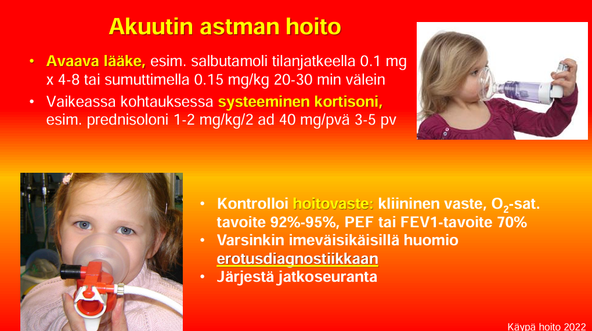
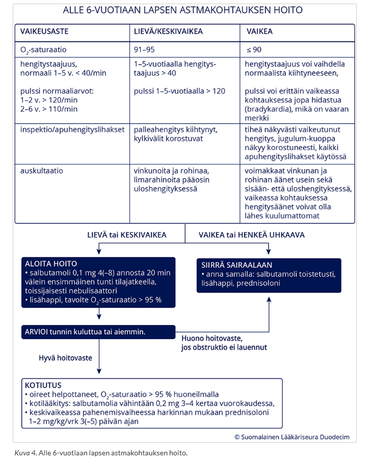
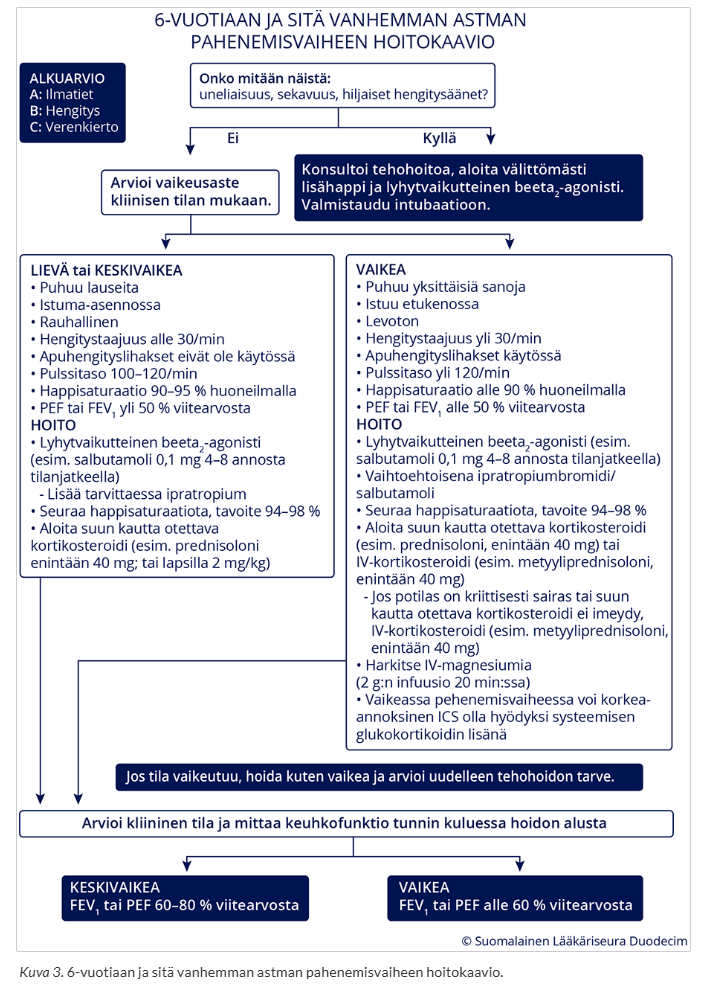
  

  <button class="solution-button"
          data-label="Diagnostiikka"
          data-hide-label="Piilota vastaus">
    Diagnostiikka
  </button>
  

      
**Astma on pitkäaikainen keuhkoputkien limakalvon tulehduksellinen sairaus,** jossa esiintyy tulehdussolujen, kuten eosinofiilisten valkosolujen, syöttösolujen ja neutrofiilien, kertymistä paikallisesti keuhkoputkien limakalvolle ja niiden alaiseen kudokseen. **Tulehdukseen liittyy keuhkoputkien sileän lihaksen lisääntyneestä supistumisherkkyydestä (hyperreaktiivisuus) ja toimintahäiriöstä johtuva vaihteleva keuhkoputkien ahtautuminen.**

Voimakas ja pitkään jatkuva astmatulehdus voi aiheuttaa limakalvolla ja sen alaisessa kudoksessa rakenteellisia muutoksia, kuten limakalvovauriota, tyvikalvon paksuuntumista, sileän lihaskerroksen paksuuntumista ja verisuoniston uudismuodostusta. 

Kouluikäisten lasten astma on patofysiologialtaan aikuistyyppinen, keuhkoputkien limakalvojen tulehdussairaus, jossa keuhkoputkissa on tulehdussolukertymää ja tyvikalvopaksuuntumaa. Leikki-ikäisten lasten astma alkaa muistuttaa patofysiologialtaan ja hoitovasteeltaan isojen lasten astmaa. Keuhkoputkien eosinofiilinen tulehdus ja tyvikalvon paksuuntuminen ovat todettavissa kolmen vuoden iästä alkaen. 

Sen sijaan alle kolmevuotiaan lapsen astma eroaa paitsi kliiniseltä kuvaltaan myös patogeneesiltaan oleellisesti isompien lasten astmasta. Pienemmillä lapsilla rakenteelliset tekijät altistavat hengitysvaikeudelle. Limakalvon turvotus flunssan aikana ahtauttaa pienikokoisia keuhkoputkia suhteellisesti enemmän kuin isokokoisia. Tämä johtaa hengitysvaikeuteen erityisesti niillä lapsilla, joilla on jo syntymästä ahtaat hengitystiet. _Lapsi voi siis oireilla pääasiassa vain infektioiden aikana ja tästä käytetäänkin usein kansankielistä termiä infektioastma (ei ole oikea diagnoosi)._ Mitä pienempi lapsi on, sitä tavallisempia ovat limaneritystä ja tulehdusta seuraavan limakalvoturvotuksen aiheuttama uloshengitysvaikeus, hengityksen vinkuna ja yskä. Osalla hengityksen vinkunasta kärsivistä pikkulapsista on poikkeava immuunivaste viruksia kohtaan. **Suurimmalla osalla ei-atooppisista alle kolmevuotiaista lapsista, joilla hengitys vinkuu toistuvasti, on kyse väistyvästä ja hyvänlaatuisesta taipumuksesta, joka korjaantuu lapsen kasvaessa.** Jos tämänkaltaisia oireita esiintyy yli kolmevuotiaana, astman riski on yli 50 %.

---

**Astman diagnostiikan periaatteet voidaan jakaa pääasiassa iän mukaan.** Tietystihän aina haluttaisiin saada mahdollisuuksien mukaan keuhkojen toimintakokeiden kautta varmistus, mutta pienillä lapsilla nämä eivät aina onnistu samalla tavalla kuin vanhemmilla. Iän myötä myös astman patogeneesi hieman muuttuu, jonka takia myös diagnostiikka eroaa aivan pienimpien ja vanhempien välillä. 

Jako tehdään erityisesti alle 3-vuotiaiden ja vanhempien välillä. Diagnostisten testien käyttö myös eroaa vanhemmassa ikäryhmässä siten, että diagnostiikka jaetaan vielä alle 6-vuotiaisiin ja kouluikäisiin (ja vielä yli- ja alle 12-vuotiaisiin). 

---

**Alle 3-vuotiailla** ei ole kansainvälisesti yhtä ainoaa oikeaa tapaa diagnosoida pienten lasten astma. Suomessa on kuitenkin sovittu, että diagnostiikka perustuu pääasiassa oirekuvaan ja riskitekijäarvioon (anamneesiin ja mahdollisesti pariin labramittaukseen). Mallissa on erotettu jatkuvasti ja toistuvasti oireilevat lapset. 

Jaksoittaiset oireet ilmenevät pääasiassa flunssien yhteydessä uloshengitysvaikeuksina. **Lapsen ensimmäistä infektiota, johon liittyy uloshengitysvaikeus ja/tai -vinkuna, kutsutaan alle vuoden ikäisellä lapsella bronkioliitiksi** (aiheuttaja klassisesti RSV, mutta vähentynyt nirsevimabin käyttöönoton jälkeen; muutkin respiratoriset virukset voivat laukaista samanlaisen taudinkuvan ja mitä vanhempi lapsi on kyseessä, sitä useammin aiheuttaja on rinovirus (tai enterovirus yms)). **Seuraavaa hengenahdistusta tai yli yksivuotiaiden ensimmäistä hengenahdistusta kutsutaan obstruktiiviseksi bronkiitiksi.**

_Kun hengenahdistus on uusinut riittävän usein, sopimuksen mukaan 3 kertaa vuoden aikana, on sovittu, että sairaus nimetään astmaksi (akuutti astma -diagnoosi (J46, kun pikkulapsella 3. lääkärin toteama uloshengitysvaikeuskohtaus tai ensimmäinen kohtaus ≥3v. lapsella; pitkäaikaisdiagnoosi (J45) mielellään vasta kun tarve säännölliseen lääkitykseen)._

Astmaa ennustavan indeksin perusteella voidaan asettaa näillä pikkulapsilla astman diagnoosi ja samalla myös määrittää ne lapset, jotka voisivat hyötyä säännöllisestä lääkekokeilusta inhaloitavalla kortikosteroidilla (ICS; 3kk lääkehoitokokeilu). **Kriteeristössä vähintään yhden pääkriteerin tai kahden sivukriteerin täyttyminen viittaa astmaan toistuvaa hengityksen vinkunaa (eli siis kolme _lääkärin toteamaa_ uloshengitysvaikeutta, jossa avaavat lääkkeet lievittävät oireita) sairastavalla pikkulapsella:**

<li>Pääkriteerit</li>
  <ul>
    <li>Lääkärin toteama astma vanhemmalla</li>
    <li>Lääkärin toteama atooppinen ihottuma</li>
    <li>Herkistyminen hengitystieallergeeneille</li>
  </ul>
<li>Sivukriteerit</li>
  <ul>
    <li>IgE-välitteinen herkistyminen ruoille</li>
    <li>Hengityksen vinkuna myös silloin, kun lapsella ei ole flunssaa</li>
    <li>Veren eosinofiilit > 4 % tai > 0,3 x 109/l</li>
  </ul>

---

Lapsilla siis määritetään atooppisen ominaisuuden selvittelynä herkistyminen aero- ja ruoka-allergeeneille seerumin spesifisen IgE:n määrityksillä (tai ihopistokokeilla). IgE-määrityksissä voidaan käyttää seulakokeita, kuten pöly- tai ruokaerittelyä. Myös leikki- ja kouluikäisillä lapsilla tulee aina astmaa epäiltäessä määrittää IgE-vaste tyypillisille hengitystieallergeeneille joko seerumiin pölyerittelyllä. Seerumin kokonais-IgE-pitoisuuden mittaamisesta ei ole hyötyä astman diagnostiikassa.

Samoin veren suurentunut eosinofiilimäärä kertoo suurentuneesta astmariskistä. Eosinofiilit kannattaa määrittää sekä tautia epäiltäessä että myöhemmin hoidon aikana toistuvastikin, koska se auttaa taudin tulehduksellisen alatyypin määrityksessä.  

---

Pikkulapsista erotetaan myös jatkuvasti/vaikeasti oireilevat, jotka voivat hyötyä ICS-hoitokokeilusta:

<li>Pahenemisvaiheita (avaavan lääkkeen tarve 4 kertaa vuorokaudessa) on ollut tiheästi eli alle kuuden viikon välein</li>
<li>Jos lapsi oireilee jatkuvasti eli lapsi on tarvinnut avaavaa lääkettä useammin kuin kahdesti viikossa yli neljän viikon ajan</li>
<li>Lapsella on ollut kaksi suun kautta otettavaa kortikosteroidikuuria alle kuuden kuukauden välein</li>

---

Tämä 3kk hoitokeiluna toteutettava inhaloitava kortikosteroidihoito on rajattu tällä tavalla, koska muuten hyvin suuri osa lapsista saisi ICS-hoitoa eikä se ole täysin haitaton hoito. Oikein valituilla pikkulapsilla ICS kyllä hoitaa tehokkaasti oireita, mutta sen varhainen aloittaminen ei vaikuta astman luonnolliseen kulkuun näin pienillä lapsilla, joilla ongelma on usein iän myötä väistyvä muutenkin. Jos riskitekijöitä ei ole ja oireilu on lievää, tilannetta seurataan.

**Tyypillisiä haittavaikutuksia ICS-hoidolla on mm:** 

<li>Kasvun hidastuminen ja lisämunuaisen lama suurilla annoksilla -- voi siis olla systeemisiäkin haittavaikutuksia</li>
<li>Kandidaasi: kortikosteroidit immunosupressiivisia ja lisäävät kasvun mahdollisuutta suun limakalvoilla; hampaiden reikiintyminen: jauheinhalaattorien aiheuttama suun pH:n lasku</li>
  <ul>
    <li>Aina tulisi purskutella suu ja sylkäistä vesi pois käytön jälkeen</li>
  </ul>
  
---

Inhaloitavat lääkkeet annetaan pienille lapsille yleensä annosaerosolina tilanjatkeen (esim. aerochamber nykyään suositelluin; myös ns. babyhaler usein käytössä) kanssa. Maski yleensä < 3-vuotiailla, suukappale, kun yhteistyö onnistuu. Lääke annostellaan tilanjatkeeseen yksi annos kerralla: rauhallinen hengitys tilanjatkeen kautta n. 5–8 kertaa jokaisen annoksen jälkeen. Kouluikäisillä voidaan käyttää jauheinhalaattoria ilman tilanjatkettakin, jos lapsi hallitsee oikean hengitystekniikan ja hänen sisäänhengitysvoimansa ja -kestonsa ovat riittävät. Lääkkeenottotekniikka näytetään ja harjoitellaan vastaanotolla; puutteellinen tekniikka on yleisin hoidon tehottomuuden syy. 

Hoito aloitetaan pieniannoksisella inhaloitavalla kortikosteroidilla: yleensä käytetään flutikasonipropionaattia 250 mikrog vuorokaudessa (125 1x2). Hoitoa tulee seurata ja tavoitteena on oireettomuus ja normaali rasituksen sieto pienimmällä tehokkaalla ICS-annoksella. Hoitokokeilun vaste arvioidaan soitolla 4-6 vk kuluttua (erotusdiagnostiikka, jos ei hoitovastetta!) ja käynnillä 3 kk kuluttua. Hoitojakson aikana oireettomuuteen pääsevien lasten lääkitys lopetetaan ja hoitoa jatketaan jaksoittaisena. Säännöllistä hoitoa syytä miettiä jos kuureja toistuvasti alle kk välein. Viimeistään silloin, kun jatkuvaa lääkitystä on tarvittu yli kuusi kuukautta, tehdään virallinen astmadiagnoosi.

Säännöllisen inhaloitavan kortikosteroidiannoksen rutiininomainen nosto esimerkiksi flunssien yhteydessä oireiden lisääntyessä ei vähennä pahenemisvaiheita tai suun kautta otettavan kortikosteroidin tarvetta lievää tai keskivaikeaa astmaa sairastavilla potilailla. Astman peruslääkehoitoa tehostetaan vain, jos epäillään inhaloitavan kortikosteroidiannoksen olevan pysyvässä hoidossa liian matala.

---

Erotusdiagnostiikka on tietysti tärkeää miettiä aina astman kanssa. Oireilu voi siis myös johtua: 

<li>Ylähengitysteissä: allerginen nuha, suurentunut kitarisa tai isommilla lapsilla poskiontelon tulehdus</li>
<li>Alahengitysteissä: vierasesine, verisuonen tai limakalvon epämuodostuma, henkitorven seinämän pehmyys/kaventuma synnynnäisesti, suurentuneet imusolmukkeet tai tuumori, isommilla lapsilla toiminnallinen äänihuulipareesi</li>
<li>Pienet hengitystiet: bronkopulmonaalinen dysplasia, kystinen fibroosi</li>
<li>Muut: sydänvika, toistuva astmaan liittymätön yskä (esim. refluksi, infektioon liittyvä yskä), immuunipuutos</li>
<li>Ennen astmadiagnoosin tekemistä on syytä harkita thoraxkuvan ottamista erityisesti pieniltä lapsilta ja sellaisilta potilailta, joilla on epäselvä taudinkuva tai lääkevaste heikko. Astmadiagnoosia ei tehdä thorax-kuvan perusteella, mutta se on hyvä ottaa muiden syiden poissulkemiseksi.</li>

---

**Astmaoireisilla leikki-ikäisillä (kolmevuotiailla tai sitä vanhemmilla) lapsilla keuhkojen toiminnan poikkeavuus pyritään osoittamaan oskillometrian avulla.**

Oskillometriassa siis mitataan hengitysteiden resistanssia (Rrs; myös reaktanssia (Xrs)). Oskillometriassa lapsi hengittää normaalin lepohengityksen aikana pienen suukappaleen kautta oskillometrialaitteeseen. Laite johtaa suun kautta keuhkoihin eritaajuisia ääni-impulsseja ja mittaa heijastunutta ääntä. Oskillometria yhdistettynä bronkodilataatio- tai ulkojuoksukokeeseen parantaa pienten lasten astmadiagnostiikan osuvuutta. Astmaan viittaa suurentunut hengitysteiden resistanssiarvo pienillä oskillaatiotaajuuksilla (R5) tai alentunut reaktanssiarvo, joka korjaantuu avaavalla lääkkeellä. Jos oskillometriassa mitattu resistanssi (Rrs5) pienenee vähintään 40 % bronkodilataatiokokeessa tai suurenee vähintään 40 % juoksurasituskokeessa, muutos on merkitsevä. Oskillometria on käytössä kaikissa Suomen keskussairaaloissa. Menetelmä on altis virheille ja edellyttää tutkimuksen suorittajalta perehtyneisyyttä ja kokemusta.

---

**Kouluikäisillä taudinmääritys kouluikäisillä tukeutuu spirometriaan (ja bronkodilataatiokokeeseen) ja yli 12-vuotiailla spirometriaan ja/tai PEF-seurantaan** (usein kuitenkin rasittavaa lapselle ja perheelle tämäkin, joten riippuu hieman potilaasta) kuten aikuisilla. PEF-seurannassa siis kotona puhalletaan 2 viikon ajan samaan aikaan 3 kertaa toistettuna aamuin ja illoin ennen avaavan lääkkeen käyttöä (salbutamoli 0.4 mg) ja 15 minuuttia sen jälkeen. 

Spirometriassa diagnostista on bronkodilataatiossa FEV1:n tai FVC:n paraneminen vähintään 12 % ja 200 ml tai se, että FEV1 pienenee merkitsevästi (vähintään 15 %) rasituskokeessa. Lapsilla rasituskoe on usein herkin astman diagnostiikan väline. PEF-seurannassa taas PEF-arvojen merkitsevä (vähintään 20 % ja 60 l/min ja vähintään 3 kertaa/2 viikkoa) vuorokausivaihtelu tai PEF-arvojen merkittävä suureneminen (vähintään 15 % ja 60 l/min ja vähintään 3 kertaa/2 viikkoa).  PEF-seurannan luotettavuus ei ole varsinkaan <12-vuotiailla lapsilla yhtä hyvä kuin aikuisilla. 

---

Vanhemmilla lapsilla inhaloitava kortikosteroidi (ICS) on ensisijainen hoito heti, kun astma todetaan. 

**Alle 12-vuotiailla astman diagnostiikka ja hoito on porrastetttu pääasiassa ESH. 7–11-vuotiailla perusterveydenhuolto hoitaa välikontrollit, jos hallinta on hyvä; muutoin diagnostiikka ja hoito toteutuvat pääosin erikoissairaanhoidossa.** Perusselvittelyt (anamneesi, peruslabrat (PVK+T, diffi, IgE-selvittelyt)) voi ottaa PTH:ssa, mutta hoitokokeilujen aloittaminen kuuluu ESH.

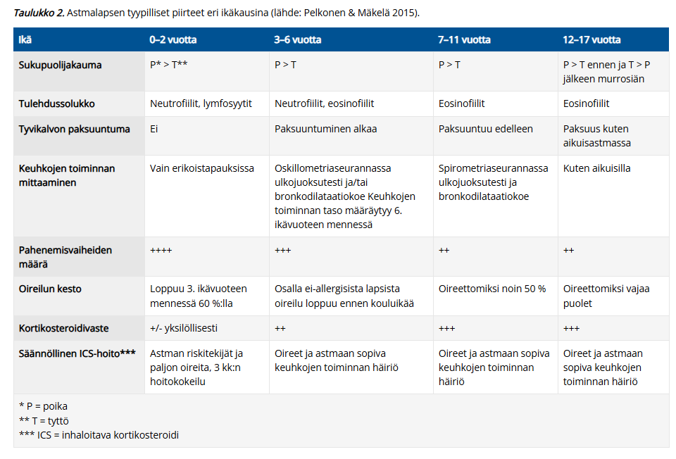
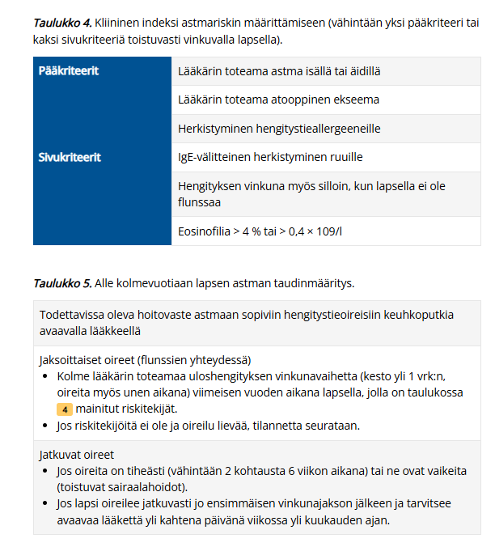
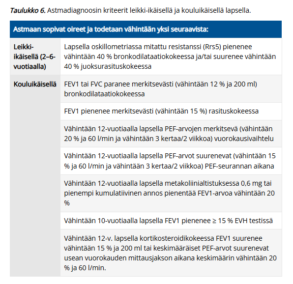
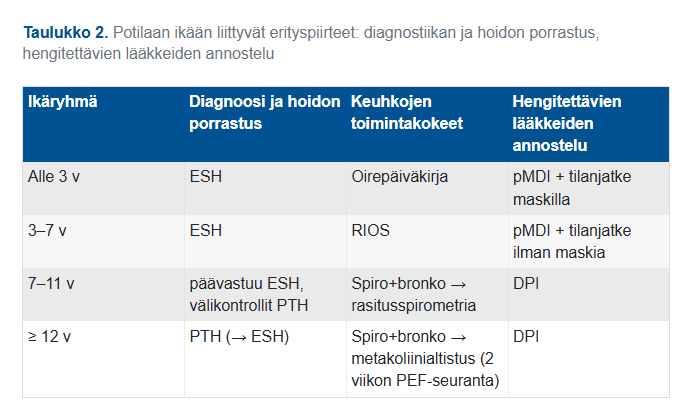
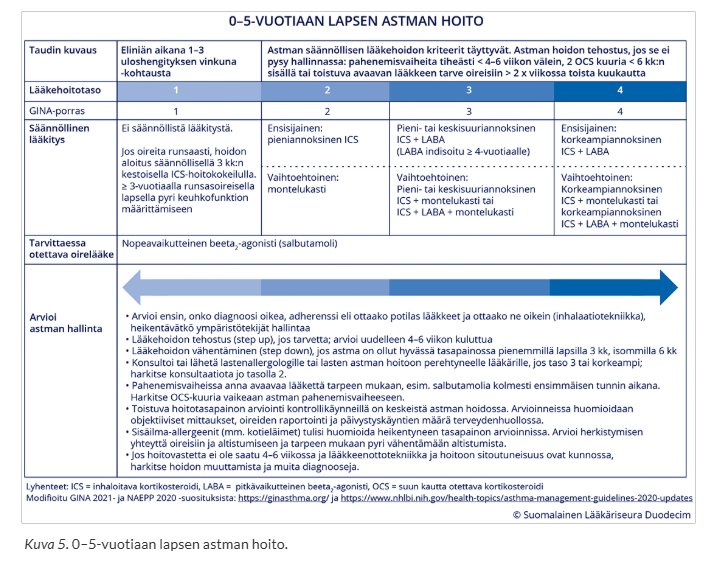
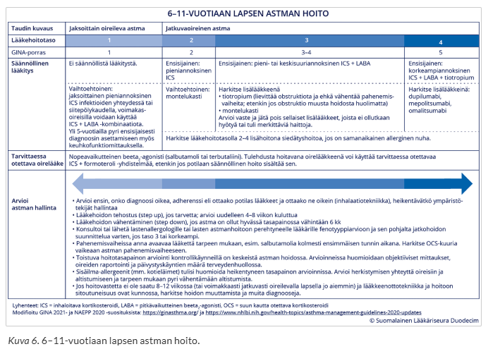

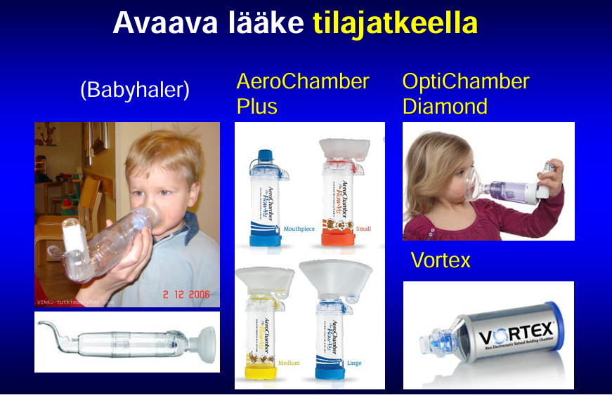
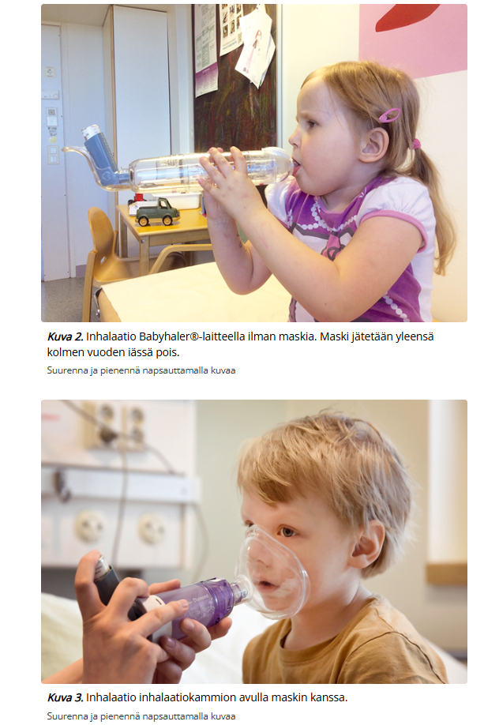
  

### 2vk ikäinen perheen ensimmäinen vauva, jolla nyt syömisongelmia, uneliaisuutta ja vanhemmat huolestuneita, lisäksi vauva keltainen, tulee tk päivystykseen. {#Keltainen-syomisongelmat}

- a. Mitä lisäkysymyksiä esität?
- b. Mitä tutkimuksia teet?
- c. Mikä on työdiagnoosi?
- d. Mitä teet

  <button class="solution-button"
          data-label="a"
          data-hide-label="a - Piilota vastaus">
    a
  </button>
  

      
Tehdään nopeasti ABCDE-arvio ja esitetään sitten/samalla kysymykset. 

<li>Taustat raskaudesta ja synnytyksestä:</li>
  <ul>
    <li>GBS-positiivisuus, infektio-oireet, millä raskausviikolla syntyi, oliko komplikaatioita</li>
  </ul>
<li>Syöminen ja eritys:</li>
  <ul>
    <li>Koska vauva on syönyt viimeksi ja kuinka paljon? Onko kastellut vaippoja (virtsan määrä)? Minkä väristä uloste on (esim. vaalea uloste voi viitata sappitieatresiaan)?</li>
  </ul>
<li>Oireiden kulku:</li>
  <ul>
    <li>Milloin uneliaisuus ja syömättömyys alkoivat? Onko keltaisuus pahentunut nopeasti vai onko se ollut samanlaista jo jatkuvammin?</li>
    <li>Onko ollut kuumetta tai alilämpöä, oksentelua, kouristelua, poikkeavaa itkua, hengityskatkoksia?</li>
    <li>Painonkehitys (onko syntymäpaino saavutettu)?</li>
  </ul>

  

  <button class="solution-button"
          data-label="b"
          data-hide-label="b - Piilota vastaus">
    b
  </button>
  

      
TK:ssa ei jäädä tekemään liian pitkiä selvittelyitä, vaan lapsi kuuluu päivystykseen. Voidaan ottaa kyllä pikasokeri ja tarvittaessa aloittaa hypoglykemian hoito, mutta ambulanssikyyti sairaalaan kuuluu järjestää nopeasti. 

  

  <button class="solution-button"
          data-label="c"
          data-hide-label="c - Piilota vastaus">
    c
  </button>
  

      
**Sepsis** (vastasyntyneen myöhään (eli >72h syntymästä) alkava) on tärkein ja vaarallisin poissuljettava työdiagnoosi. Vastasyntyneellä sepsiksen oireet ovat usein epätyypillisiä (letargia, syömättömyys, lämpöinstabiliteetti, keltaisuus)

<li>Tietysti myös mm sepsiksen kanssa tai erikseenkin esiintyviä harkittavia ongelmia ovat vaikea hyperbilirubinemia (voi johtua muustakin syystä kuin sepsiksestä), dehydraatio, hypoglykemia, aineenvaihduntasairaus, synnynnäinen sydänvika...</li>

  

  <button class="solution-button"
          data-label="d"
          data-hide-label="d - Piilota vastaus">
    d
  </button>
  

      
Nopea konsultaatio eli soitetaan lähimpään sairaalaan ja kerrotaan septisen lapsen tulosta ja tilataan ambulanssi kiireellistä siirtoa varten. 

Välitön hoito tk:ssa: hengityksen ja verenkierron turvaaminen, hypoglykemian korjaamisen aloittaminen, jos verensokeri matala (<3.3 -> limakalvoille glukoosigeeliä tai merkittävästi matalassa iv-glukoosi jos iv-yhteys saadaan nopeasti ja voidaan ylläpitää kuljetuksen aikana). 

Jos etäisyys sairaalaan on pitkä ja lastenlääkäri näin ohjeistaa, niin voidaan avata suoniyhteys (i.v.) ja aloittaa nesteytys (ja ehkä jopa iv-antibiootti veriviljelyiden oton jälkeen, jos näin ajatellaan olevan järkevää tehdä). 

Kerrotaan vanhemmille rauhallisesti mutta rehellisesti, että vauva on väsynyt ja tarvitsee sairaalatutkimuksia, ja että ambulanssi vie heidät lastenlääkärin arvioon

  

### Verikoetulokset - mitä epäilet ja mitä tehdään {#Verikoetulokset}

Ei esimerkkiverikoetuloksia wikissä, mutta kerrottu, minkä epäilyn ne herättäneet. Tässä kurssin materiaaleista hakemani esimerkkiverikoetulos, vastaa sen perusteella: 

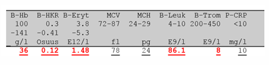

  <button class="solution-button"
          data-label="Vastaus"
          data-hide-label="Piilota vastaus">
    Vastaus
  </button>
  

      
Verenkuvassa on kolmen solulinjan muutos: merkittävä anemia, trombosytopenia ja massiivinen leukosytoosi. Tämä herättää ensisijaisesti epäilyn **akuutista leukemiasta.** 

**Potilas tarvitsee välittömästi siirron yliopistosairaalaan** ja seuraavaksi kuuluukin soittaa päivystäjälle ja ilmoittaa leukemiaepäilyn tulosta. Mitään laajoja selvityksiä ei tarvita tk-tasolla, mutta päivystäjä voi ehkä määrätä tilanteesta/etäisyydestä riippuen ottamaan veriviljelyt, aloittamaan jo antibiootin, ottamaan valmiiksi diffin yms. Järjestetään **ambulanssikyyti** ja siirretään lapsi sairaalaan, jossa seuraavana arkiaamuna otetaan yleisanestesiassa luuydinnäyte, likvornäyte ja mahdollisesti annostellaan jo ensimmäinen annos lääkettä.

Lapsi tulee todennäköisesti olemaan sairaalassa viikkoja, joten vanhemmille kannattaa jo siirtoa edeltävästi ehdottaa, että ottavat sairaalaan mukaan ainakin tärkeimmät tarvittavat asiat, joiden avulla selviävät ainakin muutaman päivän. Ei tarvitse sanoa, että nyt on varmuudella leukemia kyseessä, mutta voi sanoa, että verenkuvan perusteella lapsi tarvitsee nyt lisäselvityksiä yliopistosairaalassa. 

  

### Otiitin tyypilliset aiheuttajat (mitkä patogeenit)? Onko mikrobilääkkeestä hyötyä ja mikä on suositeltavin vaihtoehto? {#Otiitti}

  <button class="solution-button"
          data-label="Vastaus"
          data-hide-label="Piilota vastaus">
    Vastaus
  </button>
  

      
Useimmissa akuuteissa välikorvatulehduksissa (AOM) kyseessä on **bakteerin ja viruksen aiheuttama sekainfektio.** Äkillinen välikorvatulehdus siis ilmaantuu useimmiten ylähengitysteiden virusinfektion aikana tai heti sen jälkeen. Johtuu siitä, että nenänielun inflammaatio voi aiheuttaa korvatorven turvotusta ja tukkeutumista ja värekarvatoiminnan häiriöitä. Korvatorven obstruktio johtaa ilmastoitumisen ja tyhjenemisen heikentymiseen ja välikorvan alipaineeseen. Värekarvatoiminnan häiriöt helpottavat bakteerien kertymistä. Nämä tekijät johtavat välikorvan bakteeritulehdukseen viraalisen ylähengitystieinfektion yhteydessä. 

Yleisimmät bakteerit ovat **Streptococcus pneumoniae, Haemophilus influenzae (non-typeable) ja Moraxella catarrhalis.** Tavallisimmat välikorvatulehduksiin liittyvät virukset ovat rino-, RS-, entero- ja bokavirus. 

**Mikrobilääkkeestä on usein otitis mediassa hyötyä. AOM siis paranee yleensä spontaanisti, mutta ab-hoito voi nopeuttaa paranemista ja ehkäistä komplikaatioita.** Ab-hoitoa ei tarvitse aina suoraan aloittaa kaikille, joilla todetaan äkillinen välikorvatulehdus. Päätöksessä huomioidaan lapsen kokonaistilanne, arvioidaan lääkityksen haitat ja otetaan huomioon myös perheen toiveet. **On esitetty, että alle 2 vuoden ikä, molemminpuolinen tulehdus ja vuoto tärykalvolta puoltaisivat antibioottihoidon aloitusta.** 

Jos päädytään siihen, ettei antibioottihoitoa aloiteta, lapsi tulee tutkia uudelleen 2–3 päivän kuluttua, jollei hän ole selvästi paranemassa. Yleisesti käytetty vaihtoehto hoidossa on myös on ns. viivästetty antibioottikuuri, jossa kirjoitetaan resepti kotiin ja lääke aloitetaan, mikäli lapsi ei ole selvästi parempi 2-3vrk kuluttua -> aikaa ja resursseja säästyy eikä tarvitse toista käyntiä.

Ensisijainen antibioottivalinta äkillisen välikorvatulehduksen (AOM) hoidossa on yleensä **p.o. amoksisilliini (40 mg/kg/vrk) tai amoksisilliini-klavulaanihappo (40/5,7 mg/kg/vrk) (2 tai) 3 annokseen jaettuna. Hoitoaika 5-7vrk.** Antibiootin valinnassa tulee ottaa huomioon lapsen kokonaistilanne sekä lääkkeen haittavaikutusprofiili ja alueellinen aiheuttajabakteerien herkkyystilanne. Penisilliinille allergisille lapsille voidaan käyttää kefakloria, kefuroksiimiaksetiilia, sulfa-trimetopriimia, atsitromysiiniä tai klaritromysiiniä. 
  

### 2kk ikäinen lapsi, joka kasvanut kk aikana 2cm pituutta ja saanut 50g/vko painoa lisää, mitä voisi olla syinä hidastuneeseen kasvuun, mihin kiinnität huomiota tutkiessasi, mitä ohjelmoit jatkoon? {#2kk-kasvu}

  <button class="solution-button"
          data-label="Vastaus"
          data-hide-label="Piilota vastaus">
    Vastaus
  </button>
  

**Alle 3kk-ikäisillä painonnousun tulisi olla n. 150(-200)g/viikko** ja n. 3-4cm/kuukausi. Painon nousu normaalisti hidastuu tasaisesti ja noin 3–6 kuukauden iässä nousu on noin 125-150g/viikko (voi ajatella 0.5kg) kuukaudessa. Sitten 6-9kk 100g/vk ja 9-12kk 50-75g/vk. Paino siis tuplaantuu 4 kk:ssa ja triplaantuu 12 kk:ssa  => +6-7 kg ja +25 cm / 1. vuosi (Toisella vuodella +2,5 kg ja +10-12 cm)

Kyseessä on siis tällä 2kk ikäisellä hidastunut kasvu. Tärkeintä pienten imeväisten kasvun kehityksen seurannassa on paino, koska pituusmittaukset voivat olla hyvin heitteleviä mittausteknisistä syistä sekä lapset usein vasta hakevat kasvukanavaansa tässä vaiheessa eikä muutenkaan näin lyhyellä aikavälillä voida tehdä merkittäviä päätelmiä pituuskasvusta usein. 

---

Hidas kasvu (failure to thrive) johtuu useimmiten **riittämättömästä energian saannista**, joskus imeytymisen häiriöstä, mutta myös lisääntynyt energian kulutus on huomioitava. 

<li>Riittämätön energian saanti voi johtua _heikosta maidon tuotannosta_ (huom. ei suoraan tarkoita, että jos äiti ei saa pumpattua maitoa hyvin, että maidon tuotanto olisi heikkoa, vaan vaikka pumpatessa tulisi heikosti, niin lapsi kyllä saa usein hyvin imettyä), vauvan ongelmista saada imettyä (huono imuote tai esim. rakenteellisiset syyt (esim. suulakihalkio)) tai sitten liian harvoin/vähäisin määrin annetusta ruokinnasta.</li>
<li>Voi myös olla imeytymishäiriö, kuten korvikeruokituilla lehmänmaitoallergia tai jokin rakenteellinen este, kuten pylorusstenoosi.</li>
<li>Energian kulutus lisääntyy, jos lapsella on esim. infektio tai synnynnäinen sydänvika. Myös kroonisesti hengitysvaikeuksia aiheuttavat sairaudet voivat lisätä energiankulutusta.</li>

---

Anamneesi usein paljastaa ongelman ytimen: 

<li>Kasvuhistoria: Paino ja pituuskehitys tähän saakka</li>
<li>Ravitsemus: Onko täysimetetty vai korvikeruokinnalla? Kuinka usein syö ja kuinka pitkään? Jaksaako imeä aktiivisesti vai uupuuko? Jos käytetään korviketta, kuinka monta millilitraa vuorokaudessa menee?</li>
  <ul>
    <li>Normaalisti vauva syö noin 3-4 tunnin välein ja jopa useammin; normaalisti syötetään vauvaehtoisesti eli nälän tullessa. Imetyskertojen kesto ja väli vaihtelee. Vauva voi syödä kolme kertaa tunnissa, kolmen tunnin välein tai kolme tuntia yhtämittaa.</li>
    <li>Noin viikon iästä alkaen terve vauva syö äidinmaitoa noin 150–200 millilitraa jokaista painokiloaan kohti eli noin 1/6-1/5 painostaan päivässä. Maitomäärä nousee noin 700–1200 millilitraan vuorokaudessa ja kiinteiden ruokailujen alkaessa maitoa tai vieroitusvalmistetta suositellaan annettavaksi noin 5–6 desilitraa päivässä aina yhden vuoden ikään asti.</li>
    <li>Yksittäinen ruokintakerta muuttuu iän myötä (ensimmäisinä päivinä todella vähän jaksaa, kasvaessa myös ruokamäärät kasvavat). Voi vaikka ajatella, että jos lapsi tarvitsee 700ml maitoa vuorokaudessa ja syö 8 kertaa päivässä, niin yksittäinen ruokailukerta tulisi olla n. 90ml.</li>
  </ul>
<li>Eritys: Kuinka monta märkää vaippaa tulee vuorokaudessa (normaalisti 5–7)? Tuleeko kakkaa (voi olla täysimetetyllä hyvinkin vaihtelevaa; riippuen muistisäännöstä jopa 10krt päivässä tai 1krt 10:ssä päivässä) ja millaista se on (onko verta tai limaa tai onko se vaaleaa)?</li>
<li>Oireet ruokailun yhteydessä: Hikoileeko vauva otsasta syödessään? Tuleeko suihkumaista oksennusta?</li>
<li>Yleisvointi ja uni: Onko vauva itkuinen ja ärtyisä, vai päinvastoin poikkeavan unelias ja veltto?</li>
<li>Raskaus ja synnytys: Syntymäpaino? Onko suvussa allergioita tai sydänvikoja?</li>

---

Statuksessa:

<li>Tarkat mitat: paino, pituus, päänympärys</li>
  <ul>
    <li>Kannattaa ottaa myös **syöttöpunnitus** eli mitataan lapsen paino ennen imetystä ja imetyksen jälkeen (vaatetettuna; koitetaan simuloida mahdollisimman normaalia ja mukavaa imetystilannetta). Välttämättä yksi punnituskerta ei riitä, vaan arvio voidaan joutua toistamaan.</li>
  </ul>
<li>Yleistila: Iho, aukileet, lihasjänteys, nestetasapaino</li>
<li>Sydän ja keuhkot: auskultaatio, taajuus</li>
<li>Vatsan palpaatio: resistenssejä, aristusta, maksa suurentunut...</li>
<li>Suun tarkastus: kireä kielijänne tai suulakihalkio (häiritsevät imemistä)</li>

---

Tutkimukset ja jatkotoimenpiteet riippuvat tilanteesta.

<li>Jos yleistila hyvä, niin ei yleensä tarvita merkittäviä labroja. Riittää, että ohjeistetaan syömisen tehostaminen ja kontrolli. Otetaan syöttöpunnitus ja terveydenhoitaja tarkistaa imetystekniikan.</li>
  <ul>
    <li>Äitiä kannustetaan imettämään tiheämmin 10–12 kertaa/vrk yö mukaan lukien. Jos syöttöpunnituksen mukaan yksittäinen ruokintakerta on liian vähäinen, niin voidaan suositella myös täytöt imetyksen päälle erotuksen verran (aina siis imetetään ensin, sitten täytetään lisää pullosta korviketta/pumpattua rintamaitoa kunnes saavutetaan tavoiteltu kerta-annos; yli 4 kuukauden ikäiselle voi jo tarjota täytöksi kiinteitä ruokia maisteluannoksina; Mikäli lapsi on jo aloittanut lisäruuat, lisätään lapsen soseisiin tai puuroihin kasviöljyä normaalin rasvalisäyksen lisäksi 2–3 tl/pv.)</li>
    <li>Painokontrolli 1vk päähän; voi olla terveydenhoitajankin vastaanotto. Jos kasvu lähtee korjautumaan, niin ei tarvitse muuta hoitoa.</li>
  </ul>
<li>Allergiaepäilyssä (esim. jos oireita kuten limaisia verikakkoja tai vaikeaa ihottumaa), niin maitoeliminaatiodieetti 1-2vk sopivilla korvikkeilla. Tarvittaessa lähete ESH, jos oireet vähenevät. </li>
<li>Jos paino ei kohene ruoan lisäämisellä ja ruoan lisääminen on oikeasti toteutunut, niin tällöin kyllä kannattaa lähettää ESH. Voidaan ottaa mm. gluk, PVK, CRP, La, Krea, U-kemseul, TSH, T4v, (keliakiaseula jos olisi vanhempi ja gluteenipitoiset ruoat aloitettu), Na, K, Ca-Ion, Pi, Afos, astrup jos mahdollista</li>
<li>Jos esim. sivuäänen perusteella epäily synnynnäisestä sydänviasta, niin lähete lastenkardiologin arvioon</li>
<li>Jos vauva kuivunut, letarginen tai yleistilaltaan huono -> päivystyksellisesti lastensairaalaan</li>

  

### 14v tytön verikoetulos (PVKT) {#Tyton-PVKT}

- a. Tulkitse verikoetulos (wikissä tarjotun vastauksen perusteella napattu sopiva esimerkkikuva oppimateriaaleista)
- b. 3 todennäköisintä erotusdiagnoosivaihtoehtoa
- c. Mitä jatkotutkimuksia? Miten hoidat? Miten seuraat?

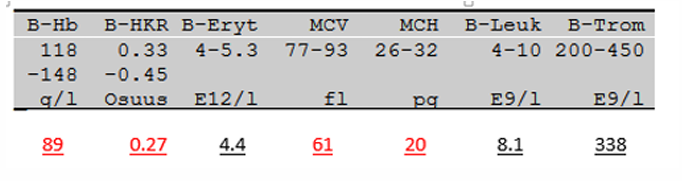

  <button class="solution-button"
          data-label="a"
          data-hide-label="a - Piilota vastaus">
    a
  </button>
  

Kyseessä **mikrosytäärinen anemia** (MCV ja Hb matala). Samalla tietysti myös Hkr (hematokriitti eli kuinka suuri tilavuusosuus verestä on punasoluja) ja MCH (punasolujen keskimääräinen hemoglobiinin määrä -> matalana näkisi hypokromiaa mikroskoopin alla) ovat matalat. Ei muiden solulinjojen poikkeavuutta.

  

  <button class="solution-button"
          data-label="b"
          data-hide-label="b - Piilota vastaus">
    b
  </button>
  

Yleisin mikrosytäärisen anemian aiheuttaja niin lapsilla kuin aikuisilla on **raudanpuuteanemia.** Taustalla voivat olla runsaat kuukautiset, kasvupyrähdys, kilpaurheilu tai esimerkiksi tiukka kasvis- /vegaaniruokavalio. Myös keliakia voi olla taustalla. Harvinaisempi syy esim. IBD, kun tulehduksellisissa suolistosairauksissa raudan menetys voi olla lisääntynyttä ja imeytyminen häiriintynyttä, ja lisäksi kroonisiin sairauksiin liittyvä inflammaatio huonontaa raudan hyväksikäyttöä. Pienellä leikki-ikäisellä raudanpuute voi johtua rautaköyhän lehmänmaidon runsaaseen käyttöön liittyvästä tihkuvuodosta suoleen sekä maidon kalsiumin aiheuttamasta raudan imeytymisen hidastumisesta. 

Tietysti myös harvinaisemmat syyt, kuten **talassemiat** (varsinkin ulkomaalaistaustaisilla) tulee pitää mielessä. Talassemioiden PVK:lle tyypillistä on se, että Eryt on koholla (toisin kuin raudanpuutteessa punasolujen määrä on vähentynyt) ja MCV on hemoglobiiniin suhteessa suhteettoman matala (kun taas raudanpuutteessa MCV usein seuraa Hb:n vaikeusastetta). Talassemiat ovat tärkeä tunnistaa, koska niitä ei hoideta rautalisällä ja väärin aloitettu rautalääkitys on talassemiapotilaalle jopa vaarallinen (raudan kertymisen vaara korkea, koska raudan imeytyminen on tehostunut). 

Myös **kroonisen taudin anemia (tulehdusanemia)** voi pitkittyneenä johtaa mikrosytääriseen anemiaan. 

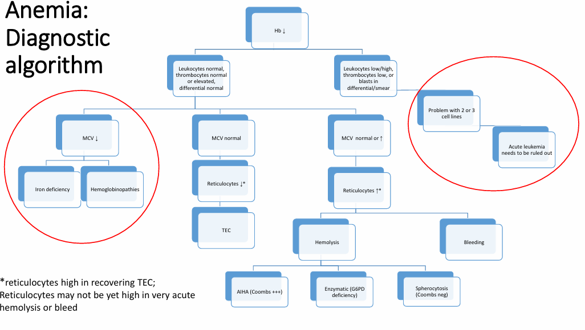

  

  <button class="solution-button"
          data-label="c"
          data-hide-label="c - Piilota vastaus">
    c
  </button>
  

Anamnestisesti tärkeää kysyä mm. kuukautisvuotojen määrä (esim. vuotopäiväkirja), urheilu, ruokavalio, mahdolliset vatsaoireet (ripuli, turvotus, vatsakivut) sekä suvun tausta. Myös kasvukäyrät tietysti tärkeää tarkastaa. 

Lapsen anemiassa tulisi poissulkea heti leukemia ja hemolyyttinen anemia. Jos ei ole selvästi mikrosytäärinen ja raudanpuutteeseen viittaava anemia, niin poissulku tapahtuu tutkimalla TVK (diffi) ja retikulosyytit (ja samalla usein vähintään Coombs AIHA:n poissulkuun). _Mikrosytoosin toteaminen kuitenkin viittaa raudanpuutteeseen ja käytännössä sulkee pois leukemioiden ja punasolujen tuotantovian mahdollisuuden, mikäli muista solulinjoista ei ole pulaa. Myöskään hemolyysiä ei todennäköisesti ole, koska ei ole normo- tai makrosytäärinen anemia kyseessä._

Rauta-arvojen mittaaminen ei sinänsä ole pakollista, sillä jos ei ole muiden verisolujen poikkeavuutta ja Hb- ja MCV-arvot ovat samassa suhteessa pienet, kyseessä on yleensä raudanpuuteanemia. Yleensä kuitenkin kannattaa ottaa jo primäärivaiheessa varmistavana tutkimuksena Ferrit ja TfR (TfFeSat ei ole kovinkaan yleisessä käytössä lapsilla, vaikka aikuisilla siitä onkin paljon hyötyä esim. sydämen tai munuaisten vajaatoiminnan hoidossa, sillä se ohjaa iv-rautahoitoa näiden yhteydessä). Hoidon voi kylläkin aloittaa raudanpuuteanemiana ilman rautalabroja. Keliakia kannattaa herkästi seuloa keliseulalla (ttgaba + iga). 

**Suun kautta otettava rautalisä** on helppo ja turvallinen tapa korjata raudanpuute. Voidaan antaa tälle tytölle esim. 100mg/vrk joka toinen päivä (pediatrinen annostelu on yleensä n. 2–5 mg/kg (max 100mg/vrk)). Rauta imeytyy parhaiten happaman ruuan tai juoman kanssa annosteltuna, ja kun vältetään maitotuotteiden samanaikaista nauttimista.

<li>**Raudanpuutediagnoosin varmistaa hyvä vaste rautahoidolle; noin 10-14 vrk:n kuluttua kannattaa kontrolloida Hb ja Retik;** retikulosyyttiluvun (ja RDW:n, mutta ei usein printata tätä arvoa) pitäisi suurentua, vaikka merkittävää hemoglobiinitason (tai MCV-arvon) nousua ei vielä havaittaisikaan. Voi vielä kontrolloida myöhemminkin tilanteen, jotta näkee, milloin Hb on normalisoitunut.</li>
<li>Jatka rautahoitoa vähintään 3 kk sen jälkeen, kun Hb on normaalistunut. Yleensä 4-6 kuukauden rautahoito on riittävä, ja rautalisä voidaan lopettaa, kun ferritiini on normaalistunut (edellyttäen, ettei mitään akuutin faasin reaktiota ole käynnissä). Hb tai MCV ei yleensä enää suurene, kun ferritiini on saavuttanut tason 20–25.</li>

  

### 1,5v. verikoetulos, jossa Hb 85, Hkr 0.27, MCV 60, retik 1.0%, leuk 7.0, trom 550. Pituus SD +1 ja painoprosentti +20 % {#1.5v-verikoe}

Tulkitse verenkuva. Anna todnäk diagnoosi, sen hoito ja ohjeet vanhemmille. 

  <button class="solution-button"
          data-label="Vastaus"
          data-hide-label="Piilota vastaus">
    Vastaus
  </button>
  

Mikrosytäärinen anemia, lievä trombosytoosi. Ei retikulosytoosia. Leukosyytit normaalitasolla.

Yli 1-vuotiailla, pulskilla ja näennäisesti hyväkuntoisilla lapsilla (kuten tässä hyvä pituuskasvu ja pituuspaino +20 %) taustalla on usein ns. **maitoanemia.** Lehmänmaidossa on erittäin vähän rautaa, sen kalsium estää raudan imeytymistä, ja suuri maidon juonti vie lapsen vatsassa tilaa rautapitoiselta kiinteältä ruoalta sekä voi aiheuttaa tihkuvuotoa -> johtaa raudanpuuteanemiaan. 

Raudanpuutteen takia retikulosyytit eivät ole koholla anemiasta huolimatta, koska luuydin ei pysty raudanpuutteessa lisäämään tuotantoaan -> syynä ei siis ole hemolyysi tai punasolujen menetys. Trombosytoosi on reaktiivinen raudanpuutteelle (yleinen löydös raudanpuutteessa; mekanismina oletettavasti se, että anemia aiheuttaa EPO:n upregulaation, mutta raudanpuutteessa tämä ylimääräinen EPO ei pysty stimuloimaan tehokkaasti punasolujen tuotantoa (rautaa eli tarvittavaa raaka-ainetta puuttuu), jolloin EPO:n stimulatorinen vaikutus siirtyy enemmän ohjaamaan megakaryosyyttien kehittymistä ja siten muodostuu lisää verihiutaleita).  

_Tutkia tulisi ravitsemusanamneesi, suolisto-oireet, mahdollisesti keliseul (ttgaba+iga) sekä diagnoosin voi varmistaa ottamalla ferrit ja tfr jo tässä vaiheessa._

Hoitona maitotuotteiden käytön rajoittaminen suosituksiin eli ad 5-6dl/vrk. Samalla yleensä aloitetaan tyypillinen raudanpuutehoito eli p.o.-rauta 2-6mg (max 100mg) joka toinen päivä ja tällä lapsella paras vaihtoehto on Obsidan Fe2+, jonka kapselin voi avata ja siten annostella sopiva määrä rakeita. Sukrosomiaalinen rauta (Sideral) on myös hyvä, mutta on kalliimpi ja siinä annostelu on erilainen (pienille 14mg x1, kouluikäisille ja vanhemmille 30mg x1). Nestemäisiä rautavalmisteita ei suosita, jos hampaat ovat puhjenneet, koska ne värjäävät ne (ja usein imeytyvät huonommin). 

Kontrolloidaan PVK+T ja Retik taas n. (1-)2vk kohdalla ja siinä retikulosyyttivaste (tai RDW:n kohoaminen) osoittaa hoitovasteen. Sitten kontrolloidaan esim. parin kuukauden päästä kunnes Hb on normaalistunut ja jatketaan hoitoa vielä 2-3kk varastojen täyttämiseksi eli yhteensä hoito 4-6kk. 

  

### 14-vuotias, jolla vesirokkoepäily, ei ole sairastanut tai saanut rokotetta. Perussairautena atooppinen iho. {#14v-vesirokko}

- a. Todennäköinen/näköiset aiheuttaja(t)
- b. Onko mikrobilääkkeestä hyötyä, jos on niin mikä?

  <button class="solution-button"
          data-label="a"
          data-hide-label="a - Piilota vastaus">
    a
  </button>
  

Vesirokon aiheuttaja on **varicella zoster viruksen** (VZV) aiheuttama tauti, joka ennen rokotuksia yleensä sairastettiin alle 6-vuotiaana; nykyään tapaukset ovat vähentyneet rokotusten aloittamisen takia. 

<li>Noin kahden viikon kuluttua tartunnasta vesirokkovirus aiheuttaa kuumeen ja tyypillisen ihottuman. Rakkulaihottumassa voidaan nähdä samanaikaisesti eri kehitysvaiheissa olevia ihomuutoksia. Alkuvaiheen makuloista kehittyy papuloita ja sitten varsinaisia kirkkaita ja sameita rakkuloita, jotka rupeutuvat taudin parantuessa. Iholla voi yhtä aikaa olla useita satoja eri vaiheissa olevia ihomuutoksia. Vesirokkomuutoksia voi kehittyä myös suun ja silmien limakalvoille. Taudin ihottumavaihe kestää noin viisi päivää. Vesirokkoihottuma on keskittynyt vartalon ja pään alueelle toisin kuin esimerkiksi enterorokossa, jossa usein kämmenissä ja jaloissa on eniten ihottumamuutoksia. On tartuttava 1-2vrk ennen ihottumaa ja kunnes rakkulat rupeutuneet.</li>
<li>Komplisoitumaton taudinkuva terveellä henkilöllä ei yleensä edellytä diagnostisia laboratoriotutkimuksia. Tarvittaessa muissa tilanteissa voidaan ottaa PCR-näyte rakkulaeritteestä/-pohjasta.</li>
<li>Komplikaatiot tulee pitää mielessä:</li>
  <ul>
    <li>Sekundaariset ihon bakteeri-infektiot (S. aureus, GAS, nekrotisoiva faskiitti); tälle atooppinen iho altistaa entisestään ihon suojabarrieria häritsemällä</li>
    <li>Meningoenkefaliitti</li>
    <li>Ohimenevä pikkuaivoataksia (post-infektioosi pikkuaivotulehdus päiviä-kuukausia infektion jälkeen; paranee spontaanisti)</li>
  </ul>

---

Voi myös erotusdiagnostisesti muistaa mm. eczema herpeticumin, joka on HSV-1 tai HSV-2 aiheuttama ihoinfektio, jolle atooppinen iho altistaa. Siinä kuitenkin rakkulat ovat enemmät monomorfisia, lähemmin ryhmittyneitä ja konsentroituneita ekseema-alueilla sekä usein enemmän kivuliaita.

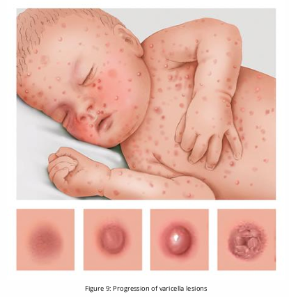
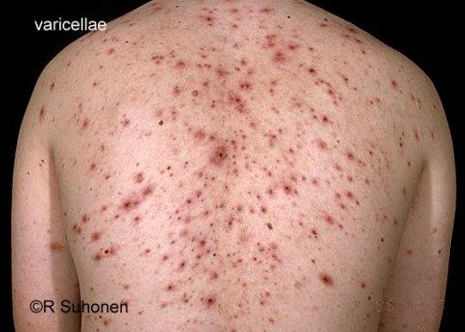

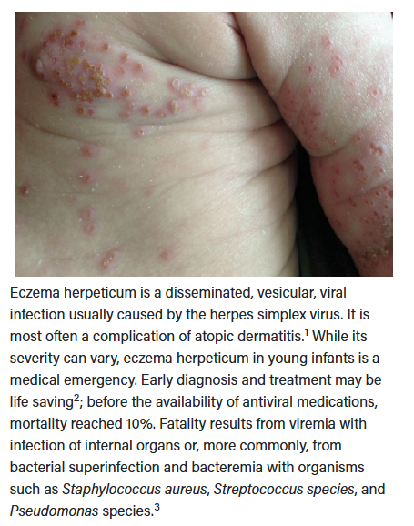
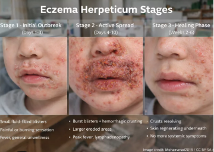

  

  <button class="solution-button"
          data-label="b"
          data-hide-label="b - Piilota vastaus">
    b
  </button>
  

      On, asikloviiri/valasikloviiri
      
Aiemmin terveen lapsen vesirokkoa ei yleensä tarvitse hoitaa viruslääkkein.

**Yli 12-vuotiaat** nuoret ja aikuiset ovat kuitenkin aina vesirokon komplikaatioiden suhteen riskiryhmä, samoin henkilöt, joilla on krooninen keuhko- tai ihosairaus. Heille **asikloviiri tai valasikloviiri** on usein järkevä hoitovaihtoehto, vaikka vielä ei olisikaan kehittynyt komplikaatiota. _Hoitovaihtoehdot lapsilla, joilla on normaali munuaisfunktio:_

<li>Asikloviiri 20 mg/kg (enintään 800 mg) 4 kertaa vrk:ssa 5 vrk:n ajan tai kauemmin, jos rakkulat eivät ole kuivuneet</li>
<li>Vähintään 2-vuotiaille on mahdollista käyttää valasikloviiria annoksella 20 mg/kg (enintään 1 000 mg) 3 kertaa vrk:ssa 5 vrk:n ajan tai kauemmin, jos rakkulat eivät ole kuivuneet</li>
<li>Komplisoituneessa taudissa iv-asikloviiri, samoin jos immunosuppressoitu (harkiten po, jos lievä taudinkuva ja vakavan sairauden riski on arvioitu vähäiseksi).</li>
<li>Jos ei vielä ole oireita eikä ole immunisoitu sairautta vastaan (2 rokoteannosta tai on sairastanut vesirokon), niin altistuneille voidaan harkita ehkäisyä vesirokkorokotteella (jos aikaisemmin terve) viimeistään 5vrk altistuksesta tai immuunipuutteisilla zosterimmunoglobuliinilla ja/tai asikloviirilla (asikloviiriä voidaan myös käyttää aiemmin terveelle rokottamattomalle, kun ei ole tietoa sairastetusta vesirokosta ja rokotetta ei pystytä antamaan 3-5pv sisällä altistuksesta)</li>

---

**Antiviraalisen lääkityksen teho on paras taudin alussa.** Immunokompetenteilla henkilöillä virus ei enää lisäänny _72 t:n kuluttua ihottuman alusta. Sen jälkeen aloitetusta antiviraalisesta hoidosta ei ole enää hyötyä._ Immuunipuutteisilla henkilöillä viruksen lisääntyminen voi kestää pidempään, jolloin hoito on aiheellista aloittaa myöhemmässäkin vaiheessa, etenkin jos uusia iholeesioita vielä muodostuu.

---

Kutinaa voi hoitaa väsyttämättömillä antihistamiineilla. Ihon sekundaarisen bakteeri-infektion hoito tarvittaessa antibiootilla.

  

### 4 v lapsi, gradus 2/6 sivuääni: Anamneesi, status ja diagnoosi? {#Gr2murmur}

  <button class="solution-button"
          data-label="Vastaus"
          data-hide-label="Piilota vastaus">
    Vastaus
  </button>
  

4-vuotiaalla lapsella todettava gr 2/6 sivuääni on suurella todennäköisyydellä hyvänlaatuinen eikä aina vaadi jatkoselvittelyjä. 

---

      
Synnynnäinen sydämen rakennevika on yleisin synnynnäinen rakennepoikkeavuus ja sellainen todetaan n. **1%:lla lapsista.** On kuitenkin tärkeää tiedostaa, että **n. 50%:lla lapsista kuullaan ainakin joskus sivuääni** (ja jopa 80%:lla päivystyspotilaista). Oireettoman lapsen sivuääni on useimmiten hyvänlaatuinen, vaikkakin joskus taustalta löytyy seurantaa tai hoitoa vaativa rakenteellinen sydänvika. Kaikissa rakennevioissa ei aina kuulla sivuääntä alkuvaiheissa eikä joskus koskaan. 

Tarvittaessa jatkotutkimuksista tärkein on yleensä sydämen kaikukuvaus, mutta se ei ole tarpeellinen kaikilla. Thx-rtg ei kuulu sydämen sivuäänen vuoksi tehtäviin perustutkimuksiin, sillä sydänvarjo ja keuhkoverekkyys voivat olla normaalit rakenneviasta huolimatta (tutkitaan kyllä, jos epäillään sydämen vajaatoimintaa; _sydämen vajaatoimintaa epäiltäessä kannattaa lapset kuitenkin yleensä lähettää päivystykseen_). 

---

Sydämen ns. **hyvänlaatuinen sivuääni on soinnillinen, alku- tai keskisystolinen, voimakkuudeltaan 1–2/6 ja se voi kuulua rintakehän etupuolelta miltä kuuntelualueelta tahansa.** Valtaosassa tapauksista nämä sivuäänet ovat _fysiologisia virtausääniä_ ja siten luonteeltaan vaarattomia. Nämä lapset ovat terveitä ja sydämen suhteen oireettomia. Yli puolella terveistä lapsista on kuultavissa sydämestä sivuääni jossain vaiheessa lapsuutta. Kun muistaa, että rakenteellisten sydänvikojen esiintyvyys on vajaat 1 % ja että jopa 90–95 % merkittävistä sydämen rakennevioista löytyy vastasyntyneiltä tai imeväisikäisiltä lapsilta, on helppo ymmärtää, että suurin osa leikki- ja kouluikäisiltä lapsilta – usein sattumalöydöksenä – kuuluvat sivuäänet ovat vaarattomia.

**Hyvä anamneesi ja huolellinen status** ovat avainasemassa sydämen sivuäänen selvittelyssä. 

<li>Anamneesista mm. sukuhistoria, rasituksensiedon heikkeneminen, vatsakivut, huono ruokahalu, oksentelu, infektio-oireet, kehityksen kulku, muita oireita?</li>
  <ul>
    <li>Infektio tulee osata ottaa huomioon, koska infektion yhteydessä kuuluva sivuääni on hyvin tavallinen löydös (lisää verenkierrollista stressiä), joka voidaan tarvittaessa kuunnella uudelleen kiireettömästi lapsen toivuttua infektiosta. Jos kuuntelulöydös ei kuunteluolosuhteiden vuoksi ole luotettava, suositellaan kiireetöntä uusintakuuntelua neuvolassa seuraavan ikäkausitarkastuksen yhteydessä</li>
  </ul>
<li>Statuksessa **sydämen auskultaatio kaikilta kuuntelualueilta (myös selästä aina; paras paikka kuulla koarktaatio),** keuhkojen auskultaatio, **nivuspulssistatus, maksan palpaatio** (lapsilla harvoin kehittyy perifeerisiä turvotuksia sydämen vajaatoiminnassa, mutta maksa suurenee helposti), **verenpaineet** (vähintään oikeasta yläraajasta, mutta usein myös alaraajastakin, jotta saadaan varsinkin koarktaatiot kiinni (esim. yli 3-vuotiaalla toistuvasti kuultava sivuääni); verenpaineet on kylläkin usein mahdotonta ottaa pieniltä vauvoilta PTH:ssa, koska oikeankokoisia mansetteja ei yleensä löydy)</li>
<li>**EKG** on hyvä tutkimus perustasollakin sydämen kuormitusmuutosten arvioimiseksi sekä rytmin ja johtumisen lisäselvittelyissä esim. silloin kun syke on poikkeavan nopea tai hidas tai epäsäännöllinen. Kannattaa myös muistaa, että varsinkin yli 3-vuotiailla toistuvasti kuultavan sivuäänen tutkimisessa kannattaa ottaa EKG ja kaksi-/neliraajaverenpaineet -- lisätutkimuksia ei tarvita, jos nämä ovat normaalit. </li>

----

Lyhyesti voi sanoa, että **erikoissairaanhoidon arviota edellyttää systolinen voimakas (vähintään 3/6), karhea, diastolinen, jatkuva (systodiastolinen) tai selän puolelta kuuluva sivuääni.** Myös ikä vaikuttaa sen verran, että **tulisi tehdä lähete ESH riippumatta sivuäänen laadusta, jos lapsi on alle 4kk** (pienillä imeväisillä sydämen rakennepoikkeavuus sivuäänen aiheuttajana on tavallisempi ja muutokset verenkierrossa syntymän jälkeen voivat tuoda sivuäänet esille hiljalleen). Yli 3-vuotiaista kannattaa muistaa jo yllä mainittu, eli **jos yli 3-vuotiaalla todetaan seurannassa toistuvasti hyvänlaatuinenkin sivuääni, niin kannattaa ottaa PTH:ssa kaksi-/neliraajaverenpaineet (eli siis vähintään oikea yläraaja ja toinen alaraaja) ja EKG.** Jos ne (ja muut asiat statuksessa+anamneesissa) ovat normaalit, niin ei tarvitse lisätutkimuksia. Tietysti jos vanhemmat ovat äärimmäisen huolissaan äänestä rauhotteluiden ja tilanteen selittämisen jälkeenkin, niin voi tehdä lähetteen ESH (pelkkä UÄ-varmistus siitä, että kaikki on hyvin, on näille stressaaville vanhemmille tyypillisesti riittävä jatkotutkimus).

<li>Tietysti ESH tarvitaan myös, jos todetaan sivuäänen yhteydessä heikot reisivaltimosykkeet, sydänperäisiä oireita (mukaanlukien heikentynyt suorituskyky), verenpainetaso on epänormaali (esim. yläraajahypertensio tai merkittävä ero (>10mmHg) ylä- ja alaraajan systolisissa verenpaineissa (viittaisi koarktaatioon)), kasvu on hidastunut (eikä mitään muuta selkeää selittävää todeta) tai muuta selkeää poikkeavaa statuksessa.</li>
<li>Päivystyslähetettä tarvitaan mm. jos on sydämen vajaatoimintaan viittavia löydöksiä (esim. hengitysvaikeudet), yleistila on heikentynyt tai sivuäänen lisäksi imeväisikäisellä on heikot/puuttuvat reisivaltimosykkeet (valtimotiehyen sulkeutuminen tapahtuu vaiheittain, minkä vuoksi aortan koarktaation aiheuttamaa reisivaltimosykkeiden heikkenemistä ei aina havaita vastasyntyneiden kotiinlähtötarkastuksessa).</li>

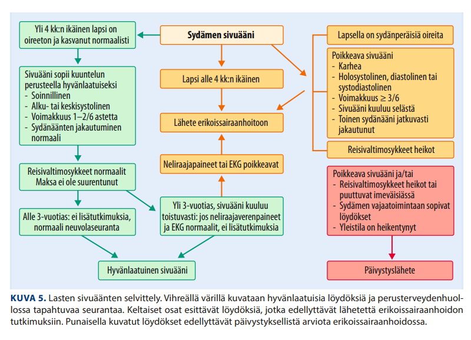
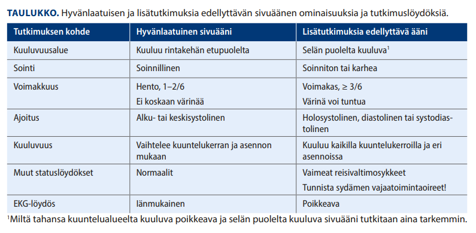

  

### Keuhkokuumeen diagnostiikka ja hoito lapsilla {#Keuhkokuume}

  <button class="solution-button"
          data-label="Vastaus"
          data-hide-label="Piilota vastaus">
    Vastaus
  </button>
  

Keuhkokuumeen yleisimmät oireet ovat kuume, yskä ja tihentynyt hengitys, joskus rintapistos tai vatsakipu (kouluikäiset). Lapsen yskän tavallisin syy on kuitenkin äkillinen viruksen aiheuttama hengitystietulehdus. Tietysti myös yleinen oire on yleistilan lasku, jonka merkkejä pikkulapsilla voivat olla väsymys, apaattisuus, huono syöminen, itkuisuus ja käsittelyarkuus. 

Auskultaatiossa voidaan joskus kuulla paikalliset tai laaja-alaiset hienojakoiset rahinat (ritinät) taikka hiljentyneet hengitysäänet (voivat viitata laajaan tulehdusinfiltraattiin, atelektaasiin tai pleuraeffuusioon). Pidentynyt ja/tai vinkuva uloshengitys on mahdollinen mutta ei tyypillinen bakteerikeuhkokuumeen löydös. Takykardia on tietysti yleistä. 

<li>**Yksi tärkeimmistä erotusdiagnostisista vaihtoehdoista pienen lapsen pneumoniassa on obstruktiivinen bronkiitti,** joka on pääasiassa virustaudin aiheuttama uloshengitysvaikeus (toistuva alle 1v lapsen uloshengitysvaikeus ja ensimmäinen 1-3-vuotiaan).</li>
  <ul>
    <li>**Sen tärkein erottava tekijä tyypillisestä pneumoniasta on pitkittynyt uloshengitys obstruktiosta johtuen.** Vinkunoita ei aina vaikeassa obstruktiossa kuule, koska ilmavirtaus on niin heikkoa (usein vasta avaavan läkkeen jälkeen kuuluu vinkunat paremmin auskultaatiossa). Yleistila voi olla molemmissa heikko, hengitys voi olla tihentynyttä yms., mutta pneumoniassa yleensä ei ole samalla tavalla auskultaatiossa vinkunaa tai observaatiossa pitkittynyttä uloshengitystä (periaatteessa näitä voi olla, mutta ei yhtä tyypillisesti). **Jos on epävarma, niin voi antaa kokeiluna lapselle avaavaa lääkettä. Jos vaikuttaa hyvin, niin todennäköisesti kyseessä on obstruktiivinen bronkiitti.**</li>
  </ul>
<li>Hienojakoisten rahinoiden kuuleminen etenkin itkevältä ja liikehtivältä lapselta on haastavaa, joten yleistilan ja hengitysvaikeuden arviointi korostuu. Kun lapsi on selvästi sairas ja sairaus on kehittynyt äkillisesti, erotusdiagnostiikassa on muistettava keuhkokuume, vaikka auskultaatiolöydös olisi normaali. </li>
<li>Happisaturaation mittaaminen on tärkeää ainakin, jos lapsella todetaan hengitysvaikeus. Hengitysvaikeus, jonka merkkeinä ovat apuhengityslihasten käyttäminen, ähkiminen (engl. grunting), nenänsiipihengitys pienillä lapsilla ja hypoksia (happisaturaatio < 95 %), on merkki vaikeasta keuhkokuumeesta. </li>
<li>Suuri CRP-pitoisuus tai veren suuri leukosyyttimäärä lisäävät bakteerin aiheuttaman keuhkokuumeen todennäköisyyttä, mutta pieni CRP-pitoisuus tai leukosyyttimäärä ei sulje pois bakteeri-infektiota erityisesti taudin alkuvaiheessa. _Verenkuvan ja CRP:n tutkiminen ei kuitenkaan ole välttämätöntä hyväkuntoiselta lapselta, jolla epäillään keuhkokuumetta ja jonka hoito tapahtuu kotona._</li>

---

**Labrat:** 

<li>Suuri CRP-pitoisuus tai veren suuri leukosyyttimäärä lisäävät bakteerin aiheuttaman keuhkokuumeen todennäköisyyttä, mutta pieni CRP-pitoisuus tai leukosyyttimäärä ei sulje pois bakteeri-infektiota erityisesti taudin alkuvaiheessa. _Verenkuvan ja CRP:n tutkiminen ei kuitenkaan ole välttämätöntä hyväkuntoiselta lapselta, jolla epäillään keuhkokuumetta ja jonka hoito tapahtuu kotona._</li>
<li>Erotus bakteeri- ja virustaudin välillä tehdään pääasiassa kliinisesti, mutta influenssapikatesti ja RSV-testi on käyttökelpoinen epidemia-aikana. Muita etiologisia tutkimuksia ei avoterveydenhuollossa ole yleensä tarpeen tehdä. Mykoplasmaa epäiltäessä nukleiinihaponosoitustesti on käyttökelpoinen (tosin erityisesti epidemia-aikana ja sairastetun taudin jälkeen oireeton nenänielukantajuus on mahdollista).</li>
<li>Sairaalahoitoisesta potilaasta otetaan yleensä veriviljely ennen mikrobilääkehoidon aloitusta</li>

---

**Radiologiset tutkimukset:**

<li>Diagnostiikassa **thx-rtg on yleensä tarpeeton hyväkuntoisella lapsella,** jolla todetaan avohoitoinen keuhkokuume tyypillisten oireiden ja auskultaatiossa kuultavan ritinän (hienojakoisen rahinan) perusteella</li>
<li>Keuhkokuva tarvitaan, jos yleistila on huonontunut ja on epäily keuhkokuumeesta, jos infektiofokus on epäselvä tai jos todetaan selvästi hiljentyneet hengitysäänet. Keuhkokuvaus on tarpeen myös, jos potilaan tila ei parane 48 t:n kuluessa hoidon aloituksesta. _Lapsilta otetaan ensisijaisesti pelkkä AP-kuva._</li>
<li>Röntgenkuvan perusteella ei voida luotettavasti päätellä keuhkokuumeen etiologiaa. Sekä virus- että bakteeripneumonioissa tiivistymä voi olla alveolaarinen, bakteeripneumonioissa tosin useammin kuin viruspneumonioissa. Toisaalta nopeasti alkanut pneumokokkipneumonia ei aina näy keuhkokuvassa tiiviinä varjostumana mutta vaatii mikrobilääkehoidon.</li>

---

Antibioottihoitoa ei tarvita lieväoireisella lapsella, jonka oireet viittaavat ensisijaisesti virustautiin. **Suun kautta annosteltava amoksisilliini (40-45 mg/kg/vrk jaettuna 3 annokseen (maksimiannos 750 mg × 3) 5 vrk:n ajan) on ensisijainen valinta aikaisemmin terveiden lasten kotisyntyisessä keuhkokuumeessa, jonka oireet viittaavat bakteeritautiin, kun taudinkuva ei ole vaikea.** Hyväkuntoiset penisilliiniallergiset voidaan hoitaa makrolidilla (ensisijaisesti atritromysiini). _Oseltamiviiria voidaan käyttää influenssaviruksen aiheuttaman keuhkokuumeen hoitoon (jos influenssa on todettu testaamalla ja oireiden alusta on alle 48 tuntia)._

Sairaalahoidon aiheita ovat mm. 

<li>Heikentynyt yleistila</li>
<li>Selkeä hengitysvaikeus/saturaatio alle 95% </li>
<li>Komplikaatio (pleuraeffuusio, empyeema, paise) tai sen epäily</li>
<li>Huononeva tila</li>
<li>Tila ei parane 48t kuluessa (jos taas toipuminen käynnistyy tässä ajassa eikä ole komplikaatioita, niin jälkitarkastusta tai kontrollikeuhkokuvaa ei tarvita)</li>
<li>Suun kautta otettavan lääkkeen antamisen epäonnistuminen</li>
<li>Alle 6 kk:n ikäiset ja lapset, joilla on merkittävä perussairaus, tulee lähettää erikoissairaanhoitoon arvioitavaksi</li>

---

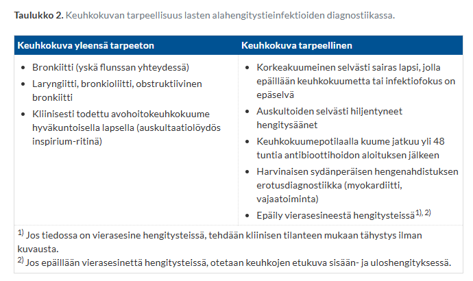
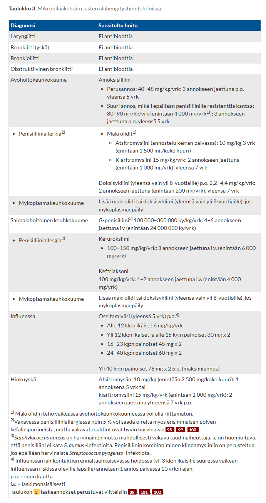
  

### 3-v. keuhkokuumepotilas, tehtävänannon mukaan ei sairaalahoidon tarvetta. Tyypilliset aiheuttajamikrobit? Tarvitaanko antimikrobilääkitystä ja jos niin mitä? {#3v-keuhkokuume}

  <button class="solution-button"
          data-label="Vastaus"
          data-hide-label="Piilota vastaus">
    Vastaus
  </button>
  

Lapsen keuhkokuume on keuhkokudoksen tulehdus, jonka voivat aiheuttaa pelkät virukset, virukset ja bakteerit tai ensisijaisesti bakteerit. _Erityisesti pienillä lapsilla virusten osuus keuhkokuumeen aiheuttajana on merkittävä._ Bakteereista yleisimpiä aiheuttajia ovat **pneumokokki ja mykoplasma** (harvinaisemmin haemophilus influenzaea, chlamydia pneumoniae, s. aureus, s. pyogenes). Viruksista mm. RSV, metapneumovirus (hMPV), adenovirus, koronavirukset, influenssavirukset, parainfluenssa ja rhinovirus. Virukset voivat aiheuttaa keuhkokuumetta yksinään tai altistaa sekundaariselle bakteeri-infektiolle.

Bakteeri- ja virusinfektiota on vaikea erottaa toisistaan, vaikka korona-, influenssa- ja RSV-pikatesti on käyttökelpoinen epidemia-aikana. **Kliinisesti diagnosoitu keuhkokuume hoidetaan antibiootilla, jos ei ole selkeästi viruksen aiheuttama.**

**Suun kautta annosteltava amoksisilliini (40-45 mg/kg/vrk jaettuna 3 annokseen (maksimiannos 750 mg × 3) 5 vrk:n ajan) on ensisijainen valinta aikaisemmin terveiden lasten kotisyntyisessä keuhkokuumeessa, jonka oireet viittaavat bakteeritautiin, kun taudinkuva ei ole vaikea.** Hyväkuntoiset penisilliiniallergiset voidaan hoitaa makrolidilla (ensisijaisesti atritromysiini). _Oseltamiviiria voidaan käyttää influenssaviruksen aiheuttaman keuhkokuumeen hoitoon (jos influenssa on todettu testaamalla ja oireiden alusta on alle 48 tuntia)._
  

### 11 kk ikäisellä lapsella ollut ripulia ja oksentelua. Yt ollut hyvä. Ohjattu juottamaan lapselle mehua. Seuraavana päivänä tulee takaisin vastaanotolle ja ripuli ja oksentelu jatkunut. {#11k-ripuli-oksentelu-kuivuma}

- a. arvioi kuivuman aste (ei tarkkoja esitietoja wikissä, mieti yleisesti miten lapsen nestetasapainoa arvioidaan)
- b. miten ohjeistetaan äitiä jatkoista
- c. mistä johtuu että edelleen kuivumaa ja oireita ensimmäisen käynnin jälkeen

  <button class="solution-button"
          data-label="a"
          data-hide-label="a - Piilota vastaus">
    a
  </button>
  

Yleisin syy lapsen kuivumalle on virus-gastroenteriitti. Arviossa tärkeää on tietysti anamneesi ja status sekä vitaalien tarkistaminen. 

<li>Anamneesi:</li>
  <ul>
    <li>Oireet, niiden kesto, mitä annettu ja mitä menetetty, virtsan määrä</li>
  </ul>
<li>Status:</li>
  <ul>
    <li>Paino (tarkista myös kasvukäyrä), kapillaaritäyttö (normaali alle 3sek), limakalvojen kosteus, ihon turgor (telttautuminen), silmien kuopalla olo</li>
  </ul>
<li>Vitaalit:</li>
  <ul>
    <li>Syke, verenpaine, hengitystaajuus, saturaatio...</li>
  </ul>
  
---

Kuivuman vaikeus voidaan jakaa lievään (3-5%), keskivaikeaan (6-10%) ja vaikeaan (9-15%). Arviossa käytetään alla olevan taulukon löydöksiä. _Paras objektiivinen mittari on kuitenkin painon muutos (jos tuore vertailupaino on tiedossa)._

Elektrolyyttiarvot ovat yleensä normaalit, jonka takia niitä ei voida käyttää kuivuman vaikeuden arviossa. Kuitenkin jos tarvitaan suonensisäistä nesteytystä, verikaasuanalyysi ja elektrolyytit (K, Na) on hyvä tarkistaa; hyväkuntoiselta lapselta ei yleensä tarvita verikokeita virustautiepäilyissä.

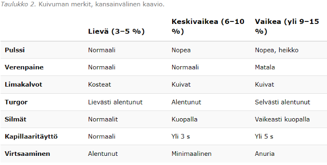
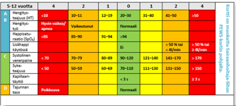

  

  <button class="solution-button"
          data-label="b"
          data-hide-label="b - Piilota vastaus">
    b
  </button>
  

Vaikeat kuivumat (ja yleensä jo yli 8% kuivumat) kuuluvat erikoissairaanhoitoon ja tarvittaessa suonensisäiseen nestehoitoon. Iv-nestein korjaus ja ylläpitonesteytys rinnan. Tässä ei todennäköisesti ollut kyse vaikeasta kuivumasta.

Jos lapsen kuivuman aste oli vain lievä, niin tila voidaan hoitaa perusterveydenhuollossa. Kuivuman hoito suun kautta (tai tarvittaessa nenämahaletkun kautta) toteutettavalla nesteellä, esimerkiksi oraaliset rehydraatiojuomat (ORS-liuos). **Kuivuman korjauksessa ORS-liuosta (oral rehydration solution, Suomessa Osmosal®-jauhe oraaliliuosta varten sekä Floridral®, ravintolisä) annetaan n. 1.3-1.5 × kuivuman määrä / painon lasku (esim. jos lapsi painaa nyt n. 10kg ja kuivuma on n. 5% eli 500g, niin korjauksena 650-750ml) hitaasti (pienet kerta-annokset eivät laukaise oksennusta yhtä herkästi kuin kerralla juotu iso määrä) 4–6 t:n (ad 10t) aikana.** Juoma voidaan antaa pullosta, lasista, lusikalla tai ruiskulla. Monet lapset ottavat juoman mieluimmin kylmänä. Kuivuman korjauksen jälkeen siirrytään lapsen normaaliin ravintoon. Rintalapsen imetystä jatketaan taudin keston ajan normaalisti. Jos kuivuman korjaus ei onnistu kotona, se onnistuu usein nenämahaletkuun annettavalla ORS-liuoksella terveyskeskuksen tai sairaalan päivystyspoliklinikalla; oksentelevatkin lapset sietävät yleensä hitaan nesteytyksen nenämahaletkun kautta. Kuivuman korjauksen jälkeen lapsi tutkitaan ja punnitaan ja voidaan yleensä päästää kotiin jatkohoitoon.

Ripulin jatkuessa voidaan ORS-liuosta antaa 30 ml/kg kerran vrk:ssa tai 0.5 dl jokaista ripuliulostetta kohti alle 2-vuotiailla ja 1 dl jokaista ripuliulostetta kohti yli 2-vuotiailla. Lapsen normaalia ylläpitonesteytystä ei tule unohtaa gastroenteriittiä hoidettaessa. Lapsen normaali vuorokautinen nestetarve on

<li>1–10 painokilolle 100 ml/kg</li>
<li>11–20 painokilolle 50 ml/kg</li>
<li>20:n ylittäville painokiloille 20 ml/kg</li>
<li>Esim. 26-kiloisen ylläpitonestetarve on 10 × 100 ml + 10 × 50 ml + 6 × 20 ml = 1 620 ml</li>

---

Kotiutettaessa kerro perheelle taudin todennäköinen kesto ja selkeät kotihoito-ohjeet nesteytysmäärineen

<li>Virusperäinen gastroenteriitti kestää yleensä 2–7 vrk, rotavirustauti joskus kauemmin</li>
<li>Muista informoida perhettä taudin tartuttavuudesta ja kotihoitoajoista ennen päiväkotiin tai kouluun palaamista (pääsääntöisesti 2 oireetonta päivää)</li>
<li>Jos lapsi ei ala virkistyä tai väsähtää lisää tai ei virtsaa esim. yli 6-8 tuntiin, kehota ottamaan uudelleen yhteyttä</li>

  

  <button class="solution-button"
          data-label="c"
          data-hide-label="c - Piilota vastaus">
    c
  </button>
  

Viruksen (esim. rota-, noro- tai adenovirus) aiheuttama akuutti gastroenteriitti kestää tyypillisesti 3–7 vuorokautta. Yhden vuorokauden kuluessa tauti ei ole ehtinyt paranemaan. Jos oksentelu ja ripuli jatkuvat voimakkaina, nestettä poistuu kehosta nopeammin kuin sitä on saatu korvattua. 

Jos lapsi on kotona juonut pelkästään mehua niin se on voinut olla tilannetta pahentamassa. Täysmehut voivat osmoottisesti vetää vettä elimistöstä suolen onteloon korkean sokeripitoisuuden vuoksi sekä happamuutensa takia ärsyttää suolta, mikä pahentaa ripulia ja pahentaa kuivumaa. Pelkässä mehussa myös on harvoin sopivassa suhteessa natriumia ja muita elektrolyyttejä kuivumisen korjaamiseksi.

  

### Influenssa. Mikä todennäköisesti aiheuttaja, tarvitaanko ab. {#Influenssa-aiheuttaja-ab}

  <button class="solution-button"
          data-label="Vastaus"
          data-hide-label="Piilota vastaus">
    Vastaus
  </button>
  

Ihmisille infektiivistä influenssaviruksen päätyyppejä on kolme: A, B ja C. Vain influenssa A ja B aiheuttavat laajoja, vuosittaisia kausi-influenssaepidemioita.

<li>A on yleisin aiheuttaja ja aiheuttaa yleensä vakavimmat epidemiat ja voi tarttua myös eläimiin (kuten lintuihin ja sikoihin)</li>
<li>B aiheuttaa yleensä A-tyyppiä lievemmän taudin ja kiertää pääasiassa vain ihmisillä</li>
<li>Influenssa C aiheuttaa yleensä vain lievän hengitystieinfektion eikä aiheuta epidemioita</li>

---

Antibioottihoitoa ei rutiinisti tarvita, ellei epäillä bakteeriperäistä koinfektiota tai jälkitautia. Influenssan hoidossa ensisijainen mikrobilääke on oseltamiviiri (po-reittiä annosteltava antineuraminidaasi), joka tulisi aloittaa mahdollisimman varhain (mieluiten 48 tunnin kuluessa oireiden alusta; harvoin tosin päästään näin nopeaan diagnoosiin). Muuten hoito on oireenmukaista.

<li>Lääke lyhentää taudin kestoa 1–2 vuorokaudella, kun hoito aloitetaan 48 tunnin kuluessa influenssan oireiden alusta. Kuitenkin jos oseltamiviirihoito aloitetaan jo 24 tunnin kuluessa oireiden alusta, sairauden kesto influenssa A -lapsilla lyhenee noin 4 vuorokautta. Nopeasti aloitetulla influenssalääkityksellä voidaan vähentää myös influenssan aiheuttamia komplikaatioita. </li>
<li>Käytännön toiminnassa influenssa osoitetaan nykyään nenänielutikkunäytteestä joko PCR:n avulla tai erilaisilla antigeeniosoitusmenetelmillä. Vaikka influenssatesti olisikin käytettävissä, sen tekeminen ei influenssan toteamiseksi ole avohoidossa tarpeen, jos oireiden alusta on yli 48 t, koska lääkehoidolla ei voida merkittävästi vaikuttaa taudin kestoon. Poikkeuksena ovat hyvin voimakasoireiset tai komplikaatioherkät potilaat sekä lähikontaktit.</li>

  

### Essee: 3-viikkoisen vs 7-kuukautisen kuume

Ei tarkempaa kysymyksenasettelua, mutta käy läpi mielessäsi miten kuumeen syyt, selvittelyt ja hoidot eroavat näiden ikäluokkien välillä.

  <button class="solution-button"
          data-label="Vastaus"
          data-hide-label="Piilota vastaus">
    Vastaus
  </button>
  

Kuumeisen imeväisen kliininen arviointi ja hoidon linjaukset/-porrastus muuttuvat merkittävästi lapsen iän mukaan. Suurimmat murtokohdat osuvat 1kk sekä 3kk ikään. **Kaikki alle 3kk-ikäisten kuumeet tulisi arvioida ESH-päivystyksessä.** Alle 3kk ikäisillä on kohonnut riski vakaviin bakteeri-infektioihin, joten he kuuluvat lääkärin tutkimuksiin aina samana päivänä invasiivisen bakteeritaudin poissulkuun. Huom. aina ei välttämättä ole kuumetta, mutta yt-laskussakin bakteeri-infektion mahdollisuus on muistettava. 

<li>Alle 3kk ja varsinkin alle 1kk:n ikäiset ovat korkean riskin potilaita heidän kehittymättömän immuunijärjestelmän ja heikon rokotussuojan takia. Oireet ovat usein myös epämääräisiä.</li>

---

Alle 1kk:n ikäisillä yleisimmät kuumeen bakteeriaiheuttajat ovat GBS (S. agalactiae; usein synnytysinfektio), E. coli (ja muut gram-negatiiviset suolistobakteerit) sekä Listeria. Yleisimmät virusaiheuttajat taas ovat RSV, influenssa, enterovirukset, HSV yms. 

Vanhemmilla vauvoilla S. pneumoniae erityisesti lisääntyy, E. coli pysyy tärkeänä. Myös tietysti septisten tilojen ulkopuolella ajatellen välikorvatulehdukset yms voivat olla taustalla. Viruksista mm. RSV, adenovirus, rinovirus, HHV-6, influenssa, norovirus, rotavirus... 

Kuume voi tietysti myös johtua myös ei-infektiivisistä syistä, kuten vanhemmilla vauvoilla Kawasakin taudista. 

---

**Alle 1kk-ikäisen vauvan kohdalla tehdään aina invasiivinen sepsisseulonta sairaalassa. Tutkimuksiin kuuluu veriviljely, virtsanäyte, likvori, thorax-rtg,** muut labrat (CRP, PVK, elektrolyytit, astrup) ja tarvittaessa muutakin. _Aloitetaan iv-antibiootti_ (penisilliini (tai ampisilliini listeriaepäilyssä) + gentamysiini) ja otetaan lapsi sairaanhoitoon.

**Yli 1-3kk:n ikäisillä tutkimusten laajuus suhteutetaan yleistilaan.** Kliininen tutkimus usein riittää, jos kuumeelle on selvä syy (esim. virusoireet, välikorvatulehdus) eikä laboratoriokokeita välttämättä tarvita lainkaan. Jos kyseessä on epäselvä kuume (ei selkeää fokusta), niin voidaan ottaa CRP ja virtsanäyte ja jos ne negatiiviset, niin voidaan ottaa seurantalinja (hoito ensisijaisesti kotona oireenmukaisesti) hyvävointisilla lapsilla. 

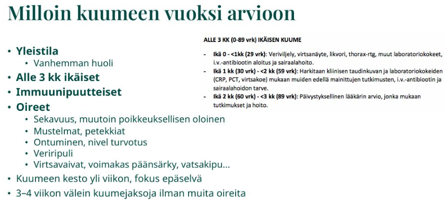
  

### Essee: akuutti välikorvantulehdus {#AOM-essee}

Ei tarkempaa tehtävänantoa siitä, mitä haluttiin kirjoitettavan. Käy läpi akuutin välikorvantulehduksen epidemiologia, yleisin patogeneesimekanismi, yleisimmät aiheuttajapatogeenit, diagnostiset selvittelyt ja kriteerit, hoito ja komplikaatiot. 

  <button class="solution-button"
          data-label="Vastaus"
          data-hide-label="Piilota vastaus">
    Vastaus
  </button>
  

Äkillinen otitis media (AOM, acute otitis media) tarkoittaa välikorvatulehdusta. Se on yksi yleisimmistä syistä lääkärille hakeutumiseen ja **yleisin syy antibioottikuurien määräämiseen lapsille.** Välikorvatulehdukset ovat myös tavallisin syy lasten kirurgisille toimenpiteille. Äkillisen välikorvatulehdusta esiintyy kaikissa ikäryhmissä, mutta sen ilmaantuvuus on suurin 0,5–2 vuoden ikäisillä lapsilla. Vuoden ikään mennessä noin 40 % lapsista, kahden vuoden ikään mennessä noin 70 % ja kolmen vuoden ikään mennessä lähes 85 % lapsista on sairastanut vähintään yhden välikorvatulehduksen. Pieni osa lapsista on erityisen alttiita sairastamaan toistuvia välikorvatulehduksia. Noin 10 % lapsista on sairastanut 3 tai useampia välikorvatulehduksia jo ennen yhden vuoden ikää.

_Pienet lapset saavat muuta väestöä enemmän välikorvatulehduksia, koska he ovat yleisesti alttiita infektiolle sekä heillä on pienemmät ja vaakasuoremmat korvatorvet._ Äkillinen välikorvatulehdus siis ilmaantuu useimmiten ylähengitysteiden virusinfektion aikana tai heti sen jälkeen. Nenänielun inflammaatio siis voi aiheuttaa korvatorven turvotusta ja tukkeutumista ja värekarvatoiminnan häiriöitä. Korvatorven obstruktio johtaa ilmastoitumisen ja tyhjenemisen heikentymiseen ja välikorvan alipaineeseen. Värekarvatoiminnan häiriöt helpottavat bakteerien kertymistä. Nämä tekijät johtavat välikorvan bakteeritulehdukseen viraalisen ylähengitystieinfektion yhteydessä. 

Useimmissa akuuteissa välikorvatulehduksissa (AOM) kyseessä on siis **bakteerin ja viruksen aiheuttama sekainfektio.** Yleisimmät bakteerit ovat **Streptococcus pneumoniae, Haemophilus influenzae (non-typeable) ja Moraxella catarrhalis.** Tavallisimmat välikorvatulehduksiin liittyvät virukset ovat rino-, RS-, entero- ja bokavirus. 

---

Akuuttia otitis mediaa ei voida diagnosoida pelkästään oireiden tai esitietojen perusteella, vaan potilas on pakko tutkia; ensisijainen diagnostinen tutkimus on pneumaattinen otoskopia. Yleensä ei kuitenkaan tarvita minkäänlaisia laboratoriotutkimuksia. **Diagnostiset kriteerit ovat lyhyesti seuraavanlaiset:**

<li>**Tärykalvossa selvät tulehduksen merkit** (pullotus, laikukas verestävä punoitus) +</li>
<li>**Välikorvassa on eritettä** +</li>
  <ul>
    <li>Huom. myös tärykalvon ilmastointiputken tai puhkeaman kautta tuleva, äkillisesti alkanut märkävuoto katsotaan äkilliseksi välikorvatulehdukseksi</li>
  </ul>
<li>**Vähintään yksi yleiseen tai paikalliseen infektioon viittaava oire tai löydös:** yleisimmin ylähengitystieinfektioon viittaavat oireet, kuten nuha, yskä, kuume, kurkku- tai korvakipu, kuulon heikkeneminen ja itkuisuus</li>

---

Äkillisen välikorvatulehduksen oireet ovat siis pääosin samoja kuin pelkässä ylähengitystieinfektiossa, joten välikorvatulehdusta ei voi luotettavasti diagnosoida oireiden perusteella. Korvakipu (usein pahempaa makuuasennossa) on ainoa selkeästi äkilliseen välikorvatulehdukseen viittaava oire, mutta korvakivun puuttuminen ei sulje pois äkillistä välikorvatulehdusta. Pikkulapsilta ei myöskään voi suoraan saada vastausta, että onko korvakipua äkillisen välikorvatulehduksen (AOM) oireena, mutta korvien harominen on varsin yleinen oire. 

---

AOM:n diagnostiikassa **tympanometri** on hyödyllinen työkalu, koska sillä voidaan poissulkea välikorvatulehdus luotettavasti. Jos tympanogrammi piirtää A-käyrän (selkeä huippu), niin välikorvassa ei ole eritettä. B-käyrä taas viittaa välikorvaeritteeseen, mutta se ei ole suoraan diagnostinen, koska se kertoo vain, että tärykalvon liikkuvuus on heikentynyt. Tämä voi johtua välikorvatulehduksen lisäksi muistakin syistä, kuten pelkästä korvaan kertyneestä nesteestä ilman aktiivista tulehdusta (liimakorva) tai tärykalvon reiästä. 

---

**Mikrobilääkkeestä on usein otitis mediassa hyötyä. AOM siis paranee yleensä spontaanisti, mutta ab-hoito voi nopeuttaa paranemista ja ehkäistä komplikaatioita.** Ab-hoitoa ei tarvitse aina suoraan aloittaa kaikille, joilla todetaan äkillinen välikorvatulehdus. Päätöksessä huomioidaan lapsen kokonaistilanne, arvioidaan lääkityksen haitat ja otetaan huomioon myös perheen toiveet. **On esitetty, että alle 2 vuoden ikä, molemminpuolinen tulehdus ja vuoto tärykalvolta puoltaisivat antibioottihoidon aloitusta.** 

Jos päädytään siihen, ettei antibioottihoitoa aloiteta, lapsi tulee tutkia uudelleen 2–3 päivän kuluttua, jollei hän ole selvästi paranemassa. Yleisesti käytetty vaihtoehto hoidossa on myös on ns. viivästetty antibioottikuuri, jossa kirjoitetaan resepti kotiin ja lääke aloitetaan, mikäli lapsi ei ole selvästi parempi 2-3vrk kuluttua -> aikaa ja resursseja säästyy eikä tarvitse toista käyntiä.

Ensisijainen antibioottivalinta äkillisen välikorvatulehduksen (AOM) hoidossa on yleensä **p.o. amoksisilliini (40 mg/kg/vrk) tai amoksisilliini-klavulaanihappo (40/5,7 mg/kg/vrk) (2 tai) 3 annokseen jaettuna. Hoitoaika 5-7vrk.** Antibiootin valinnassa tulee ottaa huomioon lapsen kokonaistilanne sekä lääkkeen haittavaikutusprofiili ja alueellinen aiheuttajabakteerien herkkyystilanne. Penisilliinille allergisille lapsille voidaan käyttää kefakloria, kefuroksiimiaksetiilia, sulfa-trimetopriimia, atsitromysiiniä tai klaritromysiiniä. 

Paikallinen antimikrobiaalitippahoito (siprofloksasiini + hydrokortisoni tai siprofloksasiini + fluosinoloni) on sovelias äkillisen välikorvatulehduksen (AOM) hoidoksi, jos kyseessä on putkitettu korva ja potilas ei ole yleissairas. Hoitoon tulee liittää suun kautta otettava antibiootti, jos lapsi on yleissairas tai vuoto jatkuu tippahoidosta huolimatta.

---

Välikorvatulehdusten komplikaatiot voivat olla joko intratemporaalisia tai intrakraniaalisia. Välikorvatulehdusten komplikaatiot ovat harvinaisia kehittyneissä maissa, mutta ne tulee pitää mielessä. Kuuluvat yleensä KNK-päivystykseen.

<li>Intratemporaalisia = esim. äkillinen kartiolisäkkeen tulehdus (mastoidiitti), kasvohermohalvaus, sisäkorvatulehdus</li>
<li>Intrakraniaalisia = esim. sinustromboflebiitti, märkäinen aivokalvontulehdus, aivopaise</li>

---

_Ilmastointiputkia käytetään lähinnä liimakorvataudin (välikorvaeritettä >3kk) hoidossa,_ mutta niiden on todettu vähentävän myös toistuvia äkillisiä välikorvatulehduksia. **Potilas tulisi ainakin lähettää arvioon, kun on ollut yli 3 välikorvatulehdusta puolen vuoden aikana tai yli 4 välikorvatulehdusta vuoden aikana.** Tärykalvoputkituksesta hyötyvätkin etenkin ne potilaat, joiden korvat eivät tulehdusten välillä parane eritteettömiksi. Potilaan kokonaistilanne, kuten ikä, perinnöllinen alttius, perussairaudet, oireiden voimakkuus, päivähoitomuoto ja vuodenaika, on kuitenkin huomioitava (esim. kesää vasten voidaan olla löysempiä kriteereissä). Toistuvien tulehdusten ehkäisemiseksi voidaan ennen leikkaushoitoa yrittää muitakin temppuja, kuten ksylitolin säännöllistä käyttöä ja tarvittavien rokotteiden saamisen varmistamista. 

  

### Essee: Lapsen lihavuus -- syyt, seuraukset, selvittely ja hoito

Wikiin kirjoitetussa promptissa oli vain syyt ja seuraukset, mutta käy läpi päässäsi myös selvittely ja hoidot.

  <button class="solution-button"
          data-label="Vastaus"
          data-hide-label="Piilota vastaus">
    Vastaus
  </button>
  

Ylipaino/lihavuus on tällä hetkellä **lasten suurin terveysriski.** Jopa >20% 5-luokkalaisista on ylipainoisia; määrä on kolminkertaistunut 70-lukuun verrattuna. Lihavuuden yleisyys on taas tietysti hieman matalampi: 2–6-vuotiailla pojilla 6 % ja tytöillä 3 %. 7–12-vuotiailla pojilla lihavuuden yleisyys on 8 % ja tytöillä 4 %. 13–16-vuotiaista pojista oli lihavia 9 % ja tytöistä 4 %. _Lihavuus on siis yleisempää pojilla kuin tytöillä, ja se yleistyy erityisesti pojilla iän mukana._ **Ylipaino/lihavuus myös yleensä säilyy aikuisuuteen: >2/3 on ylipainoisia myös aikuisena.**

Ylipainon määritelmä vaihtelee käytetyn mittarin ja iän mukaan. Alle 2-vuotiaiden lasten painon luokittelussa käytetään pituuspainoa (lapsen painoa verrataan samaa sukupuolta olevien ja samanpituisten lasten keskipainoon). 2–18-vuotiaiden lasten ylipaino ja lihavuus voidaan määrittää sekä pituuspainon että painoindeksin (BMI, kg/m²; erityisesti ISO-BMI eli aikuista vastaava BMI) avulla.

<li>Ylipaino on pituuspaino-%:n mukaan <7-vuotiailla 10-20% ja ≥ 7-vuotiailla 20-40%. Lihavuus taas samoin >20% ja >40%. </li>
<li>≥ 2–18-vuotiailla ISO-BMI:n mukaan ylipaino on 25-30kg/m² ja lihavuus >30kg/m² </li>

---

**Suurin riskitekijä lapsuusiän ylipainolle on vanhempien ylipaino.** Kaksostutkimusten perusteella lapsen alttius lihoa on vahvasti periytyvää, mutta lihavuuden yleistyminen väestössä johtuu lihomista aiheuttavasta ympäristöstä ja muuttuneista elintavoista. Taustalla on siis mm:

<li>Vanhempien terveyskäyttäytyminen ja perheen elintavat:</li>
  <ul>
    <li>Äidin tupakointi raskauden aikana</li>
    <li>Lapsen vähäinen liikunta; vähän liikkuvien vanhempien lapset ovat liikunnallisesti passiivisempia</li>
    <li>Runsas sokeripitoisten juomien käyttö</li>
    <li>Pikaruokien tiheä syöminen</li>
    <li>Energiatiheät välipalat ja napostelu</li>
    <li>Pitkä yhtäjaksoinen paikallaanolo, monituntinen ruutuaika</li
    <li>Riittämätön yöunen määrä</li>
  </ul>
<li>Perheen alhainen sosioekonominen asema (alhainen koulutustaso, pienet tulot)</li>

---

_Taustalla voi myös olla sairauksiakin, tosin tämä on harvinaista (1-2%:lla)._ Endokriininen sairaus on mahdollinen, varsinkin jos lapsen pituuskasvu on poikkeava. 

<li>Lihomiseen liittyy normaalisti pituuskasvun kiihtyminen, joka jatkuu yleensä muutamia vuosia. Lihavuus ei kuitenkaan lisää aikuispituutta, joten murrosiän loppukasvu on vähäisempää kuin normaalipainoisilla lapsilla</li>
<li>**Kilpirauhasen vajaatoimintaan viittaa pituuskasvun hidastuminen lihomisen yhteydessä (ristioire).** Lihavuuteen liittyy usein TSH-pitoisuuden lievä suureneminen (< 7 mU/l). Jos T4V-pitoisuus on normaali, kilpirauhasen sairaus ei ole todennäköinen</li>
<li>**Endogeeninen Cushingin oireyhtymä on lapsilla äärimmäisen harvinainen. Siinäkin pituuskasvu hidastuu ja paino samanaikaisesti nousee (ristioire).** Sairaudessa kasvot alkavat pyöristyä ja punehtua ja rasvaa kertyy soliskuoppiin, niskaan ja vyötärölle. Kuitenkin jo pelkkä kasvun ristioireen jatkuminen kilpirauhaskokeiden ollessa normaalit antaa aiheen epäillä sairautta, ja sen diagnostiikka kuuluu erikoissairaanhoitoon</li>
<li>Kasvuseulan rikkova lyhytkasvuisuus tai poikkeavat piirteet viittaavat oireyhtymän mahdollisuuteen. Suurimpaan osaan lihavuutta aiheuttavista oireyhtymistä liittyy kehitysviive</li>
<li>Alle 2-vuotiaana alkanut ja 5 v:n ikään mennessä vaikeaksi edennyt lihavuus voi viitata lihavuusoireyhtymään tai monogeeniseen lihavuuteen</li>
<li>Lasten ja nuorten lihavuuteen voi liittyä ahmintahäiriö, joka on todennäköisesti alidiagnosoitu ongelma</li>
<li>Monet psyykenlääkkeet, jotkin epilepsialääkkeet (esim. valproaatti) ja glukokortikoidilääkkeet voivat aiheuttaa lihomista.</li>

---

Seuraukset: 

<li>Yleisesti voi ajatella olevan samat lisäsairausriskit kuin aikuisella. Lihavuuden liitännäissairauksien puhkeamiseen altistavat muutokset alkavat kehittyä jo lapsuudessa.</li>
  <ul>
    <li>Hypertriglyseridemia, korkea verenpaine, rasvamaksa, hyperinsulinemia (ja jopa T2DM)</li>
    <li>Lapsuusiän lihavuus vaikuttaa aikuisiän terveyteen ja elinikäennusteeseen lisäämällä metabolisen oireyhtymän ja sen valtimotautikomplikaatioiden vaaraa, mutta normaalipainon saavuttaminen ennen aikuisikää poistaa suurentuneen riskin</li>
  </ul>
<li>Vaikutukset lapsen fyysiseen, psyykkiseen ja sosiaaliseen hyvinvointiin ovat merkittäviä</li>
<li>Tietysti myös altistaa uniapnealle, mielenterveyshäiriöille, luusto-ongelmille yms</li>

---

Selvittelyssä tärkeää on: 

<li>Anamneesissa:</li>
  <ul>
    <li>Arvioida lapsen kasvu ja kehitys ja sen aikataulu</li>
    <li>Lähisuvun tiedot (lihavuus, T2DM, äidin raskausdiabets, rasva-aineenvaihdunnan häiriöt, sepelvaltimotauti, RR-tauti, aivohalvaukset</li>
    <li>Sairauteen viittaavat oireet (uniapnea, munasarjojen monirakkulaoireyhtymä, reisiluun pään epifysiolyysi, masennus, ahdistus)...</li>
    <li>Elintavat</li>
  </ul>
<li>Statuksessa:</li>
  <ul>
    <li>Poikkeavat ulkonäköpiirteet, kehitys, puberteettistatus</li>
    <li>Paino ja pituus (joskus vyötärön ympärysmitta, jos painon ja ruumiinrakenteen välillä vaikuttaa olevan ristiriita) </li>
    <li>Verenpaine</li>
    <li>Kilpirauhasen ja vatsan palpaatio (varsinkin maksan koko)</li>
    <li>Ihon taivetummuus (acanthosis nigricans, tummanruskea pigmentaatio niskassa, kainaloissa) striat, hirsutismi, akne</li>
  </ul>
<li>Tutkimuksissa:</li>
  <ul>
    <li>**T4V ja TSH** tutkitaan diagnostisen selvittelyn osana ylipainoisilta lapsilta, jos pituuskasvu samanaikaisesti hidastuu eikä syynä ole kasvukauden loppuminen puberteetissa, ja _kerran kaikilta lihavilta lapsilta_</li>
    <li>Lisäksi perusverikokeet tutkitaan kerran lihavilta lapsilta, ja ne voidaan uusia kertaalleen murrosiässä, jos tutkimukset on edellisen kerran otettu alle 10 v:n iässä: PVK, Kol, LDL, HDL, Trigly, fP-Gluk, HbA1c (joskus yli 10-vuotiaille myös oraalinen sokerirasituskoe paikallisen hoitoketjun mukaan), ALAT </li>
  </ul>

---

**Hoidossa on samat hoitoperiaatteet kuin aikuisilla; käytetään kuitenkin vähemmän lääkkeitä**

<li>Yksinkertaisin interventio on puheeksi ottaminen vastaanotolla. Nuoren motivaatiota hoitoon voi tiedustella ja samalla herätellä motivaatiokyselyn avulla. Lapsia ei kannata kutsua ylipainoisiksi tai lihaviksi niin heitä itseään päin kuin vanhemmillekaan, vaan voi puhua luontevasti painosta ja sen tulkinnasta (mitä mieltä ovat) ja kasvukäyristä. </li>
<li>Elintapahoito on ensisijainen: ruokavalio, liikunta, uni... </li>
<li>GLP-1-analogit liraglutidi ja semaglutidi ovat mahdollisia vaihtoehtoja >12-vuotiailla eritystapauksissa ESH:ssa. </li>

---

Jos liitännäissairauksien seulontatutkimuksissa on poikkeava tulos (sokeriaineenvaihdunnan häiriö, dyslipidemia, poikkeava maksa-arvo tai verenpaine koholla), anna elintapaohjeita, järjestä ravitsemusneuvonta ja laadi tarvittaessa lähete erikoissairaanhoitoon. Joskus ESH lähetetään myös vaikeassa lihavuudessa (ISO-BMI >35), jos näin on paikallisesti sovittu. 

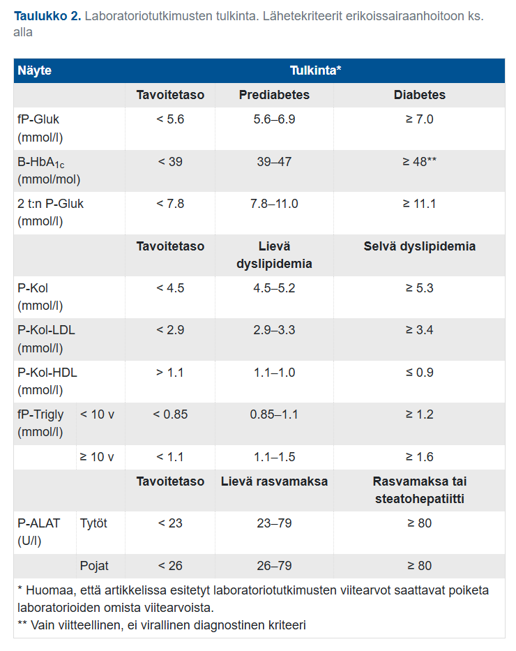

  

### Essee: Koliikki

Ei tarkempaa tehtävänantoa. Käy läpi määritelmä, diagnostiikka ja hoito.

  <button class="solution-button"
          data-label="Vastaus"
          data-hide-label="Piilota vastaus">
    Vastaus
  </button>
  

Koliikilla (nykyään uusi termi Rome V-uudistuksen myötä on infant distress syndrome) tarkoitetaan **pienellä imeväisellä esiintyvää toistuvaa tai pitkittynyttä itkuisuutta, kitinää ja ärtyisyyttä.** Oireisiin ei ole selvää syytä eikä niitä pysty estämään tai helpottamaan. Ne _alkavat yleensä ensi elinviikkoina ja helpottavat 5 kuukauden ikään mennessä._ Lapsi kasvaa normaalisti ja todetaan tutkittaessa terveeksi. 

<li>Vaikka koliikin syytä ei tiedetä, koliikkilapsilla on havaittu vähemmän itkeviin lapsiin verrattuna muutoksia suolistomikrobistossa.</li>

---

**Diagnostiikka:**

Itkuisen vauvan erotusdiagnostiikka perustuu pääasiassa **anamneesiin ja kliiniseen tutkimukseen;** näillä voidaan suurella luotettavuudella poissulkea vakavat sairaudet ilman laboratorio- tai kuvantamistutkimuksia kuumeettomalla itkuisella imeväisellä. Joskus tarvitaan 1–2 viikon seuranta-aika, jotta itkun luonne selviää.

<li>Milloin itkuisuus alkoi ja miten paljon vauva itkee vuorokaudessa?</li>
  <ul>
    <li>Itku alkaa lisääntyä 2–3 viikon iässä ja on suurimmillaan toisen elinkuukauden aikana (keskosilla keskosuuden mukaan korjatussa iässä), jolloin vauvat itkevät keskimäärin n. 2 tuntia päivässä. Koliikki-itku vähenee 5 kk:n ikään mennessä.</li>
    <li>Kliinisessä työssä itkun kokonaismäärällä ei enää ole merkitystä koliikkidiagnoosin kannalta, koska vanhempia rasittaa nimenomaan lapsen selittämätön itku, jota ei saada tyynnytettyä. Itkumäärissä esiintyy suurta yksilöiden välistä vaihtelua sekä samalla lapsella myös päivittäistä vaihtelua. Määritelmästä riippuen vauvoista 5–20 % on koliikkivauvoja.</li>
  </ul>
<li>Millaista itku on laadultaan?</li>
  <ul>
    <li>Suurin osa vauvojen itkusta on tyytymätöntä ääntelyä, jossa on taukoja (”kitinää”, engl. fussing). Vain osa itkusta on yhtäjaksoista ja yleensä pieni osa voimakasta, kohtausmaista ”suoraa huutoa”, joka ei lopu syliin ottamisella tai syöttämisellä ja jota kutsutaan myös koliikki-itkuksi. Suurella osalla vauvoista esiintyy jonkin verran myös näitä voimakkaita itkukohtauksia 1–3 kk:n iässä.</li>
  </ul>
<li>Itkeekö vauva tiettynä vuorokauden aikana vai jatkuvasti?</li>
  <ul>
    <li>Itkuisuus toistuu usein samaan vuorokauden aikaan, yleensä _varsinkin iltaisin,_ mutta voi esiintyä mihin vuorokauden aikaan tahansa, ja vauva on muina aikoina tyytyväinen</li>
  </ul>
<li>Mitä ruokaa vauva saa? Kasvaako vauva normaalisti?</li>
  <ul>
    <li>Koliikkilapsi kasvaa normaalisti</li>
    <li>Itkuisuus on yhtä yleistä rintaruokituilla ja äidinmaidonkorviketta saavilla lapsilla</li>
  </ul>
<li>Mitä hoitokeinoja vanhemmat ovat kokeilleet?</li>
<li>Onko vauvalla akuuttiin infektioon viittaavia löydöksiä/oireita? Akuuttiin suolistosairauteen viittaavia oireita?</li>
  <ul>
    <li>Onko kuumetta? Yleistilaltaan sairas? Hengitysvaikeutta? Nuhaa, yskää, rohinaa?</li>
    <li>Imeväisen suolitukoksen syitä ovat mm. pylorusstenoosi (paino ei nouse, kaarimaiset oksennukset), suolen stenoosit/atresiat/volvulus, kuroutunut nivustyrä, Hirschsprungin tauti (ummetus, pömppö vatsa).</li>
    <li>Usein itkuisuuden takia vastaanotolle tuotu vauva on vastaanottotilanteessa hyväkuntoinen ja tyytyväinen, jolloin vaikeat akuutit sairaudet on helppo poissulkea</li>
  </ul>
<li>Onko lapsella nälkä ja auttaako ruokkiminen itkuisuuteen; onko imetyksen kanssa ongelmia?</li>
  <ul>
    <li>Jos itkun taustalla on rintamaidon vähentyminen, lisämaidon antaminen auttaa. Koliikki-itkuun lisämaidon antaminen ei auta</li>
    <li>Imetystekniikan (mm. imuote rinnasta, syömisasento) ja ruokarytmin tarkistaminen sekä oikean tekniikan ohjaus voivat ongelmatilanteissa vähentää itkua</li>
  </ul>
<li>Onko lapsella lehmänmaitoallergia?</li>
  <ul>
    <li>Liittyykö itkuisuus äidinmaidonkorvikkeen käytön aloittamiseen?</li>
    <li>Onko lapsella suolioireita, kuten oksentelua, ripulia tai huonoa painonnousua? Onko vauvalla atooppista ihottumaa? Onko perheessä allergisia sairauksia?</li>
    <li>Lehmänmaitoallergia on harvinainen sairaus (2 %) verrattuna koliikkiin. Lehmänmaitoallergiaan viittaavat suoli- tai iho-oireet, oireiden yhteys äidinmaidonkorvikkeen antamiseen ja perheen allergiset sairaudet?</li>
    <li>Lehmänmaitoallergiaepäilyssä aloitetaan 1–2 viikon kokeilu hydrolysoidulla erityiskorvikkeella. Ruokavaliokokeilua on käytettävä harkiten ja huolehdittava sen purkamisesta, jollei saada selvää vastetta. Uusi altistus lehmänmaidolle kuuluu joka tapauksessa lehmänmaitoallergian diagnostiikkaan</li>
  </ul>
<li>**Kattava status; neurologia ja raajat/vamman merkit hyvä aina tarkastaa, koska itkuiset lapset ovat kohonneessa riskissä joutua pahoinpidellyiksi/ravistetuiksi (shaken baby)**</li>

---

_Diagnostiset kriteerit (Rooma IV) ovat seuraavat:_

<li>Lapsi on alle 5 kk:n ikäinen oireiden alkaessa ja loppuessa</li>
<li>Lapsen hoitaja raportoi toistuvia ja pitkittyneitä itku-, kitinä- ja ärtyneisyyskohtauksia</li>
  <ul>
    <li>Enää kriteereissä ei ole tuntikriteerejä itkuisuuden määrän suhteen; tärkeää on vain se, että vanhemmat kokevat itkemisen ongelmaksi (kaikilla on eri sietotaso).</li>
  </ul>
<li>Kohtauksiin ei ole selkeää syytä, eikä niitä voi ehkäistä tai lopettaa</li>
<li>Ei viitteitä kehitysviiveestä, kuumeesta tai muusta sairaudesta</li>

---

**Hoito:**

<li>Koliikin hoidossa keskeistä on vanhempien rauhoittaminen, tukeminen sekä oireen vaarattomuudesta ja ohimenevyydestä kertominen. Huoltajalla on oltava mahdollisuus saada tarvittaessa helposti yhteys esim. lastenneuvolan terveydenhoitajaan lisätuen saamiseksi. Koliikkilapsella on suurentunut kaltoinkohtelun riski, joten vaikeaoireinen lapsi on otettava sairaalaan, jos uupuneiden vanhempien voimavarat uhkaavat loppua.</li>
<li>Koliikki-itkun määrä vähenee kehityksen myötä vanhempien vauvanhoitotavasta riippumatta. Vanhemmille on tärkeä tieto, että erilaisilla hoitotavoilla on omat etunsa eikä ole yhtä ”oikeaa” hoitotapaa. Vanhemmat eivät siis tee mitään haittaa vauvalleen pitämällä vauvaa paljon sylissä tai nukuttamalla vauvaa vanhempien vieressä tai toisaalta antamalla vauvan joskus itkeä.</li>
<li>Protonipumpunestäjistä ei ole osoitettu olevan apua itkuisen lapsen hoidossa, mutta **Lactobacillus reuteri DSM 17938 -probioottilisän** on osoitettu vähentävän päivittäisen koliikkioireilun määrää rintaruokitulla lapsella (ainakin puolisen tuntia) -> kokeilua kannattaa suositella. Vasteen saaminen kestää muutaman viikon ajan. Muilla probiooteilla tai korvikeruokituilla lapsilla vastaavaa tehoa ei ole osoitettu.</li>
<li>Varmista, että lapsi saa D-vitamiinilisän (jota vanhemmat virheellisesti voivat luulla itkuisuuden syyksi, koska itkuisuus yleensä alkaa D-vitamiinitippojen aloitusiässä).</li>
<li>Järjestä perheelle jatkokontakti (käynti tai puhelu) vauvan itkuisuuden seuraamiseksi. Jos lapselle ilmaantuu uusia oireita tai itkuisuus ei vähene iänmukaisella tavalla, arvioi uudestaan, onko taustalla jokin somaattinen syy. Vanhemmat tarvitsevat toistuvaa tukea ja varmistusta sille, että lapsi on terve. Koliikkivauvat saavat tarpeeksi unta vanhempien epäilyistä huolimatta. Lapsen hyvä ennuste rohkaisee ja auttaa vanhempia jaksamaan koliikki-iän yli.</li>

  

### Essee: anafylaksia

Ei tarkempaa tehtävänantoa. Käy läpi määritelmä, patogeneesi, diagnostiikka ja hoito.

  <button class="solution-button"
          data-label="Vastaus"
          data-hide-label="Piilota vastaus">
    Vastaus
  </button>
  

**Yleistyneen allergisen reaktion uhkaavin muoto on anafylaksia, joka on nopeasti etenevä monen kohde-elimen reaktio ja voi johtaa kardiovaskulaariseen kollapsiin.** 

Se yleensä johtuu **IgE-välitteisestä yliherkkyydestä.** Yleisin aiheuttaja-allergeenien kategoria on ruoka-aineet (n. 70%) ja tavallisin lapsilla on ollut lehmänmaito. Muita aiheuttajia olleet kananmuna, vehnä, pähkinät tai siemenet, kasvikset tai hedelmät sekä kala. Muita tunnettuja anafylaktisen reaktion aiheuttajia ovat röntgenvarjoaineet, verituotteet tai parenteraalisesti annettavat proteiinit. Joskus allergeenikontakti ja rasitus yhdessä laukaisevat anafylaksian (esimerkiksi vehnärasitusanafylaksia)

<li>Käynnistyy antigeenin kohdatessa sille spesifisen IgE:n, joka on sitoutuneena korkean affiniteetin IgE-reseptoriin (FcɛR1) kudoksissa sijaitsevien syöttösolujen pinnalla. Antigeenin sitouduttua samanaikaisesti kahteen IgE-molekyyliin (cross-linkage) syöttösolu aktivoituu ja degranuloituu vapauttaen sytokiineja, kemokiineja ja _tulehdusvälittäjäaineita (varsinkin tryptaasi ja histamiini)._</li>
<li>Anafylaksian harvinaisia mekanismeja ovat IgG-välitteiset reaktiot esimerkiksi monoklonaaliselle vasta-aineelle infliksimabille. Fyysinen rasitus, fysikaalinen ärsytys (kylmä, kuuma), etanoli, lektiinit ja opioidit voivat myös harvoin aktivoida suoraan syöttösoluja ja aloittaa anafylaktisen reaktion ilman immunologista mekanismia.</li>

---

Yleisesti ottaen anafylaksian kriteerinä on pidetty **nopeasti allergeenikontaktin jälkeen ilmaantuvia oireita vähintään kahdessa eri elinryhmässä** (esimerkiksi iho- ja hengitystieoireet), mutta myös _merkittävä verenpaineen lasku riittää._ Kansainvälisesti on käytetty niin sanottuja Sampsonin kriteereitä anafylaksian määrittelemisessä ja diagnosoinnissa. Mitkään kriteerit eivät takaa 100 % sensitiivisyyttä ja spesifisyyttä anafylaksian tunnistamisessa, mutta Sampsonin kriteerien oletetaan kattavan yli 95 % anafylaksioista. 

Anafylaksia on todennäköinen, jos jokin kolmesta kriteeristä täyttyy. Koska yli 80 prosentilla anafylaksiapotilaista ilmenee iho-oireita, ensimmäinen kriteeri kattaa suurimman osan anafylaksiatapauksista.

<li>1: Iho ja/tai limakalvo-oireen äkillinen alku ja vähintään toinen seuraavista:</li>
  <ul>
    <li>Hengitysvaikeus</li>
    <li>Verenpaineen lasku</li>
  </ul>
<li>2: Todennäköiselle allergeenille altistuksen jälkeen esiintyy vähintään 2 seuraavista:</li>
  <ul>
    <li>Iho ja/tai limakalvo-oireet</li>
    <li>Hengitysvaikeus</li>
    <li>Verenpaineen lasku tai siihen liittyvät oireet (esim. tajunnan häiriö tai pidätyskyvyttömyys)</li>
    <li>Pitkittyvät gastrointestinaaliset oireet</li>
  </ul>
<li>3: Tunnetulle allergeenille altistumisen jälkeen esiintyvä verenpaineen lasku</li>
  <ul>
    <li>Lapsilla matala systolinen verenpaine tai 30 % lasku systolisessa verenpaineessa</li>
    <li>Aikuisilla systolinen verenpaine alle 90 mmHg tai 30 % lasku perustasosta</li>
  </ul>

---

Tyypillinen alkava oire on kutina nielussa, suussa, jalkapohjissa, kämmenissä ja joskus koko keholla sekä vatsakipu. Anafylaksian alkuvaiheessa potilas ei ole kalpea, päinvastoin kuin usein luullaan, vaan kasvoille ilmaantuu flush-tyyppinen punoitus. Lapsi saattaa muuttua itkuiseksi ja levottomaksi. Urtikaria-angioedeemareaktio on tavallinen, jolloin voi esiintyä turvotusta huulissa, silmissä, korvalehdissä, kurkunpäässä ja keuhkoputkissa. Viimeksi mainitussa tapauksessa kliininen oire on astmakohtaus. Anafylaksiassa lapsi on yleisesti huonovointinen, voi oksennella ja pyörtyä tai mennä ääritilanteessa tajuttomaksi. Varsinkin vauvoilla oireet voivat olla vaikeasti tulkittavia, jos yllä mainittua flush-reaktiota ei synny: lapsi muuttuu poissaolevan ja letargisen oloiseksi ja on yleisesti sairaan oloinen, valittaa sekä mahdollisesti oksentelee. 

Anafylaktisen reaktion selvittelyssä varmistetaan, että potilaan oireet ja löydökset täyttävät anafylaksian kriteerit ja potilaskertomus käydään huolellisesti läpi. Erotusdiagnostisina vaihtoehtoina tulevat kyseeseen akuutti urtikaria, akuutti astma, pyörtyminen, paniikkikohtaus, vierasesineen aspiraatio tai kardiovaskulaarinen tai neurologinen sairaus. Myös ruokamyrkytys (esimerkiksi kalaan kertyy histamiinia kylmäketjun katkettua) ja mastosytoosi on otettava huomioon.

Anafylaksian riskiä lisäävä kofaktori on osallisena 20–30 % anafylaktisista reaktioista. Esitietoihin kuuluu kysyminen kofaktoreista, joita ovat fyysinen ja psyykkinen rasitus, akuutti infektio, kuume, tulehduskipulääkkeet, beetasalpaajat, ACE-estäjät, alkoholi, rutiinista poikkeavat tilanteet ja premenstruaalinen vaihe. 

---

Anafylaksiaa epäiltäessä on kuitenkin kiire eikä aina ole mahdollista kerätä laajaa anamneesia, vaan hoito on annettava heti ja tiedot kerättävä jälkikäteen. **Ensiapu on adrenaliiniannos 0,01 ml/kg (vahvuus 1 mg/ml; enintään 0.5mg) lihakseen. Jos käytössä valmis injektori, annetaan alle 30 kg painaville 0,15 mg adrenaliinia ja isommille 0,3 mg annos** (potilaan koon mukaan voidaan harkita jopa kahta 0.3mg annosta). Adrenaliini suositellaan pistettäväksi _reiden ulkosyrjän lihakseen._ Annos uusitaan tarvittaessa 5-15 minuutin kuluttua.

Potilas asetetaan puoli-istuvaan asentoon (hypotensiossa makuulle). Varmistetaan, että potilas hengittää. Lisäksi vitaalitoimintojen ylläpitäminen yleisperiaatteiden mukaisesti (tarvittaessa lisähappi naamarilla, tarvittaessa täyttönesteitä hypotensiivisille). Beeta-2-sympatomimeettejä voidaan antaa astmaoireisiin. Beetasalpaajia käyttävillä potilailla adrenaliinin teho voi olla heikentynyt anafylaksiassa ja kardiovaskulaaristatusta parantamaan voidaan tässä tapauksessa antaa glukagonia (1-5mg iv 5 minuutin kuluessa).

**Anafylaksian täydentävään hoitoon eli reaktion jatkumisen ja myöhäisreaktion estämiseen kuuluu erityisesti systeeminen kortikosteroidi ja antihistamiini.** Antihistamiinin tai prednisolonin hyödystä anafylaksian hoidossa ole merkittävän suurta näyttöä, mutta ne ovat olleet pitkään osa hoitoa; eivät korvaa adrenaliinia. 

<li>Glukokortikoidi: Annetaan metyyliprednisolonia aikuiselle 80–250 mg, lapselle 2 mg/kg tai hydrokortisonia aikuiselle 250–1 000 mg i.v., lapselle 10 mg/kg. Lasten kokonaisannos ei saa ylittää aikuisannoksia. Vaikutus alkaa hitaasti. Jatkohoidoksi predniso(lo)ni 2 mg/kg (max 60 mg) p.o. Jos altistus analylaksian aiheuttajalle on loppunut ja oireet ovat menneet ohi, glukokortikoidihoito voidaan lopettaa 1–2 päivän kuluessa.</li>
<li>H1-antihistamiinit: Lapselle setiritsiini (alle 5-vuotiaalle 0.3 mg/kg, yli 5-vuotiaalle 10 mg). Aikuisille setiritsiini 10 mg p.o., hydroksitsiini 25–50 mg p.o. tai loratadiini 10 mg × 1 p.o. Difenhydramiini 25–50 mg i.v. tai p.o myös mahdollinen. Jatkohoidossa antihistamiineja voidaan käyttää suun kautta muutaman päivän ajan.</li>

---

Noin 6 %:lla anafylaksiaa saaneista lapsista ilmaantuu myöhäisreaktio 4-12 tunnin kuluttua ensioireista ja jopa joka viidennellä 3 vrk:n kuluessa. **Vähintään 6–8 t:n seuranta** on tarpeen myös hävinneen tai lieventyneen reaktion jälkeen. _Harkitse seurannan kesto yksilöllisesti._ Tarvittaessa sairaalaseuranta. Erityishuomiota kannattaa kiinnittää potilaisiin, joilla on krooninen hengityselinsairaus, koska esimerkiksi huonossa hoitotasapainossa oleva astma on kuolemaan johtavan anafylaksian riskitekijä

Jos reaktio ei ole ollut vaikea ja potilas on toipunut nopeasti täysin oireettomaksi, hänet voidaan yleensä kotiuttaa 6–10 tunnin kuluttua. Vähintään yhden vuorokauden tarkkaa sairaalaseurantaa suositellaan, jos on ilmentynyt

<li>vaikeita nielun oireita</li>
<li>vaikeita hengitysteiden oireita</li>
<li>sokki</li>

---

Anafylaksian hoidon ja seurannan jälkeen seuraavat toimenpiteet, jotka pitää muistaa varsinkin ensimmäisen / poikkeuksellisen reaktion jälkeen kotiuttaessa ovat:

<li>**Määrää potilaalle adrenaliinikynä (optimaalisesti tulisi aina kantaa mukana x2 kynää) sekä muut oirelääkkeet sekä opasta ensiapulääkityksen käyttö (adrenaliini)**</li>
  <ul>
    <li>Adrenaliiniautoinjektorin käytön ohjaamisen lisäksi on aiheellista ohjeistaa esimerkiksi antihistamiinin käyttö lievempiä allergisia oireita varten. Antihistamiinin tai kortikosteroidin tehosta anafylaksiassa ei kuitenkaan ole tieteellistä näyttöä.</li>
    <li>**Ohje potilaalle reaktion uhatessa: Epipen®/Jext® välittömästi reiden lihakseen, soitto 112 ja predniso(lo)ni 20 mg ja antihistamiini suun kautta**</li>
    <li>Jos oireet eivät lievity 5–10 minuutin kuluessa tai ne ehtivät jo hellittää mutta alkavat uudelleen, sama adrenaliiniannos voidaan (ja pitää) toistaa toisella injektorilla toiseen reiteen</li>
    <li>Kaikkien vaikeiden (adrenaliinihoitoa edellyttäneiden) anafylaktisten reaktioiden yhteydessä suositellaan päivystyksellistä lääkärin arviota, vaikka oireet helpottuisivatkin omalla ensiapulääkityksellä.</li>
  </ul>
<li>Anna potilaalle tai lapselle ja perheelle ohjeet allergeenin välttämistä varten</li>
<li>**Ohjaa potilas jatkoselvityksiin (allergiapoliklinikka) reaktion aiheuttajan selvittämiseksi. Myös astmaselvitykset ovat aiheelliset.**</li>
  <ul>
    <li>Esimerkiksi komponenttidiagnostiikan avulla pystytään selvittämään anafylaksian aiheuttajia sekä arvioimaan tulevien allergisten reaktioiden voimakkuutta ja jatkohoidon tarvetta. Useita allergeeneja kohtaan on tarjolla myös tutkittua ja tehokasta siedätyshoitoa. Varsinkin pistiäisallergisille siedätyshoitoa suositellaan.</li>
    <li>Huonossa hoitotasapainossa oleva tai hoitamaton astma on merkittävin yksittäinen anafylaksian riskiä lisäävä tekijä, minkä vuoksi astmatutkimukset kuuluvat aina anafylaksian diagnostisiin selvittelyihin</li>
  </ul>
<li>Tee ilmoitus Anafylaksiarekisteriin (www.hus.fi, hakusanalla anafylaksiarekisteri) </li>
  <ul>
    <li>Ilmoittaminen on vapaaehtoista, mutta suositeltua. Ilmoituksen tekee terveydenhuollon ammattilainen.</li>
  </ul>

---

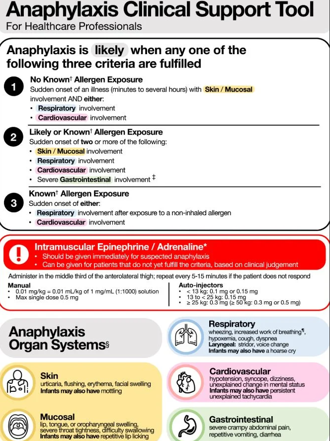
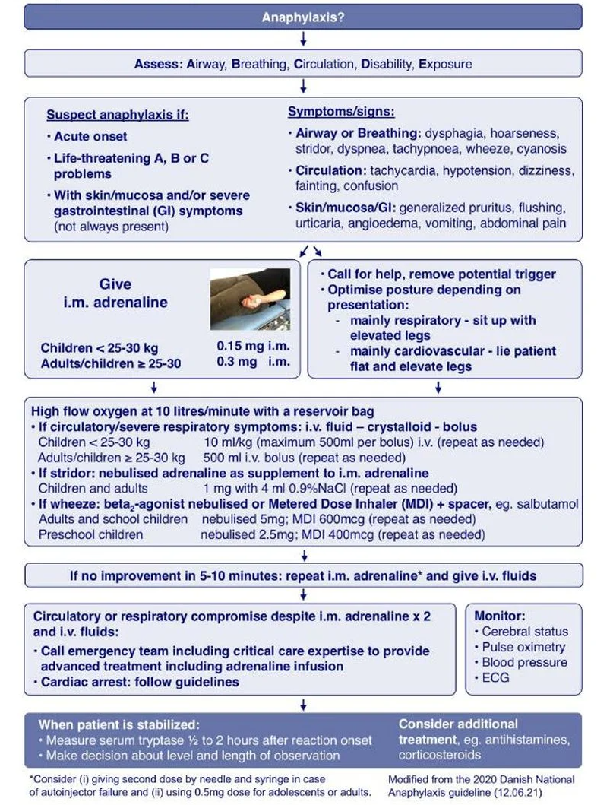
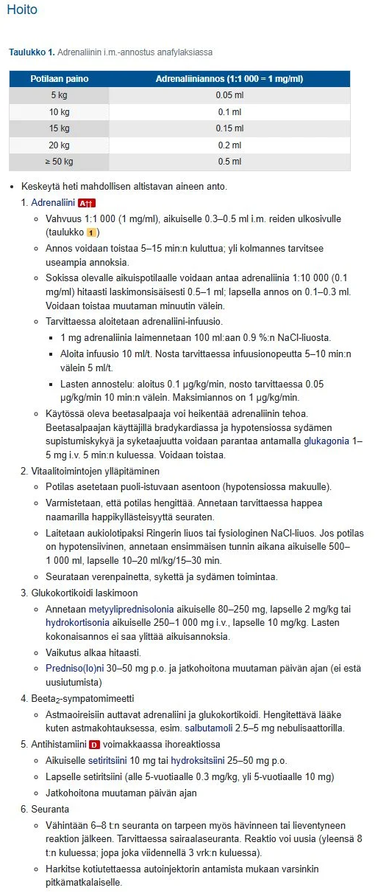
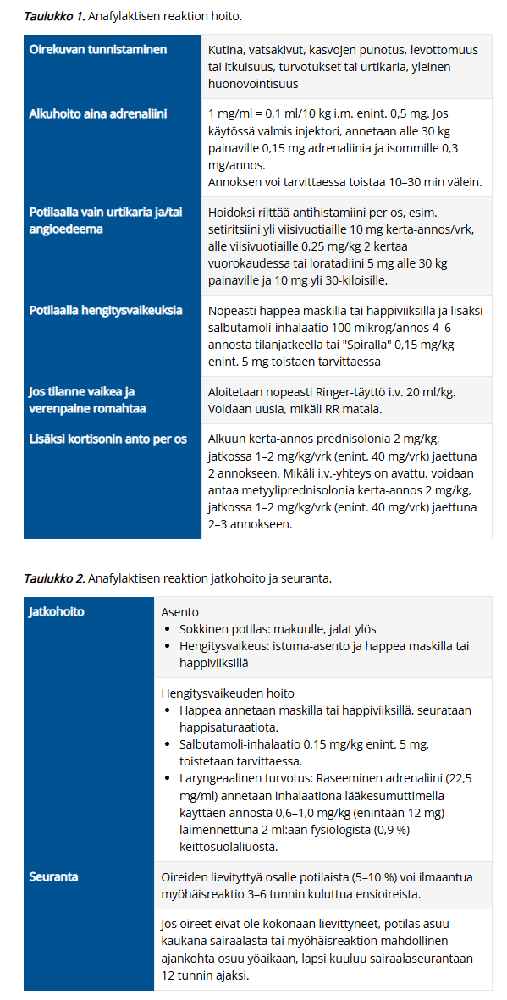
  

### Essee: bronkioliitin määritelmä ja tyypillisimmät taudinaiheuttajat {#Bronkioliitti-maaritelma-patogeenit}

  <button class="solution-button"
          data-label="Vastaus"
          data-hide-label="Piilota vastaus">
    Vastaus
  </button>
  

Bronkioliitti on eurooppalaisen määritelmän mukaan **alle 12 kuukauden ikäisen lapsen ensimmäinen virusinfektion aiheuttama uloshengitysvaikeus.** Yhdysvalloissa diagnoosia bronkioliitti käytetään 24 kuukauden ikään asti. Anatomisesti bronkioliitti on viimeisten keuhkoputkihaarojen, ilmatiehyiden ja niitä ympäröivän keuhkokudoksen tulehdus. Tyypillistä taudille on uloshengityksen ahtautuminen. 

<li>Obstruktiivinen bronkiitti taas tarkoittaa ensimmäistä uloshengitysvaikeuskohtausta > 1-vuotiaalla (yleensä 12–36 kk:n ikäisellä) lapsella tai toistuvaa uloshengitysvaikeutta.</li>

---

Bronkioliitin tavallisin aiheuttaja on **RS-virus** (vähentynyt nirsevimabin tultua käyttöön). Myös esim. _rino-, entero-, metapneumo- ja parainfluenssavirukset_ voivat aiheuttaa samanlaisen taudinkuvan. Yleisin sairastumisikä on 1–6 kuukautta, jolloin RSV on tärkein aiheuttaja. RSV ja rinovirus ovat yhtä yleisiä 6–12 kuukauden iässä (ainakin klassisesti).

Erotusdiagnostiikassa on muistettava hinkuyskä (Bordetella pertussis) rokottamattomalla yskivällä imeväisellä sekä Suomessa vielä harvinainen pienen imeväisen klamydiainfektio (Chlamydia trachomatis).

---

Bronkioliitti alkaa ylempien hengitysteiden oireilla. Kun infektio leviää alempiin hengitysteihin, esiintyy kuumetta, yskää ja limaisuutta vaihtelevassa määrin. 

Tyypillinen bronkioliittipotilas on siis pieni imeväinen, jolla on hengitysvaikeus (voi olla kylkiluuväliretraktioita), ja auskultoiden kuullaan ritinää/rohinaa (ritinät syntyvät, kun kasassa olevat keuhkorakkulat avautuvat sisäänhengityksen aikana, ja kuuluvat parhaiten sisäänhengityksen lopussa) ja mahdollisesti hentoa uloshengityksen vinkunaa. Syöminen on usein vaikeutunut, ja lapsi väsähtää helposti. Auskultaatiolöydös voi olla normaali. Tärkeä oire on lisääntynyt hengitystiheys (> 50/min).

Bronkioliitin diagnoosi on kliininen ja perustuu lapsen ikään, oireisiin ja edellä mainittuihin löydöksiin, kuten tihentyneeseen hengitykseen, auskultaatiossa kuultaviin vinkunoihin tai hienojakoisiin rahinoihin (ritinöihin) ja rintakehällä todettuihin vetäytymiin. Ilmasalpaus on kliinisesti vaikea arvioida, ja hypoksia voidaan todeta vain mittaamalla happisaturaatio. Hengitystyön määrä päätellään kliinisesti hengitystiheydestä, uloshengityksen pituudesta ja vetäytymien asteesta.

  

### Vertaile RSV:n ja rinoviruksen aiheuttamaa bronkioliittia: patogeneesi/kliiniset löydökset, astman riski, riskitekijät, hoito {#Bronkioliitti-RSV-vs-Rino}

  <button class="solution-button"
          data-label="Vastaus"
          data-hide-label="Piilota vastaus">
    Vastaus
  </button>
  

RSV (Respiratory Syncytial Virus) ja rinovirus ovat pikkulasten bronkioliitin ja uloshengitysvaikeuden kaksi merkittävintä aiheuttajaa. Vaikka molemmat aiheuttavat kliinisesti samankaltaisen hengitysvaikeuden, niiden taustalla olevat tautimekanismit, hoitovasteet ja pitkäaikaisennusteet eroavat toisistaan. 

Keskeisin ero tiivistyy patogeneettisesti siihen, että **rinovirus on pääasiassa sytokineettisesti vaikuttava virus, kun taas RSV on enemmän sytopaattinen.** 

<li>Rinovirus aiheuttaa vain minimaalista epiteelisoluvauriota eli sen sytopaattinen vaikutus on erittäin vähäinen). Nenän limakalvo näyttää histopatologisesti rinovirusinfektion aikana rakenteellisesti lähes täysin normaalilta. Se kuitenkin aiheuttaa merkittäviä toiminnallisia muutoksia limakalvolla, koska se aiheuttaa voimakkaan välittäjäaine-erityksen (esim. IL-8, IL-6, bradykiniini). _Juuri tämä elimistön oma immuunivaste – eikä solutuho – aiheuttaa astman tyyppisen obstruktion (sileän lihaksen supistuminen -> bronkospasmi)_ sekä nuhan, nenän tukkoisuuden ja limakalvoturvotuksen. Tulehduksen välittäjäaineiden pitoisuus nenäeritteessä korreloi oireiden voimakkuuteen. Rinovirus myös heikentää epiteelisolujen välisiä tiiviitä liitoksia sekä lamaannuttaa värekarvatoimintaa.</li>
<li>RSV taas aiheuttaa enemmän suoraa sytopaattista vauriota. Aiheuttaa voimakkaan limanerityksen, turvotuksen ja epiteelisolujen hilseilyn, mikä tukkii pienimmät ilmatiehyet (bronkiolit).</li>

---

Kliiniset löydökset voivat olla hyvinkin samanlaisia, mutta RSV ilmenee usein pienemmillä (alle 6kk) ja rinovirus hieman vanhemmilla (6-12kk ja vanhemmilla), vaikka voikin esiintyä jo varhainkin. Rinoviruksessa korostuu uloshengityksen vinkuminen ja pidentynyt uloshengitys ja ilmenee usein vähemmän rohisevaa limaisuutta kuin RSV:ssä. 

---

**Myöhemmän astman riski on merkittävästi suurempi rinovirusbronkioliittien jälkeen.** Bronkioliitin jälkeen astman prevalenssi on noin 10 %, mikäli bronkioliitti on ollut RSV:n aiheuttama, ja 25–50 %, mikäli bronkioliitti on ollut rinoviruksen aiheuttama, kun samanikäisen väestön prevalenssi on noin 5 %.

---

Riskitekijät vaikealle muodolle eroavat patogeenien välillä: 

<li>**Rinovirusvinkunaan sairastuvat helpommin lapset, joilla on atopia,** herkistyminen erityisesti aeroallergeeneille, vaurioitunut ihon tai hengitysteiden epiteeli, heikentynyt keuhkofunktio tai vähentynyt interferonituotanto</li>
<li>RS-virusbronkioliittiin riskitekijät ovat enemmänkin anatomisia tai fysiologisia: herkimmin sairastuvat alle 6 kuukauden ikäiset imeväiset, ennenaikaisesti syntyneet ja alle 1-vuotiaat lapset, joilla on krooninen keuhko- tai sydänsairaus. Heillä ylimääräinen lima pienissä keuhkoputkissa ja heikentynyt interferonivaste johtavat herkästi vaikeaan taudinkuvaan sekä hengitys- ja syömisvaikeuteen</li>

---

Bronkioliittiin ei ole parantavaa lääkehoitoa. Tärkeintä on, että riskipotilaat (taulukko alimmassa kuvassa) tunnistetaan ja lähetetään sairaalaseurantaan. 

Bronkioliitin hoidoksi klassisesti suositellaan hapensaannin (lisähappea esimerkiksi suurivirtauksinen nenäkanyylin (optiflow) avulla, jos <92%), nesteytyksen ja ravitsemuksen varmistamista; ns. "minimal handling"-hoitoperiaate eli merkittäviä toimenpiteitä pyritään välttämään. Jos limaa erittyy runsaasti, sen imeminen nenänielusta voi helpottaa hengitystä ja syömistä. Mikäli syöminen onnistuu huonosti, annetaan nesteytystä ja ravitsemusta yleensä nenämahaletkulla tai joskus suonensisäisesti. Käypä hoito- tai kansainväliset bronkioliitin hoitosuositukset eivät suosittele beeta2-agonististia, adrenaliinia, systeemistä tai inhaloitua kortikosteroidia, antibioottia tai antiviraalista lääkitystä bronkioliitin hoitoon. 

Lasten astman Käypä hoito -suositus ei kuitenkaan ota kantaa pienen lapsen ensimmäisen rinoviruksen aiheuttaman vinkukohtauksen hoitoon. On kuitenkin esitetty asiantuntijanäkemyksiä hoitolinjoista (esim. [tässä Lääkärilehden artikkelissa](images/RinoRSV.pdf); samat asiat on myös luentodioissa paljon sekavammin). Vaikka kontrolloituja tutkimuksia on vielä vähän, on viitteitä, että niiden akuuttiin hoitoon tulee suhtautua eri tavoin. **Ensimmäinen rinovirusvinkuna vaikuttaa olevan tällä hetkellä tehokkain aikapiste astman sekundaaripreventioon.**

<li>RSV-Bronkioliitti:</li>
  <ul>
    <li>Potilas: Tyypillinen ikä alle 6 kuukautta, osastohoitoa vaativa tauti, runsaasti limaa hengitysteissä, työläs hengitys, ei atooppista ekseemaa, vanhemmilla ei astmaa ja he tupakoivat.</li>
    <li>Hoitolinja: Pidättäydy lääkkeistä. Oireenmukaisena hoitona hapensaannin ja ravitsemuksen turvaaminen. Limaimut vain tarvittaessa.</li>
    <li>Perustelut: Oireiden syynä liman ja solujätteen aiheuttama mekaaninen tukos hengitysteissä, eikä astmariski ole merkittävästi lisääntynyt. Avaavien tai hoitavien lääkkeiden tehosta ei ole näyttöä.</li>
  </ul>
<li>Rinovirusvinkuna:</li>
  <ul>
    <li>Potilas: Tyypillinen ikä yli 6-12 kuukautta, osastohoitoa vaativa tauti, taustalla pitkittynyt yskä, auskultoiden selkeät ekspiratoriset vinkunat molemman puolin, hengitysapulihakset käytössä, atooppista ihottumaa, toisella vanhemmista on allerginen astma, kotona 2 kissaa. </li>
    <li>Hoitolinja: Kokeillaan avaavaa lääkettä (esim. salbutamoli). Jos hyötyy ja vinkuna toistuu, harkitse kolmen päivän systeemistä kortikosteroidikuuria ja määritä pöly- ja ruokaryhmän allergiatestit.</li>
    <li>Perustelut: Astman kaltainen taudinkuva ja merkittävästi lisääntynyt astmariski. Hieman näyttöä sekä avaavan lääkkeen että kortikosteroidin hyödystä tässä potilasryhmässä.</li>
  </ul>
<li>Käytännön elämässä virusdiagnostiikkaa tehdään suhteellisen harvoin. Siksi voitaisiin puhua RSV-bronkioliitista, kun RSV-virus on osoitettu tai alle 6 kuukauden ikäinen vauva sairastaa tyypillisen taudinkuvan RSV-epidemian aikana. Tällöin keuhkoputkia avaavaa lääkettä (beeta2-agonistia) ei kannata edes kokeilla. **Jos taas ikä on yli 6 kuukautta ja lapsi sairastaa RSV-epidemian ulkopuolella, voitaisiin avaavaa lääkettä kokeilla sitä herkemmin, mitä vaikeampi tauti on, mitä voimakkaammin uloshengitys vinkuu ja mitä enemmän on atopiapiirteitä.** Hoitovasteen, riskitekijöiden ja iän (mielellään yli 12 kk) mukaan voidaan harkita 3 päivän systeemistä kortikosteroidikuuria. </li>

----

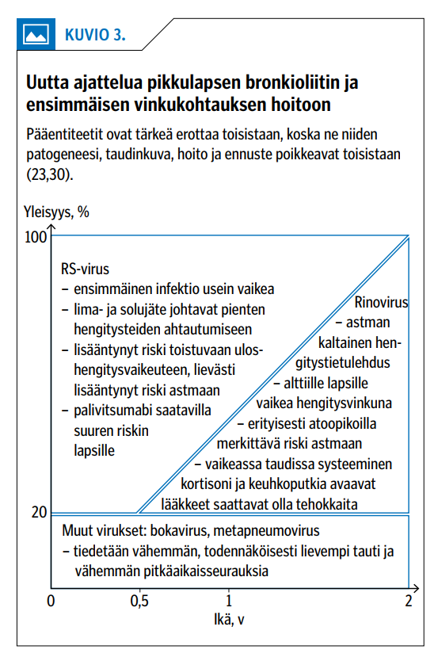
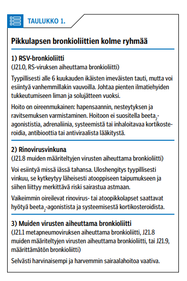
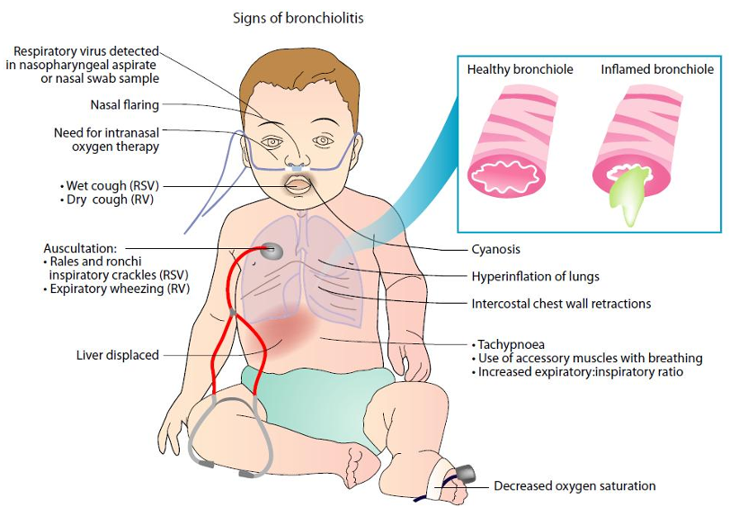
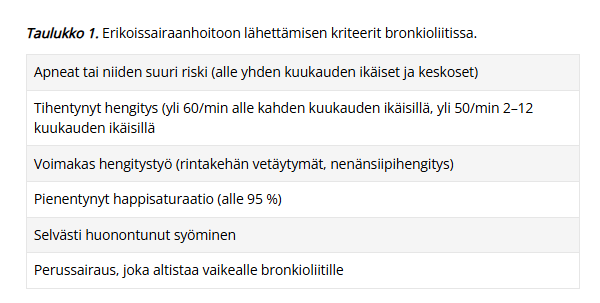

  

### Essee: 3 vrk, 5 vko ja 5 kk ikäisen lapsen pulauttelun/oksentelun erotusdiagnostiikka {#Pulauttelu-eri-ikaisilla-ddx}

  <button class="solution-button"
          data-label="Vastaus"
          data-hide-label="Piilota vastaus">
    Vastaus
  </button>
  

Yleisin imeväisen vatsavaivoista on pulauttelu, josta kärsii noin puolet vauvoista. Gastroesofageaalinen refluksi (GER) siis yleisesti (ei pelkästään lapsilla) tarkoittaa mahalaukun sisällön takaisinvirtausta ruokatorveen hetkellisesti vähentyneen LES:n tonuksen takia -> pulauttelu on gastroesofageaalista refluksia, jossa ruokaa nousee suuhun tai vielä ulos suusta. 

<li>Kyseessä on fysiologinen ilmiö, joka johtuu ruokatorven ja vatsalaukun yhteistoiminnan kehittymättömyydestä. Pulauttelun syynä on pääsääntöisesti ruokatorven alemman sulkijalihaksen (LES) nielemiseen liittymätön, ohimenevä relaksaatio, minkä seurauksena vatsalaukun sisältöä nousee ruokatorveen. Myös esim. voimakkaan itkun tai vauvan käsittelyn yhteydessä äkillinen intra-abdominaalinen paine voi aiheuttaa vatsansisällön refluksoitumista ruokatorveen.</li>
<li>Pulautteleva lapsi syö ja kasvaa normaalisti eikä pulautteluun liity hengitystieoireita. Unen keskeytyminen, itkuisuus, hikka ja ruminaatio (nieleskely) ovat tavallisia ilmiöitä vauvaiässä eivätkä edellytä refluksitaudin selvittelyjä ilman muita oireita. </li>

---

Lapsen oksentelu on kuitenkin eri asia ja se ei usein ole viatonta. Pulautuksessa mahansisältöä nousee suuhun tai ulos suusta, kun taas oksentelussa mahansisältö lentää isommalla voimalla yökkäämisoireen kanssa. Oksentelu voi olla myös ihan kaarimaista korkeapaineista tilanteesta riippuen. 

Oksentelun selvittelyssä lapsen iällä on suuri merkitys taustatekijöiden ennakkotodennäköisyyksiä mietittäessä. 

---

3 vrk ikäisellä vastasyntyneellä iässä vaivaton pulauttelu on yleistä, mutta varsinainen oksentelu on harvinaisempaa ja saattaa olla oire välitöntä hoitoa vaativasta sairaudesta, kuten suoliston alueen synnynnäisestä epämuodostumasta tai muusta yleiskuntoon vaikuttavasta sairaudesta, kuten **sepsiksestä.** Oksenteleva vastasyntynyt tuleekin tutkia päivystysluonteisesti ja aloittaa tarvittaessa suonensisäinen neste- ja antibioottihoito.

<li>Suoliston epämuodostumat ovat harvinaisia mutta päivystysluonteisia tutkimuksia ja hoitoa vaativia tiloja. **Vihreät oksennukset ovat tyypillisiä oireita ohutsuolen tukoksille (esim. volvulus) ja epämuodostumille (esim. duodenaaliatresia).** Myös mm. Hirschprungin tauti on mahdollinen (viivästynyt mekoniumin (lapsenpihkan) ulostaminen (> 48h) yhdistettynä vatsan pömpötykseen ja oksenteluun).</li>
<li>Mekoniumtulppa (lapsenpihka voi olla kovettuneena tulpaksi) on myös mahdollinen ja silloin lapsi ei ulosta normaalisti, ja vähitellen ilmaantuu myös oksentelua. Mekoniumtulppa saattaa olla suomalaisilla lapsilla harvinaisen kystisen fibroosin ensioire.</li>
<li>Aineenvaihduntasairaudet, kuten galaktosemia tai ureakierron häiriöt voivat alkaa oireilla oksenteluna ja letargiana pian sen jälkeen, kun rintamaidon tai korvikkeen proteiinien/sokerien saanti on alkanut. </li>
<li>Nekrotisoivaa suolitulehdusta eli enterokoliittia ilmenee erityisesti tehohoidossa olevilla, hyvin ennenaikaisilla lapsilla, mutta sitä ilmenee joskus myös esimerkiksi täysiaikaisilla vastasyntyneillä, joilla on vaikea synnynnäinen sydänvika tai suoliston alueen kehityshäiriö. Nekroottisen enterokoliitin taustatekijöitä ovat mm. vähentynyt suoliston verenkierto ja tulehdus. Mikrobiologisen etiologian osuus on epäselvä. Korvikemaitoruokituilla pikkukeskosilla nekroottinen enterokoliitti on tavallisempi kuin rintamaitoa saaneilla lapsilla. Vaikeassa suolitulehduksessa suoleen voi syntyä kuolioalueita ja jopa reikiä. Vaikean nekroottisen enterokoliitin hoito on kirurginen. Lievempioireisia tapauksia voidaan hoitaa konservatiivisesti antibiooteilla ja suonensisäisellä ravitsemuksella, kunnes tulehdus suolessa on asettunut.</li>

---

**5 viikon ikäisillä klassinen aiheuttaja on pylorusstenoosi** eli mahanportin ahtauma, joka diagnosoidaan yleensä 3–6 viikon iässä. Se johtuu mahanportin sulkijan lihaskerroksen paksuuntumisesta, joka estää mahalaukun tyhjenemisen ja maidon etenemisen suolen puolelle. Tyypillisesti vanhemmat kertovat vauvan syövän halukkaasti, mutta oksentelu alkaa pian syömisen jälkeen. Taudin edetessä oksennus tulee usein paineella (kaaressa) ja sisältää ainoastaan mahan sisältöä (maitoa) eikä ole sapen värjäämää. Epäilyssä UÄ on ensisijainen diagnostinen tutkimus. 

_Tietysti myös mm. lehmänmaitoallergia (jos korvikeruokittu) ja infektiot tulee pitää mielessä._

---

**Vanhemmilla imeväisillä eli nyt tässä tapauksessa 5kk iässä anatomisten vikojen todennäköisyys laskee merkittävästi ja hankitut syyt, kuten infektiot ja ravitsemukseen liittyvät tekijät, nousevat etualalle.** _Akuutin vatsan syynä voi pitää mielessään suolituppeuman (invaginaatio, intussusseptio), jonka tyyppi-ikä on 6–18 kuukautta;_ ensisijainen diagnostinen tutkimus on UÄ ja hoito on ilma- tai varjoainerepositio peräaukon kautta.

<li>Gastroenteriitti eli virusperäinen (esim. noro, rota, adeno) vatsatauti on yleisin akuutin oksentelun syy. Mukana on usein ripulia ja mahdollisesti kuumetta</li>
<li>Infektiot yleisesti</li>
<li>Ruoka-aineallergiat, erityisesti maito</li>
<li>Aamupainotteisessa oksentelussa ja päänympäryksen poikkeavassa kasvussa kannattaa pitää mielessä mm. kasvain/hydrokefalus</li>

---

Punaisina lippuina päivystyksellistä hoitoa ajatellen kannattaa pitää mielessä vihreät oksennukset, verinen oksennus, suihkumaiset oksennukset, kuivumisen merkit ja kohonneen kallonsisäisen paineen merkit. 

  

### Essee: yökastelu {#Yokastelu-essee}

  <button class="solution-button"
          data-label="Vastaus"
          data-hide-label="Piilota vastaus">
    Vastaus
  </button>
  

Enuresis tarkoittaa kastelua lapsella, jonka jo odotettaisiin kykenevän rakon kontrolloimiseen(eli ≥5v). Tavallisesti kastelua ei siis diagnosoida alle 5-vuotiaalla lapsella tai lapsella, jonka älykkyysikä on alle 5 vuotta. 

Kastelu voidaan erotella päiväkasteluun (enuresis diurna), yökasteluun (enuresis nocturna) ja sekakasteluun (sekä yö- että päiväoireita). Toinen tärkeä jako on primaariseen ja sekundaariseen kasteluun:

<li>Primaarinen kastelu tarkoittaa tilannetta, jossa lapsi ei ole koskaan ollut yli 6 kk:ta kastelematta.</li>
<li>Sekundaarinen kastelu tarkoittaa tilannetta, jossa lapsi on alkanut kastella uudelleen oltuaan jossain vaiheessa yli 6 kk kuivana. Sekundaarisen kastelun taustalla voi olla mm. VTI, ummetus, uniapnea, diabetes, psyykkiset tekijät ja elämäntapamuutokset</li>

---

**Yökastelu eli toistuva unenaikainen tahaton virtsan karkaaminen viisivuotiaalla tai sitä vanhemmalla lapsella ei tavanomaisesti ole sairaus** vaan kuuluu lapsen kehityksen ja kypsymisen normaaliin vaihteluun (vaikka joskus voi olla merkki vakavammasta sairaudesta). Kuivaksi oppimisessa yksilöllinen vaihtelu on hyvin suurta. Keskimäärin voidaan kuitenkin olettaa, että:

<li>alle 1-vuotiaalla virtsarakko tyhjenee refleksinomaisesti</li>
<li>noin 2 v:n iässä lapsi alkaa erottaa ulostamisen ja virtsaamisen tarpeen toisistaan</li>
<li>noin 3–4 v:n iässä ⅔ lapsista on oppinut kuivaksi</li>
<li>noin 4–6 v:n iässä lapsi voi aloittaa ja keskeyttää virtsaamisen halutessaan</li>
<li>Vaikkakin siis suurin osa lapsista tulee yökuiviksi ennen kouluikää, **lähes 10 % seitsemänvuotiaista kastelee** ja noin 3-5 % säännöllisesti. Teini-ikäisistä hiukan alle 1 % kastelee edelleen, **aikuisikään asti n. 0.5 %.**</li>

---

Yökastelun tausta on monitekijäinen ja osin vielä tuntematon. Useilla lapsilla taustalla voi olla perinnöllinen taipumus, runsas unenaikainen virtsan eritys tai kyvyttömyys herätä unen aikana virtsaamistarpeen tunteeseen. 

<li>Runsas yöllinen virtsan eritys ja sikeäunisuus ovat varsin yleisiä yhteisiä piirteitä yökastelijoilla</li>
  <ul>
    <li>Runsaan yöllisen virtsan erityksen katsotaan johtuvan heikosti kehittyneestä antidiureettisen hormonin erityksestä. Kaikki yökastelijat eivät kuitenkaan ole polyurisia, eivätkä kaikki polyuriset ole yökastelijoita. Polyuria ei myöskään selitä, miksi yökastelija ei herää virtsarakon täyttymisen tunteeseen.</li>
    <li>Sikeäunisuus on myös yleistä ja usein yökastelija on vaikeasti heräteltävissä uniltaan, ja monet nukkuvat varsin pitkät yöunet. Aivomittauksissa yökastelijoilla on todettu tavanomaista korkeampia heräämisvasteita. Kaikki sikeäuniset eivät kastele, eivätkä kaikki yökastelijat ole sikeäunisia.</li>
    <li>Hyvä tunnistaa nämä piirteet, koska näihin myös hoidotkin kohdistuvat. Yöllistä virtsantuotantoa muokataan desmopressiinillä (oireenmukainen hoito) ja sikeäunisuuteen voidaan vaikuttaa hälyttimellä -> herätyksen kautta ehdollistutaan rakon täyttymisen tunteelle.</li>
  </ul>

---

Yökastelu ei yleensä vaadi erityistutkimuksia, joten sen **arviointi ja hoito kuuluvat perusterveydenhuoltoon.**

<li>Ensimmäisellä käynnillä käydään läpi anamneesi ja tarkistetaan U-kemseul (glukoosi, albumiini, tulehduksen merkit). Anamneesissa:</li>
  <ul>
    <li>Kasvutiedot: paino ja pituus</li>
    <li>Kuinka usein kastelee?</li>
    <li>Aiemmin kuiva?</li>
      <ul>
        <li>Sekundaarisen kastelun pariin kannattaa pysähtyä ja miettiä taustalla olevia syitä tarkasti. Yleisin syy on psyykkinen/psykososiaalinen muutos (elämänmuutokset tulee siis kartoittaa; esim. koulun aloitus, vanhempien ero, muuttaminen yms), mutta myös mm. uusi ummetus, VTI, diabetes mellitus/insipidus, uniapnea, lääkitys ja harvinaiset polyuriset munuaissairaudet kannattaa muistaa.</li>
      </ul>
    <li>Päiväoireita?</li>
      <ul>
        <li>Päiväkastelijoiden tutkimisessa on muistettava, että syynä voi olla virtsateiden rakenteellinen tai toiminnallinen poikkeavuus tai hermovaurioon liittyvä toimintahäiriö. Päiväkastelun hoito on diagnostinen ja hoidollinen haaste ja usein laaditaan kiireetön lähete ESH. Erikoissairaanhoidossa lapselle tehdään kertaalleen virtsaelinten kaikukuvaus ja tarvittaessa muita erityistutkimuksia. Urodynaamisista tutkimuksista on harvoin apua päiväkastelun selvittelyssä, mutta niitäkin voidaan miettiä.</li>
        <li>On kuitenkin todennäköisempää, että päiväkastelu liittyy poikkeaviin virtsaamistapoihin (ei esim. tajua tyhjentää rakkoa kunnolla, vaan käy nopeasti vessassa ja ryntää takaisin leikkimään), jolloin perusteellinen anamneesi on tärkein tutkimus. Kliinisessä tutkimuksessa on tarkastettava myös ulkoiset sukupuolielimet (pojilla huomioitava mahdollinen fimoosi), tuseerattava ummetuksen poissulkemiseksi ja anuksen tonuksen tarkastamiseksi, tutkittava alaraajojen refleksit, tunto ja perusmotoriikka sekä kiinnitettävä huomiota lanne-ristiselkään (harvinainen mahdollisuus on peittynyt meningoseele).</li>
      </ul>
    <li>Virtsatessa oireita (kipu, heikko suihku, rakko ei tyhjene)?</li>
    <li>Virtsatulehduksia?</li>
    <li>Jano, huomattava juominen (diabetesoireita)?</li>
    <li>Tuhrimista? Ummetus?</li>
      <ul>
        <li>Lapsilla ummetus on hyvin yleinen syy kastelulle. Ulostemassa voi estää rakon täydentymistä ja voi painevaikutuksella ärsyttää rakkoa. On tärkeä muistaa, että lapsella voi olla merkittävä ummetus, vaikka ulostetta tulisi päivittäin.</li>
      </ul>
    <li>Kärsiikö lapsi runsaasta kuorsaamisesta tai uniapneasta?</li>
      <ul>
        <li>Uniapnea tai kuorsaus muuttaa unen rakennetta ja happitasoja, mikä häiritsee antidiureettisen hormonin (vasopressiinin) normaalia erittymistä öisin</li>
      </ul>
    <li>Kuinka lapsi itse kokee yökastelun?</li>
    <li>Millaista hoitovastetta halutaan tavoitella?</li>
  </ul>
<li>Osalla lapsista yökastelu on osa monimutkaisempaa ongelmaa, jolloin erikoissairaanhoidon arvio voi olla paikallaan. Yökastelijoista noin 0.5 % kastelee säännöllisesti aina aikuisikään asti hoitoyrityksistä huolimatta.</li>

---

**Yökastelun hoito voidaan yleensä aloittaa viisi vuotta täyttäneelle lapselle, jos lapsi sitä itse toivoo.** Lapsen yökastelua ei kannata lähteä hoitamaan, jos lapsi itse ei ole motivoitunut hoitoon tai on iältään alle viisivuotias. Vanhempien kokema huoli ja työmäärä eivät pääsääntöisesti yksistään ole peruste hoidon aloittamiselle -- tällöin on parempi vakuuttaa vanhemmat ilmiön vaarattomuudesta ja sen suuresta todennäköisyydestä hävitä itsestään kouluikään mennessä. **Yleisiin ohjeisiin kuuluu juomisen vähentäminen illalla, säännölliset WC-käynnit päivällä ja juuri ennen nukkumaan menoa, ja niukasti juovia kannustetaan nauttimaan nesteitä tasaisesti päiväaikaan.** _Yövaippojen tai vuoteen suojan käyttö ei vaikuta kuivaksi tulemiseen, mutta niiden käyttö voi helpottaa suuresti vanhemmille ja lapselle tilanteesta koituvaa ylimääräistä harmia ja huolehtimista._ Kuivan yön jälkeen kannattaa kehua lasta, mutta kastelun jälkeen ei tulisi sättiä lasta. 

<li>Yökastelun hoito ei myöskään ole ensisijaista silloin, kun lapsella esiintyy merkittäviä virtsaamiseen liittyviä päiväoireita. Tällöin päiväoireiden tutkiminen ja hoito ovat yleensä etusijalla. Myös yökastelun toistuvuudella on merkityksensä. Jos yökastelua esiintyy harvemmin kuin pari kertaa viikossa, ei usein yökastelun aktiivinen hoito ole mielekästä.</li>

---

Hoitovaihtoehtoina tulee kysymykseen joko **kasteluhälytin tai desmopressiinilääkitys.** Molemmat vähentävät yhtä tehokkaasti yökastelun määrää, mutta _hälytinhoito johtaa todennäköisemmin kuivana pysymiseen hoidon lopetuksen jälkeen._ 

<li>Hälytinhoito kannattanee valita silloin, kun tavoitteena on pysyvä kuivaksi tuleminen ja perhe pystyy sitoutumaan hoitoon. **Hälytinhoitoon tulisi sitoutua vähintään kuudeksi viikoksi,** koska osa hoitovasteesta voi tulla esiin vasta varsin myöhään.</li>
<li>Hälytin voidaan hankkia eri tavoin riippuen hoitopaikasta. Vanhemmat voivat sen hankkia itse laitteiden valmistajilta tai maahantuojilta. Toinen vaihtoehto on terveyskeskuksen oma laite, joka lainataan terveysasemalta. Tällöin perhe hankkii vuoteeseen tai useimmiten suosituimmin **alusvaatteisiin asetettavat henkilökohtaiset osat. Uusien hälytinlaitteiden antureita voi myös pitää yövaipassa.** Nykyään lakanaan asetettavat anturit eivät ole enää kovinkaan suosittuja. </li>
<li>Ennen nukkumaan menoa lapsi käy virtsaamassa ja hälytin asetetaan toimintaan. Hälytys laukeaa kosteuden vaikutuksesta, joten valitettavasti hikoilu aiheuttaa joskus vääriä hälytyksiä. **Yökastelun tapahduttua lapsi käy tyhjentämässä jälleen rakkonsa, ja hälytin asetetaan uudelleen toimintaan.** Vaikka lapsi ei itse herää hälyttimen ääneen, ei hoito välttämättä ole toimimaton, jos vanhemmat voivat mennä herättämään lapsen ja ohjaamaan vessaan.</li>
<li>Hälytinhoidossa ensimmäinen tilannearvio on hyvä tehdä 3–4 viikon kuluessa, mutta vanhempia tulee neuvoa ottamaan yhteyttä tarvittaessa ongelmien ilmaantuessa. Ellei hoitovaste tule selvästi esiin kuuden viikon kuluessa, on syytä miettiä muita hoitovaihtoehtoja. Hoitokokeilu hälyttimellä voidaan uusia 4–6 kuukauden kuluttua.</li>
<li>Hälyttimen käytön aikana noin kaksi kolmasosaa lapsista oppii kuivaksi, ja hoidon päätyttyä kuivana pysyy heistä noin puolet. Haittavaikutuksia hoidosta ei ole, mutta ongelmana hoidon toteutumille tyypillisimmin on se, että laite hälyttää koko perheen hereille ja häiritsee vanhempien yöunia niin paljon, että he eivät halua hoitoa kokeilla.</li>

---

Desmopressiinilääkitys (ADH-analogi -> vähentää virtsan tuotantoa yöllä) taas on oireenmukaista hoitoa eikä se nopeuta kuivaksi oppimista. Desmopressiinilääkitykseen liittyy siis valitettavasti suuri riski kastelun uusiutumisesta onnistuneenkin hoidon jälkeen, koska hoidon päätyttyä kastelu jatkuu, mikäli lapsi ei ole hoidon aikana kypsynyt kuivaksi. 

<li>**Desmopressiinilääkitys valitaan usein silloin, kun perhetilanne ei sovi kasteluhälyttimen käyttöön, tavoitellaan nopeaa, huomaamatonta ja vaivatonta hoitoa tai halutaan mahdollistaa ajoittain yökuivana pysyminen yökyläilyn tai vaikkapa harrastusleirien aikana, mutta muutoin yökastelun hallinta ei ole tarpeen**</li>
<li>**Lääkitys on syytä aloittaa aina maksimaalisella hoitoannoksella (240 µg yhtenä annoksena ennen nukkumaan menoa).** Lääke vaikuttaa n. 8 tuntia ja _juomista on syytä välttää kahden tunnin ajan ennen lääkkeen ottoa ja sen jälkeen aamun saakka,_ muuten voi kehittyä nesteretention kautta merkittävä hyponatremia. Natriumarvojen tarkistamista ei kuitenkaan rutiinisti tarvita hoidon aikana.</li>
<li>**Hoidon tulisi jatkua yhtäjaksoisesti kaksi viikkoa,** jolloin kannattaa ottaa ensimmäinen tilannearvio. Ellei vastetta ilmaannu, lääkitys lopetetaan ja uusi hoitokokeilu on mahdollinen 4–6 kuukauden kuluttua. Jos lääke tepsii, annosta vähennetään viikoittain (valmisteita on 240, 120mg ja 60mg; ei voi puolittaa, joten tulee tehdä uusi resepti aina alemmasta annoksesta), kunnes pienin tehokas annos on löydetty. Lääkettä voidaan jatkaa tauottaen (vähintään viikon tauko) 3-4 kuukauden välein, jotta nähdään tarvitaanko lääkettä enää.</li>
<li>Jos niin desmopressiinihoidon tai hälytinhoidon jälkeen kastelu uusiutuu, vaikka hoito auttoi, niin voi taas kokeilla samaa hoitoa tai kokeilla toista vaihtoehtoa tai jopa näiden yhdistelmää (ei virallista näyttöä tästä, mutta kokemusperäisesti voi auttaa).</li>
<li>Kumpikaan hoito ei aina auta vaikka molempia oltaisiin yritetty ja kofaktoritkin hoidettu, ja tuolloin lapsen kypsymisen odottaminen vähintään 4-6kk ennen hoitokokeilun uusimista on paikallaan.</li>

---

**Yökastelusta kärsivä lapsi voi olla oikeutettu Kansaneläkelaitoksen myöntämään alle 16-vuotiaan vammaistukeen.**

<li>Lapsella on oikeus tukeen yleensä **alakoulun ensimmäisen luokan jälkeen, jos hän yökastelee keskimäärin kolmena yönä viikossa tai päiväkastelee viikoittain ja hänelle on tehty terveydenhuollossa hoitosuunnitelma, jota noudatetaan.**</li>
<li>Kastelun hoitosuunnitelman (yökastelussa hälytinhoito- ja/tai lääkehoitosuunnitelma) laatii lääkäri yhdessä lapsen/nuoren ja hänen huoltajansa kanssa. Lääkärinlausunnosta, hoitokertomuksesta, sairauskertomuksesta tai muusta vastaavasta lääketieteellisestä selvityksestä ja hakemuksesta ilmenee toteutunut hoito, siitä saatu vaste sekä suunnitelma kastelun jatkohoidosta. Mikäli hoito on keskeytetty tai lopetettu, syy käy ilmi lääketieteellisestä selvityksestä.</li>
<li>Osana hoitoa ja hoidon toteutuksen seurantaa sekä yö- että päiväkastelusta pidetään kastelupäiväkirjaa. Päiväkirjasta ilmenee minä öinä tai päivinä kastelua on esiintynyt sekä milloin ja mitä hoitoa (hälytin, lääke, wc-ohjaus) kasteluun on käytetty. Yökastelun kohdalla päiväkirjaa pidetään päivittäin ainakin hoidon ajan. Päiväkastelussa päiväkirjaa pidetään ohjaushoidon ensimmäisen kuukauden ajan.</li>

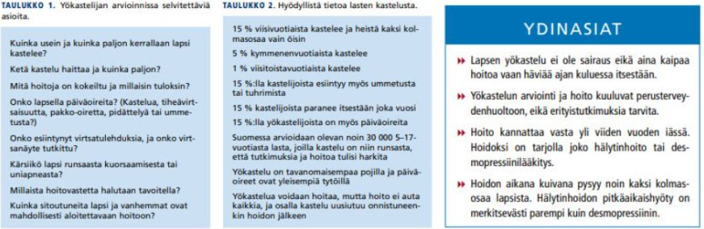
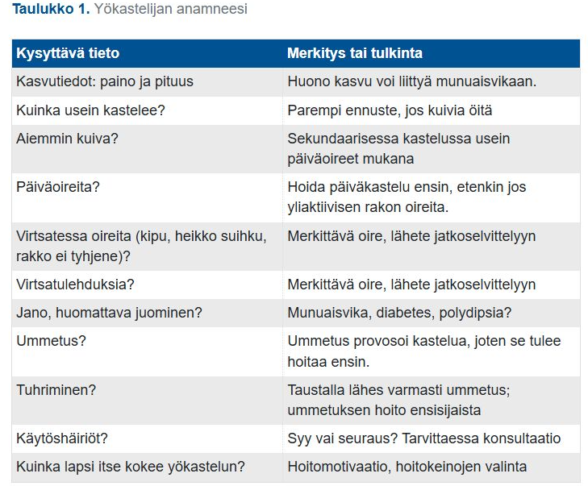
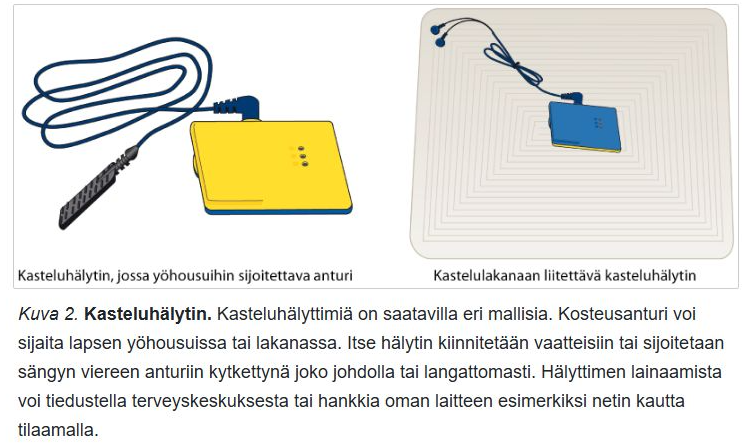
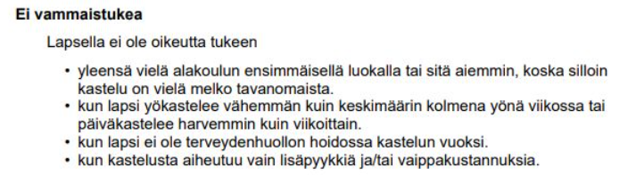
  

### Essee: vastasyntyneen kellastuminen {#Vastasyntyneen-kellastuminen-essee}

  <button class="solution-button"
          data-label="Vastaus"
          data-hide-label="Piilota vastaus">
    Vastaus
  </button>
  

Sikiöaikana valtaosa istukasta palaavasta verestä ohittaa maksan laskimotiehyen kautta. Istukka huolehtii kuona-aineiden poistosta, ja monet maksan metaboliareitit, kuten bilirubiinin konjugaatio ja eritys sappeen, käynnistyvät kunnolla vasta lapsen synnyttyä. 

Maksassa konjugoitu bilirubiini erittyy sapen mukana suolistoon, josta osa siitä imeytyy uudestaan takaisin verenkiertoon. Vastasyntyneen punasolujen määrä on suhteessa suuri, ja niiden hajotessa syntyvän bilirubiinin määrä suurempi kuin muissa elämän vaiheissa. Vastasyntyneen kyky konjugoida bilirubiinia on samalla vajavaista. Tämä johtaa konjugoimattoman bilirubiinin pitoisuuden kasvuun veressä eli kellastumiseen. Niukka ravinnonsaanti ja vähäiset ulosteet lisäävät bilirubiinin enterohepaattista kiertoa, mikä kasvattaa edelleen veren bilirubiinitasoa.

---

**Lähes kaikki vastasyntyneet kellastuvat ainakin jossain määrin ensi elinpäivinään. Tämä ns. fysiologinen kellastuminen on normaali ilmiö. Se saavuttaa huippunsa 3–5 vuorokauden iässä ja häviää yleensä kahden viikon ikään mennessä.**

Bilirubiinipitoisuutta voidaan arvioida tarkoitusta varten kehitetyllä ihomittarilla, joka antaa summittaisen arvion bilirubiinitasosta. Mikäli ihomittauksen tulos ylittää lapsen kypsyysikää vastaavan raja-arvon tai lapsella on muita oireita kellastumisesta tulee tehdä veren bilirubiinimääritys. 

_Konjugoimaton bilirubiini läpäisee veri-aivoesteen. Jos sen pitoisuus on hyvin suuri, se voi aiheuttaa väsymystä ja vaurioittaa kehittyviä aivoja (kernikterus)._ Tämän takia liiallista kellastumista tulee hoitaa. Fysiologinen keltaisuus on yleensä harmitonta, mutta **mikäli bilirubiinitaso on lapsen gestaatioikään nähden liian korkea, voidaan sitä laskea sinivalohoidolla** (ei toimi konjugoituneeseen hyperbilirubinemiaan ja se vaatii eri selvittelyt/hoidot).

Valohoitoraja riippuu lapsen gestaatioiästä, syntymäpainosta ja kronologisesta iästä. Valohoidon kynnysarvo on sitä matalampi, mitä ennenaikaisempana lapsi on syntynyt. Ennenaikaisuus on siis tärkein vastasyntyneen keltaisuudelle altistava tekijä. Syntymän jälkeen valohoidon kynnysarvo nousee ensimmäisten elinpäivien aikana ja hoitoa aloitettaessa huomioidaan mahdolliset muut kellastumisen riskitekijät, kuten veriryhmäimmunisaatio, runsaat mustelmat (esim. päälakipahka mm. ikukupin aiheuttamana), polysytemia ja äidin diabetes. 

<li>Sinivalo muuttaa iholla konjugoimattoman bilirubiinin rakenteen vesiliukoiseksi ja helpommin virtsaan erittyväksi fotoisomeeriksi. Lapsen paljaalle iholle kohdistetaan valo erityisellä valohoitolampulla ja/tai vartalon alle sijoitettavalla patjalla. Silmät suojataan laseilla hoidon aikana.</li>
<li>Sinivalohoitoa voidaan antaa synnytyssairaalassa tai kotisairaalan seurannassa myös kotona</li>
<li>Veriryhmäimmunisaation aiheuttaman kellastumisen hoitoon voidaan valohoidon lisäksi käyttää suonensisäistä immunoglobuliinihoitoa. Immunoglobuliinin annosta ei ole hyötyä muista syistä johtuvan keltaisuuden hoidossa.</li>

---

Vastasyntyneen keltaisuutta tulisi ainakin **epäillä patologiseksi,** jos 

<li>se ilmenee ensimmäisen elinvuorokauden aikana</li>
<li>seerumin bilirubiinipitoisuus suurenee nopeasti (yli 85 mikromol/l/vrk) tai ylittää sikiöiän mukaisen turvallisuusrajan</li>
<li>ilmenee sairaalla lapsella (esim. infektiosta johtuvaa)</li>
<li>on pitkittynyttä (>1vk täysiaikaisella tai >2vk keskosella; näin dioissa, mutta suurimmassa osassa lähteitä rajana pitkittyneelle on >2vk täysiaikaisille tai 3-4vk keskosilla)</li>

---

**Patologisen keltaisuuden yleisimpiä aiheuttajia ovat:**

<li>Hemolyysitauti: ABO- tai Rh-veriryhmäsopimattomuus, G6PD-entsyymin puutos, sferosytoosi</li>
<li>Infektiot: Sepsis, keuhkokuume tai kohtuaikaiset infektiot (TORCH-infektiot)</li>
<li>Maksan ja sappiteiden ongelmat: Sappitieatresia (biliaariatresia), neonataalihepatiitti tai aineenvaihduntasairaudet (esim. galaktosemia)</li>
<li>Verenpurkaumat: Hematoomien resorboituminen; esim. kefalohematooma eli päänahkan alainen verikertymä</li>

---

Pitkittyneen keltaisuuden taustalla on useimmiten kuitenkin ns. **rintamaitokeltaisuus,** joka ei sinänsä ole patologista. Sen syytä ei tunneta, mutta on esitetty, että taustalla saattaisi olla rintamaidon sisältämät äidin hormonit tai rintamaidon vapaat rasvahapot (rintamaidon β-glukuronidaasi voi tehostaa enterohepaatista kiertoa). 

Rintamaitokeltaisuus on periaatteessa poissulkudiagnoosi. Tärkeimmät erotusdiagnoosit ovat kuivuma, virtsatieinfektio, vastasyntyneen hepatiitti (neonataalihepatiitti) ja äärimmäisen harvoin hoitamaton synnynnäinen hypotyreoosi. Sappitieatresia johtaisi konjugoidun bilirubiinin lisääntyvään suurenemiseen; samalla ulosteet olisivat vaaleita yleensä. 

Keltaisuuden jatkuessa yli kahden viikon on siis aina syytä varmistaa, ettei kysymyksessä ole konjugoituneen bilirubiinin määrän lisääntyminen, vaikka lapsen muu vointi ei antaisikaan aihetta huoleen. Konjugoituneen bilirubiinin tutkimisesta on tehtävä erillinen pyyntö laboratoriolle, ja tutkimukseen tarvitaan useimmiten laskimoverinäyte. Konjugoidun bilirubiinin mittaaminen voidaan tehdä perusterveydenhuollossa, jos tulos on käytettävissä nopeasti eikä aiheuta viivettä erikoissairaanhoitoon lähettämisessä. Jos mahdollista, niin tulisi tutkia myös muita vakavia syitä ja tarkistaa:

<li>S-Bil ja S-Bil-kj -> _Jos konjugoitu bilirubiini on > 20 % kokonaisbilirubiinista tai yli 20 µmol/l, tarvitaan kiireellisiä erikoissairaanhoidon jatkotutkimuksia sappitieatresian poissulkemiseksi._</li>
<li>Pvk+t, Coombs, retikulosyytit</li>
<li>ALAT</li>
<li>TSH</li>
<li>Ulosteen ja virtsan väri</li>

---

Jos lapsi voi hyvin, paino nousee ja hänellä on vain pitkittynyttä keltaisuutta ja konjugoitumaton hyperbilirubinemia, niin kyseessä on todennäköisimmin rintamaitokeltaisuus. Rintamaitokeltaisuus on vaaratonta eikä sitä tarvitse hoitaa. 

Imetystaukoa ei suositella, koska se voi johtaa imetyksen loppumiseen kokonaan ja rintaruokintaa saa jatkaa, jos bilirubiinitasot eivät seurannassa anna aihetta muihin selvittelyihin ja lapsi voi hyvin. 

---

Jos lapsi kellastuisi uutena yli 2 viikon iässä (alle 2vk syntymästä yleensä vanhemmilla on yleensä vapaa yhteys synnytyssairaalaan ongelmatilanteiden selvittelyssä), hänet lähetetään lastenpoliklinikkaan lisätutkimuksiin kiireellisesti < 1 viikon lähetteellä tai päivystyslähetteellä seuraavana arkipäivänä (tai heti jos epäily esim. sepsiksestä tai vaikeasta hemolyysistä). Laboratoriokokeiden ottaminen perusterveydenhuollossa ei ole välttämätöntä ennen lähettämistä. 

<li>Ilmeisesti oikeassa elämässä lähete tulee usein takaisin rintamaitokeltaisuuden diagnoosilla, mutta terveysportin ohjeiden mukaan yli 2vk iässä kellastuvat ohjataan ESH.</li>

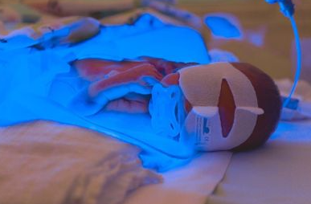
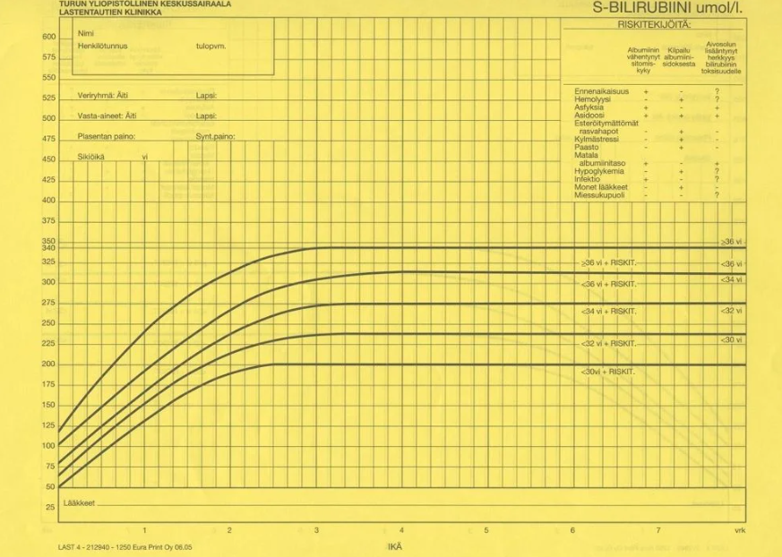
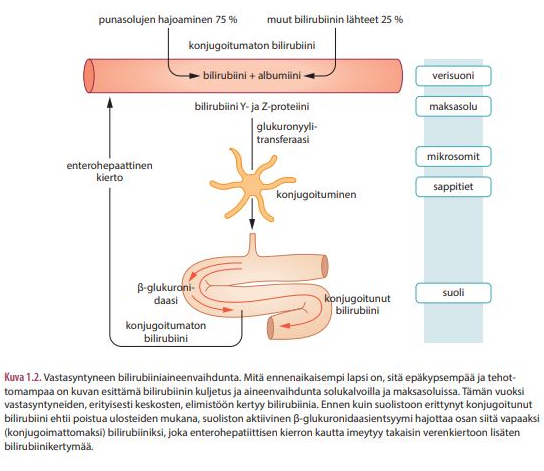

  

### Essee: tuhkarokko {#Tuhkarokko-essee}

  <button class="solution-button"
          data-label="Vastaus"
          data-hide-label="Piilota vastaus">
    Vastaus
  </button>
  

Tuhkarokko (morbilli, eng. measles) on yleisvaarallinen tartuntatauti, jonka aiheuttaja on paramyksoviruksiin (negatiivisäikeinen RNA-virus) kuuluva tuhkarokkovirus (morbillivirus hominis). Se **tarttuu äärimmäisen helposti;** tartuntareitti yleensä kosketus- ja pisaratartuntana, mutta myös ilmateitse. Virukset säilyvät tartuttavina huoneilmassa ja pinnoilla jopa 2 t.

---

Itämisaika on yleensä 9–11 vrk (7–21 vrk) katarraalioireiden alkuun, 14 vrk ihottuman alkuun. _Tartuttavuus alkaa hieman ennen katarraalioireita (4 vrk ennen ihottuman puhkeamista) ja loppuu 4 vrk ihottuman alkamisen jälkeen._ Tyypilliset katarraalioireet ovat siis ns. **"5 C:tä": Cough (Hakkaava yskä), Coryza (Nuha), Conjunctivitis (Sidekalvotulehdus), "Coplik" eli Koplik spots (Koplikin täplät; poskien limakalvolle ilmestyviä vaaleanpunaisia, keskeltä sinivalkoisia 1–3 mm:n täpliä), "Cuume" eli kuume.**

_Ihottuma alkaa usein korvien takaa ja kasvoilta ja siirtyy siitä vartalolle ja raajoihin. Ihottuma on yleensä makulopapulaarinen ja muuttuu loppuvaiheessa violetin sävyiseksi. Läiskät yhtyvät laajemmaksi ihottuma-alueeksi. Kestää yleensä noin viikon._ 

---

Tuhkarokkoa on syytä epäillä, jos lasta ei ole rokotettu ja hänellä on kuumeinen ylähengitystieinfektio ja siihen liittyvä ihottuma. Tuhkarokon mahdollisuutta lisää oleskelu alueella, jossa esiintyy tuhkarokkoa, tai kontakti henkilöön, jolla epäillään tuhkarokkoa. Jos altistus on poikkeavan tiivis ja pitkäkestoinen, voi rokotettukin saada tuhkarokon. Tällöin taudinkuva on yleensä lievä ja vaikeasti tunnistettavissa.

Jos epäilet tuhkarokkoa, konsultoi tartuntataudeista vastaavaa lääkäriä tai infektiolääkäriä. Tällöin arvioidaan, onko kyseessä perusteltu tuhkarokkoepäily. _Diagnoosi on aina varmennettava vasta-ainemäärityksin ja nielunäytteen PCR-tutkimuksella._

**Vaatii eristyksen, altistuneiden jäljityksen ja rokottamattomille ja tautia sairastamattomille altistuneille THL:n ohjeen mukaisesti MPR-rokotuksen tai i.v.-immunoglobuliinin annon.** Tuhkarokolle altistuneeksi määritellään henkilö, joka on ollut tartuttavuusaikana samassa tilassa samanaikaisesti tai 2 tunnin kuluessa siitä kun tuhkarokkopotilas on poistunut tilasta.

**Hoito on oireenmukainen** eikä parantavaa hoitoa ole. Matalan tulotason maissa A-vitamiinin antaminen saattaa parantaa tuhkarokon ennustetta (jos on puutetta A-vitamiinista, ovat tuhkarokon komplikaatiot todennäköisempiä). 

---

Tuhkarokkoon liittyvä kuolleisuus johtuu taudin **komplikaatioista,** joista yksi merkittävimpiä on muille infektioille, kuten keuhkokuumeelle (>10 %:lle), altistava immunosuppressio. Tietysti myös välikorvatulehdus on mahdollinen, onhan kyseessä ylähengitystieoireita aiheuttava infektio.

<li>Harvinainen, mutta vaikea komplikaatio on aivotulehdus, joka ilmaantuu 1–2/2 000 potilaista.</li>
<li>Vielä harvinaisempi on yhdelle sadastatuhannesta potilaasta vuosien kuluttua kehittyvä kuolemaan johtava subakuutti skeloroisova panenkefaliitti (SSPE); diagnosoidaan kuvantamisella (MRI/TT) ja osoittamalla anti-tuhkarokkovirusvasta-aineita likvorista.</li>

---

Paras tapa välttyä tuhkarokkoinfektiolta on MPR-rokotusten ottamisella (2 annosta kuuluu lapsuudessa kansalliseen rokotusohjelmaan). Rokotusohjelman mukaisesti MPR-rokote annetaan 12–18 kk:n ja 6 v:n iässä. Tuhkarokon korkean tartuttavuuden takia tavoitellaan aina >95% kattavuutta väestössä MPR-rokotteen suhteen. Vuonna 1982 aloitettujen rokotusten takia kotoperäinen tuhkarokko on käytännössä hävinnyt Suomesta. Vain muutamia tapauksia vuodessa todetaan, nekin useimmiten matkailijoilla.

MPR-rokote on elävä heikennetty rokote, jonka takia sitä ei voi antaa immuunivajeisille/-suppressoiduille tai raskaana oleville. 

  

### Essee: kurkunpäätulehdus {#Kurkunpaatulehdus-essee}

  <button class="solution-button"
          data-label="Vastaus"
          data-hide-label="Piilota vastaus">
    Vastaus
  </button>
  

Laryngiitti eli kurkunpäätulehdus on **kurkunpään virusinfektio** (tavallisimmin parainfluenssa, rhino-, respiratory syncytial-, boca- ja epidemian aikana myös influenssavirukset. Muita mahdollisia aiheuttajia ovat metapneumo-, entero- ja adenovirukset), jonka **tavallisimmat oireet ovat kuiva, usein haukkuva (seal-bark) yskä ja hankalammissa tapauksissa sisäänhengityksen stridor (vinkuna).** Oireet johtuvat virusinfektion aiheuttamasta turvotuksesta äänihuulten alaisessa tilassa.

Yskä jatkuu ensioireiden jälkeen yleensä tavallisena yskänä muutamasta päivästä viikkoon. Kurkunpäätulehdusta edeltävät tavallisesti ylähengitysteiden oireet 12–72 tunnin ajan, ja hengitysvaikeus alkaa usein äkillisesti yöllä.

---

**Lasten kurkunpäätulehduksen diagnoosi on kliininen. Taudinkuva on yleensä selkeä ja äänekkään sisäänhengityksen taustalla on hyvin harvoin muu syy kuin kurkunpäätulehdus.** Jos taudinkuva on epätyypillinen, oireet ovat vaikeita tai vaste hoitoon on huono, erotusdiagnostiikassa tulee ottaa huomioon kurkunkansitulehdus (epiglottiitti), bakteerin aiheuttama henkitorven tulehdus (trakeiitti), kurkunpään turvotus, nielupaiseet (peritonsillaari- ja retrofaryngeaalinen absessi) ja hengitysteiden vierasesineet.

<li>Tyypillisin ikäryhmä tähän lasten erityispiirteiseen laryngiittiin (pseudokruppiin), jossa ilmenee tämä haukkuva yskä ja stridor on 12-36kk; koluikäisillä ja aikuisillakin siis ilmenee laryngiittiä usein, mutta ei ole yleensä näin vakavaoireinen. Jos kurkunpäätulehdukseen sopivia oireita esiintyy alle puolen vuoden ikäisellä lapsella tai lapsen ensimmäisen virusinfektion yhteydessä, tulee huomioida hengitysteiden rakenteelliset ja toiminnalliset poikkeavuudet. Alle vuoden ikäisillä mahdollisia poikkeavuuksia ovat laryngomalasia, hemangioomat, lymfangioomat, kurkunpään kehityshäiriöt, kuten ahtaumat, kystat, halkiot ja limakalvopurjeet ja juveniili papillomatoosi.</li>

---

Lapsen hengitysvaikeuden tila arvioidaan kliinisesti. Sisäänhengityksen vaikeuden merkkejä ovat yleensä korvin kuullen havaittavan stridorin lisäsi apuhengityslihasten käyttö ja hengitystiheyden nousu. Happeutuminen on tarkastettava pulssioksimetrilla kaikissa tapauksissa, joissa lapsen hengitys on vaikeutunut, ja tarvittaessa (happisaturaatio alle 95 %) on annettava lisähappea.

Päivystyksellisiä laboratoriokokeita tai röntgenkuvia ei komplisoitumattomassa laryngiitissa tarvita.

---

Kurkunpäätulehdus on lieväoireinen 85 %:lla lapsista ja vain 1 %:lla on vaikea kurkunpäätulehdus. **Tavallinen kurkunpäätulehdus, johon ei liity hengitysvaikeutta, paranee itsestään.**  Levossa esiintyvä äänekäs sisäänhengitys tai kurkunpäätulehdukseen liittyvä lieväkin pulssioksimetrilla todettava happeutumishäiriö viittaavat vaikeaan tautiin.  

_Suurin osa lapsista voidaan hoitaa kotona._ **Ensisijainen hoito on oireenmukainen** + äänilepo (jos vanhemmalla lapsella/aikuisella ja pystyy ohjeistamaan). Kuumeisen ylähengitystieinfektion aikana hyvä nestetasapaino sekä tulehduskipulääkkeet helpottavat laryngiittipotilaan vointia. Höyryhengityksen tehosta ei ole näyttöä, mutta jotkut voivat kokea siitä hyötyä.

**Jos lapsella on hengitysvaikeus, se helpottaa useimmiten istuvassa asennossa ja viileä ilma helpottaa kurkunpäätulehduksen oireita.** Huoneilman viilentämisen voi toteuttaa esimerkiksi pitämällä ikkunan auki. Jos hengitysvaikeus ei nopeasti helpotu 15–20 minuutin kuluessa, lapsi tulee viedä päivystykseen.

Laryngiittiin liittyvä **hengitysvaikeus hoidetaan suun kautta annettavalla glukokortikoidilla** (deksametasonin annos on 0.15–0.6 mg/kg suun kautta tai lihakseen (enintään 8 mg); beetametasonia erityislupavalmisteena voi myös käyttää, annos on 0.25–0.4 mg/kg suun kautta (enintään 7 mg). Nesteeseen liuotettava 0.5 mg:n tabletti maistuu paremmalta kuin deksametasoni). Jos hengitysvaikeus jatkuu huolimatta suun kautta annostellusta glukokortikoidista, voidaan tarvittaessa antaa lisälääkkeenä, yleensä sairaalassa, 2 mg inhaloitavaa budesonidia.

**Vaikeassa, äkillisessä tilanteessa voidaan käyttää lisäksi inhaloitavaa raseemista adrenaliinia höyrystävällä inhalaattorilla.** Raseeminen adrenaliini lievittää tehokkaasti laryngiitista johtuvan hengitysvaikeuden oireita, mutta sen vaikutus on lyhyt, vain 1–2 t. Koska hengitysvaikeus palaa yleensä 1–2 t:n kuluessa, raseemista adrenaliinia saaneet potilaat on lähetettävä ensiavun jälkeen herkästi sairaalahoitoon tai heitä on seurattava polikliinisesti riittävän kauan (vähintään 1–2 t). 

**Mikrobilääkkeistä, keuhkoputkia avaavista lääkkeistä, antihistamiineista, yskänlääkkeistä tai höyryhengityksestä ei ole hyötyä lasten kurkunpäätulehduksen hoidossa.**

---

Sairaalaan voidaan lähettää tietyissä tapauksissa ja lapsi voidaan ottaa osastoseurantaan, ja joskus jopa teho-osastolle. Sairaalaan kuuluu lähettää, jos 

<li>yleistila on huonontunut</li>
<li>inspiratorinen stridor jatkuu ensiapulääkityksestä huolimatta</li>
<li>hengitysvaikeus uusiutuu ensiapulääkkeen jälkeisen päivystysseurannan (1–2 t) aikana tai</li>
<li>todetaan pienentynyt happisaturaatio (< 95 %) ensiapulääkkeen jälkeisen päivystysseurannan aikana</li>

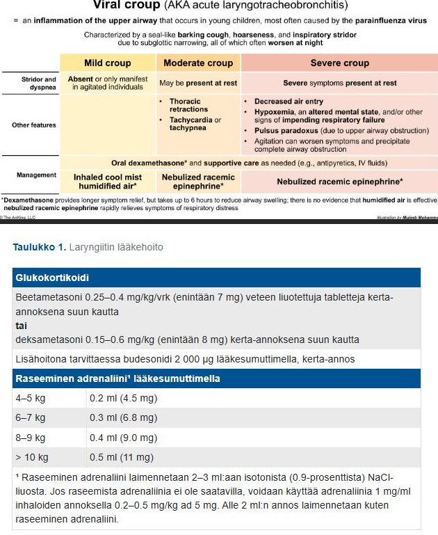

  

### Laktoosi-intoleranssin ja keliakian diagnostiikka {#Laktoosi-intoleranssi-ja-keliakia-dg}

  <button class="solution-button"
          data-label="Vastaus"
          data-hide-label="Piilota vastaus">
    Vastaus
  </button>
  

Lapsen vatsavaivojen taustoja selvittävät tutkimukset tehdään ensisijaisesti perusterveydenhuollossa. **Yleisimpiä poissuljettavia sairauksia ovat keliakia ja tulehdukselliset suolistosairaudet. Laktoosi-intoleranssi on hyvä poissulkea kouluikäisillä lapsilla.** Tavallisin pitkittyneen vatsakipuilun aiheuttaja on kuitenkin ummetus, muita toiminnallisia suolisairauksia (lapsilla ja nuorilla) ovat mm. ärtyvän suolen oireyhtymä ja dyspepsia. 

---

Keliakia on autoimmuunivälitteinen sairaus, jossa ravinnon sisältämä gluteeni aiheuttaa perimältään alttiille henkilölle tulehduksen ohutsuolen limakalvolle. Tyypillisimmät oireet ovat krooninen ripuli tai löysät ulosteet, ilmavaivat, laihtuminen ja lapsilla kasvun hidastuminen. Oireet ovat usein varsin lieviä ja voivat muistuttaa ärtyvän suolen oireita; kannattaa siis useissa tilanteissa **hyvin matalalla kynnyksellä seuloa keliakiaa.**

Ensisijaisena tutkimuksena on IgA-luokan kudostransglutaminaasivasta-aineiden määritys seerumista ja samalla myös tarkastetaan veren IgA-pitoisuudet. S-tTGAbA + S-IgA yhdessä ovat ns. keliakiaseula. Huom! vasta-aineet (ja ohutsuolibiopsia) tulee tutkia normaalin ruokavalion aikana. Jos potilas on aloittanut keliakiaruokavalion, hänen tulee palata gluteenipitoiseen ruokavalioon vähintään 3 kk:n ajaksi ennen näytteiden ottoa.

<li>Jos kudostransglutaminaasivasta-aineiden pitoisuus on >10x viitearvojen ylärajasta, määritetään endomysium-vasta-aineet (S-EMAbA). Jos tämä on positiivinen, niin diagnoosi voidaan asettaa ilman biopsiaa.</li>
<li>IgA-puute on yleisempää keliakiapotilailla ja jos potilas on IgA-puutteellinen, niin seulontatutkimuksessa tutkitaan lisäksi IgG-luokan transglutaminaasivasta-aineet ja tulos ilmoitetaan vastauksessa</li>
<li>Ellei diagnoosia voida asettaa riittävän korkeiden vasta-ainepitoisuuksien perusteella (ttgab < 10x viitealueen ylärajan tai endomysiumvasta-aineet ovat negatiiviset), diagnoosin tulee perustua ohutsuolibiopsioihin (tai ihokeliakiassa ihobiopsioihin)</li>
<li>HUOM! Lasten keliakian diagnoosin tekee lastentautien EL ja ihokeliakian ihotautien EL. Lapsi siis lähetetään lastenlääkärille, jos kudostransglutaminaasivasta-aineet ovat vähänkään koholla (ei siis tarvitse olla >10x). Vrt. aikuisten keliakia, jonka voi diagnosoida PTH:ssakin yleislääkärinä.</li>
<li>Hoitona on elinikäinen gluteeniton ruokavalio.</li>

---

Primaarinen laktoosi-intoleranssi eli klassinen laktoosi-intoleranssi, joka johtuu perintötekijän säätelemästä suolen laktaasitason laskusta iän myötä alkaa tyypillisesti yleensä viiden ikävuoden jälkeen kouluiässä; lähes kaikki potilaat sairastuvat viimeistään aikuisikään mennessä. Laktoosin imeytymishäiriötä ja sen aiheuttamaa laktoosin sietämisen ongelmaa eli laktoosi-intoleranssia esiintyy noin kuudesosalla (n. 18%) suomalaisista; maailmalla jopa 65-70% on laktoosi-intolerantteja. Laktoosi-intoleranssi voi myös johtua sekundaarisesta syystä, kun mikä tahansa ohutsuolen nukkavaurioon johtava sairaus (esim. keliakia tai gastroenteriitti) voi aiheuttaa laktaasin puutteen (väistyvä altistavan tekijän korjaamisen jälkeen).

Oireina on yleensä 1–2 tunnin kuluessa laktoosin nauttimisen jälkeen ilmaantuvat vatsanturvotus, ilmavaivat, vatsakipu ja (vesi)ripuli. Joskus tuhriminen voi olla ainoa oire. Kun laktoosi pääsee pilkkoutumatta ja imeytymättä paksusuoleen, se toimii siellä osmoottisena aineena -> vesiripuli. Paksusuolen bakteerit myös alkavat fermentoida laktoosia ravinnokseen -> kaasu, metaani, hiilidioksidi -> ilmavaivat. 

**Anamneesi ja laktoosin eliminaatio/altistuskoe riittää yleensä tyypillisesti diagnoosiin.** Jos potilas saa selvää helpotusta vaivaansa vähentämällä laktoosia tai poistamalla sen kokonaan ja oireet palautuvat laktoosin käytön jatkuessa, diagnostinen testaus hypolaktasian suhteen ei ole välttämätöntä. 

<li>Jos diagnoosi jää epävarmaksi (laktoosin jättäminen pois ei vaikuta oireisiin), **primaarinen hypolaktasia voidaan varmistaa laskimoverinäytteestä geenitestillä (B-Lakt-D1):** Genotyyppi CC liittyy laktaasipuutteeseen, kun taas laktoosia sietävillä genotyypit ovat CT ja TT (poissulkevat pääsääntöisesti primaarisen hypolaktasian kaiken ikäisiltä, ja heillä laktaasiaktiivisuus on korkea läpi elämän). Harvinaisempia testejä ovat mm. laktoosirasituskoe ja hengitystesti.</li>
<li>Kannattaa myös muistaa, että keliakia voi aiheuttaa sekundaarisen hypolaktasian siihen liittyvän suolinukkavaurion takia, ja sen vuoksi _keliakian poissulkeminen on usein suositeltavaa_ (varsinkin jos vaivat jatkuvat / palaavat)</li>
<li>Erotusdiagnostiikassa tulee muistaa myös muut GI-kanavan sairaudet ja alkueläininfektiot, etenkin jos vaste ruokavaliomuutokselle jää huonoksi. Myös IBS-potilas voi saada laktoosista oireita ilman klassista laktoosi-intoleranssia.</li>
<li>Hoitona on laktoositon/vähälaktoosinen ruokavalio; suuri osa potilaista sietää pieniä tai kohtalaisia määriä laktoosia, minkä vuoksi he voivat käyttää vähälaktoosisia tuotteita. Osa potilaista vaatii täysin laktoosittoman ruokavalion. Osa potilaista saattaa hyötyä laktaasikapseleista, jotka sopivat kuitenkin vain tilapäiseen käyttöön.</li>

  

### 13-v poika, 3 viikkoa ripulia, 5 krt päivässä, viikon ajan jokaisella ulostuskerralla verta mukana. Yleistila hyvä, ei infektio-oireita, ei ulkomaanmatkoja ei ab-kuureja. Muu perhe terveenä. Laihtunut 2 kg 3 kk aikana. Todennäköisimmät erotusdg? Mitä labroja? Kuinka toimit? {#13v-ripuli}

  <button class="solution-button"
          data-label="Vastaus"
          data-hide-label="Piilota vastaus">
    Vastaus
  </button>
  

Kuukauden sisällä alkanut, 3 viikkoa jatkunut veriripuli yhdistettynä 2 kg painonlaskuun 13-vuotiaalla pojalla viittaa vahvasti krooniseen suolistotulehdukseen, jonka taustalla on todennäköisimmin tässä tapauksessa ilman matkustusta tai ab-kuureja tulehduksellinen suolistosairaus (IBD) eli haavainen paksusuolentulehdus (colitis ulcerosa) tai Crohnin tauti. 

Muita mahdollisia syitä ovat esim. pitkittynyt bakterielli koliitti (esim. Campylobacter, Salmonella, Clostridioides), mutta ilman matkustusta tai antibioottikuuria tämä on epätodennäköisempi -- tosin on aina poissuljettava ennen immunosuppressiivisen hoidon aloitusta.

Keliakia tulee myös pitää mielessä, vaikka verta sisältävä ripuli ei ole keliakian tyypillinen oire. Se voi kuitenkin aiheuttaa kroonista ripulia ja painonlaskua ja ripulin ja toistuvan pyyhkimisen aiheuttamat anushaavat voivat johtaa veren toteamiseen paperissa. 

Muita harvinaisempia syitä veriulosteisuudelle ovat juveniilit polyypit ja Meckelin divertikkeli, mutta nämä eivät yleensä aiheuta pitkittynyttä ripulia. 

---

IBD on siis selvä työdiagnoosi tässä. Sen tyypillisimmät oireet ovatkin ripuli, tihentynyt ulostamistarve, ajoittainen verentulo ulosteiden mukana, vatsakipu ja laihtuminen (varsinkin Crohnin taudissa). Statuslöydöksiä voi olla mm. vilkkaat suoliäänet ja lievä aristus palpaatiossa, Crohnin taudissa joskus aftoja suussa, mahdollisesti hetuloita peräaukossa. Crohnin taudin koliittia ei oireiden perusteella pysty erottamaan haavaisesta koliitista; Crohnin taudissa potilas voi myös olla lähes oireeton ja laihtuminen, kasvuhäiriö sekä mahdollinen puberteetin viivästyminen herättävät tautiepäilyn. 

Diagnostiikka:

<li>Selkeästi herkin suolistotulehduksen mittari on **ulosteen kalprotektiini,** vaikka sen tarkkuus IBD:n suhteen ei olekaan kovin hyvä, sillä se saattaa nousta myös mm. akuutissa gastroenteriitissa, keliakiassa ja ruoka-allergiassa. Saattaa olla normaali proktiitissa. Lisäksi se on melko usein poikkeavan korkea ensimmäisten elinvuosien aikana ilman, että lapsella on mitään osoitusta suolistotulehduksesta. Tämän takia ulosteen kalprotektiinia ei pidä yleensä tutkia alle kaksi viikkoa kestäneen ripulin yhteydessä eikä taaperoikäiseltä tai sitä nuoremmalta lapselta.</li>
<li>Muut syyt oireisiin ja löydöksiin tarvittaessa poissuljettava: Keliakia (ttgaba+iga), laktoosi-intoleranssi, ulosteen mikrobiologiset tutkimukset (bakteeri-, virus-, ja parasiitti-nho, clostridium-toksiinit). (huom Clostridium usein positiviinen alle 2-vuotiailla -> älä ota <2-vuotiailta)</li>
<li>Otetaan lisäksi myös peruslabroina PVK+T, La, Alb, (tfr, ferrit). Potilailla usein anemia, hypersedimentaatio ja hypoalbuminemia. Kohtalaista tai vaikeaa IBD:ta sairastavalla lapsipotilaalla on yleensä vähintään yksi edellisistä. Tärkeää on myös arvioida puberteettistatus ja kasvukäyrä.</li>
<li>**Lopulta diagnoosi perustuu maha-suolikanavan tähystystutkimuksiin (gastro- ja ileokolonoskopia), jotka tehdään lapsille yleisanestesiassa. Lopullisen päätöksen lapsen tähystystarpeesta tekee tulehduksellisiin suolistosairauksiin perehtynyt lastenlääkäri.** Ulosteen mikrobiologiset näytteet kannattaa tutkia ennen tähystyksiä, koska joskus potilaalla saatetaan todeta esimerkiksi ulosteen Clostridioides difficile, vaikka hän ei olisi juuri edeltävästi antibioottia saanutkaan. Tähystystutkimusten jälkeen ohutsuolta voidaan hoitavan lääkärin harkinnan mukaan tutkia lisää magneettitutkimuksella ja kapseliendoskopialla.</li>

---

**Lapsi tarvitsee kiireellisen lähetteen lastengastroenterologialle arvioon ja tähystyksiin;** päivystyksellisesti voi harkita jos yleistila on merkittävän heikko, kehittyy huomattava kuivuma yms. Ota edellä mainitut verikokeet ja ulostenäytteet heti terveyskeskuksessa, jotta tulokset ovat käytettävissä erikoissairaanhoidon konsultaatiossa. Ei määrätä kortisonia tai ripulilääkkeitä PTH:ssa. Ohjeistetaan perhettä huolehtimaan riittävästä nesteen ja energian saannista.

  

### 4vko lapsi lähetetty keltaisuuden takia vastaanotolle. Lapsi hyvävointinen, virkeä, ja syö normaalisti. Työdiagnoosi, erotusdiagnostiikka, mitä tutkit, mikä hoito ja jatkot? {#4vk-keltaisuus}

  <button class="solution-button"
          data-label="Vastaus"
          data-hide-label="Piilota vastaus">
    Vastaus
  </button>
  

4-viikkoisen lapsen keltaisuus määritellään pitkittyneeksi keltaisuudeksi (tai jos uusi kellastuminen niin Terveysportin ohjeiden mukaan pitäisi aina ohjata ESH). Koska lapsi on hyvävointinen, virkeä ja syö normaalisti, kyseessä on suurella todennäköisyydellä hyvänlaatuinen tila, mutta konjugoitunut hyperbilirubinemia (tärkeimpänä sappitieatresia) on aina ehdottomasti poissuljettava.

Yleisin syy hyvänlaatuiselle pitkittyneelle keltaisuudelle täysin terveellä, rintaruokitulla ja hyvin kasvavalla imeväisellä on rintamaitokeltaisuus (johtuu todennäköisimmin rintamaidon β-glukuronidaasista, joka voi tehostaa enterohepaatista kiertoa). 

Rintamaitokeltaisuus on poissulkudiagnoosi, ja ennen sen asettamista suljetaan pois hoitoa vaativat kellastumisen syyt, esimerkiksi liian vähäinen maitomäärä, infektio, verenvuoto, sappitieanomalia ja punasolusairaudet.

Erotusdiagnostisesti tärkein jako tehdään konjugoimattoman (epäsuoran) ja konjugoituneen (suoran) hyperbilirubinemian välillä. Yli 2vk pitkittyneissä vastasyntyneen keltaisuuksissa on aina tarkistettava konjugoidun bilirubiinin määrä ja lisäksi suositellaan poissulkemaan myös muitakin syitä: 

<li>S-Bil ja S-Bil-kj -> _Jos konjugoitu bilirubiini on > 20 % kokonaisbilirubiinista tai yli 20 µmol/l, tarvitaan kiireellisiä erikoissairaanhoidon jatkotutkimuksia sappitieatresian poissulkemiseksi._</li>
<li>Pvk+t, Coombs, retikulosyytit</li>
<li>ALAT</li>
<li>TSH</li>
<li>Ulosteen ja virtsan väri</li>

---

Jos lapsi voi hyvin, paino nousee ja hänellä on vain pitkittynyttä keltaisuutta ja konjugoitumaton hyperbilirubinemia, niin kyseessä on todennäköisimmin rintamaitokeltaisuus. **Rintamaitokeltaisuus on vaaratonta eikä sitä tarvitse hoitaa.**

Imetystaukoa ei suositella, koska se voi johtaa imetyksen loppumiseen kokonaan ja rintaruokintaa saa jatkaa, jos bilirubiinitasot eivät seurannassa anna aihetta muihin selvittelyihin ja lapsi voi hyvin. Kestää yleensä 3–12 viikkoa, mutta se voi harvinaisissa tapauksissa kestää jopa 3 kuukautta. 

Konjugoimattoman hyperbilirubinemian taustalla voi myös olla mm. verenpurkaumien imeytyminen (etsi hematoomia), hemolyyttinen anemia (PVK+T, Retik ja Coombs tätä etsimässä), lievä infektio tai hypotyreoosi; näitä etsitäänkin rutiinisti labroilla.  

---

Jos olisi epäily sappitieatresiasta (konjugoitu hyperbilirubinemia tai haaleat ulosteet), niin ensisijainen tutkimus on sappiteiden UÄ ja tarvittaessa lisäkuvantamisiakin voidaan järjestää. Konjugoituneen bilirubiinin aiheuttamaa hyperbilirubinemiaa ei hoideta sinivalolla, ja lapsi on lähetettävä erikoissairaanhoidon yksikköön arvioitavaksi. Hoitona on Kasai-leikkaus (hepatoportoenterostomia, jossa luodaan yhteys maksan ja ohutsuolen välillä niin, että maksanulkoisten sappiteiden jäänteet korvataan ohutsuolella). Tarvittaessa vielä myöhemmin maksansiirto, jos kolestaasi ei laukea tai lapselle kehittyy maksakirroosin merkittäviä komplikaatioita. 

Sappitieatresian lisäksi muita konjugoidun hyperbilirubinemian syitä ovat esim. infektiot, sepsis, parenteraalinutritio, alfa-1-antitrypsiinin puutos, kystinen fibroosi, hepatiitti, sappitiekysta, galaktosemia. Sepsistilanteessa lapsi olisi yleistilaltaan heikko ja tietysti vaatisi päivystyslähetteen (samoin hemolyysipotilas); laboratoriokokeiden ottaminen perusterveydenhuollossa ei ole välttämätöntä ennen lähettämistä. 

  

### Infektiokierteinen lapsi terveyskeskuksessa {#Infektiokierre}

Ei tarkempaa kysymyksenasettelua. Mieti lasten infektiokierteen syyt, tutkimukset, hoito. 

  <button class="solution-button"
          data-label="Vastaus"
          data-hide-label="Piilota vastaus">
    Vastaus
  </button>
  

Lapsen infektiokierteellä tarkoitetaan yleensä **tiheästi toistuvia hengitystieinfektioita.** Lapset sairastavat normaalistikin n. 6 hengitystieinfektiota vuodessa (usein yli kahdeksaa vuosittaista episodia pidetään poikkeavana) ja useimmilla lapsilla on ainakin yksi välikorvatulehdus 2 vuoden ikään mennessä.

Osa lapsista sairastaa infektioita selvästi muita enemmän. **Infektiokierteelle ei ole yleisesti hyväksyttyä määritelmää, mutta noin 5–10 % lapsista sairastaa niin paljon infektioita, että heille ja heidän perheilleen on siitä selvästi haittaa.** Silloin lapsella on yleensä _8–12 hengitystieinfektiota ja vähintään kolme välikorvatulehdusta vuodessa ja oireita on yli 100 päivää vuodessa._ Toistuvien hengitystieinfektioiden aiheuttajina ovat samat virukset kuin muillakin lapsilla. Yli puolet infektioista on eri rinovirustyyppien aiheuttamia. Välikorvatulehduksen aiheuttajat ovat myös samat kuin muilla lapsilla. Infektiot voivat toistua niin usein, että seuraava virusinfektio alkaa ennen kuin edellisen oireet ovat menneet ohitse -> tästä tulee vaikutelma, että lapsi on "koko ajan kipeänä".

Infektiokierteessä on kyse nimenomaan toistuvista hengitystieinfektioista, joskin esimerkiksi satunnaiset ripulitaudit voivat lisätä sairastamisen taakkaa. Toistuva virtsatieinfektio, periodinen kuume ja toistuva nielutulehdus ovat eri ongelmia kuin tavallinen infektiokierre.

**Ylivoimainen enemmistö infektiokierteisistä lapsista on vastustuskyvyltään normaaleja,** mihin viittaavat seuraavat piirteet:

<li>infektiokierre alkaa lapsen siirryttyä kodin ulkopuoliseen päivähoitoon</li>
<li>infektiot rajoittuvat hengitysteihin</li>
<li>infektiot ovat virusten aiheuttamia</li>
<li>yksittäisestä infektiosta toipuminen sujuu normaalisti</li>
<li>kasvu ja kehitys ovat normaalit</li>
<li>kliininen status (ja keuhkokuva joskus otettuna, jos epäillään toistuvaa keuhkokuumetta) ovat normaalit</li>
<li>suvussa ei ole todettuja immuunipuutoksia</li>

---

Tavallisella infektiokierteellä tarkoitetaan siis tilannetta, jossa lapsi sairastaa tavanomaisia, lieviä infektiosairauksia niin paljon, että ne haittaavat merkittävästi lapsen ja hänen perheensä elämää, mutta hänellä ei ole immuunipuutosta tai muuta erityistä syytä sairastamiseen. **Kyseessä on lasten sairastamisen normaaliin vaihteluväliin sisältyvä hyvänlaatuinen tilanne,** joka menee ohi tai ainakin lievittyy iän mukana. _Infektiokierre ajoittuu yleensä yhden ja kolmen ikävuoden väliin._

Toistuvat hengitystieinfektiot varhaislapsuudessa ovat seurausta ympäristön virusaltistuksesta ja lapsen iän mukana kehittyvästä immuunipuolustuksesta. On normaalia, että lapset, jotka kohtaavat taudinaiheuttajia ensimmäistä kertaa, saavat usein oireisia infektioita. Kun spesifistä immuniteettia ei vielä ole, ovat pienet lapset enemmän luontaisen immuniteetin varassa kuin isommat lapset tai aikuiset.

**Tärkein riskitekijä on läheisten lapsikontaktien määrä. Päivähoidon suuri lapsiryhmä ja vanhempien sisarusten määrä perheessä ovat selvimpiä infektiokierteen taustatekijöitä.**

Etiologisina taustatekijöinä voi kuitenkin olla mm. 

<li>Lapseen liittyen</li>
  <ul>
    <li>toiminnallinen ongelma välikorvassa tai korvatorvessa</li>
    <li>gastroesofageaalinen refluksi (taipumus sairastaa runsaammin ylä- ja alahengitystietulehduksia)</li>
    <li>joskus lapsen toistuvan kuumeilun taustalla voi olla jaksoittainen kuumeoireyhtymä, joista osa on perinnöllisiä; yleisin on kuitenkin ei-perinnöllinen PFAPA</li>
    <li>synnynnäiset (esim. CVID, X-kromosomaalinen agammaglobulinemia, SCID...) tai hankinnalliset (esim. HIV) immuunipuutokset ovat harvinaisia, mutta niitä on muistettava epäillä</li>
    <li>muut infektioille altistavat biokemialliset poikkeavuudet, kuten kystinen fibroosi, Shwachmanin oireyhtymä, rusto-hiusdysplasia, värekarvojen synnynnäinen toimintahäiriö...</li>
  </ul>
<li>Ympäristöön liittyen</li>
  <ul>
    <li>Passiivinen tupakointi (tupakointi kotona voi suurentaa infektioiden määrän 2x)</li>
  </ul>

---

Infektiokierteestä kärsivien lasten akuutit infektiosairaudet diagnosoidaan tavanomaiseen tapaan **anamneesin ja statuksen perusteella.** Jos lapsella on toistuvaa hengityksen vinkumista, on huomioitava astman mahdollisuus.

Diagnostiikassa keskitytään siihen, sopiiko tilanne tavanomaiseen infektiokierteeseen vai voiko taustalla olla immuunipuutos tai esimerkiksi jokin neurologinen tai hematologinen perussairaus. Jos tilanne sopii tavalliseen infektiokierteeseen, ei tarvita immunologisia laboratoriotutkimuksia. **Laajan verenkuvan tutkiminen ja laskon (infektiottomassa vaiheessa) tutkiminen on kylläkin aiheellista avoterveydenhuollossa kertaalleen.** Akuutissa infektiossa toistuvaa keuhkokuumetta epäiltäessä keuhkokuva. 

Immuunivajavuusepäily herää varsinkin, jos on toistuvia bakteeri-infektioita, huonosti paranevia infektioita, epätyypillisiä taudinaiheuttajia yms. Tällöin kuuluu ESH:n selvittelyihin; PTH:ssa voi harkinnanvaraisesti plasman IgG-, IgA- ja IgM-taso (huomioi iänmukaiset viitearvot) ja harkinnanvaraisesti HIVAgAb. Immunoglobuliinit on helppo ottaa ja ne ovat usein suositeltuja matalahkolla kynnyksellä.

_Korvalääkäriä kannattaa konsultoida kuten muutenkin eli toistuvista välikorvatulehduksista (lapsi on sairastanut puolessa vuodessa yli 3 tai vuodessa yli 4 äkillistä välikorvatulehdusta) tai liimakorvataudista (>3kk eritteisyys välikorvassa) aiheutuu putkitusarvion tarve_ tai jos lapsella on suuhengitystä/kuorsausta/uniapneaepäily. 

---

**Yksittäiset infektiot hoidetaan samaan tapaan kuin muillakin lapsilla. Yleensä hoito on oireenmukaista;** antibiootteja tulee käyttää vain hyvin perustein. Pienen lapsen pitkään jatkuva nuha ei yleensä ole antibioottia vaativan poskiontelotulehduksen oire, vaan toistuvien virusinfektioiden aiheuttama. Äkillinen välikorvatulehdus pitää erottaa tilasta, jossa välikorvassa on eritettä, mutta tärykalvo ei pullota.

Tärkeää on, että vanhempia _autetaan selviytymään lapsen runsaan sairastamisen kanssa._ Vanhemmille kerrotaan lapsen infektiokierteen hyvänlaatuinen luonne ja hyvä ennuste ja heitä ohjataan etukäteen akuuttien sairauksien hoitoon. Eri perheet kokevat lapsen infektiokierteen hyvin eri tavoin, ja tuen tarve vaihtelee.

Sinänsä eritystä ei suositella. **Paljon sairastavan lapsen on tärkeää päästä osallistumaan päivähoitoon ja muuhun arkiseen elämään niin paljon kuin mahdollista.** Päivähoidosta pitää olla poissa voinnin mukaan, jos lapsi ei jaksa hoitoon mennä. Tietyille sairauksille on sovittu käytäntöjä siitä, kuinka kauan päivähoidosta pitää olla poissa. Muutoin lievät oireet eivät ole este hoitoon tai harrastuksiin menolle. 

**Tehokkaita estokeinoja ei yksittäisen lapsen kohdalla ole.** Vaikka päivähoito on yksi taustalla oleva syy, ei lapsen pidä jäädä pois varhaiskasvatuksen piiristä infektiokierteen vuoksi. Pienemmät lapsiryhmät ja hyvä hygienian ylläpito päivähoidossa ovat suositeltavia, mutta käytännössä niihin voi olla vaikea vaikuttaa. Influenssarokotus, muut rokotusohjelman rokotteet ja D-vitamiinilisä kuuluvat kaikille lapsille.

Toistuvia hengitystie- ja korvainfektioita sairastavalle lapselle **voidaan myöntää vammaistuki, jos lapsen katsotaan olevan infektiokierteessä, joka kestää vähintään puoli vuotta ja vaatii toistuvia hoitotoimenpiteitä.** Tuki annetaan 6 kk:n ajalta taannehtivasti ja yleensä määräaikaisesti.

<li>Lääkärin toteamia infektioita on kuukausittain (6–7 infektiota ja mikrobilääkekuuria vuodessa).</li>
<li>Oireettomia jaksoja voi olla 1–2 kk vuodessa</li>
<li>Lapselle kirjoitetaan C-todistus diagnoosilla J06.8 (lapsen infektiokierre).</li>

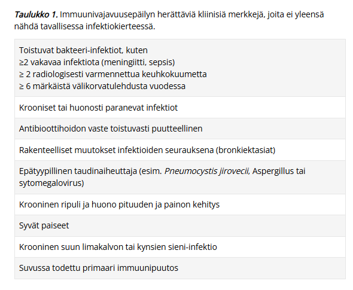
  

### Essee: Tehtävänannossa märkäruvelta kuulostava anamneesi. Todennäköisimmät aiheuttajat? Onko mikrobilääkehoidosta hyötyä, jos on niin mistä? {#Markaruvelta-kuulostaa}

  <button class="solution-button"
          data-label="Vastaus"
          data-hide-label="Piilota vastaus">
    Vastaus
  </button>
  

Märkärupi on yleinen, **useimmiten (80%) Staphylococcus aureus -bakteerin aiheuttama pinnallinen ihoinfektio; harvemmin (10%) nähdään beetahemolyyttisen streptokokin (Streptococcus pyogenes) aiheuttamia infektioita, joiden taudinkuva on yleensä vaikeampi** (nopeaa leviämistä ja tulehdusaktiivisuutta sekä vaarallisempia jälkitauteja). N. 10% tapauksista johtuu molemmista. Tauti voi levitä kosketuksen välityksellä helposti perhepiirissä, päivähoidossa tai koulussa. Kyseessä on yleensä lasten ihoinfektio. Ihomuutokset ovat tyypillisesti vähäoireisia (ei kutinaa tai kipua); yleisoireita tai kuumetta ei ole.

Kliinisesti jaetaan ei-rakkulaiseen (yleisempi) ja rakkulaiseen muotoon. 

<li>Ei-rakkulaisessa muodossa nähdään tyypillisesti punoittavia, tarkkarajaisia läiskiä, joiden päällä on hunajankeltaista rupea. Rupien irrotessa iholle jää tarkkarajaisia, vetistäviä eroosiopintoja, joiden reuna voi hilseillä kaulusmaisesti</li>
<li>Rakkulaisessa muodossa nähdään kirkasnesteisiä vesirakkuloita punoittavalla pohjalla. Puhkeamisen jälkeen esiintyy haavapintoja ja niiden ympärillä kaulusmaista hilseilyä. Rakkulainen muoto johtuu lähes yksinomaan S. aureus -infektioista (eksfoliatiivinen toksiini mahdollistaa bullien muodostumisen).</li>
<li>Molemmissa muodoissa tyyppipaikkoja ovat sierainten ympärykset, suun ympärys, kasvot ja taipeet, tosin rakkulainen märkärupi on enemmän keskivartalolla</li>

---

Kyseessä on yleensä kliininen diagnoosi, eikä jatkotutkimuksia tarvita. Anamneesissa kannattaa muistaa selvitellä sitä, onko viiteitä taustalla olevasta iho-ongelmasta (syyhy, täit, ekseemat). Huonossa hoitovasteessa tai riskipotilailla (matkustus, aikaisempi todettu resistenssi) poissuljetaan bakteeriviljelyllä metisilliiniresistentti S. aureus (MRSA). Toistuvissa infektioissa voidaan S. aureus -kolonisaatio osoittaa bakteeriviljelyllä usein myös sieraimista sekä monesti iholta PVL (Panton–Valentine leukosidiini) -eksotoksiinia tuottava kanta (-StauPVL).

---

Hoidetaan kliinisen vakavuusasteen perusteella (levinneisyys, oireet, lähikontaktien tapaukset, aikaisemmat hoidot). Hoitoresistentit tapaukset vaativat yleensä sisäistä lääkitystä.

**Lievässä pienialaisessa impetigossa hoidoksi useimmiten riittää rupien liottelu (tärkeää, koska rupien alla bakteeri voi selvitä hengissä) ja antimikrobinen voide (fusidiinihappo tai neomysiinin ja basitrasiinin yhdistelmä; hoito 1–2 viikkoa.** 

**Laajemmassa (>6cm2) tai vaikeampia oireita aiheuttavassa impetigossa käytetään paikallishoidon rinnalla S. aureukseen tehoavia sisäisiä mikrobilääkkeitä (ensisijaisesti flukloksasilliinia tai kefaleksiinia).** _Hiusten tai parran alueen impetigon ensisijainen hoito on myös oraalinen antibioottihoito_ (flukloksasilliini tai kefaleksiini), koska bakteerit pääsevät karvatuppeja pitkin syvemmälle ihoon, jolloin paikallinen hoito ei riitä näille alueille. **Oraalinen antibioottihoito kestää 7-10vrk.**

**Ekseemapotilailla tulee muistaa hoitaa myös ekseema** (altistaa muuten uusiutumiselle vaurioittaessaan ihoa) -> käytetään sisäisen mikrobilääkkeen kanssa paikallista glukokortikoidi-antimikrobiyhdistelmää (esim. Fucicort), kunnes iho on siisti.

Hoidon epäonnistumisen tavallisimmat syyt:

<li>Väärä diagnoosi: varsinainen tauti onkin syyhy, päätäi tai silsa</li>
<li>Ruvet on jätetty liottelematta. Niiden alla bakteeri voi selvitä hengissä.</li>
<li>Ekseeman hoito on unohtunut, ja iho on jatkuvasti rikki.</li>
<li>Toistuvassa märkäruvessa syynä voi olla sierainten kolonisaatio, joka kannattaa hoitaa paikallisella mikrobilääkkeellä (esim. fusidiinihappo tai mupirosiini). Infektio voi uusiutua myös kotieläimien tai lähikontaktien hygieniatarvikkeiden kautta (esim. pyyhkeet), jolloin suositellaan omien ja lähikontaktien hygieniatarvikkeiden vaihtoa, tekstiilien pesua ja tehostettua käsihygieniaa.</li>

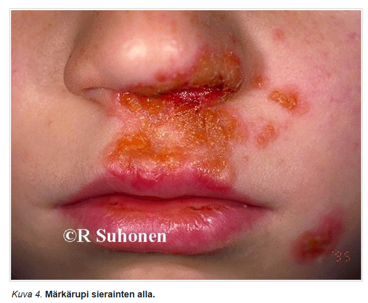
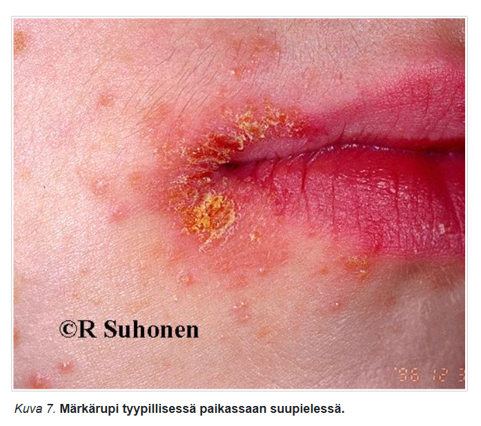

  

### Essee: lasten syöpätautien yleisimmät oireet ja löydökset {#Lasten-syovat-oireet-ja-loydokset}

  <button class="solution-button"
          data-label="Vastaus"
          data-hide-label="Piilota vastaus">
    Vastaus
  </button>
  

Syöpään sairastuu vuosittain Suomessa noin 150 alle 16-vuotiasta lasta, joten lasten syöpätaudit ovat harvinaisia. Varhaisen tunnistamisen haasteena kuitenkin on, että lasten syöpien oireet ovat usein epäspesifisiä ja jäljittelevät tavallisia, hyvänlaatuisia lasten vaivoja. 

Lapsuusiän kiinteistä kasvaimista jopa 80 % on diagnoosihetkellä metastasoinut aikuisiän vastaavan osuuden ollessa vain noin 20 %. Näin ollen metastasoinnin aiheuttamien oireiden todennäköisyys on lapsilla suurempi. Tähän myötävaikuttaa taudin biologian lisäksi myös lasten puutteellinen kyky kuvata ja paikantaa oireitaan. Monesti syöväksi osoittautuneen oireen tai löydöksen taustalta etsitään ensin muuta sairautta.

---

Tavallisimpia oireita ja löydöksiä ovat **useamman verisolulinjan poikkeavuudet** (akuutit leukemiat tai luuydininfiltraatio -> anemia, trombosytopenia, neutropenia ja näiden oireet eli kalpeus, väsymys, petekiat, mustelmat, infektioherkkyys), **vatsaontelon kasvainmassa** (nefroblastooma, neuroblastooma, lymfooma), **imusolmukkeiden suureneminen** (lymfooma, metastaasit), **neurologinen puutosoire, kohonnut kallonsisäinen paine** (aivokasvaimet -> aamupainotteinen päänsärky ja oksentelu, pienillä lapsilla päänympäryksen suureneminen/pullottava aukile/auringonlaskun katse), **valkea mustuaisreaktio** (retinoblastooma) tai **pitkittynyt luu- ja nivelkipu** (luukasvaimet, kuten osteosarkooma tai Ewingin sarkooma tai metastaasit).

Tietysti myös **yleisoireet,** kuten selittämätön ja pitkittynyt kuumeilu, uupumus, painon lasku / kasvuviive ja yöhikoilu ovat mahdollisia.

Kuvantamislöydöksistä esim. **mediastinaalimassa** on jokseenkin klassinen (välikarsinan lymfooma tai T-ALL); voi myös oireilla esim. yskänä, hengenahdistuksena, stridorina tai yläonttolaskimo-oireyhtymänä (kasvojen ja kaulan turvotus)

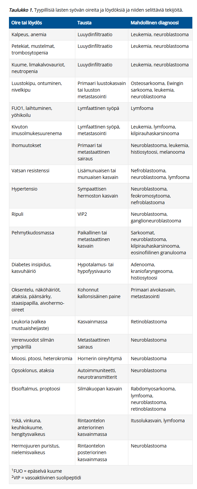

  

### 6kk lapsi, kuumetta, ei syö kunnolla, itkuinen sylissä, harmahtava, periferia viileä vaikka edelleen kuumetta, ei ole oma itsensä. Olet tk-lääkäri ja äiti tuo vauvan vastaanotolle, lähimpään sairaalaan 170km. Mikä työdg? Mitä tutkit, miten hoitaisit, missä järjestyksessä teet asiat? {#6kk-lapsi-pondella-ei-oma-itsensä}

  <button class="solution-button"
          data-label="Vastaus"
          data-hide-label="Piilota vastaus">
    Vastaus
  </button>
  

Harmaa iho, viileä periferia kuumeisella lapsella ja muuttunut tajunnan taso/ärtyneisyys viittaavat alkavaan tai käynnissä olevaan septiseen sokkiin (ja mahdollisesti samanaikaiseen meningiittiin tajunnantason aleneman takia). 170 km matka sairaalaan tarkoittaa, että toimenpiteet ja hoito on aloitettava välittömästi terveyskeskuksessa.

Edetään ABCDE-mallin mukaan, ensin hälytetään lisäapua paikalle ja ohjeistetaan yksi henkilö soittamaan välittömästi hätäkeskukseen siirtoa varten. 

A ja B - Varmistetaan ilmatien aukiolo ja voidaan antaa lisähappea/ventilaatiotukea

C: Arvioidaan pulssit, syke, verenpaine, SpO2, kapillaaritäyttöaika ja auskultoidaan sydän ja keuhkot; asetetaan siis saturaatiomittari, painemittari ja iv-yhteys (jos ei saada, niin i.o.). Aloitetaan välittömästi nestebolus, otetaan veriviljelyt (jos saadaan nopeasti) ja aloitetaan iv-antibiootti (esim. kefotaksiimi, koska meningiitti mahdollisesti ja normaalin imeväisten iv-ab-kombon (penisilliini+gentamysiini) gentamysiini ei läpäise veriaivoestettä hyvin). Anna deksametasoni 0.15 mg/kg i.v./I.O. ennen antibioottia tai sen yhteydessä. Likvornäytteitä ei oteta tk:ssa eikä varsinkaan nyt kun epäily kohonneesta aivopaineesta. 

D: Verensokeri ja neurologia (myös aukileen kireys (kohonnut ICP)/kuivumiseen viittaava uponneisuus); hypoglykemia voidaan korjata iv G10:llä.

E: Ihomuutokset, verenvuodot, otetaan myös mahdollisuuksien mukaan kyytiä odottaessa veriviljelyn lisäksi atrup+laktaatti, PVKT+diffi, CRP. 

---

Soitetaan selvittelyiden ja määräyksien välissä lähimpään päivystykseen ja saadaan ohjeet: esimerkiksi yhteys ennen veriviljelyiden ja antibiootin aloitusta nopeasti, jotta saadaan ohjeet niiden aloituksesta ja jatkamisesta siirron ajan. Päivystäjän ohjeiden mukaan myös voidaan mahdollisesti tilata muita selvittelyjä. 
 
  

### Monivalintoja (Oikein/Väärin) {#Monivalintoja-2025}

Seuraavaksi listattuna putkeen kaikki 2025 kerätyt monivalintakysymykset. Olleet Tosi/Epätosi-formaatissa. 

#### Syylät aiheuttaa virus {#Syylat}

  <button class="solution-button"
          data-label="Vastaus"
          data-hide-label="Piilota vastaus">
    Vastaus
  </button>
  

      Oikein

**Syylät (verruca vulgaris) ovat papilloomavirusten (HPV) aiheuttamia hyvänlaatuisia ihon ja limakalvojen muutoksia,** jotka ovat yleisiä kaikissa ikäluokissa. Ihon syyliin ei liity pahanlaatuisuuden vaaraa. 

Syylien diagnoosi on kliininen. Syylän pinta on usein karhea (verrukoottinen), ja siinä näkyy pistemäisiä verisuonia. Joskus syylää on vuoltava tai kyretoitava, jotta diagnostiset verisuonet tulevat näkyviin. Tärkein erotusdiagnoosi on känsä, jonka pinta on sileä ja jonka pohjalla nähdään usein kivulias känsänastura. Toisin kuin syylissä, känsien alueella ihojuosteet yleensä paksuuntuvat ja tulevat enemmän esille. Kämmenten ja jalkapohjien ihojuosteet (dermatoglyyfit) taas keskeytyvät syylän kohdalla. 

Terveellä ihmisellä syylät paranevat yleensä spontaanisti, yli 60 %:lla 2 v:n aikana. Hoitoa voidaan kuitenkin toteuttaa kaikkiin syylätyyppeihin (verruca vulgaris, plana jne.). Syylien hoito kuuluu perusterveydenhuoltoon. Immunosuppressoidulla potilaalla syylät saattavat olla runsaita ja hoitoresistenttejä, jolloin potilas tulisi tarvittaessa lähettää ihotautien alan erikoissairaanhoitoon.

<li>Hoidon kulmakivi on syylän säännöllinen mekaaninen ohentaminen (esim. hiekkapaperilla, hohkakivellä tai ihokyretillä), jonka potilas voi usein tehdä omatoimisesti (esim. 2–3 kertaa viikossa pesun jälkeen). Paksuuntunut päällimmäinen kudos poistetaan niin, että saadaan aikaan syylä-verikontakti immuunivasteen herättämiseksi. Ohennetuille syylille levitetään keratolyyttistä salisyylihappo-maitohappovalmistetta kerran päivässä iltaisin. Valmisteita on geeli-, voide-, liuos- ja laastarimuotoisina. Tärkeää on tauoton 1–3 kk:n pituinen hoito.</li>
<li>Okkluusiohoito (peittohoito) voi myös olla tehokas ja siinä käytetään ilmastointiteippiä, hydrokolloidilevyä (esim. Duoderm®) tai Compeed®-laastaria. Vaikutus perustuu syylän ärsytykseen, hautumiseen ja pehmenemiseen. Pieni pala esim. ilmastointiteippiä asetetaan suoraan syylän päälle 4–7 päivän ajaksi. Sitten teippi ja kuollut iho poistetaan ja iho puhdistetaan vedellä ja saippualla. Uusi teippi asetetaan 12 t:n kuluttua. Sykliä voi toistaa 4–6 viikkoa.</li>
<li>Yksi käytetty hoitomuoto on vielä syylien nestetyppijäädytys (kryohoito); syylät jäädytetään reunasta keskelle. Kylmähoitoa tarvitaan yleensä useita hoitokertoja, esim. 3–6 kertaa 1–2 viikon välein. </li>
<li>Ablatiivinen laserhoito (esim. hiilidioksidilaser) tai muut laserhoidot (esim. pulssivärilaser) voivat olla vaihtoehtoja sitkeiksi osoittautuneiden syylien hoidossa</li>

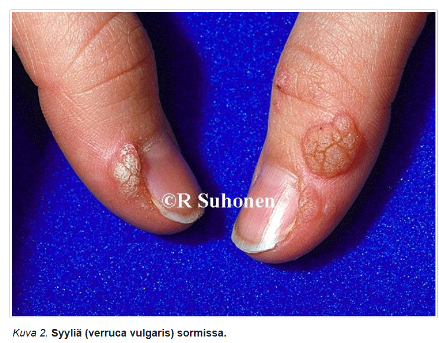

  

#### Molluskat aiheuttaa virus {#Molluskat}

  <button class="solution-button"
          data-label="Vastaus"
          data-hide-label="Piilota vastaus">
    Vastaus
  </button>
  

      Oikein

**Myös ontelosyylät eli molluskat ovat virusten aiheuttamia; aiheuttajana siis Molluscum contagiosum -virus, MCV.** Tartunta tapahtuu yleensä lapsuudessa ihokontaktin välityksellä. Aikuisilla tartunta voi liittyä lähikontakteihin, seksikontakteihin tai mm. kontaktiurheiluun. Lapsilla ontelosyylät ovat yleisiä erityisesti atooppista ekseemaa sairastavilla (eczema molluscatum).

Diagnoosi on yleensä kliininen ja lapsilla helppo. Tärkeää on tarkastella ihomuutoksia riittävän läheltä ja tunnistaa keskellä olevat painautumat ja keltavalkoiset hyperkeratoottiset tapit. Epäselvissä tapauksissa diagnoosin voi varmistaa kudosnäytteen histologisilla tutkimuksilla (esim. stanssibiopsia tai tangentiaalinen poisto, Ts-PAD-1). 

Usein on parasta jäädä seuraamaan spontaania parantumista (voi kestää kuukausia, tyypillisesti 6–12 kk). Pienellä osalla potilaista ontelosyylät pysyvät pidempään (jopa 3–5 vuotta). Atoopikolle ja kuivaihoiselle suositellaan perusvoiteen käyttöä; tarvittaessa ekseeman/sekundaarisen ekseeman asianmukainen hoito miedoilla tai keskivahvoilla glukokortikoidivoiteilla kuuriluonteisesti (esim. 2–3 viikon kuurit). Tapauskohtaisesti voidaan harkita hoitokokeiluja, esim. aikuisten genitaalialueen ontelosyylissä.

<li>Mekaaninen hoito voi auttaa, mutta saattaa olla kivuliasta. Ontelosyylien pinta rikotaan ihokyretillä (esim. 4 mm), molluska-atuloilla tai paksulla injektioneulalla (esim. 18 G–20 G). Toimenpiteessä pyritään poistamaan keskellä oleva hyperkeratoottinen tappi. Ennen toimenpidettä alue voidaan puuduttaa esim. lidokaiini-prilokaiinivoiteella (voide levitetään ainakin 1–2 tuntia ennen, peitetään okkluusiohoitona muovikelmulla tai taitoksella).</li>
<li>Myös nestetyppijäädytystä voidaan käyttää, mutta ei ole kivutonta.</li>
<li>Jotakin näyttöä 5–10-prosenttisen kaliumhydroksidiliuoksen (Nopoxivir®) tehosta; yli 2-v. lasten hoitoon. 1–2 kertaa päivässä, kunnes syylät ärsyyntyvät muutamassa viikossa.</li>

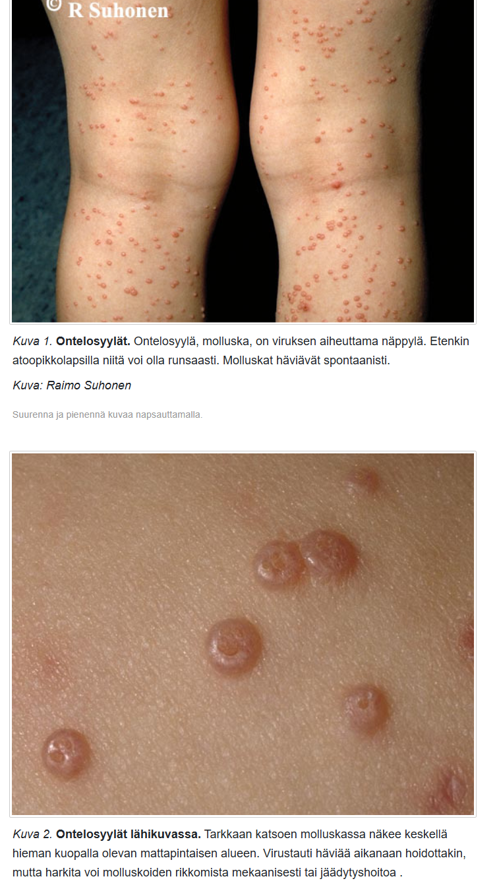

  

#### Usein ruokavaliohoito auttaa ummetukseen 

  <button class="solution-button"
          data-label="Vastaus"
          data-hide-label="Piilota vastaus">
    Vastaus
  </button>
  

      Oikein

Ummetuksen esiintyvyys lapsuusiällä on lähteestä riippuen n. 8-13 %. Ummetuksesta kärsivillä lapsilla on usein ruoan kuidun määrä normaalia vähäisempää, ja lähisuvussa esiintyy ummetusta. Ummetuksen syy on hyvin harvoin elimellinen sairaus (keliakia, hypotyreoosi, Hirschsprungin tauti, peräsuolen sisemmän sulkijalihaksen akalasia).

Ummetuspotilaalle ohjataan tavanomaisten suositusten mukaista liikuntaa, **kuitujen saantia** ja nesteiden nauttimista

<li>Runsaasti (yli 5–6 dl/vrk) lehmänmaitoa nauttivien lasten maidonsaantia on hyvä rajoittaa, sillä runsaalla lehmänmaidonsaannilla on yhteys ummetukseen.</li>
<li>Mallasuutetta voi sekoittaa äidinmaitoon tai korvikkeeseen, ja sitä käytetään tyypillisesti imeväisikäisen ummetuksen helpottamiseen (isommilla lapsilla muut kuidut kuten yllä mainittu)</li>
<li>Lisäksi on hyvä huolehtia säännöllisestä WC-rytmistä. Potalla istuminen on luonnostaan hyvä ulostamisasento, mutta WC-pöntöllä istuvan lapsen asentoon on tärkeä kiinnittää huomiota (voi laittaa korokkeen jalkojen alle)</li>

  

#### Äkillisen välikorvatulehduksen esiintymishuippu on vuoden iässä {#AOM-ika}

  <button class="solution-button"
          data-label="Vastaus"
          data-hide-label="Piilota vastaus">
    Vastaus
  </button>
  

      Oikein

Äkillisen välikorvatulehduksen ilmaantuvuus on suurimmillaan 6–24 kuukauden iässä. llmaantuvuuden huippu on 10–12 kuukauden iässä. 

Vuoden ikään mennessä noin 40 % lapsista, kahden vuoden ikään mennessä noin 70 % ja kolmen vuoden ikään mennessä lähes 85 % lapsista on sairastanut vähintään yhden välikorvatulehduksen.

Pieni osa lapsista on erityisen alttiita sairastamaan toistuvia välikorvatulehduksia. Noin 10 % lapsista on sairastanut 3 tai useampia välikorvatulehduksia jo ennen yhden vuoden ikää. 1/3 lapsista yli 3 AOM 3v ikään mennessä. 

  

#### Laktoosi-intoleranssi helpottuu aikuisena

  <button class="solution-button"
          data-label="Vastaus"
          data-hide-label="Piilota vastaus">
    Vastaus
  </button>
  

      Väärin

Tyypillinen eli primaarinen laktoosi-intoleranssi tarkoittaa perintötekijän säätelemänä tapahtuvaa suolen laktaasitason laskua iän myötä. Primaarisen laktoosi-intoleranssin oireet puhkeavat lapsilla yleensä kouluiässä, ja niiden alkaminen liittyy laktaasin tuotannon loppumiseen ohutsuolen epiteelisoluissa. Lähes kaikki potilaat sairastuvat aikuisikään mennessä. 

Laktaasin tuotanto ei aikuisiässä kohennu, joten primaarinen laktoosi-intoleranssi ei ole paraneva tila. Tosin jos aiheuttajana on ollut sekundaarinen hypolaktasia esimerkiksi gastroenteriitin tai keliakian takia, niin tämä tila voi parantua kokonaan, kun taustalla oleva sairaus paranee ja suoli toipuu. 

  

#### Sekundaarisen laktoosi-intoleranssin syy voi olla keliakia

  <button class="solution-button"
          data-label="Vastaus"
          data-hide-label="Piilota vastaus">
    Vastaus
  </button>
  

      Oikein

Laktoosi-intoleranssi tarkoittaa laktaasientsyymin puutteesta johtuvaa laktoosin sietämisen häiriötä. Entsyymipuutoksen kehittymisen vuoksi laktoosi ei enää pilkkoudu glukoosiksi ja galaktoosiksi, mistä seuraa taudin tyypilliset oireet. Entsyymipuute voi johtua primaarista (ns. aikuistyypin hypolaktasia) tai sekundaarisesta syystä. 

Primaarinen tarkoittaa perintötekijän säätelemänä tapahtuvaa suolen laktaasitason laskua iän myötä. Pysyvä tila. 

Sekundaarinen taas tarkoittaa mitä tahansa ohutsuolen nukkavaurioon johtavaa sairautta, joka voi aiheuttaa laktaasin puutteen. Näistä tyypillisimpiä ovat keliakia, gastroenteriitti ja IBD. Tämä tila voi parantua kokonaan, kun taustalla oleva sairaus paranee ja suoli toipuu. 

  

#### Keliakia voi olla oireeton

  <button class="solution-button"
          data-label="Vastaus"
          data-hide-label="Piilota vastaus">
    Vastaus
  </button>
  

      Oikein

Tänä päivänä vaikea imeytymishäiriö on keliakiassa harvinainen, ja kroonista ripulia, yleistä huonokuntoisuutta, laihtumista tai lasten kasvuhäiriötä esiintyy enää vain osalla keliakiapotilaista. Vaihtelevat vatsakivut, mahan turvotus, ilmavaivat ja ajoittainen ulosteen löysyys ovat sitä vastoin tavallisia. Nykyisen aiempaa lievemmän keliakian oirekuvan takana lienee ainakin osittain varhainen diagnostiikka: potilaat löydetään ennen kuin heille ehtii kehittyä vaikeita oireita.

On arveltu, että nykyisin alle puolet keliakiapotilaista kärsii diagnoosihetkellä erilaisista, usein lievistä, suolisto-oireista. Keliakiapotilaalla saattaa olla raudan tai foolihapon puute ilman anemiaa, ja osalla havaitaan ainoastaan verenkuvan muutos, mikro- tai makrosytoosi. Keliakiapotilas voi olla hyväkuntoinen ja jopa ylipainoinen tai hänellä voi ripulin sijasta olla ummetusta.

Keliakia on siis useinkin oireeton ja voi paljastua seulonnoista (suositellaan esim. keliakiapotilaan 1. asteen sukulaisille, kilpirauhasen autoimmuunisairautta sairastaville yms) tai kun on sattumalöydöksiä labroissa ja niitä selvitellään (esim. raudanpuute, ALAT:n nousu). 

Oireettomassakin keliakiassa diagnoosin asettaminen ja hoito (gluteeniton ruokavalio) on tärkeää, jotta voidaan antaa suolen parantua ja ehkäistä komplikaatioita.  

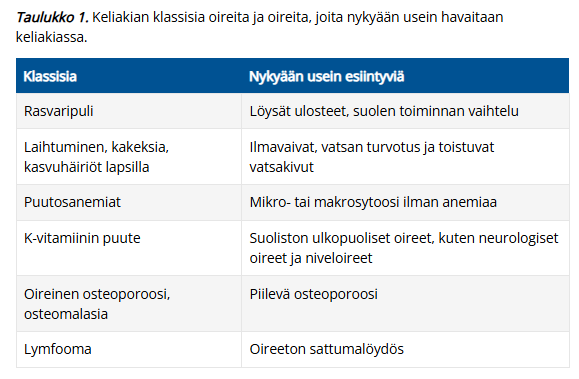
  

#### Kalpro on hyvä tähystyksen seulontatutkimus IBD ajatellen {#Kalpro-seula}

  <button class="solution-button"
          data-label="Vastaus"
          data-hide-label="Piilota vastaus">
    Vastaus
  </button>
  

      Oikein

F-Calpro on hyvä ja vakiintunut seulontatutkimus kolonoskopian tarpeen arviointiin. Se on selkeästi herkin suolistotulehduksen mittari (jos calpro on normaali, niin IBD on hyvin epätodennäköinen), mutta sen tarkkuus IBD:n suhteen ei ole kovin hyvä, sillä se saattaa nousta myös mm. akuutissa gastroenteriitissa, keliakiassa ja ruoka-allergiassa. Saattaa olla normaali proktiitissa. Lisäksi se on melko usein poikkeavan korkea ensimmäisten elinvuosien aikana ilman, että lapsella on mitään osoitusta suolistotulehduksesta. Tämän takia ulosteen kalprotektiinia ei pidä yleensä tutkia alle kaksi viikkoa kestäneen ripulin yhteydessä eikä taaperoikäiseltä tai sitä nuoremmalta lapselta. 

IBD:n diagnostiikassa kannattaa myös muistaa, että muut syyt oireisiin ja löydöksiin tarvittaessa poissuljettava: Keliakia, laktoosi-intoleranssi, ulosteen mikrobiologiset tutkimukset (bakteeri-, virus-, ja parasiitti-nho, clostridium toksiinit; huom Clostridium usein posit. alle 2-vuotiailla (älä ota)). 

Lopulta diagnoosi perustuu maha-suolikanavan tähystystutkimuksiin (gastro- ja ileokolonoskopia), jotka tehdään lapsille yleisanestesiassa. Lopullisen päätöksen lapsen tähystystarpeesta tekee tulehduksellisiin suolistosairauksiin perehtynyt lastenlääkäri. Ulosteen mikrobiologiset näytteet kannattaa tutkia ennen tähystyksiä, koska joskus potilaalla saatetaan todeta esimerkiksi ulosteen Clostridioides difficile, vaikka hän ei olisi juuri edeltävästi antibioottia saanutkaan. Tähystystutkimusten jälkeen ohutsuolta voidaan hoitavan lääkärin harkinnan mukaan tutkia lisää magneettitutkimuksella ja kapseliendoskopialla.

  

#### MPR-rokote sisältää eläviä heikennettyjä mikrobeja {#MPR-elava}

  <button class="solution-button"
          data-label="Vastaus"
          data-hide-label="Piilota vastaus">
    Vastaus
  </button>
  

      Oikein

MPR-rokote (tuhkarokko-, sikotauti- ja vihurirokkorokote) on elävä heikennetty rokote (live attenuated vaccine) eli rokote sisältää eläviä tuhkarokko-, sikotauti- ja vihurirokkoviruksia, joiden kykyä aiheuttaa tautia on heikennetty merkittävästi. Virukset pystyvät lisääntymään elimistössä vain hyvin rajoitetusti, jolloin ne käynnistävät tehokkaan ja pitkäkestoisen immuunivasteen ilman sairastumista.

Rokotetyyppejä on monia ja niistä tärkein onkin juuri muistaa elävien heikennettyjen rokotteiden erikoispiirteet. Niitä ei siis anneta raskaana oleville eikä henkilöille, joilla on vaikea immunologinen puutostila (esim. käynnissä oleva sytostaattihoito tai vaikea immuunipuutos), koska on riski sille, että heikossa immuunitilassa heikennettykin mikrobi pystyy aiheuttamaan taudin. 

<li>Muita eläviä heikennettyjä rokotteita ovat mm. vesirokko ja rotavirus</li>
<li>Muita rokotetyyppejä ovat mm. inaktivoidut mikrobit (esim. inaktivoitu poliorokote eli IPV), komponenttirokotteet (esim. PCV, asellulaarinen pertussis, HPV, HBV, vyöruusu (Shingrix)), toksoidirokotteet (esim. kurkkumätä ja tetanus) ja uudemmat teknologiat (esim. mRNA (esim. tietyt COVID-19-rokotteet) ja virusvektorirokotteet). </li>

  

#### Pneumokokkirokote sisältää eläviä heikennettyjä mikrobeja {#Pneumokokki-elava}

  <button class="solution-button"
          data-label="Vastaus"
          data-hide-label="Piilota vastaus">
    Vastaus
  </button>
  

      Väärin

Kansallisessa rokotusohjelmassa käytetään pneumokokkikonjugaattirokotetta, joka on **komponenttirokote.** Käytössä olevat pneumokokkirokotteet (kuten konjugaattirokotteet PCV ja vanhemman tyyppinen polysakkaridirokote PPSV23) sisältävät ainoastaan pneumokokkibakteerin (Streptococcus pneumoniae) pintakapselista eristettyjä sokerirakenteita eli polysakkarideja. Kansallisessa rokotusohjelmassa käytetään Prevenar 13 eli PCV13-rokotetta, ja alle 5 -vuotiaalle rokotussarjaan kuuluu kolme annosta: rokotetaan 3, 5 ja 12 kuukauden ikäisinä. 

  

#### Rotavirusrokotetta saa antaa ainoastaan imeväiselle {#Rotavirus-imevainen}

  <button class="solution-button"
          data-label="Vastaus"
          data-hide-label="Piilota vastaus">
    Vastaus
  </button>
  

      Totta

Rotavirusrokote on poikkeuksellinen rokote, sillä sen **antamiselle on asetettu tiukat ikärajat,** ja sitä annetaan ainoastaan varhaisimeväisille. Suomessa käytössä oleva suun kautta annettava rotavirusrokote annetaan neuvolassa 2, 3 ja 5 kuukauden iässä. _Ensimmäinen annos on annettava viimeistään 12 viikon iässä ja kolmas annos tulee antaa ennen kuin lapsi on täyttänyt 32 viikkoa._ Annosten minimivälin tulee olla neljä viikkoa. Perusrokotussarjan jälkeen ei anneta tehosteita. 

Rokotteita ei anneta vanhemmille potilaille, koska heillä rokotteen **riski aiheuttaa harvinaista suolentuppeumaa (invaginaatiota, intussusseptiota) kasvaa.** Rokote siis voi aiheuttaa lymfoidihyperplasiaa suolistossa (Peyerin laikuissa) ja nämä voivat toimia tarttumiskohtina (lead point) suolentuppeumalle. 

Toinen syy miksi rokotteita ei kannata antaa vanhemmille potilaille on se, että vaikea rotavirusripuli ja kuivuminen on todennäköisintä juuri pienillä imeväisillä ja vanhemmilla lapsilla/varsinkin aikuisilla tauti ei ole yleensä yhtä vakava. 

  

#### Vesirokkorokote sisältää elävää heikennettyä virusta {#Vesirokkorokote-elava}

  <button class="solution-button"
          data-label="Vastaus"
          data-hide-label="Piilota vastaus">
    Vastaus
  </button>
  

      Totta

Rokote sisältää elävää, heikennettyä varicella-zoster-virusta (Oka-kantaa)

Vesirokkorokote tuli Suomen kansalliseen rokotusohjelmaan syyskuussa 2017. Perusrokotussarjaan kuuluu kaksi annosta, annetaan neuvolassa 1,5-vuotiaille ja 6-vuotiaille (tällöin osana MPRV-yhdistelmärokotetta). 

Suurin osa väestöstä ei ole siis saanut rokotetta, vaan sairastanut taudin lapsuudessa. Korkeintaan 1-3 prosenttia aikuisväestöstä ei ole sairastanut vesirokkoa, joten rokotustarve on hyvin vähäinen. Jos henkilö ei ole sairastanut vesirokkoa tai saanut kahta rokoteannosta (vähintään 3 kuukauden välein), täydennä rokotussuoja. Lähes kaikki 50 vuotta täyttäneet ja sitä vanhemmat ovat sairastaneet vesirokon, eivätkä tarvitse rokotetta. Jos lapsi on sairastanut vesirokon hyvin lievänä alle vuoden ikäisenä, hän saattaa saada vesirokon uudelleen. Siksi myös näille lapsille suositellaan kahta vesirokkorokotusta. Jos vesirokon on sairastanut yli yksivuotiaana lievänä, ei rokotuksia tarvita. Vanhempien antama tieto siitä, onko lapsi sairastanut vesirokon, on yleensä luotettava. Vesirokon sairastaneen rokottamisesta ei ole haittaa, mutta immuunipuutteisen rokottamisesta päättää lääkäri.

Koska kyseessä on elävä rokote, sitä ei tule antaa raskaana oleville eikä henkilöille, joilla on vaikea immunologinen puutostila (esim. solunsalpaajahoito tai vaikea immuunipuutos).
  

#### Laktuloosin teho ummetukseen on parempi kuin makrogolin

  <button class="solution-button"
          data-label="Vastaus"
          data-hide-label="Piilota vastaus">
    Vastaus
  </button>
  

      Väärin

Makrogoli (esim. Pegorion) on yleensä tehokkaampi. Makrogoli pehmentää ulostetta tehokkaammin ja säännöllistää suolen toimintaa nopeammin kuin laktuloosi. 

Laktuloosi voi myös aiheuttaa enemmän suoliston kaasunmuodostusta, turvotusta ja vatsankouristuksia, koska paksusuolen bakteeristo fermentoi sitä voimakkaasti. Makrogoli ei käymisreaktiota aiheuta, joten se on paremmin siedetty. Tämän takia makrogoli on yleensä ummetuksen ensilinjainen lääkehoito >6kk ikäisten ummetuksen hoidossa. 
  

#### Makrogoli on hyvä koprostaasin hoito {#Makrogoli-koprostaasi}

  <button class="solution-button"
          data-label="Vastaus"
          data-hide-label="Piilota vastaus">
    Vastaus
  </button>
  

      Oikein

Jos lapsella on vaikea ummetus ja kova ummetusmassa peräsuolessa estää ulostamisen (koprostaasi), niin tämä voidaan hoitaa suuriannoksisella suun kautta otettavalla makrogolilla (annos 1.5 g/kg/vrk 4-7 vrk) tai nopeammin auttavalla peräruiskehoidolla (esim. makrogolivalmisteet Smartlax tai Microlax tai dokusaattinatrium eli Klyx). P.o. makrogoli on usein mukavampi kokeilla kuin peräruiskeet, mutta jos aivan peräsuolen suulla tuntuu olevan kova ulostetulppa ja ulostaminen on kipujen vuoksi estynyt, niin voi hoitaa myös peräruiskehoidolla hoidon aluksi. 

  

#### Hinkuyskä on viruksen aiheuttama {#Hinkuyska-virus}

  <button class="solution-button"
          data-label="Vastaus"
          data-hide-label="Piilota vastaus">
    Vastaus
  </button>
  

      Väärin

Hinkuyskän aiheuttaja on **Bordetella pertussis, joka on gram-negatiivinen coccobacillus (eli siis bakteeri).**

Hinkuyskää vastaan rokotetaan kansallisessa rokotusohjelmassa asellulaarisella pertussis -rokotteella (aP-osa DTaP-rokotetta). Sitä annetaan 3, 5 ja 12 kk:n ikäisille lapsille ja tehosteet 4 v:n ja 14–15 v:n iässä. Aikuisille tehoste annetaan 25 v:n iässä, asevelvollisille ja raskaana oleville. Rokote ei anna elinikäistä eikä täydellistä suojaa.

---

**Oirekuva:**

Hinkuyskä on **puuskainen voimakas yskä,** joka on pienille imeväisille hengenvaarallinen. Kliininen diagnoosi perustuu anamneesiin, etenkin puuskittaisen yskän esiintymiseen. Pienillä, rokottamattomilla lapsilla ilmenee katarraalivaiheessa (1–2 viikkoa) lievää yskää ja nuhaa, joskus myös lievää lämpöilyä. Yskävaiheessa alkaa tulla yskänkohtauksia, joihin voi pienillä lapsilla liittyä inspiratorista stridoria eli hinkumista. Rokotetuilla koululaisilla ja aikuisilla on pääsääntöisesti atyyppinen taudinkuva, johon ei liity hinkumista. Yskänpuuskat esiintyvät etenkin öisin ja päättyvät usein limaoksenteluun. Kohtaukset jatkuvat tiheinä 1–4 viikon ajan, minkä jälkeen ne harvenevat. Ne saattavat uusiutua uuden hengitysteiden virusinfektion aikana. Yskävaiheessa potilas on kuumeeton. CRP ja lasko ovat tavallisesti normaalit. Hinkuyskä voi aiheuttaa pienille, rokottamattomille lapsille voimakasta lymfosytoosia, joka on vakavan taudin merkki. Lymfosytoosi johtuu voimakkaasta pertussistoksiinin vaikutuksesta, joka voi johtaa pulmonaalihypertensioon.

Kouluikäinen hinkuyskäpotilas tuodaan yleensä vastaanotolle viikkoja tai kuukausia kestäneen yskän takia. Yskä kuvataan usein poikkeuksellisen voimakkaaksi ja lähes aina puuskittaiseksi. Usein potilaat kuvaavat tautia yskäksi, jonka kaltaista heillä ei ole koskaan ennen ollut. Yli kuukauden kestoinen yskä on usein hinkuyskää ja vaatii aina tarkempia tutkimuksia.

---

Diagnostiikka: 

Imeväisillä - ja varsinkin rokottamattomilla lapsilla - hinkuyskä etenee nopeasti, ja oireita, kuten hengityspysähdyksiä, osataan jo ensimmäisenä tartunnan jälkeisenä viikkona epäillä hinkuyskän aiheuttamiksi. Tällöin taudin toteamiseen käytetään geenimonistustestiä **BopeNhO.** PCR-testin ottoon käytetään Copan-nukkatikkua tai dacron-vanutikkua. Isommilla lapsilla ja aikuisilla pääoire on pitkittynyt yskä, ja usein hinkuyskää ei ensimmäisinä viikkoina osata epäillä. Potilaan tilaa jäädään ainoastaan seuraamaan. Kun oireet pitkittyvät ja oireet ovat kestäneet 3–4 viikkoa, suorat osoitusmenetelmät eivät ole enää kovin herkkiä. Tässä vaiheessa seerumin vasta-ainetasot alkavat nousta, ja diagnostiikassa käytetään ensisijaisesti serologiaa **S-BopeAb.** Serologiaa ei pidä käyttää rokotetuilla alle 2-vuotiailla eikä vuoden sisällä rokotuksen jälkeen. Negatiivinen serologia ei sulje pois hinkuyskädiagnoosia, koska testin herkkyys on usein vain 50–60 %. 

Suomessa hinkuyskää esiintyy jatkuvasti, mutta varsin vähän. Vuonna 2017 laboratoriotestein diagnosoituja tapauksia oli 399, ja viimeisen epidemian aikana vuonna 2004 todettiin 1 631 tapausta. Sairaalahoitoa vaatii vuosittain keskimäärin parikymmentä imeväistä. Vaarallista hinkuyskää esiintyy etenkin alle 3 kk:n ikäisillä ja rokottamattomilla tai osittain rokotetuilla imeväisillä. Koska rokotteen antama suoja on lyhytaikainen, hinkuyskää esiintyy puuskaisena yskänä myös koululaisilla ja aikuisilla.

---

Pienet, erityisesti rokottamattomat imeväiset tulee aina toimittaa sairaalahoitoon. Mikrobilääkkeenä käytetään imeväisillä _atsitromysiiniä_ 10 mg/kg/vrk 5 vrk:n ajan, yli 6 kk:n ikäisillä aloitusannos 10 mg/kg/vrk (max 500 mg) ja sitten 4 päivän ajan 5 mg/kg/vrk (max 250 mg). Isommille lapsille ja aikuisille ensimmäisenä päivänä 500 mg ja sitten 4 päivän ajan 250 mg/vrk. Vaihtoehtoisesti voidaan käyttää roksitromysiiniä tai klaritromysiiniä. Amoksisilliinista tai kefalosporiineista ei ole hyötyä. Hoidon päätavoitteena on tartuttavuuden ja leviämisen vähentäminen. Jotta hoito auttaa oireisiin, se tulee aloittaa hinkuyskäepäilyn herättyä mahdollisimman pian. Käytännössä hoito aloitetaan heti PCR-näytteen ottamisen jälkeen, jos oireet ja epidemiologinen tilanne viittaavat hinkuyskään. Yli kuukauden oireilleita ei kannata hoitaa. Toistuvista mikrobilääkekuureista ei ole hyötyä.

Jos hinkuyskäpotilaan perheessä on alle 6 kk:n ikäisiä lapsia tai yli 36. raskausviikolla oleva, koko perheelle annetaan mikrobilääkeprofylaksi riippumatta oirekuvasta tai rokotusstatuksesta.

Eristysaika on 5 vrk mikrobilääkehoidon alusta. Jos oireita on ollut yli 3 viikon ajan, ei eristystä tarvita.

  

#### Pneumokokkirokote on vähentänyt epiglottiittien määrää {#Pneumokokkirokote-epiglottiitti}

  <button class="solution-button"
          data-label="Vastaus"
          data-hide-label="Piilota vastaus">
    Vastaus
  </button>
  

      Väärin

Epiglottiitin eli kurkunkannen tulehduksen määrää on vähentänyt romahdusmaisesti Hib-rokote (Haemophilus influenzae tyyppi b -rokote), ei pneumokokkirokote. Hib-rokotusten myötä lasten epiglottiitti on muuttunut aiemmin yleisestä, hengenvaarallisesta hätätilanteesta äärimmäisen harvinaiseksi sairaudeksi.

Pneumokokkirokote (Streptococcus pneumoniae -rokote) suojaa pikkulapsia ja riskiryhmiä ennen kaikkea aivokalvontulehdukselta, sepsikseltä, keuhkokuumeelta ja välikorvantulehduksilta eikä pneumokokki yleensä aiheuta kurkunkannen tulehdusta. 

  

#### Pediatrisessa GCS:ssa arvioidaan vastetta silmien avaamiselle

  <button class="solution-button"
          data-label="Vastaus"
          data-hide-label="Piilota vastaus">
    Vastaus
  </button>
  

      Oikein

Glasgow’n koomaskaala (GCS) koostuu kolmesta osa-alueesta riippumatta siitä, arvioidaanko aikuista vai lasta: silmien avautuminen, puhevaste, liikevaste (SiPuLi). Arviointi kuitenkin hieman eroaa pienten lasten ja aikuisten välillä, koska pienet lapset eivät osaa samalla tavalla esimerkiksi liikkua tai osoittaa kivun sijaintia. 

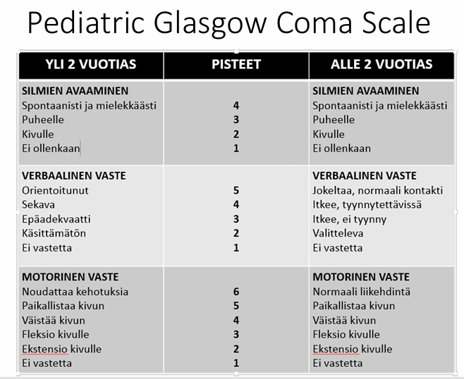
  

#### Pediatrisessa GCS:ssa arvioidaan vastetta kouristukselle

  <button class="solution-button"
          data-label="Vastaus"
          data-hide-label="Piilota vastaus">
    Vastaus
  </button>
  

      Väärin

GCS ei arvioi kouristusvastetta (mitä tämä edes tarkoittaisi). Kivulle voi kyllä olla vasteena fleksio tai ekstensio, mutta tämä ei kuvasta vastetta kouristukselle, vaan vastetta kivulle. 

  

#### Suomessa syntyvyys on 30 000/v

  <button class="solution-button"
          data-label="Vastaus"
          data-hide-label="Piilota vastaus">
    Vastaus
  </button>
  

      Väärin

Elävänä syntyneiden lasten määrä on vaihdellut 42 000 ja 60 000 välillä Suomessa 2000-luvulla. Vuonna 2025 Suomessa syntyi elävänä 45 832 lasta. 

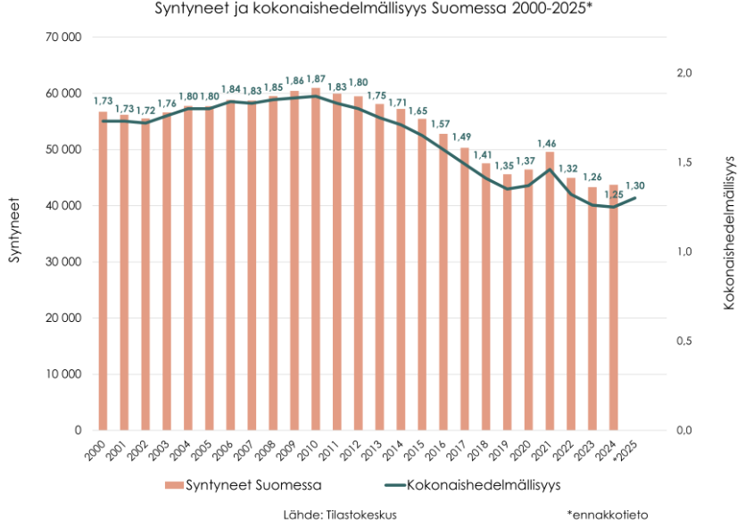
  

#### Suomessa tyypin 1 diabetes ilmaantuvuus on maailman alhaisimpia

  <button class="solution-button"
          data-label="Vastaus"
          data-hide-label="Piilota vastaus">
    Vastaus
  </button>
  

      Väärin

Suomessa on maailman korkein ilmaantuvuus, uusia tyypin 1 diabetesta sairastavia lapsia ja nuoria todetaan noin 500/vuosi. 

  

#### Vauvan pitäisi olla syntymäpainossaan 14 vrk kuluttua {#Vauva-syntymapainossaan}

  <button class="solution-button"
          data-label="Vastaus"
          data-hide-label="Piilota vastaus">
    Vastaus
  </button>
  

      Oikein

Syntymän jälkeen lapsen elimistön eri nestetilojen suhteelliset osuudet muuttuvat ja solunulkoinen nestemäärä vähenee. Yhdessä ensi elinpäivien fysiologisesti niukan maidonsaannin kanssa se johtaa lapsen painon laskuun syntymän jälkeen. Terveen täysiaikaisen lapsen paino laskee keskimäärin seitsemän prosenttia syntymäpainosta; yli 10 prosentin painonlasku on selvästi poikkeavaa.

Hyvin syövän lapsen paino kääntyy nousuun noin neljän päivän iässä ja saavuttaa syntymäpainon useimmiten 10-14 vuorokauden ikään mennessä. **Jos lapsen paino on alle syntymäpainon kahden viikon iässä, on se selvästi poikkeavaa ja johtuu useimmiten liian niukasta maidon saannista.**

  

#### Diastolinen sivuääni on yleensä viaton {#Diastolinen-sivuaani-viaton}

  <button class="solution-button"
          data-label="Vastaus"
          data-hide-label="Piilota vastaus">
    Vastaus
  </button>
  

      Väärin

**Diastolinen sivuääni on aina aihe lähetteelle lastenkardiologille.** Jos puhutaan viattomasta sivuäänestä, niin se on soinnillinen, alku- tai keskisystolinen, voimakkuudeltaan 1–2/6 ja se voi kuulua rintakehän etupuolelta (ei selästä) miltä kuuntelualueelta tahansa. Valtaosassa tapauksista nämä sivuäänet ovat fysiologisia virtausääniä ja siten luonteeltaan vaarattomia. 

Ainoa hyvälaatuinen diastolinen/jatkuva sivuääni on laskimohumina, joka kuullaan useimmiten lapsilta (varsinkin n. 2-8v) kaulan tyvessä solisluiden yläpuolella (soliskuopassa) selvimmin oikealla puolella. Nopea veren alasvirtaus IJV:ssä kaulan alaosassa aiheuttaa äänen -> Ääni häviää kaulalaskimoita painamalla, päätä kääntämällä tai asettamalla lapsi makuulle. Myös se, että potilas jännittää kaulaansa, painaa kaulalaskimoita -> ääni katoaa tai hiljenee. Myös pelkästään diastolinen komponentti voi kadota (esim. audiossa potilas on makuulla -> diastolinen komponentti häviää ja kuullaan vain grad 1/6 alkusystolinen suhaus). 

Ei kuitenkaan tarvitse alkaa pohtimaan onko sivuääni laskimohuminaa, vaan voi tehdä asiaa tarkemmin miettimättä lähetteen. 

  

#### VSD on yleisin synnynnäinen sydänvika {#VSD-yleisin}

  <button class="solution-button"
          data-label="Vastaus"
          data-hide-label="Piilota vastaus">
    Vastaus
  </button>
  

      Oikein

VSD on yleisin oikovirtaussydänvika ja siten myös synnynnäinen sydänvika (n. 20-30% tapauksista). Toiseksi yleisin synnynnäinen oikovirtaussydänvika on ASD (10 %), sitten PDA (8 %) ja sitten AVSD (3,5 %). 

---

Kammioväliseinän aukot ovat oikovirtausyhteyksiä kammioväliseinämässä. VSD:n patofysiologian määrittää sen koko, sijainti, sydämen kammioiden paineolosuhteet ja keuhkovastus. Kliinisiä merkkejä ei välttämättä nähdä vastasyntyneellä, koska kammiot ovat tasapaineiset eikä merkittävää oikovirtausta tai sivuääntä tällöin ole. 

Kun kammioiden välinen paine-ero kasvaa, muuttuvat viat kliinisesti merkittäväksi. Jos keuhkovastus on pieni ja potilaalla ei ole oikean ulosvirtauskanavan ahtaumaa, on oikovirtauksen suunta vasemmalta oikealle. Erittäin laajoissa oikovirtausyhteyksissä aukko on paineet tasaava, jolloin suurta paine-eroa kammioiden välille ei synny lainkaan, joskin yleensä keuhkokierto on imeväisaikana runsas ja nämä lapset muuttuvat oireisiksi. 

Vasemmalta oikealle suuntautuva oikovirtaus johtaa liialliseen keuhkokiertoon ja sydämen vasemman puolen laajenemiseen. Runsas keuhkoverenkierto voi johtaa vuosien kuluessa keuhkoverisuoniston vaurioitumiseen ja keuhkoverenpainetautiin sekä lopulta oikovirtauksen kääntymiseen oikealta vasemmalle ja desaturaatioon (Eisenmengerin oireyhtymään). Yleensä tällöin kyseessä on kookas nonrestriktiivinen oikovirtausaukko. Osa vioista saattaa pienentyä, mikä johtaa verenkierron kuormituksen muutokseen; muskulaariset viat pienenevät tai sulkeutuvat usein ajan kuluessa itsestään

---

VSD:n sulkuaihe on vajaatoimintaoireet ja vasemman kammion kuormitus. Ajoitus riippuu useista tekijöistä. Mikäli VSD on niin suuri, että keuhkovaltimopaine jää pysyvästi korkeaksi, on tämä varhaisen kirurgisen sulun aihe. Hoito on varhaislapsuudessa aina kirurginen. Pienet kuormittamattomat kammioväliseinän aukot eivät yleensä vaadi hoitoa, ja varsinkin muskulaarisista vioista suurin osa sulkeutuu itsestään. Kohtalaiset ja suuret viat taas aiheuttavat oireita usein jo melko varhain. 

Mikäli vika on muskulaarinen tai kohtalainen perimembranoottinen, kannattaa potilaan vajaatoimintaa hoitaa lääkityksellä ja ravitsemuslisillä, koska spontaania aukkojen pienentymistä ja jopa sulkeutumista voidaan havaita. Mikäli oireet saadaan hallintaan, voidaan tällaista VSD:tä seurata ainakin vuoden ikään asti. Mikäli keuhkovaltimopaine jää korkeaksi alkuvaiheessa, pyritään VSD sulkemaan kirurgisesti jo ennen puolen vuoden ikää. Suurin osa sisäänvirtaus- ja ulosvirtausalueen VSD:istä vaatii kirurgisen hoidon, koska nämä harvoin sulkeutuvat itsestään. Suurten vikojen kirurginen hoito tapahtuu yleensä ensimmäisen ikävuoden aikana ja keskisuurten ennen toista ikävuotta. Mikäli VSD rajoittuu aorttaläppään ja todetaan aorttaläpän vuoto, on tämä sulun aihe muista löydöksistä riippumatta. Keskisuuret lihaksiset viat, joissa oireet pysyvät hallinnassa, voidaan lapsen kasvaessa sulkea myös katetroinnissa sulkulaitteella yli 10 kg painavilta lapsilta. Mikäli potilaalle ei ole päässyt kehittymään keuhkovaltimon verenpainetautia eikä potilaalla ole merkittäviä liitännäisvikoja, on pitkäaikaisennuste erinomainen eikä eroa verrokkiväestöstä.

  

#### Ärtyneisyys on vastasyntyneen hypoglykemian oire {#Artynaisyys-hypoglykemia}

  <button class="solution-button"
          data-label="Vastaus"
          data-hide-label="Piilota vastaus">
    Vastaus
  </button>
  

      Oikein

**Hypoglykemian oireet ovat varsin epämääräisiä.** Voidaan jakaa neuroglukopeenisiin (esim. syömisvaikeudet, velttous, apaattisuus, kouristukset, tajuttomuus) ja stressihormoniperäisiin sivuvaikutuksiin (vapina, hengitysvaikeudet/-taukoilut, ärtyvyys, syanoosi, kalpeus).

---

Vastasyntyneen glukoosiaineenvaihdunnan häiriöt ovat syntymän jälkeen yleisiä. Pian syntymän jälkeen plasman glukoosi normaalistikin laskee (napanuoran katkaisemisen jälkeen verensokeri laskee useiksi tunneiksi) käynnistäen vastasyntyneen glukoositasapainoa ylläpitävät varastoenergian käytön sekä tarpeen imeä rintaa. 

<li>Verensokerin lasku siis johtaa katekoliiniamiinien ja glukagonin nousun ja insuliinin laskun myötä maksan glykogeenin vapautumiseen, glukoneogeneesin stimulaatioon ja rasvametaboliaan sekä syömisen tarpeeseen. Jopa 30-70% glukoosin tuotannosta syntymän jälkeen on glukoneogeenesiä.</li>
<li>Plasman glukoositaso on ensimmäisinä elinpäivinä fysiologisesti matalampi kuin myöhemmin elämässä, ja vakiintuu vasta 48–72 tunnin jälkeen samalle tasolle kuin lapsuusiässä myöhemmin. </li>

---

Vastasyntyneen hypoglykemian raja-arvot tunnetaan huonosti, mutta **yleisimmin plasman glukoositason laskua alle tason 2,6–2,8 mmol/l alle 48 tunnin iässä pidetään merkittävänä hypoglykemiana (TYKS < 2,6 mmol/l, Lastentaudit-kirja <2.8 alle 48h). Kahden vuorokauden iän jälkeen plasman glukoosin tulee olla yli tason 3,3 mmol/l.** Tilastollinen määritelmä olisi -2 SD.

Syvä, pitkittynyt hypoglykemia voi vaurioittaa aivoja pysyvästi. Myös vähäoireisiin vastasyntyneen hypoglykemioihin on liitetty lieviä neurokognitiivisia ongelmia myöhemmin lapsuusiässä.

---

Vastasyntyneen ohimenevän, varhaisen (alle 48 tunnin iässä ilmaantuvan) hypoglykemian riskiä kasvattavat monet sekä raskauteen ja äitiin että vastasyntyneeseen liittyvät tekijät

<li>Yleisimpiä riskitekijöitä ovat mm. SGA, ennenaikaisuus (ja yliaikaisuuskin), äidin diabetes, lisääntynyt kulutus (infektio, hypotermia, asfyksia, sydänvika), endokrinologiset syyt (hypokortisolismi, hypopituitarismi) ja metaboliset syyt (glukolyysin tai glukoneogeneesin häiriöt)</li>
<li>Riskiryhmiin kuuluvien vastasyntyneiden plasman glukoositasoa seurataan syntymän jälkeen toistuvin mittauksin, kunnes riski on väistynyt. Yli 80 % matalista verensokeriarvoista ilmaantuu ensimmäisen elinvuorokauden aikana, mutta vielä toisenkin elinvuorokauden aikana riski on merkittävästi suurentunut. Seurantaa ei tule tästä syystä päättää liian varhain.</li>

---

Hypoglykemiaa ehkäistään varhain aloitetulla tiheällä maitoruokinnalla mieluiten oman äidin rintamaitoa käyttäen.

<li>Jos riskiryhmään kuuluvalla oireettomalla vastasyntyneellä havaitaan seurannassa hypoglykemia, **ensisijaisena hoitona käytetään suun limakalvolle hierottavaa 40-prosenttista glukoosigeeliä yhdistettynä maitoateriaan.** Suositeltavinta on käyttää rintamaitoa. On tärkeää seurata, että glukoositaso normaalistuu hoidon myötä. </li>
<li>Mikäli glukoosigeeli ei korjaa tilannetta, lapsella on oireita tai plasman glukoositaso on hyvin matala, aloitetaan suonensisäinen glukoosi-infuusio ja jatketaan maitoruokintaa. Tarvittaessa glukagoniakin voidaan käyttää.</li>

---

Mikäli vastasyntyneen hypoglykemia on vaikea tai pitkittyvä, on syytä selvittää, onko taustalla jokin muu syy kuin aineenvaihdunnan ohimenevä adaptaatiohäiriö. Yleisin syy pitkittyvälle hypoglykemialle on insuliinin liikaeritys, joka sekin yleisimmin väistyy ensimmäisten viikkojen aikana. Harvinaisia perinnöllisiä hyperinsulinismisairauksia voidaan joutua hoitamaan myös kirurgisesti.

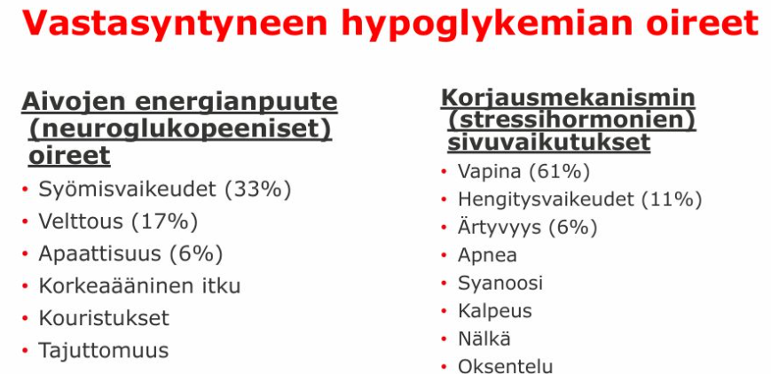
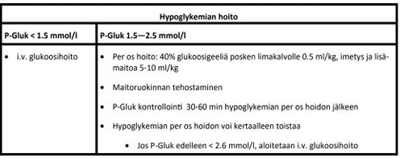
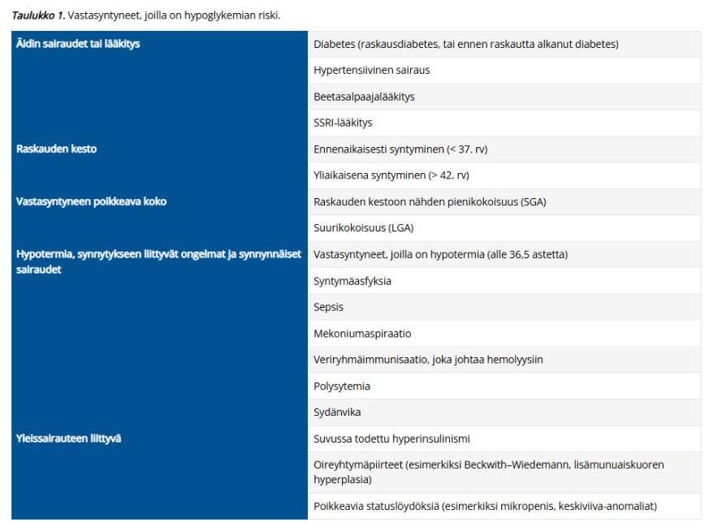
  

#### Kihomatojen hoitoon ei ole tehokasta lääkehoitoa {#Kihomadot-laakehoito}

  <button class="solution-button"
          data-label="Vastaus"
          data-hide-label="Piilota vastaus">
    Vastaus
  </button>
  

      Väärin

**Kihomatojen hoitoon on lääkehoito. Ensisijaisesti pyrviini 7.5–10 mg/kg kerta-annoksena tai mebendatsoli (Vermox®) 100 mg kerta-annoksena (yli 12 kk:n ikäisille).** Mebendatsoli on erityislupavalmiste. Myös albendatsoli (400 mg kerta-annos) on tehokas kihomadon hoidossa. Albendatsoli on erityislupavalmiste. 

_Hoito uusitaan aina 2 viikon kuluttua, koska lääke tehoaa vain eläviin matoihin, ei muniin, minkä vuoksi hoito toistetaan tartuntakierteen katkaisemiseksi_

Vuodevaatteet yleensä imuroidaan tai tuuletetaan ja lakanat ja pyyhkeet vaihdetaan lääkkeen ottamista seuraavana päivänä. Muista siivoustoimista ei liene hyötyä. Koska toistuvatkaan kihomatoinfektiot eivät liity liian vähäiseen siivoamiseen eikä infektio ole vaarallinen, on kihomato-ongelmaan toisinaan liittyvää ylenmääräistä siivoamista syytä välttää.

Hoito on syytä antaa samanaikaisesti koko perheelle, myös oireettomille madon mahdollisille kantajille. Jos päiväkotiryhmässä todetaan kihomatoja vähintään kolmasosalla lapsista, kannattaa koko ryhmä hoitaa. Päiväkodista ei tarvitse olla pois kihomatojen vuoksi.

Kihomatoinfektio uusii herkästi, lähinnä päiväkoti-ikäisten lasten suuren kihomatoprevalenssin vuoksi. **Selkeää lääkeaineresistenssiä ei ole toistaiseksi löydetty.** Kihomatojen häätäminen ei aina onnistu ensimmäisillä kahden viikon välein toteutetuilla hoitokuureilla. Tavallisia syitä ovat uusintainfektiot ja se, että lääke imeytymättömänä vaikuttaa vain suolen sisällä ja voinee siten mahdollistaa joidenkin matojen selviämisen esim. umpilisäkkeessä. Ennen toistuviin hoitoihin turvautumista olisi keskeistä varmistaa, että relapsi tai reinfektio on todellinen. Selvästi liikkuvien matojen havaitseminen on toki varma infektion merkki, mutta vanhempien kuvaus ei aina ole täysin luotettava. Epäselvässä tilanteessa tai kliinisen infektiokierreongelman kanssa kannattaa relapsi varmistaa laboratoriossa tutkittavalla peräaukkonäytteellä.

<li>Ehkäisytoimina tehostetaan käsi- ja WC-hygieniaa; muistutetaan lapsia käsien pesemisen tärkeydestä tarpeilla käymisen jälkeen ja ennen aterioita. Pidetään lasten kynnet lyhyinä. Vältetään nukkumista kihomadon kantajan kanssa samoissa vuodevaatteissa.</li>

---

**Kihomatotaudin eli enterobiaasin aiheuttaja on alle 13 mm pitkä, vajaan mm:n levyinen valkea sukkulamato Enterobius vermicularis, joka elää paksusuolessa.** Se on vain ihmisen loinen ja tarttuu suoraan ihmisestä toiseen. Tartunta saadaan suun kautta munien välityksellä. Naarasmadot ryömivät paksusuolesta peräaukon seutuun munimaan etenkin öisin. Munat pysyvät elossa viikkokausia esim. vuodevaatteissa.

Kihomadot ovat _tavallisimpia 3–10-vuotiailla lapsilla,_ mutta vanhempien lasten ja aikuistenkaan tartunnat eivät ole harvinaisia.

Tartunnasta oireiluvaiheeseen on 1–2 kk. **Peräaukon seudussa on kutinaa etenkin yöllä,** ja tämä voi aiheuttaa öistä heräilyä ja yökastelua. Raapimisesta voi seurata perianaalialueen ihon bakteeri-infektioita. Ruokahaluttomuutta tai ärtyisyyttä voi ilmetä.

<li>Kihomatoinfektioon on toisinaan esitetty liittyvän umpilisäketulehdus, mutta syy-yhteys on kyseenalainen.</li>
<li>Harvinaisina komplikaatioina tytöille voi kehittyä madon väärään paikkaan perineumin iholta suuntautuneen liikkumisen seurauksena kehittyvä vulvovaginiitti, virtsaputken tulehdus tai jopa munanjohtimen tulehdus. Jälkimmäisissä oireisen infektion aiheuttanevat madon mukana kulkeutuneet suolistobakteerit.</li>

---

**Diagnoosi voidaan tehdä ilman laboratorionäytteitä, jos on todettu selkeästi liikkuva 8-13mm:n mittainen kihomato peräaukon seudussa.** Paikallaan oleva madon näköinen rakenne peräaukon seudussa ei riitä diagnoosiin, mutta tällainen madoksi epäilty rakenne voidaan tarvittaessa lähettää mikroskooppiseen tutkimukseen (MatoLm).

Jos tätä visuaalista varmistusta ei ole, niin ensisijainen diagnostinen tutkimus on **kihomatonäyte (EnveO),** joka otetaan aamulla ennen peseytymistä tai tarpeilla käymistä. Näyte otetaan ensisijaisesti hankaamalla keittosuolaliuokseen kastetulla pumpulitikulla peräaukon reunoja ja käyttämällä tikku 0.5 cm:n syvyydellä peräaukossa. Näytteenotto useina oireisten öiden jälkeisinä aamuina parantaa herkkyyttä.

  

#### Ontuminen ilman nivelen turvotusta ei viittaa niveltulehdukseen

  <button class="solution-button"
          data-label="Vastaus"
          data-hide-label="Piilota vastaus">
    Vastaus
  </button>
  

      Väärin

Ontuminen ilman ulkoisesti näkyvää nivelen turvotusta voi hyvinkin viitata niveltulehdukseen. Artriitissa nivel voi kyllä olla turvonnut, mutta pääoireena voi myös olla liikerajoitus+aristus. Yleensä (akuutissa tulehduksessa) nivel on myös lämmin/kuumottava, mutta esim. lastenreumassa harvoin. 

Esimerkiksi lonkkanivelen tulehduksissa ei yleensä näy tai tunnu ulkoista turvotusta, koska lonkkanivel on sen verran syvällä. Pääasiallinen oire on aina ontuminen, kipu tai varausarkuus.

  

#### Alle 3 kk (tai 6 kk) hinkuyskävauvat hoidetaan sairaalassa {#Alle-3kk-hinkuyskavauvat}

  <button class="solution-button"
          data-label="Vastaus"
          data-hide-label="Piilota vastaus">
    Vastaus
  </button>
  

      Totta

**Pienet, erityisesti rokottamattomat imeväiset tulee aina toimittaa sairaalahoitoon.**

Mikrobilääkkeenä käytetään imeväisillä _atsitromysiiniä_ 10 mg/kg/vrk 5 vrk:n ajan, yli 6 kk:n ikäisillä aloitusannos 10 mg/kg/vrk (max 500 mg) ja sitten 4 päivän ajan 5 mg/kg/vrk (max 250 mg). Isommille lapsille ja aikuisille ensimmäisenä päivänä 500 mg ja sitten 4 päivän ajan 250 mg/vrk. Vaihtoehtoisesti voidaan käyttää roksitromysiiniä tai klaritromysiiniä. Amoksisilliinista tai kefalosporiineista ei ole hyötyä. Hoidon päätavoitteena on tartuttavuuden ja leviämisen vähentäminen. Jotta hoito auttaa oireisiin, se tulee aloittaa hinkuyskäepäilyn herättyä mahdollisimman pian. Käytännössä hoito aloitetaan heti PCR-näytteen ottamisen jälkeen, jos oireet ja epidemiologinen tilanne viittaavat hinkuyskään. Yli kuukauden oireilleita ei kannata hoitaa. Toistuvista mikrobilääkekuureista ei ole hyötyä.

Jos hinkuyskäpotilaan perheessä on alle 6 kk:n ikäisiä lapsia tai yli 36. raskausviikolla oleva, koko perheelle annetaan mikrobilääkeprofylaksi riippumatta oirekuvasta tai rokotusstatuksesta.

Eristysaika on 5 vrk mikrobilääkehoidon alusta. Jos oireita on ollut yli 3 viikon ajan, ei eristystä tarvita.

----

Hinkuyskän aiheuttaja on **Bordetella pertussis, joka on gram-negatiivinen coccobacillus (eli siis bakteeri).**

Hinkuyskää vastaan rokotetaan kansallisessa rokotusohjelmassa asellulaarisella pertussis -rokotteella (aP-osa DTaP-rokotetta). Sitä annetaan 3, 5 ja 12 kk:n ikäisille lapsille ja tehosteet 4 v:n ja 14–15 v:n iässä. Aikuisille tehoste annetaan 25 v:n iässä, asevelvollisille ja raskaana oleville. Rokote ei anna elinikäistä eikä täydellistä suojaa.

---

**Oirekuva:**

Hinkuyskä on **puuskainen voimakas yskä,** joka on pienille imeväisille hengenvaarallinen. Kliininen diagnoosi perustuu anamneesiin, etenkin puuskittaisen yskän esiintymiseen. Pienillä, rokottamattomilla lapsilla ilmenee katarraalivaiheessa (1–2 viikkoa) lievää yskää ja nuhaa, joskus myös lievää lämpöilyä. Yskävaiheessa alkaa tulla yskänkohtauksia, joihin voi pienillä lapsilla liittyä inspiratorista stridoria eli hinkumista. Rokotetuilla koululaisilla ja aikuisilla on pääsääntöisesti atyyppinen taudinkuva, johon ei liity hinkumista. Yskänpuuskat esiintyvät etenkin öisin ja päättyvät usein limaoksenteluun. Kohtaukset jatkuvat tiheinä 1–4 viikon ajan, minkä jälkeen ne harvenevat. Ne saattavat uusiutua uuden hengitysteiden virusinfektion aikana. Yskävaiheessa potilas on kuumeeton. CRP ja lasko ovat tavallisesti normaalit. Hinkuyskä voi aiheuttaa pienille, rokottamattomille lapsille voimakasta lymfosytoosia, joka on vakavan taudin merkki. Lymfosytoosi johtuu voimakkaasta pertussistoksiinin vaikutuksesta, joka voi johtaa pulmonaalihypertensioon.

Kouluikäinen hinkuyskäpotilas tuodaan yleensä vastaanotolle viikkoja tai kuukausia kestäneen yskän takia. Yskä kuvataan usein poikkeuksellisen voimakkaaksi ja lähes aina puuskittaiseksi. Usein potilaat kuvaavat tautia yskäksi, jonka kaltaista heillä ei ole koskaan ennen ollut. Yli kuukauden kestoinen yskä on usein hinkuyskää ja vaatii aina tarkempia tutkimuksia.

---

Diagnostiikka: 

Imeväisillä - ja varsinkin rokottamattomilla lapsilla - hinkuyskä etenee nopeasti, ja oireita, kuten hengityspysähdyksiä, osataan jo ensimmäisenä tartunnan jälkeisenä viikkona epäillä hinkuyskän aiheuttamiksi. Tällöin taudin toteamiseen käytetään geenimonistustestiä **BopeNhO.** PCR-testin ottoon käytetään Copan-nukkatikkua tai dacron-vanutikkua. Isommilla lapsilla ja aikuisilla pääoire on pitkittynyt yskä, ja usein hinkuyskää ei ensimmäisinä viikkoina osata epäillä. Potilaan tilaa jäädään ainoastaan seuraamaan. Kun oireet pitkittyvät ja oireet ovat kestäneet 3–4 viikkoa, suorat osoitusmenetelmät eivät ole enää kovin herkkiä. Tässä vaiheessa seerumin vasta-ainetasot alkavat nousta, ja diagnostiikassa käytetään ensisijaisesti serologiaa **S-BopeAb.** Serologiaa ei pidä käyttää rokotetuilla alle 2-vuotiailla eikä vuoden sisällä rokotuksen jälkeen. Negatiivinen serologia ei sulje pois hinkuyskädiagnoosia, koska testin herkkyys on usein vain 50–60 %. 

Suomessa hinkuyskää esiintyy jatkuvasti, mutta varsin vähän. Vuonna 2017 laboratoriotestein diagnosoituja tapauksia oli 399, ja viimeisen epidemian aikana vuonna 2004 todettiin 1 631 tapausta. Sairaalahoitoa vaatii vuosittain keskimäärin parikymmentä imeväistä. Vaarallista hinkuyskää esiintyy etenkin alle 3 kk:n ikäisillä ja rokottamattomilla tai osittain rokotetuilla imeväisillä. Koska rokotteen antama suoja on lyhytaikainen, hinkuyskää esiintyy puuskaisena yskänä myös koululaisilla ja aikuisilla.

  

#### Vatsan natiivi-rtg on hyvä tutkimus ummetuksessa {#Vatsan-natiivi-rtg-ummetus}

  <button class="solution-button"
          data-label="Vastaus"
          data-hide-label="Piilota vastaus">
    Vastaus
  </button>
  

      Väärin

Vatsan natiivi-röntgen (rtg) ei ole suositeltava tutkimus ummetuksen diagnostiikassa, eikä sitä rutiinimaisesti tarvita ummetuksen tai edes koprostaasin toteamiseen. Ummetus on pääsääntöisesti kliininen diagnoosi eikä rtg:n ottaminen muuta hoitolinjaa, vaikka siinä näkyisikin ummetukseen viittaavaa. 

  

#### Laryngiitin aiheuttaa virus

  <button class="solution-button"
          data-label="Vastaus"
          data-hide-label="Piilota vastaus">
    Vastaus
  </button>
  

      Oikein

Laryngiitti eli kurkunpäätulehdus on **kurkunpään virusinfektio** (tavallisimmin parainfluenssa, rhino-, respiratory syncytial-, boca- ja epidemian aikana myös influenssavirukset. Muita mahdollisia aiheuttajia ovat metapneumo-, entero- ja adenovirukset), jonka **tavallisimmat oireet ovat kuiva, usein haukkuva yskä ja hankalammissa tapauksissa sisäänhengityksen stridor (vinkuna).** Oireet johtuvat virusinfektion aiheuttamasta turvotuksesta äänihuulten alaisessa tilassa.

Yskä jatkuu ensioireiden jälkeen yleensä tavallisena yskänä muutamasta päivästä viikkoon. Kurkunpäätulehdusta edeltävät tavallisesti ylähengitysteiden oireet 12–72 tunnin ajan, ja hengitysvaikeus alkaa usein äkillisesti yöllä.

---

**Lasten kurkunpäätulehduksen diagnoosi on kliininen. Taudinkuva on yleensä selkeä ja äänekkään sisäänhengityksen taustalla on hyvin harvoin muu syy kuin kurkunpäätulehdus.** Jos taudinkuva on epätyypillinen, oireet ovat vaikeita tai vaste hoitoon on huono, erotusdiagnostiikassa tulee ottaa huomioon kurkunkansitulehdus (epiglottiitti), bakteerin aiheuttama henkitorven tulehdus (trakeiitti), kurkunpään turvotus, nielupaiseet (peritonsillaari- ja retrofaryngeaalinen absessi) ja hengitysteiden vierasesineet.

<li>Tyypillisin ikäryhmä tähän lasten erityispiirteiseen laryngiittiin (pseudokruppiin), jossa ilmenee tämä haukkuva yskä ja stridor on 12-36kk; koluikäisillä ja aikuisillakin siis ilmenee laryngiittiä usein, mutta ei ole yleensä näin vakavaoireinen. Jos kurkunpäätulehdukseen sopivia oireita esiintyy alle puolen vuoden ikäisellä lapsella tai lapsen ensimmäisen virusinfektion yhteydessä, tulee huomioida hengitysteiden rakenteelliset ja toiminnalliset poikkeavuudet. Alle vuoden ikäisillä mahdollisia poikkeavuuksia ovat laryngomalasia, hemangioomat, lymfangioomat, kurkunpään kehityshäiriöt, kuten ahtaumat, kystat, halkiot ja limakalvopurjeet ja juveniili papillomatoosi.</li>

---

Lapsen hengitysvaikeuden tila arvioidaan kliinisesti. Sisäänhengityksen vaikeuden merkkejä ovat yleensä korvin kuullen havaittavan stridorin lisäsi apuhengityslihasten käyttö ja hengitystiheyden nousu. Happeutuminen on tarkastettava pulssioksimetrilla kaikissa tapauksissa, joissa lapsen hengitys on vaikeutunut, ja tarvittaessa (happisaturaatio alle 95 %) on annettava lisähappea.

Päivystyksellisiä laboratoriokokeita tai röntgenkuvia ei komplisoitumattomassa laryngiitissa tarvita.

---

Kurkunpäätulehdus on lieväoireinen 85 %:lla lapsista ja vain 1 %:lla on vaikea kurkunpäätulehdus. **Tavallinen kurkunpäätulehdus, johon ei liity hengitysvaikeutta, paranee itsestään.**  Levossa esiintyvä äänekäs sisäänhengitys tai kurkunpäätulehdukseen liittyvä lieväkin pulssioksimetrilla todettava happeutumishäiriö viittaavat vaikeaan tautiin.  

_Suurin osa lapsista voidaan hoitaa kotona._ **Ensisijainen hoito on oireenmukainen** + äänilepo (jos vanhemmalla lapsella/aikuisella ja pystyy ohjeistamaan). Kuumeisen ylähengitystieinfektion aikana hyvä nestetasapaino sekä tulehduskipulääkkeet helpottavat laryngiittipotilaan vointia. Höyryhengityksen tehosta ei ole näyttöä, mutta jotkut voivat kokea siitä hyötyä.

**Jos lapsella on hengitysvaikeus, se helpottaa useimmiten istuvassa asennossa ja viileä ilma helpottaa kurkunpäätulehduksen oireita.** Huoneilman viilentämisen voi toteuttaa esimerkiksi pitämällä ikkunan auki. Jos hengitysvaikeus ei nopeasti helpotu 15–20 minuutin kuluessa, lapsi tulee viedä päivystykseen.

Laryngiittiin liittyvä **hengitysvaikeus hoidetaan suun kautta annettavalla glukokortikoidilla** (deksametasonin annos on 0.15–0.6 mg/kg suun kautta tai lihakseen (enintään 8 mg); beetametasonia erityislupavalmisteena voi myös käyttää, annos on 0.25–0.4 mg/kg suun kautta (enintään 7 mg). Nesteeseen liuotettava 0.5 mg:n tabletti maistuu paremmalta kuin deksametasoni). Jos hengitysvaikeus jatkuu huolimatta suun kautta annostellusta glukokortikoidista, voidaan tarvittaessa antaa lisälääkkeenä, yleensä sairaalassa, 2 mg inhaloitavaa budesonidia.

**Vaikeassa, äkillisessä tilanteessa voidaan käyttää lisäksi inhaloitavaa raseemista adrenaliinia höyrystävällä inhalaattorilla.** Raseeminen adrenaliini lievittää tehokkaasti laryngiitista johtuvan hengitysvaikeuden oireita, mutta sen vaikutus on lyhyt, vain 1–2 t. Koska hengitysvaikeus palaa yleensä 1–2 t:n kuluessa, raseemista adrenaliinia saaneet potilaat on lähetettävä ensiavun jälkeen herkästi sairaalahoitoon tai heitä on seurattava polikliinisesti riittävän kauan (vähintään 1–2 t). 

**Mikrobilääkkeistä, keuhkoputkia avaavista lääkkeistä, antihistamiineista, yskänlääkkeistä tai höyryhengityksestä ei ole hyötyä lasten kurkunpäätulehduksen hoidossa.**

---

Sairaalaan voidaan lähettää tietyissä tapauksissa ja lapsi voidaan ottaa osastoseurantaan, ja joskus jopa teho-osastolle. Sairaalaan kuuluu lähettää, jos 

<li>yleistila on huonontunut</li>
<li>inspiratorinen stridor jatkuu ensiapulääkityksestä huolimatta</li>
<li>hengitysvaikeus uusiutuu ensiapulääkkeen jälkeisen päivystysseurannan (1–2 t) aikana tai</li>
<li>todetaan pienentynyt happisaturaatio (< 95 %) ensiapulääkkeen jälkeisen päivystysseurannan aikana</li>

  

#### 2-vuotiailla tonsilliitin aiheuttaa yleensä bakteeri {#2v-tonsilliitti-bakteeri}

  <button class="solution-button"
          data-label="Vastaus"
          data-hide-label="Piilota vastaus">
    Vastaus
  </button>
  

      Väärin

Bakteeriperäisten nielutulehdusten taustalla on useimmiten beetahemolyyttisten streptokokkien (BHS) ryhmä, joista yleisin aiheuttaja on A-ryhmän streptokokki eli Streptococcus pyogenes (StrA, GAS). StrA liittyy 14 %:iin kaikista aikuisten nielutulehduksista ja 25–37%:iin lasten (< 18-vuotiaat) nielutulehduksista. Beetahemolyyttiseen ryhmään kuuluu myös C- ja G-streptokokit. Muiden streptokokkien osuutta nielutulehduksista ei tiedetä tarkkaan, mutta se on pienempi kuin StrA:n. 

_Alle 3-vuotiailla beetahemolyyttinen streptokokki (BHS) on kuitenkin nielutulehduksen aiheuttajana harvinainen_ ja yleensä streptokokit alkavat aiheuttaa lapsille nielutulehduksia vasta kouluiässä. Tietysti jos lapsella on esim. sisaruksia, jotka tuovat taudin kotiin, niin alle kouluikäisilläkin voi ilmentyä streptokokkifaryngiittia (usein ilmenee atyyppisesti eli mm. epäspesifinen kuume ja kirkas nenäerite). **Alle 5-vuotiailla yleisin aiheuttaja on adenovirus**

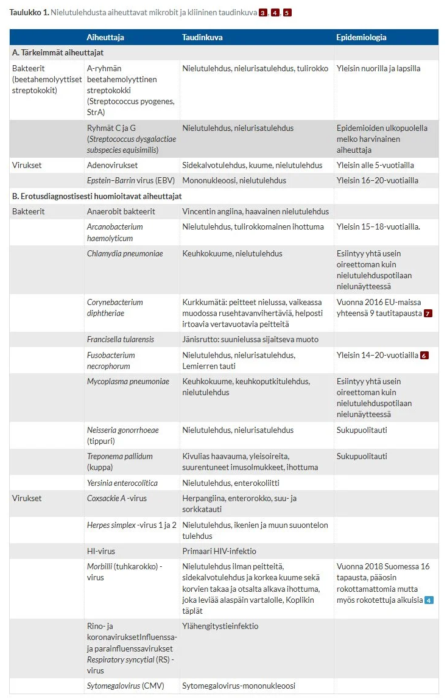

  

#### Poikien kasvunopeus on suurin murrosiän kasvupyrähdyksen aikaan {#Kasvunopeus-pyrahdyksessa}

  <button class="solution-button"
          data-label="Vastaus"
          data-hide-label="Piilota vastaus">
    Vastaus
  </button>
  

      Väärin

Kasvunopeus on normaalitilanteessa aina suurinta imeväisiässä ensimmäisen elinvuoden aikana,tällöin tulee n. +25cm. Toisen elinvuoden aikana kasvu hidastuu, mutta on yhä nopeaa (noin 10–12 cm/v). 

Vaikka murrosikä on elämän toinen suuri kasvuvaihe, jolloin kasvunopeus kiihtyy (pojilla pyrähdys keskimäärin 14 vuoden iässä) keskimäärin noin 9–10 senttiin vuodessa, tämä vauhti ei kuitenkaan yllä imeväisiän ennätyksiin.

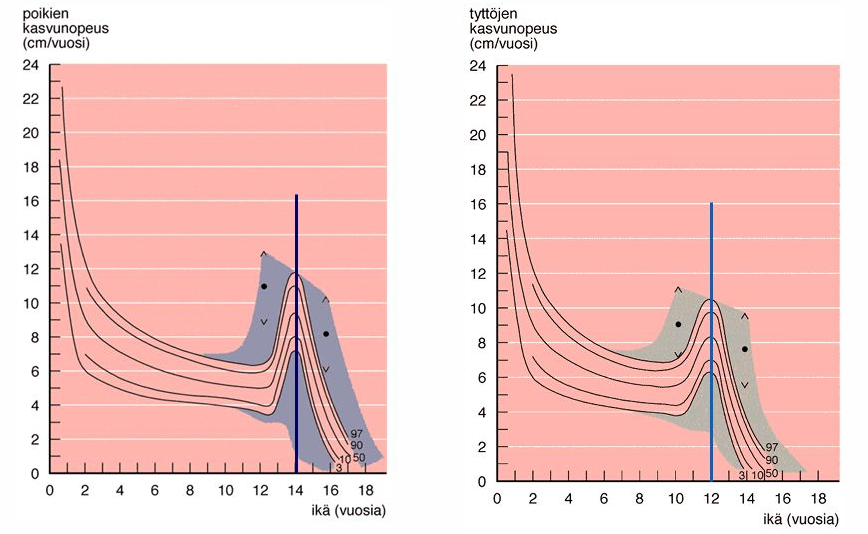

  

#### Onko joku elohopeajohdannainen yleinen apuaine jota käytetään rokotteissa Suomessa? {#Elohopeajohdonnaiset-rokotteissa}

  <button class="solution-button"
          data-label="Vastaus"
          data-hide-label="Piilota vastaus">
    Vastaus
  </button>
  

      Ei

Elohopeajohdannaisia ei enää käytetä Suomessa lapsille annettavissa rokotteissa. Aikaisemmin käytettiin tiomersaalia, joka on etyylielohopeapohjainen yhdiste, jota on historiallisesti käytetty säilöntäaineena moniannosrokepakkauksissa estämään bakteerien ja sienten kasvua.

Tiomersaalia sisältävät rokotteet poistuivat Suomen kansallisesta rokotusohjelmasta lähes kokonaan vuosien 2004–2005 vaihteessa. Nykyisin valtaosa rokotteista toimitetaan kerta-annosruiskuissa tai -ampulleissa, joissa säilöntäaineita ei tarvita lainkaan.

Tiomersaali sisältää etyylielohopeaa, joka poistuu elimistöstä huomattavasti nopeammin kuin kalojen sisältämä metyylielohopea eikä se kerry elimistöön. Laajoissa kansainvälisissä tutkimuksissa ei ole löydetty näyttöä siitä, että rokotteiden sisältämällä tiomersaalilla olisi yhteyttä esimerkiksi autismiin tai muihin neurologisiin häiriöihin. Varmuuden vuoksi ja kansallista luottamusta kohottaakseen aineesta on kuitenkin pääosin luovuttu tai sitä käytetään vain poikkeuksellisissa erityisrokotteissa (kuten tietyissä harvinaisissa matkailija- tai varautumisrokotteissa)

---

Muita aineita rokotteissa: alumiinijohdannaisia <0.5mg/ annos (alumiinia on luonnostaan maaperässä, ilmassa, juomavedessä ja äidinmaidossa; vauva saa ravinnostaan moninkertaisesti enemmän alumiinia kuin mitä rokotteissa on) ja formaldehydiä jäämiä (häviävän pieniä määriä; ihmisen oma aineenvaihdunta tuottaa jatkuvasti formaldehydiä, ja esimerkiksi yhdessä hedelmässä (kuten päärynässä) sitä on kymmeniä kertoja enemmän kuin yhdessä rokoteannoksessa). 
  

#### Voiko imeväisikäisen refluksisairauden diagnosoida PTH:ssa? {#Imevaisian-refluksisairaus-PTH}

  <button class="solution-button"
          data-label="Vastaus"
          data-hide-label="Piilota vastaus">
    Vastaus
  </button>
  

      Ei

Imeväisillä ja pienillä lapsilla usein oireet ovat niin epäspesifisiä, että mikään yksittäinen oire tai oireyhdistelmä ei erota refluksitautia muista vaivoista, kuten maitoallergiasta, toiminnallisista vatsavaivoista tai infektioista -> jos ei pelkkää pulauttelua, niin ESH selvittelyt (esim. ruokatorven PH:n pitkäaikaisrekisteröinti ja impedanssimittaus). 

Jos on vanhempi lapsi (yleensä kouluikäinen; osaa kuvailla itse tyypillisiä oireita) tai nuori eikä ole hälyttäviä/merkittäviä oireita, niin voi usein diagnosoida kliinisesti ja kokeilla lyhyttä (4–8 viikon) elämäntapahoitoa ja empiiristä happosalpaajahoitoa (PPI) diagnoosin varmistamiseksi ilman rutiininomaisia jatkotutkimuksia. 

  

#### Voiko lapsen pahoinpitelyepäilyn jatkotutkimukset tehdä PTH:ssa? {#Lapsen-pahoinpitelyepaily-PTH}

  <button class="solution-button"
          data-label="Vastaus"
          data-hide-label="Piilota vastaus">
    Vastaus
  </button>
  

      Ei

Pahoinpitelyä epäiltäessä voi varsinkin pienen lapsen lähettää **päivystyspotilaana lastensairaalaan,** vaikka vamma olisi lievä. Vanhemmille tulee kertoa, että lapsella on löydöksiä, jotka tarvitsevat selvityksen sairaalassa. Jos vanhemmat kieltäytyvät lähtemästä tutkimuksiin, pyydetään lastensuojelulta tai poliisilta apua.

_Selvissä tapauksissa ja vahvoissa epäilyissä tulee lähettävän lääkärin tehdä itse ilmoitus lastensuojelulle ja poliisille. Epäselvissä tilanteissa em. viranomaisilmoitukset tehdään sairaalassa mahdollisimman pian erotusdiagnostisten selvittelyjen jälkeen._

---

_Lapsen pahoinpitelyä tulisi epäillä esim:_

<li>Lapsi kertoo itse pahoinpitelystä</li>
<li>Vammaan haetaan apua viiveellä tai ei ollenkaan</li>
<li>Suurienergiainen kallovamma imeväisellä ja pikkulapsella, kun anamnestinen trauma ei ole ilmiselvä</li>
<li>Epäily ravistelun seurauksena syntyneistä vammoista (oksentelu, tajunnantason häiriöt, kohtausoireet, hengityskatkokset, huono ruokahalu ja/tai ärtyneisyys; yleisimpinä löydöksinä ovat subduraalitilan ja verkkokalvon verenvuodot). Pidettävä mielessä tutkittaessa alle vuoden ikäistä neurologisesti oireilevaa lasta, jolla on outo anamneesi eikä välttämättä ulkoisesti havaittavia löydöksiä.</li>
<li>Lievissä pään vammoissa (kuhmut, aivotärähdykset, kapeat ns. fissuuramurtumat erityisesti parietaaliluun alueella) pahoinpitelyselvittelyn tarve on arvioitava tapauskohtaisesti. Näitä vammoja voi syntyä myös esim. matalalta pudotessa tai kaatuessa</li>
<li>Murtumat (muut kuin kallonmurtumat)</li>
  <ul>
    <li>Alle 1-vuotiaan tai alle kävelyikäisen lapsen luunmurtuma</li>
    <li>Useat eri-ikäiset murtumat</li>
    <li>Jos murtuman syntytapa on tuntematon</li>
  </ul>
<li>Mustelmat ja pinnalliset vammat, joiden sijainti ei vastaa lapsen liikunnallista kehitysvaihetta</li>
  <ul>
    <li>Pienellä liikkumattomalla lapsella ei normaalisti mustelmia esiinny, mutta liikkumaan opettelevilla ja liikkuvilla lapsilla on useinkin mustelmia polvissa, säärissä tai otsassa</li>
    <li>Pahoinpitelymustelmille tyypillistä on sijaintipaikkana selkä, niska, kasvot, korvalehdet, pakarat, reisien taka- ja sisäpinnat. Parilliset nipistelymustelmat. Esineiden aiheuttamat tarkkarajaiset jäljet/mustelmat.</li>
  </ul>
<li>Nesteiden aiheuttamat tarkkarajaiset tai kiinteän esineen muotoa tarkasti noudattavat palovammat</li>
<li>Epäily kemiallisesta pahoinpitelystä (lapselle annettu huumaavaa lääkettä tai alkoholia)</li>
<li>**Kaikki muutkin kaikenikäisten lasten murtumat ja vammat, joissa esitietojen ja löydösten kesken on ristiriitaa tai joissa pahoinpitelyetiologia on mahdollinen**</li>

---

Sairaalan sosiaalityöntekijä järjestää tarvittaessa viranomaisneuvottelun ja toimii yhteyshenkilönä lastensuojelun ja poliisin kanssa. Rikostutkinnan ollessa kesken lapsen asiakirjamerkintöjä ei saa näyttää tai luovuttaa vanhemmille ilman poliisin tutkinnanjohtajan lupaa. 

Sairaalassa varsinkin pieni lapsi otetaan osastoseurantaan mahdollisten liitännäisvammojen ja erotusdiagnostiikan vuoksi. Sairaalassa tutkitaan lapsi sitä kattavammin, mitä pienempi hän on: 

<li>Vuoto-oireisilta (mustelmat, aivoverenvuodot, silmänpohjavuodot) tutkitaan PVKT, U-KemSeul, vuototaipumuksen selvittelyn erikoistutkimukset</li>
<li>Kallo- ja aivovammoissa pään TT tai MK ja silmä- ja hammaslääkärin konsultaatio</li>
<li>Alle 2-vuotiailta tutkitaan lapsen luustoröntgen; sitä vanhemmilla lapsilla röntgentutkimus kohdistetaan kliinisen murtumaepäilyn mukaan.</li>
<li>Tapauskohtaisesti virtsan huumausaineseulonta esim. lapsen vireystilan ollessa alentunut</li>
<li>Kohonnut ALAT tai Amyl saattavat paljastaa sisäelinvamman</li>

  

#### Saako huumausaineiden käyttäjä-äiti imettää, jos ei juo alkoholia? {#Huumausaineiden-kayttaja-imetys}

  <button class="solution-button"
          data-label="Vastaus"
          data-hide-label="Piilota vastaus">
    Vastaus
  </button>
  

      Ei

Huumeita käyttävä äiti ei saa imettää, riippumatta siitä, käyttääkö hän alkoholia vai ei. Lähes kaikki huumausaineet (kuten kannabis/THC, amfetamiinit, kokaiini ja laittomat opioidit) siirtyvät äidinmaidosta suoraan lapseen. Se, että äiti ei juo alkoholia, ei poista muiden huumausaineiden ja niiden hajoamistuotteiden kulkeutumista maitoon ja vauvan elimistöön.

Poikkeuksen katuhuumeiden aktiivisesta käytöstä muodostavat tilanteet, joissa äiti on vakaassa, valvotussa opioidikorvaushoidossa (esim. buprenorfiinivalmisteella). Tällöinkin imetyksen aloittamisesta ja turvallisuudesta päättää aina erikoissairaanhoito yksilöllisen riskiarvion perusteella ja ehdottomana edellytyksenä on, että äiti on täysin kuiva muista päihteistä ja sekakäytöstä. Aktiivinen huumausaineiden käyttö tekee imetyksestä aina ehdottoman vasta-aiheisen.

  

#### Voiko yleislääketieteen erikoislääkäri diagnosoida lasten keliakian? {#YLE-EL-keliakia}

  <button class="solution-button"
          data-label="Vastaus"
          data-hide-label="Piilota vastaus">
    Vastaus
  </button>
  

      Ei

Lasten keliakian diagnoosin tekee lastentautien EL ja ihokeliakian ihotautien EL. Lapsi siis lähetetään lastenlääkärille, jos kudostransglutaminaasivasta-aineet ovat vähänkään koholla (ei siis tarvitse olla >10x) 

Suurin osa aikuisten keliakiadiagnooseista kuitenkin tehdään PTH:ssa. 

  

#### Polio on saatu eradikoitua ihmiskunnasta rokotteiden avulla 

  <button class="solution-button"
          data-label="Vastaus"
          data-hide-label="Piilota vastaus">
    Vastaus
  </button>
  

      Väärin

Polion eradikaatio-ohjelma on alkanut 1988, mutta ei ole vielä loppunut, vaikka poliotapaukset ovat vähentyneet yli 99,9 prosenttia. Endeemisiä maita on kuitenkin enää harvoja (mm. Afganistan, Pakistan). Polioviruksia on kolme tyyppiä (tyypit 1, 2 ja 3). Villi tyyppi 2 on julistettu hävinneeksi 2015, tyyppi 3 vuonna 2019. Suomi on luokiteltu poliovapaaksi maaksi. 

Eradikaatiota vaikeuttavat myös niin sanotut kiertävät rokoteperäiset poliovirukset (cVDPV), joita voi esiintyä alueilla, joissa rokotuskattavuus jää liian alhaiseksi; kehitysmaissa siis käytetään elävää heikennettyä oraalista poliorokotetta (OPV, Sabin). Rokotettu erittää virusta ympäristöönsä, mikä auttaa suojaamaan myös muita laumaimmuniteetin kautta. Jos alueella on huono rokotuskattavuus, virus voi kiertää väestössä pitkään (yli vuoden) ja mutatoitua takaisin sellaiseen muotoon, että se voi aiheuttaa sairauden. Suomessa käytetään vain inaktivoitua, tapettua poliorokotetta (IPV), joka annetaan pistoksena. IPV ei sisällä elävää virusta, joten siitä ei voi saada eikä levittää rokoteperäistä poliota. 

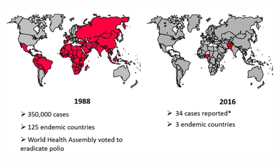
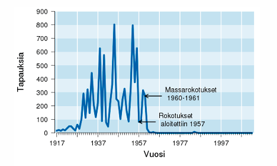
  

#### Jos lapsella on pitkittynyttä limaisuutta tai rohinaa niin pitää tehdä astmaselvittelyt {#Pitkittynyt-limaisuus-astma}

  <button class="solution-button"
          data-label="Vastaus"
          data-hide-label="Piilota vastaus">
    Vastaus
  </button>
  

      Väärin

Pelkkä pitkittynyt limaisuus tai ylähengitysteiden ”rohina” (erityisesti pikkulapsilla) ei vielä edellytä astmaselvittelyjä tai astmalääkityksen aloittamista.

Pikkulapsilla ja vauvoilla hengitysteiden anatomia on pieni, ja flunssien jäljiltä nieluun tai isoihin hengitysteihin kertyy helposti limaa, joka kuuluu selvänä rohinana tai korinana hengityksen yhteydessä. Tämä on tyypillisesti ylähengitysperäistä eikä liity lainkaan keuhkoputkiin tai astmaan. Tyypillisempiä oireita alla. 

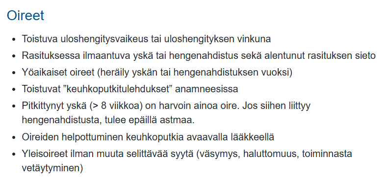
  

#### Allergiat diagnosoidaan pääasiassa eliminaatio-altistuskokein {#Allergiat-diagnosoidaan}

  <button class="solution-button"
          data-label="Vastaus"
          data-hide-label="Piilota vastaus">
    Vastaus
  </button>
  

      Oikein/Väärin

Riippuu epäillystä allergiasta, sinänsä virheellistä yleistää eliminaatio-altistuskokeet kaikkiin allergioihin. 

Se on kuitenkin kulmakivi varsinkin ruoka-allergioissa. Epäilty ruoka-aine poistetaan ruokavaliosta (yleensä 1–2 viikoksi), minkä aikana oireiden pitää rauhoittua. Tämän jälkeen ruoka-aine palautetaan ruokavalioon hallitusti (altistus). Jos oireet palaavat, niin kyseessä on todennäköisimmin ruoka-allergia. Vaikka verikokeista (spesifiset IgE-vasta-aineet) tai ihotesteistä voitaisiin saada suuntaa, varsinkin keskeisten ruoka-aineiden (kuten maidon, viljojen tai kananmunan) kohdalla diagnoosi halutaan usein varmistaa altistuskokeella turhien ja rajoittavien välttämisruokavalioiden välttämiseksi.

---

Kaikkia allergioita ei kuitenkaan todeta altistuskokein. Esimerkiksi hengitystieallergiat (siitepölyt, eläimet, pölypunkit) voidaan usein selvittää anamneesilla, mutta spesifin IgE:n määritys tai ihopistokokeet tuovat diagnoosiin varmuutta, vaikka niitä ei rutiininomaisesti vaadita. 

Samoin kosketusallergiat diagnosoidaan toisella tavalla. Jos allergeeni on anamneesin perusteella selvä, esim. nikkeli, ei yleensä tarvita epikutaanikokeita. Jos tarvitaan tutkimuksia, niin ihokosketusallergiaa ja allergista kosketusihottumaa tutkitaan epikutaanikokeilla (lapputestit), jotka osoittavat herkistymisen allergeenille. Testit suorittaa ja tulkitsee ihotautilääkäri.

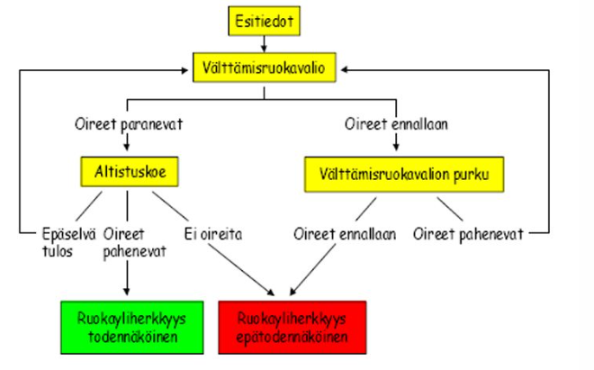
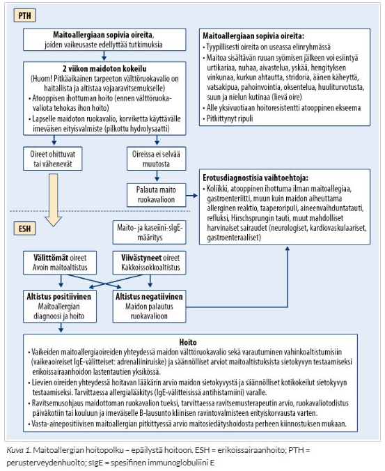
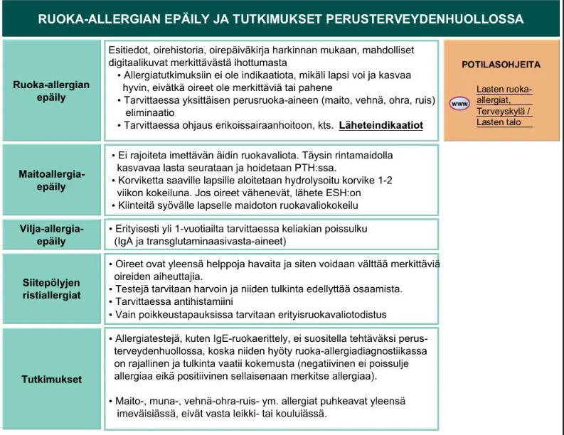
  

#### Lasten välikorvaeritteestä löytyy yleensä sekä virus että bakteeri {#Valikorvaeritteesta-virus-seka-bakteeri}

  <button class="solution-button"
          data-label="Vastaus"
          data-hide-label="Piilota vastaus">
    Vastaus
  </button>
  

      Oikein

Useimmissa akuuteissa välikorvatulehduksissa (AOM) kyseessä on **bakteerin ja viruksen aiheuttama sekainfektio.** Äkillinen välikorvatulehdus siis ilmaantuu useimmiten ylähengitysteiden virusinfektion aikana tai heti sen jälkeen. Johtuu siitä, että nenänielun inflammaatio voi aiheuttaa korvatorven turvotusta ja tukkeutumista ja värekarvatoiminnan häiriöitä. Korvatorven obstruktio johtaa ilmastoitumisen ja tyhjenemisen heikentymiseen ja välikorvan alipaineeseen. Värekarvatoiminnan häiriöt helpottavat bakteerien kertymistä. Nämä tekijät johtavat välikorvan bakteeritulehdukseen viraalisen ylähengitystieinfektion yhteydessä. 

Yleisimmät bakteerit ovat **Streptococcus pneumoniae, Haemophilus influenzae (non-typeable) ja Moraxella catarrhalis.** Tavallisimmat välikorvatulehduksiin liittyvät virukset ovat rino-, RS-, entero- ja bokavirus. 

  

#### Imeväinen on vakavasti sairas jos vastustelee tutkimusta ja itkee voimakkaasti {#Vakavasti-sairas-imevainen}

  <button class="solution-button"
          data-label="Vastaus"
          data-hide-label="Piilota vastaus">
    Vastaus
  </button>
  

      Väärin

Tietysti vakava sairaus on mahdollista aina, mutta imeväisen voimakas itku, kiukuttelu ja tutkimuksen vastustelu (aktiivinen liike) ovat yleensä merkki hyvästä yleistilasta, riittävästä energiasta ja säilyneestä neurologisesta reaktiokyvystä.

Vakavasti sairas, sokkitilassa tai vaikeassa keskushermoston infektiossa oleva imeväinen on tyypillisesti oirekuvaltaan aivan päinvastainen: veltto, unelias, heikkoitkuinen...

  

#### Tuseeraus on tarpeen ummetuksen diagnosoimiseksi

  <button class="solution-button"
          data-label="Vastaus"
          data-hide-label="Piilota vastaus">
    Vastaus
  </button>
  

      Väärin

Huolellinen anamneesi ja status riittävät yleensä toiminnallisen ummetuksen diagnosoimiseen.

Palpaatiossa voi tuntua makkaramainen massa vasemmalla alavatsalla tai vatsa voi olla ilmatäyteinen. Tutkimukseen kuuluu periaatteessa peräaukon seudun tarkastus, mukaan lukien alaselän ihomuutokset ja perianaaliset muutokset. **Tyypillisen oirekuvan yhteydessä tuseeraus ei ole välttämätön,** mutta epäselvässä tilanteessa kova ulostemassa peräsuolessa varmistaa diagnoosin. Lapsipotilaan kuvantamis- tai laboratoriotutkimuksia ei rutiinimaisesti tarvita pelkän ummetusoireen vuoksi (vaikkakin keliakian mahdollisuus on hyvä muistaa aina pitkittyvistä vatsavaivoista kärsivän lapsen hoidossa)

Varoitusmerkeistä, jolloin on epäiltävä muuta kuin toiminnallista ummetusta, tärkeimpiä ovat vastasyntyneenä mekoniumin eli lapsenpihkan tulo yli 48 tunnin iässä, veriripuli, kuume, sappioksennukset, kasvuhäiriö, poikkeavat alaraajarefleksit ja/tai lihasvoimat sekä seksuaalisen hyväksikäytön merkit. Imeväisiässä alkavan ummetuksen etiologia on sekin tavallisesti toiminnallinen vaiva, mutta mekoniumin tulo (normaalisti alle 48 t) ajallaan on varmistettava, ja lapsen peräaukon seutu inspektoitava huolellisesti synnynnäisten anomalioiden poissulkemiseksi.

Ummetuksen hoidon tarvetta arvioitaessa ja hoitoa suunniteltaessa on keskeistä lapsen oireiden ja ulostamistapojen kartoitus käyttäen apuna WC-päiväkirjaa. Pienikin lapsi osaa varsin hyvin kertoa vessa-asioistaan, kun saa siihen mahdollisuuden ja riittävän rohkaisun sekä hänelle kohdistetut ikätasoisesti esitetyt kysymykset. Voi käyttää apuna esim. Bristolin ulostekaaviota. Myös lapsen juomiset, syömiset sekä liikuntatottumukset kannattaa käydä läpi.

  

#### Tauti voidaan eradikoida jos ihminen on sen ainoa isäntä {#Tauti-voidaan-eradikoida}

  <button class="solution-button"
          data-label="Vastaus"
          data-hide-label="Piilota vastaus">
    Vastaus
  </button>
  

      Oikein

Tämä on epidemiologian keskeisimpiä biologisia perusedellytyksiä sille, että jokin tartuntatauti voidaan ylipäätään eradikoida eli hävittää maapallolta kokonaan ja pysyvästi. Jos taudinaiheuttajalla on luonnonvarainen eläinisäntä tai laaja eläinreservuaari (eli kyseessä on zoonoosi), taudin maailmanlaajuinen eradikaatio on käytännössä mahdotonta. Vaikka tauti saataisiin hävitettyä jokaiselta ihmiseltä maapallolla, se säilyisi, kiertäisi ja kehittyisi edelleen eläinpopulaatioissa ja voisi aina hypätä takaisin ihmisiin.

Kun ihminen on taudin ainoa luonnollinen isäntä, taudinaiheuttajalla ei ole biologista "varastoa" ihmiskehon ulkopuolella. Kun tartuntaketjut saadaan katkaistua riittävän tehokkaasti (esimerkiksi kattavilla rokotuksilla), taudinaiheuttaja kuolee sukupuuttoon, koska sillä ei ole paikkaa, jossa lisääntyä.

Paras esimerkki tästä on **isorokko** (smallpox), joka on ainoa ihmiskunnasta tähän mennessä kokonaan eradikoitu tauti. Sen onnistumisen mahdollisti se, että viruksella oli vain yksi isäntä: ihminen.

Myös _polio_ on mahdollinen tuhota kokonaan, koska ihminen on sen ainoa luonnollinen isäntä. Poliota ei ole vielä saatu täysin poistettua maapallolta. 
  

#### Laktoosi-intoleranssin ainoa oire voi olla huono kasvu

  <button class="solution-button"
          data-label="Vastaus"
          data-hide-label="Piilota vastaus">
    Vastaus
  </button>
  

      Väärin

Laktoosi-intoleranssi voi periaatteessa aiheuttaa painon laskua merkittävän ripulin ja mahdollisesti heikon ravinnonsaannin takia (potilas voi omatoimisesti vähentää maitotuotteiden käyttöä ja siten saada yleisesti vähemmän kaloreita/kalsiumia), mutta **kasvun ongelmat eivät yleensä ole laktoosi-intoleranssin pääoireita.** Oireet ovat pääasiassa luonteeltaan vatsakeskeisiä: vatsakipu, turvotus, ilmavaivat ja ripuli, jotka ilmaantuvat laktoosia sisältävien tuotteiden nauttimisen jälkeen.

Noin 10 % geneettisen hypolaktasian omaavista ei tunnista laktoosin nauttimisen aiheuttavan heille oireita. Jos subjektiivisia oireita ei ole, nykykäsityksen mukaan laktoosin käyttöä ei tarvitse rajoittaa, vaikka geneettisessä perimässä on hypolaktasia. _Laktoosin heikko hajottaminen ei siis itsessään aiheuta huonoa kasvua._

---

Tietysti jos laktoosi-intoleranssin on aiheuttanut keliakia, niin silloin voisi olla huonoa kasvua; tällöin kuitenkin olisi myös muita oireita yleensä, jos olisi kliinisesti merkittävää hypolaktasiaa. 

  

#### Laktuloosia voi käyttää vain yli 1v potilaille {#Laktuloosi-yli-1v}

  <button class="solution-button"
          data-label="Vastaus"
          data-hide-label="Piilota vastaus">
    Vastaus
  </button>
  

      Väärin

Laktuloosia voi käyttää kaikenikäisten ummetukseen. Makrogolin suhteen on usein ohjeistus, että ei tulisi käyttää < 6kk-ikäisille. 

  

#### Lapsen ummetus on useimmiten merkki sairaudesta

  <button class="solution-button"
          data-label="Vastaus"
          data-hide-label="Piilota vastaus">
    Vastaus
  </button>
  

      Väärin

Lapsen ummetuksen syy on **hyvin harvoin elimellinen sairaus** (esim. keliakia, hypotyreoosi, Hirschsprungin tauti, peräsuolen sisemmän sulkijalihaksen akalasia); yleensä kyseessä on _toiminnallinen ongelma._

---

Ummetuksen esiintyvyys lapsuusiällä on lähteestä riippuen n. 8-13 %.

Ummetus alkaa usein jo taaperoikäisenä paksusuolen fysiologisen toiminnan hidastuessa. Täysimetetyn ja hyvinvoivan vauvan harvoin tapahtuva ulostaminen ei ole ummetusta (muista täysimetetty voi ulostaa 10krt päivässä - kerran 10 päivässä).

Joskus taustalla on kivulias ulostamiskokemus, josta seuraa ulosteen panttaamista tai peräaukon haavauma. Tilanteesta seuraa itseään ruokkiva noidankehä, joka tulisi katkaista mahdollisimman nopeasti ja tehokkaasti ummetuslääkkein. Ummetuksesta kärsivillä lapsilla on usein ruoan kuidun määrä normaalia vähäisempää, ja lähisuvussa esiintyy ummetusta

---

Ummetuksen oireita ovat muun muassa ulostamisvaikeus, vatsakivut sekä kivulias ja epäsäännöllinen ulostaminen. Uloste voi olla kovaa ja papanamaista tai kertamäärä voi olla hyvin suuri. 

<li>Tunne epätäydellisestä tyhjenemisestä on tavallista, samoin ulosteen karkailu (tuhriminen) ja ohivuotoripuli. Kova ulostemassa peräsuolessa estää normaalin peräsuolen sulkijalihaksen toimintaa ja tuhriva lapsi ei useinkaan edes huomaa itse tuhrimista. Tuhrimisuloste on löysää, kovan peräsuolen ulostemassan ohitse vuotavaa nestemäistä ulostetta.</li>
<li>Ummetuksen pitkittyessä peräsuoli venyy ja tarvitaan entistä suurempi ulostemassa ulostusrefleksin laukaisemiseen.</li>

---

Huolellinen anamneesi ja status riittävät yleensä toiminnallisen ummetuksen diagnosoimiseen.

<li>Palpaatiossa voi tuntua makkaramainen massa vasemmalla alavatsalla tai vatsa voi olla ilmatäyteinen. Tutkimukseen kuuluu peräaukon seudun tarkastus, mukaan lukien alaselän ihomuutokset ja perianaaliset muutokset. Tyypillisen oirekuvan yhteydessä tuseeraus ei ole välttämätön, mutta epäselvässä tilanteessa kova ulostemassa peräsuolessa varmistaa diagnoosin. Lapsipotilaan kuvantamis- tai laboratoriotutkimuksia ei rutiinimaisesti tarvita pelkän ummetusoireen vuoksi (vaikkakin keliakian mahdollisuus on hyvä muistaa aina pitkittyvistä vatsavaivoista kärsivän lapsen hoidossa)</li>
<li>Varoitusmerkeistä, jolloin on epäiltävä muuta kuin toiminnallista ummetusta, tärkeimpiä ovat vastasyntyneenä mekoniumin eli lapsenpihkan tulo yli 48 tunnin iässä, veriripuli, kuume, sappioksennukset, kasvuhäiriö, poikkeavat alaraajarefleksit ja/tai lihasvoimat sekä seksuaalisen hyväksikäytön merkit. Imeväisiässä alkavan ummetuksen etiologia on sekin tavallisesti toiminnallinen vaiva, mutta mekoniumin tulo (normaalisti alle 48 t) ajallaan on varmistettava, ja lapsen peräaukon seutu inspektoitava huolellisesti synnynnäisten anomalioiden poissulkemiseksi.</li>
<li>Ummetuksen hoidon tarvetta arvioitaessa ja hoitoa suunniteltaessa on keskeistä lapsen oireiden ja ulostamistapojen kartoitus käyttäen apuna WC-päiväkirjaa. Pienikin lapsi osaa varsin hyvin kertoa vessa-asioistaan, kun saa siihen mahdollisuuden ja riittävän rohkaisun sekä hänelle kohdistetut ikätasoisesti esitetyt kysymykset. Voi käyttää apuna esim. Bristolin ulostekaaviota. Myös lapsen juomiset, syömiset sekä liikuntatottumukset kannattaa käydä läpi.</li>

---

Diagnostiset kriteerit (Roma V) lapsen toiminnalliselle ummetukselle: Vähintään 2 oiretta 1kk:n ajan:

<li>Enintään 2 ulostuskertaa viikossa</li>
<li>Tuhrimista viikoittain</li>
<li>Ulostamisen pidättelyä</li>
<li>Ulostamiskipuja tai kovia ulosteita</li>
<li>Peräsuolessa suuri ulostemassa</li>
<li>Suurikokoisia ulosteita</li>

  

#### Lasten aivokasvaimista vain ¼ voidaan poistaa kokonaan

  <button class="solution-button"
          data-label="Vastaus"
          data-hide-label="Piilota vastaus">
    Vastaus
  </button>
  

      Väärin

CNS-kasvaimet ovat toiseksi yleisin kasvainryhmä lapsilla leukemioiden jälkeen; aivokasvaimia diagnosoidaan Suomessa vuosittain noin 50. 

Aivokasvaimien hoidon onnistuminen vaihtelee suuresti kasvaimen tyypin, pahanlaatuisuusasteen ja tarkan sijainnin mukaan, mutta osuus on merkittävästi suurempi kuin pelkkä neljäsosa (25 %). 

**Kolme neljästä lapsuusiän aivokasvaimesta on mahdollista parantaa pysyvästi,** mutta hoidon neurokognitiiviset ja muut pitkäaikaisvaikutukset heikentävät usein merkittävästi potilaiden elämänlaatua.

---

Yli 95 % lapsuusiän aivokasvaimista on sporadisia eikä ympäristötekijöillä ole osoitettua merkitystä keskushermoston sädehoitoa lukuun ottamatta. 

<li>Lapsuusiän aivokasvaimiin liittyvät keskeiset oireet määräytyvät pääasiassa kasvaimen sijainnin ja kasvunopeuden perusteella. Lapsuusiän kasvaimet ilmenevät yleensä infratentoriaalisesti posteriorisessa fossassa (takakuopassa), kun taas aikuisilla supratentoriaalisesti</li>
<li>Kaikkein nuorimmilla potilailla oirekuva on erityisen haastava. Se sisältää mm. pään ympärysmitan kasvun, pituuskasvun pysähtymisen ja ärtyisyyttä. Yli kolmevuotiailla lapsilla kohonneen kallonsisäisen paineen aiheuttamat oireet ovat usein hallitsevia.</li>

---

Pään magneettikuvaus on huolellisen kliinisen ja neurologisen tutkimuksen ohella diagnostiikan kulmakiviä, ja lisäksi pyritään aina kasvaimen histologiseen diagnoosiin (biopsia tai kasvaimen poisto). Osassa tapauksista on selkäydinkanavan kuvantaminen tarpeen, mutta keskushermoston ulkopuolelle leviäminen on varsin harvinaista. 

---

**Hoidon perustana on kasvaimen mahdollisimman täydellinen kirurginen poisto.**

<li>Leikkaushoitoon päädytään lasten aivokasvaimissa lähes poikkeuksetta neurologisten oireiden vuoksi, ja noin puolet lapsista päätyy leikkaukseen kohonneen aivopaineen lievittämiseksi jo ennen kasvaimen poistoa.</li>
<li>Leikkauksen jälkeen pään magneettikuvaus uusitaan kolmen vuorokauden kuluessa sen ennusteellisen arvon vuoksi. PAD:n tultua arvio myös jatkohoidosta: seuranta? uusi leikkaus? sädehoito (ei alle 3-5-vuotiaille)? kemoterapia?</li>
<li>Sädehoito on säilyttänyt asemansa tärkeänä osana aivokasvainten hoitoa. Vaikka sädehoitolaitteistot ja -ohjelmat ovat viime vuosina kehittyneet merkittävästi, pitkäaikaisvaikutuksia ei pystytä kokonaan välttämään. Perinteisen fotonisädehoidon rinnalla käytetään lapsuusiän aivokasvainten hoidossa enenevässä määrin tarkemmin kohdentuvaa protonisädehoitoa ulkomaisissa keskuksissa. Solunsalpaajahoito on osoittautunut hyödylliseksi etenkin lasten pahanlaatuisten aivokasvainten hoidossa, mutta omien kantasolujen palautuksen turvin tehtävät intensiivihoidot ovat vielä kokeellisia.</li>

---

  

#### Suurin osa pulauttelijoista sairastaa refluksitautia

  <button class="solution-button"
          data-label="Vastaus"
          data-hide-label="Piilota vastaus">
    Vastaus
  </button>
  

      Väärin

**Yleisin imeväisikäisten toiminnallisista vatsavaivoista on pulauttelu, josta kärsii noin puolet vauvoista.** Pulautuksessa mahansisältöä nousee suuhun tai ulos suusta. Gastroesofageaalinen refluksi (GER) siis yleisesti (ei pelkästään lapsilla) tarkoittaa mahalaukun sisällön takaisinvirtausta ruokatorveen hetkellisesti vähentyneen LES:n tonuksen takia -> pulauttelu on gastroesofageaalista refluksia, jossa ruokaa nousee suuhun tai vielä ulos suusta. Kyseessä on fysiologinen ilmiö, joka johtuu ruokatorven ja vatsalaukun yhteistoiminnan kehittymättömyydestä. 

Viaton pulauttelu ei vaadi aina merkittävää hoitoa ja tärkeintä on vanhempien kanssa neuvotteleminen tilan hyvänlaatuisuudesta ja hyvästä ennusteesta, seurantakäynnin sopiminen. Imeväisiälle tyypillinen toiminnallinen pulauttelu jää pois yleensä 1–1,5 vuoden iässä. 

---

**Refluksitauti (gastroesofageaalinen refluksisairaus, GERD) taas tarkoittaa tilannetta, jossa refluksiin liittyy yksi tai useampi huolestuttava oire tai löydös.** Mikään yksittäinen oire tai oireiden joukko ei ole spesifinen refluksitaudille, mutta tyypillisiä refluksitautiin viittavia löydöksiä lapsen refluksin yhteydessä ovat mm:

<li>Painonlasku, huono kasvu</li>
<li>Ärtyneisyys, itkuisuus</li>
<li>Uloshengitysvaikeus, stridor, käheys, krooninen yskä</li>
<li>Limaisuus, rohina</li>
<li>Nielemisvaikeudet, syömisvaikeudet</li>
<li>Isommilla närästys, rinnanaluspolte, rintakipu (pienet lapset eivät yleensä osaa paikantaa närästyskipua)</li>
<li>Hammaskiilteen vauriot</li>
<li>Apnea</li>
<li>Aspiraatiopneumonia</li>
<li>Raudanpuuteanemia</li>
<li>Ajallisesti syömiseen tai pulautteluun liittyvä itkuisuus tai ärtyisyys (ei yksinomainen yöitkuisuus tai yöheräily)</li>
<li>Sandiferin syndrooma (itkukohtauksiin liittymätön niskan ekstensio-asento tai torticollis)</li>

  

#### Lasten keliakiaa ei ikinä voi diagnosoida ilman tähystystä {#Lasten-keliakia-tahystys}

  <button class="solution-button"
          data-label="Vastaus"
          data-hide-label="Piilota vastaus">
    Vastaus
  </button>
  

      Väärin

Lasten keliakin diagnoosin asettaa lastenlääkäri. Keliakian diagnostiikka: 

<li>1 - Aloitetaan määrittämällä S-tTGAbA+S-IgA (yhdessä ns. S-KeliSeul)</li>
  <ul>
    <li>Jos potilas on IgA-puutteellinen, tutkitaan suoraan IgG-rakenteiset vasta-aineet</li>
  </ul>
<li>2 - Jos kudostransflutaminaasivastaineet >10x viitearvojen ylärajasta, määritetään endomysium-vasta-aineet (S-EMAbA)</li>
  <ul>
    <li>Lapsi kuuluu ESH, vaikka ttgaba olisi vähänkin koholla (ei siis tarvitse >10x olla lähetettä varten)</li>
  </ul>
<li>3 - Jos endomysiumvasta-aineet positiiviset -> diagnoosi voidaan asettaa</li>
  <ul>
    <li>Jos seerumimääritykset eivät tuo diagnoosia, otetaan ohutsuolibiopsia</li>
  </ul>

  

#### IBD:n hoidossa ensisijaista on ruokavalio

  <button class="solution-button"
          data-label="Vastaus"
          data-hide-label="Piilota vastaus">
    Vastaus
  </button>
  

      Väärin

Tulehduksellisten suolistosairauksien (IBD, eli Crohnin taudin ja haavaisen paksusuolentulehduksen) ensisijainen kulmakivi on lääkehoito, ei ruokavalio. 

Ruokavalio voi joskus lievittää oireita (esim. jos aiheutunut laktoosi-intoleranssia sekundaarisesti), mutta ruokarajoitukset eivät paranna tai poista suolen tulehdusta. 

---

Lasten IBD:n hoidosta ja seurannasta vastaa tulehduksellisiin suolistosairauksiin perehtynyt lastenlääkäri. Hoidon tavoitteena on turvata lapsen normaali kasvu ja kehitys. Tämän vuoksi oireettomuuden lisäksi pyritään rauhoittamaan suolitulehdus. 

Lievässä haavaisessa koliitissa tähän päästään usein pelkällä _mesalatsiinilla_ (5-ASA; pelkässä proktiitissa mahdollisesti paikallisilla supoilla, mutta muuten oraalisesti), mutta kohtalaisessa ja vaikeassa IBD:ssa tarvitaan immunosuppressiivista/biologista hoitoa. Mesalatsiini ei pääasiassa kuulu Crohnin taudin hoitoon. 

**Taudin hoidon alkuvaiheessa/pahenemisvaiheissa tarvitaan yleensä systeemistä kortikosteroidia.** Kortisoniriippuvaisessa taudissa suolitulehdus aktivoituu uudelleen viimeistään kolmen kuukauden kuluessa kortisonihoidon päättymisestä. Silloin mesalatsiinihoitoon liitetään mukaan _immunosuppressiivinen lääkitys (yleensä atsatiopriini, joskus metotreksaatti) ja/tai biologinen hoito (yleensä alkuun TNF-alfasalpaaja)._ Vaikeassa akuutissa osastohoitoa vaativassa koliitissa (PUCAI vähintään 65 pistettä) joudutaan noin neljäsosassa tapauksista turvautumaan biologiseen hoitoon, kun riittävää vastetta suonensisäiselle metyyliprednisolonille ei noin viikon kuluessa ole saatu. Usein tällä voidaan välttää ainakin välitön paksusuolen operatiivinen poisto, joka on kuitenkin edelleen vaikean lääkehoitoon reagoimattoman koliitiin ainoa hoito.

Leikkaus on CU:n suhteen parantava (poistetaan koko paksusuoli -> ei ole enää paksusuolta, joka voisi tulehtua); vähintään 20% pankoliittia (CU) sairastavista lapsista joutuu kolektomiaan 10 v kuluessa. Crohnin taudin hoidossa leikkaus ei ole parantuva (mikä tahansa osa suolesta voi tulehtua). Kolmasosa Crohn-lapsista joutuu leikkaukseen 10 v kuluessa. 

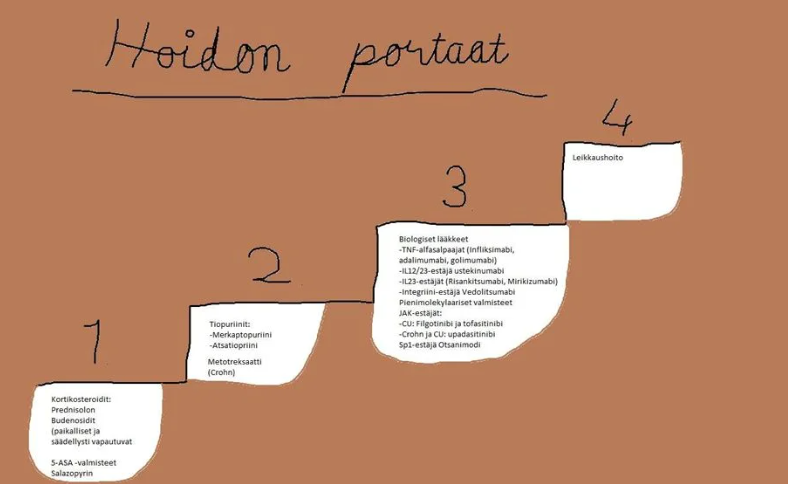
  

#### Keliakia voi aiheuttaa kiillevauriota

  <button class="solution-button"
          data-label="Vastaus"
          data-hide-label="Piilota vastaus">
    Vastaus
  </button>
  

      Oikein

Keliakia voi usein ilmentyä pysyvien hampaiden kiillevauriona; hoitamattoman keliakian aiheuttama ravintoaineiden imeytymishäiriö ja tulehdus häiritsevät hampaiden muodostumista.

Pysyvissä hampaissa keliakian aiheuttamat kiillemuutokset ovat usein symmetrisiä ja näkyvät pituussuunnassa samoissa kohdissa vastaavissa hampaissa molemmin puolin suuta

**Puhkeamisen jälkeen syntyneet kiillevauriot eivät korjaannu enää gluteenittomalla ruokavaliolla,** mutta gluteenittoman ruokavalion varhainen aloitus suojaa vielä puhkeamattomia hampaita kiillemuutoksilta ja ehkäisee uusia vaurioita. 

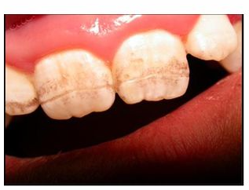
  

#### Tulirokko pitää hoitaa antibiootilla, vaikka lapsi on hyvävointinen {#Tulirokko-ab}

  <button class="solution-button"
          data-label="Vastaus"
          data-hide-label="Piilota vastaus">
    Vastaus
  </button>
  

      Oikein

Tulirokon (scarlatina, scarlet fever) aiheuttaja on toksiinia tuottava A-ryhmän beetahemolyyttinen streptokokki (S. pyogenes, GAS). Esiintyy kaikissa ikäryhmissä, useimmiten lapsilla. On nykyään Suomessa harvinainen (streptokokin aiheuttamaa nielutulehdusta esiintyy runsaasti, mutta toksiinia tuottavan streptokokin aiheuttama tulirokko on harvinainen); pieniä epidemioita esiintyy kuitenkin jatkuvasti. Leviää pisara- ja kosketustartuntana lähikontakteihin tai tarttuu kontaminoituneista elintarvikkeista.

---

Oireet samanlaisia kuin A-streptokokki-infektioissa yleensäkin (kuume, kurkkukipu, päänsärky), lisäksi ihottuma. Liittyy useimmiten faryngiittiin tai ihoinfektioon, mutta voi liittyä myös syvään A-streptokokki-infektioon.

Ihottuma kehittyy yleensä toisena sairastamispäivänä ja vaalenee n. viikon kuluttua. Ihottuma on punoittava, pienipilkkuinen, usein hieman karhea (hiekkapaperimainen) ja alkaa tavallisesti rinnalta tai kasvoilta (leviää tästä laajemmin rintakehälle, kainaloihin ja vatsalle). Suun ympärillä todetaan usein valkea kolmio, jonka kärki sijaitsee nenänseudulla. Ihottuman jälkeen iho voi hilseillä ja jopa kuoriutua pitkään.

Tyypillistä on nähdä myös ns. mansikkakieli, jossa kieli punoittaa, turpoaa ja sen nystyt kohoavat näkyviin mansikan tavoin. 

---

Diagnostiikassa S. pyogenes osoitetaan nielunäytteestä (tai muusta infektiopesäkkeestä) viljelyllä tai antigeenipikatestillä. Erotusdiagnostisesti erityisesti Kawasakin tauti voi muistuttaa streptokokkitonsilliitin laukaisemaa tulirokkoa (voi myös aiheuttaa mansikkakieltä). 

---

Hoitona on A-streptokokin kattava antibiootti, joko suun kautta tai parenteraalisesti riippuen primaarin infektiopesäkkeen vakavuudesta. Vain harvoin vaaditaan sairaalahoitoa; sairaalaan lähetetään potilas, jonka yleistila on selvästi heikentynyt (tulirokko voi joskus aiheuttaa invasiivisen septisen taudin ja johtaa jopa sokkiin)

Yleensä riittää **p.o. fenoksimetyylipenisilliini 10 vrk.** Lapsille V-penisilliinimikstuura 66 mg/kg/vrk (yli 6-vuotiaille tablettihoidossa 50 000–100 000 IU/kg/vrk) jaettuna 3 annoskertaan (ei saa ylittää aikuisen annosta); aikuisille V-penis 1 milj. IU x3. Penisilliiniallergisille kefaleksiiniä (jos kefalosporiiniallergiakin, niin klindamysiini tai atsitromysiini). 

Lyhentää oireiden kestoa ja vähentää myöhäiskomplikaatioita (reumakuume, glomerulonefriitti, paikalliset märkivät lisätaudit (nielupaise, välikorvatulehdus)) sekä pysäyttää tartuttavuuden nopeasti (tartuttavuus loppuu 24 t:n kuluttua mikrobilääkehoidon aloituksesta (eristysaika)). 

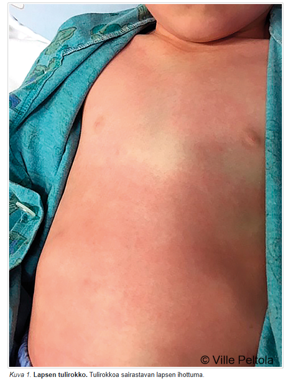
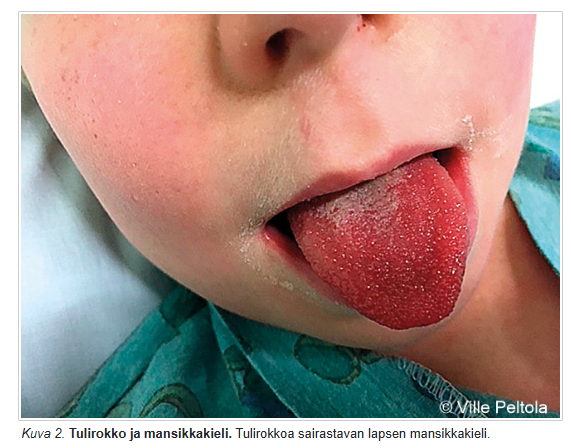

  

## 2024 

### Lapsella gradus 2 alkusystolinen sivuääni, kuuluu parasternaalisesti vasemmalta apexin kohdalta. Kuuluu myös muilta kuuntelualueilta. Anamnestisesti olennaisimmat kysymykset? Mitä tutkit? Mitä jatkoja, mikä sivuääni kyseessä? {#Gr-2-sivuaani-kysymykset-tutkimukset-jatkot}

  <button class="solution-button"
          data-label="Vastaus"
          data-hide-label="Piilota vastaus">
    Vastaus
  </button>
  

Kyseessä on todennäköisesti fysiologinen ejektioääni tai hyvänlaatuinen virtausääni.

Olennaisimpia kysymyksiä on yleistila/suorituskyky/kasvu/infektio-oireet/aiemmat löydökset/sukuanamneesi. 

Tutkimuksiin kuuluu yleistila/keuhkojen auskultaatio/vatsan palpaatio/nivuspulssit/tarvittaessa lapsen iän mukaan (jos yli 3v ja toistuvasti sivuääni) kaksi-/neliraajaverenpaineet (eli siis vähintään oikea yläraaja ja toinen alaraaja) + EKG. 

Ei tarvita jatkoja, jos lapsi oireeton, ääni sopii hyvänlaatuiseksi, pulssistatus ok ja mahdollisesti otetut verenpaineet+EKG normaalit. 

---

Synnynnäinen sydämen rakennevika on yleisin synnynnäinen rakennepoikkeavuus ja sellainen todetaan n. **1%:lla lapsista.** On kuitenkin tärkeää tiedostaa, että **n. 50%:lla lapsista kuullaan ainakin joskus sivuääni** (ja jopa 80%:lla päivystyspotilaista). Oireettoman lapsen sivuääni on useimmiten hyvänlaatuinen, vaikkakin joskus taustalta löytyy seurantaa tai hoitoa vaativa rakenteellinen sydänvika. Kaikissa rakennevioissa ei aina kuulla sivuääntä alkuvaiheissa eikä joskus koskaan. 

Tarvittaessa jatkotutkimuksista tärkein on yleensä sydämen kaikukuvaus, mutta se ei ole tarpeellinen kaikilla. Thx-rtg ei kuulu sydämen sivuäänen vuoksi tehtäviin perustutkimuksiin, sillä sydänvarjo ja keuhkoverekkyys voivat olla normaalit rakenneviasta huolimatta (tutkitaan kyllä, jos epäillään sydämen vajaatoimintaa; _sydämen vajaatoimintaa epäiltäessä kannattaa lapset kuitenkin yleensä lähettää päivystykseen_). 

---

Sydämen ns. **hyvänlaatuinen sivuääni on soinnillinen, alku- tai keskisystolinen, voimakkuudeltaan 1–2/6 ja se voi kuulua rintakehän etupuolelta miltä kuuntelualueelta tahansa.** Valtaosassa tapauksista nämä sivuäänet ovat _fysiologisia virtausääniä_ ja siten luonteeltaan vaarattomia. Nämä lapset ovat terveitä ja sydämen suhteen oireettomia. Yli puolella terveistä lapsista on kuultavissa sydämestä sivuääni jossain vaiheessa lapsuutta. Kun muistaa, että rakenteellisten sydänvikojen esiintyvyys on vajaat 1 % ja että jopa 90–95 % merkittävistä sydämen rakennevioista löytyy vastasyntyneiltä tai imeväisikäisiltä lapsilta, on helppo ymmärtää, että suurin osa leikki- ja kouluikäisiltä lapsilta – usein sattumalöydöksenä – kuuluvat sivuäänet ovat vaarattomia.

**Hyvä anamneesi ja huolellinen status** ovat avainasemassa sydämen sivuäänen selvittelyssä. 

<li>Anamneesista mm. sukuhistoria, rasituksensiedon heikkeneminen, vatsakivut, huono ruokahalu, oksentelu, infektio-oireet, kehityksen kulku...</li>
  <ul>
    <li>Infektio tulee osata ottaa huomioon, koska infektion yhteydessä kuuluva sivuääni on hyvin tavallinen löydös (lisää verenkierrollista stressiä), joka voidaan tarvittaessa kuunnella uudelleen kiireettömästi lapsen toivuttua infektiosta. Jos kuuntelulöydös ei kuunteluolosuhteiden vuoksi ole luotettava, suositellaan kiireetöntä uusintakuuntelua neuvolassa seuraavan ikäkausitarkastuksen yhteydessä</li>
  </ul>
<li>Statuksessa **sydämen auskultaatio kaikilta kuuntelualueilta (myös selästä aina; paras paikka kuulla koarktaatio),** keuhkojen auskultaatio, **nivuspulssistatus, maksan palpaatio** (lapsilla harvoin kehittyy perifeerisiä turvotuksia sydämen vajaatoiminnassa, mutta maksa suurenee helposti), **verenpaineet** (vähintään oikeasta yläraajasta, mutta usein myös alaraajastakin, jotta saadaan varsinkin koarktaatiot kiinni (esim. yli 3-vuotiaalla toistuvasti kuultava sivuääni); verenpaineet on kylläkin usein mahdotonta ottaa pieniltä vauvoilta PTH:ssa, koska oikeankokoisia mansetteja ei yleensä löydy)</li>
<li>**EKG** on hyvä tutkimus perustasollakin sydämen kuormitusmuutosten arvioimiseksi sekä rytmin ja johtumisen lisäselvittelyissä esim. silloin kun syke on poikkeavan nopea tai hidas tai epäsäännöllinen. Kannattaa myös muistaa, että varsinkin yli 3-vuotiailla toistuvasti kuultavan sivuäänen tutkimisessa kannattaa ottaa EKG ja kaksi-/neliraajaverenpaineet -- lisätutkimuksia ei tarvita, jos nämä ovat normaalit. </li>

----

Lyhyesti voi sanoa, että **erikoissairaanhoidon arviota edellyttää systolinen voimakas (vähintään 3/6), karhea, diastolinen, jatkuva (systodiastolinen) tai selän puolelta kuuluva sivuääni.** Myös ikä vaikuttaa sen verran, että **tulisi tehdä lähete ESH riippumatta sivuäänen laadusta, jos lapsi on alle 4kk** (pienillä imeväisillä sydämen rakennepoikkeavuus sivuäänen aiheuttajana on tavallisempi ja muutokset verenkierrossa syntymän jälkeen voivat tuoda sivuäänet esille hiljalleen). Yli 3-vuotiaista kannattaa muistaa jo yllä mainittu, eli **jos yli 3-vuotiaalla todetaan seurannassa toistuvasti hyvänlaatuinenkin sivuääni, niin kannattaa ottaa PTH:ssa kaksi-/neliraajaverenpaineet (eli siis vähintään oikea yläraaja ja toinen alaraaja) ja EKG.** Jos ne (ja muut asiat statuksessa+anamneesissa) ovat normaalit, niin ei tarvitse lisätutkimuksia. Tietysti jos vanhemmat ovat äärimmäisen huolissaan äänestä rauhotteluiden ja tilanteen selittämisen jälkeenkin, niin voi tehdä lähetteen ESH (pelkkä UÄ-varmistus siitä, että kaikki on hyvin, on näille stressaaville vanhemmille tyypillisesti riittävä jatkotutkimus).

<li>Tietysti ESH tarvitaan myös, jos todetaan sivuäänen yhteydessä heikot reisivaltimosykkeet, sydänperäisiä oireita (mukaanlukien heikentynyt suorituskyky), verenpainetaso on epänormaali (esim. yläraajahypertensio tai merkittävä ero (>10mmHg) ylä- ja alaraajan systolisissa verenpaineissa (viittaisi koarktaatioon)), kasvu on hidastunut (eikä mitään muuta selkeää selittävää todeta) tai muuta selkeää poikkeavaa statuksessa.</li>
<li>Päivystyslähetettä tarvitaan mm. jos on sydämen vajaatoimintaan viittavia löydöksiä (esim. hengitysvaikeudet), yleistila on heikentynyt tai sivuäänen lisäksi imeväisikäisellä on heikot/puuttuvat reisivaltimosykkeet (valtimotiehyen sulkeutuminen tapahtuu vaiheittain, minkä vuoksi aortan koarktaation aiheuttamaa reisivaltimosykkeiden heikkenemistä ei aina havaita vastasyntyneiden kotiinlähtötarkastuksessa).</li>

  

### 2 viikon ikäinen vauva kasvanut huonosti (mainittu paino/pituusnousu per vk). {#2vk-huono-kasvu}

- a. Todennäköisin hidastumisen aiheuttaja? Mainitse 3x erotusdg muuta vaihtoehtoa. 
- b. Anamneesi+status? 
- c. Hoitosuunnitelma?

  <button class="solution-button"
          data-label="a"
          data-hide-label="a - Piilota vastaus">
    a
  </button>
  

**Alle 3kk-ikäisillä painonnousun tulisi olla n. 150(-200)g/viikko** ja n. 3-4cm/kuukausi. Painon nousu normaalisti hidastuu tasaisesti ja noin 3–6 kuukauden iässä nousu on noin 125-150g/viikko (voi ajatella 0.5kg) kuukaudessa. Sitten 6-9kk 100g/vk ja 9-12kk 50-75g/vk. Paino siis tuplaantuu 4 kk:ssa ja triplaantuu 12 kk:ssa  => +6-7 kg ja +25 cm / 1. vuosi (Toisella vuodella +2,5 kg ja +10-12 cm)

Nyt 2vk ikäisellä hidastunut kasvu. Tärkeintä pienten imeväisten kasvun kehityksen seurannassa on paino, koska pituusmittaukset voivat olla hyvin heitteleviä mittausteknisistä syistä sekä lapset usein vasta hakevat kasvukanavaansa tässä vaiheessa eikä muutenkaan näin lyhyellä aikavälillä voida tehdä merkittäviä päätelmiä pituuskasvusta usein. 

---

Hidas kasvu (failure to thrive) johtuu useimmiten **riittämättömästä energian saannista**, joskus imeytymisen häiriöstä, mutta myös lisääntynyt energian kulutus on huomioitava. 

<li>Riittämätön energian saanti voi johtua _heikosta maidon tuotannosta_ (huom. ei suoraan tarkoita, että jos äiti ei saa pumpattua maitoa hyvin, että maidon tuotanto olisi heikkoa, vaan vaikka pumpatessa tulisi heikosti, niin lapsi kyllä saa usein hyvin imettyä), vauvan ongelmista saada imettyä (huono imuote tai esim. rakenteellisiset syyt (esim. suulakiohalkio)) tai sitten liian harvoin/vähäisin määrin annetusta ruokinnasta.</li>
<li>Voi myös olla imeytymishäiriö, kuten korvikeruokituilla lehmänmaitoallergia tai jokin rakenteellinen este, kuten pylorusstenoosi.</li>
<li>Energian kulutus lisääntyy, jos lapsella on esim. infektio tai synnynnäinen sydänvika. Myös kroonisesti hengitysvaikeuksia aiheuttavat sairaudet voivat lisätä energiankulutusta.</li>

  

  <button class="solution-button"
          data-label="b"
          data-hide-label="b - Piilota vastaus">
    b
  </button>
  

---

Anamneesi usein paljastaa ongelman ytimen: 

<li>Kasvuhistoria: Paino ja pituuskehitys tähän saakka</li>
<li>Ravitsemus: Onko täysimetetty vai korvikeruokinnalla? Kuinka usein syö ja kuinka pitkään? Jaksaako imeä aktiivisesti vai uupuuko? Jos käytetään korviketta, kuinka monta millilitraa vuorokaudessa menee?</li>
  <ul>
    <li>Normaalisti vauva syö noin 3-4 tunnin välein ja jopa useammin; normaalisti syötetään vauvaehtoisesti eli nälän tullessa. Imetyskertojen kesto ja väli vaihtelee. Vauva voi syödä kolme kertaa tunnissa, kolmen tunnin välein tai kolme tuntia yhtämittaa.</li>
    <li>Noin viikon iästä alkaen terve vauva syö äidinmaitoa noin 150–200 millilitraa jokaista painokiloaan kohti eli noin 1/6-1/5 painostaan päivässä. Maitomäärä nousee noin 700–1200 millilitraan vuorokaudessa ja kiinteiden ruokailujen alkaessa maitoa tai vieroitusvalmistetta suositellaan annettavaksi noin 5–6 desilitraa päivässä aina yhden vuoden ikään asti.</li>
    <li>Yksittäinen ruokintakerta muuttuu iän myötä (ensimmäisinä päivinä todella vähän jaksaa, kasvaessa myös ruokamäärät kasvavat). Voi vaikka ajatella, että jos lapsi tarvitsee 700ml maitoa vuorokaudessa ja syö 8 kertaa päivässä, niin yksittäinen ruokailukerta tulisi olla n. 90ml.</li>
  </ul>
<li>Eritys: Kuinka monta märkää vaippaa tulee vuorokaudessa (normaalisti 5–7)? Tuleeko kakkaa (voi olla täysimetetyllä hyvinkin vaihtelevaa; riippuen muistisäännöstä jopa 10krt päivässä tai 1krt 10:ssä päivässä) ja millaista se on (onko verta tai limaa tai onko se vaaleaa)?</li>
<li>Oireet ruokailun yhteydessä: Hikoileeko vauva otsasta syödessään? Tuleeko suihkumaista oksennusta?</li>
<li>Yleisvointi ja uni: Onko vauva itkuinen ja ärtyisä, vai päinvastoin poikkeavan unelias ja veltto?</li>
<li>Raskaus ja synnytys: Syntymäpaino? Onko suvussa allergioita tai sydänvikoja?</li>

---

Statuksessa:

<li>Tarkat mitat: paino, pituus, päänympärys</li>
  <ul>
    <li>Kannattaa ottaa myös **syöttöpunnitus** eli mitataan lapsen paino ennen imetystä ja imetyksen jälkeen (vaatetettuna; koitetaan simuloida mahdollisimman normaalia ja mukavaa imetystilannetta). Välttämättä yksi punnituskerta ei riitä, vaan arvio voidaan joutua toistamaan.</li>
  </ul>
<li>Yleistila: Iho, aukileet, lihasjänteys, nestetasapaino</li>
<li>Sydän ja keuhkot: auskultaatio, taajuus</li>
<li>Vatsan palpaatio: resistenssejä, aristusta, maksa suurentunut...</li>
<li>Suun tarkastus: kireä kielijänne tai suulakihalkio (häiritsevät imemistä)</li>

  

  <button class="solution-button"
          data-label="c"
          data-hide-label="c - Piilota vastaus">
    c
  </button>
  

Tutkimukset ja jatkotoimenpiteet riippuvat tilanteesta.

<li>Jos yleistila hyvä, niin ei yleensä tarvita merkittäviä labroja. Riittää, että ohjeistetaan syömisen tehostaminen ja kontrolli. Otetaan syöttöpunnitus ja terveydenhoitaja tarkistaa imetystekniikan.</li>
  <ul>
    <li>Äitiä kannustetaan imettämään tiheämmin 10–12 kertaa/vrk yö mukaan lukien. Jos syöttöpunnituksen mukaan yksittäinen ruokintakerta on liian vähäinen, niin voidaan suositella myös täytöt imetyksen päälle erotuksen verran (aina siis imetetään ensin, sitten täytetään lisää pullosta korviketta/pumpattua rintamaitoa kunnes saavutetaan tavoiteltu kerta-annos; yli 4 kuukauden ikäiselle voi jo tarjota täytöksi kiinteitä ruokia maisteluannoksina; Mikäli lapsi on jo aloittanut lisäruuat, lisätään lapsen soseisiin tai puuroihin kasviöljyä normaalin rasvalisäyksen lisäksi 2–3 tl/pv.)</li>
    <li>Painokontrolli 1vk päähän; voi olla terveydenhoitajankin vastaanotto. Jos kasvu lähtee korjautumaan, niin ei tarvitse muuta hoitoa.</li>
  </ul>
<li>Allergiaepäilyssä (esim. jos oireita kuten limaisia verikakkoja tai vaikeaa ihottumaa), niin maitoeliminaatiodieetti 1-2vk sopivilla korvikkeilla. Tarvittaessa lähete ESH, jos oireet vähenevät. </li>
<li>Jos paino ei kohene ruoan lisäämisellä ja ruoan lisääminen on oikeasti toteutunut, niin tällöin kyllä kannattaa lähettää ESH. Voidaan ottaa mm. gluk, PVK, CRP, La, Krea, U-kemseul, TSH, T4v, (keliakiaseula jos olisi vanhempi ja gluteenipitoiset ruoat aloitettu), Na, K, Ca-Ion, Pi, Afos, astrup jos mahdollista</li>
<li>Jos esim. sivuäänen perusteella epäily synnynnäisestä sydänviasta, niin lähete lastenkardiologin arvioon</li>
<li>Jos vauva kuivunut, letarginen tai yleistilaltaan huono -> päivystyksellisesti lastensairaalaan</li>

  

### Essee: Sivuäänen selvittely tk:ssa (8p) {#Sivuaanen-selvittely-tk-essee}

  <button class="solution-button"
          data-label="Vastaus"
          data-hide-label="Piilota vastaus">
    Vastaus
  </button>
  

      
Synnynnäinen sydämen rakennevika on yleisin synnynnäinen rakennepoikkeavuus ja sellainen todetaan n. **1%:lla lapsista.** On kuitenkin tärkeää tiedostaa, että **n. 50%:lla lapsista kuullaan ainakin joskus sivuääni** (ja jopa 80%:lla päivystyspotilaista). Oireettoman lapsen sivuääni on useimmiten hyvänlaatuinen, vaikkakin joskus taustalta löytyy seurantaa tai hoitoa vaativa rakenteellinen sydänvika. Kaikissa rakennevioissa ei aina kuulla sivuääntä alkuvaiheissa eikä joskus koskaan. 

Tarvittaessa jatkotutkimuksista tärkein on yleensä sydämen kaikukuvaus, mutta se ei ole tarpeellinen kaikilla. Thx-rtg ei kuulu sydämen sivuäänen vuoksi tehtäviin perustutkimuksiin, sillä sydänvarjo ja keuhkoverekkyys voivat olla normaalit rakenneviasta huolimatta (tutkitaan kyllä, jos epäillään sydämen vajaatoimintaa; _sydämen vajaatoimintaa epäiltäessä kannattaa lapset kuitenkin yleensä lähettää päivystykseen_). 

---

Sydämen ns. **hyvänlaatuinen sivuääni on soinnillinen, alku- tai keskisystolinen, voimakkuudeltaan 1–2/6 ja se voi kuulua rintakehän etupuolelta miltä kuuntelualueelta tahansa.** Valtaosassa tapauksista nämä sivuäänet ovat _fysiologisia virtausääniä_ ja siten luonteeltaan vaarattomia. Nämä lapset ovat terveitä ja sydämen suhteen oireettomia. Yli puolella terveistä lapsista on kuultavissa sydämestä sivuääni jossain vaiheessa lapsuutta. Kun muistaa, että rakenteellisten sydänvikojen esiintyvyys on vajaat 1 % ja että jopa 90–95 % merkittävistä sydämen rakennevioista löytyy vastasyntyneiltä tai imeväisikäisiltä lapsilta, on helppo ymmärtää, että suurin osa leikki- ja kouluikäisiltä lapsilta – usein sattumalöydöksenä – kuuluvat sivuäänet ovat vaarattomia.

**Hyvä anamneesi ja huolellinen status** ovat avainasemassa sydämen sivuäänen selvittelyssä. 

<li>Anamneesista mm. sukuhistoria, rasituksensiedon heikkeneminen, vatsakivut, huono ruokahalu, oksentelu, infektio-oireet, kehityksen kulku...</li>
  <ul>
    <li>Infektio tulee osata ottaa huomioon, koska infektion yhteydessä kuuluva sivuääni on hyvin tavallinen löydös (lisää verenkierrollista stressiä), joka voidaan tarvittaessa kuunnella uudelleen kiireettömästi lapsen toivuttua infektiosta. Jos kuuntelulöydös ei kuunteluolosuhteiden vuoksi ole luotettava, suositellaan kiireetöntä uusintakuuntelua neuvolassa seuraavan ikäkausitarkastuksen yhteydessä</li>
  </ul>
<li>Statuksessa **sydämen auskultaatio kaikilta kuuntelualueilta (myös selästä aina; paras paikka kuulla koarktaatio),** keuhkojen auskultaatio, **nivuspulssistatus, maksan palpaatio** (lapsilla harvoin kehittyy perifeerisiä turvotuksia sydämen vajaatoiminnassa, mutta maksa suurenee helposti), **verenpaineet** (vähintään oikeasta yläraajasta, mutta usein myös alaraajastakin, jotta saadaan varsinkin koarktaatiot kiinni (esim. yli 3-vuotiaalla toistuvasti kuultava sivuääni); verenpaineet on kylläkin usein mahdotonta ottaa pieniltä vauvoilta PTH:ssa, koska oikeankokoisia mansetteja ei yleensä löydy)</li>
<li>**EKG** on hyvä tutkimus perustasollakin sydämen kuormitusmuutosten arvioimiseksi sekä rytmin ja johtumisen lisäselvittelyissä esim. silloin kun syke on poikkeavan nopea tai hidas tai epäsäännöllinen. Kannattaa myös muistaa, että varsinkin yli 3-vuotiailla toistuvasti kuultavan sivuäänen tutkimisessa kannattaa ottaa EKG ja kaksi-/neliraajaverenpaineet -- lisätutkimuksia ei tarvita, jos nämä ovat normaalit. </li>

----

Lyhyesti voi sanoa, että **erikoissairaanhoidon arviota edellyttää systolinen voimakas (vähintään 3/6), karhea, diastolinen, jatkuva (systodiastolinen) tai selän puolelta kuuluva sivuääni.** Myös ikä vaikuttaa sen verran, että **tulisi tehdä lähete ESH riippumatta sivuäänen laadusta, jos lapsi on alle 4kk** (pienillä imeväisillä sydämen rakennepoikkeavuus sivuäänen aiheuttajana on tavallisempi ja muutokset verenkierrossa syntymän jälkeen voivat tuoda sivuäänet esille hiljalleen). Yli 3-vuotiaista kannattaa muistaa jo yllä mainittu, eli **jos yli 3-vuotiaalla todetaan seurannassa toistuvasti hyvänlaatuinenkin sivuääni, niin kannattaa ottaa PTH:ssa kaksi-/neliraajaverenpaineet (eli siis vähintään oikea yläraaja ja toinen alaraaja) ja EKG.** Jos ne (ja muut asiat statuksessa+anamneesissa) ovat normaalit, niin ei tarvitse lisätutkimuksia. Tietysti jos vanhemmat ovat äärimmäisen huolissaan äänestä rauhotteluiden ja tilanteen selittämisen jälkeenkin, niin voi tehdä lähetteen ESH (pelkkä UÄ-varmistus siitä, että kaikki on hyvin, on näille stressaaville vanhemmille tyypillisesti riittävä jatkotutkimus).

<li>Tietysti ESH tarvitaan myös, jos todetaan sivuäänen yhteydessä heikot reisivaltimosykkeet, sydänperäisiä oireita (mukaanlukien heikentynyt suorituskyky), verenpainetaso on epänormaali (esim. yläraajahypertensio tai merkittävä ero (>10mmHg) ylä- ja alaraajan systolisissa verenpaineissa (viittaisi koarktaatioon)), kasvu on hidastunut (eikä mitään muuta selkeää selittävää todeta) tai muuta selkeää poikkeavaa statuksessa.</li>
<li>Päivystyslähetettä tarvitaan mm. jos on sydämen vajaatoimintaan viittavia löydöksiä (esim. hengitysvaikeudet), yleistila on heikentynyt tai sivuäänen lisäksi imeväisikäisellä on heikot/puuttuvat reisivaltimosykkeet (valtimotiehyen sulkeutuminen tapahtuu vaiheittain, minkä vuoksi aortan koarktaation aiheuttamaa reisivaltimosykkeiden heikkenemistä ei aina havaita vastasyntyneiden kotiinlähtötarkastuksessa).</li>

  

### Vastaanotolla kalpea lapsi jolla 2 vko ollut lämpöinen infektio johon ab ei ole auttanut. Verenkuvassa normosytäärinen anemia, leukosytoosi, trombosytopenia ja erytrosytopenia. Miten tulkitset verenkuvan, tod.näk. dg? Mitä oireita (3 tärkeintä)? Miten jatkot?

  <button class="solution-button"
          data-label="Vastaus"
          data-hide-label="Piilota vastaus">
    Vastaus
  </button>
  

      
Verenkuvassa on kolmen solulinjan muutos: anemia/erytrosytopenia, trombosytopenia ja leukosytoosi. Tämä herättää ensisijaisesti epäilyn **akuutista leukemiasta.** 

Todennäköisimpiä oireita ovat **anemian, trombosytopenian ja/tai neutropenian oireet eli esim. väsymys/kalpeus, verenvuodot, infektiot;** tämän takia diagnoosilla kiire. Muita oireita voi olla mm. luukivut, kuumeilu ja muusta kudosinfiltraatiosta johtuvat oireet (maksa, perna, munuaiset, imusolmukkeet, kivekset, keskushermosto). 

**Potilas tarvitsee välittömästi siirron yliopistosairaalaan** ja seuraavaksi kuulukin soittaa päivystäjälle ja ilmoittaa leukemiaepäilyn tulosta. Mitään laajoja selvityksiä ei tarvita tk-tasolla, mutta päivystäjä voi ehkä määrätä tilanteesta/etäisyydestä riippuen ottamaan veriviljelyt, aloittamaan jo antibiootin, ottamaan valmiiksi diffin yms. Järjestetään **ambulanssikyyti** ja siirretään lapsi sairaalaan, jossa seuraavana arkiaamuna otetaan yleisanestesiassa luuydinnäyte, likvornäyte ja mahdollisesti annostellaan jo ensimmäinen annos lääkettä.

Lapsi tulee todennäköisesti olemaan sairaalassa viikkoja, joten vanhemmille kannattaa jo siirtoa edeltävästi ehdottaa, että ottavat sairaalaan mukaan ainakin tärkeimmät tarvittavat asiat, joiden avulla selviävät ainakin muutaman päivän. Ei tarvitse sanoa, että nyt on varmuudella leukemia kyseessä, mutta voi sanoa, että verenkuvan perusteella lapsi tarvitsee nyt lisäselvityksiä yliopistosairaalassa. 

  

### Essee: Kawasakin tauti

  <button class="solution-button"
          data-label="Vastaus"
          data-hide-label="Piilota vastaus">
    Vastaus
  </button>
  

      
Kawasakin tauti on etiologialtaan tuntematon (mahdollisesti infektion laukaisema) pääasiallisesti pienten lasten akuutti systeeminen vaskuliitti. Kyseessä on **keskisuurten valtimoiden, erityisesti sepelvaltimoiden tulehdus.**

Yleisin ikä on **6kk-5v.** Joskus tätä vanhemmilla ja joskus jopa alle 6kk-ikäisillä; mahdollinen myös aikuisilla harvinaisesti.

---

Kawasakin taudin **diagnoosi on kliininen ja perustuu diagnostisiin kriteereihin, jotka voi muistaa CRASH&Burn.** Niistä vaaditaan Burn eli kuume (usein vastaa aika heikosti kuumelääkkeisiin) väh 5vrk + vähintään 4 CRASH-kriteereistä. Diagnostiset kriteerit ovat siis: 

Potilaalla on kuume ≥ 5 vrk (≥ 38 °C) ja seuraavia oireita on vähintään 4/5:

<li>C (Conjunctivitis) = Sidekalvojen verestys (ei vetistämistä eikä rähmimistä)</li>
<li>R (Rash) = Ihottuma, joka voi olla hyvin monimuotoinen, useimmiten kuitenkin lehahteleva punoitus tai urtikaria</li>
<li>A (Adenopathy) = Kaulan imusolmukkeen suureneminen yli 1.5 cm:n kokoiseksi (useimmiten kaulalla unilateraalisesti lievästi kivulias)</li>
<li>S (Stawberry tongue, oral fissures, lip crusting) = Suu- tai nieluoireet (yksi riittää): mansikkakieli, nielun ja suun limakalvon punoitus, huulien halkeilu</li>
<li>H (Hand/foot edema) = Raajaoireet (yksi riittää): käsien ja jalkojen turvotus, kämmenten ja jalkapohjien punoitus, kämmenten ja jalkapohjien hilseily n. 2 viikon kuluttua taudin alusta</li>

---

Diagnoosin voi periaatteessa asettaa jo 4. kuumepäivän kohdalla, kun kriteereistä täyttyy 4 tai enemmän. Kokenut kliinikko voi asettaa diagnoosin jo 3. kuumepäivän kohdalla

Jos on ns. _"epätäydellinen" Kawasaki_ eli on alle 4 tyyppioiretta (2-3 oiretta), niin tällöin tulee tutkia labroja, jotka tuovat diagnoosin (CRP tai La koholla + 3 seuraavista (anemia, trombosytoosi, hypoalbuminemia, ALAT koholla, leukosytoosi, valkosolut virtsassa koholla). Myös kuvantamisella on mahdollista (echossa tyypillisiä sepelvaltimo- tai sydänmuutoksia)

---

**Tautia hoidetaan ensisijaisesti laskimoon annettavalla immunoglobuliinilla eli IVIg:llä (2g/kg infusoituna 8-12 tunnissa; riippuu hieman IVIg:n merkistä) sekä tromboosinehkäisyllä.** 

<li>Antitromboottisena lääkityksenä käytetään _asetyylisalisyylihappoa (ASA) 6–8 viikon ajan taudin alkamisesta, kunnes sepelvaltimot on jälkitarkastuksessa sydämen ultraäänitutkimuksessa todettu normaaleiksi._ Yleisesti ohjeistus on niin, että annostellaan moderaatilla (30-50 mg/kg/vrk) tai korkealla (80-100mg/kg/vrk) annoksella anti-inflammatoristen ja antipyreettisten vaikutusten takia ja kun potilas on ollut kuumeeton 48-72h, niin voidaan siirtyä matala-annoksiseen ASA:an (3-5mg/kg/vrk) antitromboottisena lääkkeenä. On kuitenkin lisääntyviä osoituksia siitä, että kohotetut ASA-annokset akuutissa vaiheessa eivät johda parempiin lopputuloksiin. Tutkimukset eivät kuitenkaan ole olleet prospektiivisia tai randomisoituja. Uusimmassa AHA:n suosituksessa annostelu on 30-50mg/kg/vrk jaettuna 6h välein annostelluksi ja kun ollut kuumeeton 48-72h, niin vaihto 3-5mg/kg/vrk.</li>
<li>IVIg ei aina auta täysin -- IVIg-resistenssi tarkoittaa persistoivaa tai uudelleen puhkeavaa kuumetta ≥36 tuntia ensimmäisen IVIg-infuusion loppumisen jälkeen. Näissä tilanteissa (tai jos potilas on jo muutenkin korkean riskin; esim. baseline echossa RCA tai LDA Z-score ≥2.5 tai ikä <6kk) usein prednisolonia annetaan lisälääkkeenä (2mg/kg/vrk jaettuna 8h välein annosteltavaksi 5vrk ajan (i.v. kun sairaalassa, po jatkossa) ja sen jälkeen hidas alasajo 15vrk yli). Annetaan usein myös toinen IVIg-annos. On myös monia muita lääkkeitä, kuten infliksimabi, joita voidaan antaa esimerkiksi toisen IVIg-annoksen kanssa</li>

---

**Hoitamattomana 20-25 %:lle kehittyy sepelvaltimolaajentumia, jotka voivat aiheuttaa tromboosin tai jopa fataalin ruptuuran**

<li>**Ajoissa hoidettuna sepelvaltimomuutosten riski laskee merkittävästi (alle 5 %). Ennuste on hyvä, mikäli hoito aloitetaan ajoissa.** Taudin tunnistaminen ajoissa on tärkeää komplikaatioiden ehkäisemiseksi.</li>
<li>Sepelvaltimolaajentumien selvittelyssä echo ensisijainen lapsilla. Tärkein järjestettävä seuranta on siis sydämen UÄ, joka pyritään tekemään heti, kun epäillään Kawasakin tautia, sekä uudelleen n. 2 viikon ja 4-6vk kuluttua taudin alusta syntyneiden muutosten toteamiseksi.</li>
  <ul>
    <li>Jos taudin seurauksena sepelvaltimoihin on muodostunut kookkaita tai pysyviä aneurysmia, tromboosien riski verisuonessa on kohonnut. Hoito on myös merkittävästi erilaista, jos on ehtinyt kehittymään sydäninfarkti tai muita tyypillisiä sydänmuutoksia. Tällöin ASA:a jatketaan vuosia, vuosikymmeniä tai tarvittaessa läpi elämän. Tarvittaessa voidaan myös käyttää DAPT-hoitoa riippuen UÄ-löydöksistä</li>
    <li>Jos sepelvaltimomuutoksia ei kehity, erikoissairaanhoidon seuranta päättyy viimeistään vuoden kohdalla. Nykytietämyksen mukaan nämä potilaat eivät tarvitse spesifistä seurantaa, mutta kaikille suositellaan terveellisiä elintapoja ja valtimotaudin riskitekijöiden välttämistä.</li>
  </ul>

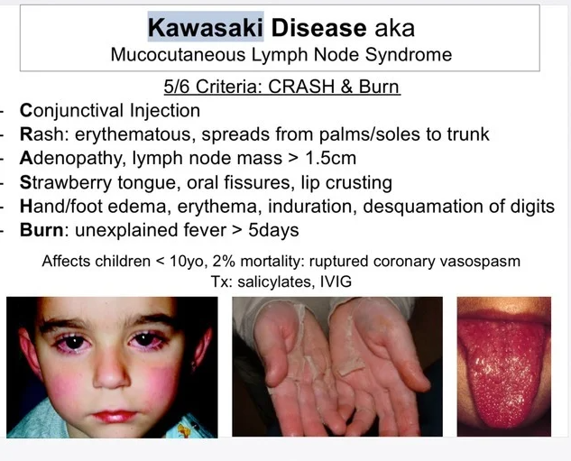
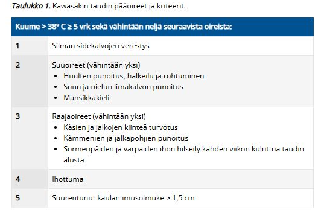
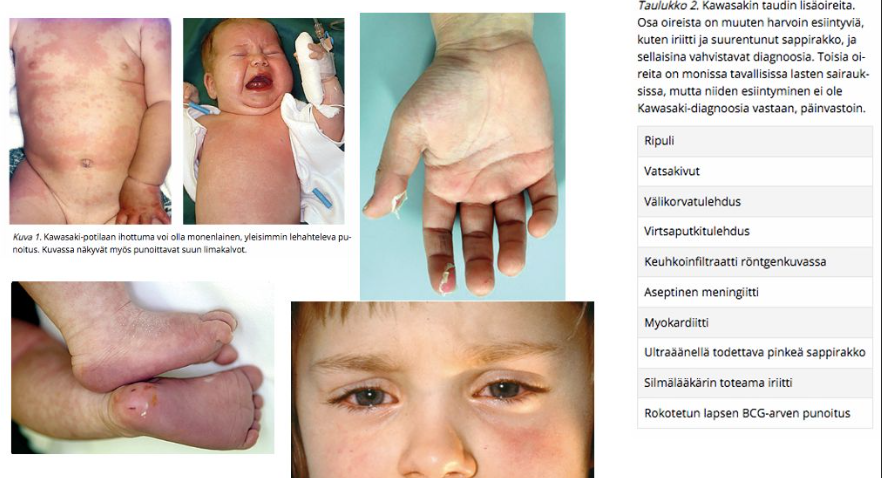
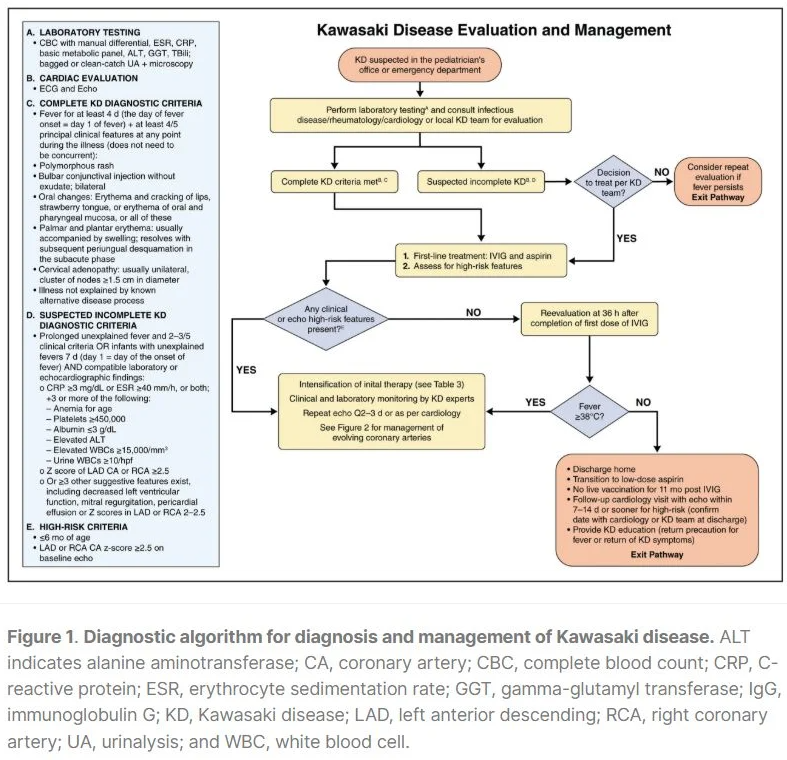

  

### Monivalinnat 

#### Voiko keliakia aiheuttaa yökastelua? {#Keliakia-yokastelu}

  <button class="solution-button"
          data-label="Vastaus"
          data-hide-label="Piilota vastaus">
    Vastaus
  </button>
  

      Kyllä

Keliakia ei ole yökastelun tyypillinen tai edes yleinen aiheuttaja, mutta voi joskus olla yhteydessä siihen epäsuorasti. Pelkkä yökastelu ilman muita oireita on erittäin harvoin merkki keliakiasta. 

---

Keliakia mielletään usein ripulitautina, mutta lapsilla se voi ilmetä myös kroonisena ummetuksena. Suoleen kertyvä ulostemassa painaa virtsarakkoa, pienentää sen toiminnallista tilavuutta ja ärsyttää rakon seinämän hermopäätteitä, mikä on yksi tunnetuimmista lapsuusiän yökastelun pahentajista ja altistajista. Keliakian aiheuttama inflammaatio voi myös hieman ärsyttää ympäröiviä rakenteita ja siten johtaa urologisiin oireisiin. Merkittävät imeytymishäiriöt voivat myös joskus häiritä hermotoimintaa ja siten rakon kontrolloimisen häiriöitä. 

  

#### Onko taaperon reisimurtuma todennäköisesti pahoinpitely? {#Taapero-reisimurtuma}

  <button class="solution-button"
          data-label="Vastaus"
          data-hide-label="Piilota vastaus">
    Vastaus
  </button>
  

      Ei

Taapero on 1–3-vuotias lapsi, joka on siirtynyt vauvaiästä itsenäisempään elämänvaiheeseen.

Kävelevällä taaperolla reisimurtuma on tilastollisesti useimmiten tapaturmainen, kun taas liikkumattomalla imeväisikäisellä (< 1 v) se on vahva pahoinpitelyepäily. Epäily voi tietysti syntyä iästä riippumatta, jos anamneesin ja vamman välillä on ristiriitaa tai on viive hoitoon hakeutumisessa. 

  

#### Voidaanko koliikki diagnosoida ilman laboratoriokokeita? 

  <button class="solution-button"
          data-label="Vastaus"
          data-hide-label="Piilota vastaus">
    Vastaus
  </button>
  

      Kyllä

Koliikilla (nykyään uusi termi Rome V-uudistuksen myötä on infant distress syndrome) tarkoitetaan **pienellä imeväisellä esiintyvää toistuvaa tai pitkittynyttä itkuisuutta, kitinää ja ärtyisyyttä.** Oireisiin ei ole selvää syytä eikä niitä pysty estämään tai helpottamaan. Ne _alkavat yleensä ensi elinviikkoina ja helpottavat 5 kuukauden ikään mennessä._ Lapsi kasvaa normaalisti ja todetaan tutkittaessa terveeksi. 

<li>Vaikka koliikin syytä ei tiedetä, koliikkilapsilla on havaittu vähemmän itkeviin lapsiin verrattuna muutoksia suolistomikrobistossa.</li>

---

**Diagnostiikka:**

Itkuisen vauvan erotusdiagnostiikka perustuu pääasiassa **anamneesiin ja kliiniseen tutkimukseen;** näillä voidaan suurella luotettavuudella poissulkea vakavat sairaudet ilman laboratorio- tai kuvantamistutkimuksia kuumeettomalla itkuisella imeväisellä. Joskus tarvitaan 1–2 viikon seuranta-aika, jotta itkun luonne selviää.

<li>Milloin itkuisuus alkoi ja miten paljon vauva itkee vuorokaudessa?</li>
  <ul>
    <li>Itku alkaa lisääntyä 2–3 viikon iässä ja on suurimmillaan toisen elinkuukauden aikana (keskosilla keskosuuden mukaan korjatussa iässä), jolloin vauvat itkevät keskimäärin n. 2 tuntia päivässä. Koliikki-itku vähenee 5 kk:n ikään mennessä.</li>
    <li>Kliinisessä työssä itkun kokonaismäärällä ei enää ole merkitystä koliikkidiagnoosin kannalta, koska vanhempia rasittaa nimenomaan lapsen selittämätön itku, jota ei saada tyynnytettyä. Itkumäärissä esiintyy suurta yksilöiden välistä vaihtelua sekä samalla lapsella myös päivittäistä vaihtelua. Määritelmästä riippuen vauvoista 5–20 % on koliikkivauvoja.</li>
  </ul>
<li>Millaista itku on laadultaan?</li>
  <ul>
    <li>Suurin osa vauvojen itkusta on tyytymätöntä ääntelyä, jossa on taukoja (”kitinää”, engl. fussing). Vain osa itkusta on yhtäjaksoista ja yleensä pieni osa voimakasta, kohtausmaista ”suoraa huutoa”, joka ei lopu syliin ottamisella tai syöttämisellä ja jota kutsutaan myös koliikki-itkuksi. Suurella osalla vauvoista esiintyy jonkin verran myös näitä voimakkaita itkukohtauksia 1–3 kk:n iässä.</li>
  </ul>
<li>Itkeekö vauva tiettynä vuorokauden aikana vai jatkuvasti?</li>
  <ul>
    <li>Itkuisuus toistuu usein samaan vuorokauden aikaan, yleensä _varsinkin iltaisin,_ mutta voi esiintyä mihin vuorokauden aikaan tahansa, ja vauva on muina aikoina tyytyväinen</li>
  </ul>
<li>Mitä ruokaa vauva saa? Kasvaako vauva normaalisti?</li>
  <ul>
    <li>Koliikkilapsi kasvaa normaalisti</li>
    <li>Itkuisuus on yhtä yleistä rintaruokituilla ja äidinmaidonkorviketta saavilla lapsilla</li>
  </ul>
<li>Mitä hoitokeinoja vanhemmat ovat kokeilleet?</li>
<li>Onko vauvalla akuuttiin infektioon viittaavia löydöksiä/oireita? Akuuttiin suolistosairauteen viittaavia oireita?</li>
  <ul>
    <li>Onko kuumetta? Yleistilaltaan sairas? Hengitysvaikeutta? Nuhaa, yskää, rohinaa?</li>
    <li>Imeväisen suolitukoksen syitä ovat mm. pylorusstenoosi (paino ei nouse, kaarimaiset oksennukset), suolen stenoosit/atresiat/volvulus, kuroutunut nivustyrä, Hirschsprungin tauti (ummetus, pömppö vatsa).</li>
    <li>Usein itkuisuuden takia vastaanotolle tuotu vauva on vastaanottotilanteessa hyväkuntoinen ja tyytyväinen, jolloin vaikeat akuutit sairaudet on helppo poissulkea</li>
  </ul>
<li>Onko lapsella nälkä ja auttaako ruokkiminen itkuisuuteen; onko imetyksen kanssa ongelmia?</li>
  <ul>
    <li>Jos itkun taustalla on rintamaidon vähentyminen, lisämaidon antaminen auttaa. Koliikki-itkuun lisämaidon antaminen ei auta</li>
    <li>Imetystekniikan (mm. imuote rinnasta, syömisasento) ja ruokarytmin tarkistaminen sekä oikean tekniikan ohjaus voivat ongelmatilanteissa vähentää itkua</li>
  </ul>
<li>Onko lapsella lehmänmaitoallergia?</li>
  <ul>
    <li>Liittyykö itkuisuus äidinmaidonkorvikkeen käytön aloittamiseen?</li>
    <li>Onko lapsella suolioireita, kuten oksentelua, ripulia tai huonoa painonnousua? Onko vauvalla atooppista ihottumaa? Onko perheessä allergisia sairauksia?</li>
    <li>Lehmänmaitoallergia 3 on harvinainen sairaus (2 %) verrattuna koliikkiin. Lehmänmaitoallergiaan viittaavat suoli- tai iho-oireet, oireiden yhteys äidinmaidonkorvikkeen antamiseen ja perheen allergiset sairaudet?</li>
    <li>Lehmänmaitoallergiaepäilyssä aloitetaan 1–2 viikon kokeilu hydrolysoidulla erityiskorvikkeella. Ruokavaliokokeilua on käytettävä harkiten ja huolehdittava sen purkamisesta, jollei saada selvää vastetta. Uusi altistus lehmänmaidolle kuuluu joka tapauksessa lehmänmaitoallergian diagnostiikkaan</li>
  </ul>
<li>Kattava status</li>

---

_Diagnostiset kriteerit (Rooma IV) ovat seuraavat:_

<li>Lapsi on alle 5 kk:n ikäinen oireiden alkaessa ja loppuessa</li>
<li>Lapsen hoitaja raportoi toistuvia ja pitkittyneitä itku-, kitinä- ja ärtyneisyyskohtauksia</li>
<li>Kohtauksiin ei ole selkeää syytä, eikä niitä voi ehkäistä tai lopettaa</li>
<li>Ei viitteitä kehitysviiveestä, kuumeesta tai muusta sairaudesta</li>

---

**Hoito:**

<li>Koliikin hoidossa keskeistä on vanhempien rauhoittaminen, tukeminen sekä oireen vaarattomuudesta ja ohimenevyydestä kertominen. Huoltajalla on oltava mahdollisuus saada tarvittaessa helposti yhteys esim. lastenneuvolan terveydenhoitajaan lisätuen saamiseksi. Koliikkilapsella on suurentunut kaltoinkohtelun riski, joten vaikeaoireinen lapsi on otettava sairaalaan, jos uupuneiden vanhempien voimavarat uhkaavat loppua.</li>
<li>Koliikki-itkun määrä vähenee kehityksen myötä vanhempien vauvanhoitotavasta riippumatta. Vanhemmille on tärkeä tieto, että erilaisilla hoitotavoilla on omat etunsa eikä ole yhtä ”oikeaa” hoitotapaa. Vanhemmat eivät siis tee mitään haittaa vauvalleen pitämällä vauvaa paljon sylissä tai nukuttamalla vauvaa vanhempien vieressä tai toisaalta antamalla vauvan joskus itkeä.</li>
<li>Protonipumpunestäjistä ei ole osoitettu olevan apua itkuisen lapsen hoidossa, mutta **Lactobacillus reuteri DSM 17938 -probioottilisän** on osoitettu vähentävän päivittäisen koliikkioireilun määrää rintaruokitulla lapsella (ainakin puolisen tuntia) -> kokeilua kannattaa suositella. Vasteen saaminen kestää muutaman viikon ajan. Muilla probiooteilla tai korvikeruokituilla lapsilla vastaavaa tehoa ei ole osoitettu.</li>
<li>Varmista, että lapsi saa D-vitamiinilisän (jota vanhemmat virheellisesti voivat luulla itkuisuuden syyksi, koska itkuisuus yleensä alkaa D-vitamiinitippojen aloitusiässä).</li>
<li>Järjestä perheelle jatkokontakti (käynti tai puhelu) vauvan itkuisuuden seuraamiseksi. Jos lapselle ilmaantuu uusia oireita tai itkuisuus ei vähene iänmukaisella tavalla, arvioi uudestaan, onko taustalla jokin somaattinen syy. Vanhemmat tarvitsevat toistuvaa tukea ja varmistusta sille, että lapsi on terve. Koliikkivauvat saavat tarpeeksi unta vanhempien epäilyistä huolimatta. Lapsen hyvä ennuste rohkaisee ja auttaa vanhempia jaksamaan koliikki-iän yli.</li>

  

#### Laktoosirasituskoe

Ei tarkempaa kysymyksenasettelua. Mikä laktoosirasituskoe käytännössä on? Onko se laktoosi-intoleranssin ensisijainen tutkimus? 

  <button class="solution-button"
          data-label="Vastaus"
          data-hide-label="Piilota vastaus">
    Vastaus
  </button>
  

      

Laktoosirasituskoe on ollut aikaisemmin yleisesti käytetty laktoosi-intoleranssin todentamismenetelmä, mutta sen **käyttö on vähentynyt merkittävästi** ja jopa poistunut monien laboratorioiden tutkimusvalikoimasta. 

Testi perustuu veren glukoosipitoisuuden muutokseen. Ennen testiä potilaan tulee olla paastossa vähintään 10 tuntia, jolloin ensimmäisellä verensokerin mittauksella saadaan paastoarvo. Testattava nauttii 50 g:n annoksen laktoosia, minkä jälkeen glukoosipitoisuudet määritetään 20 minuutin välein yhden tunnin ajan. Alle 1,1 mmol/l pitoisuuden nousu indikoi laktoosi-intoleranssia, sillä laktoosin pilkkoutuessa veren glukoosipitoisuuden tulisi nousta yli tämän arvon. 

Rasituskokeen herkkyys ja spesifisyys ovat yli 75 % ja kokeen suoritusaika suhteellisen lyhyt. Laktoosirasituskoetta on kuitenkin kritisoitu sen annostuksesta, sillä 50 g:n annos laktoosia ylittää normaalin laktoosin saannin rajan ja aiheuttaa oireita joillekin, jotka eivät niitä normaalikäytöllä saa. Monet potilaat myös kokevat menetelmän epämiellyttävänä. Verensokerin nousuun vaikuttavat laktoosin pilkkoutumisen lisäksi potilaan hormonitoiminta sekä mahalaukun tyhjenemisnopeus, jotka voivat aiheuttaa virheellisiä tuloksia. Glukoosipitoisuuden muutoksen lisäksi on tärkeää seurata potilaalle laktoosirasituksesta syntyviä oireita, sillä ne voivat antaa vihjeen testin mahdollisesta epäonnistumisesta tai tarjota lääkärille tärkeää tietoa potilaan oirekuvasta.

Laktoosirasituskoe ei sovellu kaikille. Diabeetikoilla menetelmä on epäluotettava, sillä veren glukoosipitoisuus voi nousta yli viitearvojen, vaikkei laktoosi pilkkoutuisikaan. Lapsilla taas mahalaukku tyhjenee usein hitaasti verrattuna aikuisiin ja suoleen joutuva laktoosimäärä voi jäädä pieneksi. Toisaalta joillain henkilöillä, eritoten lapsilla, glukoosi imeytyy verestä soluihin erityisen nopeasti ja 20 minuutin mittausväli on riittämätön havainnoimaan nopeita glukoosipitoisuuden nousuja. Näistä seikoista johtuen jopa 30 % lasten positiivisista laktoosirasituskokeen tuloksista on virheellisiä.

---

**Nykyään ensisijainen diagnostinen tutkimus on laktoosin välttämis(+altistus)koe ja tarvittaessa poissulussa geenitesti.** Yksi laktoosi-intoleranssin todentamismenetelmistä on myös hengitystesti,
mutta Suomessa se ei ole yleisessä kliinisessä käytössä. 

  

#### Ovatko motiliteettiä lisäävät ummetuslääkkeet ensisijaisia lasten ummetuksen hoidossa? {#Motiliteettia-lisaavat-ummetuslaakkeet}

  <button class="solution-button"
          data-label="Vastaus"
          data-hide-label="Piilota vastaus">
    Vastaus
  </button>
  

      Ei

Ensisijaisia lääkkeitä ovat **osmoottiset ummetuslääkkeet, joista yleisimmin käytetty on makrogoli** (esim. Pegorion; yleensä >6kk), joskus laktuloosi (kaikenikäisillä). Makrogoli pehmentää ulostetta tehokkaammin ja säännöllistää suolen toimintaa nopeammin kuin laktuloosi -> yleensä makrogoli ensisijainen.

_Suolta stimuloivia lääkkeitä käytetään tarvittaessa vain lyhytaikaisesti._

  

#### Esiintyykö toiminnallista ummetusta imeväisikäisillä? {#Toiminnallinen-ummetus-imevaisella}

  <button class="solution-button"
          data-label="Vastaus"
          data-hide-label="Piilota vastaus">
    Vastaus
  </button>
  

      Kyllä

Kyllä esiintyy, mutta se on **imeväisikäisillä (alle 1-vuotiailla) huomattavasti harvinaisempaa kuin leikki- ja kouluikäisillä.**

Ummetus alkaa usein taaperoikäisenä paksusuolen fysiologisen toiminnan hidastuessa. _Täysimetetyn ja hyvinvoivan vauvan harvoin tapahtuva ulostaminen ei ole ummetusta (muista: täysimetetty voi ulostaa 10krt päivässä - kerran 10 päivässä)._ Kuitenkin ummetusta voi imetetyilläkin esiintyä, varsinkin siirtymävaiheissa (esim. äidinmaidonkorvikkeen aloitus tai kiinteiden ruokien aloitus). 
  

## 2023 

### Pienellä lapsella influenssapikatesti positiivinen - todnäk taudinaiheuttajat, hoito ja sen hyöty {#Influenssapikatesti}

  <button class="solution-button"
          data-label="Vastaus"
          data-hide-label="Piilota vastaus">
    Vastaus
  </button>
  

      
Influenssa on yleisnimi influenssa A-, B- tai C-virusten aiheuttamille akuuteille infektioille. A on yleisin ja aiheuttaa yleensä vakavimmat epidemiat. B aiheuttaa yleensä A-tyyppiä lievemmän taudin. Influenssa C aiheuttaa yleensä vain lievän hengitystieinfektion eikä aiheuta epidemioita. 

**Pikatesti tunnistaa vain A- tai B-influenssan.**

Tietysti voi myös olla jokin sekundaarinen bakteeri-infektio, joille influenssa altistaa. 

---

Influenssan hoidon perusta on aina oireenmukainen hoito eli kuume- ja kipulääkitys sekä ravinnosta ja nesteytyksestä huolehtiminen. Influenssa on kuitenkin ainoa flunssaviruksista, johon on spesifinen lääkehoito. **Ensisijaisesti käytetään siis oseltamiviiriä, jota suositellaan aloitettavan varsinkin vaikeaoiresemmille, jos oireiden alusta on kulunut alle 48 tuntia (ja mahdollisesti myöhemminkin, jos sairaalahoitoa vaativa tai muuten perussairas)**

Oseltamiviirin tehon kannalta ratkaisevaa on siis lääkityksen aloituksen nopeus. **Lääke lyhentää taudin kestoa 1–2 vuorokaudella, kun hoito aloitetaan 48 tunnin kuluessa influenssan oireiden alusta.** Kuitenkin jos oseltamiviirihoito aloitetaan jo 24 tunnin kuluessa oireiden alusta, sairauden kesto influenssa A -lapsilla lyhenee noin 4 vuorokautta. **Nopeasti aloitetulla influenssalääkityksellä voidaan vähentää myös influenssan aiheuttamia komplikaatioita.** Mikäli oseltamiviirihoito päästään aloittamaan 12 tunnin kuluessa kuumeen noususta, se vähentää influenssan komplikaationa ilmaantuvia pikkulasten välikorvatulehduksia noin 80 %:lla.

Oseltamiviiri otetaan suun kautta joko liuoksena tai kapseleina, ja se on indisoitu kaikenikäisille potilaille; aikuisille 75 mg × 2/vrk × 5 vrk, lapsille myös oraalisuspensio painon mukaan. Lääke on muuten hyvin siedetty, mutta lievää pahoinvointia tai oksentelua esiintyy hoidon alussa 5–10 %:lla potilaista. Tsanamiviiri annostellaan inhaloimalla suoraan hengitysteihin, ja se on yleisesti indisoitu 5 vuoden iästä alkaen. Tsanamiviiria on saatavilla myös i.v. annosteltavana valmisteena.

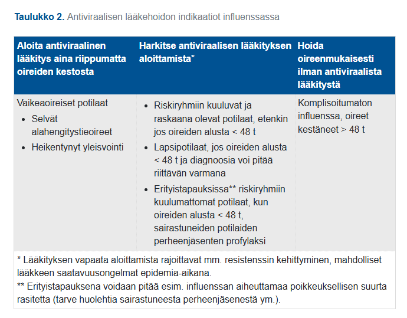
  

### 3 kuukautinen vauva, viime aikoina lisääntynyttä itkuisuutta jopa monta tuntia putkeen, kliinisessä tutkimuksessa yt hyvä, statuksessa ei poikkeavaa, kehitys normaalia - erotusdg, todnäk syy ja työdiagnoosi, miten hoidat? {#Itkuisuutta-3kk}

  <button class="solution-button"
          data-label="Vastaus"
          data-hide-label="Piilota vastaus">
    Vastaus
  </button>
  

Todennäköisesti kyseessä on koliikki (nykyään uusi termi Rome V-uudistuksen myötä on infant distress syndrome), jolla tarkoitetaan **pienellä imeväisellä esiintyvää toistuvaa tai pitkittynyttä itkuisuutta, kitinää ja ärtyisyyttä.** Oireisiin ei ole selvää syytä eikä niitä pysty estämään tai helpottamaan. Ne _alkavat yleensä ensi elinviikkoina ja helpottavat 5 kuukauden ikään mennessä._ Lapsi kasvaa normaalisti ja todetaan tutkittaessa terveeksi. Vaikka koliikin syytä ei tiedetä, koliikkilapsilla on havaittu vähemmän itkeviin lapsiin verrattuna muutoksia suolistomikrobistossa.

_Vaikka itku kuuluukin vauvan normaaliin kehitykseen 3 ensimmäisen elinkuukauden aikana, on tärkeää erottaa normaali vauvaiän itku sairauden aiheuttamasta itkusta (esim. infektiot, lehmänmaitoallergia, akuutit kirurgiset sairaudet, harvinaisesti rytmihäiriö (SVT), sarveiskalvon naarmu (lapsi itse raapaissut silmäänsä...))._ Ensimmäisten elinkuukausien aikana esiintyvä itkuisuus on hyvin harvoin oire refluksitaudista. Hoitokokeilua happosalpaajilla ei suositella, koska niiden teho itkuisten imeväisten hoidossa ei ole lumelääkettä parempi.

---

**Diagnostiikka:**

**Itkuisen vauvan erotusdiagnostiikka perustuu pääasiassa anamneesiin ja kliiniseen tutkimukseen;** näillä voidaan suurella luotettavuudella poissulkea vakavat sairaudet ilman laboratorio- tai kuvantamistutkimuksia kuumeettomalla itkuisella imeväisellä. Joskus tarvitaan 1–2 viikon seuranta-aika, jotta itkun luonne selviää.

<li>Milloin itkuisuus alkoi ja miten paljon vauva itkee vuorokaudessa?</li>
  <ul>
    <li>Itku alkaa lisääntyä 2–3 viikon iässä ja on suurimmillaan toisen elinkuukauden aikana (keskosilla keskosuuden mukaan korjatussa iässä), jolloin vauvat itkevät keskimäärin n. 2 tuntia päivässä. Koliikki-itku vähenee 5 kk:n ikään mennessä.</li>
    <li>Kliinisessä työssä itkun kokonaismäärällä ei enää ole merkitystä koliikkidiagnoosin kannalta, koska vanhempia rasittaa nimenomaan lapsen selittämätön itku, jota ei saada tyynnytettyä. Itkumäärissä esiintyy suurta yksilöiden välistä vaihtelua sekä samalla lapsella myös päivittäistä vaihtelua. Määritelmästä riippuen vauvoista 5–20 % on koliikkivauvoja.</li>
  </ul>
<li>Millaista itku on laadultaan?</li>
  <ul>
    <li>Suurin osa vauvojen itkusta on tyytymätöntä ääntelyä, jossa on taukoja (”kitinää”, engl. fussing). Vain osa itkusta on yhtäjaksoista ja yleensä pieni osa voimakasta, kohtausmaista ”suoraa huutoa”, joka ei lopu syliin ottamisella tai syöttämisellä ja jota kutsutaan myös koliikki-itkuksi. Suurella osalla vauvoista esiintyy jonkin verran myös näitä voimakkaita itkukohtauksia 1–3 kk:n iässä.</li>
  </ul>
<li>Itkeekö vauva tiettynä vuorokauden aikana vai jatkuvasti?</li>
  <ul>
    <li>Itkuisuus toistuu usein samaan vuorokauden aikaan, yleensä _varsinkin iltaisin,_ mutta voi esiintyä mihin vuorokauden aikaan tahansa, ja vauva on muina aikoina tyytyväinen</li>
  </ul>
<li>Mitä ruokaa vauva saa? Kasvaako vauva normaalisti?</li>
  <ul>
    <li>Koliikkilapsi kasvaa normaalisti</li>
    <li>Itkuisuus on yhtä yleistä rintaruokituilla ja äidinmaidonkorviketta saavilla lapsilla</li>
  </ul>
<li>Mitä hoitokeinoja vanhemmat ovat kokeilleet?</li>
<li>Onko vauvalla akuuttiin infektioon viittaavia löydöksiä/oireita? Akuuttiin suolistosairauteen viittaavia oireita?</li>
  <ul>
    <li>Onko kuumetta? Yleistilaltaan sairas? Hengitysvaikeutta? Nuhaa, yskää, rohinaa?</li>
    <li>Imeväisen suolitukoksen syitä ovat mm. pylorusstenoosi (paino ei nouse, kaarimaiset oksennukset), suolen stenoosit/atresiat/volvulus, kuroutunut nivustyrä, Hirschsprungin tauti (ummetus, pömppö vatsa).</li>
    <li>Usein itkuisuuden takia vastaanotolle tuotu vauva on vastaanottotilanteessa hyväkuntoinen ja tyytyväinen, jolloin vaikeat akuutit sairaudet on helppo poissulkea</li>
  </ul>
<li>Onko lapsella nälkä ja auttaako ruokkiminen itkuisuuteen; onko imetyksen kanssa ongelmia?</li>
  <ul>
    <li>Jos itkun taustalla on rintamaidon vähentyminen, lisämaidon antaminen auttaa. Koliikki-itkuun lisämaidon antaminen ei auta</li>
    <li>Imetystekniikan (mm. imuote rinnasta, syömisasento) ja ruokarytmin tarkistaminen sekä oikean tekniikan ohjaus voivat ongelmatilanteissa vähentää itkua</li>
  </ul>
<li>Onko lapsella lehmänmaitoallergia?</li>
  <ul>
    <li>Liittyykö itkuisuus äidinmaidonkorvikkeen käytön aloittamiseen?</li>
    <li>Onko lapsella suolioireita, kuten oksentelua, ripulia tai huonoa painonnousua? Onko vauvalla atooppista ihottumaa? Onko perheessä allergisia sairauksia?</li>
    <li>Lehmänmaitoallergia 3 on harvinainen sairaus (2 %) verrattuna koliikkiin. Lehmänmaitoallergiaan viittaavat suoli- tai iho-oireet, oireiden yhteys äidinmaidonkorvikkeen antamiseen ja perheen allergiset sairaudet?</li>
    <li>Lehmänmaitoallergiaepäilyssä aloitetaan 1–2 viikon kokeilu hydrolysoidulla erityiskorvikkeella. Ruokavaliokokeilua on käytettävä harkiten ja huolehdittava sen purkamisesta, jollei saada selvää vastetta. Uusi altistus lehmänmaidolle kuuluu joka tapauksessa lehmänmaitoallergian diagnostiikkaan</li>
  </ul>
<li>Kattava status</li>

---

_Diagnostiset kriteerit (Rooma IV) ovat seuraavat:_

<li>Lapsi on alle 5 kk:n ikäinen oireiden alkaessa ja loppuessa</li>
<li>Lapsen hoitaja raportoi toistuvia ja pitkittyneitä itku-, kitinä- ja ärtyneisyyskohtauksia</li>
<li>Kohtauksiin ei ole selkeää syytä, eikä niitä voi ehkäistä tai lopettaa</li>
<li>Ei viitteitä kehitysviiveestä, kuumeesta tai muusta sairaudesta</li>

---

**Hoito:**

<li>Koliikin hoidossa keskeistä on vanhempien rauhoittaminen, tukeminen sekä oireen vaarattomuudesta ja ohimenevyydestä kertominen. Huoltajalla on oltava mahdollisuus saada tarvittaessa helposti yhteys esim. lastenneuvolan terveydenhoitajaan lisätuen saamiseksi. Koliikkilapsella on suurentunut kaltoinkohtelun riski, joten vaikeaoireinen lapsi on otettava sairaalaan, jos uupuneiden vanhempien voimavarat uhkaavat loppua.</li>
<li>Koliikki-itkun määrä vähenee kehityksen myötä vanhempien vauvanhoitotavasta riippumatta. Vanhemmille on tärkeä tieto, että erilaisilla hoitotavoilla on omat etunsa eikä ole yhtä ”oikeaa” hoitotapaa. Vanhemmat eivät siis tee mitään haittaa vauvalleen pitämällä vauvaa paljon sylissä tai nukuttamalla vauvaa vanhempien vieressä tai toisaalta antamalla vauvan joskus itkeä.</li>
<li>Protonipumpunestäjistä ei ole osoitettu olevan apua itkuisen lapsen hoidossa, mutta **Lactobacillus reuteri DSM 17938 -probioottilisän** on osoitettu vähentävän päivittäisen koliikkioireilun määrää rintaruokitulla lapsella (ainakin puolisen tuntia) -> kokeilua kannattaa suositella. Vasteen saaminen kestää muutaman viikon ajan. Muilla probiooteilla tai korvikeruokituilla lapsilla vastaavaa tehoa ei ole osoitettu.</li>
<li>Varmista, että lapsi saa D-vitamiinilisän (jota vanhemmat virheellisesti voivat luulla itkuisuuden syyksi, koska itkuisuus yleensä alkaa D-vitamiinitippojen aloitusiässä).</li>
<li>Järjestä perheelle jatkokontakti (käynti tai puhelu) vauvan itkuisuuden seuraamiseksi. Jos lapselle ilmaantuu uusia oireita tai itkuisuus ei vähene iänmukaisella tavalla, arvioi uudestaan, onko taustalla jokin somaattinen syy. Vanhemmat tarvitsevat toistuvaa tukea ja varmistusta sille, että lapsi on terve. Koliikkivauvat saavat tarpeeksi unta vanhempien epäilyistä huolimatta. Lapsen hyvä ennuste rohkaisee ja auttaa vanhempia jaksamaan koliikki-iän yli.</li>

  

### Monivalinnat 

#### Laktoosi-intoleranssin tehokkain hoito

Ei vaihtoehtoja tai tarkempaa kysymyksenasettelua. Mikä on laktoosi-intoleranssin tehokkain hoito? 

  <button class="solution-button"
          data-label="Vastaus"
          data-hide-label="Piilota vastaus">
    Vastaus
  </button>
  

Hoitona on **laktoositon/vähälaktoosinen ruokavalio**

Primaarisessa hypolaktasiassa siedetyn laktoosin määrä vaihtelee. Suuri osa potilaista sietää pieniä tai kohtalaisia määriä laktoosia, minkä vuoksi he voivat käyttää vähälaktoosisia tuotteita (sisältävät alle 1%:n laktoosia eli noin 1/5 tavallisesta määrästä). Osa potilaista vaatii täysin laktoosittoman ruokavalion

Osa potilaista saattaa hyötyä laktaasikapseleista (sopivat tilapäiseen käyttöön) ja osa sietää hapanmaitotuotteita, joissa vähemmän laktoosia

---

Tietysti sekundaarisessa hypolaktasiassa (esim. keliakia, gastroenteriitti tai IBD...), on perussairauden hoito ensisijaista.  
  

#### Maitoallergian ennuste

Ei vastausvaihtoehtoja. Millainen on maitoallergian ennuste? 

  <button class="solution-button"
          data-label="Vastaus"
          data-hide-label="Piilota vastaus">
    Vastaus
  </button>
  

      
Maito-, kananmuna- ja vehnäallergian ennuste on hyvä, ja tyypillisesti lapsi toipuu leikki- tai kouluikään mennessä. Kaikkiaan maitoallergisista lapsista kaksivuotiaina on toipunut 50–70 %, nelivuotiaina 80 % ja kouluikään mennessä noin 90 %. 

Lapsen ruokavaliota pyritään laajentamaan kohti normaalia ja kasvua seurataan neuvolassa. Koska lapset toipuvat ruoka-allergioista suurimmassa osassa tapauksista leikki-ikään mennessä, pitäisi eliminoituja ruoka-aineita kokeilla ruokavaliossa säännöllisin väliajoin. Maitoa voidaan kokeilla pienestä määrästä lähtien kotona ensimmäisen kerran diagnoosin asettamisen jälkeen viimeistään puolentoista vuoden iässä, jos pääasiallinen oire on ollut esimerkiksi nokkosihottuma, ihon lehahtelu tai suolioireet. Mikäli ensioire on ollut anafylaksia tai nopeasti yleistynyt vaikeaksi tulkittava allergiareaktio, tehdään uusinta-altistukset erikoissairaanhoidossa. Ruokien palauttamista ruokavalioon voidaan ensimmäisen kolmen vuoden aikana kokeilla puolen vuoden välein ja tämän jälkeen noin kerran vuodessa.

---

Pähkinä- ja kala-allergiat eivät väisty yhtä usein kuin yllä mainitut maito-, kananmuna- ja vehnäallergiat. Vain. n. 20% lapsuusiässä todetusta varsinaisesta pähkinäallergiasta väistyy iän myötä. Kala-allergiat muistuttavat hyvin pitkälti pähkinäallergioita: ne ovat usein elinikäisiä. 

Jos lapsi saa pähkinästä (esimerkiksi hasselpähkinästä) vain lievää suun tai huulten kutinaa, kyseessä on usein koivun siitepölyyn liittyvä ristiallergia. Nämä oireet ovat vaarattomia, mutta nekin ovat luonteeltaan pysyviä ristireaktioita, eivät niinkään "ohimeneviä vauvaiän allergioita". 

  

#### Onko otiitin hoidossa kivunhoito tärkeintä? {#AOM-kipu}

  <button class="solution-button"
          data-label="Vastaus"
          data-hide-label="Piilota vastaus">
    Vastaus
  </button>
  

      Kyllä

**Hoitoon kuuluu käytännössä aina kipulääke, jo epäiltäessäkin.** Antibioottia ei aina tarvita, mutta sinänsä tulehdus suositellaan hoidettavaksi pääsääntöisesti antibiootilla aina jos äkillisen välikorvatulehduksen diagnoosi on varma; arvioidaan kuitenkin lääkityksen haitat ja otetaan huomioon myös perheen toiveet. **On esitetty, että ainakin alle 2 vuoden ikä, molemminpuolinen tulehdus ja vuoto tärykalvolta puoltaisivat antibioottihoidon aloitusta.** 

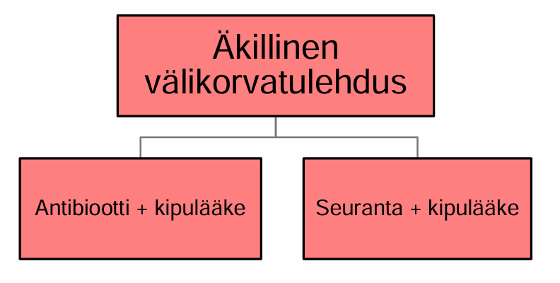
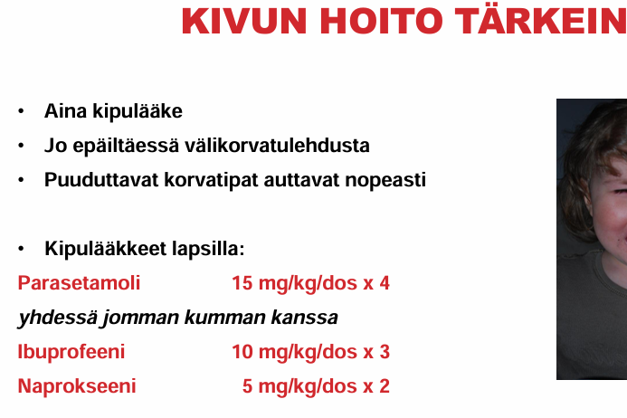
  

#### Makrogolin käyttö lapsilla {#Makrogoli-lapsilla}

Ei vaihtoehtoja. Vastaa näihin: Aiheuttaako pitkäaikainen käyttö lapsilla riippuvuutta tai kehittyykö hoitoresistenssiä? Minkä ikäisillä saa käyttää? 

  <button class="solution-button"
          data-label="Vastaus"
          data-hide-label="Piilota vastaus">
    Vastaus
  </button>
  

Ei aiheuta riippuvuutta tai suolen toiminnan laiskistumista pitkäaikaisessakaan käytössä. 

Vaikka monien kaupallisten valmisteiden pakkausselosteissa ikäraja saattaa olla 6 kk, makrogolia kyllä käytetään lastenlääkärin ohjauksessa turvallisesti myös alle 6-kuukautisilla.
  

#### Milloin kasvunopeus cm/v suurimmillaan

Ei vaihtoehtoja, mieti vastaus.

  <button class="solution-button"
          data-label="Vastaus"
          data-hide-label="Piilota vastaus">
    Vastaus
  </button>
  

Kasvunopeus on nopeimmillaan ensimmäisen elinvuoden aikana (keskimäärin n. +25cm). 

  

#### Akuutin otiitin ensisijainen hoito

Ei vaihtoehtoja. Äsken jo käytiin läpi, että kipulääke kuuluu käytännössä aina hoitoon. Mikä on ensisijainen antibiootti, jota käytetään? Hoitoaika?

  <button class="solution-button"
          data-label="Vastaus"
          data-hide-label="Piilota vastaus">
    Vastaus
  </button>
  

Ensisijainen antibioottivalinta äkillisen välikorvatulehduksen (AOM) hoidossa on yleensä **p.o. amoksisilliini (40 mg/kg/vrk) tai amoksisilliini-klavulaanihappo (40/5,7 mg/kg/vrk) (2 tai) 3 annokseen jaettuna. Hoitoaika 5-7vrk.** Antibiootin valinnassa tulee ottaa huomioon lapsen kokonaistilanne sekä lääkkeen haittavaikutusprofiili ja alueellinen aiheuttajabakteerien herkkyystilanne. Penisilliinille allergisille lapsille voidaan käyttää kefakloria, kefuroksiimiaksetiilia, sulfa-trimetopriimia, atsitromysiiniä tai klaritromysiiniä. 

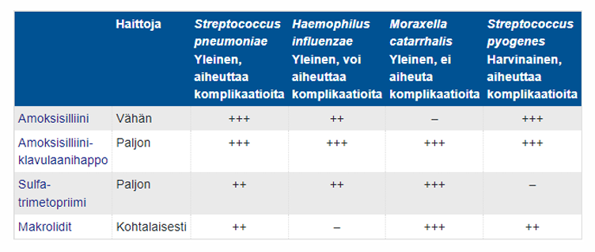
  

#### Kananmuna-allergia ja MPR-rokote 

Ei vaihtoehtoja tai tarkempaa kysymyksenasettelua. Vaikuttaako kananmuna-allergia MPR-rokotteen ottamiseen? Entä muihin rokotteisiin? 

  <button class="solution-button"
          data-label="Vastaus"
          data-hide-label="Piilota vastaus">
    Vastaus
  </button>
  

Useimmiten kanamunalle allerginen voidaan rokottaa aivan normaalisti. On mahdollista, että kanamunalle allergiset saavat jonkinasteisia oireita alla olevista rokotteista. 

<li>Hedelmöitetyissä kananmunissa valmistetut rokotteet</li>
  <ul>
    <li>Pistettävät ja nenäsumutteena annettavat influenssarokotteet</li>
    <li>Keltakuumerokote</li>
  </ul>
<li>Kanan alkion ihosoluissa valmistetut rokotteet</li>
  <ul>
    <li>MPR-rokotteen tuhkarokko- ja sikotautikomponentit</li>
    <li>Puutiaisaivotulehdus- eli TBE-rokotteet</li>
  </ul>

----

**Kaikki nämä rokotteet voidaan kuitenkin yleensä antaa kananmunalle allergiselle henkilölle aivan normaalisti.** Myös anafylaktisen reaktion kananmunasta tai kananmunaa sisältäneestä elintarvikkeesta saanut voidaan tutkimustiedon ja kokemusten mukaan rokottaa. Valmistustavan rokotteet eivät sisällä merkittäviä määriä kananmunan proteiinia, ovalbumiinia. 

Ovalbumiinille tai ovomukoidille voimakkaasti allerginen henkilö rokotetaan influenssa- ja keltakuumerokotteiden suhteen poliklinikkaolosuhteissa esimerkiksi terveyskeskuksessa. Henkilöä, jolle on tullut todennettu anafylaktinen reaktio kananmunan nauttimisen jälkeen, seurataan 1(–2) tuntia influenssarokotuksen jälkeen.
  

#### Tiomersaali

Ei vaihtoehtoja. Mitä tiomersaali on? Onko se vaarallista? Onko sitä rokotteissa? 

  <button class="solution-button"
          data-label="Vastaus"
          data-hide-label="Piilota vastaus">
    Vastaus
  </button>
  

Elohopeajohdannaisia ei enää käytetä Suomessa lapsille annettavissa rokotteissa. Aikaisemmin käytettiin tiomersaalia, joka on etyylielohopeapohjainen yhdiste, jota on historiallisesti käytetty säilöntäaineena moniannosrokepakkauksissa estämään bakteerien ja sienten kasvua.

Tiomersaalia sisältävät rokotteet poistuivat Suomen kansallisesta rokotusohjelmasta lähes kokonaan vuosien 2004–2005 vaihteessa. Nykyisin valtaosa rokotteista toimitetaan kerta-annosruiskuissa tai -ampulleissa, joissa säilöntäaineita ei tarvita lainkaan.

Tiomersaali sisältää etyylielohopeaa, joka poistuu elimistöstä huomattavasti nopeammin kuin kalojen sisältämä metyylielohopea eikä se kerry elimistöön. Laajoissa kansainvälisissä tutkimuksissa ei ole löydetty näyttöä siitä, että rokotteiden sisältämällä tiomersaalilla olisi yhteyttä esimerkiksi autismiin tai muihin neurologisiin häiriöihin. Varmuuden vuoksi ja kansallista luottamusta kohottaakseen aineesta on kuitenkin pääosin luovuttu tai sitä käytetään vain poikkeuksellisissa erityisrokotteissa (kuten tietyissä harvinaisissa matkailija- tai varautumisrokotteissa)

---

Muita aineita rokotteissa: alumiinijohdannaisia <0.5mg/ annos (alumiinia on luonnostaan maaperässä, ilmassa, juomavedessä ja äidinmaidossa; vauva saa ravinnostaan moninkertaisesti enemmän alumiinia kuin mitä rokotteissa on) ja formaldehydiä jäämiä (häviävän pieniä määriä; ihmisen oma aineenvaihdunta tuottaa jatkuvasti formaldehydiä, ja esimerkiksi yhdessä hedelmässä (kuten päärynässä) sitä on kymmeniä kertoja enemmän kuin yhdessä rokoteannoksessa). 

  

#### DTaP-IPV-HIb

Ei vaihtoehtoja. Mikä tästä rokotteesta yleisimmin käytetty nimi on? Mitä taudinaiheuttajia vastaan se rokottaa? Missä aikataulussa annetaan kansallisessa rokotusohjelmassa?

  <button class="solution-button"
          data-label="Vastaus"
          data-hide-label="Piilota vastaus">
    Vastaus
  </button>
  

DTaP-IPV-HIb eli ns. viitosrokote on yhdistelmärokote, jota annetaan perusrokotteena suojaamaan kurkkumädältä (difteria (toksoidirokote), Corynebacterium diphtheriae), jäykkäkouristukselta (tetanus (toksoidirokote), Clostridium tetani), hinkuyskältä (aP = asellulaarinen Pertussis-rokote; Bordetella pertussis), poliolta (IPV = inaktivoitu poliovirus) ja Hib-bakteerin (Haemophilus influeanze tyyppi B; esim. epiglottiitti ja meningiitti) aiheuttamilta vakavilta infektioilta. 

Annetaan 3kk+5kk+12kk iässä; 4v iässä annetaan ns. nelosrokote (DTaP-IPV) ja 14-15v dtap rokote (tämän tehoste vielä 25v iässä). 

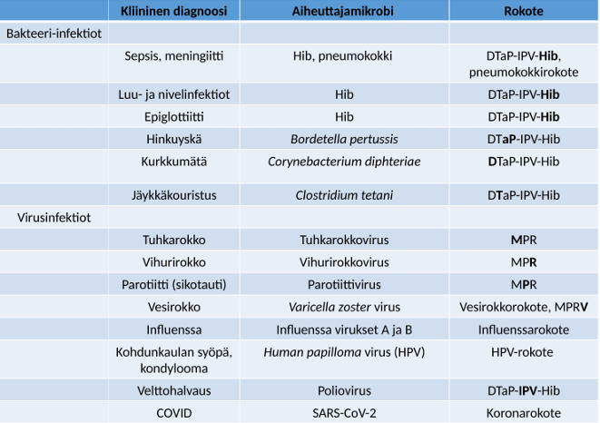
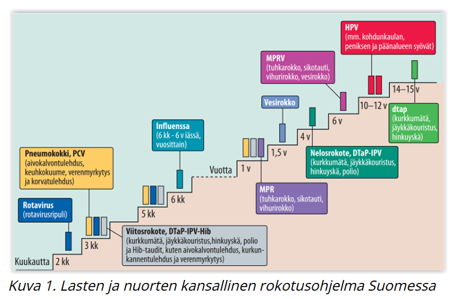

  

## 2022 

Ei uusia essee/potilastapauskysymyksiä, monivalinnatkin jo pääasiassa myöhempien vuosien tenttien yhteydessä käyty läpi yllä. 

### Monivalinnat 

#### Keskosen paino

Ei vaihtoehtoja. Mikä on keskosen määritelmä painon mukaan?

  <button class="solution-button"
          data-label="Vastaus"
          data-hide-label="Piilota vastaus">
    Vastaus
  </button>
  

Keskonen on termi, joka on ainakin aikaisemmin (vanhan arkkiatrin keksimänä) ollut nimitys **alle 2 500 g:n** painoisena syntyneelle vastasyntyneelle, mutta nykyään sillä tarkoitetaan useasti ennenaikaisesti syntyneitä vauvoja (ennen raskausviikkoa 37). 

Keskoset voidaan luokitella:

<li>pikkukeskosiin (pieni keskonen) = syntynyt ≤32+0 raskausviikolla tai syntymäpaino alle 1500 grammaa</li>
<li>pienen pieniin keskosiin (erittäin pienipainoinen keskonen) = syntymäpaino alle 1000 grammaa</li>

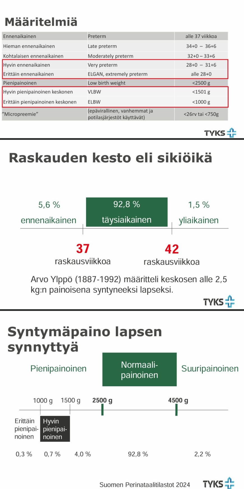
  

#### Mononukleoosi

Ei vaihtoehtoja. Mitkä ovat mononukleoosin tyypillisimmät aiheuttajat? Tyypillisin sairastumisikä? Oirekuva? Diagnostiikka? Hoito? 

  <button class="solution-button"
          data-label="Vastaus"
          data-hide-label="Piilota vastaus">
    Vastaus
  </button>
  

Mononukleoosin tyypillinen aiheuttaja on **Epstein-Barrin virus (EBV);** kannattaa kuitenkin muistaa, että myös _sytomegalovirus (CMV)_ voi aiheuttaa mononukleoosin taudinkuvan (yleensä EBV:hen verrattuna lievempi). Myös HIV-tartunnan ensioireiden mahdollisuus on syytä muistaa.

Käytännössä kaikki suomalaiset saavat EBV-tartunnan. **Länsimaissa n. puolet väestöstä sairastaa infektion 1–5 v:n iässä; tällöin yleensä on oireeton tai lieväoireinen. Toinen tartuntahuippu on 15–24-vuotiailla. Nuorilla aikuisilla tartunta johtaa pääsääntöisesti (70–80 %:lla) oireiseen mononukleoosiin.** Yli 30-vuotiailla infektio on harvinainen, mutta komplikaatioiden riski on suurempi.

Itämisaika on arviolta 30–50 vrk.

---

Yleisiin oireisiin kuuluvat korkea kuume, nasaalinen ääni, nielurisatulehdus ja imusolmukkeiden suureneminen (leukakulmat, leuanalus). N. joka 10:nnelle potilaalle kehittyy punapilkkuinen ihottuma.
Amoksisilliini-lääkitys tuoreessa EBV-infektiossa lisää eksanteeman todennäköisyyden n. kaksinkertaiseksi (ihoreaktiossa ei ole kyse allergiasta, eikä se estä amoksisilliinin käyttöä jatkossa). 

Perna voidaan kaikututkimuksella todeta suurentuneeksi lähes kaikilla, palpoiden vain osalla potilaista. Tautiin voi liittyä hepatiitti, mutta hepatomegaliaa ja keltaisuutta esiintyy alle 10 %:lla potilaista. ALAT on usein koholla.

---

Verenkuvassa nähdään **lymfosytoosi;** trombosytopenia ja granulosytopenia ovat melko yleisiä -> joskus verenkuva voi harhauttaa epäilemään pahanlaatuista veritautia. Heterofiiliset vasta-aineet toteava pikatesti on varsin spesifinen, mutta se havaitsee vain n. 90 % aikuisten, 75 % vanhempien lasten ja ainoastaan 30 % alle 2-vuotiaiden mononukleooseista. **Positiivinen pikatesti yhdistettynä kliiniseen taudinkuvaan antaa nuorilla aikuisilla melko luotettavasti diagnoosin.** Jos pikatestin tulos on negatiivinen, mutta (esim. erotusdiagnostisista syistä) varma diagnoosi on tärkeä, on tutkittava EBV-vasta-aineet (EBVAb). 

Muut laboratoriomääritykset ovat tarpeen vain erotusdiagnostiikassa (CRP voi olla pieni, nieluviljelyssä potilaalla saattaa löytyä streptokokki nielusta samanaikaisesti mononukleoosin kanssa (20–30 %), tosin usein kyseessä on kuitenkin oireeton kantajuus). 

---

**EBV-mononukleoosi on itsestään rajoittuva tauti eikä vaadi (tai edes ole olemassa) muuta hoitoa kuin oiremukaista.** Viruslääkkeitä (asikloviiri, valasikloviiri) ei suositella. 

Potilasta kehotetaan välttämään vammoille altistavia harrastuksia, kuten kontaktilajeja, sekä raskasta fyysistä ponnistelua sisältäviä töitä ja harrastuksia (esim. raskaiden esineiden nostelu, painonnosto) 3–4 viikon ajan (pernan repeämän vaara), erityisesti jos perna todetaan suurentuneeksi (perna on tunnettavissa tai kaikututkimuksessa sen pituus on yli 12 cm). Olennaista on välttää iskuja pernan seutuun. Kouluun ja töihin voi palata, kun yleisvointi sen sallii. 

Syömistä tai hengitystä haittaavaa turvotusta hoidetaan sairaalassa usein glukokortikoideilla.

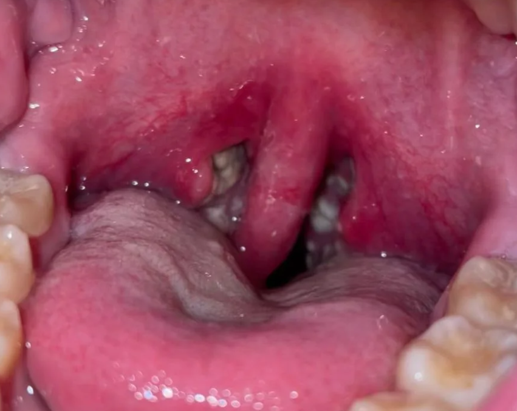
  

## 2018

Eri järjestelyt tenttien suhteen näissä aikaisemmissa tenteissä. Vain monivalintoja "välitentissä" wikin perusteella. 

### Tyttö, puberteetti M3P3, kuukautiset alkaneet, pituus 179cm. Voiko pituuskasvua hidastaa? V/O {#M3P3}

  <button class="solution-button"
          data-label="Vastaus"
          data-hide-label="Piilota vastaus">
    Vastaus
  </button>
  

      Ei

Aikuispituuden ennuste on keskeisessä asemassa harkittaessa pituuskasvua jarruttavia hoitoja. Ennusteisiin liittyvät rajoitteet ja hoidon tehon suhde luuston kypsyysasteeseen on syytä tuntea. Kaiken kaikkiaan nämä hoidot ovat harvinaisia. Tietyn pituuden ylittävää ennustepituutta ei voida pitää suoraan hoidon aiheena. 

Kohtuuttoman pitkäkasvuisuuden hoidossa voidaan käyttää mm. alaraajojen kasvulevyjen tuhoamista tai historiallisesti tulevaa aikuispituutta on vähennetty mm. puberteetin induktiolla, mutta tämän käyttö on nykyään vähäistä. 

---

Varsinkaan nyt potilaan pituuskasvun hidastaminen ei ole järkevää, koska kuukautisetkin ovat jo alkaneet ja todennäköisesti pituuskasvua ei ole enää paljoakaan jäljellä. Tytöillä kuukautiset alkavat yleensä siinä vaiheessa, kun vauhdikkain murrosiän pituuskasvu on jo ohitse. Menarken jälkeen tytöt kasvavat pituutta vielä keskimäärin 7 cm (n. 3-11 cm) – vaihtelu on kuitenkin tässäkin suurta. 

Poikien kasvupyrähdys on puolestaan voimakkaimmillaan vasta sitten, kun puberteetti on edennyt jo vaiheeseen G4, keskimäärin 14 vuoden iässä. Lihasvoiman kasvu tapahtuu yleensä siinä vaiheessa, kun kiihkein kasvu alkaa tasaantua. Ellei pojalla ole häpykarvoitusta, kasvupyrähdys on vielä edessä. 

  

### 21-trisomiaan liittyy tyypilliset ulkonäköpiirteet, huono jäntevyys, ei sydänvikaa. V/O {#21-trisomia}

  <button class="solution-button"
          data-label="Vastaus"
          data-hide-label="Piilota vastaus">
    Vastaus
  </button>
  

      Väärin

21-trisomiaan eli Downin oireyhtymään kuuluu kylläkin tyypilliset ulkonäköpiirteet ja heikko jäntevyys, mutta väite ”ei sydänvikaa” on virheellinen -- **sydänviat ovat erittäin tavallisia Down-potilailla.** Noin 40–50 %:lla 21-trisomiaa eli Downin oireyhtymää sairastavista lapsista on synnynnäinen sydänvika; yleisin on AVSD (eli atrioventrikulaarinen septumdefekti), muita ovat VSD, ASD ja PDA. Koska pienen imeväisen sydänvika voi alkuvaiheessa olla oireeton eikä siihen aina liity edes kuultavaa sivuääntä, jokaiselle 21-trisomialapselle tehdään aina kardiologin arvio ja sydämen ultraäänitutkimus (echo) pian syntymän jälkeen.

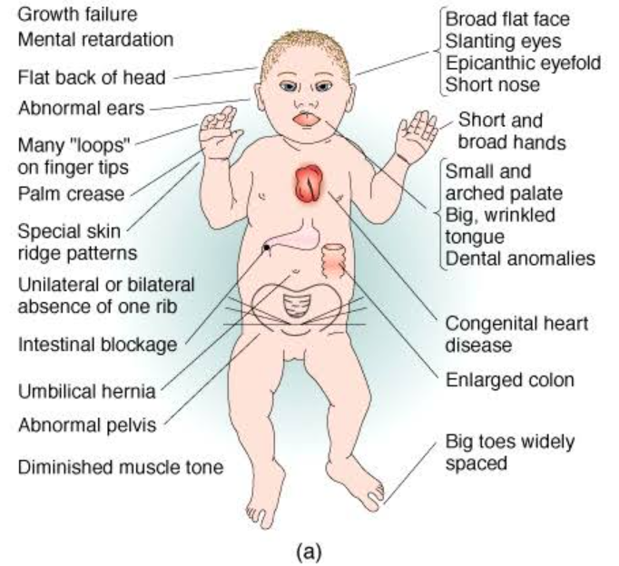
  

### Kuumekouristuksia voi ehkäistä kuumelääkkeellä? V/O {#Kuumekouristukset-ehkaisy}

  <button class="solution-button"
          data-label="Vastaus"
          data-hide-label="Piilota vastaus">
    Vastaus
  </button>
  

      Väärin 
      
Kuumelääkkeet (kuten parasetamoli tai ibuprofeeni) eivät estä kuumekouristuksen syntymistä eivätkä sen uusiutumista kuume-episodin aikana. 

Kuumekouristus liittyy aivojen kypsymättömyydestä johtuvaan alttiuteen reagoida lämpötilan nopeaan nousuun, ei pelkästään kuumeen korkeuteen. Kouristus tapahtuu usein jo infektion alussa lämmön noustessa rajusti – tyypillisesti ennen kuin vanhemmat ovat edes havainneet kuumetta tai ehtineet antaa lääkettä.

**Kuumekouristuksen estolääkkeitä ei tule käyttää, sillä yhtä aikaa tehokkaita ja turvallisia estolääkkeitä ei ole saatavilla. Tulevat kuumeet hoidetaan kuten muidenkin lasten kuumeet, koska ei ole osoitettu, että tehokaskaan kuumeen hoito ehkäisisi kuumekouristuksia.**

---

Kuumekouristuksia on 2–5 %:lla lapsista; yli ⅔ niistä on lyhyitä, yksinkertaisia kuumekouristuksia; < 10%:lla etenee statukseen. Kriteerit kuumekouristukselle: 

<li>Potilas on tyypillisesti 6 kk:n–5 v:n ikäinen.</li>
<li>Potilaalla on kuumetta yli 38.0 °C (täysin tarkkaa rajaa kuumeen korkeudelle kuumekouristusten yhteydessä ei ole määritetty, mutta usein kuume nousee korkeaksi, yli 38.5 °C).</li>
<li>Kuumetta ei välttämättä ole havaittu ennen kouristelua, vaan kouristelu voi olla kuumeen ensimmäinen merkki.</li>
<li>Yksinkertainen kuumekouristus on neurologisesti terveellä lapsella esiintyvä lyhyt, yleensä 1–2 min ja korkeintaan 15 min kestävä aivoperäinen kohtaus, joka ei toistu saman vuorokauden sisällä. Itse kouristelu on tyypillisesti toonis-klooninen kohtaus, jossa lapsi menee tajuttomaksi ja yläraajat, alaraajat tai molemmat nykivät ja jäykistelevät symmetrisesti eli kehon molemmin puolin. Osa lapsista ei kouristele, vaan menee ainoastaan veltoksi.</li>
<li>Monimuotoinen kuumekouristus kestää yli 15 min ja/tai kouristelut ovat epäsymmetrisiä ja/tai uusiutuvat 24 t:n kuluessa ja/tai niiden jälkeen on epäsymmetrisiä raajapareeseja (Toddin pareesi).</li>

---

Kuumekouristusten ensihoito toteutetaan kuten epileptisen kohtauksen ensihoito. Suurin osa kuumekouristuksista on lyhyitä, kestoltaan 1–2 min, ja ne loppuvat ilman mitään erityistoimia.

Kuumeen aikainen kohtaus voi olla bakteerimeningiitin, enkefaliitin tai sepsiksen oire, joten ensimmäistä kertaa kouristanut lapsi on syytä pyytää päivystyksellisesti lääkärin tutkittavaksi, vaikka kohtaus olisi ollut lyhyt ja lapsi olisi siitä toipunut. Poissuljetaan keskushermostoinfektio, tarkistetaan verensokeri, varmistetaan statuksen normaalistuminen. Jos lapsi on muutaman tunnin seurannassa kohtauksen jälkeen hyväkuntoinen eikä lääkärin tutkimuksessa tule esiin mitään poikkeavaa, häntä ei tarvitse lähettää sairaalaseurantaan, ja vanhemmille kerrotaan kuumekouristusten hyvänlaatuisuudesta sekä annetaan tarkat ohjeet lapsen voinnin seurannasta; tarvittaessa bukkaalinen midatsolaami tai diatsepaamirektiolit kotiin.

Ensiapulääkettä ei määrätä rutiininomaisesti kotiin kaikille kuumekouristuspotilaille. Ensiapulääke on kuitenkin hyvä olla varalla erityisesti potilailla, joiden kuumekouristus on ollut pitkittynyt tai joilla pitkähköön kuumekouristukseen liittyy esim. välimatkasta johtuva viive pääsyssä ensiapua antavaan yksikköön. Ellei kotona annettu ensiapulääkkeen kerta-annos auta tai lapsi ei toivu kuumekouristuksesta nopeasti, hänet on vietävä ambulanssilla päivystyksellisesti sairaalahoitoon. 

---

EEG- tai kuvantamistutkimuksia ei normaalisti kehittyneillä ja muuten terveillä yksinkertaisia kuumekouristuksia saavilla lapsilla tarvita jatkotutkimuksina siinäkään tapauksessa, että kuumekouristukset uusiutuvat myöhempien kuumeiden aikana. Em. tutkimukset ovat aiheellisia, jos lapselle tulee myös kuumeettomia kouristuksia

Jatkotutkimuksia ei tarvita, jos 6 kk:n–5 v:n ikäisellä lapsella esiintyy vain kuumeen aikana yksinkertaisia tajuttomuus-kouristuskohtauksia, joista lapsi toipuu normaalisti. Välttämättä nämä eivät ole tarpeen myöskään 6(–7) v:n ikäisellä yksinkertaisen kuumekouristuksen saaneella etenkään, jos lapsella on ollut taipumus toistuviin yksinkertaisiin kuumekouristuksiin pienempänäkin.

  

### Pneumonian parantuminen kontrolloidaan radiologisesti lapsilla; O/V

  <button class="solution-button"
          data-label="Vastaus"
          data-hide-label="Piilota vastaus">
    Vastaus
  </button>
  

      Väärin

Keuhkokuumetta diagnosoidessa ei tarvita thx-rtg:tä, jos lapsella todetaan avohoitoinen keuhkokuume oireiden ja kliinisten löydösten perusteella. **Lapsen keuhkokuume ei myöskään yleensä vaadi jälkitarkastusta eikä keuhkokuvakontrollia.**

Vrt. _yli 50-vuotiaille ja kaikenikäisille tupakoiville potilaille suositellaan keuhkojen seurantaröntgenkuvausta 6–8(-12) viikon kuluttua pneumoniadiagnoosista._ Keuhkokuumeen sairastaneilta löydetään tavallista useammin keuhkosyöpä jopa vuosia keuhkokuumeen parantumisen jälkeen. Yli puolet keuhkosyövistä kuitenkin todetaan 3 kuukauden kuluessa sairaalaan joutumisesta
  

### Pituuteen vaikuttaa vain kasvuhormoni, painon nousuun useat eri hormonit; O/V

  <button class="solution-button"
          data-label="Vastaus"
          data-hide-label="Piilota vastaus">
    Vastaus
  </button>
  

      Väärin

Varhaislapsuudessa riittävä ravitsemus on normaalin kasvun tärkein edellytys, mutta imeväisiän jälkeen aina kasvun päättymiseen asti keskeisin säätelijä on kasvuhormonin ja insuliinin kaltaisten kasvutekijöiden (IGF) muodostama hormonijärjestelmä. 

Kilpirauhas- ja sukuhormonit vaikuttavat kasvuun välillisesti tämän järjestelmän kautta, vaikka niillä on myös suoria kasvuvaikutuksia. Varsinkin sukuhormonit ovat tärkeässä roolissa varsinkin murrosiän aikaisessa kasvussa. Kilpirauhasen vajaatoiminta näkyy herkästi jo imeväisikäisen lapsen kasvussa.

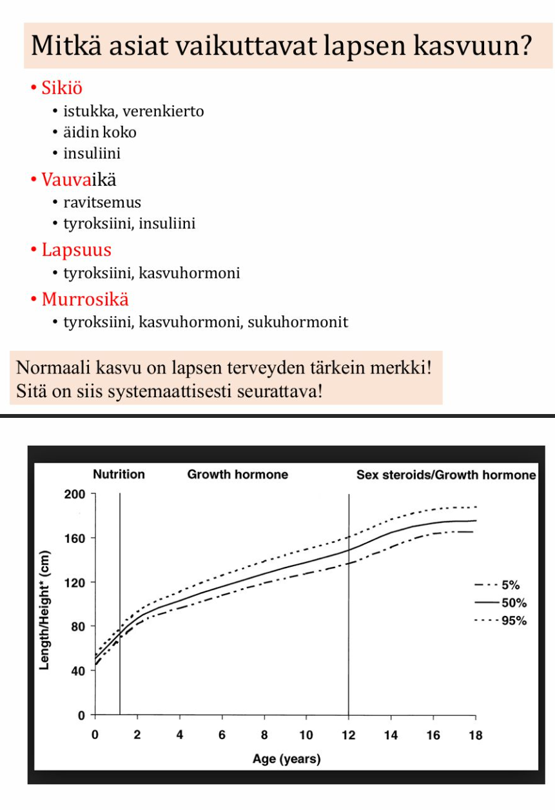
  

### Lapsen lääkeannos suhteutetaan painoon, voi siis olla suurempi kuin aikuisen annos; O/V {#Lapsen-laakeannos}

  <button class="solution-button"
          data-label="Vastaus"
          data-hide-label="Piilota vastaus">
    Vastaus
  </button>
  

      Väärin

Lapsen lääkeannos suhteutetaan painoon, mutta lapsen saama kerta- tai vuorokausiannos ei saa koskaan ylittää aikuisen enimmäisannosta. Tämä rajarikko tulee tyypillisesti vastaan isommilla lapsilla ja nuorilla noin 50 kilogramman painokilosta alkaen. 
  

### Pieni syntymäpaino on riski tyypin 2 diabetekselle; O/V {#Pieni-syntymapaino-T2DM}

  <button class="solution-button"
          data-label="Vastaus"
          data-hide-label="Piilota vastaus">
    Vastaus
  </button>
  

      Oikein

Pieni syntymäpaino (SGA eli small for gestational age tai sikiöaikainen kasvunhidastuma IUGR) on tunnettu ja vahvasti osoitettu riski tyypin 2 diabeteksen, metabolisen oireyhtymän ja valtimotautien kehittymiselle myöhemmin elämässä.

Heikko kasvu voi johtaa heikkoon haiman kehitykseen ja samalla kudokset ohjelmoituvat säästämään glukoosia, mikä heikentää insuliiniherkkyyttä. Erityisen suuri diabeteksen riski on lapsilla, joilla on pieni syntymäpaino ja jotka kokevat ensimmäisten elinvuosien aikana hyvin nopeaa painonnousua ja rasvakudoksen kertymistä. Kun niukkuuteen sopeutunut aineenvaihdunta kohtaa runsasenergiaisen elinympäristön, seurauksena on varhainen insuliiniresistenssi.
  

### Rokotusohjelmassa oleva lapsi ei ole riskissä saada tauteja, joita vastaan rokotetaan; O/V {#Rokotusohjelma-sairastumisriski}

  <button class="solution-button"
          data-label="Vastaus"
          data-hide-label="Piilota vastaus">
    Vastaus
  </button>
  

      Väärin

Rokotteet eivät anna täydellistä suojaa -- jotkut antavat paremman ja jotkut hieman heikomman. Pieni osa ihmisistä ei myöskään aina muodosta vasta-ainesuojaa täydenkään rokotesarjan jälkeen. Näitä henkilöitä kutsutaan non-respondereiksi. Joidenkin rokotteiden antama suoja vaimenee asteittain ennen seuraavaa tehosteannosta. Esimerkiksi pertussisrokotteen antama suoja hiipuu muutamassa vuodessa. 

Koska yksilöllinen rokotussuoja ei ole koskaan aukoton, rokotettujen lasten lisäturvana toimii laumasuoja (laumaimmuniteetti). Kun väestön rokotuskattavuus on riittävän korkea (esim. tuhkarokossa yli 95 %), taudinaiheuttaja ei pääse leviämään yhteisössä, mikä suojaa myös niitä lapsia, joiden oma rokotusvaste on jäänyt vaillinaiseksi tai jotka ovat eivät esim. immuunipuutossyistä voi saada tiettyjä rokotteita.

Rokotteet kuitenkin estävät useimmiten erittäin tehokkaasti vakavan, hengenvaarallisen tautimuodon, ja sen sijaan lapsi saa lievemmän version taudista. 
  

### Vauvarokko on taaperoikäisten tauti, jossa ensin 2-4 vrk kuumetta, kuumeen laskettua todetaan ihottumamuutoksia sekä suurentuneet imusolmukkeet kaulalla ja takaraivolla; O/V {#Vauvarokko-on}

  <button class="solution-button"
          data-label="Vastaus"
          data-hide-label="Piilota vastaus">
    Vastaus
  </button>
  

      Oikein

Vauvarokko (exanthema subitum, roseola, "3 päivän kuume") on **pienten lasten itsestään rajoittuva kuumetauti, jota aiheuttaa ihmisen herpesvirus 6 (HHV-6) ja harvoin HHV-7.**

**Vauvarokkoa esiintyy pääsääntöisesti pienillä lapsilla (tavallisin ikä on 6-24kk; harvinainen <3kk tai >3v)** ja 2-vuotiaista 90 % on jo sairastanut vauvarokon. Sairastetun taudin jälkeen pysyvä immuniteetti. 

Tarttuu pisaratartuntana syljestä.

---

**Tyypillinen taudinkuva on 2–5 vrk (lähteestä riippuen jopa ad 7vrk) kestävä kuume (voi nousta äkillisesti ad 39.5-40C ja 10-15%:lla ilmenee kuumekouristus), jota seuraa hento yleensä pään alueelta alkava ja vartaloon painottuva (voi myös olla raajoissa tai kasvoilla) makulaarinen tai makulopapulaarinen ihottuma.** _Usein ihottuma on kuitenkin hento tai kokonaan puuttuva._ Ihottuma voi myös olla kuumeen aikanakin tai tulla pari päivää sen jälkeen. Ihottuma kestää yleensä 1–2 vrk.

Kuumeen aikana voi ilmentyä mm. nielun punoitusta, konjunktiviittia, silmäluomien turvotusta, kitalaen punoittavia täpliä tai imusolmuketurvotusta kaulalla ja takaraivolla; etuaukilekin voi pullottaa (voi ilmeisesti olla todellinen enkefaliitti ja useimmilla jonkinlaista keskushermostoärsytystä).

_Huom! Vain noin 20 % HHV:n saaneista lapsista kehittää tyypillisen vauvarokon taudinkuvan._ Suurin osa saa epäspesifisiä virusinfektion oireita, kuten kuumetta, nuhaa, ripulia ja ärtyisyyttä, jolloin tautia on vaikea kliinisesti erottaa muista virusinfektioista.

---

**Diagnoosi on pääsääntöisesti kliininen.** HHV6- ja HHV7-viruksille on kyllä olemassa PCR- ja vasta-ainetestejä, joiden avulla kyetään tarkempaan diagnostiikkaan, mille voi olla tarvetta esimerkiksi sairaalaan päätyvän pitkittyvän kuumeisen kouristuspotilaan tapauksessa.

_Klassisen kliinisen tilanteen yhteydessä leukopenia, neutropenia ja matala (tai lievästi suurentunut) CRP tukevat vauvarokkoa; usein myös trombosytopenia._ Aivan alkuvaiheessa, kuumeen kestettyä alle puoli vuorokautta, CRP ei kuitenkaan vielä erottele bakteeritauteja kuten pyelonefriittiä tai pneumokokkemiaa vauvarokosta; CRP onkin hyödyllinen jos oireet kestäneet ≥12-24 h, tarvittaessa järjestetään seuranta. **Virtsanäytteen tarkastus pyelonefriitin varalta** ja voinnin seuranta on hyödyllistä.

---

Muuten terveillä pikkulapsilla tauti on hyvänlaatuinen, ja sen diagnostiikassa tärkeintä on sulkea vakavammat taudit kuumeen syynä pois. 

**Vauvarokko ei tarvitse muuta hoitoa kuin kivuliaisuuden oireenmukaista hoitoa, eikä lasta tarvitse eristää.**

_HHV6/7 jää latenttina elimistöön (ajoittain eritetään sylkirauhasista) eikä tästä terveellä ihmisellä ole haittaa._ Se kuitenkin tarkoittaa, että herpesvirukset voivat reaktivoitua kantasolusiirron tai muun immunosuppression yhteydessä. Tällaisissa harvinaisissa tilanteissa hoidossa on yritetty gansikloviiria, foskarnaattia ja sidofoviiria, mutta tieteellistä näyttöä niiden tehosta ei ole ja niiden käyttö on vakiintumatonta. Samoin jos ilmenee komplikaationa enkefaliittia/meningiittiä tai hemiplegiaa, voi hoito gansikloviirilla olla aiheellista. 

Vauvarokkoa esiintyy melko tasaisesti ympäri vuoden ja tartunnan lähde ei useinkaan ole tiedossa, sillä ihmisen herpesvirukset erittyvät oireettomista henkilöistä pitkään.

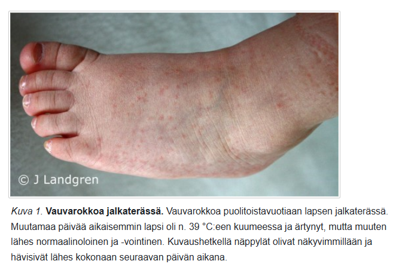
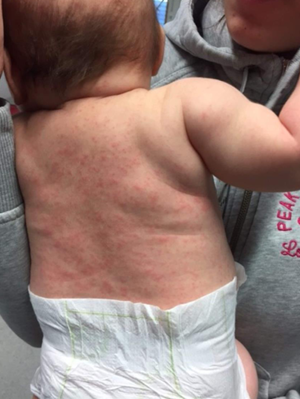
  

### Monotest toimii hyvin taaperoikäisten EBV-nieluinfektioiden diagnostiikassa; O/V {#Monotest-taaperoikaiset}

  <button class="solution-button"
          data-label="Vastaus"
          data-hide-label="Piilota vastaus">
    Vastaus
  </button>
  

      Väärin

Heterofiiliset vasta-aineet toteava pikatesti on varsin spesifinen, mutta se havaitsee vain n. 90 % aikuisten, 75 % vanhempien lasten ja **ainoastaan 30 % alle 2-vuotiaiden mononukleooseista.** 

Positiivinen pikatesti yhdistettynä kliiniseen taudinkuvaan antaa nuorilla aikuisilla melko luotettavasti diagnoosin. Jos pikatestin tulos on negatiivinen, mutta (esim. erotusdiagnostisista syistä) varma diagnoosi on tärkeä, on tutkittava EBV-vasta-aineet (EBVAb). 

  

### Likvorin CXCL-13 -pitoisuuden nousu on tyypillistä neuroborrelioosille; O/V {#Likvor-neuroborrelioosi}

  <button class="solution-button"
          data-label="Vastaus"
          data-hide-label="Piilota vastaus">
    Vastaus
  </button>
  

      Oikein

Aivo-selkäydinnesteen CXCL13-kemokiinin pitoisuuden määritys on serologisen testin ohella hyvä testi neuroborrelioosin (LNB) diagnostiikassa. Aivo-selkäydinnesteen suuri CXCL13-pitoisuus liittyy lähes yksinomaan hoitamattomaan akuuttiin neuroborrelioosiin (pitoisuus selvästi suurentunut myös mm. neurosyfiliksessä).

CXCL13-pitoisuus kasvaa nopeammin kuin aivo-selkäydinnesteen vasta-ainepitoisuus neuroborrelioosin alussa, ja toisaalta se pienenee nopeasti mikrobilääkityksen myötä. Aikaisessa LNB:ssä Li-CXCL13 voi siis olla voimakkaasti koholla, vaikka vasta-aineet eivät olisikaan merkittävästi nousseet. Myös tippuu suhteellisen nopeasti; pienenee merkitsevästi jo 2vk onnistuneen hoidon jälkeen -> määrittäminen on hyödyksi hoidon tuloksen arvioimiseksi. Rutiiniluonteiset aivo-selkäydinnestenäytekontrollit ovat tarpeettomia, mutta tutkimus kannattaa uusia, mikäli potilaan oireet voimistuvat uudelleen paranemisprosessin jo käynnistyttyä tai oireilu jatkuu voimakkaana hoidosta huolimatta. CXCL13:n avulla voidaan tunnistaa myös uusi neuroborrelioosi sellaisella potilaalla, jolla on jo aiemmin hoidettu neuroborrelioosi ja intratekaalinen vasta-ainetuotanto on edelleen käynnissä. 

---

Lymen borrelioosin yleisin ilmentymä on erythema migrans, ja tavallisin levinnyt tautimuoto on Lymen neuroborrelioosi (LNB). Neuroborrelioosin (LNB) yleisin taudinkuva lapsilla on kasvohermohalvaus (usein bilateraalinen), johon voi liittyä meningiitti (aikuisilla yleisin on meningoradikuliitti (Bannwarthin oireyhtymä)). Borrelioosi tulee käytännössä aina poissulkea potilaalta, jolla on epäselvä perifeerinen kasvohermohalvaus, varsinkin lapsilta tai jos on bilateraalinen kasvohalvaus. 

Käytännössä aina diagnostiikassa otetaan seerumin borreliavasta-aineet (S-Borr-Ab) ja lapsilta (<16 v.) tutkitaan lisäksi aina likvorin borrelia-PCR ja vasta-aineet (Li-BorrAb) sekä Li-CXCL13. Myös MRI otetaan perifeerisen kasvohermohalvauksen arvioinnissa erityisesti lapsilta käytännössä aina.

  

### Toistuvat nenän sivuonteloiden tulehdukset kouluikäisellä syy epäillä immuunivajavuutta; O/V {#Sivuontelutulehdukset-immuunivajaus}

  <button class="solution-button"
          data-label="Vastaus"
          data-hide-label="Piilota vastaus">
    Vastaus
  </button>
  

      Oikein

**Jos selkeät sivuontelotulehdukset toistuvat kouluikäisellä lapsella 3–4 kertaa vuodessa, on syytä miettiä syitä.** 

Hengitysteiden virusinfektioille altistumista on pyrittävä vähentämään. Flunssan aikana allergia voi olla myötävaikuttava tekijä sivuontelotulehduksen kehittymisessä. Huolellinen anamneesi, ympäristöallergeenien kartoitus, allergiatestit ja mahdollisesti hoitokokeilu antihistamiinilla ja nenästeroidilla auttavat selvittämään allergian osuutta. 

**Tiheästi toistuvat, antibioottihoitoa vaativat sivuontelotulehdukset voivat joskus olla merkki hypogammaglobulinemiasta, joten selkeässä sivuontelotulehduskierteessä immuniteetin tutkimista on harkittava.** Tällöin lapselta tutkitaan täydellinen verenkuva ja seerumin IgG-, IgA- ja IgM-pitoisuudet. 

Sivuontelotulehdusten syynä voivat joskus olla myös anatomiset rakenteet, joita voidaan erikoissairaanhoidossa kuvantaa esimerkiksi kartiokeila-tietokonetomografialla.

  

### Hinkuyskän oireita ovat kovat yskänpuuskat ja limaoksennukset, imeväisillä voi olla toistuvia apneoita ilman yskää; O/V {#Hinkuyskan-oireet}

  <button class="solution-button"
          data-label="Vastaus"
          data-hide-label="Piilota vastaus">
    Vastaus
  </button>
  

      Oikein

Hinkuyskän aiheuttaja on **Bordetella pertussis, joka on gram-negatiivinen coccobacillus (eli siis bakteeri).**

Hinkuyskää vastaan rokotetaan kansallisessa rokotusohjelmassa asellulaarisella pertussis -rokotteella (aP-osa DTaP-rokotetta). Sitä annetaan 3, 5 ja 12 kk:n ikäisille lapsille ja tehosteet 4 v:n ja 14–15 v:n iässä. Aikuisille tehoste annetaan 25 v:n iässä, asevelvollisille ja raskaana oleville. Rokote ei anna elinikäistä eikä täydellistä suojaa.

---

**Oirekuva:**

Hinkuyskä on **puuskainen voimakas yskä,** joka on pienille imeväisille hengenvaarallinen. Kliininen diagnoosi perustuu anamneesiin, etenkin puuskittaisen yskän esiintymiseen. Pienillä, rokottamattomilla lapsilla ilmenee katarraalivaiheessa (1–2 viikkoa) lievää yskää ja nuhaa, joskus myös lievää lämpöilyä. Yskävaiheessa alkaa tulla yskänkohtauksia, joihin voi pienillä lapsilla liittyä inspiratorista stridoria eli hinkumista. Rokotetuilla koululaisilla ja aikuisilla on pääsääntöisesti atyyppinen taudinkuva, johon ei liity hinkumista. **Yskänpuuskat esiintyvät etenkin öisin ja päättyvät usein limaoksenteluun.** Kohtaukset jatkuvat tiheinä 1–4 viikon ajan, minkä jälkeen ne harvenevat. Ne saattavat uusiutua uuden hengitysteiden virusinfektion aikana. Yskävaiheessa potilas on kuumeeton. CRP ja lasko ovat tavallisesti normaalit. Hinkuyskä voi aiheuttaa pienille, rokottamattomille lapsille voimakasta lymfosytoosia, joka on vakavan taudin merkki. Lymfosytoosi johtuu voimakkaasta pertussistoksiinin vaikutuksesta, joka voi johtaa pulmonaalihypertensioon.

Kouluikäinen hinkuyskäpotilas tuodaan yleensä vastaanotolle viikkoja tai kuukausia kestäneen yskän takia. Yskä kuvataan usein poikkeuksellisen voimakkaaksi ja lähes aina puuskittaiseksi. Usein potilaat kuvaavat tautia yskäksi, jonka kaltaista heillä ei ole koskaan ennen ollut. Yli kuukauden kestoinen yskä on usein hinkuyskää ja vaatii aina tarkempia tutkimuksia.

---

Diagnostiikka: 

Imeväisillä - ja varsinkin rokottamattomilla lapsilla - hinkuyskä etenee nopeasti, ja oireita, kuten hengityspysähdyksiä, osataan jo ensimmäisenä tartunnan jälkeisenä viikkona epäillä hinkuyskän aiheuttamiksi. Tällöin taudin toteamiseen käytetään geenimonistustestiä **BopeNhO.** PCR-testin ottoon käytetään Copan-nukkatikkua tai dacron-vanutikkua. Isommilla lapsilla ja aikuisilla pääoire on pitkittynyt yskä, ja usein hinkuyskää ei ensimmäisinä viikkoina osata epäillä. Potilaan tilaa jäädään ainoastaan seuraamaan. Kun oireet pitkittyvät ja oireet ovat kestäneet 3–4 viikkoa, suorat osoitusmenetelmät eivät ole enää kovin herkkiä. Tässä vaiheessa seerumin vasta-ainetasot alkavat nousta, ja diagnostiikassa käytetään ensisijaisesti serologiaa **S-BopeAb.** Serologiaa ei pidä käyttää rokotetuilla alle 2-vuotiailla eikä vuoden sisällä rokotuksen jälkeen. Negatiivinen serologia ei sulje pois hinkuyskädiagnoosia, koska testin herkkyys on usein vain 50–60 %. 

Suomessa hinkuyskää esiintyy jatkuvasti, mutta varsin vähän. Vuonna 2017 laboratoriotestein diagnosoituja tapauksia oli 399, ja viimeisen epidemian aikana vuonna 2004 todettiin 1 631 tapausta. Sairaalahoitoa vaatii vuosittain keskimäärin parikymmentä imeväistä. Vaarallista hinkuyskää esiintyy etenkin alle 3 kk:n ikäisillä ja rokottamattomilla tai osittain rokotetuilla imeväisillä. Koska rokotteen antama suoja on lyhytaikainen, hinkuyskää esiintyy puuskaisena yskänä myös koululaisilla ja aikuisilla.

---

Pienet, erityisesti rokottamattomat imeväiset tulee aina toimittaa sairaalahoitoon. Mikrobilääkkeenä käytetään imeväisillä _atsitromysiiniä_ 10 mg/kg/vrk 5 vrk:n ajan, yli 6 kk:n ikäisillä aloitusannos 10 mg/kg/vrk (max 500 mg) ja sitten 4 päivän ajan 5 mg/kg/vrk (max 250 mg). Isommille lapsille ja aikuisille ensimmäisenä päivänä 500 mg ja sitten 4 päivän ajan 250 mg/vrk. Vaihtoehtoisesti voidaan käyttää roksitromysiiniä tai klaritromysiiniä. Amoksisilliinista tai kefalosporiineista ei ole hyötyä. Hoidon päätavoitteena on tartuttavuuden ja leviämisen vähentäminen. Jotta hoito auttaa oireisiin, se tulee aloittaa hinkuyskäepäilyn herättyä mahdollisimman pian. Käytännössä hoito aloitetaan heti PCR-näytteen ottamisen jälkeen, jos oireet ja epidemiologinen tilanne viittaavat hinkuyskään. Yli kuukauden oireilleita ei kannata hoitaa. Toistuvista mikrobilääkekuureista ei ole hyötyä.

Jos hinkuyskäpotilaan perheessä on alle 6 kk:n ikäisiä lapsia tai yli 36. raskausviikolla oleva, koko perheelle annetaan mikrobilääkeprofylaksi riippumatta oirekuvasta tai rokotusstatuksesta.

Eristysaika on 5 vrk mikrobilääkehoidon alusta. Jos oireita on ollut yli 3 viikon ajan, ei eristystä tarvita.

  

### Bronkioliitin diagnostiikassa käytetään apuna thx-röntgeniä sekä CRP-arvoa; O/V {#Bronkioliitin-diagnostiikassa}

  <button class="solution-button"
          data-label="Vastaus"
          data-hide-label="Piilota vastaus">
    Vastaus
  </button>
  

      Väärin

Bronkioliitin diagnoosi on kliininen ja perustuu lapsen ikään, oireisiin ja löydöksiin, kuten tihentyneeseen hengitykseen, uloshengitysvaikeuteen, auskultaatiossa kuultaviin vinkunoihin tai hienojakoisiin rahinoihin (ritinöihin) ja rintakehällä todettuihin vetäytymiin. 

Ilmasalpaus on kliinisesti vaikea arvioida, ja hypoksia voidaan todeta vain mittaamalla happisaturaatio. Hengitystyön määrä päätellään kliinisesti hengitystiheydestä, uloshengityksen pituudesta ja vetäytymien asteesta

---

**Radiologisia tutkimuksia ja laboratoriotutkimuksia tarvitaan pääsääntöisesti vain hyvin vaikeaoireisilla potilailla.** Keuhkojen natiivikuvassa voidaan nähdä usein ilmasalpausta ja bronkiaalisen kuvioituksen lisääntyminen sekä joskus atelektaaseja tai alveolaarisia tiivistymiä viruskeuhkokuumeen merkkinä, mutta keuhkokuvamuutokset ovat huonosti yhteydessä taudin vakavuusasteeseen.

  

### Perusterveen lapsen keuhkokuumeen ab-hoidon tulee kattaa pneumokokki; O/V

  <button class="solution-button"
          data-label="Vastaus"
          data-hide-label="Piilota vastaus">
    Vastaus
  </button>
  

      Oikein

Lapsen keuhkokuume on keuhkokudoksen tulehdus, jonka voivat aiheuttaa pelkät virukset, virukset ja bakteerit tai ensisijaisesti bakteerit. _Erityisesti pienillä lapsilla virusten osuus keuhkokuumeen aiheuttajana on merkittävä._ Bakteereista yleisimpiä aiheuttajia ovat **pneumokokki ja mykoplasma** (harvinaisemmin haemophilus influenzaea, chlamydia pneumoniae, s. aureus, s. pyogenes). Viruksista mm. RSV, metapneumovirus (hMPV), adenovirus, koronavirukset, influenssavirukset, parainfluenssa ja rhinovirus. Virukset voivat aiheuttaa keuhkokuumetta yksinään tai altistaa sekundaariselle bakteeri-infektiolle.

Bakteeri- ja virusinfektiota on vaikea erottaa toisistaan, vaikka korona-, influenssa- ja RSV-pikatesti on käyttökelpoinen epidemia-aikana. **Kliinisesti diagnosoitu keuhkokuume hoidetaan antibiootilla, jos ei ole selkeästi viruksen aiheuttama.**

Keuhkokuumeen antibioottihoidon tulee aina kattaa pneumokokki. **Ensisijainen antibiootti avohoidossa on amoksisilliini** ja sairaalahoitoa vaativalla potilaalla G-penisilliini. Suun kautta annosteltava amoksisilliini (40-45 mg/kg/vrk jaettuna 3 annokseen (maksimiannos 750 mg × 3) 5 vrk:n ajan) on siis ensisijainen valinta aikaisemmin terveiden lasten kotisyntyisessä keuhkokuumeessa, jonka oireet viittaavat bakteeritautiin, kun taudinkuva ei ole vaikea. Hyväkuntoisen lapsen keuhkokuume voidaan hoitaa kotona suun kautta otettavilla antibiooteilla. Lapsi kuuluu sairaalahoitoon, mikäli hän on alle puolen vuoden ikäinen, yleistila on heikentynyt, hengitys on vaikeutunut, tai jos keuhkokuvassa nähdään laajat tulehdusmuutokset tai pleuranestettä.

Hyväkuntoiset penisilliiniallergiset voidaan hoitaa makrolidilla (ensisijaisesti atritromysiini).

Jos on perusteltu syy epäillä mykoplasmakeuhkokuumetta, hoidetaan keuhkokuume makrolidilla tai doksisykliinillä (vain yli 8-vuotiaille).

_Oseltamiviiria voidaan käyttää influenssaviruksen aiheuttaman keuhkokuumeen hoitoon (jos influenssa on todettu testaamalla ja oireiden alusta on alle 48 tuntia)._

---

Lasten keuhkokuumeessa toipuminen alkaa yleensä jo ensimmäisen 12 tunnin aikana. Toipumisen merkkejä ovat yleisvoinnin virkistyminen, kuumeen häviäminen ja mahdollisen lisähapen tarpeen väheneminen. Mikäli toipuminen ei ole alkanut 48 tunnin sisällä antibioottien aloittamisesta, on pidettävä mielessä keuhkokuumeen komplikaation mahdollisuus, resistenssi lääkkeelle tai epätyypillinen aiheuttaja. Tällöin tulee tehdä uusi huolellinen kliininen tutkimus ja ottaa herkästi keuhkokuva. Lisäksi on harkittava etiologisia tutkimuksia sekä antibioottihoidon tehostamista. Keuhkokuumeen komplikaatioita ovat keuhkopussin märkäkertymä eli empyeema ja keuhkopaise eli absessi, joita epäiltäessä diagnostiikassa käytetään ultraäänitutkimusta, tietokonetomografiaa tai magneettitutkimusta.

Jälkitarkastusta tai rutiininomaista keuhkokuvan kontrollointia ei tarvita, mikäli toipuminen on edennyt normaalisti.

  

### Lapsen VTI:n diagnoosiin riittävät stix-näytteet tai seulontanäyte; O/V {#Lapsen-vti-diagnostiikka}

  <button class="solution-button"
          data-label="Vastaus"
          data-hide-label="Piilota vastaus">
    Vastaus
  </button>
  

      Väärin

**Lapsen VTI-diagnostiikassa virtsanäytteet tulee aina viljellä, jos halutaan oikea diagnoosi.** Diagnosointi aloitetaan U-KemSeul-tutkimuksella, mutta lopullisen diagnoosin on aina perustuttava virtsan bakteeriviljelyyn. Virtsatieinfektion diagnoosi perustuu oireisiin, seulontanäytteessä osoitettuihin virtsan valkosoluihin (puuttuminen virtsanäytteestä sulkee pois infektion yli 90 %:n todennäköisyydellä) ja virtsan bakteeriviljelyyn. 

Positiivinen nitriittitesti on luotettava infektion osoittaja. Negatiivisen tuloksen käyttökelpoisuutta rajoittaa se, että imeväisillä virtsa ei aina pysy rakossa riittävän pitkää aikaa. Alle 2-vuotiaiden VTI-potilaiden näytteistä vain joka neljäs on nitriittipositiivinen (nitriittinegatiivisuutta ei siis yleensä tarvitse huomioida empiirisessä antibioottivalinnassa). 

---

Lapsen virtsanäytteen saaminen eroaa potilaan iän, tilanteen ja toimipaikan käytäntöjen mukaan. 

**Seulontanäytteitä voi ottaa esim. lentovirtsanäytteenä (kontaminaatioriski 10–25 %), hieman huonompina vaihtoehtoina myös näytetyynyllä tai -pussilla (isompi kontaminaatioriski; n. 50-60%). Jos ensimmäinen seulontanäyte on negatiivinen, ei uutta näytettä tarvitse ottaa. Jos seulontanäytteessä on leukosyyttejä tai diagnoosi on epäselvä, edetään toiseen näytteeseen. Toinen näyte otetaan ensisijaisesti rakkopunktiolla, tai jos sitä ei saada, katetroimalla (harvoin) tai toisella tyyny-, pussi- tai lentonäytteellä.**

Imeväisellä lentovirtsanäyte voidaan saada Quick Wee -menetelmällä, jossa häpyluun yläpuolista ihoa stimuloidaan kylmällä (3–5 °C) keittosuolaan kostutetulla sideharsolla. Jos lentovirtsanäytteen saaminen ei onnistu, imeväisen virtsanäyte voidaan kerätä joko näytetyynyllä, joka on vaihdettava 30 minuutin välein, jos näytettä ei ole saatu tai keräyspussilla. Tyynyn käyttö on miellyttävämpää kuin keräyspussin käyttö, koska se ei vaadi liimateipin irrottamista iholta. 

Pottaa käyttävältä lapselta saadaan luotettavin keskivirtsanäyte asettamalla näyteastia potan etuosaan. Tätä vanhemmilta lapsilta otetaan normaali puhtaasti laskettu keskivirtsanäyte kuten aikuisilta.

---

Noin 2–8 % lapsista sairastaa vähintään yhden virtsatieinfektion ennen murrosikää ja noin 1 % ennen kouluikää. Kaikkein suurin virtsatieinfektioiden esiintyvyys on alle yksivuotiailla lapsilla, joilla taudinkuva on yleensä kuumeinen pyelonefriitti. Imeväisiässä poikien kuumeiset virtsatieinfektiot ovat yleisiä, mutta myöhemmin alempia virtsatieinfektioita sairastavat lähes ainoastaan tytöt. Alle kaksivuotiaiden lasten epäselvän kuumeen syy on 10–20 %:ssa tapauksista virtsatieinfektio. Virtsatieinfektio uusii 10–30 %:lla lapsista useimmiten kuuden kuukauden sisällä ensimmäisestä infektiosta.

Virtsatieinfektio on nouseva infektio, jossa ulosteperäiset bakteerit kiinnittyvät virtsateiden limakalvolle ja nousevat virtsaputkea pitkin virtsarakkoon aiheuttaen kystiitin tai vielä ylempiin virtsateihin saakka aiheuttaen kuumeisen pyelonefriitin. Virtsatieinfektion aiheuttava bakteerikanta on yleensä lähes aina löydettävissä potilaan ulosteesta. Infektion riskiä kasvattavat virtsateiden rakenteelliset poikkeavuudet, ummetus ja virtsaamisen jälkeen rakkoon jäävän jäännösvirtsan määrä. Virtsatieinfektion aiheuttajista yleisin on Escherichia coli, joka aiheuttaa noin 80 % kaikista virtsatieinfektioista. Muita mahdollisia aiheuttajia ovat klebsiellat, enterokokit, enterobakteerit, Proteus mirabilis ja Pseudomonas aeruginosa. Staphylococcus saprophyticus aiheuttaa usein kystiittejä nuorilla naisilla, mutta on harvinainen taudinaiheuttaja pienillä lapsilla.

---

Imeväisen korkea kuume ilman muita oireita viittaa mahdolliseen virtsatieinfektioon. Monet lapset oksentavat korkean kuumeen aikana, joten oksentaminen ilman ripulia ei sulje pois virtsatieinfektion mahdollisuutta. Pyelonefriittiä esiintyy myös imeväisiän jälkeen, mutta se on yleisin alle yksivuotiailla lapsilla. Paikalliset pyelonefriitistä johtuvat oireet, kuten kylkikipu tai munuaisten koputusarkuus, ovat lapsilla mahdollisia, mutta niiden puuttuminen ei sulje pois infektion mahdollisuutta. Pyelonefriittiä sairastavilla imeväisillä ja lapsilla on harvoin tyypillisiä paikallisia oireita infektiostaan, joten pyelonefriitin epäileminen ja tunnistaminen korkeakuumeiselta mutta muuten oireettomalta lapselta on tärkeää kaikissa päivystyspisteissä. Plasman CRP-pitoisuuden suureneminen viittaa munuaistason infektioon. 

Virtsarakkotulehduksen oireet ovat lapsilla samankaltaisia kuin aikuisilla. Tyypillisiä kystiitin oireita ovat virtsaamisen aikainen kirvely, tihentynyt virtsaamisen tarve ja alavatsakipu. Virtsan haju ennustaa varsin huonosti virtsatieinfektiota, sillä vain noin 10 % näytteistä todetaan virtsatieinfektio, kun virtsassa on vanhempien mielestä paha haju.

---

Oireisen lapsen hoito tulee aloittaa, kun diagnoosin varmistamiseen vaaditut viljelynäytteet on otettu. Jos VTI:n epäily osoittautuu vääräksi, hoito lopetetaan. Tällöin voidaan luopua myös kuvantamistutkimuksista.

Ennen bakteeriviljelyvastausten saamista empiirisen hoidon on katettava E. coli. Sairaalahoitoisessa tapauksessa kefalosporiinit ovat tehokkaita gramnegatiivisten sauvojen aiheuttamissa infektioissa, ja kefuroksiimi (100 mg/kg/vrk jaettuna 3 annokseen) ja keftriaksoni (100 mg/kg/vrk jaettuna 1–2 annokseen) ovat hyviä valintoja virtsatieinfektioiden empiirisessä hoidossa. Pyelonefriitin hoidon ihanteellista kestoa ei ole tutkittu. Yleensä hoidon kokonaiskestoksi suositellaan noin 10:tä vuorokautta (7–14 vrk). 

Yleisoireinen todennäköinen kystiitti (potilaalla kuumetta, mutta CRP-pitoisuus < 20 mg/l) hoidetaan siten, että munuaiskudoksessakin oleva infektio hoituisi, yleensä noin 7 vuorokauden ajan. Kystiitti voidaan hoitaa periaatteessa samalla tavalla kuin aikuisten infektio; esim. nitrofurantoiini, pivmesillinaami, trimetopriimi, amoksisilliini-klavulaanihappo, kefaleksiini... hoitoaika n. 5vrk. 

---

Merkittävien hoitoa vaativien rakennepoikkeavuuksien ja synnynnäisten munuaisten kehityshäiriöiden toteamiseksi tehdään **ultraäänitutkimus**

<li>aina imeväisen (< 2-vuotiaat) virtsatieinfektion jälkeen</li>
<li>ensimmäisen pyelonefriitin jälkeen kaikilla lapsilla ja nuorilla</li>
<li>leikki- ja kouluikäisten poikien virtsatieinfektion jälkeen</li>

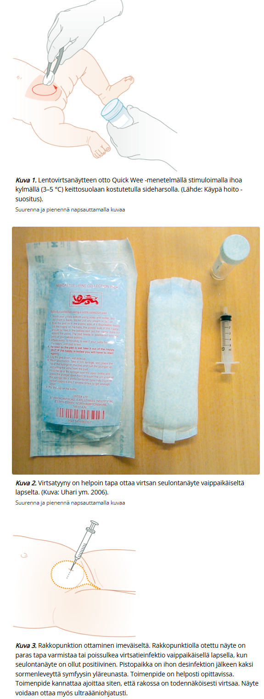
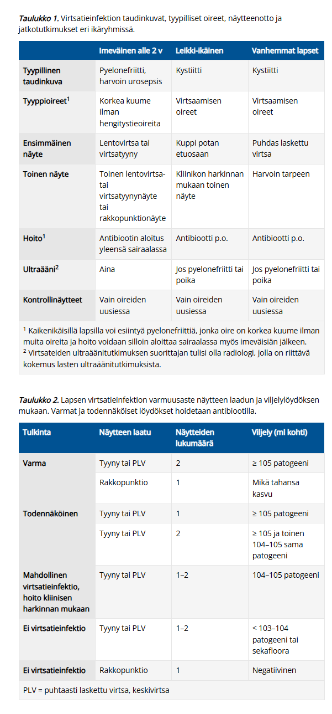
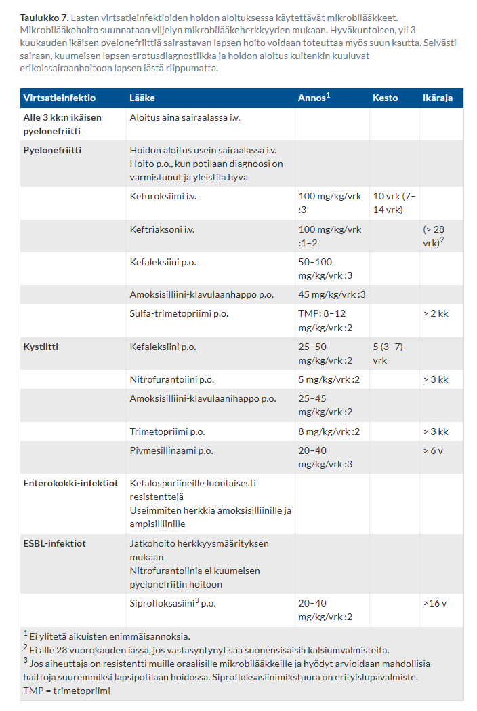

  

### Hiilidoksidin kertyminen aiheuttaa respiratorisen asidoosin; O/V

  <button class="solution-button"
          data-label="Vastaus"
          data-hide-label="Piilota vastaus">
    Vastaus
  </button>
  

      Oikein 

**Pääasiallinen häiriö respiratorisessa asidoosissa on hypoventilaatio, joka johtaa kohonneeseen pCO2 ja kohonnut pCO2 aiheuttaa veren pH:n laskua.**

Kompensatoriset renaaliset mekanismit käynnistyvät hiilidioksiditason noustessa: hapon (vetyionien) eritys virtsaan ja bikarbonaatin takaisinimeytyminen tehostuvat. Munuaiset tuottavat lisäksi itse bikarbonaatti-ioneja vereen erittäessään virtsaan vetyioneja. Metabolinen kompensaatio on hidas ja kestää päiviä; akuutissa respiratorisessa asidoosissa emäsylimäärä (BE) on normaali. Metabolisen kompensaation seurauksena seerumin bikarbonaattitaso ja BE-arvo nousevat, ja BE:n suuruus määräytyy kompensaation asteesta. pH:n arvo voi vaihdella metabolisen kompensaation (metabolisen alkaloosin) asteen mukaan lievästi alentuneesta jopa lievästi kohonneeseen (ylikompensaatio). Ylikompensoitunutta tilaa voi olla vaikea erottaa puhtaasta metabolisesta alkaloosista. Potilaan happiosapaine ja muun muassa mahdollinen tiedossa oleva aiempi hengitysfunktio auttavat päätelmissä.

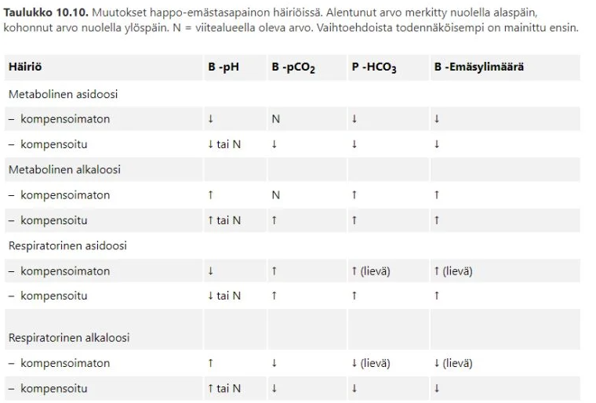
  

### 8 kg painoisen lapsen 5% kuivuma tarkoittaa 0.4 litran nestevajetta; O/V

  <button class="solution-button"
          data-label="Vastaus"
          data-hide-label="Piilota vastaus">
    Vastaus
  </button>
  

      Oikein 

**8kg x 0.05 = 0.4kg**

---

Yleisin syy lapsen kuivumalle on virus-gastroenteriitti. Arviossa tärkeää on tietysti anamneesi ja status sekä vitaalien tarkistaminen. 

<li>Anamneesi:</li>
  <ul>
    <li>Oireet, niiden kesto, mitä annettu ja mitä menetetty, virtsan määrä</li>
  </ul>
<li>Status:</li>
  <ul>
    <li>Paino (tarkista myös kasvukäyrä), kapillaaritäyttö (normaali alle 3sek), limakalvojen kosteus, ihon turgor (telttautuminen), silmien kuopalla olo</li>
  </ul>
<li>Vitaalit:</li>
  <ul>
    <li>Syke, verenpaine, hengitystaajuus, saturaatio...</li>
  </ul>
  
---

Kuivuman vaikeus voidaan jakaa lievään (3-5%), keskivaikeaan (6-10%) ja vaikeaan (9-15%). Arviossa käytetään alla olevan taulukon löydöksiä. _Paras objektiivinen mittari on kuitenkin painon muutos (jos tuore vertailupaino on tiedossa)._

Elektrolyyttiarvot ovat yleensä normaalit, jonka takia niitä ei voida käyttää kuivuman vaikeuden arviossa. Kuitenkin jos tarvitaan suonensisäistä nesteytystä, verikaasuanalyysi ja elektrolyytit (K, Na) on hyvä tarkistaa; hyväkuntoiselta lapselta ei yleensä tarvita verikokeita virustautiepäilyissä.

---

Vaikeat kuivumat (ja yleensä jo yli 8% kuivumat) kuuluvat erikoissairaanhoitoon ja tarvittaessa suonensisäiseen nestehoitoon. Iv-nestein korjaus ja ylläpitonesteytys rinnan. 

Jos lapsen kuivuman aste on vain lievä, niin tila voidaan hoitaa perusterveydenhuollossa. Kuivuman hoito suun kautta (tai tarvittaessa nenämahaletkun kautta) toteutettavalla nesteellä, esimerkiksi oraaliset rehydraatiojuomat (ORS-liuos). **Kuivuman korjauksessa ORS-liuosta (oral rehydration solution, Suomessa Osmosal®-jauhe oraaliliuosta varten sekä Floridral®, ravintolisä) annetaan n. 1.3-1.5 × kuivuman määrä / painon lasku (esim. jos lapsi painaa nyt n. 10kg ja kuivuma on n. 5% eli 500g, niin korjauksena 650-750ml) hitaasti (pienet kerta-annokset eivät laukaise oksennusta yhtä herkästi kuin kerralla juotu iso määrä) 4–6 t:n (ad 10t) aikana.** Juoma voidaan antaa pullosta, lasista, lusikalla tai ruiskulla. Monet lapset ottavat juoman mieluimmin kylmänä. Kuivuman korjauksen jälkeen siirrytään lapsen normaaliin ravintoon. Rintalapsen imetystä jatketaan taudin keston ajan normaalisti. Jos kuivuman korjaus ei onnistu kotona, se onnistuu usein nenämahaletkuun annettavalla ORS-liuoksella terveyskeskuksen tai sairaalan päivystyspoliklinikalla; oksentelevatkin lapset sietävät yleensä hitaan nesteytyksen nenämahaletkun kautta. Kuivuman korjauksen jälkeen lapsi tutkitaan ja punnitaan ja voidaan yleensä päästää kotiin jatkohoitoon.

Ripulin jatkuessa voidaan ORS-liuosta antaa 30 ml/kg kerran vrk:ssa tai 0.5 dl jokaista ripuliulostetta kohti alle 2-vuotiailla ja 1 dl jokaista ripuliulostetta kohti yli 2-vuotiailla. Lapsen normaalia ylläpitonesteytystä ei tule unohtaa gastroenteriittiä hoidettaessa. Lapsen normaali vuorokautinen nestetarve on

<li>1–10 painokilolle 100 ml/kg</li>
<li>11–20 painokilolle 50 ml/kg</li>
<li>20:n ylittäville painokiloille 20 ml/kg</li>
<li>Esim. 26-kiloisen ylläpitonestetarve on 10 × 100 ml + 10 × 50 ml + 6 × 20 ml = 1 620 ml</li>

---

Kotiutettaessa kerro perheelle taudin todennäköinen kesto ja selkeät kotihoito-ohjeet nesteytysmäärineen

<li>Virusperäinen gastroenteriitti kestää yleensä 2–7 vrk, rotavirustauti joskus kauemmin</li>
<li>Muista informoida perhettä taudin tartuttavuudesta ja kotihoitoajoista ennen päiväkotiin tai kouluun palaamista (pääsääntöisesti 2 oireetonta päivää)</li>
<li>Jos lapsi ei ala virkistyä tai väsähtää lisää tai ei virtsaa esim. yli 6-8 tuntiin, kehota ottamaan uudelleen yhteyttä</li>

---

  

### Allergian täytyy olla IgE-välitteinen siedätyshoidon mahdollistamiseksi; O/V {#Allergia-siedatyshoito-ige}

  <button class="solution-button"
          data-label="Vastaus"
          data-hide-label="Piilota vastaus">
    Vastaus
  </button>
  

      Oikein 

Siedätyshoito perustuu IgE-mekanismiin. Varsinainen siedätyshoito on suunniteltu nimenomaan totuttamaan elimistön immuunijärjestelmää IgE-välitteisiin nopeisiin reaktioihin vähentämällä kyseisten vasta-aineiden aiheuttamaa reaktiivisuutta. 

Ei-IgE-välitteisissä allergioissa (kuten vauvojen suolisto-oireissa tai FPIES-reaktioissa) perinteinen siedätysmekanismi ei toimi samalla tavalla. 

  

### Mitä nuorempi astmaa sairastava lapsi, sitä parempi vaste inhalaatiosteroidille; O/V {#Mita-nuorempi-astmaa}

  <button class="solution-button"
          data-label="Vastaus"
          data-hide-label="Piilota vastaus">
    Vastaus
  </button>
  

      Väärin 

Asia on usein päinvastoin: **mitä nuorempi lapsi on kyseessä (erityisesti alle 2–3-vuotiaat imeväiset ja taaperot), sitä vaihtelevampi ja usein huonompi on vaste inhalaatiosteroidille (ICS).**

Inhaloitavan kortikosteroidin teho on varsinkin alle kolmevuotiailla ainakin tietyissä pikkulapsen astman fenotyypeissä heikompi kuin vanhemmilla lapsilla.

Alle 3-vuotiaiden toistuva uloshengityksen vinkuna on valtaosin virusten laukaisevaa tilapäistä ahtautumista (episodic viral wheeze). Sen taustalla on pienten hengitysteiden kapea anatomia ja viruksen aiheuttama limakalvoturvotus – ei klassinen eosinofiilinen T2-tulehdus. Inhalaatiosteroidit eivät tehoa hyvin tällaiseen ei-eosiinofiiliseen virustulehdukseen. Vasta leikki- ja kouluiässä astma muuttuu useammin tyypilliseksi eosiinofiiliseksi/atooppiseksi tulehdukseksi, johon inhalaatiosteroidi tehoaa erinomaisesti. 

Imeväisikäisellä ja taaperolla myös vain pienempi osa inhalaatiosumutteen lääkkeestä pääsee perille alempiin hengitysteihin kapeiden ilmateiden, nenävoittoisen hengityksen ja pienen hengitysvolyymin vuoksi – vaikka lääke annettaisiin asianmukaisesti maskillisen tilanjatkeen läpi. 

---

Suurin osa toistuvasti vinkuvista alle kolmen vuoden ikäisistä lapsista pääsee eroon oireesta muutaman vuoden kuluessa. On erotettava, milloin kyse on väistyvästä hengityksen vinkunataipumuksesta, johon riittää jaksoittainen lääkitys, ja milloin kyse on pitkäaikaista lääkehoitoa vaativasta tautitilasta. Alle kolmevuotiaalla kolmatta kertaa hengityksen vinkunasta kärsivällä lapsella voi olla joko astma tai edelleen hyvänlaatuinen ja väistyvä uloshengitysvaikeus. Kliinikko pystyy arvioimaan astman kehittymisen mahdollisuutta tunnettujen riskitekijöiden perusteella. Tärkeitä riskitekijöitä ovat muun muassa vanhempien astma ja lapsen oma atopia. Jos lapsi on kärsinyt toistuvasta hengityksen vinkunasta ja taulukossa mainitut kriteerit täyttyvät, lapsella on yli 70 %:n todennäköisyydellä kouluiässä astma. Jos mikään kriteereistä ei täyty, lapsella ei lähes 90 %:n todennäköisyydellä ole kouluiässä astmaa.

Kansainvälisesti ei ole yhtä ainoaa oikeaa tapaa diagnosoida pienten lasten astma. Suomessa on kuitenkin sovittu taulukossa esitetty, kansainvälisistä suosituksista mukailtu malli pienten lasten astman määrittämiseksi. Mallissa on erotettu jatkuvasti ja toistuvasti oireilevat lapset. Jaksoittaisesti oireilevan lapsen astma voidaan määritellä kliinisten oireiden perusteella, jos esitiedot ovat luotettavia ja keuhkoputkia avaavalle lääkkeelle on todettu selvä vaste. Jaksoittaisesti oireilevan lapsen astmaan viittaa hengitysvaikeuden tiheä toistuminen ja taulukossa  mainittujen riskitekijöiden täyttyminen.

Eniten inhaloitavasta kortikosteroidista vaikuttavat hyötyvän lapset, joilla on osoitetusti eosinofiliaa ja selkeä atooppinen taipumus. _Jaksoittain harvakseltaan oireilevia alle kolmevuotiaita lapsia ei tarvitse eikä kannata hoitaa jatkuvalla pieniannoksisella inhaloitavalla kortikosteroidilla._ Hyvä vaihtoehto silloin on ei-atooppiselle lapselle ajoittainen inhaloitava kortikosteroidi kuureina ja keuhkoputkia avaava lääke. Akuutissa hengitysvaikeudessa kotona salbutamolia käytetään tilajatkeen kautta 0,2 mg 3–4 tunnin välein. Jos lapsi oireilee voimakkaasti, voi salbutamolia antaa 0,2 mg 20 min:n välein kolme kertaa ja sen jälkeen vähintään kahden tunnin tauko. Tämä usein laukaisee tilanteen ja pärjätään edelleen kotihoidossa.

**Kun astman diagnostiset kriteerit täyttyvät alle kolmevuotiaalla lapsella, hoito aloitetaan kolmen kuukauden hoitokokeiluna käyttäen säännöllistä inhaloitavaa kortikosteroidia.** Diagnosointi ja lääkityksen jatkamisen tarpeen arviointi on luonnollista tehdä tämän jälkeen lastentautien erikoislääkärin vastaanotolla. Hoito aloitetaan pieniannoksisella inhaloitavalla kortikosteroidilla: yleensä käytetään flutikasonipropionaattia 250 mikrog vuorokaudessa. Hoitojakson aikana oireettomuuteen pääsevien lasten lääkitys lopetetaan ja hoitoa jatketaan jaksoittaisena. Viimeistään silloin, kun jatkuvaa lääkitystä on tarvittu yli kuusi kuukautta, tehdään astmadiagnoosi.

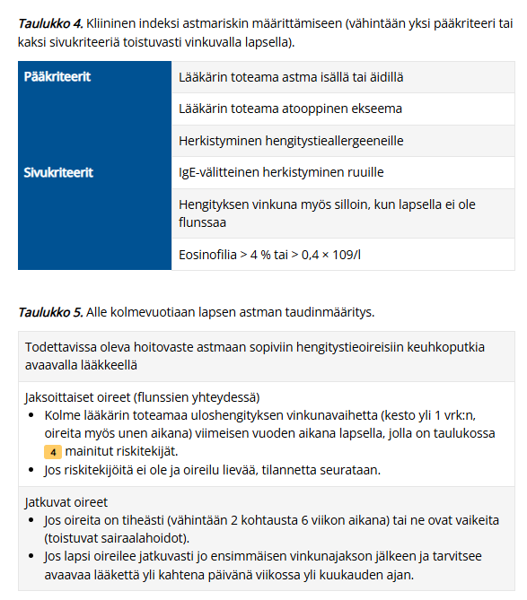
  

### Alaraajojen verenpaineet yleensä korkeammat kuin yläraajojen; O/V {#Alaraajat-vs-ylaraajat-rr}

  <button class="solution-button"
          data-label="Vastaus"
          data-hide-label="Piilota vastaus">
    Vastaus
  </button>
  

      Oikein 

Terveellä lapsella ja aikuisella alaraajojen (esim. nilkasta mitattu) systolinen verenpaine on normaalisti noin 10–20 mmHg korkeampi kuin yläraajoista (olkavarresta) mitattu verenpaine. 

Korkeampi paine johtuu painovoimasta ja hydrostaattisesta paineesta, mutta myös ns. perifeerisestä amplifikaatiosta (mitä kauempana sydämestä, sitä enemmän systeeminen vaskulaarinen resistenssi nousee). Maatenkin siis verenpaine on korkeampi alaraajoissa. 

---

Jos taas yläraajoissa on korkeampi paine, tulisi varsinkin lapsilla epäillä aortan koarktaatiota; rajana >10 mmHg korkeampi paine oikeassa yläraajassa kuin toisessa alaraajassa. 

  

### Hb voi nousta syanoottisessa sydänviassa; O/V {#Hb-nousee-syanoottisessa-sydanviassa}

  <button class="solution-button"
          data-label="Vastaus"
          data-hide-label="Piilota vastaus">
    Vastaus
  </button>
  

      Oikein 

Kompensatorinen, sekundaarinen erytrosytoosi (polysytemia). Krooninen kudoshypoksia stimuloi EPO:n eritystä ja sitä kautta punasolujen tuotantoa. 
  

### Henoch-Schönleinin purppura johtuu trombosytopeniasta; O/V {#HSP-trombosytopenia}

  <button class="solution-button"
          data-label="Vastaus"
          data-hide-label="Piilota vastaus">
    Vastaus
  </button>
  

      Väärin 

_Usein on normaali tai jopa koholla oleva verihiutalemäärä_ eikä HSP edes sinänsä "johtuisi" trombosytopeniasta, vaikka sitä olisikin. Todennäköisesti tarkoitettiin sitä, että onko HSP:n purppuralöydösten taustalla trombosytopenia ja vastaus tähänkin on ei, sillä **purppuran aiheuttaa IgA-deposition aiheuttama verisuoniseinämävaurio ja siitä johtuva verenpurkaus.**

---

**IgA-vaskuliitti,** aiemmalta nimeltään Henoch–Schönleinin purppura (HSP), on yleisin lasten vaskuliitti. Suomessa siihen sairastuu vuosittain noin 150–200 lasta. Sairauden tarkka syy on toistaiseksi tuntematon johtuu, mutta johtuu IgA-immunokompleksien kertymisestä verisuonten seinämään. _Yleensä syttyy ylähengitysteiden infektion jälkeen, mikä lisää IgA:n tuotantoa._

IgAV:n tyypillisiä oireita ovat verenpurkaumat eli petekiat (100 %) etenkin alaraajojen ja pakaroiden iholla, ja isojen nivelten kivut ja turvotus (70–80 %), suolisto-oireet (40–60 %), lähinnä vatsakipu ja harvemmin oksentelu ja veriulosteet sekä munuaisoireet, lähinnä hematuria ja proteinuria (30–40 %). 

<li>**Ns. klassinen triadi on palpoitava purppura (ei haalistu painettaessa) yleensä raajoissa ja pakaroissa + nivel- ja/tai vatsakipu + hematuria**</li>
<li>Pelkän vatsakivun lisäksi yleisin GI-komplikaatio, joka liittyy IgA-vaskuliittiin on intussusseptio (invaginaatio, suolentuppeuma). Intestinaalinen ödeema ja verenvuodot toimivat tarttumiskohtina teleskopoivalle suolen segmentille. IgA-vaskuliitti aiheuttaa klassisesti ileo-ileaalista suolentuppeumaa (tyypillisesti lasten suolentuppeumat ovat ileokolisia).</li>

---

_IgAV:n diagnoosi tehdään kliinisten oireiden perusteella._ Erotusdiagnostisina vaihtoehtoina on syytä huomioida muut ihon verenpurkaumia aiheuttavat sairaudet, kuten sepsis, veren hyytymishäiriöt ja maligniteetit.

**IgAV:n hoito on oireenmukainen eikä spesifistä lääkehoitoa ole.** Valtaosalla potilaista oireet häviävät itsestään ilman erityistä hoitoa, mutta uusia petekioita voi ilmaantua ja vatsakivut jatkua joskus useita viikkoja. _Mikäli potilaalla on hankalat nivel- ja/tai suolisto-oireet, voidaan hoitona käyttää pieniannoksista glukokortikoidihoitoa laskevin annoksin neljän viikon ajan._ 

Valtaosalla potilaista esiintyy myös munuaislöydöksiä, joiden vaikeusaste on erittäin vaihteleva. Yleisimmin esiintyy ohimenevää mikroskooppista tai makroskooppista hematuriaa. Pienelle osalle potilaista voi tulla **etenevä glomerulonefriitti ja/tai akuutti munuaisvaurio, joka edellyttää pikaista munuaisbiopsian ottoa ja hoidon aloitusta pysyvän munuaisvaurion estämiseksi.** Näissä tilanteissa hoitona käytetään yleisimmin glukokortikoidihoitoa ja siklosporiinia. IgAV-nefriitti johtaa vaikeaan krooniseen munuaisten vajaatoimintaan 2–5 % kaikista potilaista.

  

### Lapsen hypertensio on lähes aina primaarista; O/V {#Lapsen-hypertensio}

  <button class="solution-button"
          data-label="Vastaus"
          data-hide-label="Piilota vastaus">
    Vastaus
  </button>
  

      Väärin 

Toisin kuin aikuisilla, joilla yli 90 % korkeasta verenpaineesta on primaarista (essentiaalista), lapsilla hypertensio on huomattavan usein sekundaarista eli jonkin muun taustasairauden aiheuttamaa. Mitä nuorempi lapsi ja mitä korkeampi verenpainetaso on kyseessä, sitä varmemmin taustalta löytyy orgaaninen sekundaarinen syy. Lapsen kohonnut verenpaine edellyttääkin aina jatkotutkimuksia. 

Tavallisin kohonneen verenpaineen syy (noin 30 %:ssa) on munuaissairaus. Muita hypertension syitä ovat mm. aortan koarktaatio, tuumorit, lisämunuaishyperplasia, primaarinen hyperaldosteronismi, hypertyreoosi; myös kohonnut aivopaine ja esim. lakritsi ja salmiakki runsaasti nautittuina voivat olla taustalla. 

Kun tunnetut sekundaarisen hypertension syyt on poissuljettu, puhutaan essentiellistä hypertensiosta. Lapsella todetun kohonneen verenpaineen tutkimukset ja hoito kuuluvat erikoissairaanhoitoon. Hoidossa käytetään samoja lääkkeitä kuin aikuisilla.

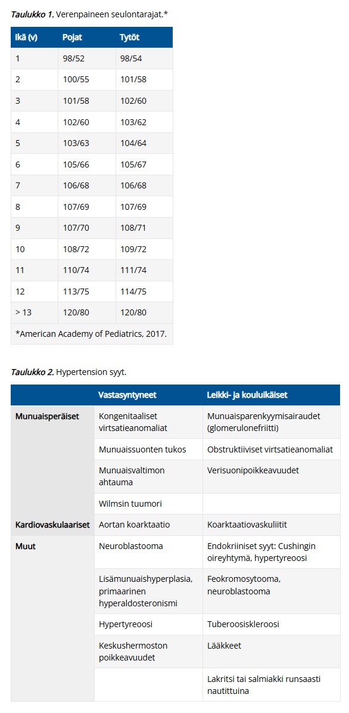
  

### Keliakia on lasten yleisin imeytysmishäiriösairaus; O/V {#Keliakia-yleisin}

  <button class="solution-button"
          data-label="Vastaus"
          data-hide-label="Piilota vastaus">
    Vastaus
  </button>
  

      Oikein 

Keliakia on sekä lapsilla että aikuisilla länsimaiden yleisin orgaaninen imeytymishäiriösairaus. Suomessa keliakian esiintyvyys lapsiväestössä on maailman huippuluokkaa (noin 1–2 %).
  

### Tihentynyt hengitys vastasyntyneellä on merkki sepsiksestä; O/V {#Tihentynyt-hengitys-sepsis}

  <button class="solution-button"
          data-label="Vastaus"
          data-hide-label="Piilota vastaus">
    Vastaus
  </button>
  

      Oikein 

Tihentynyt hengitys (>60/min) on yksi tärkeimmistä ja varhaisimmista vastasyntyneen sepsiksen kliinisistä merkeistä.

Se ei kuitenkaan ole tietystikään spesifinen sepsikselle, vaan taustalla voi myös olla mm. TTN (wet lung), pneumonia, RDS, mekoniumaspiraatio tai synnynnäinen sydänvika. 
  

### Vastasyntyneen niukka ravinto ja vähäiset ulosteet lisäävät enterohepaattista kiertoa täten vähentäen ihon keltaisuutta; O/V {#Enterohepaattinen-kierto-ravinto}

  <button class="solution-button"
          data-label="Vastaus"
          data-hide-label="Piilota vastaus">
    Vastaus
  </button>
  

      Väärin 

Niukka ravinnonsaanti ja vähäiset ulosteet lisäävät bilirubiinin enterohepaattista kiertoa, mikä **kasvattaa edelleen veren bilirubiinitasoa ja lisää keltaisuutta.**

---

Maksassa käsitely bilirubiini siis erittyy sapen mukana suolistoon ja poistuu normaalisti elimistöstä ulosteen mukana. Suolistossa olevat entsyymit kuitenkin pystyvät pilkkomaan bilirubiinia taas imeytyvään muotoon -> kulkee suolesta verenkiertoon ja takaisin maksaan (tätä kutsutaan enterohepaattiseksi kierroksi).

Jos vauva saa niukasti ravintoa, suolen toiminta on hidasta ja ulostamiskerrat jäävät vähäisiksi. Suolistossa oleva mekonium ja uloste viipyvät suolessa pidempään ja tämä antaa suolistoentsyymeille enemmän aikaa pilkkoa bilirubiinia, jolloin sitä imeytyy suurentuneita määriä takaisin verenkiertoon -> veren bilirubiinitaso nousee ja keltaisuus lisääntyy

Riittävä maidonsaanti ja tiheät ulostuskerrat sen sijaan edistävät bilirubiinin poistumista elimistöstä ja auttavat vähentämään keltaisuutta. Rintamaito voi tosin kyllä mahdollisesti tehostaa enterohepaattista kiertoa -> rintamaitokeltaisuus. 

  

### Runsas lehmänmaidon juominen voi aiheuttaa anemian vastasyntyneellä; O/V {#Lehmanmaito-anemia}

  <button class="solution-button"
          data-label="Vastaus"
          data-hide-label="Piilota vastaus">
    Vastaus
  </button>
  

      Oikein 

Usein pienen leikki-ikäisen raudanpuute johtuu lehmänmaidon runsaasta käytöstä. Lehmänmaidossa on erittäin vähän rautaa, sen kalsium estää raudan imeytymistä, ja suuri maidon juonti vie lapsen vatsassa tilaa rautapitoiselta kiinteältä ruoalta sekä voi aiheuttaa tihkuvuotoa -> johtaa raudanpuuteanemiaan.

Yleensä lapsi juo paljon maitoa, ja maidon vähentämistä voi suositella anamneesinkin perusteella. Kokonaan ei maidon juontia tarvitse kieltää, mutta kannattaa juoda suositusten rajoissa eli 5-6dl/vrk. 

  

### Akuutti virusinfektio voi aiheuttaa lievän trombosytopenian; O/V {#Virusinfektio-trombosytopenia}

  <button class="solution-button"
          data-label="Vastaus"
          data-hide-label="Piilota vastaus">
    Vastaus
  </button>
  

      Oikein 

Akuutti virusinfektio on lapsilla ja aikuisilla yksi tavallisimmista tilapäisen lievän trombosytopenian aiheuttajista. Monet virukset voivat tilapäisesti lamata luuytimen toimintaa sekä lisätä perifeeristä tuhoa ja kulutusta.
  

### Lapsella trombosytopenia, anemia ja granulosytopenia. Lähetätkö lapsen päivystykseen? {#Paivystykseen-pvk}

  <button class="solution-button"
          data-label="Vastaus"
          data-hide-label="Piilota vastaus">
    Vastaus
  </button>
  

      Kyllä 

Verenkuvassa on kolmen solulinjan muutos. Tämä herättää ensisijaisesti epäilyn **akuutista leukemiasta.** 

**Potilas tarvitsee välittömästi siirron yliopistosairaalaan** ja seuraavaksi kuulukin soittaa päivystäjälle ja ilmoittaa leukemiaepäilyn tulosta. Mitään laajoja selvityksiä ei tarvita tk-tasolla, mutta päivystäjä voi ehkä määrätä tilanteesta/etäisyydestä riippuen ottamaan veriviljelyt, aloittamaan jo antibiootin, ottamaan valmiiksi diffin yms. Järjestetään **ambulanssikyyti** ja siirretään lapsi sairaalaan, jossa seuraavana arkiaamuna otetaan yleisanestesiassa luuydinnäyte, likvornäyte ja mahdollisesti annostellaan jo ensimmäinen annos lääkettä.

Lapsi tulee todennäköisesti olemaan sairaalassa viikkoja, joten vanhemmille kannattaa jo siirtoa edeltävästi ehdottaa, että ottavat sairaalaan mukaan ainakin tärkeimmät tarvittavat asiat, joiden avulla selviävät ainakin muutaman päivän. Ei tarvitse sanoa, että nyt on varmuudella leukemia kyseessä, mutta voi sanoa, että verenkuvan perusteella lapsi tarvitsee nyt lisäselvityksiä yliopistosairaalassa. 

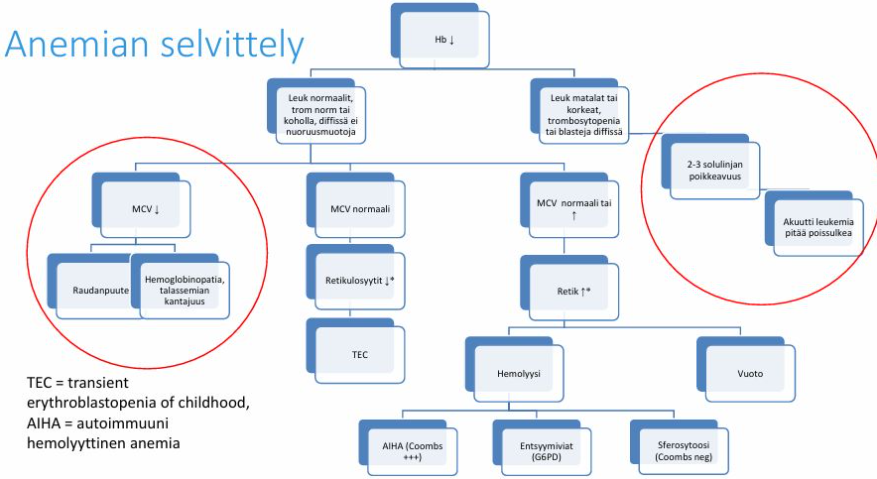
  

### Yölliset kauhukohtaukset ovat yhteydessä EEG:n poikkeavuuksiin; O/V {#Kauhukohtaus-EEG}

  <button class="solution-button"
          data-label="Vastaus"
          data-hide-label="Piilota vastaus">
    Vastaus
  </button>
  

      Väärin 

Unikauhukohtaus on NREM-parasomnia, jolle on tyypillistä erityisesti alussa kiihtynyt huuto, jonka aikana potilas istuu vuoteessa ja vaikuttaa olevan suuren kauhun vallassa. 

Usein alussa on kiihtynyt huuto, potilas istuu vuoteessa ja vaikuttaa olevan suuren kauhun vallassa. Autonominen hermosto toimii voimakkaasti: pulssi ja hengitys ovat kiihtyneet, mustuaiset laajentuneet ja voi esiintyä runsasta hikoilua. Oireistoon voi liittyä myös motorista aktiviteettia. Kohtaus kestää yleensä puolesta viiteen minuuttiin, jonka jälkeen potilas nukahtaa uudelleen. 

Kyseessä ei ole epilepsia, vaan unen säätelyhäiriö ja EEG on kohtauksen aikana ja välillä normaali. Rutiininomaista EEG-tutkimusta ei suositella eikä tarvita, jos lapsen oirekuva on tyypillinen (esiintyy alkuyöstä, lapsi ei muista kohtauksesta mitään, rauhoittuu itsestään ja kehittyy muuten normaalisti).
  

### Infektio voi provosoida hypoglykemian leikki-ikäisellä; O/V {#Infektio-hypoglykemia}

  <button class="solution-button"
          data-label="Vastaus"
          data-hide-label="Piilota vastaus">
    Vastaus
  </button>
  

      Oikein 

Infektiot ovat pienillä lapsilla tavallisimpiä hypoglykemian laukaisevia tekijöitä. Infektio lisää energiankulutusta, lapsilla on jo muutenkin suhteellisen pienet sokerivarastot ja infektion aikana ravinnon saanti on usein heikentynyttä. 
  

### Äidin diabeteksesta johtuen voi syntyä joko suuri- tai pienikokoinen sikiö; O/V {#Aidin-diabetes-sikion-koko}

  <button class="solution-button"
          data-label="Vastaus"
          data-hide-label="Piilota vastaus">
    Vastaus
  </button>
  

      Oikein 

Äidin diabetes voi johtaa joko sikiön makrosomiaan (LGA eli large for gestational age) tai sikiön pieneen kokoon (SGA eli small for gestational age). Lopputulos riippuu diabeteksen tyypistä, hoidon tasapainosta ja äidin verisuonistomuutoksista.

---

Yleisin seuraus on suurikokoinen sikiö, joka johtunee siitä, että äidin verenkierron korkea glukoosipitoisuus ylittää helposti istukan, mutta äidin insuliini ei läpäise sitä. Sikiön haima reagoi glukoosikuormaan erittämällä runsaasti omaa insuliinia (hyperinsulinemia). Insuliini toimii voimakkaana kasvutekijänä, mikä kiihdyttää rasvakudoksen synteesiä ja proteiinisynteesiä aiheuttaen sikiön normaalia suuremman kasvun. 

---

Sikiö voi myös jäädä poikkeavan pienikokoiseksi, jos äidillä on pitkälle edenneeseen diabetekseen liitännäisiä verisuonikomplikaatioita. Tämä aiheuttaa istukan toiminnanvajausta ja sikiön pienikasvuisuutta. 
  

### Suurin osa imeväisistä, joiden kasvu rikkoo seulontarajat, kasvu korjaantuu seurannassa; O/V {#Korjaantuuko-kasvu-seurannassa}

  <button class="solution-button"
          data-label="Vastaus"
          data-hide-label="Piilota vastaus">
    Vastaus
  </button>
  

      Oikein 

Ensimmäisen kahden vuoden aikana lapsen kasvu hakeutuu perimän määräämään kasvutapaan. Samalla tavoin kuin suurin osa pienikokoisena syntyneistä lapsista saavuttaa kasvussa (catch-up growth), voi suurikokoisena syntynyt lapsi hidastaa pituuskasvua kohti perimän määräämää kasvutapaa (catch-down growth). Näin voi tapahtua erityisesti silloin, kun lapsen kasvu on sikiökaudella ollut poikkeavan nopeaa (esim. äidin raskausdiabeteksen vuoksi) tai jos äiti on kookas ja isä on pieni. Toisin sanoen muutos kohti odotuspituutta on imeväisiässä tavallista mutta muutos pois odotuspituudesta huolestuttavampaa. 

Kasvu on imeväisiässä nopeaa mutta samalla hyvin herkkää häiriöille. Suurimmalta osalta imeväisikäisistä lapsista, joiden kasvu rikkoo seularajat, ei löydetä varmaa syytä, ja heidän kasvunsa korjaantuu seurannassa. Joskus taas kasvun poikkeavuus on ensimmäinen merkki vakavastakin sairaudesta, esim. synnynnäisestä sydänviasta tai aineenvaihduntasairaudesta. Tämän vuoksi lääkärin tehtävä on arvioida ja tutkia lapsi mahdollisimman kokonaisvaltaisesti. Myös lapsen neurologisen kehityksen normaalius on tärkeä varmistaa.

---

Imeväisiässä lapsen kasvu hakee omaa kasvukanavaansa, jonka löytymisen jälkeen pituuden kasvun tulisi seurata tätä käyrää johdonmukaisesti. Imeväisiässä kasvun tulkinnassa tulee siis olla kriittinen: tässä iässä kasvukanavan hakeminen on tavallisin syy seulontarajojen rikkoontumiselle. Jos suhteellinen pituus poikkeaa syntyessä huomattavasti lopullisesta pituudesta, voi kasvukanavassa tapahtua merkittäviä siirtymisiä. 
  

### Lihavien vanhempien riski lihavaan lapseen on 10-30x; O/V {#Riski-lihavuuteen}

  <button class="solution-button"
          data-label="Vastaus"
          data-hide-label="Piilota vastaus">
    Vastaus
  </button>
  

      Oikein 

**Suurin riskitekijä lapsuusiän ylipainolle on vanhempien ylipaino.** Kaksostutkimusten perusteella lapsen alttius lihoa on vahvasti periytyvää, mutta lihavuuden yleistyminen väestössä johtuu lihomista aiheuttavasta ympäristöstä ja muuttuneista elintavoista. Taustalla on siis perimän lisäksi:

<li>Vanhempien terveyskäyttäytyminen ja perheen elintavat:</li>
  <ul>
    <li>Äidin tupakointi raskauden aikana</li>
    <li>Lapsen vähäinen liikunta; vähän liikkuvien vanhempien lapset ovat liikunnallisesti passiivisempia</li>
    <li>Runsas sokeripitoisten juomien käyttö</li>
    <li>Pikaruokien tiheä syöminen</li>
    <li>Energiatiheät välipalat ja napostelu</li>
    <li>Pitkä yhtäjaksoinen paikallaanolo, monituntinen ruutuaika</li
    <li>Riittämätön yöunen määrä</li>
  </ul>
<li>Perheen alhainen sosioekonominen asema (alhainen koulutustaso, pienet tulot)</li>

  

### Lihavilla pojilla pub aikaistuu ja lihavilla tytöillä viivästyy; O/V {#Lihavuus-pub}

  <button class="solution-button"
          data-label="Vastaus"
          data-hide-label="Piilota vastaus">
    Vastaus
  </button>
  

      Väärin 

Lihavilla pojilla murrosikä alkaa usein hieman tavallista myöhemmin kun taas lihavilla tytöillä murrosikä tulee usein normaalia aikaisemmin.

---

Lihavuus ja ylipaino on selvästi yhdistetty tyttöjen varhaisempaan murrosiän alkuun. Rasvakudos tuottaa leptiini-hormonia, joka antaa aivoille viestin siitä, että elimistöllä on riittävästi energiavarastoja lisääntymiskypsyyden saavuttamiseen. Tämä käynnistää murrosiän kehityksen normaalia aiemmin

Pojilla ylipaino sen sijaan tyypillisesti viivästyttää murrosiän käynnistymistä. Rasvakudoksessa on aromataasi-entsyymiä, joka muuttaa kivesten tuottamaa testosteronia estrogeeniksi. Estrogeenitason nousu voi jarruttaa poikien murrosiän normaalia kehitystä
  

### Tytön erillinen telarke on merkki ennenaikaisesta puberteetista; O/V {#Telarke-pub}

  <button class="solution-button"
          data-label="Vastaus"
          data-hide-label="Piilota vastaus">
    Vastaus
  </button>
  

      Väärin 

**Erillinen ennenaikainen telarke tarkoittaa tytön rintarauhasen ohimenevää kehittymistä, johon ei liity muita murrosiän ilmiöitä.**

Pituuskasvu jatkuu johdonmukaisena, luusto ei kypsy normaalia nopeammin, eikä muita murrosiän merkkejä, kuten karvoitusta tai ihon tai hiusten rasvoittumista ilmaannu. Rintarauhasten läpimitta on korkeintaan 3 senttimetriä. Rintarauhasten koko voi vaihdella 4–6 viikon sykleissä. Tyypillisessä muodossaan rintarauhasten suureneminen havaitaan alle 3-vuotiaalla tytöllä, ja yleensä rintarauhaset pienenevät 1–2 vuoden sisällä niiden kasvun havaitsemisesta

Ilmiön taustaa ei täysin tunneta, mutta näillä tytöillä on havaittu tavallista suurempia FSH-pitoisuuksia, kun taas ”varsinaisen murrosiän” käynnistyessä erityisesti LH-pitoisuudet kasvavat. Ultraäänitutkimuksilla on havaittu munasarjoissa aktiviteettia, mutta toisin kuin todellisessa puberteetissa, kohdun läpimitta ja tilavuus eivät kasva. 

**Suurimmalla osalla tytöistä, joilla todetaan erillinen telarke, rintarauhaset pienenevät ja alkavat suurentua uudelleen vasta varsinaisen puberteetin käynnistyessä, mikä tapahtuu yleensä vasta ”oikealla ajallaan”.**  Pieneen osaan (n. 10 %) telarkesta liittyy kuitenkin poikkeavan varhainen puberteetti, ja siksi näiden tyttöjen seuranta on tarpeen, jotta varmistutaan siitä, ettei puberteetti etene eikä pituuskasvu kiihdy. 

Imeväisiässä todetun rintarauhasen kasvun seuranta voi valtaosin tapahtua neuvolassa. **Alle 2-vuotiaan tytön telarkea (pelkkä rinnan/rintojen kasvu ilman pituuskasvun kiihtymistä ja murrosiän merkkejä) voidaan seurata perusterveydenhuollossa.** Konsultoitava kuitenkin herkästi erikoissairaanhoitoa ja lähete erikoissairaanhoitoon on tarpeen, jos rintarauhaset jatkavat kasvuaan eivätkä pienene, jos ilmaantuu muitakin puberteetin merkkejä, kuten karvoitusta tai jos pituuskasvu kiihtyy. 

_Jos ennenaikainen telarke havaitaan ensimmäisen kerran yli 2-3 vuoden iässä, on erikoissairaanhoidon arvio tarpeen._

  

### Suun uusiva hiivainfektion on merkki APECED-oireyhtymästä; O/V {#Hiiva-APECED}

  <button class="solution-button"
          data-label="Vastaus"
          data-hide-label="Piilota vastaus">
    Vastaus
  </button>
  

      Oikein 

APS-1 eli APECED = autoimmuunipolyendokrinopatia-kandidiaasi-ektodermidystrofia; suomalaiseen tautiperintöön kuuluva peittyvästi periytyvä autoimmuunisairaus, jonka aiheuttaa mutaatio AIRE-geenissä (autoimmune regulator). Johtaa siihen, että tyymuksessa ei voida tuottaa laajasti kehon eri antigeenejä esiteltäväksi T-solujen toleranssin negatiivisen selektion vaiheessa -> autoreaktiivisia T-soluja selviää, mikä johtaa elimistön omien kudosten vastaisiin hyökkäyksiin.

---

**Klassisesti tyypillistä triadi:  hypoparatyreoosi, lisämunuaisen kuorikerroksen vajaatoiminta (Addisonin tauti) ja krooninen mukokutaaninen kandidiaasi. Suun krooninen kandidiaasi on sairauden yleisin komponentti. Tavallisimmin se ilmaantuu jo imeväiselle, mutta voi tulla joskus esille vasta aikuisiällä.**

Kliinisesti diagnoosi on selvä, jos potilaalla on kaksi kolmesta yleisimmästä komponentista (kandidiaasi, hypoparatyreoosi tai lisämunuaiskuoren vajaatoiminta). Lisäselvitykset APECED:n suhteen ovat tarpeen myös tapauksissa, joissa vain yksi klassisen triadin komponenteista varmentuu. Ongelmallisinta tilanne on silloin, kun ensimmäinen ilmentymä on joku harvinaisemmista komponenteista, esim. hepatiitti, periodinen kuume tai alopesia. Tällöin kannattaa hakea aktiivisesti taudin muita komponentteja ja harkita muita täydentäviä diagnostisia testejä, kuten APS1-vasta-ainetutkimuksia tai AIRE-geenin mutaatioanalyysia. Vasta-aineita tyypin I interferoneja (mm. interferoni-alfaa) kohtaan todetaan lähes kaikilla APECED-potilailla jo ennen taudin kliinistä diagnosointia. Kun APECED-diagnoosi on asetettu, haasteeksi tulee kehittyvien ilmentymien ennakointi ja varhainen toteaminen.

---

Muita syitä toistuvalle kandidiaasille ovat esim. inhalaatiosteroidien käyttö ilman suun huuhtelua, laajakirjoiset antibioottikuurit ja tuttien/tuttipullojen puutteellinen hygienia.
  

### Lisämunuaisen vajaatoiminta on usein seurausta glukokortikoidi-lääkityksestä {#Lisamunuaisten-vt-glukokortikoidit}

  <button class="solution-button"
          data-label="Vastaus"
          data-hide-label="Piilota vastaus">
    Vastaus
  </button>
  

      Oikein 

Sentraalisen lisämunuaisten kuorikerroksen vajaatoiminnan yleisin syy on pitkäkestoinen glukokortikoidihoito. Eksogeeninen glukokortikoidi negatiivisesti säätelee CRH:n ja ACTH:n eritystä -> lisämunuaisten atrofia. 

Nopea glukokortikoidilääkityksen lopettaminen johtaa kliiniseen akuuttiin hypoadrenalismiin (Addisonin kriisi) -> Tämän takia krooninen kortisonihoito tulee lopettaa vähitellen.
  

### Poika kasvaa nopeiten, kun 

- a. äänenmurros on ohi 
- b. tulee partakarvoja
- c. pub P4G4
- d. pub P2G2

  <button class="solution-button"
          data-label="Vastaus"
          data-hide-label="Piilota vastaus">
    Vastaus
  </button>
  

      c 

Pojilla kasvupyrähdys on häpykarvoituksen puuttuessa aina vielä edessä. Se ajoittuu yleensä G4-vaiheeseen. Jos siitin ei vielä ole paksuuntunut eikä terska kehittynyt, on pituuskasvua jäljellä 12–30 cm.

---

Pyrähdyksen huippu sattuu tytöillä keskimäärin 11–12 vuoden ja pojilla 13–14 vuoden ikään. Tyttöjen nopein kasvu ajoittuu tavallisimmin M3-vaiheeseen. Neljäsosalla kasvupyrähdys tapahtuu ennen häpykarvoituksen ilmaantumista, mutta aina ennen menarkea. Menarken jälkeen pituuskasvu hidastuu, yleensä lisääntyy vielä 3–11 cm, keskimäärin 7 cm.

  

### Vammaisen lapsen syömisongelmiin liittyy

- a. ravitsemuspuutteita
- b. vuorovaikutusongelmia
- c. voi neuvotella logopedin kanssa hoidosta 
- d. kaikki

  <button class="solution-button"
          data-label="Vastaus"
          data-hide-label="Piilota vastaus">
    Vastaus
  </button>
  

      d 

Vammaisen lapsen syömis- ja nielemisvaikeudet (dysfagia, suumotoriset haasteet) ovat monimuotoisia, ja niihin liittyvät kiinteästi kaikki esitetyt osatekijät.
  

### Diagnosoimaton DM1 voi aiheuttaa 

- a. laihtumista 
- b. pituuskasvun hidastumista 
- c. molempia 
- d. ei kumpaakaan

  <button class="solution-button"
          data-label="Vastaus"
          data-hide-label="Piilota vastaus">
    Vastaus
  </button>
  

      c 

Wikissä mallivastauksena a, mutta tietysti voi myös aiheuttaa sekä pituuskasvun hidastumista. Useimmiten diagnoosi napataan ennen pituuskasvun hidastumista jo laihtumisvaiheessa, mutta jos tyypin 1 diabetes kehittyy hitaasti tai pysyy pidempään diagnosoimattomana, insuliinin puute jarruttaa luuston kasvua ja aiheuttaa pituuskasvukäyrän taittumisen. 
  

### Nielutulehduksien aiheuttajiin liittyen 

- a. virukset kaikenikäisillä mutta eniten < 5-vuotiailla
- b. mononukleoosi eniten teini-iässä 
- c. Streptokokki eniten 5-15 -vuotiailla 
- d. kaikki oikein

  <button class="solution-button"
          data-label="Vastaus"
          data-hide-label="Piilota vastaus">
    Vastaus
  </button>
  

      d 

  

### Bronkioliitin hoidossa käytetään 

- a. amoksisilliini
- b. penisilliini 
- c. atsitromysiini 
- d. ei mitään näistä

  <button class="solution-button"
          data-label="Vastaus"
          data-hide-label="Piilota vastaus">
    Vastaus
  </button>
  

      d 

Bronkioliitti on pääsääntöisesti virusinfektio, ei tarvita antibioottihoitoa

---

Bronkioliittiin ei ole parantavaa lääkehoitoa. Tärkeintä on, että riskipotilaat (taulukko alimmassa kuvassa) tunnistetaan ja lähetetään sairaalaseurantaan. 

Bronkioliitin hoidoksi klassisesti suositellaan hapensaannin (lisähappea esimerkiksi suurivirtauksinen nenäkanyylin (optiflow) avulla, jos <92%), nesteytyksen ja ravitsemuksen varmistamista; ns. "minimal handling"-hoitperiaate eli merkittäviä toimenpiteitä pyritään välttämään. Jos limaa erittyy runsaasti, sen imeminen nenänielusta voi helpottaa hengitystä ja syömistä. Mikäli syöminen onnistuu huonosti, annetaan nesteytystä ja ravitsemusta yleensä nenämahaletkulla tai joskus suonensisäisesti. Käypä hoito- tai kansainväliset bronkioliitin hoitosuositukset eivät suosittele beeta2-agonististia, adrenaliinia, systeemistä tai inhaloitua kortikosteroidia, antibioottia tai antiviraalista lääkitystä bronkioliitin hoitoon. 

Lasten astman Käypä hoito -suositus ei kuitenkaan ota kantaa pienen lapsen ensimmäisen rinoviruksen aiheuttaman vinkukohtauksen hoitoon. On kuitenkin esitetty asiantuntijanäkemyksiä hoitolinjoista (esim. [tässä Lääkärilehden artikkelissa](images/RinoRSV.pdf); samat asiat on myös luentodioissa paljon sekavammin). Vaikka kontrolloituja tutkimuksia on vielä vähän, on viitteitä, että niiden akuuttiin hoitoon tulee suhtautua eri tavoin. **Ensimmäinen rinovirusvinkuna vaikuttaa olevan tällä hetkellä tehokkain aikapiste astman sekundaaripreventioon.**

<li>RSV-Bronkioliitti:</li>
  <ul>
    <li>Potilas: Tyypillinen ikä alle 6 kuukautta, osastohoitoa vaativa tauti, runsaasti limaa hengitysteissä, työläs hengitys, ei atooppista ekseemaa, vanhemmilla ei astmaa ja he tupakoivat.</li>
    <li>Hoitolinja: Pidättäydy lääkkeistä. Oireenmukaisena hoitona hapensaannin ja ravitsemuksen turvaaminen. Limaimut vain tarvittaessa.</li>
    <li>Perustelut: Oireiden syynä liman ja solujätteen aiheuttama mekaaninen tukos hengitysteissä, eikä astmariski ole merkittävästi lisääntynyt. Avaavien tai hoitavien lääkkeiden tehosta ei ole näyttöä.</li>
  </ul>
<li>Rinovirusvinkuna:</li>
  <ul>
    <li>Potilas: Tyypillinen ikä yli 12 kuukautta, osastohoitoa vaativa tauti, taustalla pitkittynyt yskä, auskultoiden selkeät ekspiratoriset vinkunat molemman puolin, hengitysapulihakset käytössä, atooppista ihottumaa, toisella vanhemmista on allerginen astma, kotona 2 kissaa. </li>
    <li>Hoitolinja: Kokeillaan avaavaa lääkettä (esim. salbutamoli). Jos hyötyy ja vinkuna toistuu, harkitse kolmen päivän systeemistä kortikosteroidikuuria ja määritä pöly- ja ruokaryhmän allergiatestit.</li>
    <li>Perustelut: Astman kaltainen taudinkuva ja merkittävästi lisääntynyt astmariski. Hieman näyttöä sekä avaavan lääkkeen että kortikosteroidin hyödystä tässä potilasryhmässä.</li>
  </ul>
<li>Käytännön elämässä virusdiagnostiikkaa tehdään suhteellisen harvoin. Siksi voitaisiin puhua RSV-bronkioliitista, kun RSV-virus on osoitettu tai alle 6 kuukauden ikäinen vauva sairastaa tyypillisen taudinkuvan RSV-epidemian aikana. Tällöin keuhkoputkia avaavaa lääkettä (beeta2-agonistia) ei kannata edes kokeilla. **Jos taas ikä on yli 6 kuukautta ja lapsi sairastaa RSV-epidemian ulkopuolella, voitaisiin avaavaa lääkettä kokeilla sitä herkemmin, mitä vaikeampi tauti on, mitä voimakkaammin uloshengitys vinkuu ja mitä enemmän on atopiapiirteitä.** Hoitovasteen, riskitekijöiden ja iän (mielellään yli 12 kk) mukaan voidaan harkita 3 päivän systeemistä kortikosteroidikuuria. </li>

----

  

### Pyelonefriittin liittyy 

- a. oireena kirvely 
- b. ei vaadi jatkoselvittelyä virtsateiden rakenteen suhteen 
- c. erotusdg vaihtoehto, kun oireena ainoastaan korkea kuume 
- d. ei mitään näistä

  <button class="solution-button"
          data-label="Vastaus"
          data-hide-label="Piilota vastaus">
    Vastaus
  </button>
  

      c 

Virtsarakkotulehdus (kystiitti) on alempien virtsateiden infektio, jonka tyypilliset oireet ovat virtsaamisen kirvely ja virtsaamispakko. Munuaisten ja munuaisaltaan tulehdus (pyelonefriitti) on ylempien virtsateiden kuumeinen infektio, jossa CRP-arvo kohoaa ja erityisesti imeväiset voivat olla selvästi sairaita. 

**Pyelonefriittiä sairastavilla imeväisillä ja lapsilla on harvoin tyypillisiä paikallisia oireita infektiostaan, joten pyelonefriitin epäileminen ja tunnistaminen korkeakuumeiselta mutta muuten oireettomalta lapselta on tärkeää kaikissa päivystyspisteissä.**

---

Imeväisen korkea kuume ilman muita oireita viittaa mahdolliseen virtsatieinfektioon, jonka takia _epäselvässä lapsen kuumeessa tärkein yksittäinen labra on virtsanäyte._

Monet lapset oksentavat korkean kuumeen aikana, joten oksentaminen ilman ripulia ei sulje pois virtsatieinfektion mahdollisuutta. Pyelonefriittiä esiintyy myös imeväisiän jälkeen, mutta se on yleisin alle yksivuotiailla lapsilla. Paikalliset pyelonefriitistä johtuvat oireet, kuten kylkikipu tai munuaisten koputusarkuus, ovat lapsilla mahdollisia, mutta niiden puuttuminen ei sulje pois infektion mahdollisuutta. Plasman CRP-pitoisuuden suureneminen viittaa munuaistason infektioon. Virtsarakkotulehduksen oireet ovat lapsilla samankaltaisia kuin aikuisilla. Tyypillisiä kystiitin oireita ovat virtsaamisen aikainen kirvely, tihentynyt virtsaamisen tarve ja alavatsakipu. Virtsan haju ennustaa varsin huonosti virtsatieinfektiota, sillä vain noin 10 % näytteistä todetaan virtsatieinfektio, kun virtsassa on vanhempien mielestä paha haju.

  

### SCID 

- a. vakava immuunipuutos 
- b. oireina ripuli, imeytymishäiriöt, kasvuhäiriöt 
- c. epäily aihe kiireellisille jatkotutkimuksille
- d. kaikki näistä 

  <button class="solution-button"
          data-label="Vastaus"
          data-hide-label="Piilota vastaus">
    Vastaus
  </button>
  

      d

**Vakavan, yhdistetyn immuunipuutoksen (severe combined immunodeficiency, SCID) tunnistaminen on elintärkeää.** _Lapset, joilla on SCID, ovat syntyessään terveitä eikä diagnoosia voi tehdä kliinisesti._ Jos diagnoosia ei tehdä ajoissa, lapset menehtyvät ensimmäisten elinvuosien aikana vakaviin infektioihin. 

Vakavassa kombinoidussa immuunipuutoksessa keskeisin piirre on T-solujen puuttuminen tai niiden vähäinen määrä. Lisäksi voivat puuttua B-solut ja /tai NK-solut. Tämän johdosta hankinnainen immuunipuolustus ei toimi. Vastasyntyneiden ja imeväisten lymfosyyttitasot ovat korkeammat kuin aikuisten, joten tulkinnassa on huomioitava ikävakioidut viitearvot. Vastasyntyneiden SCID-seulonnan avulla tauti voidaan tunnistaa ajoissa. Seulonta on aloitettu Suomessa asteittain siten, että v. 2022 seulonnan piirissä ovat kaikki vastasyntyneet. Kantasolujen siirto on imeväisen hengen pelastava toimenpide. Geeniterapiaa on käytetty joidenkin SCID alatyyppien hoidossa.

Vastasyntyneisyyskauden aikana ja sen jälkeen voi esiintyä yhdistettyjä immuunipuutoksia (CID), joissa on myös keskeisessä osassa T-solujen häiriö tai matalat arvot. Näillä lapsilla on usein, mutta ei välttämättä aina, matalat immunoglobuliinitasot ja immunoglobuliinien toiminta on poikkeavaa. 

**Diagnoosiepäilyn tulee perustua oireisiin, joihin kuuluvat toistuvat infektiot ja usein vaihtelevasti ihottuma, suurentuneet imusolmukkeet, suurentuneet maksa ja perna ja autoimmuunisytopenia (anemia, neutropenia, trombosytopenia).** Krooninen hoitoresistentti ripuli ja imeytymishäiriö on yleistä -> heikko kasvu. Huonosti menestyvä infektiokierteinen lapsi kuuluu imeväiskauden jälkeenkin lasten erikoissairaanhoidon selvityksiin. Keskeistä immuunipuutosdiagnostiikassa on tunnistaa poikkeava infektioalttius, jonka johdosta immunologiset jatkotutkimukset ovat tarpeen. Myös yhdistetyissä immuunipuutoksissa parantavana hoitona on useimmiten kantasolujen siirto.

  

### Ruoka-allergia 

- a. ilmenee hengitystieoireina
- b. suolioireinen ei-IgE-välitteinen helppo todeta 
- c. diagnoosi IgE:n määrittämisellä 
- d. kaikki väärin 

  <button class="solution-button"
          data-label="Vastaus"
          data-hide-label="Piilota vastaus">
    Vastaus
  </button>
  

      d

a: Lapsen ruoka-allergia ilmenee valtaosin iho-oireina (atopsiset ihottumat, nokkosihottuma, angioedeema) ja suolioireina (ripuli, oksentelu, pulauttelu, vatsakivut). Pelkät hengitystieoireet (kuten nuha tai yskä) ovat ruoka-allergiassa poikkeuksellisen harvinaisia – hengitystieoireet voivat kylläkin liittyä vakavaan, systeemiseen anafylaktiseen reaktioon

b: Ei-IgE-välitteinen ruoka-allergia (kuten FPIES eli Food Protein-Induced Enterocolitis Syndrome) on päinvastoin diagnostisesti erittäin haastava, koska allergia- ja verikokeet (S-IgE, ihoprick-testit) ovat aina negatiivisia. Oireet voivat myös olla hyvinkin epämääräisiä. Diagnoosi joudutaan tekemään pelkän kliinisen kuvan sekä oireiden väistymisen ja uudelleenaltistuksen (välttö-altistuskoe) perusteella.

c: Spesifisen IgE-vasta-ainepitoisuuden nousu veressä osoittaa vain elimistön herkistymistä, ei vielä kliinistä allergiaa. Suuri osa herkistyneistä lapsista voi syödä ruoka-ainetta täysin oireetta. Ruoka-allergiadiagnoosi edellyttää aina oireyhteyttä ja varmistetaan tarvittaessa kaksoissokko- tai avoimella ruoka-ainealtistuksella.

  

### Astman erotusdiagnostiikassa huomioitava 

- a. BPD 
- b. kystinen fibroosi 
- c. hyperventilointi 
- d. kaikki 

  <button class="solution-button"
          data-label="Vastaus"
          data-hide-label="Piilota vastaus">
    Vastaus
  </button>
  

      d

Hengityksen vaikeutumista ja muita hengitysoireita voi esiintyä astman lisäksi myös muista syistä. Mitä pienemmästä lapsesta on kyse, sitä suurempi mahdollisuus on, että hengitysoireiden taustalla on jokin synnynnäinen rakennepoikkeavuus, esimerkiksi vajaaksi jäänyt hengitysteitä ympäröivä rustorakenne tai sen pehmeys, jolloin puhutaan rustorakenteiden, trakeo-, bronko- tai laryngomalasiasta. Harvinaisia rakennepoikkeavuussyitä voivat olla myös trakeoesofageaalinen fisteli tai suurten verisuonten anomaliat (esimerkiksi verisuonirengas, vascular ring).

Useat infektiot, kuten hinkuyskä, RS-virus- tai mykoplasmainfektiot, voivat johtaa infektionjälkeiseen keuhkoputkien yliärtyvyyteen. Pelkkä yskä, ilman hengitysvaikeutta on harvoin astmaa.

Gastroesofageaaliseen refluksiin (GER) voi liittyä hengitysoireita, keuhkoputkien hyperreaktiviteettia ja yskää, varsinkin yöaikaan.

Mekaaniset ja ahtauttavat tekijät, kuten vierasesine tai kookas kitarisa, voivat myös johtaa astman kaltaisiin oireisiin. Samanlaisia oireita voivat aiheuttaa myös keskosen keuhkosairaus (BPD, bronkopulmonaalinen dysplasia) ja harvinaiset keuhkosairaudet, kuten esimerkiksi kystinen fibroosi, jossa hengitysoireet voivat olla jo varhaislapsuudesta alkaen hyvin hallitsevia.

Toiminnalliset hengityshäiriöt (dysfunctional breathing, inducible laryngeal obstruction, vocal cord dysfunction) tulee ottaa huomioon erotusdiagnostiikassa kouluikäisillä lapsilla ja nuorilla. Torakaalisessa muodossa hengitys on pinnallista, rintakehän yläosapainotteista ja apuhengityslihakset voivat olla käytössä. Ekstratorakaalisessa muodossa voi esiintyä kohtausmaista hengenahdistusta ja sisäänhengityksen vinkumista. Tilaa tulee epäillä, jos oireet ilmenevät pääasiassa sisäänhengityksessä tai hoitovaste astmalääkitykselle on huono.

Hyperventilaatio-oireyhtymä voi erityisesti nuorella aiheuttaa äkillisen hengenahdistuksen ja oire voi johtaa ajatukset astmaan. Oireelle on tyypillistä, että ilma tuntuu loppuvan, potilaan kädet puutuvat, potilasta huimaa ja tilaan liittyy usein takykardia. Keuhkot ovat kuunneltaessa normaalit. Hyperventilaatiossa pO2 on suuri ja pCO2 pieni ja pH korkea. On tärkeää auttaa potilasta ymmärtämään oireen syy ja varmistetussa ja toistuvassa hyperventilaatiossa ohjata paperipussiin hengittäminen ensiapuna.

---

a: Keskosen krooninen keuhkosairaus eli bronkopulmonaarinen dysplasia (BPD) on merkittävä ennenaikaisena syntyneiden lasten pitkäaikaissairaus, johon liittyvät keuhkokudoksen ja alveolien alikehittyneisyys sekä keuhkoverenkierron hiussuoniston poikkeavuus. Keskoslapsen keuhkot ovat monella tapaa rakenteellisesti epäkypsät, ja esimerkiksi keuhkorakkuloita verhoavan surfaktantin tuotanto käynnistyy vasta keskimäärin 24. raskausviikolla. BPD kehittyy noin puolelle ennen 29. raskausviikkoa syntyvistä ennenaikaisista lapsista. Taudin oirekuva on erittäin laaja ja etiologia hyvin monitekijäinen – yksilön perimä vaikuttaa paitsi keuhkojen kasvuun myös tulehdusvasteen säätelyyn sikiökauden tapahtumista lähtien. Syntymän jälkeen keskosen hengitysvaikeusoireyhtymä (respiratory distress syndrome, RDS) voi vaatia useita viikkoja kestävän invasiivisen hengityskonehoidon, jonka aikana kehittyvä keuhko altistuu mm. mekaanisen ventilaation, happiradikaalien ja mahdollisten infektioiden aiheuttamille vaurioille, jotka häiritsevät keuhkokudoksen ja keuhkoverisuonirakenteiden kehitystä. Usein vaikean BPD:n jälkitilassa on piirteitä sekä pienten ilmateiden ahtaumasta ja supistusherkkyydestä, että taipumuksesta kehittää kohonnutta keuhkoverenkierron vastusta ja sydämen oikean puolen kuormitusta.

Sairastavuus painottuu usein ensimmäisiin kahteen ikävuoteen, jolloin lapset voivat joutua toistuvasti sairaalahoitoon virusinfektion laukaiseman hengenahdistuksen vuoksi. Pieni osa lapsista voi tarvita unenaikaista happilisää kotiutumisen jälkeen. Näyttöä esimerkiksi inhaloitavan kortisonilääkityksen hyödyistä on vähän, mutta osa lapsista tuntuu hyötyvän erityisesti keuhkoputkia avaavista hengitettävistä lääkehoidoista. Hoitoa ja seurantaa optimoidaan yksilöllisesti huomioiden erityisesti lapsen normaalin kasvun merkitys keuhkojen kehitykselle. Pitkäaikaisennuste on BPD:ssä huomattavasti parantunut alkuvaiheen surfaktanttihoitojen kehittymisen myötä. Lievät BPD-keuhkomuutokset paranevat käytännössä aina. Vaikeassa taudissa voidaan nähdä pysyväisluonteisia tai hitaasti paranevia emfysemaattisia keuhkomuutoksia, jotka muistuttavat aikuisiän keuhkoahtaumatautia. Erityishuomiota on kiinnitettävä vaikea-asteisen BPD:n diagnoosin saaneiden lasten sydänseurantaan keuhkoverenpaineen kehittymisen varalta.

b: Kystinen fibroosi on Suomessa harvinainen, maailmalla yleisempi. Kystinen fibroosi johtuu CFTR-geenin (kloorikanava) mutaatiosta, joka johtaa mukoosien eritteiden paksuuntumiseen -> paksu lima kertyy tiehyisiin ja aiheuttaa kroonista tulehdusta mm. hengitysteissä (myös esim. haimassa). Oireina ovat krooninen yskä, toistuvat keuhkoinfektiot, uloshengitysvaikeus ja suoliston imeytymishäiriöt/kasvun viivästyminen. Voi aluksi naamioitua vaikeasti hoidettavaksi astmaksi.

c: Hyperventilointi (ja toiminnalliset hengityshäiriöt): Erityisesti koululaisilla ja nuorilla esiintyvä hyperventilaatio-oireyhtymä tai äänihuulitoiminnan häiriö (Vocal Cord Dysfunction, VCD) voi aiheuttaa kohtauksittaista hengenahdistusta, tihentynyttä hengitystä ja tukehtumisen tunnetta. Nämä oireet sekoitetaan usein rasitusastmaan, mutta keuhkojen toimintakokeet (spirometria/PEF) ovat kohtauksen ulkopuolella normaalit eikä astmalääkitys auta oireisiin.

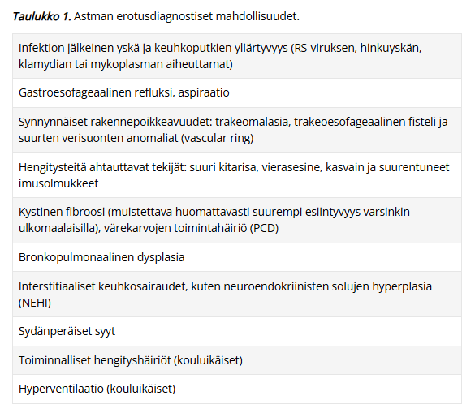
  

### Mikä seuraavista ei viittaa munuaissairauteen {#Mika-ei-munuaissairautta}

- a. turvotukset 
- b. päänsärky 
- c. toistuvat VTI:t 
- d. kasvuhäiriö 

  <button class="solution-button"
          data-label="Vastaus"
          data-hide-label="Piilota vastaus">
    Vastaus
  </button>
  

      c

Munuaissairaudet eivät usein altista varsinkaan rakkotason infektioille. 

a: Aivan keskeinen munuaisoire. Proteinuria aiheuttaa hypoalbuminemian ja siten nefroottisen turvotuksen (erityisesti silmäluomissa ja alaraajoissa). Myös akuutti glomerulonefriitti ja glomerulusten suodatusnopeuden lasku aiheuttavat suolan ja veden retentiota.

b: Lapsilla hypertensio on valtaosin sekundaarista ja johtuu useimmiten munuaissairaudesta. Kohonnut verenpaine voi ilmentyä päänsärkynä.

d: Lapsen pituuskasvun taittuminen tai painon kehityksen pysähtyminen on lapsuusiän kroonisen munuaisten vajaatoiminnan yksi tärkeimmistä merkeistä. Munuaiskerästen toiminnan vajaus johtaa metaboliseen asidoosiin, renaliseen osteodystrofiaan, anemiaan ja kasvuhormoniakselin häiriöihin.
  

### Mikä seuraavista ei ole keliakian seuraus  {#Mika-ei-keliakian-seuraus}

- a. raudanpuuteanemia 
- b. pankreatiitti 
- c. nivelvaivat 
- d. viivästynyt murrosikä 

  <button class="solution-button"
          data-label="Vastaus"
          data-hide-label="Piilota vastaus">
    Vastaus
  </button>
  

      b

Wikissä merkattu c, mutta tämä on väärin merkattu. 

**Keliakiaan viittaavat oireet ja löydökset ovat hyvin moninaisia. Lisäksi osa potilaista on oireettomia.**

a: Keliakian aiheuttama suolinukan vaurio (villusatrofia) johtaa raudan imeytymisen heikentymiseen. Raudanpuuteanemia, joka ei vastaa hyvin suun kautta annetulle rautalääkitykselle, on yksi keliakian tavallisista ensioireista

b: Keliakia ei aiheuta suoraan pankreatiittia. Se voi usein nostaa maksa-arvoja (ALAT, ASAT) johtuen mm. suolen lisääntyneestä läpäisevyydestä ja immuunivasteen leviämisestä, mutta ei yleensä affisioi haimaa. 

c: Nivelkivut ja -turvotukset ovat tunnettuja autoimmuunitaustaisia ekstraintestinaalisia keliakian oireita. Oireet helpottavat yleensä gluteenittoman ruokavalion aloittamisen myötä

d: Keliakian aiheuttama krooninen imeytymishäiriöt sekä matala-asteinen tulehdus voivat viivästyttää murrosiän kehitystä 

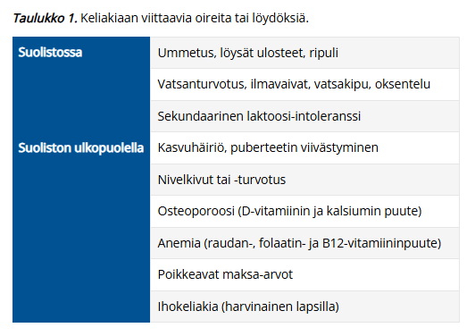
  

### Vihreät toistuvat oksennukset imeväisellä johtuvat todennäköisesti {#Vihreat-oksennukset}

- a. sappitietulehduksesta
- b. suolen tuppeumasta 
- c. suolen kiertymästä 
- d. pylorusstenoosista

  <button class="solution-button"
          data-label="Vastaus"
          data-hide-label="Piilota vastaus">
    Vastaus
  </button>
  

      c

Vihreä oksennus heijastaa mekaanista tukosta duodenumiin avautuvan sappitiehyen (papilla vaterin) alapuolella. Suolen malrotaatioon liittyvä volvulus eli kiertymä on imeväisikäisen sappipitoisen oksennuksen tärkeimpiä syitä, sillä se vaarantaa keskisuolen verenkierron ja voi johtaa suolinekroosiin tunneissa.

a: Kolangiitti on imeväisiässä erittäin harvinainen (liittyy lähinnä sappitieatresian leikkauksen jälkitiloihin) ja ilmenee keltaisuutena, kuumeena ja kipuna, ei äkillisenä suolitukosoksennuksena.

b: Esiintyy tyypillisimmin 6–18kk ikäisillä (lähteestä riippuen 0-3v) Sen klassiseen oiretriadiin kuuluvat kohtauksittaiset kovat vatsakivut, limais-veriset "vadelmahillo"-ulosteet ja vatsalta palpoituva makkaramainen massa. Oksentelu voi myöhäisvaiheessa muuttua sappipitoiseksi, mutta se ei ole ensioire.

d: Pylorusstenoosi aiheuttaa ei-sappipitoista oksentelua, koska tukos sijaitsee maha-suolikanavassa ennen sappitiehyen avautumiskohtaa
  

### Vastasyntyneen hengitysfrekvenssi yli 60 voi johtua 

- a. pneumoniasta 
- b. wet lungista 
- c. sydänviasta 
- d. kaikista

  <button class="solution-button"
          data-label="Vastaus"
          data-hide-label="Piilota vastaus">
    Vastaus
  </button>
  

      d

Tihentyneen hengityksen (>60/min) taustalla voi olla mm. sepsi, TTN (wet lung), pneumonia, RDS, mekoniumaspiraatio tai synnynnäinen sydänvika. 

a: Sikiöaikainen tai synnytyksen yhteydessä saatu infektiotauti (esim. GBS, E. coli tai listeria) on vakava takypnean syy.

b: Sikiöaikana keuhkot ovat lapsiveden täyttämät. Lapsen synnyttyä tämä neste imeytyy pois ja alveolit täyttyvät ilmalla mahdollistaen keuhkojen normaalin toiminnan. Mikäli adaptaatio häiriintyy tai viivästyy, lapsiveden poistuminen keuhkoista hidastuu, mikä aiheuttaa lapselle nopeasti ensi elintuntien aikana ilmenevän hengitysongelman, niin kutsutun kostean keuhkon oireyhtymän (takypnoea transitoria neonatalis, TTN). Määritelmän mukaan TTN kehittyy normaalin surfaktanttimäärän omaavalle täysiaikaiselle tai lähes täysiaikaiselle lapselle, ja oireet väistyvät 48 tunnin kuluessa.

c: Synnynnäiset sydänviat voivat ilmetä takypneana. Syynä on joko keuhkoverenkierron kongestio tai kudoshypoksia, jota elimistö yrittää kompensoida hengittämällä tiheämmin.

  

### Ensimmäisinä elinpäivinä lapsen odotetaan {#Ensimmaisina-elinpaivina}

- a. virtsaavan 24 h mennessä
- b. saa laihtua max 10% syntymäpainosta
- c. ulostaa 48 h mennessä 
- d. kaikki edelliset 

  <button class="solution-button"
          data-label="Vastaus"
          data-hide-label="Piilota vastaus">
    Vastaus
  </button>
  

      d

a: Terve vastasyntynyt virtsaa yleensä 24 tunnin ikään mennessä (< 1 vrk 81%, 2 vrk 99,7 %). Alkuun virtsamäärät ovat vielä niukat ja virtsassa voi olla punertavaa uraattisakkaa. Mikäli lapsi virtsaa ainakin kolmasti vuorokaudessa kolmen vuorokauden iässä ja sen jälkeen ainakin viisi kertaa vuorokaudessa, on hänen nesteensaantinsa riittävää.

b: Syntymän jälkeen lapsen elimistön eri nestetilojen suhteelliset osuudet muuttuvat ja solunulkoinen nestemäärä vähenee. Yhdessä ensi elinpäivien fysiologisesti niukan maidonsaannin kanssa se johtaa lapsen painon laskuun syntymän jälkeen. Terveen täysiaikaisen lapsen paino laskee keskimäärin seitsemän prosenttia syntymäpainosta. Yli 10 prosentin painonlasku on selvästi poikkeavaa. Hyvin syövän lapsen paino kääntyy nousuun noin neljän päivän iässä ja saavuttaa syntymäpainon useimmiten 10 vuorokauden ikään mennessä. Jos lapsen paino on alle syntymäpainon kahden viikon iässä, on se selvästi poikkeavaa ja johtuu useimmiten liian niukasta maidon saannista.

c: Mekonium eli lapsenpihka tarkoittaa vastasyntyneen vauvan ensimmäistä ulostetta. Terve lapsi ulostaa tämän kahden ensimmäisen elinvuorokautensa kuluessa. Jos mekonium ei erity 48 tunnin kuluessa, kyseessä on hälytysmerkki, joka edellyttää muun muassa Hirschsprungin taudin (suolen aganglionoosi) poissulkemista.
  

### Mikä oikein {#Mika-oikein}

- a. vaikeasti sydänvikaiset oireilevat heti 
- b. valtimotiehyeeseen liittyvä sydänvika voi oireilla vasta useamman päivän kuluttua 
- c. huonokuntoiselle voidaan aloittaa prostaglandiini-infuusio ensiavuksi epäiltäessä valtimotiehyeeseen liittyvää sydänvikaa 
- d. sydänvika aiheuttaa aina sivuäänen

  <button class="solution-button"
          data-label="Vastaus"
          data-hide-label="Piilota vastaus">
    Vastaus
  </button>
  

      b

Sinänsä myös c oikein; wikiin merkattu vain b oikeaksi. Ns. duktus-riippuvaisissa sydänvioissa valtimotiehyt pidetään avoimena prostaglandiini-E1 (alprostadiili) -infuusiolla siihen asti, että systeemi- tai keuhkoverenkierto voidaan turvata muulla tavoin. Jos taas sydänvika sinänsä johtuu avoimesta duktuksesta, niin ei tietystikään yritetä pitää sitä auki, vaan se voidaan esim. keskosilla vastasyntyneenä sulkea indometasiinilla tai muuten kirurgisesti. 

a: Lapsen syntyessä valtimotiehyt (ductus arteriosus) on vielä auki ja se voi kompensoida vaikeaakin sydänvikaa pitämällä yllä keuhko- tai systeemiverenkiertoa. Duktuksen sulkeutuessa lapsi menee nopeasti shokkiin, vaikeaan sydämen vajaatoimintaan tai syvään hapenpuutteeseen vasta päivien kuluttua synnytyksestä. Suuri osa vaikeimmistakin sydänvioista (esim. kriittinen aortan koarktaatio, HLHS eli vasemman kammion hypoplasia, tai suurten valtimoiden transpositio TGA) on täysin oireettomia ensimmäiset tunnit tai päivät synnytyksen jälkeen duktuksen aukiolon ansiosta.

d: Sivuäänen puuttuminen ei poissulje vaikeaa sydänvikaa. Esimerkiksi ASD ei välttämättä aiheuta lainkaan sivuääntä vastasyntyneellä
  

### Ontumisen syynä voi olla {#Ontumisen-syyna}

- a. leukemia 
- b. reuma 
- c. syylä 
- d. kaikki edelliset

  <button class="solution-button"
          data-label="Vastaus"
          data-hide-label="Piilota vastaus">
    Vastaus
  </button>
  

      d

Lapsen ontuminen on aina selvittelyjä vaativa asia. Ontuminen on lapsella aina merkki jostain: kivusta, liikerajoituksesta tai mekaanisesta ongelmasta alaraajassa tai lantiossa. Lapsi ei ontu "tottumuksesta" tai syyttä, minkä vuoksi syy on aina selvitettävä – vaikka kyseessä olisi useimmiten vaaraton ja itsestään ohi menevä vaiva.

Etenkin pienen lapsen on vaikea paikantaa kipua tarkkaan, joten alaraajat on syytä tutkia lonkista varpaisiin erikseen luurakenteiden ja nivelten liikkeiden osalta. Säteilykipu on tavallista (erityisesti lonkkanivelen ongelmat tuntuvat tyypillisesti kipuna reidessä tai polvessa). Vanhemmilta pyritään selvittämään mahdolliset vammat tai infektio-oireet. 

Tutkien etsitään mahdolliset paikalliset aristukset, turvotukset, kuumotukset ja punoitukset. Paikalliset tai yleistyneet infektio-oireet voivat olla merkki luun tai nivelen bakteeri-infektiosta, ja tuolloin vaaditaan päivystykselliset selvittelyt erikoissairaanhoidossa. Myös muut ontumisen syyt on selvitettävä, jos vaiva ei korjaannu itsestään muutamassa päivässä.

Jos lapsella ei ole yleisoireita eikä mitään poikkeavia tutkimuslöydöksiä, voidaan tilannetta seurata. Mikäli selvää kipukohtaa tai muutoin paikantuvaa ongelmaa ei löydy, diagnoosi ei ole aivan selvä ja oire on pitkittynyt, lapsi tulee lähettää erikoissairaanhoitoon. 

Jos alla olevan kuvan tutkimuksissa todetaan poikkeava löydös, on oireisen alueen röntgenkuvaus aiheellinen. Poikkeuksena tyypillinen rasitusapofysiitti ja lonkan transientti synoviitti

Kaikututkimuksella voidaan selvittää erityisesti lonkkanivelen nesteilyä, pehmytkudosten muutoksia ja mahdollisia vierasesineitä.

Selvä nivelen turvotus tai liikerajoitus ilman poikkeavaa röntgenlöydöstä viittaa niveltulehdukseen

  

### Mikä ei ole ensisijainen leikki-ikäisen kasvun hidastumisen syy {#Mika-ei-ole-ensisijainen-leikki-ikaisen-kasvun-hidastumisen-syy}

- a. munuaisten vt 
- b. hypotyreoosi 
- c. lisämunuaisten vt 
- d. keliakia

  <button class="solution-button"
          data-label="Vastaus"
          data-hide-label="Piilota vastaus">
    Vastaus
  </button>
  

      c

Lisämunuaisten kuorikerroksen vajaatoiminta (Addisonin tauti / kortisolin ja aldosteronin puute) ilmenee ensisijaisesti suolatasapainon häiriöinä (hyponatremia, hyperkalemia), matalana verenpaineena, väsymyksenä, pahoinvointina, ihon hyperpigmentaationa ja laihtumisena. Kortisolin puute ei ole pituuskasvun hidastumisen ensisijainen mekanismi. Glukokortikoidien liika-eritys taas puolestaan jarruttaa pituuskasvua voimakkaasti

a: Krooninen munuaisinsuffisienssi aiheuttaa metabolista asidoosia, renaalista osteodystrofiaa, anemiaa sekä häiritsee kasvuhormoni-IGF-1-akselia, mikä taittaa pituuskasvun hyvin varhaisessa vaiheessa

b: Kilpirauhashormonin puute on tyypillinen hidaskasvuisuuden syy. Tyypillinen kliininen kuva on pituuskasvun hidastuminen samalla kun suhteellinen paino nousee ("risteytymisilmiö")

c: Keliakia on Suomessa leikki-ikäisen lapsen yleisin orgaaninen imeytymishäiriö ja yleinen kasvun taittumisen syy. Se voi oireilla pelkkänä pituuskasvun hidastumisena ilman mitään vatsaoireita
  

### Mikä ei ole lihavuuden komplikaatio {#Mika-ei-ole-lihavuuden-komplikaatio}

- a. dyslipidemia 
- b. lipofuskinaasi 
- c. uniapnea 
- d. lonkan epifyseolyysi

  <button class="solution-button"
          data-label="Vastaus"
          data-hide-label="Piilota vastaus">
    Vastaus
  </button>
  

      b

Lipofuskiini on keltaruskea "ikäpigmentti" soluissa ja liittyy normaaliin ikääntymiseen. Liittyy solujen ikääntymiseen tai harvinaisiin lysosomaalisiin kertymäsairauksiin, eikä se ole lihavuuden komplikaatio.

a: Lihavuuteen liittyy erittäin usein rasva-aineenvaihdunnan häiriö (kohonneet triglyseridit, matala HDL-kolesteroli ja kohonnut LDL-kolesteroli), mikä lisää valtimotautien ja rasvamaksan riskiä jo lapsuus- ja nuoruusiässä

c: Kaulan ja ylähengitysteiden alueelle kertyvä rasvakudos ahtauttaa ilmateitä ja aiheuttaa obstruktiivista uniapneaa, johon liittyy kuorsausta, hengityskatkoja ja päiväaikaista väsymystä

d: Slipped capital femoral epiphysis; Toisin sanoen reisiluun pää eli epifyysi liukuu paikaltaan reisiluun kaulan suhteen. Tyypillinen potilas on 11–16-vuotias ylipainoinen lapsi, jonka puberteetti on viivästynyt. Tärkein yksittäinen riskitekijä on ylipaino. Noin 50–80 prosenttia lonkan epifyseolyysiin sairastuneista nuorista on merkittävästi ylipainoisia. Mekaaninen kuormitus ja endokriiniset/metaboliset häiriöt osallisina ylipainon kautta. 

Oire voi alkaa akuutisti tai useammin vähitellen. Lieviä oireita esiintyy tavallisesti usean viikon tai kuukauden ajan. Epifyseolyysin tyyppioire on ontuminen, joka on usein jatkunut pitkään ennen hoitoon hakeutumista. Potilas pitää raajaa ulkokierrossa (tai tutkijan koukistaessa lonkkaa jalka kääntyy ulkokiertoon). Akuutissa taudinkuvassa kipu alkaa äkillisesti eikä potilas välttämättä pysty varaamaan raajalle ollenkaan. Potilas voi paikallistaa kivun nivuseen, reiteen tai polveen. Lonkan sisäkierto, loitonnus ja koukistus ovat rajoittuneet. Diagnoosi perustuu rtg-kuvaan. Siirtymä näkyy usein selvimmin Lauensteinin projektiossa (sivukuva), joka tulee aina ottaa

Tilanne vastaa reisiluun kaulan murtumaa: potilas lähetetään päivystyksellisesti lastenortopediseen yksikköön. Potilaalle annetaan kyynärsauvat ja häntä ohjeistetaan olemaan varaamatta kipeälle raajalle. Hoito on aina kirurginen: ensisijaisesti liukuman sulkeinen paikalleen asetus ja ruuvikiinnitys.

  

### Mikä ei ole totta {#Mika-ei-ole-totta}

- a. steroidin biosynteesin häiriöt voivat johtaa pojan puutteelliseen maskulinisaatioon tai tytön virilisaatioon 
- b. yleisin geneettinen vika steroidisynteesissä 21-hydroksylaasin puute 
- c. synnynnäinen lisämunuaishypoplasia johtaa pojan puutteelliseen maskulinisaatioon 
- d. synnynnäiseen lisämunuaishypoplasiaan liittyy suolanmenetyskriisin mahdollisuus

  <button class="solution-button"
          data-label="Vastaus"
          data-hide-label="Piilota vastaus">
    Vastaus
  </button>
  

      c

Synnynnäinen lisämunuaishypoplasia (Adrenal Hypoplasia Congenita, AHC – tavallisimmin X-sukupoluun periytyvä DAX1/NR0B1-geenivirhe) aiheuttaa pojille (46,XY) vaikean primaarisen lisämunuaiskuoren vajaatoiminnan imeväisiässä. Pojan ulkoiset sukuelimet ja sikiöaikainen maskulinisaatio ovat kuitenkin syntyessä normaalit, koska sikiökauden kiveksen Leydigin solujen toiminta ja androgeenieritys eivät ole riippuvaisia DAX1-proteiinista. Vasta murrosiässä AHC ilmenee hypogonadotrooppisena hypogonadismina (sukupuolisen kypsymisen puuttumisena).

---

Synnynnäinen lisämunuaisten hyperplasia johtuu jonkin kortisolisynteesiin vaadittavan entsyymin vajeesta. 

Kortisolin puutteessa ACTH:in kohdistuva negatiivinen palautesäätely on vajavaista, mikä johtaa korkeisiin seerumin ACTH:n tasoihin -> ACTH stimuloi molempia lisämunuaisia ja aiheuttaa bilateraalista lisämunuaishyperplasiaa. Samalla steroidisynteesi ohjautuu androgeenien (tai mineralokortikoidien) suuntaan, ellei kyseessä ole steroidisynteesin alkuvaiheen defekti

Synnynnäisen lisämunuaishyperplasian muistisääntöjä: 

<li>Jos entsyymivaje alkaa numerolla 1, se aiheuttaa hypertensiota</li>
<li>Jos entsyymivaje päättyy numeroon 1, se aiheuttaa virilisaatiota tytöillä. </li>
<li>Synnynnäinen lisämunuaishyperplasia voi usein aiheuttaa myös lapsen kiihtynyttä kasvua johtuen lisääntyneestä androgeenierityksestä. Samat hormonit nopeuttavat myös luiden kypsymistä (luustoikää). Tämä nopea kypsyminen johtaa pitkien luiden kasvusaumojen ennenaikaiseen sulkeutumiseen -> murrosiän normaali kasvupyrähdys jää lyhyeksi ja lopputuloksena lopullinen aikuispituus jää usein normaalia lyhyemmäksi.</li>

---

a: Steroidihormonisynteesin varhaisten entsyymien puutokset estävät kiveksen androgeenisynteesiä ja johtavat pojalla (46,XY) puutteelliseen maskulinisaatioon (epäselvät sukuelimet/hypospadia). Toisaalta androgeenituotannon reitille välituotteita ohjaavat puutokset (kuten 21-hydroksylaasi) johtavat tytöllä (46,XX) virilisaatioon (klitoromegalia, häpyhuulien fusaatio).

b: 21-hydroksylaasivaje on ylivoimaisesti tavallisin aiheuttaja (>95%); toiseksi yleisin on 11β-hydroksylaasivaje ja harvinaisin on 3β-hydroksisteroididehydrogenaasin vaje.

d: Synnynnäisessä lisämunuaishypoplasiassa (AHC) lisämunuaisen kuorikerros ei kehity normaalisti. Tämä johtaa sekä kortisolin että aldosteronin vakavaan puutteeseen, mikä aiheuttaa imeväisiässä hengenvaarallisen suolanmenetyskriisin (hyponatremia, hyperkalemia, hypovoleminen shokki).
  

### Karieksesta 

- a. tärkein aiheuttaja strep. pyogenes 
- b. tuhoutuu happamassa 
- c. lapsi saa yleisimmin äidiltä syljen välityksellä aiheuttajan
- d. ravinnon sokereilla ei merkitystä

  <button class="solution-button"
          data-label="Vastaus"
          data-hide-label="Piilota vastaus">
    Vastaus
  </button>
  

      c

Karieksen tärkeimmän aiheuttajabakteerin (Streptococcus mutans) tartunta eli kolonisaatio tapahtuu pikkulapsivaiheessa tavallisimmin vertikaalisesti huoltajalta (useimmiten äidiltä) sylkikontaktin välityksellä (esim. lusikan jakaminen, suulle suudeltessa yms).

a: Hammaskaries eli hammasmätä on yksi maailman yleisimmistä bakteerien aiheuttamista infektiosairauksista. Karieksen tärkein aiheuttaja on Streptococcus mutans (sekä muut mutans-streptokokit ja laktobasillit). Streptococcus pyogenes (A-streptokokki) sen sijaan aiheuttaa mm. impetigoa, tulirokkoa, nielurisatulehdusta (angina) ja ruusua.

b: Streptococcus mutans on asidogeeninen ja asidofiilinen bakteeri, eli se tuottaa happoja ja viihtyy happamassa ympäristössä. Hammaskiille alkaa demineralisoitua ja syöpyä, kun suun pH laskee alle kriittisen rajan (noin pH 5,5).

d: Ravinnon fermentoituvat hiilihydraatit (erityisesti pöytäsokeri) ovat karieksen kehittymisen keskeisin polttoaine. Mutans-streptokokit käyttävät sokereita aineenvaihdunnassaan tuottaen maitohappoa, joka liuottaa hampaan kiillettä.
  

## 2017 

### Verta ulosteessa, hätääntynyt äiti tuo 4kk täysimetyksellä tulleen vauvan. Veriviiruja mainittuna ja äiti tuo vastaanotolle näytille vaipan jossa ulostetta ja verta. Mitä teet ja anamneesi ja status ja erotusdiagnostiikkaa {#Verta-ulosteessa-hataantynyt-aiti}

  <button class="solution-button"
          data-label="Vastaus"
          data-hide-label="Piilota vastaus">
    Vastaus
  </button>
  

      
Imeväisen ulosteiden mukana tuleva veri on hälyttävä löydös, ja usein potilaat tuodaan päivystykseen nopeasti. **Tavallisin syy veriulosteiden taustalla on proktokoliitti** eli peräsuolen limakalvon tulehdus. Imeväisten peräsuoleen voi siis kehittyä vaaraton tulehdusreaktio, jonka seurauksena vauvan ulosteeseen ilmaantuu verta. Alkaa yleensä ensimmäisten elinkuukausien aikana ja päättyy yleensä 6kk ikään mennessä. 

---

**Ensikontaktissa on kuitenkin syytä pohtia laajasti muidenkin syiden mahdollisuutta:** esim. suolistoinfektiot, ummetus, Meckelin divertikkeli (tämä taas yleisin pienen lapsen maha-suolikanavan anemisoivan verenvuodon syy), polyyppi, malrotaatio, invaginaatio, anaalifissuura. Myös imettävän äidin rinnanpäistä vuotava veri (vauva nielee) on hyvä huomioida mahdollisena veriulosteen syynä, vaikka se useimmiten aiheuttaakin verioksennuksia. 

<li>Tärkeää on huolellinen vatsan palpaatio ja yleisvoinnin arviointi. **Jos hemoglobiini on normaali, uloste ei ole pelkkää verta, vauva on virkeä ja jäntevä tutkittaessa, painonkehitys on normaalia sekä syö reippaasti, lisätutkimuksilla ei ole kiire.**</li>
<li>Erikoissairaanhoidon arvio tarvitaan päivystyksellisesti, jos lapsi on sairaan oloinen, aneeminen, ulostaa pelkkää verta tai vatsan palpaatio on poikkeava.</li>

---

Proktokoliitissa uloste ei ole välttämättä ripulimaista, veri on viiruina vaipassa tai ulosteen pinnalla ja sen esiintyminen voi vaihdella päivittäin. Ulosteet ovat usein limaisia.

<li>Painonkehitys normaalia </li>
<li>Proktokoliitin aiheuttajaa ei yleensä saada kiinni. **Bakteeri- ja virusnäytteet muuten terveestä lapsesta ovat hyödyttömiä, ellei anamneesi viittaa infektion mahdollisuuteen. Perusverenkuva on hyvä herkästi tarkistaa kertaalleen (anemia).**</li>

---

_Proktokoliitti paranee spontaanisti suurimmalla osalla lapsista._ 

<li>Korvikeruokitulla lapsella myös maitoproteiiniallergia (Food Protein-Induced Allergic Proctocolitis, FPIAP) voi aiheuttaa proktokoliittia (n. 1/7 tapauksista jos saanut korviketta). 1-2 viikon **maitoeliminaatiokokeilu** voi olla paikallaan korvikeruokituilla. Jos maitoeliminaatio lopettaa verenvuodon, lapsi on hyvin tärkeää lähettää ESH:n selvittelyihin. </li>
<li>Muiden oireet loppuvat yleensä seurannassa aikana ilman erityistä hoitoa. Jos tarvetta välittömään erikoissairaanhoitoon lähettämiseen ei ole, lasta tulee seurata viikoittain kliinisesti ja tarvittaessa verikokein perusterveydenhuollossa. </li>
<li>Erikoissairaanhoidon arviota on syytä pyytää viimeistään, jos veriulosteisuus jatkuu yli 2-3 viikkoa (vaikkakin proktokoliitin kesto usein onkin 2-3kk) tai jos painon kehitys on huonoa.  </li>

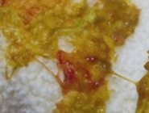
  

### 3v lapsi tuodaan tk-iltapäivystykseen. Kalpea ja veltto ja väsynyt, hengittää tiheästi ja puuskuttaen. Ollut kuumeetonta flunssaa viikon ja nyt eilisestä lähtien oksentanut useita kertoja, muussa perheessä ei gastroenteriittioireilua. Erotusdiagnostiikkaa, tarkempaa anamneesia, miten hoidat tai järjestät jatkohoidon. {#3v-lapsi-tk-iltapaivystyksessa}

  <button class="solution-button"
          data-label="Vastaus"
          data-hide-label="Piilota vastaus">
    Vastaus
  </button>
  

      
Lapsi on vaikeasti sairas, lähestytään aluksi ABCDE-mallilla. Potilas kuuluu sairaalapäivystykseen ambulanssikuljetuksella, joten sen järjestelyitä voi alkaa toteuttamaan tutkimisen ohella joku toinen. 

---

A ja B: Aloita lisähappi, arvioi hengityskuviota. Tiheä ja syvä puuskuttava hengitys ilman obstruktio-oireita viittaa vahvasti Kussmaul-hengitykseen (elimistön pyrkimys kompensoida vaikeaa metabolista asidoosia tuulettamalla hiilidioksidia pois).

C: Arvioi shokin merkit: syke, verenpaine, kapillaaritäyttöaika (CRT), lämpöraja ja pulssien voimakkuus. Avaa laskimoyhteys (kaksi i.v.-kanyylia). Jos lapsi on shokissa (matala BP, heikko pulssi, CRT > 3 s), anna nestebolus kristalloidia nopeasti. 

D: Määritä välittömästi pikaverensokeri ja ketonit. 

E: Mittaa lämpötila, tarkista ihottumat (petechiat/purpura)

---

Ensisijainen epäily lapsen oirekuvan kalpea, veltto, oksentelua, puuskuttava hengitys) perusteella on diabeettinen ketoasidoosi (DKA) puhjenneen tyypin 1 diabeteksen takia. Flunssa on voinut toimia laukaisseena tekijänä. Oksentelu ja kuivuminen yhdistettynä syvään, tiheään puuskutukseen (Kussmaul) ja tajunnan hämärtymiseen ovat DKA:n kardinaalioireita. 

Tietysti voi myös kyseessä olla sepsis, akuutti myokardiitti/sydämen vajaatoiminta, myrkytys tai jokin neurologinen hätätilanne (eism. keskushermostoinfektio). 

Pelkkä diabetesepäilykin kuuluisi päivystykseen, vaikka ei olisikaan ketoasidoosia. 

---

Tarkemmassa anamneesissa voidaan selvittää: 

<li>juominen ja pissaaminen</li>
<li>paino</li>
<li>oksentelu (sappipitoisuus) ja ulosteet</li>
<li>lääkkeet ja myrkyt</li>
<li>uloshengitysilman haju (asetoni)</li>

---

Jos Gluk on korkea ja ketonit koholla, niin kyseessä on DKA. Voidaan pitää nesteytystä yllä ja siirtää potilas ambulansilla sairaalaan, mutta ÄLÄ aloita insuliini-infuusiota terveyskeskuksessa ilman lastenlääkärin suoraa ohjeistusta. Insuliinin liian varhainen tai nopea aloittaminen ennen riittävää nesteytystä lisää hengenvaarallisen aivoturvotuksen riskiä.

Jos taas enemmänkin sepsiskuva, niin voidaan mahdollisesti aloittaa iv-ab jo ennen sairaalaan siirtoa/sen aikana, jos päivystävä lastenlääkäri näin ohjeistaa. 

  

### 4v polvikipuinen lapsi. On ontunut nyt eilisestä lähtinen ja valittaa kipua oikeassa polvessa. Miten tutkit/mitä haluat lisää anamneesista? Kerro 4 yleisintä erotusdiagnostista vaihtoehtoa ja niiden tutkimus + hoito lyhyesti. {#4v-polvikipuinen-lapsi}

  <button class="solution-button"
          data-label="Vastaus"
          data-hide-label="Piilota vastaus">
    Vastaus
  </button>
  

      
Lapsen ontuminen on aina selvittelyjä vaativa asia. Ontuminen on lapsella aina merkki jostain: kivusta, liikerajoituksesta tai mekaanisesta ongelmasta alaraajassa tai lantiossa. Lapsi ei ontu "tottumuksesta" tai syyttä, minkä vuoksi syy on aina selvitettävä – vaikka kyseessä olisi useimmiten vaaraton ja itsestään ohi menevä vaiva.

Anamneesissa: 

<li>Vamma- ja tapaturmatausta</li>
<li>Infektiotausta; onko ollut punkkia? matka-anamneesi?</li>
<li>Yleisoireet. Paikalliset tai yleistyneet infektio-oireet voivat olla merkki luun tai nivelen bakteeri-infektiosta, ja tuolloin vaaditaan päivystykselliset selvittelyt erikoissairaanhoidossa.</li>
<li>Oireiden kesto ja kulku: aamujäykkyys? pahempi/parempi rasituksen jälkeen? Alkoiko ontuminen äkillisesti/vähitellen? On tärkeää selvittää, onko ensioireena ollut kipu, ontuminen vai turvotus.</li>
  <ul>
    <li>Lapsuusiän idiopaattisessa niveltulehduksessa (lastenreuma) lapsen valittama kipu on harvoin ensimmäinen oire. Ensiksi havaitaan yleensä nivelen käytön varominen tai turvotus. Sen sijaan infektioartriitissa ja lonkan transientissa synoviitissa kipu alkaa sangen äkisti ja on usein voimakasta. Lastenreumassa ontuminen tai nivelen jäykkyys on vaikeampaa aamuisin, kun taas ei-tulehduksellisissa (ortopedisissä) nivelsairauksissa nivelen tai raajan kipu yleensä pahenee päivän mittaan ja rasituksessa.</li>
  </ul>
<li>Sukuanamneesissa tulee selvittää reumasairaudet, psoriaasi, tulehdukselliset suolistosairaudet, keliakia ja muut autoimmuunisairaudet (diabetes, MS-tauti, hypotyreoosi) sekä hemofilia.</li>

---

Statuksessa:

<li>Kuume, kontakti, yleisvointi</li>
<li>Kävely ja inspektio (lihasatrofia, turvotukset, vammajäljet). Trendelenburgin testi. Selän liikkuvuus ja ryhti.</li>
<li>Kivun ja oireiden lokaatio: Etenkin pienen lapsen on vaikea paikantaa kipua tarkkaan, joten alaraajat on syytä tutkia lonkista varpaisiin erikseen luurakenteiden ja nivelten liikkeiden osalta. Säteilykipu on tavallista (erityisesti lonkkanivelen ongelmat tuntuvat tyypillisesti kipuna reidessä tai polvessa). Tutkien etsitään mahdolliset paikalliset aristukset, turvotukset, kuumotukset ja punoitukset. </li>
<li>Iho ja imusolmukkeet: Petechiat, nokkosihottumat tai purpura (IgA-vaskuliitti / HSP), imusolmukkeet (varsinkin nivustaipeen)</li>

---

Yleisimmät lapsen nivelongelmien erotudiagnostiset vaihtoehdot (käydään nyt läpi enemmän kuin vaaditut neljä): 

<li>**Äkilliset, ohimenevät yleensä kuumeettomat niveltulehdukset (yleisimmät);** hyvä diagnosoida 1–2 päivän kuluessa</li>
  <ul>
    <li>**Lonkan transientti synoviitti (aseptinen koksiitti, coxitis simplex)**</li>
      <ul>
        <li>Lonkan nivelkalvon ohimenevä tulehdus eli transientti synoviitti on yleisin 3-10(-12)-vuotiaan lapsen ontumisen syy. Kyseessä on äkillisesti alkanut, yleensä toispuoleinen, aseptinen tulehdus. Oireena on kivulias ontuminen tai varaamattomuus. Kipu voi tuntua nivusessa tai usein tyypillisen harhaanjohtavasti polvi- tai reisikipua. Tyypillisesti lonkka on fleksiossa ja ulkorotaatiossa. Tutkittaessa erityisesti lonkan kiertoliikkeet ovat rajoittuneet.</li>
        <li>Yleisoireita ei ole, ja lasko ja CRP ovat normaalit tai vain lievästi suurentuneet.</li>
        <li>Niveltulehduslöydös vahvistuu kaikukuvauksella, ja diagnoosi varmistuu, kun oirekuva ja löydökset väistyvät muutaman päivän - parin viikon kuluessa. Hoito: lepo, NSAID; kontrolli tarvittaessa, jos oireet ei häviä 2 viikossa (harkinnan mukaan rtg). Voi uusia.</li>
      </ul>
    <li>Urtikaria-artriitti</li>
      <ul>
        <li>Urtikariaan voi liittyä myös artriitti, urtikariatulehdus nivelessä. Usein lääkkeen (+infektion) aiheuttama; klassisesti n. 5-9vrk antibioottikuurin aloituksen jälkeen (yleisimpiä kefaklori, penisilliini, amoksisilliini).</li>
        <li>Oirekuvalle on tyypillistä tietysti nokkosihottuma (kutiseva ja paikkaa vaihtava), joka voi joskus olla hemorraginenkin. Lisäksi yhden tai usean nivelen punoitus, turvotus ja liikearkuus; tyypillistä kämmenselissä ja jalkaterissä. </li>
        <li>Labroissa lasko saattaa hieman kohota. Se paranee samoin kuin iho-oirekin, antihistamiinilääkityksellä. Joskus antihistamiinilääkitystä voidaan tarvita tavanomaista suurempia annoksia.</li>
        <li>Paranee samoin kuin iho-oirekin: antihistamiinilääkityksellä. Joskus antihistamiinilääkitystä voidaan tarvita tavanomaista suurempia annoksia. Aiheuttava ab on aihetta lopettaa/vaihtaa. Oireet häviävät nopeasti, yleensä viikossa ab:n lopetuksen jälkeen.</li>
      </ul>
    <li>IgA-vaskuliitti (aikaisemmin Henoch-Schönleinin purppura)</li>
      <ul>
        <li>IgA-vaskuliitti on yleisin lasten vaskuliitti. Suomessa siihen sairastuu vuosittain noin 150–200 lasta. Sairauden tarkka syy on toistaiseksi tuntematon johtuu IgA-immunokompleksien kertymisestä verisuonten seinämään. _Yleensä syttyy ylähengitysteiden infektion jälkeen, mikä lisää IgA:n tuotantoa._</li>
        <li>IgAV:n tyypillisiä oireita ovat verenpurkaumat eli petekiat (100 %) etenkin alaraajojen ja pakaroiden iholla, ja isojen nivelten kivut ja turvotus (70–80 %), suolisto-oireet (40–60 %), lähinnä vatsakipu ja harvemmin oksentelu ja veriulosteet sekä munuaisoireet, lähinnä hematuria ja proteinuria (30–40 %). _Ns. klassinen triadi on siis palpoitava purppura (ei haalistu painettaessa) yleensä raajoissa ja pakaroissa + nivel- ja/tai vatsakipu + hematuria._</li>
        <li>IgAV:n diagnoosi tehdään kliinisten oireiden perusteella. Erotusdiagnostisina vaihtoehtoina on syytä huomioida muut ihon verenpurkaumia aiheuttavat sairaudet, kuten sepsis, veren hyytymishäiriöt ja maligniteetit. **IgAV:n hoito on oireenmukainen eikä spesifistä lääkehoitoa ole.** Valtaosalla potilaista oireet häviävät itsestään n. viikossa ilman erityistä hoitoa, mutta uusia petekioita voi ilmaantua ja vatsakivut jatkua joskus useita viikkoja. _Mikäli potilaalla on hankalat nivel- ja/tai suolisto-oireet, voidaan hoitona käyttää pieniannoksista glukokortikoidihoitoa laskevin annoksin neljän viikon ajan._ Valtaosalla potilaista esiintyy myös munuaislöydöksiä, joiden vaikeusaste on erittäin vaihteleva. Yleisimmin esiintyy ohimenevää mikroskooppista tai makroskooppista hematuriaa. Pienelle osalle potilaista voi tulla **etenevä glomerulonefriitti ja/tai akuutti munuaisvaurio, joka edellyttää pikaista munuaisbiopsian ottoa ja hoidon aloitusta pysyvän munuaisvaurion estämiseksi.** Näissä tilanteissa hoitona käytetään yleisimmin glukokortikoidihoitoa ja siklosporiinia. IgAV-nefriitti johtaa vaikeaan krooniseen munuaisten vajaatoimintaan 2–5 % kaikista potilaista.</li>
      </ul>
    <li>Parvovirusartriitit, pogostavirusartriitit</li>
  </ul>
<li>**Pitkittyvät hitaasti kehittyvät niveltulehdukset;** eivät edellytä tarkkaa diagnostiikkaa päivystysaikana (tosin jos kuumetta niin yleensä tarvitaan). Jos oireet ovat kestäneet yli 2 viikkoa, tutki tumavasta-aineet sekä streptokokki- (AST ja StrDNAb), salmonella-, kampylobakteeri-, yersinia- ja borreliavasta-aineet.</li>
  <ul>
    <li>Reaktiivinen niveltulehdus (streptokokki-infektion jälkeen tai entero- tai uroartriitti)</li>
      <ul>
        <li>Reaktiiviset artriitit ovat selvästi harvinaisempia lapsilla kuin aikuisilla ja harvoin ilmentyy alle kouluikäisillä.</li>
        <li>Yleensä affisioi isoja niveliä - sairaat nivelet voivat migratorisesti vaihtaa paikkaa. Nivelet ovat usein erittäin kipeitä ja tautiin voi liittyä usein kuumeilua. Reaktiivinen artriitti tunnettiin aikaisemmin osana Reiterin oireyhtymää, joka syntyy vasteena infektiolle muualla kehossa. Klassiseen triadiin kuuluu varsinkin GU-kanavan infektion kautta: suurten nivelten (useimmiten SI-nivelen tai polven) inflammatorinen artriitti, konjunktiviitti/uveiitti ja uretriitti/servisiitti (can't see, can't pee, can't climb a tree → uveitis, urethritis, arthritis). </li>
        <li>Laukaisevana tekijänä yleensä suoliston tai harvoin hengitysteiden infektio (tietysti murrosikäisillä myös seksitaudit): salmonella, kampylobakteeri, yersinia tai A-ryhmän streptokokki (ns. post-streptokokkaalinen artriitti) tai Chlamydia pneumoniae. Reaktiivinen artriitti alkaa tyypillisesti n. 1–4 viikon kuluttua edeltävästä infektiosta.</li>
        <li>Lasko koholla, harkinnan mukaan otettu HLAB27 olisi positiivinen (lisää riskiä niveltulehdukselle) n. 50%:lla. </li>
        <li>Yleensä GI-infektioiden aiheuttamaan enteroartriittiin ei tarvita ab-hoitoa; pääsääntöisesti vain jos ripulia edelleen esiintyy ja ulosteviljely on positiivinen. Streptokokki-infektiossa ab aiheellinen yleensä. Seksitaudin laukaisemassa artriitissa tietysti tulee aina hoitaa tauti antibiooteilla (klamydian tapauksessa atsitromysiini 1000mg kerta-annoksena tai doksisykliini 100mg x2 7vrk ajan)</li>
      </ul>
    <li>Lymen artriitti</li>
      <ul>
        <li>Borrelian mahdollisuus niveltulehduksen etiologiassa tulee muistaa. _Borrelia-niveltulehdus on yleensä yhden suuren nivelen, erityisesti polven infektioita._ Artriitti kehittyy yleensä vasta muutaman kk kuluttua infektion alkamisesta. Kehittyy n. 3-5% potilaista, jos primaarivaihe jää hoitamatta (usein punkinpuremaa tai rengasihottumaa ei havaittu/sitä ei edes kehittynyt). Tavallisin myöhäisvaiheen borrelioosin ilmentymä lapsilla. Nivelborrelioosia voi esiintyä mihin aikaan vuodesta tahansa.</li>
        <li>Borrelia-artriitin yhteydessä seerumin IgG-borreliavasta-aineet ovat selvästi koholla (diagnoosissa tärkeintä on siis artriitti+borrelia-IgG-positiivisuus), tarvittaessa nivelnesteen PCR-geenimonistustestiä voidaan myös käyttää. Yleensä ei kuumetta; tulehdusarvot korkeintaan kohtalaisesti suurentuneet.</li>
        <li>Hoito erikoissairaanhoidossa (infektiolääkäri/reumatologi). Myöhäisessä Lymen artriitissa antibioottivalinta on amoksisilliini/doksisykliini, jota annetaan 4 viikon ajan; jos jatkuu edelleen tämän jälkeen niin iv-keftriaksoni-harkinta.</li>
      </ul>
    <li>Lastenreuma</li>
      <ul>
        <li>Lastenreumaksi kutsutaan alle 16 vuoden iässä alkanutta pitkäaikaista niveltulehdussairautta, jolle ei löydy muuta selitystä -- toiselta nimeltään onkin juveniili idiopaattinen artriitti (JIA). Diagnostisissa kriteereissä niveltulehdus (yhdessä tai useammassa nivelessä) on kestänyt yhtäjaksoisesti vähintään 6 viikkoa ja muut niveltulehduksen syyt on poissuljettu. Tarkempi tautityyppi määräytyy ensimmäisten 6kk aikana. Tarkkaa etiologiaa ei tunneta, perinnöllinen alttius isossa roolissa (esim. HLA-assosiaatiot; sisarusten riski sairastua  n. 15-30-kertainen terveeseen normaaliväestöön verrattuna), mutta tarvitaan jokin laukaiseva tekijäkin (identtisistä kaksosistakin vain 25-40% sairastuu).</li>
        <li>Ei ole yksittäinen sairaus, vaan luokitellaan seitsemään alatyyppiin. Yleisin (n. 47%) on oligoartriitti (6 kk taudin alusta ≤ 4 niveltä; tosin voi olla ns. leviävä oligoartriitti, jossa 6kk jälkeen ≥5 niveltä). Toiseksi yleisin (n. 19%) on reumatekijänegatiivinen polyartriitti (6 kk sisään ≥5 niveltä). Sitten tulee yleisoireinen artriitti (kuume, ihottuma), reumatekijäpositiivinen polyartriitti, entesiitteihin liittyvä artriitti (sisältää lastenselkärankareuman), psoriaasiartriitti ja muu artriitti.</li>
        <li>Alatyyppien erityispiirteet ja varsinkin vastaaviin aikuisten reumasairauksiin liittyvät piirteet ilmenevät usein vasta murrosiässä, ja siksi erityisesti pienillä lapsilla alatyyppejä voi taudin alkuvaiheessa olla hankala erottaa. Lastenreuma ei siis ole aina erityisenkään samankaltainen kuin aikuisten reuma -- varsinkin pieni lapsi ei useinkaan valita kipua. Alku on moninivelinen vain 10-30%:lla. Tulehdus nivelessä voi aiheuttaa kasvohäiriöitä: voi häiritä pituuskasvua kyseisessä nivelessä (-> heikko kasvu alueella (esim. leuassa pienileukaisuus (usein toispuoleinen leukanivelen affisioituminen) ja leuan vetäytyminen taakse, voi olla vaikeaa avata suuta -> hammaslääkärille seurantaan purennan ja kasvun optimoimiseen) tai varsinkin polven alueella voi nopeuttaa kasvua -> pituusero ja valgusvirheasento alaraajassa).</li>
        <li>Lastenreumaan liittyy usein etuosan uveiitti/iriitti (krooninen värikalvontulehdus) ja kaikki niveloireiset lastenreumaepäilyt lähetetään silmälääkärille, hoitamattomana voi aiheuttaa näön hekkenemistä; alku voi olla hidas ja tauti oireeton, joten tutkimuksi tarvitaan. Jos taas niveloireettomalla lapsella on etuosan uveiitti, niin silmälääkäri lähettää lastenreumaselvittelyihin, koska 80%:iin tapauksista liittyy lastenreuma (10%:lla todetaan ennen niveltulehdusta). Uveiitti voi olla hyvin vaikeahoitoinen.</li>
        <li>Lastenreuman hoito alkaa lastenreumatologin tai sairauden hoitoon perehtyneen lastenlääkärin toimesta heti, kun muut syyt on poissuljettu ja diagnoosi on varma tai siitä on vahva epäily. Ennen kuin voidaan olla täysin varmoja diagnoosista täytyy muut syyt saada poissuljettua. Hoito tulehduskipulääkkeellä ja nivelten glukokortikoidi-injektioilla voidaan kuitenkin yleensä aloittaa heti. Lastenreuman lääkehoidon tavoitteena on tulehduksen täydellinen rauhoittuminen, remissio. Kipuun NSAIDit (esim. naprokseeni, koska pitkävaikutteinen), alkuhoitoon nivelinjektiot usein ja systeemistä glukokortikoidia voidaan harkita (varsinkin yleisoireisessa tyypissä, muuten harvoin). Perinteisiä reumalääkkeitä käytetään usein ensilinjassa, metotreksaatista eniten näyttöä, muitakin käytetään. Mikäli niveltulehduksia ei saada rauhoittumaan metotreksaatilla ja nivelen sisäisillä glukokortikoidi-injektioilla, voi toinen perinteinen reumalääke tulla kyseeseen ja tällöin usein aletaan käyttää biologisia reumalääkkeitä (TNF-alfasalpaajat, JAK-estäjät, IL-estäjät...). </li>
        <li>Ennuste on parantunut, mutta ollaan edelleen kaukana ideaalitilanteesta (41%:lla aktiivitauti / lääkitys 30 v kuluttua diagnoosista; 28%:lla korkea taudin aktiviteetti; 20%:lle potilaista biologisella lääkehoidollakaan ei saavuteta riittävää vastetta). </li>
      </ul>
  </ul>
<li>**Septinen artriitti / osteomyeliitti; nopeasti alkavat kuumeiset niveltulehdukset -> sairaalapäivystyksessä diagnostiikka nopeasti**</li>
  <ul>
    <li>Märkäinen niveltulehdus (septinen artriitti) ja luumätä (osteomyeliitti) aiheuttavat kuumeen ja kivuliaan ontumisen. Ne tulee diagnosoida ja hoitaa päivystyksellisesti, joten epäilyn herätessä lapsi on herkästi lähetettävä erikoissairaanhoitoon.</li>
    <li>Oireena on yhden nivel- tai luualueen kipu, usein korkea kuume ja huonovointisuus. Oireisto alkaa yleensä nopeasti. Lapsi kieltäytyy käyttämästä jalkaa, passiiviset liikkeet ovat kivuliaat, tulehdusalue on palpaatioarka ja se voi punoittaa tai turvottaa. Erityisesti pienillä lapsilla oireet voivat olla epämääräisiä (varaamattomuus, ärtyisyys, itkuisuus, huono yleiskunto).</li>
    <li>Verikokeissa CRP ja valkosolutaso ovat koholla, mutta hoitoratkaisussa kliininen kuva on yksittäistä verikoetulosta tärkeämpi. Ensisijaista on tutkia veriviljely. Septisessä artriitissa nivelnestenäyte on hyödyllinen, mutta sen ottaminen ei aina ole ongelmatonta (otetaan usein anestesiassa tai ilokaasuanestesiassa). Kaikukuvaus voi näyttää niveltulehduksen ja mahdollisesti osteomyeliittiin viittaavia löydöksiä. Magneettikuvaus auttaa diagnostiikassa ja tulehduksen laajuuden arvioinnissa.</li>
    <li>Jos yksikään seuraavista ehdoista ei täyty, on septisen artriitin todennäköisyys < 1%: kuumeilu (> 38,5◦C), CRP > 20, leuk > 12 ja täysi jalalle varaamattomuus. CRP < 20 mg/l ja lasko < 20 mm/h lähes poissulkevat septisen infektion, jos oireiden alusta on 1–2 vrk. Lähetä raajaoireinen potilas sairaalaan diagnostista näytteenottoa varten ennen mikrobilääkityksen aloitusta, jos septistä infektiota ei voi poissulkea.</li>
    <li>Lapsella infektion aiheuttaa useimmiten hematogeenisesti luuhun tai niveleen kulkeutuva patogeeni. Yleisimmät aiheuttajat ovat Staphylococcus aureus (erityisesti osteomyeliitissä), pneumokokki, A-ryhmän streptokokki ja rokottamattomilla Haemophilus influenzae tyyppi B.</li>
    <li>Mikrobilääkehoito aloitetaan suonensisäisesti, kun asianmukaiset näytteet on otettu. Klindamysiini 40 mg/kg/vrk tai 1. polven kefalosporiini 150 mg/kg/vrk jaettuna neljään annokseen. Suun kautta annosteluun voidaan yleensä siirtyä 2–4 päivän jälkeen. Hoidon pituus on 20 päivää osteomyeliitissä ja 10–14 päivää septisessä artriitissa. Suurin osa potilaista toipuu täysin, jos hoito aloitetaan ajoissa. Pelättyjä komplikaatioita ovat mm. krooninen osteomyeliitti, patologiset murtumat, nivelruston tuhoutuminen ja reisiluun pään aseptinen nekroosi.</li>
  </ul>
<li>Muuhun tautiin liittyvä niveloire tai -turvotus</li>
  <ul>
    <li>Kawasakin tauti</li>
      <ul>
        <li>Diffuusi käsi/jalkaturvotus on yksi diagnostisissa kriteereissä arvioitavia raajaoire, mutta näiden diagnostisten oireiden ulkopuolella isojen nivelien affisioituminen on myös yleistä ja varsinkin isojen nivelien nivelkivut ovat tyypillisiä.</li>
      </ul>
    <li>Tulehdukselliset suolistosairaudet (IBD), keliakia</li>
      <ul>
        <li>IBD liittyy jopa 20%:lla artriittia. Usein selkärankareumatyyppinen niveltauti (sakroiliittiä, alaraajojen niveltulehduksia, entesiittejä...)</li>
        <li>Keliakia voi aiheuttaa usein nivelkipuja. Tietysti on kohonnut riski myös muille autoimmuuniartriiteille ja imeytymishäiriöiden kautta TULES-vaurioille.</li>
      </ul>
    <li>Hematologiset sairaudet</li>
      <ul>
        <li>Leukemiamahdollisuus tärkeää tutkia ainakin ottamalla verenkuva</li>
        <li>Hemofilia voi aiheuttaa esim. veripolvea; sirppisoluanemiaan voi liittyä sirppisolukriisejä</li>
      </ul>
  </ul>
<li>Maligniteetit (primääriset luukasvaimet / metastaasit)</li>
  <ul>
    <li>Lapsilla yleisin lokaatio luukasvaimille on polven ympäristö. Yleisin lasten maligni primaarinen luutuumori on osteosarkooma ja toiseksi yleisin on Ewingin sarkooma.</li>
  </ul>
<li>Trauma / Ortopediset syyt</li>
  <ul>
    <li>Jalkapohjan vierasesine (hyvä aina tarkastaa jalkapohjat ontuvilta pikkulapsilta</li>
    <li>Murtumat -- alaraajojen kaikkien osien murtumat ja useat lantion alueen murtumat voivat aiheuttaa ontumista. Natiiviröntgenkuva on raajojen murtumadiagnostiikan kulmakivi.</li>
    <li>Apofysiitit -- Apofyysit ovat luiden rustoisia kasvualueita, joihin kiinnittyy lihaksia ja jänteitä. Toistuva vetorasitus näille alueille voi aiheuttaa kiputilan eli apofysiitin, joka ilmenee ontumisena; esim. polven alueella Osgood-Schlatterin tauti (hoidetaan yleensä levolla ja kivunhoidolla). Apofyysin rustokudoksen kiputila, osteokondroosi/osteokondriitti, on lasten ja nuorten rasitusperäisten alaraajakipujen aiheuttajana tavallinen. Varsinkin polven alueella on ns. osteochondritis dissecans, jossa nivelrusto ja sen alainen luu vaurioituu paikallisesti, jolloin kantavalta nivelpinnalta hitaasti irtoaa osteokondraalinen kappale. Osteokondriitti oireilee usein kipuna etenkin rasitukseen liittyen; kipu lisääntyy vähitellen. Myös pettämisen tunne, liikerajoitus ja turvotus polvessa on yleistä. Pidemmälle edetessä voi aiheuttaa lukko-oireen. Diagnoosi tehdään usein röntgenkuvan perusteella, mutta hoidon suunnitteluun tarvitaan yleensä myös magneettikuvantaminen, josta voidaan myös arvioida, onko nivelrusto pesäkkeen päällä ehjä. Suuri osa paranee kuormitusta vähentämällä seurannassa muutamien kuukausien aikana, ja toimenpiteitä tarvitaan harvoin (joskus kokonaan irronneet kiinnitetään tai poistetaan).</li>
    <li>Ontumista aiheuttava ortopedinen akuuttitilanne on reisiluun pään epifyseolyysi. Siinä reisiluun pää murtuu liukuen kasvulevyä pitkin. Tauti voi kehittyä vähitellen, asteittain tai äkisti, ja se voi liittyä myös lievään vammaan. Epifyseolyysi on yleisin nopean kasvun vaiheessa yli 10-vuotiailla lapsilla, ja ylipaino sekä kasvuhormonihoito ovat sen riskitekijöitä. Kipu voi olla huonosti paikantuva ja tuntua lonkassa, nivusessa, reidessä tai jopa vastakkaisen puolen lonkassa. Lonkka hakeutuu ulko- kiertoon, ja sisäkierto sekä koukistus ovat rajoittuneita. Trendelenburgin testi voi olla positiivinen. Noin 10 % epifyseolyyseistä on epästabiileja, jolloin painon varaaminen ei onnistu. Epäilyn herätessä tarvitaan molempien lonkkien röntgenkuvaus AP- ja Lauenstein-projektioissa. Tilanne vastaa reisiluun kaulan murtumaa: potilas lähetetään päivystyksellisesti lastenortopediseen yksikköön. Potilaalle annetaan kyynärsauvat ja häntä ohjeistetaan olemaan varaamatta kipeälle raajalle. Hoito on aina kirurginen: ensisijaisesti liukuman sulkeinen paikalleen asetus ja ruuvikiinnitys.</li>
    <li>(Legg-Calvé-)Perthesin tauti on melko harvinainen reisiluun pään luu- ja rustokudoksen vaurio (reisiluun luutumistumake menee kuolioon epäselvästä syystä, verenkierto palautuu itsestään), jonka tärkein oire on kipuontuminen. Taudinkuva muistuttaa lonkan ohimenevää synoviittia, mutta oireilu alkaa hitaammin ja kestää pitkään. Oireena on ajoittaista tai rasituksessa tuntuvaa lonkkakipua, johon lepo auttaa. Kipu voi tuntua nivusen, reiden tai polven alueella. Tautia esiintyy 5-12-vuotiailla ja pojilla jopa viisi kertaa enemmän kuin tytöillä. Trendelenburgin testi on positiivinen ja lonkka voi olla sisärotaatiossa. Röntgentutkimus varmistaa diagnoosin. Tauti paranee ajan kanssa itsestään. Perthesin taudin hoito kuuluu erikoissairaahoitoon. Lähete tehdään kiireellisenä (ei päivystyksellisenä)</li>
    <li>Leikki-ikäisellä kivuttoman ontumisen voi aiheuttaa epävakaasta lonkasta johtuva lonkkanivelen rakennepoikkeavuus (dysplasia). Lonkan loitonnus on rajoittunut, alaraajoissa voi olla pituuspuolieroa ja Trendelenburgin testi on positiivinen. Röntgenkuva on diagnostinen. </li>
    <li>Myös alaraajojen pituuspuoliero voi olla kivuttoman ontumisen taustalla. Tämä tutkitaan asettamalla potilaan seistessä lyhyemmän jalan alle mittalautoja, kunnes lantio asettuu vaakasuoraan.</li>
  </ul>
<li>Neurologiset syyt; ontuminen on harvoin neurologisen sairauden ensioire, vaikka kävelemisen häiriöt ovat yleisiä mm. CP-vammassa, neuromuskulaarisissa sairauksissa ja perifeerisissä neuropatioissa</li>

Jos lapsella ei ole yleisoireita eikä mitään poikkeavia tutkimuslöydöksiä, voidaan tilannetta seurata. Mikäli selvää kipukohtaa tai muutoin paikantuvaa ongelmaa ei löydy, diagnoosi ei ole aivan selvä ja oire on pitkittynyt, lapsi tulee lähettää erikoissairaanhoitoon. 

Jos alla olevan kuvan tutkimuksissa todetaan poikkeava löydös, on oireisen alueen röntgenkuvaus aiheellinen. Poikkeuksena tyypillinen rasitusapofysiitti ja lonkan transientti synoviitti

Kaikututkimuksella voidaan selvittää erityisesti lonkkanivelen nesteilyä, pehmytkudosten muutoksia ja mahdollisia vierasesineitä.

Selvä nivelen turvotus tai liikerajoitus ilman poikkeavaa röntgenlöydöstä viittaa niveltulehdukseen

  

### Kuivuma-nestehoitotehtävä. Ripuloinut nyt eilisestä klo 22. Ei kliinisiä kuivuman merkkejä, ihon turgor normaali ja limakalvot kuivat. Paino 9800g. Nestehoidosta, iv nestehoidosta, ripulin kotihoito-ohjeistuksesta ja kuivuman määrän/asteen arvioinnista kysymyksiä. {#Kuivu-nestehoitotehtava}

  <button class="solution-button"
          data-label="Vastaus"
          data-hide-label="Piilota vastaus">
    Vastaus
  </button>
  

      
Yleisin syy lapsen kuivumalle on virus-gastroenteriitti. Arviossa tärkeää on tietysti anamneesi ja status sekä vitaalien tarkistaminen. Elektrolyyttiarvot ovat yleensä normaalit, jonka takia niitä ei voida käyttää kuivuman vaikeuden arviossa. Kuitenkin jos tarvitaan suonensisäistä nesteytystä, verikaasuanalyysi ja elektrolyytit (K, Na) on hyvä tarkistaa; hyväkuntoiselta lapselta ei yleensä tarvita verikokeita virustautiepäilyissä.

---

Kuivuman vaikeus voidaan jakaa lievään (3-5%), keskivaikeaan (6-10%) ja vaikeaan (9-15%). Arviossa käytetään alla olevan taulukon löydöksiä. _Paras objektiivinen mittari on kuitenkin painon muutos (jos tuore vertailupaino on tiedossa)._

Lapsen kuivuma on todennäköisesti **lievä,** jos ei mitään kliinisiä kuivuman merkkejä.

---

Vaikeat kuivumat (ja yleensä jo yli 8% kuivumat) kuuluvat erikoissairaanhoitoon ja tarvittaessa suonensisäiseen nestehoitoon. Iv-nestein korjaus ja ylläpitonesteytys rinnan. Tässä ei todennäköisesti ollut kyse vaikeasta kuivumasta.

Jos lapsen kuivuman aste oli vain lievä, niin tila voidaan hoitaa perusterveydenhuollossa. Kuivuman hoito suun kautta (tai tarvittaessa nenämahaletkun kautta) toteutettavalla nesteellä, esimerkiksi oraaliset rehydraatiojuomat (ORS-liuos). **Kuivuman korjauksessa ORS-liuosta (oral rehydration solution, Suomessa Osmosal®-jauhe oraaliliuosta varten sekä Floridral®, ravintolisä) annetaan n. 1.3-1.5 × kuivuman määrä / painon lasku (esim. jos lapsi painaa nyt n. 10kg ja kuivuma on n. 5% eli 500g, niin korjauksena 650-750ml) hitaasti (pienet kerta-annokset eivät laukaise oksennusta yhtä herkästi kuin kerralla juotu iso määrä) 4–6 t:n (ad 10t) aikana.** Juoma voidaan antaa pullosta, lasista, lusikalla tai ruiskulla. Monet lapset ottavat juoman mieluimmin kylmänä. Kuivuman korjauksen jälkeen siirrytään lapsen normaaliin ravintoon. Rintalapsen imetystä jatketaan taudin keston ajan normaalisti. Jos kuivuman korjaus ei onnistu kotona, se onnistuu usein nenämahaletkuun annettavalla ORS-liuoksella terveyskeskuksen tai sairaalan päivystyspoliklinikalla; oksentelevatkin lapset sietävät yleensä hitaan nesteytyksen nenämahaletkun kautta. Kuivuman korjauksen jälkeen lapsi tutkitaan ja punnitaan ja voidaan yleensä päästää kotiin jatkohoitoon.

Ripulin jatkuessa voidaan ORS-liuosta antaa 30 ml/kg kerran vrk:ssa tai 0.5 dl jokaista ripuliulostetta kohti alle 2-vuotiailla ja 1 dl jokaista ripuliulostetta kohti yli 2-vuotiailla. Lapsen normaalia ylläpitonesteytystä ei tule unohtaa gastroenteriittiä hoidettaessa. Lapsen normaali vuorokautinen nestetarve on

<li>1–10 painokilolle 100 ml/kg</li>
<li>11–20 painokilolle 50 ml/kg</li>
<li>20:n ylittäville painokiloille 20 ml/kg</li>
<li>Esim. 26-kiloisen ylläpitonestetarve on 10 × 100 ml + 10 × 50 ml + 6 × 20 ml = 1 620 ml</li>

---

Kotiutettaessa kerro perheelle taudin todennäköinen kesto ja selkeät kotihoito-ohjeet nesteytysmäärineen (pelkkää vettä tai sokerisia mehuja ei kannata juoda, sokeri vetää suoleen vettä ja pahentaa ripulia, eikä niissä ole tarpeeksi suoloja). 

<li>Virusperäinen gastroenteriitti kestää yleensä 2–7 vrk, rotavirustauti joskus kauemmin</li>
<li>Muista informoida perhettä taudin tartuttavuudesta ja kotihoitoajoista ennen päiväkotiin tai kouluun palaamista (pääsääntöisesti 2 oireetonta päivää)</li>
<li>Jos lapsi ei ala virkistyä tai väsähtää lisää tai ei virtsaa esim. yli 6-8 tuntiin, kehota ottamaan uudelleen yhteyttä</li>

  

### Vesirokkorokotteesta kaikenlaista. Onko tehokas? Minkä tyyppinen rokote? Mitkä on vesirokon oireet? Mitä komplikaatioita vesirokolla voi olla? {#Verirokkorokotteesta-kaikenlaista}

  <button class="solution-button"
          data-label="Vastaus"
          data-hide-label="Piilota vastaus">
    Vastaus
  </button>
  

Rokote sisältää elävää, heikennettyä varicella-zoster-virusta (Oka-kantaa). Koska kyseessä on elävä rokote, sitä ei tule antaa raskaana oleville eikä henkilöille, joilla on vaikea immunologinen puutostila (esim. solunsalpaajahoito tai vaikea immuunipuutos).

Vesirokkorokote tuli Suomen kansalliseen rokotusohjelmaan syyskuussa 2017. Perusrokotussarjaan kuuluu kaksi annosta, annetaan neuvolassa 1,5-vuotiaille ja 6-vuotiaille (tällöin osana MPRV-yhdistelmärokotetta). Rokote on erittäin tehokas ja kaksi annostaa nostaa tehon yli 93 %:iin ja antaa käytännössä 100-prosenttisen suojan vakavia tautimuotoja vastaan. 

---

Vesirokon aiheuttaja on **varicella zoster viruksen** (VZV) aiheuttama tauti.

<li>Noin kahden viikon kuluttua tartunnasta vesirokkovirus aiheuttaa **kuumeen ja tyypillisen ihottuman. Rakkulaihottumassa voidaan nähdä samanaikaisesti eri kehitysvaiheissa olevia ihomuutoksia.** Alkuvaiheen makuloista kehittyy papuloita ja sitten varsinaisia kirkkaita ja sameita rakkuloita, jotka rupeutuvat taudin parantuessa. Iholla voi yhtä aikaa olla useita satoja eri vaiheissa olevia ihomuutoksia. Vesirokkomuutoksia voi kehittyä myös suun ja silmien limakalvoille. Taudin ihottumavaihe kestää noin viisi päivää. Vesirokkoihottuma on keskittynyt vartalon ja pään alueelle toisin kuin esimerkiksi enterorokossa, jossa usein kämmenissä ja jaloissa on eniten ihottumamuutoksia. On tartuttava 1-2vrk ennen ihottumaa ja kunnes rakkulat rupeutuneet.</li>
<li>Komplisoitumaton taudinkuva terveellä henkilöllä ei yleensä edellytä diagnostisia laboratoriotutkimuksia. Tarvittaessa muissa tilanteissa voidaan ottaa PCR-näyte rakkulaeritteestä/-pohjasta.</li>
<li>**Komplikaatiot tulee pitää mielessä:**</li>
  <ul>
    <li>Sekundaariset ihon bakteeri-infektiot (S. aureus, GAS, nekrotisoiva faskiitti); tälle atooppinen iho altistaa entisestään ihon suojabarrieria häritsemällä</li>
    <li>Meningoenkefaliitti</li>
    <li>Keuhkokuume: Erityisen vaarallinen komplikaatio, joka on yleinen aikuisiällä sairastetuissa vesirokoissa</li>
    <li>Ohimenevä pikkuaivoataksia (post-infektioosi pikkuaivotulehdus päiviä-kuukausia infektion jälkeen; paranee spontaanisti)</li>
    <li>Sikiövauriot: Jos odottava äiti sairastuu alkuraskauden aikana, lapsella on riski saada synnynnäinen vesirokko-oireyhtymä, joka aiheuttaa vakavia kehityshäiriöitä</li>
    <li>Vyöruusu myöhemmällä iällä: Kun henkilö on sairastanut vesirokon, virus jää pysyvästi lepotilaan kehon hermosolmuihin. Vuosikymmeniä myöhemmin elimistön puolustuskyvyn heiketessä se voi aktivoitua uudelleen aiheuttaen erittäin kivuliaan vyöruusun.</li>
  </ul>

---

Suurin osa väestöstä ei ole siis saanut rokotetta, vaan sairastanut taudin lapsuudessa. Korkeintaan 1-3 prosenttia aikuisväestöstä ei ole sairastanut vesirokkoa, joten rokotustarve on hyvin vähäinen. Jos henkilö ei ole sairastanut vesirokkoa tai saanut kahta rokoteannosta (vähintään 3 kuukauden välein), täydennä rokotussuoja. Lähes kaikki 50 vuotta täyttäneet ja sitä vanhemmat ovat sairastaneet vesirokon, eivätkä tarvitse rokotetta. Jos lapsi on sairastanut vesirokon hyvin lievänä alle vuoden ikäisenä, hän saattaa saada vesirokon uudelleen. Siksi myös näille lapsille suositellaan kahta vesirokkorokotusta. Jos vesirokon on sairastanut yli yksivuotiaana lievänä, ei rokotuksia tarvita. Vanhempien antama tieto siitä, onko lapsi sairastanut vesirokon, on yleensä luotettava. Vesirokon sairastaneen rokottamisesta ei ole haittaa, mutta immuunipuutteisen rokottamisesta päättää lääkäri.

  

## 2016 

### Toimit terveyskeskuslääkärinä lastenneuvolassa. Vastaanotollesi tulee kuuden viikon ikäinen tyttövauva. Hän on ollut tähän saakka täysimetyksellä, kasvanut, kehittynyt ja voinut hyvin. Statusta tehdessä huomaat, että femoralispulssit eivät palpoidu lainkaan. {#Lastenneuvolassa-femoralispulssit-puuttuu}

- a. Mitä anamnestisia tietoja kysyt varhaisvaiheista?
- b. Mitä muuta tutkit statuksessa?
- c. Mitä tutkimuksia haluat tehdä?
- d. Työdiagnoosi
- e. Mikä jatkohoito, jos sitä tarvitaan

  <button class="solution-button"
          data-label="a"
          data-hide-label="a - Piilota vastaus">
    a
  </button>
  

Oireeton tai vähäoireinen synnynnäinen sydänvika voi paljastua rutiinitarkastuksessa. Puuttuvat tai hyvin heikosti tuntuvat femoralispulssit (nivuspulssit) imeväisellä ovat hälyttävä löydös.

Vaikka vauvan kerrotaan voineen hyvin, on tärkeä seuloa piileviä sydämen vajaatoiminnan merkkejä:

<li>Syöminen: Väsyykö vauva rinnalla? Hikoileeko hän voimakkaasti imiessään?</li>
<li>Hengitys: Onko hengitys ollut tiheää tai raskasta levossa tai syödessä?</li>
<li>Ihon väri: Onko esiintynyt kalpeutta, harmautta tai sinisyyttä?</li>
<li>Virtsaaminen: Kasteleeko vauva vaippoja normaalisti?</li>
<li>Suku- ja raskausanamneesi: Onko suvussa synnynnäisiä sydänvikoja? Oliko raskaus- tai synnytysaikana jotain poikkeavaa?</li>

  

  <button class="solution-button"
          data-label="b"
          data-hide-label="b - Piilota vastaus">
    b
  </button>
  

Statuksessa selvitetään sydämen kuormittumista ja perifeerisen verenkierron tilaa: 

<li>Yläraajojen pulssit: Kokeile a. radialis tai a. brachialis. Ovatko ne poikkeavan voimakkaat (ns. "paukkuvat" pulssit) verrattuna puuttuviin nivuspulsseihin?</li>
<li>Sydämen auskultaatio myös selän puolelta: Kuuluuko sivuääntä? Tarkista myös syke ja rytmi.</li>
<li>Keuhkojen kuuntelu ja hengitystaajuus: Onko merkkejä keuhkopöhöstä (rahinoita) tai tihentyneestä hengityksestä?</li>
<li>Maksan palpointi: Onko maksa suurentunut?</li>
<li>Perifeerinen verenkierto: Tarkista hiussuonitäyttöaika ja ihon lämpörajat. Onko ylä- ja alavartalon välillä sävyeroa?</li>

  

  <button class="solution-button"
          data-label="c"
          data-hide-label="c - Piilota vastaus">
    c
  </button>
  

Happisaturaatio oikeasta kädestä ja alaraajasta. Verenpaineen mittaus (neliraaja- tai vähintään kaksiraajaverenpaineina), jos laitteisto sallii. EKG jos mahdollista. UKG (mutta se vasta sairaalassa)
  

  <button class="solution-button"
          data-label="d"
          data-hide-label="d - Piilota vastaus">
    d
  </button>
  

Työdiagnoosina aortan koarktaatio --  puuttuvat femoralispulssit ovat tämän vian tyyppioire. Ahtauma sijaitsee tyypillisesti aortankaaressa vasemman solisvaltimon (a. subclavia sin.) haarautumiskohdan ja valtimotiehyen (ductus arteriosus) liittymiskohdan paikkeilla. Verenpainemittauksissa näkyisi, että oikean yläraajan paine on >10mmHg suurempi kuin alaraajan. 
  

  <button class="solution-button"
          data-label="e"
          data-hide-label="e - Piilota vastaus">
    e
  </button>
  

Koska kyseessä on potentiaalisesti hengenvaarallinen sydänvika, vauva tarvitsee päivystyksellisen lähetteen sairaalaan lastenlääkärin / lastenkardiologin arvioon. Kannattaa soittaa päivystävälle lastenlääkärille ennen potilaan siirtoa.

Vastasyntyneen valtimotiehyestä riippuvaisen eli ns. kriittisen koarktaation ensisijainen hoito on leikkaushoito. Muissa kuin valtimotiehyestä riippuvaisissa koarktaatioissa toimenpideindikaationa on yli 20 mmHg:n paine-ero ylä- ja alaraajojen välillä tai oireet. Leikkaushoidon vaihtoehtona isolla lapsella on perkutaaninen hoito (pallolaajennus +/- stenttaus) katetritekniikalla.  

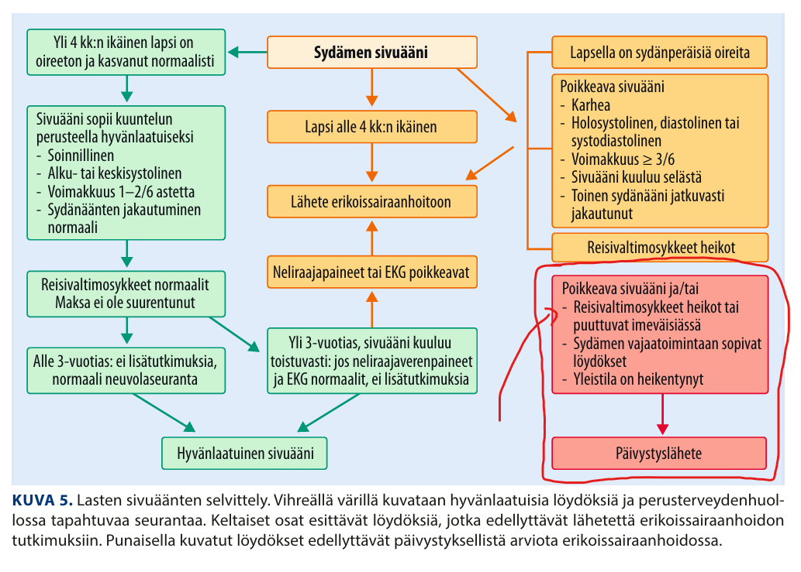
  

### Vastaanotollasi on 5kk:n ikäinen täysimetyksellä oleva vauva, jolle kuukausi sitten ilmaantui punoittavaa ihottumaa aluksi kasvoille, sitten myös vartalolle. Ihottuman puhkeamisen jälkeen lapsi on nukkunut yöt huonommin ilmeisesti kutinan takia. {#Taysimetetylla-punoittavaa-ihottumaa}

- a. Mikä ihottuma todennäköisimmin kyseessä?
- b. Annatko joitakin ruokavalio-ohjeita ihottuman takia? Jos annat, mikälaisia?
- c. Minkälaiset ihon paikallishoito-ohjeet annat?
- d. Mikä on ihottuman ennuste

  <button class="solution-button"
          data-label="a"
          data-hide-label="a - Piilota vastaus">
    a
  </button>
  

Kyseessä on todennäköisimmin atooppinen ekseema. Atooppinen ekseema on yksi yleisimmistä ihotaudeista, ja sitä esiintyy kaikenikäisillä potilailla. Imeväisillä se alkaa tyypillisesti 2–6 kuukauden iässä ja ilmaantuu ensimmäisenä varsinkin kasvoille (poskiin) sekä hiuspohjaan, mistä se voi levitä vartalolle ja raajojen ojentajapuolille; usein vaippa-alue säästyy alle 1-vuotiailla. 

Atooppisen ekseeman tärkein oire (käytännössä ilman ei voi diagnosoida) on kutina. Se voi häiritä unta. 

Kutinan lisäksi vähintään kolmen seuraavasta viidestä kriteeristä pitää täyttyä:

<li>ekseemaa tyyppialueilla tutkimushetkellä</li>
<li>ekseemaa tyyppialueilla aiemmin</li>
<li>kuiva iho</li>
<li>ihottuma alkanut alle kaksivuotiaana</li>
<li>potilaalla on allerginen nuha tai astma (alle neljävuotiailla atooppinen tauti perheenjäsenellä)</li>

---

Seborrooinen ekseema eli tali-ihottuma voi myös ilmentyä kaikenikäisillä, erityisesti alkaa alle 3kk ja häipyy 1v mennessä (voi ilmaantua uudelleen murrosiässä). Ihottumaläiskät ovat punoittavia, hilseileviä/karstaisia ja melko tarkkarajaisia, ja niissä voi esiintyä kutinaa (ei tosin yleensä yhtä merkittävästi kuin atooppisessa ihossa). Tyypillistä on oireilu ns. seborrooisilla alueilla, joilla esiintyy talirauhasia. Näitä ovat päänahka, korvien seutu, kulmakarvat ja niiden väli, nenänpielet, parran alue sekä selän ja rinnan keskiosat. Lisäksi oireilua voi esiintyä taivealueilla, kuten kainaloissa, nivusissa ja pakaravaossa sekä genitaalialueella kiveksissä ja terskassa. Ei välttämättä tarvitse hoitaa, ei usein haittaa vauvaa; jos hoidetaan niin hydrokortisonivoide ja päänahan karstojen poisto vauvan hiusharjalla esim ruokaöljypehmittelyn jälkeen ovat mahdollisia. 

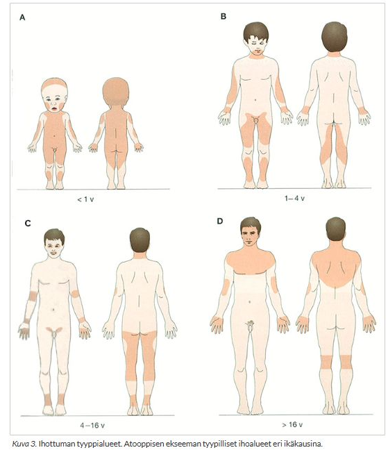
  

  <button class="solution-button"
          data-label="b"
          data-hide-label="b - Piilota vastaus">
    b
  </button>
  

Ei tarvita rutiininomaisesti ruokavalio-ohjeita sen enempää äidille kuin vauvallekaan, imetystä jatketaan normaalisti. Kiinteiden ruokien aloitus voidaan ja kannattaa tehdä normaaliin tapaan.

Jos ihottuma on poikkeuksellisen vaikea, ei vastaa asianmukaiseen paikallishoitoon tai lapsella on muita selviä oireita (esim. voimakkaat suolisto-oireet tai anafylaktistyyppiset reaktiot), voidaan epäillä maitoallergiaa korvikeruokituilla. Tällöin voidaan kokeilla välttämisdieettiä ja allergiaselvittelyjä. 

  

  <button class="solution-button"
          data-label="c"
          data-hide-label="c - Piilota vastaus">
    c
  </button>
  

Atooppisen ekseeman ensisijaisena hoitona ovat perusvoiteet sekä lääkevoiteet eli glukokortikoidivoiteet ja kalsineuriinin estäjät. Vaikeissa tautimuodoissa voidaan tarvita pitkäkestoista systeemistä lääkitystä. Päivittäinen pesu ei pahenna atooppista ekseemaa, suihkussa saa käydä joka päivä siis. Perusvoiteen käyttö pesun jälkeen estää ihon kuivumista ja voi sitoa ihoon kosteutta.

Perusvoiteet ovat lievän atooppisen ekseeman pääasiallinen hoito ja aina osa myös keskivaikean tai vaikean atooppisen ekseeman hoitoa. Yleensä 1–2 voitelukertaa päivässä riittää. Potilaan/vanhemman kannattaa antaa itse valita perusvoiteensa sen mukaan, minkä kokevat hyväksi. 
 
Pahenemisvaiheessa voidaan punoittaville ja kutiaville alueille aloittaa mieto kortisonivoide. Sitä sivellään ihottuma-alueille kerran tai kahdesti päivässä 1–2 viikon kuurina. Lapsilla käytetään yleensä mietoja tai keskivahvoja kortikosteroidivoiteita. Vahvoja kortikosteroidivoiteita käytetään vain erikoistilanteissa erikoislääkärin määräämänä. Alle 1-v ensisijaisesti 1 % hydrokortisonivoide 1–2 kertaa vuorokaudessa 3-7 vrk:n (jopa 2vk) jaksoissa. Ihanteellista olisi, että ensin pestään iho, sitten laitetaan kortisonivoide, odotetaan noin tunti ja sitten levitetään perusvoide. Kun ihottuma rauhoittuu, pidetään taukoa kortisonista vähintään kuurin verran, mutta perusvoitelua jatketaan jatkuvasti. 

Atooppisen ihottuman lääkevoiteita (kortisonivoiteita tai kalsineuriinin estäjiä) ei ole tarkoitus pestä iholta pois, vaan ne levitetään aina puhtaalle iholle pesun jälkeen ja niiden annetaan imeytyä ihoon. Lääkevoiteiden tulisi antaa vaikuttaa iholla ennen pesua vähintään 10 tuntia. 

Vauvan kynnet pidetään lyhyinä raapimisvaurioiden estämiseksi. Nukutusympäristö kannattaa pitää viileänä, sillä hikoilu pahentaa kutinaa.
  

  <button class="solution-button"
          data-label="d"
          data-hide-label="d - Piilota vastaus">
    d
  </button>
  

Imeväisiän atooppisen ihottuman ennuste on hyvä. Suurimmalla osalla lapsista ihottuma helpottaa merkittävästi tai häviää kokonaan vuosien kuluessa, mutta voi kylläkin pahentua uudelleen nuoruus- tai aikuisiässä. Mitä vaikeampi atooppinen ihottuma, sitä huonompi ennuste. On kuitenkin hyvä mainita vanhemmille, että ihon peruskuivuus ja herkkyys voivat säilyä.

Jos lapsi herkistyy epätavallisemmille allergeeneille (esim. vehnä, soija), niin toipumisen ennuste huononee; samoin jos imeväisiässä todetaan hengityksen vinkunaa.
  

### Afrikasta 9kk aikaisemmin Suomeen muuttaneen perheen vanhin, 12 v ikäinen poika on potilaana tk-vastaanotolla. Koulu-th on ohjannut hänet tutkimuksiin yli kuukauden jatkuneen yskän vuoksi. Yskä vaivaa etenkin iltaisin ja aamuisin, mutta ei ole haitannut koulunkäyntiä. Pojan yleistila on hyvä eikä hänellä ole kuumetta, muut perheenjäsenet ovat terveitä. Maahanmuuttotutkimukset antoivat normaalit tulokset. {#Afrikasta-yskaa}

- a. Anna 4 diagnoosivaihtoehtoa perusteluineen, joita lähdet selvittämään
- b. Mitä tutkimuksia teet vastaanottokäynnin yhteydessä?
- c. Jatkotoimenpiteet

  <button class="solution-button"
          data-label="a"
          data-hide-label="a - Piilota vastaus">
    a
  </button>
  

<li>**Astma**</li>
  <ul>
    <li>Kouluikäisten yleisin pitkittyneen yskän syy. Oireiden painottuminen aamuun ja iltaan on astmalle erittäin tyypillistä (vuorokausivaihtelu), samoin hyvän yleiskunnon säilyminen ja kuumeettomuus. Muutto uuteen ilmastoon ja altistuminen uusille allergeeneille (esim. siitepölyt, huonepölypunkit, eläinpöly) voi laukaista piilevän tai uuden astman.</li>
  </ul>
<li>**Gastroesofageaaliseen refluksiin (GER) voi liittyä hengitysoireita, keuhkoputkien hyperreaktiviteettia ja yskää, varsinkin yöaikaan.**</li>
<li>**Hinkuyskä**</li>
  <ul>
    <li>Aiheuttaa pitkittyneen, usein viikkoja tai kuukausia kestävän puuskittaisen yskän, joka pahenee tyypillisesti öisin ja iltaisin. Lapsen yleistila on yskänpuuskien välillä usein täysin normaali. Lähtömaan rokotuskattavuus on voinut olla puutteellinen tai rokotteen teho on ehtinyt hiipua.</li>
  </ul>
<li>**Allerginen nuha ja post-nasal-drip**</li>
  <ul>
    <li>Uudet ympäristöallergeenit voivat aiheuttaa kroonisen nuhan. Nieluun valuva erite ärsyttää hengitysteitä erityisesti makuulla (iltaisin) ja aamuisin liikkeelle lähtiessä, aiheuttaen yskää ilman keuhko-oireita tai heikentynyttä rasituksensietoa.</li>
  </ul>
<li>Psykogeeniset syyt ja tic-oire</li>
<li>Mekaaniset ja ahtauttavat tekijät, kuten vierasesine</li>
<li>**Tuberkuloosi**</li>
  <ul>
    <li>Vaikka maahanmuuttotutkimukset (otettu tuberkuloosin suhteen selvittelyinä IGRA (ensisijainen alle 16v jos saatavilla) ja/tai thorax-rtg) olivat 9 kuukautta sitten normaalit, lapsi on kotoisin korkean esiintyvyyden alueelta. Latentti tuberkuloosi on voinut aktivoitua myöhemmin tai tartunta on voitu saada alkuperäisten tutkimusten jälkeen (esim. perheenjäseneltä, jonka tauti ei ole vielä diagnoosissa). Vaikka yleisoireita (laihtuminen, yöhikoilu) ei ole, se on pakko pitää erotusdiagnostiikassa mukana pitkittyneen yskän vuoksi.</li>
  </ul>

  

  <button class="solution-button"
          data-label="b"
          data-hide-label="b - Piilota vastaus">
    b
  </button>
  

Tarkentava anamneesi: Yskän laatu (limainen/kuiva), rasituksensieto, nukkuminen, atooppiset oireet (ihottuma, nuha, silmäoireet; näiden ajoitus), aiemmat sairastelut ja saatu rokotussuoja. Kysy kohdennetusti tuberkuloosin B-oireista (yöhikoilu, painonlasku). Vierasesinemahdollisuus? Refluksioireita?

Kliininen status: Yleistila, paino+pituus, keuhkojen auskultaatio, KNK-status, imusolmukkeet. 

Saturaatio, verenpaineet. 

  

  <button class="solution-button"
          data-label="c"
          data-hide-label="c - Piilota vastaus">
    c
  </button>
  

TVK; tieto eosinofiilisten valkosolujen määrästä on tärkeä

Mahdollisesti mikrobietiologiset tutkimukset, kuten pertussis-, mykoplasma- ja keuhkoklamydia-vasta-ainemääritykset (pariseeruminäytteet). Negatiivinen serologia ei sulje pois hinkuyskädiagnoosia, koska testin herkkyys on usein vain 50–60 %. Myös tuberkuloosi tulee muistaa yskän aiheuttajana; tarvittaessa käytetään esim. verestä määritettäviä IGRA-testejä (TbIFNg) voidaan ottaa matalalla kynnyksellä uutena. 

Allergiatutkimukset anamneesin perusteella. IgE-välitteistä allergiaa tyypillisille hengitystieallergeeneille voidaan selvittää joko mittaamalla seerumin spesifisiä IgE-vasta-aineita tai ihopistokokeilla seulontatutkimuksena. Testien tarkoitus on selvittää mahdollisen atopian laaja-alaisuus.

Astmaselvittelyt: taudinmääritys kouluikäisillä tukeutuu spirometriaan ja yli 12-vuotiailla spirometriaan ja/tai PEF-seurantaan (PEF ehkä ei järkevää, jos kielimuuria) kuten aikuisilla. Otetaan thx-rtg, jos sitä ei aikaisemmin ole otettu ja muutenkin matalalla kynnyksellä uudestaan.
  

### Keuruun tk:sen odotusaulassa 3-vuotias tyttö alkaa kouristaa symmetrisesti. Lapsi on tullut lääkäriin flunssaoireiden pitkittymisen vuoksi. Hoitaja toteaa tajuttoman ja kouristelevan potilaan korvalämmöksi 39,6. {#Lapsi-kouristaa-korkea-lampo}

- a. Miten hoidat?
- b. Miten tutkit?
- c. Jatkotoimenpiteet perusteluineen?

  <button class="solution-button"
          data-label="a"
          data-hide-label="a - Piilota vastaus">
    a
  </button>
  

Kouristuksen hoidossa pätevät samat yleisperiaatteet kuin epileptisen kohtauksen hoidossa, eli varmistetaan vapaat hengitystiet ja laitetaan lapsi kylkiasentoon turvalliseen paikkaan. Jos kouristus ei mene itsestään ohi viidessä minuutissa, annetaan lapselle kouristuksen lopettavaa lääkettä.

Anna ensiapulääke, jos kouristus kestää yli 5 minuuttia (midatsolaampi suun limakalvolle tai diatsepaami rektiolina). Jos kohtaus ei lopu näillä toimenpiteillä, toimitaan kuten pitkittyneen epileptisen kohtauksen hoidossa.

  

  <button class="solution-button"
          data-label="b"
          data-hide-label="b - Piilota vastaus">
    b
  </button>
  

Yleisstatus + Neurologinen status ja tajunta: Seuraa lapsen heräämistä. Palautuuko tajunta normaaliksi (postiktaalivaiheen väistyminen)? Onko havaittavissa puolioireita (Toddin pareesi) tai meningiitin merkkejä (niskajäykkyys)?

---

Vitaalien seuranta (ABCDE): Syke, happisaturaatio, hengitystaajuus ja lämpö. Sokeri on voidaan myös mitata (voi periaatteessa ottaa jo kohtauksen aikana), vaikka monien ohjeiden mukaan verenglukoosimäärityksiä ei tarvita, jos lapsi on lyhyen kouristuksen jälkeen normaalin virkeä. 

---

Kuumeisen infektion selvittelyt tehdään samojen periaatteiden mukaisesti kuin kouristamattomalla lapsella. Jos lapsen yleisvointi on hyvä ja kliiniset löydökset normaalit, hänelle ei tarvitse tehdä mitään laboratoriotutkimuksia. Jos sen sijaan herää pienikin epäily bakteeri-infektiosta, tulee määrittää CRP-pitoisuus ja mahdollisesti tehdä muita bakteeri-infektioihin viittaavia tutkimuksia, kuten PVK ja diffi ja etiologiset mikrobitutkimukset (esim. KemSeul (jos epäselvä kuume)). Keskushermostoinfektion pois sulkemiseen riittää useimmiten lapsen seuraaminen vähintään muutaman tunnin ajan (lumbaalipunktio epäilyn herätessä ESH).

  

  <button class="solution-button"
          data-label="c"
          data-hide-label="c - Piilota vastaus">
    c
  </button>
  

Suurin osa kuumekouristuksista on lyhyitä, kestoltaan 1–2 min, ja ne loppuvat ilman mitään erityistoimia. Tehokaskaan kuumelääkitys heti kuumekouristuksen jälkeen ei estä kouristusten uusimista saman kuumeen aikana. Kuumekouristusten yhteydessä kuumetta sinänsä ei tarvitse hoitaa, kuten ei muissakaan infektioissa, vaan lääkityksellä pyritään lieventämään infektiosta johtuvia kipuja ja epämukavaa oloa.

Kuumeen aikainen kohtaus voi olla bakteerimeningiitin, enkefaliitin tai sepsiksen oire, joten ensimmäistä kertaa kouristanut lapsi on syytä pyytää päivystyksellisesti lääkärin tutkittavaksi, vaikka kohtaus olisi ollut lyhyt ja lapsi olisi siitä toipunut. Jos lapsi on muutaman tunnin seurannassa kohtauksen jälkeen hyväkuntoinen eikä lääkärin tutkimuksessa tule esiin mitään poikkeavaa, häntä ei tarvitse lähettää sairaalaseurantaan, ja vanhemmille kerrotaan kuumekouristusten hyvänlaatuisuudesta sekä annetaan tarkat ohjeet lapsen voinnin seurannasta; tarvittaessa bukkaalinen midatsolaami tai diatsepaamirektiolit kotiin.

Ensiapulääkettä ei määrätä rutiininomaisesti kotiin kaikille kuumekouristuspotilaille. Ensiapulääke on kuitenkin hyvä olla varalla erityisesti potilailla, joiden kuumekouristus on ollut pitkittynyt tai joilla pitkähköön kuumekouristukseen liittyy esim. välimatkasta johtuva viive pääsyssä ensiapua antavaan yksikköön. Ellei kotona annettu ensiapulääkkeen kerta-annos auta tai lapsi ei toivu kuumekouristuksesta nopeasti, hänet on vietävä ambulanssilla päivystyksellisesti sairaalahoitoon. 

---

EEG- tai kuvantamistutkimuksia ei normaalisti kehittyneillä ja muuten terveillä yksinkertaisia kuumekouristuksia saavilla lapsilla tarvita jatkotutkimuksina siinäkään tapauksessa, että kuumekouristukset uusiutuvat myöhempien kuumeiden aikana. Em. tutkimukset ovat aiheellisia, jos lapselle tulee myös kuumeettomia kouristuksia

Jatkotutkimuksia ei tarvita, jos 6 kk:n–5 v:n ikäisellä lapsella esiintyy vain kuumeen aikana yksinkertaisia tajuttomuus-kouristuskohtauksia, joista lapsi toipuu normaalisti. Välttämättä nämä eivät ole tarpeen myöskään 6(–7) v:n ikäisellä yksinkertaisen kuumekouristuksen saaneella etenkään, jos lapsella on ollut taipumus toistuviin yksinkertaisiin kuumekouristuksiin pienempänäkin.

---

Lapsi on lähetettävä erikoissairaanhoidon lisätutkimuksiin ja seurantaan, jos lapsi kouristuksen mentyä ohi ei ole normaalin virkeä, jos neurologinen status ei muutenkaan ole täysin normaali, kouristus on pitkittynyt, on kokonaan tai osittain toispuoleinen tai saman vrk aikana enemmän kuin yksi kouristus.

Tietysti myös sairaalaan, jos merkittävän korkea CRP tai esim. keuhkokuume, joka vaatii suonensisäistä antibioottia ja nestehoitoa.

  

### Monivalinnat  

O/V-väittämiä

#### Ruokatorven refluksisairauden ja eosinofiilisen esofagiitin oireet poikkeavat selkeästi toisistaan {#GERD-vs-EoE}

  <button class="solution-button"
          data-label="Vastaus"
          data-hide-label="Piilota vastaus">
    Vastaus
  </button>
  

      Väärin

Vaikka sairaudet ovat taustamekanismeiltaan erilaisia, niiden oirekuvat ovat osittain erittäin samankaltaisia ja menevät merkittävästi päällekkäin. 

---

Eosinofiilinen esofagiitti (EoE) on harvinainen, vaikkakin kaikissa länsimaissa yleistyvä ruokatorven krooninen tulehdussairaus

EoE tarkoittaa ruokatorven kroonista eosinofiilivaltaista tulehdustilaa, joka aiheuttaa klassisesti erityisesti ruokatorven toimintahäiriön (dysmotiliteetti). Johtuu Th2-vasteesta allergeenille (tyypillisesti ruoka-aine, mahdollisesti aeroallergeeni) ja sen aiheuttamasta eosinofiilisestä infiltraatista; n. 75%:lla potilaista on myös muita allergisia tauteja (esim. allerginen riniitti tai astma). 

EoE:tä on syytä epäillä lapsella, jolla on nielemisvaikeuksia, ruokaboluksen juuttumista ruokatorveen sekä närästystä/rintalastan alaista kipua, erityisesti atopiataustan omaavilla lapsilla. Pienillä lapsilla oirekuva ei ole aina yhtä klassinen, vaan voidaan todeta enemmän oksentelua/regurgitaatota, vatsakipua ja syömishäiriöitä. Lapsen kasvaessa tulee enemmän närästystyyppistä oireilua ja lopulta vanhemmilla teineillä/aikuisilla ruoan juuttumista ruokatorveen ja dysfagiaa. 

EoE johtaa hoitamattomana ruokatorven motiliteetin heikentymiseen, mistä voi olla seurauksena lihanpalojen juuttuminen ruokatorveen. 

EoE todetaan aina gastroskopialla. Diagnostiset kriteerit ovat: 

<li>Ruokatorven toimintahäiriöön viittaavat oireet (dysfagia, ruoan impaktoituminen, rintakipu/närästys, pienillä lapsilla oksentelu, syömisongelmat...)</li>
<li>Ruokatorven limakalvon koepalassa > 15 eosinofiiliä/näkökenttä(hpf) ja</li>
<li>Muut eosinofilian syyt poissuljettu (esim. infektiot)</li>

---

Hoitona käytetään lapsuusiässä eliminaatiodieettejä (lehmänmaito, viljat, kananmuna tavallisimmat), joilla saadaan vaihteleva vaste

Lääkehoidoista happosalpaajilla on merkittävä rooli, mutta vaikean EoE:n hoidossa paras vaste saadaan nieltävällä budesonidilla. Varhaislapsuudessa käytettynä PPI-lääkkeet näyttävät lisäävän taudin riskiä, mutta niitä käytetään myös taudin hoidossa (on anti-inflammatorinen vaikutus, joka on riippumaton haponvastaisesta vaikutuksesta)

Ennuste epäselvä, ongelma on taudin uusimisherkkyys.

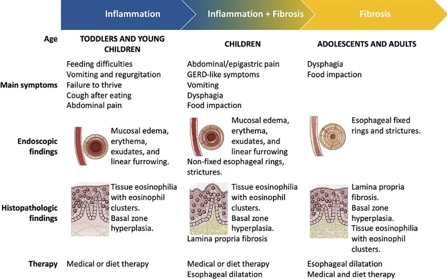
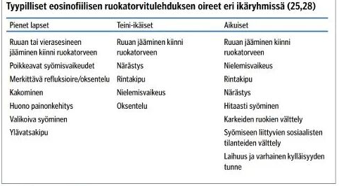
  

#### Happosalpaus on tehokas imeväisen pulauttelun hoito {#Happosalpaus-tehokas-imevaisen-pulauttelussa}

  <button class="solution-button"
          data-label="Vastaus"
          data-hide-label="Piilota vastaus">
    Vastaus
  </button>
  

      Väärin

Pelkkään pulautteluun ei tarvita yleensä muuta hoitoa kuin lääkkeetön hoito (asentohoito, käsittelyohjeet, maidon sakeuttaminen, kerta-annosten vähentäminen, ummetuksen hoito...). 

Happosalpaajalääkkeiden käyttö alle 1-vuotiailla lapsilla oireperusteisesti refluksiin (ilman näyttöä happosairaudesta) ei perustu tutkimusnäyttöön -- vain todettuun poikkeavaan happamaan refluksiin tai peptiseen esofagiittiin kun lääkkeettömät hoidot eivät riitä (lähete esh)

  

#### Noin kolmasosa tunnettuja riskigeenejä kantavista sairastuu elinaikanaan keliakiaan {#Keliakia-riskigeenit}

  <button class="solution-button"
          data-label="Vastaus"
          data-hide-label="Piilota vastaus">
    Vastaus
  </button>
  

      Väärin

Lähes kaikilla keliaakikoilla todetaan HLA-haplotyyppi DQ2 ja/tai DQ8, mutta vain < 1/10 geenialttiuden omaavista sairastuu. 

---

Nämä perintötekijät ovat tavallisia koko väestössä, ja tämän vuoksi testi sopii vain keliakian poissulkuun (ESH-tutkimus) eikä positiivisena tuo diagnostista lisäarvoa. Noin 1/3 suomalaisista tämä geenialttius, mutta vain <1/10 heistä sairastuu. Perimän ja gluteenin lisäksi tarvitaan muita tekijöitä, joita ei vielä tunneta. Riskiryhmässä mm. he joilla muita autoimmuunisairauksia, 21 trisomia tai lähisuvussa keliakia (1. asteen sukulaiset 5-10% ja 2. asteen sukulaiset 2-4%)

  

#### Valtaosa maapallon väestöstä on laktoosi-intolerantteja {#Valtaosa-laktoosi-intolerantteja}

  <button class="solution-button"
          data-label="Vastaus"
          data-hide-label="Piilota vastaus">
    Vastaus
  </button>
  

      Oikein

Laktoosin imeytymishäiriötä ja sen aiheuttamaa laktoosin sietämisen ongelmaa eli laktoosi-intoleranssia esiintyy noin kuudesosalla (n. 18%) suomalaisista. 

Maailmanlaajuisesti (n.65-70%) valtaosa on laktoosi-intolerantteja. Aasiassa, Afrikassa, Etelä-Amerikassa ja Arabimaissa laktoosi-intoleranssi on valta-asemassa: monilla alueilla (esimerkiksi Itä-Aasiassa) jopa 80–100 % aikuisväestöstä ei kykene pilkkomaan laktoosia. Pohjois-Euroopassa ja osassa Pohjois-Amerikkaa valtaosa taas sietää laktoosia 

  

#### Synnynnäinen laktoosi-intoleranssi on harvinainen suomalaiseen tautiperintöön kuuluva sairaus {#Synnynnainen-laktoosi-intoleranssi}

  <button class="solution-button"
          data-label="Vastaus"
          data-hide-label="Piilota vastaus">
    Vastaus
  </button>
  

      Oikein

Älä sekoita synnynnäistä laktaasinpuutosta ja primaarista hypolaktasiaa (eli tyypillistä laktoosi-intoleranssia): synnynnäinen laktaasinpuutos on harvinainen (Suomessa oli ainakin vuoteen 2009 mennessä erään Duodecim-artikkelin mukaan löydetty seitsemän mutaatiota yhteensä 43 potilaalta; esiintyvyys maailmalla n. 1:5 milj) vetisenä ripulina ilmenevä resessiivisesti periytyvä tila, jossa vauvan elimistö ei muodosta laktaasi-entsyymiä lainkaan syntymästä alkaen ja ongelma ilmenee välittömästi syntymän jälkeen. 

Primaarinen laktoosi-intoleranssi on taas todella yleinen (18%) ja kehittyy vasta myöhemmin (tyypillisesti yli 5v.-aikuisikä). Laktaasientsyymin tuotanto alkaa hiipua perimän säätelemänä vasta iän kertyessä. 

  

#### Ruoka-allergia on tärkein yksittäinen pikkulapsen astman aiheuttaja {#Ruoka-allergia-pikkulapsen-astma}

  <button class="solution-button"
          data-label="Vastaus"
          data-hide-label="Piilota vastaus">
    Vastaus
  </button>
  

      Väärin

Tärkein yksittäinen astman laukaisija pikkulapsilla on virusten aiheuttamat hengitystieinfektiot (esim. RSV, rinovirukset) -> bronkioliitti ja obstruktiiviset bronkiitit. Lisäksi perimä (atooppinen taipumus) ja muut ympäristötekijät alaltistavat hengitysteiden yliherkkyydelle.

---

Ruoka-allergia on astman riskitekijä ja liitännäissairaus, ei suora syy. Lapsella, jolla on vaikea ruoka-allergia tai paha atooppinen ihottuma, on suurempi riski sairastua myöhemmin myös astmaan.
  

#### Liiallinen maidonjuonti voi aiheuttaa pikkulapselle raudanpuuteanemian {#Maidonjuonnista-anemia}

  <button class="solution-button"
          data-label="Vastaus"
          data-hide-label="Piilota vastaus">
    Vastaus
  </button>
  

      Oikein

Lehmänmaidossa on erittäin vähän rautaa, sen kalsium estää raudan imeytymistä, ja suuri maidon juonti vie lapsen vatsassa tilaa rautapitoiselta kiinteältä ruoalta. Runsas maito voi myös aiheuttaa tihkuvuotoa suolen verisuonissa. Kaikki nämä tekijät altistavat raudanpuutteelle. 

Hoitona maitotuotteiden käytön rajoittaminen suosituksiin eli ad 5-6dl/vrk. Samalla yleensä aloitetaan tyypillinen raudanpuutehoito eli p.o.-rauta 2-6mg (max 100mg) joka toinen päivä ja pienellä lapsella paras vaihtoehto on Obsidan Fe2+, jonka kapselin voi avata ja siten annostella sopiva määrä rakeita. Sukrosomiaalinen rauta (Sideral) on myös hyvä, mutta on kalliimpi ja siinä annostelu on erilainen (pienille 14mg x1, kouluikäisille ja vanhemmille 30mg x1). Nestemäisiä rautavalmisteita ei suosita, jos hampaat ovat puhjenneet, koska ne värjäävät ne (ja usein imeytyvät huonommin). 

  

#### Leukemiat ovat yleisin lasten syöpätyyppi {#Leukemiat-yleisin-syopa}

  <button class="solution-button"
          data-label="Vastaus"
          data-hide-label="Piilota vastaus">
    Vastaus
  </button>
  

      Oikein

Noin kolmasosa alle 16-vuotiaiden lasten syövistä on leukemioita. Kyseessä on lähes aina akuutti leukemia ja useimmiten ALL; krooniset leukemiat (KML ja KLL) ovat vanhempien aikuisten sairauksia. 

Toiseksi yleisin lasten syöpätyyppi on aivokasvaimet.

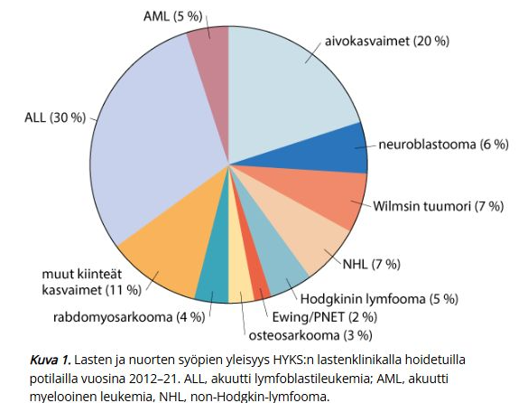
  

#### Leikki-ikäisen lapsen sydämen sivuääni johtuu usein synnynnäisestä sydänviasta {#Sivuaani-johtuu-yleensa-sydanviasta}

  <button class="solution-button"
          data-label="Vastaus"
          data-hide-label="Piilota vastaus">
    Vastaus
  </button>
  

      Väärin

Synnynnäinen sydämen rakennevika on yleisin synnynnäinen rakennepoikkeavuus ja sellainen todetaan n. **1%:lla lapsista.** On kuitenkin tärkeää tiedostaa, että **n. 50%:lla lapsista kuullaan ainakin joskus sivuääni** (ja jopa 80%:lla päivystyspotilaista). Oireettoman lapsen sivuääni on useimmiten hyvänlaatuinen, vaikkakin joskus taustalta löytyy seurantaa tai hoitoa vaativa rakenteellinen sydänvika. Kaikissa rakennevioissa ei aina kuulla sivuääntä alkuvaiheissa eikä joskus koskaan. 

  

#### Munuaistensiirto on yleisin lapsille tehtävä kiinteän elimen siirto {#Munuaistensiirto-yleisin}

  <button class="solution-button"
          data-label="Vastaus"
          data-hide-label="Piilota vastaus">
    Vastaus
  </button>
  

      Oikein

**Yleisimmät lasten elinsiirrot ovat munuais-, maksa- ja sydänsiirrot.** Lisäksi muutama lapsi on saanut suolen- tai keuhkojensiirron.

Elinsiirtoa tarvitsevien lasten tautikirjo on varsin laaja, ja usein syynä on synnynnäinen sairaus, toisin kuin aikuisilla. 

Suomessa munuaisensiirtoja tehdään lapsille 10–15 vuodessa. **Tärkein lasten munuaissiirron aihe maassamme on synnynnäinen suomalaistyyppinen nefroosi (CNF, NPHS1),** joka on syynä 40 %:ssa elinsiirroista. Nämä lapset saavat siirteen varhain eli 1 - 2 vuoden iässä nefroosivaiheen komplikaatioiden välttämiseksi. Toiseksi tärkein ryhmä on virtsaelinten rakenneviat ja munuaisten kehityshäiriöt.

<li>Suomalaistyyppinen synnynnäinen nefroottinen oireyhtymä (CNF, NPHS1) on tautiperimäämme kuuluva, resessiivisesti periytyvä sairaus, joka johtuu NPHS1-geenin mutaatioista. Tämä geeni ohjaa nefriiniproteiinin syntyä. Nefriini on munuaissuodattimen tärkeä komponentti, ja sen puute johtaa massiiviseen proteiinivuotoon ja turvotuksiin heti syntymän jälkeen. CNF-lapset syntyvät usein hieman etuajassa ja heidän istukkansa on suuri (yli 25 % lapsen painosta), mikä herättää epäilyn taudista jo synnytyssalissa. Tauti varmistetaan geenitestillä. CNF-lapsilla ei ole munuaisten ulkopuolisia epämuodostumia. CNF-lapsen valkuaisvirtsaisuus ei reagoi lääkitykseen, minkä takia hoitona on päivittäinen suonensisäinen albumiinin anto. Sairauden ainoa parantava hoito on munuaisensiirto, jota suomalaisen käytännön mukaan edeltää munuaisten poisto ja dialyysihoito.</li>

---

Lapsipotilaille siirretään yleensä aikuisen munuainen ja siirre asetetaan ekstraperitoneaalisesti oikeaan suoliluukuoppaan. Jotta leikkaus olisi teknisesti mahdollinen, tulee lapsen olla vähintään 9–10 kg painava munuaisensiirron aikana. Tyypillisesti munuaisensiirto tehdään aikaisintaan noin yhden vuoden iässä. Noin puolet lasten munuaisensiirroista tehdään elävältä luovuttajalta. Munuaisensiirto voidaan tehdä ilman dialyysihoitoa (pre-emptiivinen munuisensiirto), mikäli kyseessä on hitaasti etenevä sairaus ja lapsen virtsaneritys säilyy sairaudesta huolimatta. Lasten munuaisensiirtojen tulokset ovat hyvät. Lapsista on kymmenen vuoden seurannan jälkeen elossa yli 90 %. Suomessa on vuoden 2021 loppuun mennessä tehty munuaisensiirto 314 lapsipotilaalle. Munuaisensiirron jälkeen lapsi tarvitsee elinikäisen hyljinnänestolääkityksen. Hyljinnänestolääkityksen tiedetään kasvattavan riskiä sairastua sydän- ja verisuonitauteihin, metaboliseen oireyhtymään, herpesryhmän virusinfektioihin ja syöpiin. Elinsiirtopotilaat tarvitsevatkin säännöllisiä sairaala- ja poliklinikkaseurantoja, jotka toteutetaan siirtotoimintaan perehtyneessä yksikössä.

---

Lasten maksansiirtojen tärkein aihe on synnynnäinen sappitieatresia, kuten muuallakin maailmassa. Näiden lasten leikkaushoidon, Kasain portoenterostomian, keskittäminen yhteen yksikköön Suomessa on kuitenkin vähentänyt - mutta ei poistanut - maksansiirron tarvetta, joka nykyisin on 1 - 2 potilasta vuodessa. Nykyään jo 67 % potilaista selviytyy vähintään viisi vuotta oman maksansa turvin. Osuus saattaa suurentua tulevaisuudessa uusien lääkehoitojen ansiosta.

---

Sydämensiirron kaksi valta-aihetta ovat kardiomyopatia ja sydämen synnynnäinen rakennevika, nykyisin usein yksikammiovika. 

---

Keuhkonsiirron tarve on maassamme lapsilla pieni, mikä osaksi johtuu kystisen fibroosin niukasta esiintyvyydestä suomalaisilla. 

Kaikilla neljällä suolensiirtolapsella syynä oli synnynnäisen motiliteettihäiriön aiheuttama suolen vajaatoiminta ja sen edellyttämän suonensisäisen ravitsemuksen komplikaatiot.

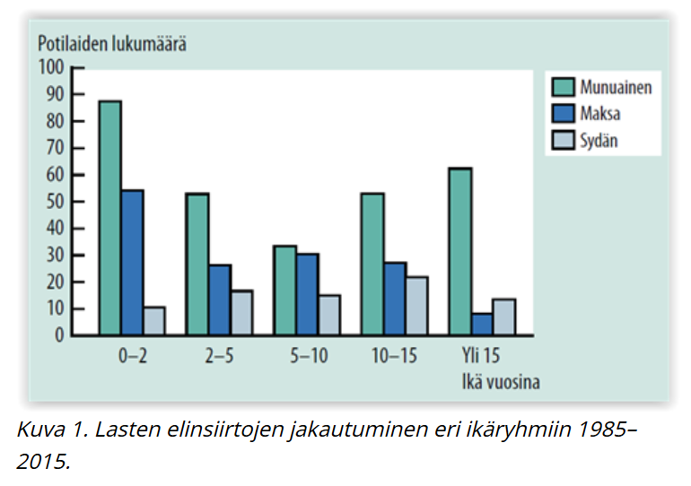
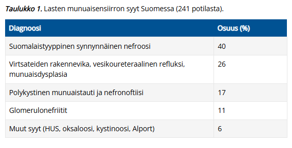
  

#### Nefroottisen oireyhtymän merkittävin löydön on verivirtsaisuus {#Nefroottinen-oireyhtyma-verivirtsaisuus}

  <button class="solution-button"
          data-label="Vastaus"
          data-hide-label="Piilota vastaus">
    Vastaus
  </button>
  

      Väärin

Nefroottinen oireyhtymä on ryhmä glomeruluksen häiriöitä, joille on tyypillistä merkittävä proteinuria >3-3.5g/päivä. _Nefriittiselle oireyhtymälle_ on taas hematuria tyypillisempää (Nefriittinen oireyhtymä = Nefriittinen virtsalöydös (hematuria+vaihteleva proteinuria) + oireyhtymälle ominaisia piirteitä (esim. hypertensio, virtsamäärien väheneminen, lievät turvotukset)). 

**Runsasta virtsaan suodattuvaa proteiinin määrää siis kutsutaan nefroosiksi ja nefroottisessa oireyhtymässä on sen lisäksi hypoalbuminemiaa ja perifeerisiä turvotuksia.** Yhteydessä voidaan usein todeta myös nefriittisen oireyhtymän piirteitä, kuten hematuriaa -> nefriittinen ja nefroottinen oireyhtymä eivät ole täysin erotettu toisistaan vaan voivat ilmetä sekamuotoisena. 

---

**Lapsilla yleisin nefroottinen oireyhtymä on minimal change -nefropatia** (idiopaattinen nefroottinen oireyhtymä). Siihen sairastuu vuosittain parikymmentä suomalaislasta. Valtaosa on 2–8-vuotiaita, ja tauti on yleisempi pojilla (3:2). Taudin puhkeamista edeltää usein virusinfektio, mutta selvää yhteyttä mihinkään etiologiseen tekijään ei tunneta.

Sairauden ensioireena ilmenee turvotuksia silmäluomissa, muualla kasvoissa ja alaraajoissa. Potilaan yleistila on yleensä hyvä, hänellä ei ole kuumetta tai muita tulehduksen merkkejä, verenpaineet ovat normaalit, plasman kreatiniini- ja ureapitoisuudet ovat jokseenkin normaaleja, mutta albumiinipitoisuus on selvästi pienentynyt (alle 20 g/l). Virtsassa todetaan vahva proteinuria (yli 2–3 g/l tai U-prot/krea yli 200 mg/mmol) ja vain niukasti punasoluja. Turvotukset ja liuskakokeella todettava proteinuria ovat riittävä syy potilaan ohjaamiseksi avohoidosta keskussairaalaan. Kaikki ei ole tavallista minimal change nefropatiaa: siksi biopsia + tarv geenitutkimuksia.

Idiopaattisen nefroottisen oireyhtymän hoitona on glukokortikoidilääkitys yleensä 8–12 viikon ajan. Valtaosa (80 %) potilaista reagoi jo parissa viikossa lääkitykseen. Kahdella kolmasosalla episodit kuitenkin uusivat yhden tai useamman kerran lapsuudessa, mutta hoituvat aina glukokortikoidilääkityksellä. Pienellä osalla taudinkulku on ongelmallisempi niin, että episodit uusivat tiheästi tai tarvitaan jatkuvaa glukokortikoidilääkitystä. Näillä lapsilla episodien estoon voidaan käyttää siklosporiinia. Lähes poikkeuksetta episodit loppuvat kuitenkin murrosikään mennessä. Pienellä osalla nefroottiseen oireyhtymään sairastuneista lapsista proteinuria ei alun perinkään reagoi glukokortikoidilääkitykseen (nk. steroidiresistentti nefroosi). Heillä proteinuria johtaa vähitellen munuaisten vajaatoimintaan ja pahimmassa tapauksessa munuaisensiirtoon.

  

#### Kuumekouristuksia esiintyy yleensä kouluiässä {#Kuumekouristuksia-kouluiassa}

  <button class="solution-button"
          data-label="Vastaus"
          data-hide-label="Piilota vastaus">
    Vastaus
  </button>
  

      Väärin

Potilas on tyypillisesti 6 kk:n–5 v:n ikäinen.
  

#### Suurin osa lastenreumasta on seropositiivista polyartriittia {#Suurin-osa-lastenreumasta}

  <button class="solution-button"
          data-label="Vastaus"
          data-hide-label="Piilota vastaus">
    Vastaus
  </button>
  

      Väärin

N. 95% tapauksista on seronegatiivisia. Reumatekijän (ja/tai CCP-vasta-aineiden) tutkiminen varmistaa siis lapsen reumadiagnoosin hyvin harvoin, eikä negatiivinen tulos koskaan sulje sitä pois! Sen sijaan tumavasta-ainetutkimus on hyödyllinen, joskaan ei-spesifinen.

Lastenreuma on vain harvoin sama kuin "aikuisen nivelreuma". Selvin tämä yhteys on vajaalla viidellä prosentilla kaikista lastenreumaa sairastavista, jotka tyypillisimmin sairastuvat 10–15 vuoden iässä, ja joilla on seerumista mitattavissa reumatekijä (RF tai CCP-vasta-aineita).

---

**Lastenreumaksi kutsutaan alle 16 vuoden iässä alkanutta pitkäaikaista niveltulehdussairautta, jolle ei löydy muuta selitystä -- toiselta nimeltään onkin juveniili idiopaattinen artriitti (JIA).** Diagnostisissa kriteereissä niveltulehdus (yhdessä tai useammassa nivelessä) on kestänyt yhtäjaksoisesti vähintään 6 viikkoa ja muut niveltulehduksen syyt on poissuljettu. Tarkempi tautityyppi määräytyy ensimmäisten 6kk aikana. Tarkkaa etiologiaa ei tunneta, perinnöllinen alttius isossa roolissa (esim. HLA-assosiaatiot; sisarusten riski sairastua  n. 15-30-kertainen terveeseen normaaliväestöön verrattuna), mutta tarvitaan jokin laukaiseva tekijäkin (identtisistä kaksosistakin vain 25-40% sairastuu).

Ei ole yksittäinen sairaus, vaan luokitellaan _seitsemään alatyyppiin._ **Yleisin (n. 47%) on oligoartriitti (6 kk taudin alusta ≤ 4 niveltä; tosin voi olla ns. leviävä oligoartriitti, jossa 6kk jälkeen ≥5 niveltä). Toiseksi yleisin (n. 19%) on reumatekijänegatiivinen polyartriitti (6 kk sisään ≥5 niveltä).** Sitten tulee yleisoireinen artriitti (kuume, ihottuma), reumatekijäpositiivinen polyartriitti, entesiitteihin liittyvä artriitti (sisältää lastenselkärankareuman), psoriaasiartriitti ja muu artriitti.

Alatyyppien erityispiirteet ja varsinkin vastaaviin aikuisten reumasairauksiin liittyvät piirteet ilmenevät usein vasta murrosiässä, ja siksi erityisesti pienillä lapsilla alatyyppejä voi taudin alkuvaiheessa olla hankala erottaa. Lastenreuma ei siis ole aina erityisenkään samankaltainen kuin aikuisten reuma -- varsinkin pieni lapsi ei useinkaan valita kipua. Alku on moninivelinen vain 10-30%:lla. Tulehdus nivelessä voi aiheuttaa kasvohäiriöitä: voi häiritä pituuskasvua kyseisessä nivelessä (-> heikko kasvu alueella (esim. leuassa pienileukaisuus (usein toispuoleinen leukanivelen affisioituminen) ja leuan vetäytyminen taakse, voi olla vaikeaa avata suuta -> hammaslääkärille seurantaan purennan ja kasvun optimoimiseen) tai varsinkin polven alueella voi nopeuttaa kasvua -> pituusero ja valgusvirheasento alaraajassa)

Lastenreumaan liittyy usein etuosan uveiitti/iriitti (krooninen värikalvontulehdus) ja kaikki niveloireiset lastenreumaepäilyt lähetetään silmälääkärille, hoitamattomana voi aiheuttaa näön hekkenemistä; alku voi olla hidas ja tauti oireeton, joten tutkimuksi tarvitaan. Jos taas niveloireettomalla lapsella on etuosan uveiitti, niin silmälääkäri lähettää lastenreumaselvittelyihin, koska 80%:iin tapauksista liittyy lastenreuma (10%:lla todetaan ennen niveltulehdusta). Uveiitti voi olla hyvin vaikeahoitoinen.

Lastenreuman hoito alkaa lastenreumatologin tai sairauden hoitoon perehtyneen lastenlääkärin toimesta heti, kun muut syyt on poissuljettu ja diagnoosi on varma tai siitä on vahva epäily. Ennen kuin voidaan olla täysin varmoja diagnoosista täytyy muut syyt saada poissuljettua. Hoito tulehduskipulääkkeellä ja nivelten glukokortikoidi-injektioilla voidaan kuitenkin yleensä aloittaa heti. Lastenreuman lääkehoidon tavoitteena on tulehduksen täydellinen rauhoittuminen, remissio. Kipuun NSAIDit (esim. naprokseeni, koska pitkävaikutteinen), alkuhoitoon nivelinjektiot usein ja systeemistä glukokortikoidia voidaan harkita (varsinkin yleisoireisessa tyypissä, muuten harvoin). Perinteisiä reumalääkkeitä käytetään usein ensilinjassa, metotreksaatista eniten näyttöä, muitakin käytetään. Mikäli niveltulehduksia ei saada rauhoittumaan metotreksaatilla ja nivelen sisäisillä glukokortikoidi-injektioilla, voi toinen perinteinen reumalääke tulla kyseeseen ja tällöin usein aletaan käyttää biologisia reumalääkkeitä (TNF-alfasalpaajat, JAK-estäjät, IL-estäjät...).

Ennuste on parantunut, mutta ollaan edelleen kaukana ideaalitilanteesta (41%:lla aktiivitauti / lääkitys 30 v kuluttua diagnoosista; 28%:lla korkea taudin aktiviteetti; 20%:lle potilaista biologisella lääkehoidollakaan ei saavuteta riittävää vastetta).

  

#### Aamujäykkyys ja ontuminen ovat yleisiä lastenreuman ensioireita {#Aamujaykkyys-ja-ontuminen-lastenreuma}

  <button class="solution-button"
          data-label="Vastaus"
          data-hide-label="Piilota vastaus">
    Vastaus
  </button>
  

      Oikein

Lapsen niveloireiden diagnostiikassa on tärkeää selvittää, onko ensioireena ollut kipu, ontuminen vai turvotus. _Lapsuusiän idiopaattisessa niveltulehduksessa (lastenreuma) lapsen valittama kipu on harvoin ensimmäinen oire._

Ensiksi havaitaan yleensä nivelen käytön varominen tai turvotus. Sen sijaan infektioartriitissa ja lonkan transientissa synoviitissa kipu alkaa sangen äkisti ja on usein voimakasta. 

**Lastenreumassa ontuminen tai nivelen jäykkyys on vaikeampaa aamuisin, kun taas ei-tulehduksellisissa (ortopedisissä) nivelsairauksissa nivelen tai raajan kipu yleensä pahenee päivän mittaan ja rasituksessa.**

Yleisoireet (lämpöily, väsymys, heikentynyt yleiskunto, hidastunut kasvu tai painonlasku) voivat viitata pahanlaatuiseen tautiin tai krooniseen suolistotulehdukseen.

  

#### Verenvuodot verkkokalvolla on tyypillinen vauvan ravistelusta aiheutuva löydös {#Vauvan-ravistelu-verenvuodot}

  <button class="solution-button"
          data-label="Vastaus"
          data-hide-label="Piilota vastaus">
    Vastaus
  </button>
  

      Oikein

Ravistellun vauvan oireyhtymä (shaken baby syndrome) tarkoittaa tilaa, jossa tavallisesti alle kolmevuotiaan lapsen väkivaltaisesta ravistelusta on aiheutunut lapselle vakavia vammoja. Näissä tilanteissa sekä akuutin kuolleisuuden että uusiutuvan pahoinpitelyn riski ovat suurentuneet. Ulkoiset merkit tapahtuneesta voivat olla vähäisiä, mutta suurella osalla (50–100 %) ravistelluista lapsista havaitaan verkkokalvon verenvuotoja. Muita löydöksiä ovat subduraalihematoomat, aivojen turpoaminen sekä raajojen ja kallon murtumat.

Pienen lapsen pää on painava suhteessa muuhun kehoon. Vauvan tai pienen lapsen ravistaminen aiheuttaa silmän lasiaiseen hidastuvuus- ja kiihtyvyysvoimia, vetoa lasiaisesta verkkokalvolle ja edelleen verenvuotoja verkkokalvolle ja joskus myös lasiaistilaan. **Silmänpohjan huolellinen tutkiminen on tärkeää epäiltäessä vauvan tai pienen lapsen kaltoinkohtelua.**

---

Oirekirjo ravistellun vauvan oireyhtymässä on laaja hyvin vähäisistä ja epämääräisistä oireista kuolemaan johtaviin oireisiin.

<li>Itkuisuus, ärtyneisyys</li>
<li>Syömättömyys, oksentelu</li>
<li>Hengityskatkokset</li>
<li>Epileptiset kohtausoireet</li>
<li>Tajunnantason muutokset</li>

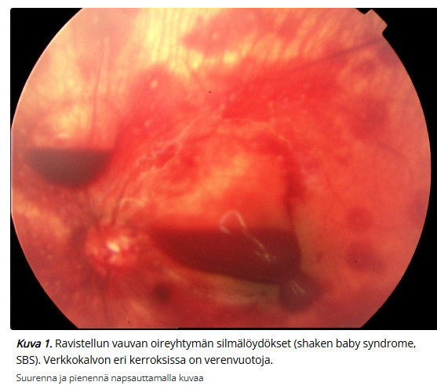
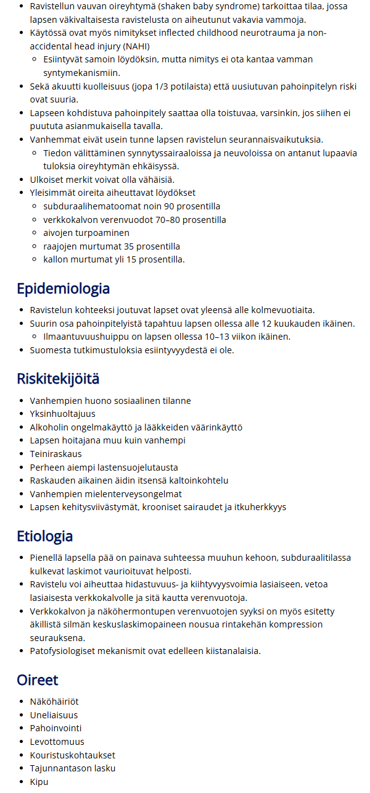
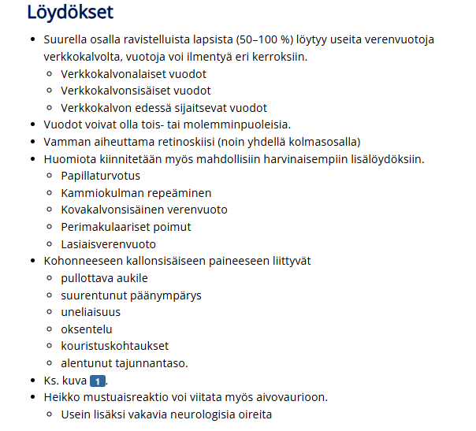
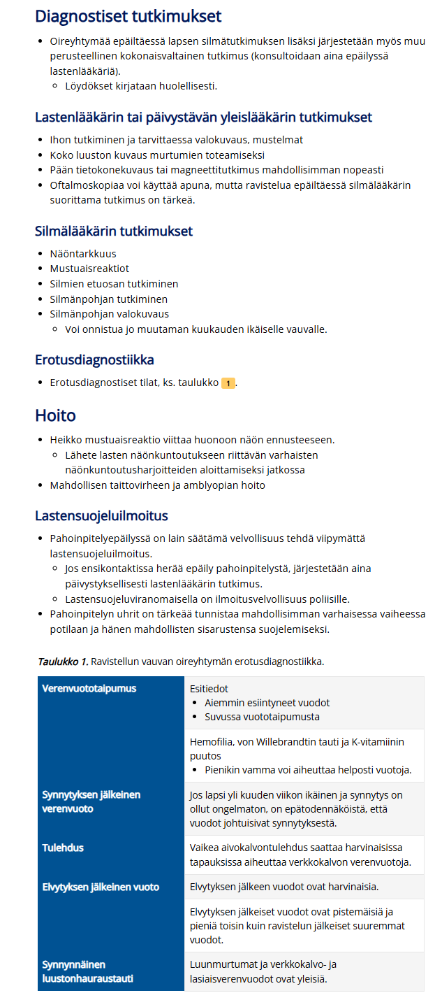

  

#### Lapsen myrkytyksen ensisijainen hoito on oksettaminen

  <button class="solution-button"
          data-label="Vastaus"
          data-hide-label="Piilota vastaus">
    Vastaus
  </button>
  

      Väärin

Tukehtumis- ja aspiraatioriski sekä kudosvauriot ruokatorveen ja nieluun -> ei enää suositella lainkaan kotihoidossa eikä sairaalassa

---

Myrkytysepäilyissä on aina hyvä kysyä neuvoa Myrkytystietokeskuksesta. Tämän voi tehdä jo ennen potilaan saapumista ja näin valmistautua tarvittaviin toimenpiteisiin.

Myrkytystilanteissa lapsen vointi tulee arvioida ja vakauttaa noudattaen ABCDE-algoritmia kuten muissakin akuuttitilanteissa. Voinnin vakauttamisen jälkeen voidaan keskittyä myrkytyksen hoitamiseen.

Monien myrkytysten hoito on oireenmukaista: vitaalitoiminnot turvataan, kunnes myrkky on poistunut ja oireet väistyneet. Usein on syytä huolehtia hyvästä nesteytyksestä riittävän diureesin turvaamiseksi.

Myrkytysten hoito voidaan jakaa kolmeen vaiheeseen: 1) imeytymisen esto, 2) eliminaation nopeuttaminen, 3) vastalääkehoito.

<li>Myrkyn imeytymisen estäminen on ensisijainen toimenpide myrkytyspotilaan hoidossa. Iholle, silmiin tai limakalvoille joutunut myrkky poistetaan huuhtelemalla ja kontaminoituneet vaatteet riisutaan. **Lääkehiili on tärkeä niellyn myrkyn imeytymisen estämiseksi.** Se estää tehokkaasti myrkyn imeytymistä ruuansulatuskanavasta. Lääkehiilen annostelu on syytä aloittaa mahdollisimman nopeasti, mielellään yhden tunnin kuluessa altistumisesta. Mitään ehdotonta takarajaa lääkehiilen annolle ei kuitenkaan ole. Lapsilla epäilykin myrkyn nielemisestä on aihe lääkehiilen annolle. Annostelussa tulee kuitenkin ottaa huomioon myös mahdolliset riskit eikä lääkehiiltä tule annostella potilaalle, jonka tajunnantaso on laskenut, ilman että ilmatie on turvattu.</li>
  <ul>
    <li>Lääkehiili ei tehoa kaikissa myrkytyksissä (alkoholi, rauta, litium, petrolituotteet, fluoridi, syanidi, kaliumkloridi) ja on lisäksi vasta-aiheinen happo- ja emäsmyrkytyksissä.</li>
    <li>Toistuvaa lääkehiilen annostelua tulee harkita vakavissa myrkytyksissä ja etenkin, jos kysymyksessä ovat hitaasti imeytyvät lääkeaineet.</li>
    <li>Mahahuuhtelua voi harkita käytettäväksi henkeä uhkaavissa myrkytystilanteissa vain, mikäli altistuksesta on kulunut lyhyt aika (alle tunti). Jos myrkytyksen aiheuttanut aine on syövyttävä, on mahahuuhtelu vasta-aiheinen. Mahahuuhteluun liittyy komplikaatioriskejä (aspiraatiopneumonia, elektrolyyttihäiriöt, mekaaniset vauriot), ja se tulee toteuttaa vain yhteistyökykyiselle potilaalle tai tajuttomalle ja intuboidulle potilaalle, näissäkin tilanteissa erityistä harkintaa käyttäen</li>
  </ul>
<li>Eliminaation nopeuttaminen</li>
  <ul>
    <li>Henkeä uhkaavissa myrkytyksissä eliminaatiota voidaan nopeuttaa esim hemodialyysillä, -perfuusiolla tai virtsan alkalisaatiolla. Nämä kuitenkin vaativat aina erityisosaamista, joten käyttöaiheet ja hoidon toteutus on tarkkaan harkittava.</li>
  </ul>
<li>Vastalääkkeet</li>
  <ul>
    <li>Kun vastalääkehoito on mahdollinen ja aiheellinen, tulee se aloittaa mahdollisimman pian elintoimintojen turvaamisen jälkeen. Hoito aloitetaan, kun kyseessä on vakava myrkytys tai sen uhka ja vastalääkkeen hyöty arvoidaan suuremmaksi kuin mahdolliset haitat.</li>
  </ul>

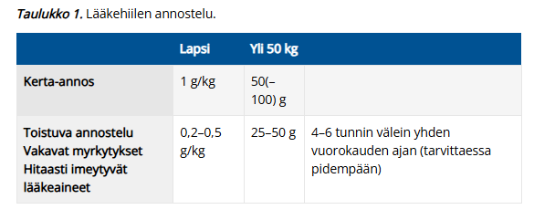

  

#### Luun huippumassa saavutetaan n. 20 ikävuoteen mennessä {#Luun-huippumassa}

  <button class="solution-button"
          data-label="Vastaus"
          data-hide-label="Piilota vastaus">
    Vastaus
  </button>
  

      Väärin/Oikein

Wikissä merkattu oikein, mutta luumassan huippu saavutetaan sinänsä 30 ikävuoteen mennessä. Ikävuodet 30-40 luuntiheys pysyy melko muuttumattomana (plateau); tämän jälkeen luumassaa menetetään keskiarvolta n. 0,7% vuodessa ja menopaussissa kiihtyy vielä enemmän. Maksimaaliseen luumassaan sekä luumassan menetykseen vaikuttaa perintö- että ympäristötekijät (mm. ravinto, liikunta).

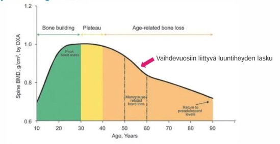
  

#### Alalohkon keuhkokuume voi aiheuttaa oireena pelkästään vatsakivun {#Alalohkon-keuhkokuume-vatsakipu}

  <button class="solution-button"
          data-label="Vastaus"
          data-hide-label="Piilota vastaus">
    Vastaus
  </button>
  

      Oikein

Alalohkokeuhkokuume voi oireilla pelkkänä vatsakipuna ilman selkeitä hengitystieoireita, kuten yskää tai hengenahdistusta. Keuhkopussiin yltävä tulehdus voi ärsyttää palleaa ja sitä hermottavia hermoja, mikä tuntuu kipuna vatsan alueella.

  

#### Puuttuva punaheijaste viittaa glaukoomaan 

  <button class="solution-button"
          data-label="Vastaus"
          data-hide-label="Piilota vastaus">
    Vastaus
  </button>
  

      Väärin

Puuttuva tai poikkeava punaheijaste viittaa valon kulun esteeseen silmän taittavissa väliaineissa tai silmänpohjan sairauteen – ensisijaisesti lapsilla synnynnäiseen kaihiin tai retinoblastoomaan (silmänpohjan pahanlaatuiseen kasvaimeen).

  

#### Downin syndroomaan liittyy älyllinen kehitysvammaisuus {#Down-alyllinen-kehitysvammaisuus}

  <button class="solution-button"
          data-label="Vastaus"
          data-hide-label="Piilota vastaus">
    Vastaus
  </button>
  

      Oikein

21-trisomiaa eli Downin oireyhtymää sairastavia lapsia syntyy Suomessa vuosittain n. 70. **Sille ominaisia löydöksiä ovat kehitysvammaisuuden lisäksi alhainen lihasjäntevyys ja tyypilliset ulkonäköpiirteet, kuten ylöspäin viistot luomiraot, epikantuspoimut ja käsien nelisormipoimut.** _Kehitysvamma on yleensä keskivaikea, mutta voi olla myös lievä tai vaikea._ Sosiaalinen selviytyminen on usein kognitiivisia taitoja mittaavia testituloksia parempaa. 40 %:lla Downin oireyhtymää sairastavista lapsista on **synnynnäinen sydänvika** ja 10 %:lla pohjukaissuolen synnynnäinen tukkeuma tai muu suoliston kehityshäiriö. Myös riski sairastua leukemiaan, maksatulehdukseen, keliakiaan, diabetekseen ja kilpirauhasen vajaatoimintaan on kohonnut.

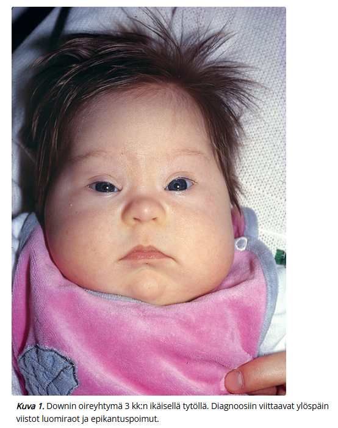
  

#### Imeväisikäisellä atooppinen ihottuma esiintyy yleensä taivealueilla {#Imevaisikaisella-atooppinen-ihottuma-taivealueilla}

  <button class="solution-button"
          data-label="Vastaus"
          data-hide-label="Piilota vastaus">
    Vastaus
  </button>
  

      Väärin

Vauvoilla erityisesti kasvoilla, raajojen ekstensoripinnoilla ja vartalolla. Vaippa-alue yleensä säästyy. 

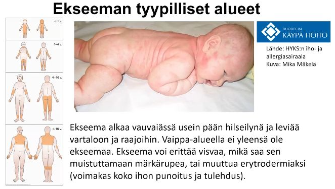
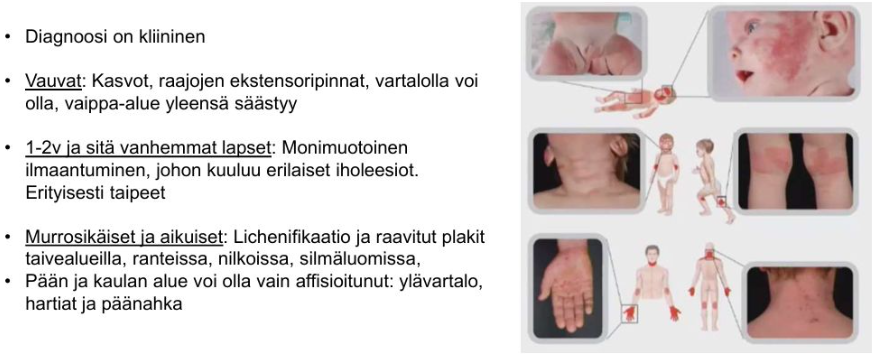

  

#### Viaton sivuääni kuuluu myös selän puolella {#Viaton-selan-puolelta}

  <button class="solution-button"
          data-label="Vastaus"
          data-hide-label="Piilota vastaus">
    Vastaus
  </button>
  

      Väärin

Selän puolelta kuuluva sivuääni herättää epäilyn erityisesti koarktaatiosta.

---

Sydämen ns. **hyvänlaatuinen sivuääni on soinnillinen, alku- tai keskisystolinen, voimakkuudeltaan 1–2/6 ja se voi kuulua rintakehän etupuolelta miltä kuuntelualueelta tahansa.** 

Lyhyesti voi sanoa, että **erikoissairaanhoidon arviota edellyttää systolinen voimakas (vähintään 3/6), karhea, diastolinen, jatkuva (systodiastolinen) tai selän puolelta kuuluva sivuääni.** Myös ikä vaikuttaa sen verran, että **tulisi tehdä lähete ESH riippumatta sivuäänen laadusta, jos lapsi on alle 4kk** (pienillä imeväisillä sydämen rakennepoikkeavuus sivuäänen aiheuttajana on tavallisempi ja muutokset verenkierrossa syntymän jälkeen voivat tuoda sivuäänet esille hiljalleen). Yli 3-vuotiaista kannattaa muistaa jo yllä mainittu, eli **jos yli 3-vuotiaalla todetaan seurannassa toistuvasti hyvänlaatuinenkin sivuääni, niin kannattaa ottaa PTH:ssa kaksi-/neliraajaverenpaineet (eli siis vähintään oikea yläraaja ja toinen alaraaja) ja EKG.** Jos ne (ja muut asiat statuksessa+anamneesissa) ovat normaalit, niin ei tarvitse lisätutkimuksia. Tietysti jos vanhemmat ovat äärimmäisen huolissaan äänestä rauhotteluiden ja tilanteen selittämisen jälkeenkin, niin voi tehdä lähetteen ESH (pelkkä UÄ-varmistus siitä, että kaikki on hyvin, on näille stressaaville vanhemmille tyypillisesti riittävä jatkotutkimus).

<li>Tietysti ESH tarvitaan myös, jos todetaan sivuäänen yhteydessä heikot reisivaltimosykkeet, sydänperäisiä oireita (mukaanlukien heikentynyt suorituskyky), verenpainetaso on epänormaali (esim. yläraajahypertensio tai merkittävä ero (>10mmHg) ylä- ja alaraajan systolisissa verenpaineissa (viittaisi koarktaatioon)), kasvu on hidastunut (eikä mitään muuta selkeää selittävää todeta) tai muuta selkeää poikkeavaa statuksessa.</li>
<li>Päivystyslähetettä tarvitaan mm. jos on sydämen vajaatoimintaan viittavia löydöksiä (esim. hengitysvaikeudet), yleistila on heikentynyt tai sivuäänen lisäksi imeväisikäisellä on heikot/puuttuvat reisivaltimosykkeet (valtimotiehyen sulkeutuminen tapahtuu vaiheittain, minkä vuoksi aortan koarktaation aiheuttamaa reisivaltimosykkeiden heikkenemistä ei aina havaita vastasyntyneiden kotiinlähtötarkastuksessa).</li>

  

#### Uudelleen alkava kastelu voi olla oire diabeteksesta 

  <button class="solution-button"
          data-label="Vastaus"
          data-hide-label="Piilota vastaus">
    Vastaus
  </button>
  

      Oikein

Enuresis tarkoittaa kastelua lapsella, jonka jo odotettaisiin kykenevän rakon kontrolloimiseen(eli ≥5v). Tavallisesti kastelua ei siis diagnosoida alle 5-vuotiaalla lapsella tai lapsella, jonka älykkyysikä on alle 5 vuotta. 

Kastelu voidaan erotella päiväkasteluun (enuresis diurna), yökasteluun (enuresis nocturna) ja sekakasteluun (sekä yö- että päiväoireita). Toinen tärkeä jako on primaariseen ja sekundaariseen kasteluun:

<li>Primaarinen kastelu tarkoittaa tilannetta, jossa lapsi ei ole koskaan ollut yli 6 kk:ta kastelematta.</li>
<li>**Sekundaarinen kastelu tarkoittaa tilannetta, jossa lapsi on alkanut kastella uudelleen oltuaan jossain vaiheessa yli 6 kk kuivana. Sekundaarisen kastelun kanssa tulee pysähtyä miettimään, mikä voisi olla aiheuttajana -- taustalla voi olla mm. VTI, ummetus, uniapnea, diabetes... Yleisimpinä tekijöinä ovat kuitenkin psyykkiset tekijät ja elämäntapamuutokset.**</li>

  

#### VSD aiheuttaa holosystolisen soinnittoman sivuäänen {#VSD-sivuaani}

  <button class="solution-button"
          data-label="Vastaus"
          data-hide-label="Piilota vastaus">
    Vastaus
  </button>
  

      Oikein

Kammioväliseinäaukon (VSD) tyypillinen sivuääni on karhea ja holosystolinen. Sivuäänen voimakkuus riippuu oikovirtauksen nopeudesta ja määrästä; pienemmät VSD:t ovat yleensä äänekkäämpiä, ja vastasyntyneellä kookas paineet tasaava VSD ei sivuääntä aiheuta. Usein sivuäänen voimakkuus on trikuspidaaliläpän alueella (left lower sternal border) voimakkain). 

  

#### Vauvalle aloitetaan lisäruoat (rintamaidon tai korvikkkeen ohella) 4-6 kk:n iästä alkaen {#Vauvalle-lisaruoka}

  <button class="solution-button"
          data-label="Vastaus"
          data-hide-label="Piilota vastaus">
    Vastaus
  </button>
  

      Oikein

Rintamaito on ensisijainen ravinto vauvalle. Vauvan täysimetystä (ainoa ravinto on rintamaito) suositellaan 4–6 kk:n ikään asti ja osittaisimetystä (rintamaidon lisäksi ravintona kiinteä ruoka) vähintään vuoden ikään. Rintamaidossa on kaikki täysiaikaisena ja normaalipainoisena syntyneen vauvan tarvitsemat ravintoaineet D-vitamiinia lukuun ottamatta. Pelkkä maito ei kuitenkaan enää >6kk-ikäisillä riitä kattamaan kasvavan lapsen energiatarvetta ja esim. raudan tarvetta.

---

Maisteluannoksia suositellaan imetetylle vauvalle aikaisintaan 4 kk:n iästä tukemaan suoliston kypsymistä ja sietokyvyn kehittymistä uusille ruoka-aineille. Kiinteitä ruokia ei saisi antaa alle 4 kuukauden ikäiselle vauvalle, koska suolisto tai nielemisfunktio ei ole valmis. 

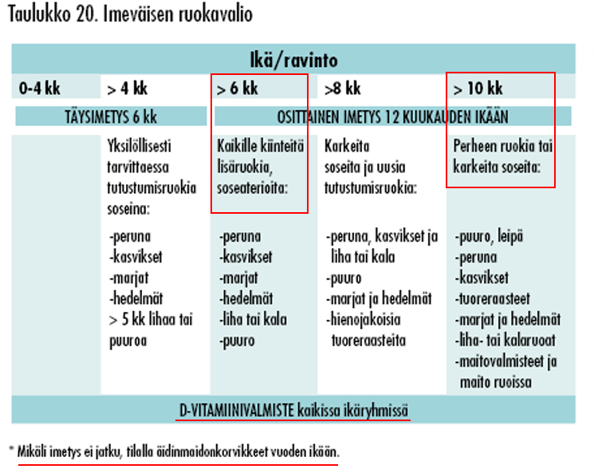
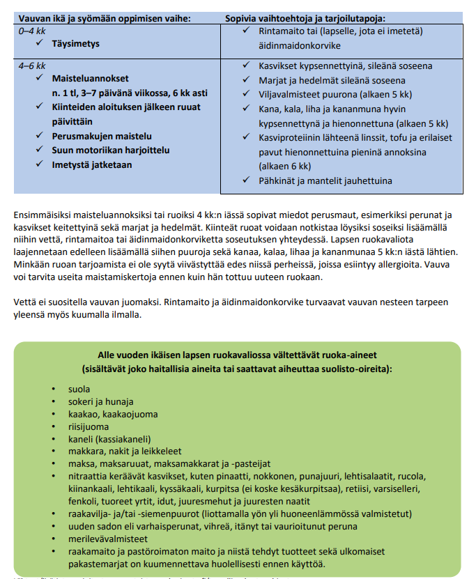
  

#### Tumma iho tehostaa auringonvalon stimuloimaa D-vitamiinisynteesiä elimistössä {#Tummaihoiset-D-vitamiini}

  <button class="solution-button"
          data-label="Vastaus"
          data-hide-label="Piilota vastaus">
    Vastaus
  </button>
  

      Väärin

Tumma iho vähentää D-vitamiinin synteesiä UVB:n vaikutuksesta -> tummaihoisilla ihmisillä on pohjoisilla leveysasteilla huomattavasti suurempi riski D-vitamiinin puutokselle, jos ei käytä ympärivuotista D-vitamiinilisää. 
  

#### Suuri säderasitus rajoittaa TT-tutkimuksen käyttöä lapsilla {#Suuri-saderasitus-TT-lapsilla}

  <button class="solution-button"
          data-label="Vastaus"
          data-hide-label="Piilota vastaus">
    Vastaus
  </button>
  

      Oikein

Tietysti tarvittaessa TT-kuva otetaan, mutta sen käytön kanssa on varovaisemmat kriteerit kuin vanhempien aikuisten, koska säteilyaltistus nuoremmalla iällä altistaa korkeammalle pahanlaatuisten muutosten kehittymisen riskille vuosien kuluessa. 

  

#### D-vitamiinia suositellaan 10 mikrogrammaa päivässä 2 viikon iästä 2 vuoden ikään saakka {#D-vitamiinisuositukset}

  <button class="solution-button"
          data-label="Vastaus"
          data-hide-label="Piilota vastaus">
    Vastaus
  </button>
  

      Oikein

Kaikille vauvoille suositellaan 2vk iästä aloitettavaksi D-vitamiini 10 mikrog (5 tippaa/pv = 10 ug = 400 KY; vähemmän esim. 1-3 tippaa, jos lapsi saa paljon korviketta (korvikkeiden D-vitamointi on n. 2-3 ug/100kcal)). Tätä jatketaan 2 vuoteen saakka. 2-18v on suositus 7.5 ug/pv. 

D-vitamiinia tulisi käyttää vuoden ympäri, ei vain talvisin. 

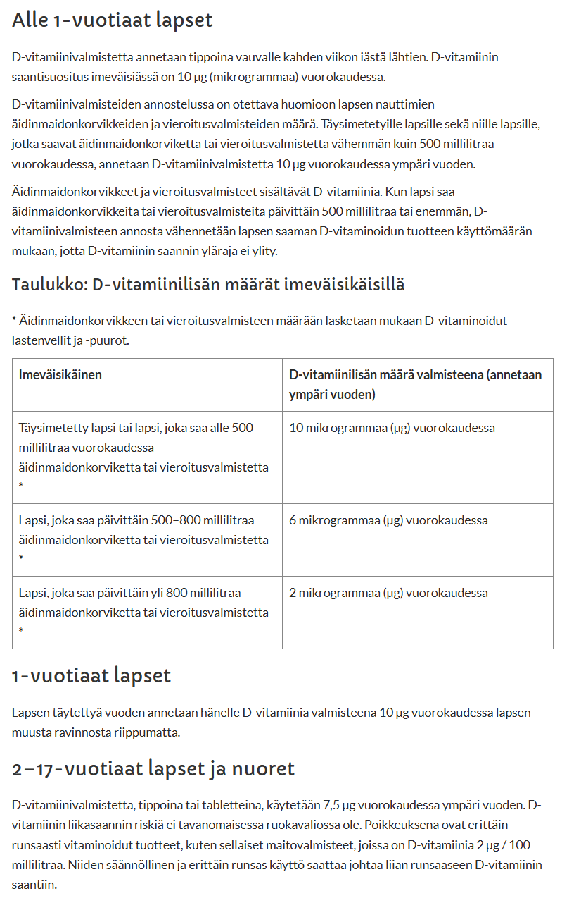
  

#### Streptokokin aiheuttaman tonsilliitin jälkeen voi mennä päiväkotiin vasta 2 vrk:n kuluttua mikrobilääkityksen alusta {#Streptokokki-paivakotiin}

  <button class="solution-button"
          data-label="Vastaus"
          data-hide-label="Piilota vastaus">
    Vastaus
  </button>
  

      Väärin

24 t:n kuluttua mikrobilääkehoidon aloittamisesta potilas muuttuu tartuttamattomaksi ja voi palata kouluun tai päiväkotiin, ellei oireiden takia tarvitse pidempää sairauspoissaoloa. 

  

#### Alle 16-vuotiaan alkoholi-intoksikaation vuoksi on syytä tehdä lastensuojeluilmoitus {#Lasu-alkoholista}

  <button class="solution-button"
          data-label="Vastaus"
          data-hide-label="Piilota vastaus">
    Vastaus
  </button>
  

      Oikein

Lastensuojeluilmoitus tulisi tehdä aina alle 18-vuotiaasta, joka tavataan päihtyneenä tai jonka hallusta löydetään alkoholia.

  

#### Vastasyntyneen keltaisuus on patologista, jos se jatkuu yli kolme viikkoa

  <button class="solution-button"
          data-label="Vastaus"
          data-hide-label="Piilota vastaus">
    Vastaus
  </button>
  

      Oikein

Vastasyntyneen keltaisuutta tulisi ainakin **epäillä patologiseksi,** jos 

<li>se ilmenee ensimmäisen elinvuorokauden aikana</li>
<li>seerumin bilirubiinipitoisuus suurenee nopeasti (yli 85 mikromol/l/vrk) tai ylittää sikiöiän mukaisen turvallisuusrajan</li>
<li>ilmenee sairaalla lapsella (esim. infektiosta johtuvaa)</li>
<li>on pitkittynyttä (>1vk täysiaikaisella tai >2vk keskosella; näin dioissa, mutta suurimmassa osassa lähteitä rajana pitkittyneelle on >2vk täysiaikaisille tai 3-4vk keskosilla)</li>

---

**Patologisen keltaisuuden yleisimpiä aiheuttajia ovat:**

<li>Hemolyysitauti: ABO- tai Rh-veriryhmäsopimattomuus, G6PD-entsyymin puutos, sferosytoosi</li>
<li>Infektiot: Sepsis, keuhkokuume tai kohtuaikaiset infektiot (TORCH-infektiot)</li>
<li>Maksan ja sappiteiden ongelmat: Sappitieatresia (biliaariatresia), neonataalihepatiitti tai aineenvaihduntasairaudet (esim. galaktosemia)</li>
<li>Verenpurkaumat: Hematoomien resorboituminen; esim. kefalohematooma eli päänahkan alainen verikertymä</li>

---

Pitkittyneen keltaisuuden taustalla on useimmiten kuitenkin ns. **rintamaitokeltaisuus,** joka ei sinänsä ole patologista. Sen syytä ei tunneta, mutta on esitetty, että taustalla saattaisi olla rintamaidon sisältämät äidin hormonit tai rintamaidon vapaat rasvahapot (rintamaidon β-glukuronidaasi voi tehostaa enterohepaatista kiertoa). 

Rintamaitokeltaisuus on periaatteessa poissulkudiagnoosi. Tärkeimmät erotusdiagnoosit ovat kuivuma, virtsatieinfektio, vastasyntyneen hepatiitti (neonataalihepatiitti) ja äärimmäisen harvoin hoitamaton synnynnäinen hypotyreoosi. Sappitieatresia johtaisi konjugoidun bilirubiinin lisääntyvään suurenemiseen; samalla ulosteet olisivat vaaleita yleensä. 

Keltaisuuden jatkuessa yli kahden viikon on siis aina syytä varmistaa, ettei kysymyksessä ole konjugoituneen bilirubiinin määrän lisääntyminen, vaikka lapsen muu vointi ei antaisikaan aihetta huoleen. Konjugoituneen bilirubiinin tutkimisesta on tehtävä erillinen pyyntö laboratoriolle, ja tutkimukseen tarvitaan useimmiten laskimoverinäyte. Konjugoidun bilirubiinin mittaaminen voidaan tehdä perusterveydenhuollossa, jos tulos on käytettävissä nopeasti eikä aiheuta viivettä erikoissairaanhoitoon lähettämisessä. Jos mahdollista, niin tulisi tutkia myös muita vakavia syitä ja tarkistaa:

<li>S-Bil ja S-Bil-kj -> _Jos konjugoitu bilirubiini on > 20 % kokonaisbilirubiinista tai yli 20 µmol/l, tarvitaan kiireellisiä erikoissairaanhoidon jatkotutkimuksia sappitieatresian poissulkemiseksi._</li>
<li>Pvk+t, Coombs, retikulosyytit</li>
<li>ALAT</li>
<li>TSH</li>
<li>Ulosteen ja virtsan väri</li>

---

Jos lapsi voi hyvin, paino nousee ja hänellä on vain pitkittynyttä keltaisuutta ja konjugoitumaton hyperbilirubinemia, niin kyseessä on todennäköisimmin rintamaitokeltaisuus. Rintamaitokeltaisuus on vaaratonta eikä sitä tarvitse hoitaa. 

Imetystaukoa ei suositella, koska se voi johtaa imetyksen loppumiseen kokonaan ja rintaruokintaa saa jatkaa, jos bilirubiinitasot eivät seurannassa anna aihetta muihin selvittelyihin ja lapsi voi hyvin. 

---

Jos lapsi kellastuisi uutena yli 2 viikon iässä (alle 2vk syntymästä yleensä vanhemmilla on yleensä vapaa yhteys synnytyssairaalaan ongelmatilanteiden selvittelyssä), hänet lähetetään lastenpoliklinikkaan lisätutkimuksiin kiireellisesti < 1 viikon lähetteellä tai päivystyslähetteellä seuraavana arkipäivänä (tai heti jos epäily esim. sepsiksestä tai vaikeasta hemolyysistä). Laboratoriokokeiden ottaminen perusterveydenhuollossa ei ole välttämätöntä ennen lähettämistä. 

<li>Ilmeisesti oikeassa elämässä lähete tulee usein takaisin rintamaitokeltaisuuden diagnoosilla, mutta terveysportin ohjeiden mukaan yli 2vk iässä kellastuvat ohjataan ESH.</li>

  

#### Jos lapsi on lähisuvussaan ainoa lihava, se lisää todennäköisyyttä, että kyseessä on tavallinen lihavuus {#Ainoa-lihava}

  <button class="solution-button"
          data-label="Vastaus"
          data-hide-label="Piilota vastaus">
    Vastaus
  </button>
  

      Väärin

Se, että lapsi on sukunsa ainoa merkittävästi lihava henkilö, ei lisää tavallisen (polygeenisen/elintapasidonnaisen) lihavuuden todennäköisyyttä, vaan päinvastoin herättää epäilyn harvinaisemmasta, monogeenisesta, oireyhtymään liittyvästä tai sekundaarisesta (esim. hypotyreoosi) lihavuudesta.

  

#### Lihavilla lapsilla esiintyy usein kohonneita maksan transaminaasiarvoja

  <button class="solution-button"
          data-label="Vastaus"
          data-hide-label="Piilota vastaus">
    Vastaus
  </button>
  

      Oikein

Lihavuuteen liittyy erittäin usein rasva-aineenvaihdunnan häiriö (kohonneet triglyseridit, matala HDL-kolesteroli ja kohonnut LDL-kolesteroli), mikä lisää valtimotautien ja **rasvamaksan** riskiä jo lapsuus- ja nuoruusiässä. 

Lihavilta lapsilta T4V ja TSH tutkitaan diagnostisen selvittelyn osana, jos pituuskasvu samanaikaisesti hidastuu eikä syynä ole kasvukauden loppuminen puberteetissa, ja kerran kaikilta lihavilta lapsilta. Lisäksi perusverikokeet tutkitaan kerran lihavilta lapsilta, ja ne voidaan uusia kertaalleen murrosiässä, jos tutkimukset on edellisen kerran otettu alle 10 v:n iässä: PVK, Kol, LDL, HDL, Trigly, fP-Gluk, HbA1c (joskus yli 10-vuotiaille myös oraalinen sokerirasituskoe paikallisen hoitoketjun mukaan), ALAT. 

  

#### Yleisin nestetasapainon häiriö on lapsella kuivuminen {#Kuivuminen-yleisin}

  <button class="solution-button"
          data-label="Vastaus"
          data-hide-label="Piilota vastaus">
    Vastaus
  </button>
  

      Oikein

Yleisin syy lapsen kuivumalle on virus-gastroenteriitti. 

  

#### Painon menetyksellä voidaan kuvata kuivumaa {#Painon-menetys-kuivuma}

  <button class="solution-button"
          data-label="Vastaus"
          data-hide-label="Piilota vastaus">
    Vastaus
  </button>
  

      Oikein

Kuivuman arviossa tärkeää on tietysti anamneesi ja status sekä vitaalien tarkistaminen. 

<li>Anamneesi:</li>
  <ul>
    <li>Oireet, niiden kesto, mitä annettu ja mitä menetetty, virtsan määrä</li>
  </ul>
<li>Status:</li>
  <ul>
    <li>Paino (tarkista myös kasvukäyrä), kapillaaritäyttö (normaali alle 3sek), limakalvojen kosteus, ihon turgor (telttautuminen), silmien kuopalla olo</li>
  </ul>
<li>Vitaalit:</li>
  <ul>
    <li>Syke, verenpaine, hengitystaajuus, saturaatio...</li>
  </ul>
  
---

Kuivuman vaikeus voidaan jakaa lievään (3-5%), keskivaikeaan (6-10%) ja vaikeaan (9-15%). Arviossa käytetään alla olevan taulukon löydöksiä. **Paras objektiivinen mittari on kuitenkin painon muutos (jos tuore vertailupaino on tiedossa).**

Elektrolyyttiarvot ovat yleensä normaalit, jonka takia niitä ei voida käyttää kuivuman vaikeuden arviossa. Kuitenkin jos tarvitaan suonensisäistä nesteytystä, verikaasuanalyysi ja elektrolyytit (K, Na) on hyvä tarkistaa; hyväkuntoiselta lapselta ei yleensä tarvita verikokeita virustautiepäilyissä.

  

#### Akuutti yskä paranee yskimällä {#Yska-yskimalla}

  <button class="solution-button"
          data-label="Vastaus"
          data-hide-label="Piilota vastaus">
    Vastaus
  </button>
  

      Oikein

Yskänlääkkeiden teho on tutkimuksissa todettu hyvin vähäiseksi tai lumeluonteiseksi; lapsilla ei myöskään kodeiinipitoisia yskänlääkkeitä voi käyttää (kodeiini vasta-aiheista alle 12v). Siksi paras "hoito" akuuttiin flunssayskään on useimmiten vain ajan antaminen, riittävä lepo ja nesteen juominen. 

Tietysti taustalla voi olla jokin hoitoa vaativa sairaus (keuhkokuume, astmakohtaus...), jolloin voidaan tarvita lääketieteellistä hoitoa. 
  

#### Alle kolmevuotiaan tonsilliitti on tyypillisesti streptokokin aiheuttama

  <button class="solution-button"
          data-label="Vastaus"
          data-hide-label="Piilota vastaus">
    Vastaus
  </button>
  

      Väärin

Bakteeriperäisten nielutulehdusten taustalla on useimmiten beetahemolyyttisten streptokokkien (BHS) ryhmä, joista yleisin aiheuttaja on A-ryhmän streptokokki eli Streptococcus pyogenes (StrA, GAS). StrA liittyy 14 %:iin kaikista aikuisten nielutulehduksista ja 25–37%:iin lasten (< 18-vuotiaat) nielutulehduksista. Beetahemolyyttiseen ryhmään kuuluu myös C- ja G-streptokokit. Muiden streptokokkien osuutta nielutulehduksista ei tiedetä tarkkaan, mutta se on pienempi kuin StrA:n. 

**Alle 3-vuotiailla beetahemolyyttinen streptokokki (BHS) on kuitenkin nielutulehduksen aiheuttajana harvinainen** ja yleensä streptokokit alkavat aiheuttaa lapsille nielutulehduksia vasta kouluiässä. Tietysti jos lapsella on esim. sisaruksia, jotka tuovat taudin kotiin, niin alle kouluikäisilläkin voi ilmentyä streptokokkifaryngiittia (usein ilmenee atyyppisesti eli mm. epäspesifinen kuume ja kirkas nenäerite). **Alle 5-vuotiailla yleisin aiheuttaja on adenovirus**

  

#### Kylmä ilma helpottaa kurkunpään tulehdukseen liittyvää ahdistusta {#Kylma-ilma-laryngiitissa}

  <button class="solution-button"
          data-label="Vastaus"
          data-hide-label="Piilota vastaus">
    Vastaus
  </button>
  

      Oikein

Kurkunpäätulehdus on lieväoireinen 85 %:lla lapsista ja vain 1 %:lla on vaikea kurkunpäätulehdus. **Tavallinen kurkunpäätulehdus, johon ei liity hengitysvaikeutta, paranee itsestään.**  Levossa esiintyvä äänekäs sisäänhengitys tai kurkunpäätulehdukseen liittyvä lieväkin pulssioksimetrilla todettava happeutumishäiriö viittaavat vaikeaan tautiin.  

_Suurin osa lapsista voidaan hoitaa kotona._ **Ensisijainen hoito on oireenmukainen** + äänilepo (jos vanhemmalla lapsella/aikuisella ja pystyy ohjeistamaan). Kuumeisen ylähengitystieinfektion aikana hyvä nestetasapaino sekä tulehduskipulääkkeet helpottavat laryngiittipotilaan vointia. Höyryhengityksen tehosta ei ole näyttöä, mutta jotkut voivat kokea siitä hyötyä.

**Jos lapsella on hengitysvaikeus, se helpottaa useimmiten istuvassa asennossa ja viileä ilma helpottaa kurkunpäätulehduksen oireita.** Huoneilman viilentämisen voi toteuttaa esimerkiksi pitämällä ikkunan auki. Jos hengitysvaikeus ei nopeasti helpotu 15–20 minuutin kuluessa, lapsi tulee viedä päivystykseen.

---

Laryngiittiin liittyvä **hengitysvaikeus hoidetaan suun kautta annettavalla glukokortikoidilla** (deksametasonin annos on 0.15–0.6 mg/kg suun kautta tai lihakseen (enintään 8 mg); beetametasonia erityislupavalmisteena voi myös käyttää, annos on 0.25–0.4 mg/kg suun kautta (enintään 7 mg). Nesteeseen liuotettava 0.5 mg:n tabletti maistuu paremmalta kuin deksametasoni). Jos hengitysvaikeus jatkuu huolimatta suun kautta annostellusta glukokortikoidista, voidaan tarvittaessa antaa lisälääkkeenä, yleensä sairaalassa, 2 mg inhaloitavaa budesonidia.

**Vaikeassa, äkillisessä tilanteessa voidaan käyttää lisäksi inhaloitavaa raseemista adrenaliinia höyrystävällä inhalaattorilla.** Raseeminen adrenaliini lievittää tehokkaasti laryngiitista johtuvan hengitysvaikeuden oireita, mutta sen vaikutus on lyhyt, vain 1–2 t. Koska hengitysvaikeus palaa yleensä 1–2 t:n kuluessa, raseemista adrenaliinia saaneet potilaat on lähetettävä ensiavun jälkeen herkästi sairaalahoitoon tai heitä on seurattava polikliinisesti riittävän kauan (vähintään 1–2 t). 

**Mikrobilääkkeistä, keuhkoputkia avaavista lääkkeistä, antihistamiineista, yskänlääkkeistä tai höyryhengityksestä ei ole hyötyä lasten kurkunpäätulehduksen hoidossa.**

---

Sairaalaan voidaan lähettää tietyissä tapauksissa ja lapsi voidaan ottaa osastoseurantaan, ja joskus jopa teho-osastolle. Sairaalaan kuuluu lähettää, jos 

<li>yleistila on huonontunut</li>
<li>inspiratorinen stridor jatkuu ensiapulääkityksestä huolimatta</li>
<li>hengitysvaikeus uusiutuu ensiapulääkkeen jälkeisen päivystysseurannan (1–2 t) aikana tai</li>
<li>todetaan pienentynyt happisaturaatio (< 95 %) ensiapulääkkeen jälkeisen päivystysseurannan aikana</li>

  

#### Positiivinen tuberkuliinitesti kertoo elimistön kohdanneen mykobakteerin {#Tuberkuliinitesti}

  <button class="solution-button"
          data-label="Vastaus"
          data-hide-label="Piilota vastaus">
    Vastaus
  </button>
  

      Oikein

Latentin tuberkuloosin tutkimisessa voidaan käyttää tuberkuliinikoetta (Mantoux). Tuberkuliinitesti on positiivinen, jos on saanut tuberkuloositartunnan tai BCG-rokotteen (IGRA ei pos. rokotuksen kanssa). 

Tuberkuliinikokeen käyttö on vähentynyt ja tilalle on suurelta osin käyttöön tullut **IGRA-verikoetesti** (interferon gamma release assay, gammainterferonin tuotantoon perustuva testi).

Positiivinen IGRA (interferon-gamma release assay) -> infektoitunut joskus TB (BCG-rokote ei aiheuta positiivista reaktiota; vrt. tuberkuliinikoe eli Mantoux-ihotesti). Ei kuitenkaan erota aktiivista ja latenttia infektiota toisistaan! -> IGRA käytetään pääasiassa tartunnanjäljityksessä ja mietittäessä latentin tuberkuloosin hoidon aloitusta. Akuuttia infektiota diagnosoidessa tulee ottaa keuhkokuva, ysköksen tb-värjäys ja -viljely, nukleiinihapon osoitus; on myös PCR-pikatestejä. 

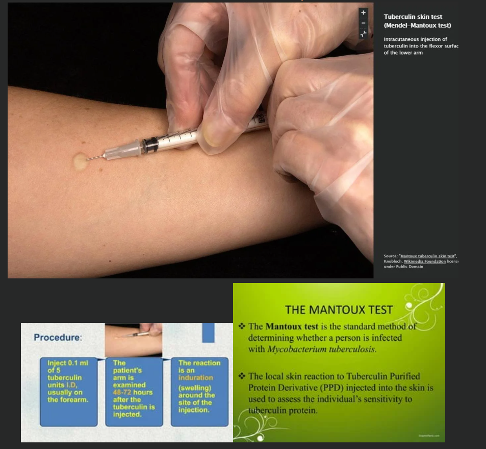
  

#### Allergista nuhaa voidaan hoitaa mm. nenästeroideilla ja allergiasaneerauksella {#Allerginen-nuha-saneeraus}

  <button class="solution-button"
          data-label="Vastaus"
          data-hide-label="Piilota vastaus">
    Vastaus
  </button>
  

      Oikein

Allergisen nuhan hoidoksi valitaan vaikeusasteen mukaan ensisijaisesti paikallisesti annosteltava nenästeroidi (ensisijaisesti suihke), suun tai nenän kautta otettava antihistamiini tai näiden yhdistelmä. Nenään paikallisesti annosteltavat glukokortikoidi-nenäsuihkeet tehoavat allergisen ja ei-allergisen nuhan kaikkiin oireisiin. Paikallisesti annosteltavaa antihistamiini-glukokortikoidi-yhdistelmäsuihketta käytetään yliherkkyysnuhassa, jos pelkkä glukokortikoidi-nenäsuihke ei tehoa riittävästi. Lievissä oireissa antihistamiinit voivat riittää oireenmukaiseksi hoidoksi (esim. lievissä kausittaisissa oireissa).

Steroidihoito tulisi aloittaa jo ennen oireiden ilmenemistä kausinuhassa. Käyttöä jatketaan säännöllisenä koko kauden ajan. Potilas voi säädellä annosta altistuksen (siitepölymäärien) ja oireiden mukaan.

Saneerauksella tarkoitetaan allergiaoireita aiheuttavien tekijöiden (kuten pölypunkkien, eläinhilseen...) määrän vähentämistä elinympäristössä eli kodissa; nykyään vältetään turhan tiukkoja "varmuuden vuoksi" tehtäviä saneerauksia. 
  

#### Trakeiittiin kuuluu tyypillisesti puuskittainen yskä {#Trakeiitti-puuskittainen-yska}

  <button class="solution-button"
          data-label="Vastaus"
          data-hide-label="Piilota vastaus">
    Vastaus
  </button>
  

      Väärin
      
Trakeiitille eli trakean tulehdukselle ominaista ei ole "puuskittainen" yskä, vaan mieluummin syvä, käheä ja haukkuva yskä (kuten valekrupissa/laryngiitissa), johon liittyy sisäänhengityksen vinkuna (stridor) sekä vaikeutuva hengitysahtaus. 

Puuskittainen yskä viittaa puolestaan tyypillisesti hinkuyskään (pertussis), jossa esiintyy pitkiä, tukehtumisentaipuisia yskänpuuskia, joita seuraa usein oksentaminen. 

  

#### Lääkeyliherkkyys esiintyy useimmiten urticariana ja eksanteemana {#Laakeyliherkkyys-urtikaria}

  <button class="solution-button"
          data-label="Vastaus"
          data-hide-label="Piilota vastaus">
    Vastaus
  </button>
  

      Oikein
      
Lääkkeet voivat aiheuttaa joko ennakoituja tai ennakoimattomia haitallisia reaktioita. Ennakoimattomia haitallisia reaktioita ovat lääkkeiden aiheuttamat yliherkkyysreaktiot (drug hypersensitivity, voivat olla joko ei-allergisia eli pseudoallergisia tai välittömiä tai viivästyneitä allergisia reaktioita) ja immunologisen mekanismin kautta syntyvät lääkeallergiset (drug allergy) reaktiot.

Lääkeihottumiksi kutsutaan iholla esiintyviä lääkkeiden aiheuttamia reaktioita. **Tavallisimmat lääkkeen aiheuttamat iho-oireet ovat eksanteema (rokkoihottuma) ja urtikaria (nokkosihottuma).** Yleisimpiä aiheuttajia ovat mikrobilääkkeet (erityisesti penisilliinit ja muut beetalaktaamit).

Lääkeihottumien taustalla voivat olla lääkeaineyliherkkyys, lääkeaineallergia tai lääkkeen toksiset tai farmakologiset ominaisuudet. Lääkeihottuman syntyyn vaikuttavat myös yksilölliset perintötekijät (lääkemetabolia, farmakogenetiikka) ja samanaikaiset infektiot. Esimerkiksi amoksisilliinihoidon kanssa samanaikainen akuutti mononukleoosi altistaa lääkeihottumalle.

Lääkeaineet voivat myös laukaista tai pahentaa monia eri autoimmuunipohjalta syntyviä tai tulehduksellisia ihosairauksia joko yksin tai yhdessä UV-altistuksen kanssa. 
  

#### Turnerin oireyhtymä johtaa lyhytkasvuisuuteen {#Turner-lyhytkasvuisuus}

  <button class="solution-button"
          data-label="Vastaus"
          data-hide-label="Piilota vastaus">
    Vastaus
  </button>
  

      Oikein
      
Turnerin oireyhtymän on kromosomipoikkeavuus, jonka yleisin karyotyyppi on 45,XO. Esiintyy 1:2 500–1:5 000 tytöstä. 

Sen tärkeimmät oireet ovat pienikokoisuus ja munasarjojen toimimattomuudesta johtuva viivästynyt tai puuttuva murrosikä. Muita löydöksiä voivat olla turvonneet kämmenselät ja jalkaterät vastasyntyneenä, leveä ja lyhyt kaula, kaulapoimu ja aortan koarktaatio. Ilmiasu vaihtelee suuresti, joten hitaasti kasvavasta tai murrosiältään viiveisestä tytöstä tulee tutkia kromosomit matalalla kynnyksellä. Varhainen diagnoosi takaa optimaalisen hoidon ja sen myötä lähes normaalin kasvun ja murrosiän kehityksen.

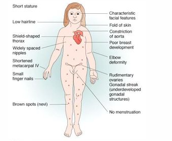
  

#### Mykoplasmapneumoniaan liittyy tyypillisesti korkea kuume

  <button class="solution-button"
          data-label="Vastaus"
          data-hide-label="Piilota vastaus">
    Vastaus
  </button>
  

      Väärin
      
Toisin kuin klassiselle bakteerikeuhkokuumeelle (kuten pneumokokin aiheuttamalle), Mycoplasma pneumoniae -bakterin aiheuttamalle keuhkokuumeelle on tyypillistä lievä tai kohtalainen kuume ja suhteellisen hyvä kunto (ns. atyyppinen keuhkokuume eli "walking pneumonia").

  

#### Yökasteluun liittyy yleensä jokin virtsateiden rakenteellinen poikkeus {#Yokastelu-rakenteellinen-poikkeus}

  <button class="solution-button"
          data-label="Vastaus"
          data-hide-label="Piilota vastaus">
    Vastaus
  </button>
  

      Väärin
      
Niin yö- taikka päiväkastelu ei yleensä johdu kirurgisesta syystä -- varsinkaan yökastelu, joka voidaan pääsääntöisesti hoitaa PTH:ssa. Päiväkastelussa yleensä tehdään UÄ-tutkimus ESH:ssa, mutta sekin jää useimmiten rakenteellisen vian suhteen negatiiviseksi. 

  

#### Pojan somaattista kehitysastetta mitataan Tannerin luokituksen P- ja G-luokilla 

  <button class="solution-button"
          data-label="Vastaus"
          data-hide-label="Piilota vastaus">
    Vastaus
  </button>
  

      Oikein
      
Tannerin asteikossa murrosiän edistymistä arvioivat osa-alueet merkataan seuraavilla kirjaimilla:

<li>P = Häpykarvoitus</li>
<li>G = Poikien sukupuolielimet</li>
<li>M = Tyttöjen rintakudos</li>

---

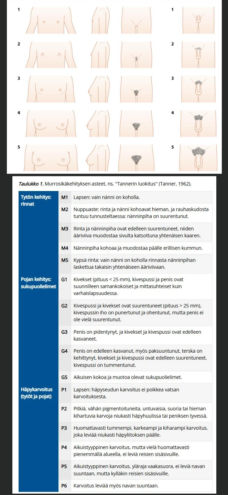
  

#### Synnynnäinen hypotyreoosi ei vaikuta sikiökauden kasvuun {#Synnynnainen-hypotyreoosi}

  <button class="solution-button"
          data-label="Vastaus"
          data-hide-label="Piilota vastaus">
    Vastaus
  </button>
  

      Oikein

**Synnynnäisessä hypotyreoosissa lapsi on yleensä vastasyntyneenä normaalisti kehittynyt ja kasvanut.** Vastasyntyneen seulonnassa löytyneen hypotyreoosin varhain aloitettu hoito turvaa käytännössä lapsen normaalin kasvun ja kehityksen, vaikka joissakin tutkimuksissa on myös hoidetuilla lapsilla löydetty vähäistä viivettä kehityksessä suhteessa terveisiin lapsiin. Jos synnynnäistä hypotyreoosia ei hoideta, hidastuu kasvu välittömästi ja lapsen kehitys vaurioituu pysyvästi. Lapsella voi lisäksi olla todettavissa hypotonia, keltaisuus, ulostyöntyvä kieli, vatsan pulleus ja suuri päänympärys hidastuneesta kallon saumojen luutumisesta johtuen.

_Synnynnäiseen hypotyreoosiin liittyy lievästi kohonnut anomalioiden riski._ Synnynnäisen sydänvian yleisyys on neljä kertaa tavallisempi kuin muilla lapsilla, ja myös luuston, munuaisten ja virtsateiden ja ruuansulatuskanavan poikkeavuudet ovat lievästi yleistyneet. Kuulovammoja on kuvattu jopa 20 %:lla lapsista. Näiden poikkeavuuksien osalta ei kuitenkaan ole olemassa seulontasuositusta. Tiettyjen geenien virheisiin liittyy hypotyreoosin lisäksi muita selkeitä poikkeavuuksia: FOXE-1-geenin mutaatioihin voi liittyä suulakihalkio ja NKX2.1-geenin mutaatioihin neurologisen kehityksen poikkeavuus, erityisesti ataksia.

---

Synnynnäisen hypotyreoosin esiintyvyys Suomessa on noin 1:2 700 vastasyntynyttä. Synnynnäistä hypotyreoosia on Suomessa seulottu napaverinäytteistä vuodesta 1979 alkaen. Synnynnäisen hypotyreoosin seulomiseksi jokaisen vastasyntyneen kilpirauhasen toiminta tutkitaan määrittämällä napaveren TSH-pitoisuus. Jos arvo ylittää seulontarajan, otetaan uusintanäyte yleensä 3 vrk:n päivän kuluttua, tämän tuloksen perusteella joko aloitetaan tyroksiinikorvaushoito tai lapsi todetaan tältä osin terveeksi. Jos kyseessä on kaksosraskaus ja yhteinen istukka, lasten TSH-pitoisuudet ovat voineet sekoittua istukan kautta. Tällöin molemmilta kaksosilta tutkitaan myöhemmin TSH (ja mahdollisesti T4v). Myös pikkukeskosilla hypotyreoosi on täysiaikaisia yleisempää ja myöhempi uusintaseulonta on tarpeen.

---

Pysyvä synnynnäinen hypotyreoosi johtuu useimmiten (85 %) kilpirauhasen kehityshäiriöstä (dysgeneesi), tai harvemmin (15 %) hormonituotannon perinnöllisestä häiriöstä (dyshormonogeneesi). Synnynnäisen hypotyreoosin aiheuttajiksi on paljastunut useiden geenien virheitä, mutta tunnetut geenivirheet selittävät vain hyvin pienen osan kaikista hypotyreoositapauksista, erityisesti dysgeneesin etiologia jää edelleen useimmiten tuntemattomaksi. Ohimenevä hypotyreoosi voi johtua äidin raskaudenaikaisesta jodin puutteesta, äidin käyttämästä kilpirauhasen liikatoimintaa jarruttavasta lääkkeestä tai äidiltä saaduista TSH-reseptorin toimintaa estävistä vasta-aineista. Ohimenevä lievä hypotyreoosi voi aiheutua myös heterotsygoottisesta geenivirheestä tai kookkaasta maksan hemangiomasta.

Sentraalinen/tertiäärinen hypotyreoosi on hyvin harvinainen, mutta on tärkeää huomata, että sairaus ei löydy seulonnalla, joka perustuu suureen TSH-pitoisuuteen hypotyreoottisella vastasyntyneellä. Erittäin harvinaisia syitä ovat myös poikkeava tyroksiinin kuljetus solun sisään sekä kilpirauhashormoni- tai tyreotropiiniresistenssi reseptorimutaation vuoksi. 

---

**Hoito toteutetaan erikoissairaanhoidossa,** koska hoidon toteutuminen on varmistettava kaikilla potilailla normaalin kehityksen ja kasvun turvaamiseksi: ensimmäisen kahden vuoden aikana **hypotyreoosi voi johtaa palautumattomaan kehitysviiveeseen.** Hoito aloitetaan välittömästi, kun varmistavasta näytteestä on saatu positiivinen eli poikkeava tulos. Tyroksiinin suositeltu aloitusannos on 10–15 (n. 12) mikrog/kg. Tyroksiini annetaan pienelle lapselle murskattuna pieneen määrään vettä sekoitettuna. Lääke annostellaan aamulla ja lapsen olisi hyvä olla syömättä puoli tuntia lääkkeen oton jälkeen. Tällä hoidolla T4v- ja T3v-pitoisuudet normalisoituvat keskimäärin kolmessa päivässä ja TSH-pitoisuus viimeistään neljän viikon kuluessa. Tämän jälkeen hoitoannos määräytyy kilpirauhasarvojen, lapsen kasvun ja voinnin mukaan. Jos hoidon aikana TSH-pitoisuus ei ole suurentunut yli iänmukaisten viitearvojen, kannattaa pitää lyhyt hoitotauko lapsen ollessa 2–3-vuotias ja tutkia kilpirauhaskokeet tauon jälkeen ja vielä 2, 4 ja 8 viikon kuluttua. Luonnollisesti pysyvä tyroksiinihoito aloitetaan heti, jos tauon aikana TSH kohoaa tai T4v laskee selkeästi viitearvojen ulkopuolelle. Kolmen vuoden iästä alkaen synnynnäinen hypotyreoosi hoidetaan samoin kuin juveniili hypotyreoosi.

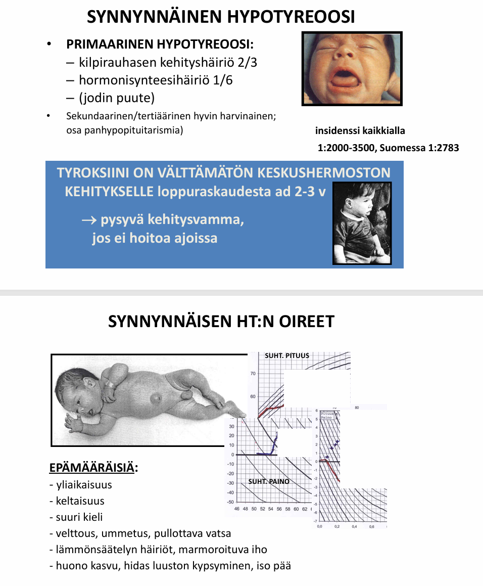
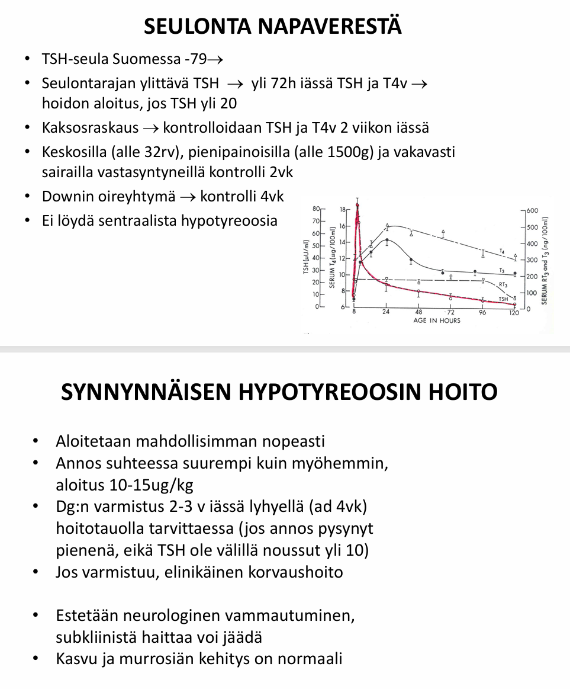

  

#### Virtsatieinfektio imeväisellä on normaali ilmiö eikä vaadi jatkotutkimuksia {#VTI-imevaisella-ei-jatkotutkimuksia}

  <button class="solution-button"
          data-label="Vastaus"
          data-hide-label="Piilota vastaus">
    Vastaus
  </button>
  

      Väärin

Merkittävien hoitoa vaativien rakennepoikkeavuuksien ja synnynnäisten munuaisten kehityshäiriöiden toteamiseksi tehdään **ultraäänitutkimus**

<li>aina imeväisen (< 2-vuotiaat) virtsatieinfektion jälkeen</li>
<li>ensimmäisen pyelonefriitin jälkeen kaikilla lapsilla ja nuorilla</li>
<li>leikki- ja kouluikäisten poikien virtsatieinfektion jälkeen</li>

  

#### Lihominen voi kiihdyttää pituuskasvua {#Lihominen-kiihdyttaa}

  <button class="solution-button"
          data-label="Vastaus"
          data-hide-label="Piilota vastaus">
    Vastaus
  </button>
  

      Oikein

Tavallinen lihavuus johtaa kasvun ja luuston kypsymisen lievään nopeutumiseen (aikuispituus ei kasvuiän lihavuuden takia muutu, koska ylimääräinen energia johtaa kasvupotentiaalin hyödyntämiseen etuajassa). 

Syytä lihavuuden aiheuttamalle kasvun kiihtymiselle ei täysin tunneta, mutta todennäköisesti ilmiö liittyy liiallisen rasvakudoksen aikaan saamiin muutoksiin lisämunuais-, sukupuoli- ja kilpirauhashormoneissa. Lihavuuteen liittyy myös suurentunut insuliini- ja insuliinin kaltaisten kasvutekijöiden eritys.

---

Pituus ja paino tulee aina seurata yhdessä lapsen kasvua arvioitaessa. Käyrien ristitseminen (esim. painon nousu ja kasvun hidastuminen) on aina poikkeavaa (esim. hypo-/hypertyreoosi). 

  

#### Alle 37 raskausviikolla syntynyt lapsi on keskonen

  <button class="solution-button"
          data-label="Vastaus"
          data-hide-label="Piilota vastaus">
    Vastaus
  </button>
  

      Oikein

Termi "keskonen" on alun perin arkkiatri Arvo Ylpön käyttämä nimitys alle 2 500 g:n painoisena syntyneelle vastasyntyneelle (nykyään pieni syntymäpaino (low birthweight, LBW)), mutta nykyään termillä tarkoitetaan yleisemmin ennenaikaisesti (<37vk) syntynyttä lasta.
  

#### Avoimen duktus arteriosuksen sulkuun voidaan käyttää indometasiinia {#Indometasiini-PDA}

  <button class="solution-button"
          data-label="Vastaus"
          data-hide-label="Piilota vastaus">
    Vastaus
  </button>
  

      Oikein

Avoin valtimotiehyt (PDA) voidaan keskosilla usein sulkea lääkkeellisesti mm. indometasiinilla (tai ibuprofeenilla tai joskus parasetamoliakin voidaan kokeilla), joka vähentää PGE:n tuotantoa ja johtaa siten PDA:n sulkeutumiseen.

<li>PGE siis luonnollisesti pitää duktuksen auki sikiöllä. NSAID:t (eli siis myös ibuprofeenia voitaisiin käyttää) blokkaavat COX-välitteistä PGE-synteesiä -> PDA sulkeutuu (PGE:n antaminen lääkemuodossa esim. alprostadiilina siten voisi pitää PDA:n auki).</li>

---

Lääkkeellinen sulku ei tehoa muilla kuin keskosilla

<li>Valtimotiehyt suljetaan keskosilla leikkauksella, mikäli lääkkeellinen sulku ei tuota tulosta</li>
<li>Muilla potilailla avoin valtimotiehyt suljetaan verisuonta pitkin vietävällä tulppa- tai kierukkamallisella sulkulaitteella. Hoidon tulokset ovat erinomaisia ja sulun jälkeen sydämen toiminta palautuu normaaliksi eikä pitkäaikaisseurantaa tai rajoituksia tarvita.</li>

  

#### Apgarin pisteet jo sinällään antavat luotettavan kuvan vastasyntyneen asfyksian asteesta {#Apgarin-pisteet-asfyksia}

  <button class="solution-button"
          data-label="Vastaus"
          data-hide-label="Piilota vastaus">
    Vastaus
  </button>
  

      Väärin

Asfyksian vaikeusaste määritellään ICD-10:ssä pääasiassa Apgar-pisteiden perusteella, vaikka ne heijastavatkin asfyksiaa vain osittain. Pelkästään Apgarin pisteillä ei kuitenkaan voida varmasti sanoa asfyksiasta mitään, koska jos Apgarin pisteet ovat pienet, mutta pH-taso on normaalin rajoissa (tai vain vähän laskenut), ei todennäköisesti ole kyse asfyksiasta. 

---

Syntymäasfyksialla tarkoitetaan sikiölle perinataalisti (juuri ennen syntymää, syntyessä tai juuri syntymän jälkeen) ilmaantuvan hapenpuutteen, hiilidioksidin kertymisen ja kudosverenkierron vajauksen yhdistelmää

<li>Hapenpuute johtaa metaboliseen asidoosiin, joka voidaan havaita jo sikiöstä synnytyksen aikana otetusta mikroverinäytteestä ja varmistaa napaveren verikaasuanalyysin avulla.</li>
<li>Yleisesti käytetty vastasyntyneen asfyksian määritelmä perustuu sekä huonoon yleiskuntoon että verinäytteessä todettuun metaboliseen asidoosiin</li>
<li>ICD-10-diagnoosiluettelossa taudin vaikeusaste luokitellaan Apgarin pisteiden perusteella, mutta lisäksi lapsella pitää olla muita asfyksian kliinisiä löydöksiä, kuten alentunut jäntevyys, riittämätön tai puuttuva hengitys ja harva sydämen syke. Vaikka pisteet heijastavat asfyksiaa vain osittain, niiden ja napavaltimoveren pH:n määritykset ovat tärkeitä yksittäisen lapsen kannalta, ja ne kuuluvat normaaliin synnytystoiminnan laadunvarmennukseen. Jos Apgarin pisteet ovat pienet, mutta pH-taso on normaalin rajoissa (tai vain vähän laskenut), ei todennäköisesti ole kyse asfyksiasta.</li>
<li>Kehittyneissä maissa arviolta 1–4 lasta tuhannesta vastasyntyneestä kärsii vaikeasta tai keskivaikeasta syntymäasfyksiasta</li>

---

Asfyksian syyt voivat olla moninaisia.

<li>Äidin perussairaus (esimerkiksi diabetes tai hypertensiivinen sairaus), istukan toiminnan häiriö (mm. äidin raskausmyrkytykseen eli pre-eklampsiaan liittyen), istukan äkillinen irtoaminen (ablaatio), napanuoran poikkeava puristuminen synnytyksen aikana tai sikiön sairaus (esim. infektio, verenvuoto tai epämuodostuma) voi altistaa asfyksialle.</li>
<li>Asfyksian syytä selviteltäessä onkin tärkeää perehtyä sekä äidin anamneesiin että synnytyksen aikaisiin tapahtumiin ja olosuhteisiin (vähäinen lapsivesi, napanuorakomplikaatiot, istukka-ablaatio, kalvokiinnitteinen istukka, lääkkeet). On myös tärkeää selvittää, onko lapsella jokin sairaus, joka on altistanut häntä syntymäasfyksialle (anemia, infektio, ennenaikaisuus, epämuodostumat, kromosomipoikkeavuudet, pienipainoisuus, verenvuoto).</li>

---

Asfyksia tulisi ehkäistä ennalta.

<li>Siksi on tärkeää todeta sikiöasfyksian ensioireet (esim. sikiön vähentyneet liikkeet, napavirtauksen ja sikiön kasvun muutokset, KTG-käyrän poikkeavuudet ja/tai verenvirtauksen muutokset, mekoniumin värjäämä lapsivesi, poikkeava lapsiveden määrä) ja ryhtyä ajoissa toimenpiteisiin. Jos sikiön seurannassa todetaan selviä asfyksian merkkejä, on lapsi synnytettävä mahdollisimman nopeasti.</li>

---

Vastasyntyneen elvytystoimet eroavat vanhemman lapsen ja aikuisen elvytystoimista

<li>Noin 10 % vastasyntyneistä tarvitsee synnyttyään stimulaatiota, 5 % hengityksen avustamista, mutta alle 2 % intubaation ja vain alle 0,3 % paineluelvytystä tai elvytyslääkkeitä.</li>

---

Elvytyksen jälkeen tarvitaan useimmiten seurantaa tai hoitoa vastasyntyneiden teho-osastolla, jossa vastasyntyneen vointia monitoroidaan jatkuvasti ja peruselintoimintoja tuetaan tarvittaessa. Keskeisintä asfyktisen vastasyntyneen hoidossa elvytyksen sekä hengityksen ja verenkierron vakauttamisen jälkeen on arvioida toistetusti kliinistä neurologista statusta ja jatkuvaa EEG:tä viilennyshoidon tarpeen viiveettömäksi tunnistamiseksi.

<li>Asfyksia voi johtaa monielinvaurioon, ja oireita ja löydöksiä voi ilmaantua sydänlihasvariosta (alentunut supistuvuus), keuhko-ongelmista (pulmonaalihypertensio, mekoniumaspiraatio), aineenvaihdunnan ongelmista (glukoositasapainon häiriöt, hypokalsemia), luuytimen ja maksan vauriosta (trombosytopenia, hyytymishäiriöt) sekä munuaisvauriosta. Osa elinvaurioista on palautuvia, mutta osa pysyviä. Tehohoidon keinoin pyritään turvaamaan normaali ventilaatio, happeutuminen, kiertävä verivolyymi, verenpaine ja sydämen toiminta sekä metabolia ja estämään lisävauriot.</li>
<li>Asfyksian jälkeen kehittyvää aivotoiminnan häiriötä kutsutaan hypoksis-iskeemiseksi enkefalopatiaksi (HIE), joka todetaan Suomessa noin 200 lapsella vuosittain. Siihen liittyy tyypillisiä neurologisia oireita ja mahdollisesti kouristuksia, ja se jaetaan kolmeen vaikeusasteeseen.</li>
<li>Täysiaikaisen tai lähes täysiaikaisen lapsen keskivaikeaa ja vaikeaa hypoksis-iskeemista enkefalopatiaa hoidetaan viilennyshoidolla (toistaiseksi ainoa hoitomuoto, joka parantaa neurologista kehitysennustetta). Lähivuosina selvinnee, onko viilennyshoidosta hyötyä myös lievän enkefalopatian kehitysennusteen parantamisessa.</li>
<li>Elvytyksen aikana lapsen lämpötila pidetään normaalina ja sen jälkeen arvioidaan, täyttyvätkö viilennyshoidon kriteerit. Aivojen vaurioituminen usein etenee verenkierron parantuessa aivoissa ns. reperfuusiovaiheessa -- viilennyshoito vähentää sekundaarista solutuhoa. Kriteerien täyttyessä viilennyshoito aloitetaan mahdollisimman nopeasti kuuden tunnin sisällä lapsen syntymästä. Se toteutetaan lämpötilaltaan säädettävällä patjalla, jossa kiertää kylmää vettä. Jatkuvan lämpötilaseurannan avulla ylläpidetään 33–34 asteen lämpötilaa 72 tunnin ajan, minkä jälkeen lämpötila nostetaan hitaasti normaaliksi. Viilennyshoitoa varten vastasyntynyt siirretään yliopistosairaalaan, jossa on ympärivuorokautinen valmius myös asfyktisen lapsen monielinvaurioiden hoitoon ja seurantaan.</li>
<li>Syntymäasfyksian yhteydessä lapsen kivun ja tuskaisuuden farmakologinen hoito on usein tarpeen. Tavanomaisesti ensilinjan lääke on parasetamoli, johon usein lisätään jatkuva opioidi-infuusio.</li>
<li>Pitkittyneet kohtausoireet aiheuttavat lisävaurioita, joten kansainvälisen asiantuntijaryhmän suositus on hoitaa sekä kliiniset että elektrografisesti todetut kohtausoireet. Kouristusten ensisijaisena lääkkeenä on käytetty fenobarbitaalia</li>

---

Kuolleisuus vaikeaan asfyksiaan on edelleen korkea (10-25%), ja vaikeaan hypoksis-iskeemiseen enkefalopatiaan liittyy aivovaurion tai menehtymisen vaara suurella osalla (48-71 % kuolee ja 9-33 %:lla todetaan liikuntavamma; keskivaikean HIE:n jälkeen kuolleisuus on 0-14 % ja liikuntavamma todetaan 7-23 %:lla lapsista)

<li>Kliiniset neurologiset löydökset, ts. hypoksis-iskeemisen enkefalopatian vaikeusaste yhdistettynä magneettitutkimuksen löydöksiin (ja tunto- ja näköradan herätevasteisiin) ennustavat parhaiten lapsen tulevaisuutta. Jos siis neurologia ei toivu 5 vrk kuluessa (vaurioitumisriski 10-30%), niin otetaan aivojen MRI. Jos MRI poikkeava -> lastenneurologin seuranta. Jos MRI normaali -> kehitysseuranta muuten yliopistosairaalassa, 2 vuoden jälkeen seuranta lastenneuvoloissa.</li>
<li>Syntymäasfyksian jälkeen lapsella voi olla esimerkiksi kuulo- tai näön käyttöön liittyviä ongelmia. Myös motoriset ja kognitiiviset vaikeudet ovat tavallisia; CP-vamma tietysti riskinä. Mikäli lapsella on ollut merkittävä aivokudosvaurio, on epilepsian riski kohonnut.</li>

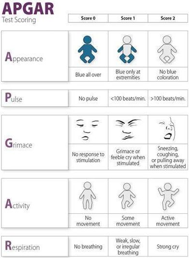
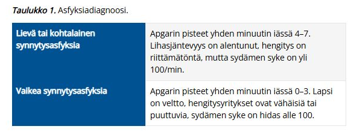
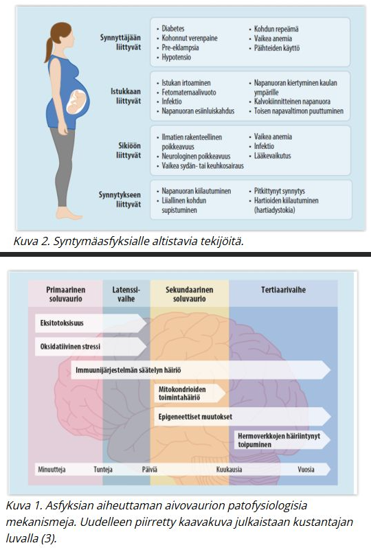
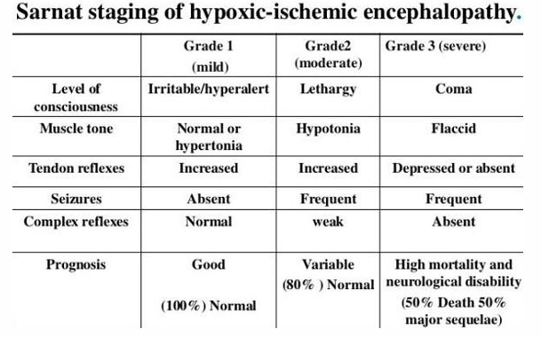
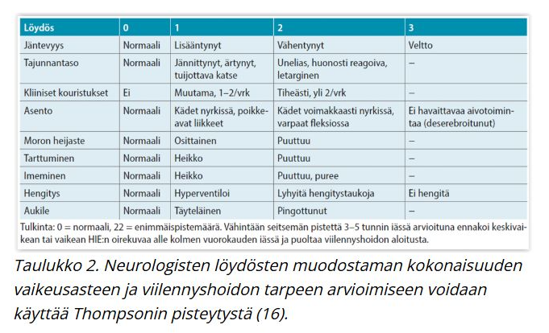
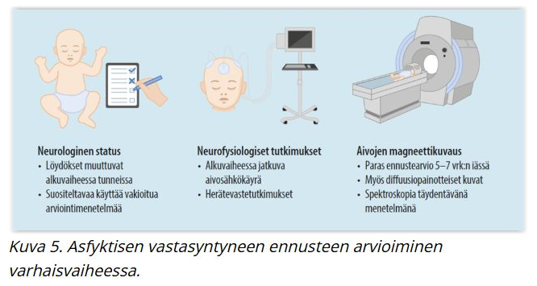

  

#### Bronkioliittia hoidetaan antibiooteilla

  <button class="solution-button"
          data-label="Vastaus"
          data-hide-label="Piilota vastaus">
    Vastaus
  </button>
  

      Väärin

Bronkioliitti (= alle 1-vuotiaan ensimmäinen uloshengitysvaikeus) on pääsääntöisesti virusinfektio, ei tarvita antibioottihoitoa.

---

Bronkioliittiin ei ole parantavaa lääkehoitoa. Tärkeintä on, että riskipotilaat (taulukko alimmassa kuvassa) tunnistetaan ja lähetetään sairaalaseurantaan. 

Bronkioliitin hoidoksi klassisesti suositellaan hapensaannin (lisähappea esimerkiksi suurivirtauksinen nenäkanyylin (optiflow) avulla, jos <92%), nesteytyksen ja ravitsemuksen varmistamista; ns. "minimal handling"-hoitperiaate eli merkittäviä toimenpiteitä pyritään välttämään. Jos limaa erittyy runsaasti, sen imeminen nenänielusta voi helpottaa hengitystä ja syömistä. Mikäli syöminen onnistuu huonosti, annetaan nesteytystä ja ravitsemusta yleensä nenämahaletkulla tai joskus suonensisäisesti. Käypä hoito- tai kansainväliset bronkioliitin hoitosuositukset eivät suosittele beeta2-agonististia, adrenaliinia, systeemistä tai inhaloitua kortikosteroidia, antibioottia tai antiviraalista lääkitystä bronkioliitin hoitoon. 

Lasten astman Käypä hoito -suositus ei kuitenkaan ota kantaa pienen lapsen ensimmäisen rinoviruksen aiheuttaman vinkukohtauksen hoitoon. On kuitenkin esitetty asiantuntijanäkemyksiä hoitolinjoista (esim. [tässä Lääkärilehden artikkelissa](images/RinoRSV.pdf); samat asiat on myös luentodioissa paljon sekavammin). Vaikka kontrolloituja tutkimuksia on vielä vähän, on viitteitä, että niiden akuuttiin hoitoon tulee suhtautua eri tavoin. **Ensimmäinen rinovirusvinkuna vaikuttaa olevan tällä hetkellä tehokkain aikapiste astman sekundaaripreventioon.**

<li>RSV-Bronkioliitti:</li>
  <ul>
    <li>Potilas: Tyypillinen ikä alle 6 kuukautta, osastohoitoa vaativa tauti, runsaasti limaa hengitysteissä, työläs hengitys, ei atooppista ekseemaa, vanhemmilla ei astmaa ja he tupakoivat.</li>
    <li>Hoitolinja: Pidättäydy lääkkeistä. Oireenmukaisena hoitona hapensaannin ja ravitsemuksen turvaaminen. Limaimut vain tarvittaessa.</li>
    <li>Perustelut: Oireiden syynä liman ja solujätteen aiheuttama mekaaninen tukos hengitysteissä, eikä astmariski ole merkittävästi lisääntynyt. Avaavien tai hoitavien lääkkeiden tehosta ei ole näyttöä.</li>
  </ul>
<li>Rinovirusvinkuna:</li>
  <ul>
    <li>Potilas: Tyypillinen ikä yli 12 kuukautta, osastohoitoa vaativa tauti, taustalla pitkittynyt yskä, auskultoiden selkeät ekspiratoriset vinkunat molemman puolin, hengitysapulihakset käytössä, atooppista ihottumaa, toisella vanhemmista on allerginen astma, kotona 2 kissaa. </li>
    <li>Hoitolinja: Kokeillaan avaavaa lääkettä (esim. salbutamoli). Jos hyötyy ja vinkuna toistuu, harkitse kolmen päivän systeemistä kortikosteroidikuuria ja määritä pöly- ja ruokaryhmän allergiatestit.</li>
    <li>Perustelut: Astman kaltainen taudinkuva ja merkittävästi lisääntynyt astmariski. Hieman näyttöä sekä avaavan lääkkeen että kortikosteroidin hyödystä tässä potilasryhmässä.</li>
  </ul>
<li>Käytännön elämässä virusdiagnostiikkaa tehdään suhteellisen harvoin. Siksi voitaisiin puhua RSV-bronkioliitista, kun RSV-virus on osoitettu tai alle 6 kuukauden ikäinen vauva sairastaa tyypillisen taudinkuvan RSV-epidemian aikana. Tällöin keuhkoputkia avaavaa lääkettä (beeta2-agonistia) ei kannata edes kokeilla. **Jos taas ikä on yli 6 kuukautta ja lapsi sairastaa RSV-epidemian ulkopuolella, voitaisiin avaavaa lääkettä kokeilla sitä herkemmin, mitä vaikeampi tauti on, mitä voimakkaammin uloshengitys vinkuu ja mitä enemmän on atopiapiirteitä.** Hoitovasteen, riskitekijöiden ja iän (mielellään yli 12 kk) mukaan voidaan harkita 3 päivän systeemistä kortikosteroidikuuria. </li>

----

  

#### Laryngiitin tyypillinen oire on yöllä alkanut kumea yskä {#Laryngiitti-yska}

  <button class="solution-button"
          data-label="Vastaus"
          data-hide-label="Piilota vastaus">
    Vastaus
  </button>
  

      Oikein

Laryngiitti eli kurkunpäätulehdus on **kurkunpään virusinfektio** (tavallisimmin parainfluenssa, rhino-, respiratory syncytial-, boca- ja epidemian aikana myös influenssavirukset. Muita mahdollisia aiheuttajia ovat metapneumo-, entero- ja adenovirukset), jonka **tavallisimmat oireet ovat kuiva, usein haukkuva (seal-bark) yskä ja hankalammissa tapauksissa sisäänhengityksen stridor (vinkuna).** Oireet johtuvat virusinfektion aiheuttamasta turvotuksesta äänihuulten alaisessa tilassa.

Yskä jatkuu ensioireiden jälkeen yleensä tavallisena yskänä muutamasta päivästä viikkoon. Kurkunpäätulehdusta edeltävät tavallisesti ylähengitysteiden oireet 12–72 tunnin ajan, ja **hengitysvaikeus alkaa usein äkillisesti yöllä.**

---

**Lasten kurkunpäätulehduksen diagnoosi on kliininen. Taudinkuva on yleensä selkeä ja äänekkään sisäänhengityksen taustalla on hyvin harvoin muu syy kuin kurkunpäätulehdus.** Jos taudinkuva on epätyypillinen, oireet ovat vaikeita tai vaste hoitoon on huono, erotusdiagnostiikassa tulee ottaa huomioon kurkunkansitulehdus (epiglottiitti), bakteerin aiheuttama henkitorven tulehdus (trakeiitti), kurkunpään turvotus, nielupaiseet (peritonsillaari- ja retrofaryngeaalinen absessi) ja hengitysteiden vierasesineet.

<li>Tyypillisin ikäryhmä tähän lasten erityispiirteiseen laryngiittiin (pseudokruppiin), jossa ilmenee tämä haukkuva yskä ja stridor on 12-36kk; koluikäisillä ja aikuisillakin siis ilmenee laryngiittiä usein, mutta ei ole yleensä näin vakavaoireinen. Jos kurkunpäätulehdukseen sopivia oireita esiintyy alle puolen vuoden ikäisellä lapsella tai lapsen ensimmäisen virusinfektion yhteydessä, tulee huomioida hengitysteiden rakenteelliset ja toiminnalliset poikkeavuudet. Alle vuoden ikäisillä mahdollisia poikkeavuuksia ovat laryngomalasia, hemangioomat, lymfangioomat, kurkunpään kehityshäiriöt, kuten ahtaumat, kystat, halkiot ja limakalvopurjeet ja juveniili papillomatoosi.</li>

---

Lapsen hengitysvaikeuden tila arvioidaan kliinisesti. Sisäänhengityksen vaikeuden merkkejä ovat yleensä korvin kuullen havaittavan stridorin lisäsi apuhengityslihasten käyttö ja hengitystiheyden nousu. Happeutuminen on tarkastettava pulssioksimetrilla kaikissa tapauksissa, joissa lapsen hengitys on vaikeutunut, ja tarvittaessa (happisaturaatio alle 95 %) on annettava lisähappea.

Päivystyksellisiä laboratoriokokeita tai röntgenkuvia ei komplisoitumattomassa laryngiitissa tarvita.

---

Kurkunpäätulehdus on lieväoireinen 85 %:lla lapsista ja vain 1 %:lla on vaikea kurkunpäätulehdus. **Tavallinen kurkunpäätulehdus, johon ei liity hengitysvaikeutta, paranee itsestään.**  Levossa esiintyvä äänekäs sisäänhengitys tai kurkunpäätulehdukseen liittyvä lieväkin pulssioksimetrilla todettava happeutumishäiriö viittaavat vaikeaan tautiin.  

_Suurin osa lapsista voidaan hoitaa kotona._ **Ensisijainen hoito on oireenmukainen** + äänilepo (jos vanhemmalla lapsella/aikuisella ja pystyy ohjeistamaan). Kuumeisen ylähengitystieinfektion aikana hyvä nestetasapaino sekä tulehduskipulääkkeet helpottavat laryngiittipotilaan vointia. Höyryhengityksen tehosta ei ole näyttöä, mutta jotkut voivat kokea siitä hyötyä.

**Jos lapsella on hengitysvaikeus, se helpottaa useimmiten istuvassa asennossa ja viileä ilma helpottaa kurkunpäätulehduksen oireita.** Huoneilman viilentämisen voi toteuttaa esimerkiksi pitämällä ikkunan auki. Jos hengitysvaikeus ei nopeasti helpotu 15–20 minuutin kuluessa, lapsi tulee viedä päivystykseen.

Laryngiittiin liittyvä **hengitysvaikeus hoidetaan suun kautta annettavalla glukokortikoidilla** (deksametasonin annos on 0.15–0.6 mg/kg suun kautta tai lihakseen (enintään 8 mg); beetametasonia erityislupavalmisteena voi myös käyttää, annos on 0.25–0.4 mg/kg suun kautta (enintään 7 mg). Nesteeseen liuotettava 0.5 mg:n tabletti maistuu paremmalta kuin deksametasoni). Jos hengitysvaikeus jatkuu huolimatta suun kautta annostellusta glukokortikoidista, voidaan tarvittaessa antaa lisälääkkeenä, yleensä sairaalassa, 2 mg inhaloitavaa budesonidia.

**Vaikeassa, äkillisessä tilanteessa voidaan käyttää lisäksi inhaloitavaa raseemista adrenaliinia höyrystävällä inhalaattorilla.** Raseeminen adrenaliini lievittää tehokkaasti laryngiitista johtuvan hengitysvaikeuden oireita, mutta sen vaikutus on lyhyt, vain 1–2 t. Koska hengitysvaikeus palaa yleensä 1–2 t:n kuluessa, raseemista adrenaliinia saaneet potilaat on lähetettävä ensiavun jälkeen herkästi sairaalahoitoon tai heitä on seurattava polikliinisesti riittävän kauan (vähintään 1–2 t). 

**Mikrobilääkkeistä, keuhkoputkia avaavista lääkkeistä, antihistamiineista, yskänlääkkeistä tai höyryhengityksestä ei ole hyötyä lasten kurkunpäätulehduksen hoidossa.**

---

Sairaalaan voidaan lähettää tietyissä tapauksissa ja lapsi voidaan ottaa osastoseurantaan, ja joskus jopa teho-osastolle. Sairaalaan kuuluu lähettää, jos 

<li>yleistila on huonontunut</li>
<li>inspiratorinen stridor jatkuu ensiapulääkityksestä huolimatta</li>
<li>hengitysvaikeus uusiutuu ensiapulääkkeen jälkeisen päivystysseurannan (1–2 t) aikana tai</li>
<li>todetaan pienentynyt happisaturaatio (< 95 %) ensiapulääkkeen jälkeisen päivystysseurannan aikana</li>

  

#### Laryngiitin aiheuttaja on tavallisesti H. influenzae tyyppi b

  <button class="solution-button"
          data-label="Vastaus"
          data-hide-label="Piilota vastaus">
    Vastaus
  </button>
  

      Väärin

Hib on klassisesti epiglottiitin eli kurkunkannen tulehduksen aiheuttaja, mutta rokotusten myötä epiglottiitista on tullut todella harvinainen. 

Laryngiitti eli kurkunpään tulehdus on taas lähes aina viruksen aiheuttama sairaus. Sen tavallisin aiheuttaja on parainfluenssavirus. Muita yleisiä aiheuttajia ovat mm. RSV, adenovirukset, influenssavirukset ja rhinovirukset.

  

#### Avosyntyisen keuhkokuumeen ensisijainen hoito alle kouluikäisellä on doksisykliini {#Doksisykliini-keuhkokuume}

  <button class="solution-button"
          data-label="Vastaus"
          data-hide-label="Piilota vastaus">
    Vastaus
  </button>
  

      Väärin

Keuhkokuumeen antibioottihoidon tulee aina kattaa pneumokokki. **Ensisijainen antibiootti avohoidossa on amoksisilliini** ja sairaalahoitoa vaativalla potilaalla G-penisilliini. Suun kautta annosteltava amoksisilliini (40-45 mg/kg/vrk jaettuna 3 annokseen (maksimiannos 750 mg × 3) 5 vrk:n ajan) on siis ensisijainen valinta aikaisemmin terveiden lasten kotisyntyisessä keuhkokuumeessa, jonka oireet viittaavat bakteeritautiin, kun taudinkuva ei ole vaikea. Hyväkuntoisen lapsen keuhkokuume voidaan hoitaa kotona suun kautta otettavilla antibiooteilla. Lapsi kuuluu sairaalahoitoon, mikäli hän on alle puolen vuoden ikäinen, yleistila on heikentynyt, hengitys on vaikeutunut, tai jos keuhkokuvassa nähdään laajat tulehdusmuutokset tai pleuranestettä.

Hyväkuntoiset penisilliiniallergiset voidaan hoitaa makrolidilla (ensisijaisesti atritromysiini).

**Jos on perusteltu syy epäillä mykoplasmakeuhkokuumetta, hoidetaan keuhkokuume makrolidilla tai doksisykliinillä (vain yli 8-vuotiaille).**

_Oseltamiviiria voidaan käyttää influenssaviruksen aiheuttaman keuhkokuumeen hoitoon (jos influenssa on todettu testaamalla ja oireiden alusta on alle 48 tuntia)._

  

#### Vanhempien tupakointi lisää lapsen riskiä sairastua äkilliseen välikorvatulehdukseen {#Vanhempien-tupakointi-AOM}

  <button class="solution-button"
          data-label="Vastaus"
          data-hide-label="Piilota vastaus">
    Vastaus
  </button>
  

      Oikein

Äkillisten välikorvatulehdusten (AOM) riskitekijöitä nuoren iän ja ylähengitystieinfektion lisäksi ovat mm: 

<li>Vanhempien tupakointi (passiivinen tupakointi) -- ärsyttää nenänielun ja välikorvan limakalvoja aiheuttaen tulehdusta ja turvoitusta -> tukkii korvatorvea, jolloin välikorvan ilmastointi häiriintyy</li>
<li>Päivähoito kodin ulkopuolella / runsaasti sisaruksia</li>
<li>Immuunipuutokset</li>
<li>Rintaruokinnan puuttuminen / lyhyt kesto</li>

  

#### Mikrosytäärisen anemian taustalla voi olla liiallinen maidonjuonti {#Mikrosytaarinen-maito}

  <button class="solution-button"
          data-label="Vastaus"
          data-hide-label="Piilota vastaus">
    Vastaus
  </button>
  

      Oikein

Lehmänmaidossa on erittäin vähän rautaa, sen kalsium estää raudan imeytymistä, ja suuri maidon juonti vie lapsen vatsassa tilaa rautapitoiselta kiinteältä ruoalta sekä voi aiheuttaa tihkuvuotoa -> johtaa raudanpuuteanemiaan. Raudanpuuteanemia on mikrosytääristä. 

  

#### Mikrosytäärisen anemian taustalla voi olla keliakia {#Mikrosytaarinen-keliakia}

  <button class="solution-button"
          data-label="Vastaus"
          data-hide-label="Piilota vastaus">
    Vastaus
  </button>
  

      Oikein

Keliakia aiheuttaa suolistossa imeytymishäiriön ja voi siten johtaa raudanpuutteeseen ja sitä kautta mikrosytääriseen anemiaan (yleisin keliakiassa). Anemia voi myös olla makro- tai normosytäärinen, koska myös B12- ja B9-vitamiinien imeytyminen voi häiriytyä. Sekalainen imeytymishäiriö voi aiheuttaa myös samaan aikaan sekä mikro- että makrosytäärisyyttä -> RDW koholla. 
  

#### Vesirokkorokotus kuuluu yleiseen rokotusohjelmaan

  <button class="solution-button"
          data-label="Vastaus"
          data-hide-label="Piilota vastaus">
    Vastaus
  </button>
  

      Oikein

Kysymyksen tekovuonna ei vielä ollut totta, mutta vesirokkorokote tuli Suomen kansalliseen rokotusohjelmaan syyskuussa 2017. Perusrokotussarjaan kuuluu kaksi annosta, annetaan neuvolassa 1,5-vuotiaille ja 6-vuotiaille (tällöin osana MPRV-yhdistelmärokotetta). Rokote sisältää elävää, heikennettyä varicella-zoster-virusta. 

Suurin osa väestöstä ei ole siis saanut rokotetta, vaan sairastanut taudin lapsuudessa. Korkeintaan 1-3 prosenttia aikuisväestöstä ei ole sairastanut vesirokkoa, joten rokotustarve on hyvin vähäinen. Jos henkilö ei ole sairastanut vesirokkoa tai saanut kahta rokoteannosta (vähintään 3 kuukauden välein), täydennä rokotussuoja. Lähes kaikki 50 vuotta täyttäneet ja sitä vanhemmat ovat sairastaneet vesirokon, eivätkä tarvitse rokotetta. Jos lapsi on sairastanut vesirokon hyvin lievänä alle vuoden ikäisenä, hän saattaa saada vesirokon uudelleen. Siksi myös näille lapsille suositellaan kahta vesirokkorokotusta. Jos vesirokon on sairastanut yli yksivuotiaana lievänä, ei rokotuksia tarvita. Vanhempien antama tieto siitä, onko lapsi sairastanut vesirokon, on yleensä luotettava. Vesirokon sairastaneen rokottamisesta ei ole haittaa, mutta immuunipuutteisen rokottamisesta päättää lääkäri.

Koska kyseessä on elävä rokote, sitä ei tule antaa raskaana oleville eikä henkilöille, joilla on vaikea immunologinen puutostila (esim. solunsalpaajahoito tai vaikea immuunipuutos).

  

#### Rotavirusrokote annetaan peroraalisesti

  <button class="solution-button"
          data-label="Vastaus"
          data-hide-label="Piilota vastaus">
    Vastaus
  </button>
  

      Oikein

Suomen kansallisessa lasten rokotusohjelmassa tällä hetkellä ainoa suuhun annosteltava valmiste (maailmalla ja matkailijoille on käytössä useita muitakin suun kautta otettavia rokotteita, kuten kolera, lavantauti ja kehitysmaissa käytettävä oraalinen poliorokote). 

---

Rotavirusrokote on myös sen suhteen poikkeuksellinen rokote, että sen **antamiselle on asetettu tiukat ikärajat,** ja sitä annetaan ainoastaan varhaisimeväisille. Suomessa käytössä oleva suun kautta annettava rotavirusrokote annetaan neuvolassa 2, 3 ja 5 kuukauden iässä. _Ensimmäinen annos on annettava viimeistään 12 viikon iässä ja kolmas annos tulee antaa ennen kuin lapsi on täyttänyt 32 viikkoa._ Annosten minimivälin tulee olla neljä viikkoa. Perusrokotussarjan jälkeen ei anneta tehosteita. 

Rokotteita ei anneta vanhemmille potilaille, koska heillä rokotteen **riski aiheuttaa harvinaista suolentuppeumaa (invaginaatiota, intussusseptiota) kasvaa.** Rokote siis voi aiheuttaa lymfoidihyperplasiaa suolistossa (Peyerin laikuissa) ja nämä voivat toimia tarttumiskohtina (lead point) suolentuppeumalle. 

Toinen syy miksi rokotteita ei kannata antaa vanhemmille potilaille on se, että vaikea rotavirusripuli ja kuivuminen on todennäköisintä juuri pienillä imeväisillä ja vanhemmilla lapsilla/varsinkin aikuisilla tauti ei ole yleensä yhtä vakava. 

  

#### Kuumekouristuksen taustalla on usein keskushermostoinfektio

  <button class="solution-button"
          data-label="Vastaus"
          data-hide-label="Piilota vastaus">
    Vastaus
  </button>
  

      Väärin

Kuumekouristus itsessään määritellään nimenomaan tilanteeksi, jossa kouristuksen taustalla ei ole keskushermostoinfektiota. 

Kuumeen aikainen kohtaus kuitenkin voi olla bakteerimeningiitin, enkefaliitin tai sepsiksen oire, joten ensimmäistä kertaa kouristanut lapsi on syytä pyytää päivystyksellisesti lääkärin tutkittavaksi, vaikka kohtaus olisi ollut lyhyt ja lapsi olisi siitä toipunut. Poissuljetaan keskushermostoinfektio, tarkistetaan verensokeri, varmistetaan statuksen normaalistuminen. Jos lapsi on muutaman tunnin seurannassa kohtauksen jälkeen hyväkuntoinen eikä lääkärin tutkimuksessa tule esiin mitään poikkeavaa, häntä ei tarvitse lähettää sairaalaseurantaan, ja vanhemmille kerrotaan kuumekouristusten hyvänlaatuisuudesta sekä annetaan tarkat ohjeet lapsen voinnin seurannasta; tarvittaessa bukkaalinen midatsolaami tai diatsepaamirektiolit kotiin (jos pitkittynyt tai lapsi asuu pitkällä ensiapua antavasta yksiköstä).

---

EEG- tai kuvantamistutkimuksia ei normaalisti kehittyneillä ja muuten terveillä yksinkertaisia kuumekouristuksia saavilla lapsilla tarvita jatkotutkimuksina siinäkään tapauksessa, että kuumekouristukset uusiutuvat myöhempien kuumeiden aikana. Em. tutkimukset ovat aiheellisia, jos lapselle tulee myös kuumeettomia kouristuksia

Jatkotutkimuksia ei tarvita, jos 6 kk:n–5 v:n ikäisellä lapsella esiintyy vain kuumeen aikana yksinkertaisia tajuttomuus-kouristuskohtauksia, joista lapsi toipuu normaalisti. Välttämättä nämä eivät ole tarpeen myöskään 6(–7) v:n ikäisellä yksinkertaisen kuumekouristuksen saaneella etenkään, jos lapsella on ollut taipumus toistuviin yksinkertaisiin kuumekouristuksiin pienempänäkin.

  

#### Petekia häviää läpinäkyvällä lasilla painettaessa {#Petekia-haviaa}

  <button class="solution-button"
          data-label="Vastaus"
          data-hide-label="Piilota vastaus">
    Vastaus
  </button>
  

      Väärin

Petekia eli 1-2mm läpimittainen pinnallinen hematooma ei kalpene, kun sitä painetaan läpinäkyvällä lasilla. Veri on vuotanut verisuonen ulkopuolelle ihosolukon väliin. Koska veri ei ole verisuonen sisällä, paine ei pysty siirtämään sitä pois. Läpinäkyvällä lasilla painettaessa punainen täppä näkyy edelleen kirkkaana. 

Vrt. esim. urtikaria tai eryteema, jossa punoitus johtuu pienten verisuonten laajenemisesta ja lisääntyneestä verenvirtauksesta. Kun kohtaa painetaan lasilla, veri puristuu väliaikaisesti pois verisuonesta ja punoitus häviää/vaalenee. 

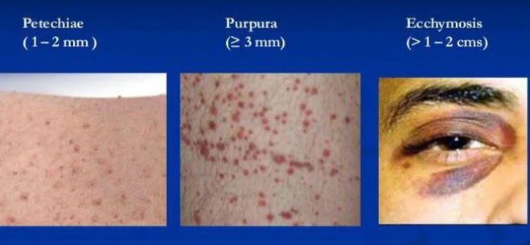
  

#### Lapsella voi esiintyä solisluunmurtuma synnytystraumana {#Solisluumurtuma-synnytystraumana}

  <button class="solution-button"
          data-label="Vastaus"
          data-hide-label="Piilota vastaus">
    Vastaus
  </button>
  

      Oikein

Solisluunmurtuma on ylivoimaisesti tavallisin synnytystrauma vastasyntyneellä. Murtuma syntyy yleensä synnytyksen loppuvaiheessa, jos hartioiden ulostulo on vaikeaa (ns. hartiadystokia). 

Oireena voi olla affisioidun yläraajan heikko liikuttaminen ja tunnustellessa voi tuntua pykälä tai krepitaatio. Paranee yleensä noepasti ja täydellisesti ilman kipsausta tai leikkausta. Hoitona on varovainen käsittely ja tarvittaessa kivunlievitys. 
  

#### Lapsen diabetesepäily (tyyppi 1:n diabetes) on aina päivystysasia {#T1DM-paiv}

  <button class="solution-button"
          data-label="Vastaus"
          data-hide-label="Piilota vastaus">
    Vastaus
  </button>
  

      Oikein

Ketoasidoosin kehittymisen aikataulua ei voi ennustaa -> ei ole turvallista odotteluaikaa -> lapsen diabetesepäily aina päivystykseen

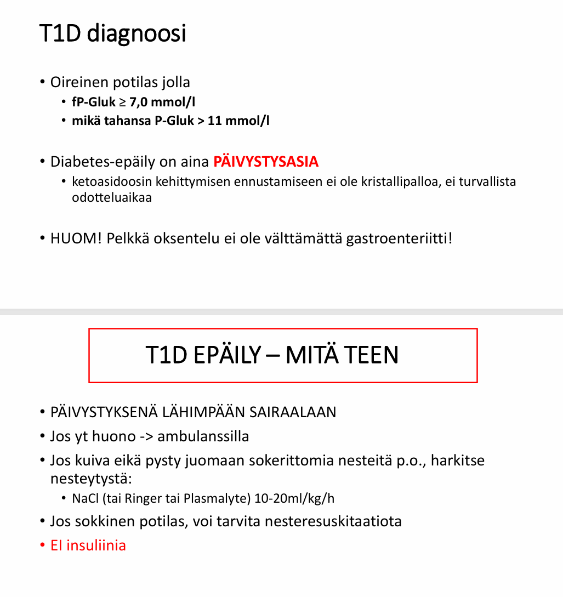
  

#### Tyypillinen kasvukäyrälöydös hypertyreoosissa on suhteellisen painon lisäys ja suhteellisen pituuden vähenemä {#Hypotyreoosi-kasvukayra}

  <button class="solution-button"
          data-label="Vastaus"
          data-hide-label="Piilota vastaus">
    Vastaus
  </button>
  

      Väärin

Näin olisi hypotyreoosissa. Hypertyreoosissa taas päinvastoin: suhteellisen painon alenema ja suhteellisen pituuden kiihtyminen

Tällainen ristioire, jossa paino ja pituus menevät eri suuntiin on aina hälyttävä. 

  

#### Asetyylisalisyylihappoa voidaan käyttää lapsen kuumeen ja kivun hoidossa {#ASA-lapsella}

  <button class="solution-button"
          data-label="Vastaus"
          data-hide-label="Piilota vastaus">
    Vastaus
  </button>
  

      Väärin

Asetyylisalisyylihappoa (ASA) vältetään lapsen kivun/kuumeen hoidossa **Reyen oireyhtymän** riskin takia. Reyen oireyhtymä tarkoittaa virusinfektiota sairastavalla/juuri sairastaneella lapsella ilmentyvää akuuttia maksan vajaatoimintaa ja enkefalopatiaa; ilmentymisellä todettu olevan erityisesti yhteys aspiriinin annosteluun virusinfektion aikana

Aspiriinin metaboliitit voivat inhiboida mitokondrioiden entsyymejä ja vähentää beetaoksidaatiota -> rasvahappojen kertyminen (mikrovesikulaarinen rasvainen muutos) ja tulehdus maksassa. 

**ASA:a käytetään matalalla annoksella kuumeisella lapsella pääasiassa ainoastaan Kawasakin taudissa (vaskuliitti), jossa tromboosinehkäisy on tärkeää.**

  

#### Runsasta pulauttelua voidaan hillitä maidonsakeuttajalla {#Maidonsakeuttajat}

  <button class="solution-button"
          data-label="Vastaus"
          data-hide-label="Piilota vastaus">
    Vastaus
  </button>
  

      Oikein

Imeväisikäisten ja pienten lasten pulauttelua voidaan usein vähentää maidon sakeuttamisella. Voidaan käyttää esimerkiksi johanneksenleipäpuun uutetta (esim. Nutrilon Nutriton). Sakeutettu maito on rakenteeltaan paksumpaa ja raskaampaa. Tämä tekee sen fyysisestä nousemisesta mahalaukusta takaisin ruokatorveen merkittävästi vaikeampaa.

  

#### Pahanlaatuinen imusolmuke on tyypillisesti punoittava, liikkuva ja aristava

  <button class="solution-button"
          data-label="Vastaus"
          data-hide-label="Piilota vastaus">
    Vastaus
  </button>
  

      Väärin

Pahanlaatuinen imusolmuke on yleensä kivuton, kova, kiinteästi alustaansa kiinnittynyt eikä se yleensä punoita. 

Punoitus, liikkuvuus ja aristus viittaa enemmänkin hyvänlaatuiseen, tulehdukselliseen lymfadenopatiaan (lymfadeniittiin).
  

#### Herpes simplex -viruksen aiheuttamaan suutulehdukseen liittyy yleensä rakkuloita myös käsissä ja jaloissa {#HSV-suutulehdus}

  <button class="solution-button"
          data-label="Vastaus"
          data-hide-label="Piilota vastaus">
    Vastaus
  </button>
  

      Väärin

Tämä viittaa enemmänkin enteroviruksen aiheuttamaan rokkoon (Hand, foot and mouth disease). 

HSV:n aiheuttama suutulehdus taas ilmenee pääasiassa ainoastaan suussa ja huulilla. 

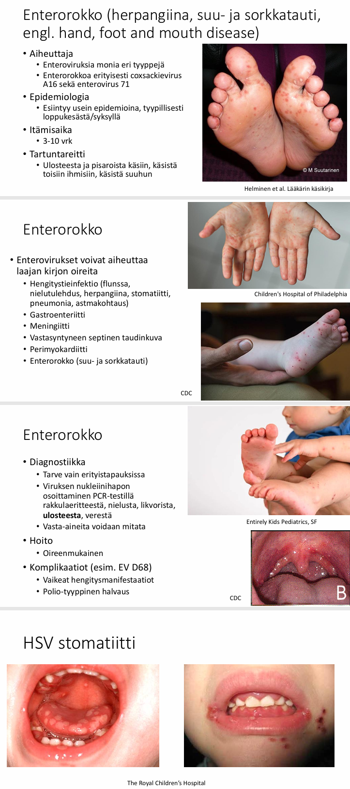
  

#### 3 kk:n iässä lapsi normaalisti kohottaa päätä ja vartaloa suoristetuin käsivarsin {#Lapsi-kohottaa-paataan-ja-vartaloaan-suoristetuin-kasivarsin-3kk}

Tämä on enemmänkin lastenneurologinen kysymys ja tätä seuraavat kysymykset ovatkin neurologisia, kirurgisia tai psykiatrisia; aikaisemmin aihealueet olivat tällä tavalla yhdessä supussa välitentissä.

  <button class="solution-button"
          data-label="Vastaus"
          data-hide-label="Piilota vastaus">
    Vastaus
  </button>
  

      Väärin

N. 2kk ikäisen tulisi jo kohottaa päätään, mutta vasta 6kk ikäisen odotetaan pystyvän kohottamaan vartaloaan suoristetuin käsivarsin. 4kk ikäinen kohottaa päätä ja vartaloa kyynärnojassa. 

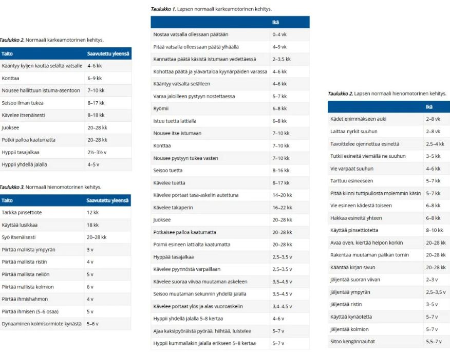
  

#### Babinskin reaktion häviäminen on edellytys pystyasennon hallinnalle {#Babinskin-haviaminen}

  <button class="solution-button"
          data-label="Vastaus"
          data-hide-label="Piilota vastaus">
    Vastaus
  </button>
  

      Oikein

Babinski (isovarpaan ojentuminen ylöspäin jalkapohjan ulkosyrjää raaputtaessa) häviää kun tasapainoreaktiot jalkaterässä kehittyvät. Sen häviäminen on tärkeä edellytys pystyasennon hallinnalle; ei absoluuttinen edellytys, mutta sen häviäminen mahdollistaa kävelyn oppimista tehokkaasti. Babinski voi kuitenkin säilyä positiivisena jopa 24kk asti. 

  

#### Kasvukivut tuntuvat tavallisesti polvitaipeissa ja pohkeissa

  <button class="solution-button"
          data-label="Vastaus"
          data-hide-label="Piilota vastaus">
    Vastaus
  </button>
  

      Oikein

Kasvukivut voidaan tunnistaa esitietojen ja kliinisen kuvan perusteella. Esiintyvyys on suurin 3–8 v:n iässä. Muuta kipujen syytä on epäiltävä, jos lapsi on alle 3-vuotias, kipu on jatkuvasti vain yhdessä raajassa tai jos kipuihin liittyy ontumista tai objektiivisia löydöksiä. 

**Sääret, pohkeet ja polvitaipeet ovat tavallisimmat sijaintipaikat.** Kipu on useimmiten symmetrinen: se tuntuu molemmissa alaraajoissa tai vaihtaa puolta. **Vaivaa iltaisin nukkumaanmenoaikana,** myös öisin, mutta ei yleensä aamuisin (vrt. aamujäykkyys niveltulehduksissa). Tuntuu levossa, ei rasituksen aikana. Kestää 0.5–5 tuntia.

Kipuja voi esiintyä lyhytkestoisesti esim. muutamien kuukausien ajan, mutta ne saattavat kestää voimakkuudeltaan vaihdellen myös useita vuosia. Alaraajojen iänmukaiset muotovariaatiot eivät liity kasvukipujen esiintymiseen.

Kasvukipujen yhteydessä kliininen status on täysin normaali.

Epätyypillistä kasvukivuille on: ontuminen tai leikkien/liikuntaharrastusten keskeytyminen kivun takia, muut oireet (esim. yleiskunnon heikkous), jatkuvasti toispuolinen kipu tai särky tai oireilu muulloinkin kuin illalla tai yöaikaan.

---

Jos taudinkuva on vähänkään epätyypillinen, esim. kipu vain toisessa raajassa, yläraajojen kipu, aamujäykkyys, nivelturvotus tai systeemioireet (kuume, painonlasku, väsymys), tutkitaan ainakin TVK (leukemian poissulku), CRP ja lasko (niveltulehduksen epäily). Kuvantaminen (rtg tai kaikututkimus) on aiheellista, jos kipu lokalisoituu yhteen paikkaan tai todetaan jokin objektiivinen paikallislöydös.

---

Hoidoksi yleensä riittää tilanteen selittäminen sekä itsehoito hieronnalla, venyttelyllä, lämpimällä yms. Parasetamolia (15 mg/kg kerta-annos) voidaan käyttää tilapäisesti. 

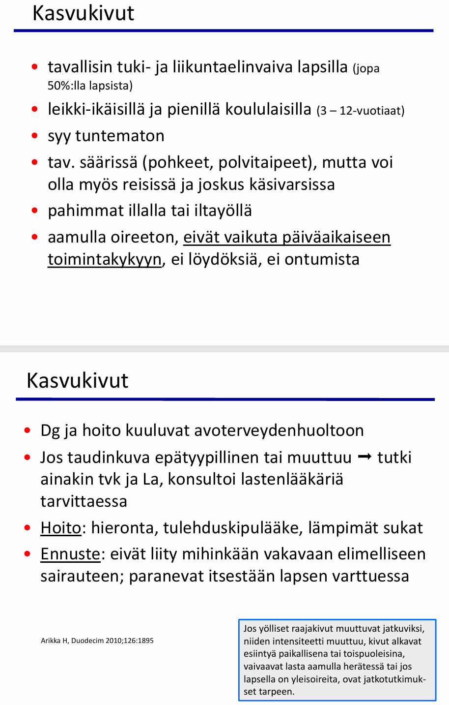
  

#### Jos skoliometrin lukema on alle 6 astetta, riittää kliininen seuranta eikä rtg-kuvaa tarvita {#Skoliometri-alle-6}

  <button class="solution-button"
          data-label="Vastaus"
          data-hide-label="Piilota vastaus">
    Vastaus
  </button>
  

      Oikein

Skolioosin tutkimisessa status on tärkein tutkimus PTH:ssa. Statuksessa aloitetaan vartalon symmetrian arvioimisella. Lisäksi on tärkeää mitata etutaivutuksessa (Adamsin testi) selkään piirtyvän kylkikohouman määrä asteina - tässä käytetään skoliometria. Aseta se tasaisesti selän poikki, kohtisuoraan selkärankaan nähden ja keskitettynä okahaarakkeiden päälle. Siirrä sitä hitaasti yläselästä alaselkään ja pysähdy jokaisen alueen kohdalla. Kirjaa suurin lukema ja sen sijainti. Merkintä ”8°, oikea rintaranka” on puolen vuoden kuluttua paljon hyödyllisempi kuin pelkkä ”8°”. Alaraajojen pituusero määritetään tarvittaessa lyhyemmän raajan alle asetettujen korotuspalojen avulla. **Poikkeava löydös skoliometrillä on >6º -> lähete erikoissairaanhoitoon lastenkirurgian poliklinikalle.** Muuten voidaan jatkaa seurannalla.

Jos skoliometrilukema on 7° tai enemmän, on perusteltua ottaa **skolioosiröntgenkuva seisten taka-etusuunnassa; sivukuvaa ei yleensä tarvita.** _Kuvaus voidaan periaatteessa tehdä perusterveydenhuollon lähetteellä, kannattaa tutustua oman alueen sopimuksiin porrastuksesta._ Kuvasta tarkistetaan Cobbin kulma (käyrän eniten kallellaan olevien äärinikamien päätelevyjen suuntaisiin viivoihin piirretään kohtisuorat, joiden leikkauskulma on haettu tulos) jonka ollessa >10 astetta on skolioosi diagnosoitu. Sen perusteella myös voidaan päätellä hoitolinjaa.  Lieväkin kivulias skolioosi tulee tutkia natiiviröntgenkuvien lisäksi myös magneettikuvauksella. Magneettikuvaus tehdään myös ennen leikkaushoitoa tai jos taudinkuva on poikkeava. Natiivirtg:n suhteen otetaan myös taivutuskuvia ennen leikkaushoitoa. 

**Skolioosin hoitovaihtoehtoja ovat seuranta, korsettihoito tai leikkaushoito.** Hoidon valinta riippuu käyrän suuruudesta, etenemisestä, sijainnista ja potilaan luustoiästä. Selän pituuskasvu on virheasennon etenemisen kannalta keskeisin ennusteellinen tekijä, ja siksi kasvuvaiheen arviointi on tärkeää virheasentopotilasta arvioitaessa. Tytöillä kuukautisten (menarche) alkaminen lopettaa nopeimman pituuskasvun ja on siksi erinomainen ennustetekijä selän pituuskasvun loppumiselle. Käden röntgenkuva soveltuu erinomaisesti kasvuvaiheen arviointiin. Lantion takasiiven kasvurustojen (Risserin apofyysit) ja selkänikaman rengasrustojen sulkeutumisen jälkeen kasvu on päättynyt, eikä skolioosin pahenemista enää tapahdu suuriasteisimpia muutoksia lukuun ottamatta.

<li><25 astetta -> seuranta</li>
<li>25-40 astetta kasvavalla lapsella -> korsetti; korsetti ei oikaise rankaa, mutta tavoitteena on ehkäistä muutoksen pahenemista</li>
<li>45 astetta (aikuisella >50) -> leikkaus; indikaatiorajan asettelu perustuu siihen, että yli 40 asteen skolioosi pyrkii edelleen kasvun päätyttyä hitaasti etenemään ja yli 60 asteen rintarangan skolioosiin liittyy merkittävä keuhkotilavuuden alenema. Hoitamattomaan yli 70 asteen skolioosiin liittyy merkittävästi kohonnut kuolleisuus. Leikkauksena posteriorinen luudutus tai torakoskooppinen Tethering-leikkaus</li>
<li>Voimistelu, fysioterapia ja manipulaatiohoidot ovat tehottomia</li>

  

#### Osgood-Schlatterin taudilla tarkoitetaan reisiluun avaskulaarista nekroosia 

  <button class="solution-button"
          data-label="Vastaus"
          data-hide-label="Piilota vastaus">
    Vastaus
  </button>
  

      Väärin

Reisiluun avaskulaarinen nekroosi viittaa Perthesin tautiin. Taudinkuva muistuttaa lonkan ohimenevää synoviittia, mutta oireilu alkaa hitaammin ja kestää pitkään. Oireena on ajoittaista tai rasituksessa tuntuvaa lonkkakipua, johon lepo auttaa. Kipu voi tuntua nivusen, reiden tai polven alueella. Tautia esiintyy 5-12-vuotiailla ja pojilla jopa viisi kertaa enemmän kuin tytöillä. Trendelenburgin testi on positiivinen ja lonkka voi olla sisärotaatiossa. Röntgentutkimus varmistaa diagnoosin. Tauti paranee ajan kanssa itsestään. Perthesin taudin hoito kuuluu erikoissairaahoitoon. Lähete tehdään kiireellisenä (ei päivystyksellisenä).

---

Osgood–Schlatterin tauti on yleinen polvivaivan aiheuttaja aktiivisesti urheilevilla nuorilla useimmiten kasvupyrähdyksen aikaan. **Patellajänteen ja sen kiinnitysalueen rusto tulehtuu liian voimakkaan vetorasituksen (traktioapofysiitti) takia tyypillisesti 12–15-vuotiaalla urheilijalla, jonka lajiin kuluu paljon hyppyjä** (kori-, lento- ja jalkapallo tai juoksu). Tytöillä Osgood–Schlatterin tauti on harvinaisempi, ja oireet alkavat aikaisemmin (8–12 vuoden iässä).

**Kipu paikantuu sääriluun kyhmyn (tuberositas tibiae) seutuun. Tuberositas tibiaen kohdalla todetaan usein selvä kyhmy.** Akuutissa vaiheessa kyhmyä särkee, ja se on selvästi aristava. Akuutin tilanteen rauhoituttua särky ja painoarkuus häviävät, mutta lievää kipua esiintyy usein edelleen rasituksen jälkeen. 

---

Kuvantamistutkimuksia ei tarvita, mikäli tila on molemminpuolinen. Toispuoleisissa tapauksissa on hyvä poissulkea muu patologia (kasvain, infektio) AP- ja sivuröntgenkuvin.

---

Hoidossa tärkeintä on perheelle annettava informaatio. _Liikuntarajoitukset jätetään potilaan ja vanhempien päätettäviksi._ Oireiden voimakkuus vaihtelee niin paljon, että tarkkoja ajallisia ohjeita esim. urheilutauon kestosta yksittäisen potilaan kohdalla ei voida antaa. 

<li>Hoitona riittää kipua provosoivien harjoitteiden eli useimmiten juoksemisen ja hyppimisen välttäminen (esim. pari viikkoa) ja tarvittaessa korvaaminen esimerkiksi uinnilla tai pyöräilyllä. Keskeistä on, että vain kipua aiheuttava liikuntaa tauotetaan. Tauko on tarpeen aina, jos oireet palaavat. Fysioterapian tehosta ei ole selvää näyttöä, mutta fysioterapeutti voi ohjata alaraajan lihashallintaa parantavia lihasharjoitteita.</li>
<li>**Akuutissa vaiheessa oireita voidaan lievittää tulehduskipulääkityksellä ja kylmällä,** ja pahimmassa tapauksessa polven voi immobilisoida esimerkiksi ortoosilla pariksi viikoksi.</li>
<li>Leikkaushoitoa voidaan harkita niissä harvoissa tapauksissa, joissa todetaan irrallinen kipeä luufragmentti patellajänteen alla kasvun päätyttyä. Kasvuiässä vaivaa ei hoideta kirurgisesti.</li>

---

Osgood–Schlatterin taudin oireet kestävät muutamasta kuukaudesta pariin vuoteen ja häviävät valtaosalla potilaista viimeistään kasvun päättyessä. Kyhmy jää, ja yli puolet potilaista kokee polvilla seisomisen pysyvästi kipeäksi. Komplikaatiot (apofyysin ennenaikainen luutuminen, akuutti murtuma) ovat hyvin harvinaisia.

  

#### Äkillisesti kipeytynyt kivespussi vaatii kiireellisen selvittelyn {#Kiveskipu-vaatii}

  <button class="solution-button"
          data-label="Vastaus"
          data-hide-label="Piilota vastaus">
    Vastaus
  </button>
  

      Oikein

Akuutin kiveskivun aiheuttajia ovat _kiveksen kiertymä, kiveslisäkkeen kiertymä, (kureutunut nivustyrä), trauma ja lisäkiveksen tulehdus._ **Yleisimmät kaksi näistä ovat kiveslisäkkeen kiertymä ja lisäkiveksen tulehdus, mutta kiveksen kiertymä on aina syytä pystyä poissulkemaan.** Kiveskipua voi myös aiheuttaa mm. orkiitti (harvinainen nykyään), varikoseele tai idiopaattinen skrotumin ödeema, mutta nämä harvoin ovat samalla tavalla akuutteja. 

Syyltään epäselväksi jäänyt akuutti kivespussin kipu on kiireellisen leikkausarvion aihe -- pääasiassa juuri kiveskiertymän takia, koska se voi johtaa kiveksen nekroosiin. **Kasvuikäisen äkillisen kiveskivun syy on kiertymä, kunnes toisin on osoitettu.**

  

#### Napatyrä leikataan, jos se vielä 6 kk:n iässä on jäljellä {#Napatyra-leikataan-jos}

  <button class="solution-button"
          data-label="Vastaus"
          data-hide-label="Piilota vastaus">
    Vastaus
  </button>
  

      Väärin

Napatyrät (hernia umbilicalis) johtuvat suolen sisällön työntymisestä naparenkaan (anulus umbilicalis) läpi. Vastasyntyneellä on valkeassa jännesaumassa (linea alba) napanuoran mentävä reikä, jota ympäröi naparengas (annulus umbilicalis). Syntymän jälkeen napatyrä on melko yleinen, mutta ensimmäisten elinvuosien aikana reikä yleensä pienenee ja tyrä häviää itsestään. 

Napatyrä on sormenpäällä tunnettavissa oleva aukko navan kohdalla. **Napatyrä aiheuttaa erittäin harvoin oireita, vaikka saattaa lapsen itkiessä olla kookaskin (perussääntö on, että tyrä pullistuu koska lapsi huutaa, ei päinvastoin)**. Jos napatyrästä on oikeasti vaivoja tai tyräportti on suuri, voidaan leikkaus tehdä normaalia aiemmin.

<li>Pienet napatyrät paranevat itsestään, ja jos tyräportin läpimitta on alle 1,5 cm, yli 90 % tyristä paranee. </li>
<li>**Napatyrän kuroutumisen ollessa harvinaista seuranta viiteen ikävuoteen asti on perusteltua. Tyrä leikataan ennen kouluikää, jos se on vielä jäljellä.**</li>

  

#### Testis saltans vaatii seurantaa neuvolassa

  <button class="solution-button"
          data-label="Vastaus"
          data-hide-label="Piilota vastaus">
    Vastaus
  </button>
  

      Oikein

Jos normaalikokoinen kives on vedettävissä kivespussin pohjalle ja se siellä pysyy ainakin hetken kiveksestä irti päästettäessä, niin kyseessä on todennäköisesti testis saltans eli hyppivä kives. Se johtuu ylivilkkaasta cremasterrefleksistä, joka on voimakkaimmillaan 1-9-vuotiailla. 

**Kyseessä on fysiologinen ilmiö, joka ei vaadi erikoissairaanhoidon seurantaa vaan normaali neuvolan ja koululääkärin seuranta riittää** (valvotaan, että pysyy fysiologisena eikä kehity sekundaarista piilokivestä esim. siemennuoran jäädessä jälkeen pituuskasvusta). Kives vetäytyy helposti cremaster-lihaksen refleksin takia esimerkiksi kylmän, kivun tai jännityksen takia. Kivespussit ovat normaalisti kehittyneet ja symmetriset. Jos taas kives on pienentynyt, ei yllä täysin kivespussiin asti tai kivespussi on alikehittynyt, niin saattaa olla, että kyseessä ei ole pelkästään hyppivä kives enää kyseessä.

  

#### Vanhemman depressio on lapsen/nuoren depression riskitekijä {#Vanhemman-depressio}

  <button class="solution-button"
          data-label="Vastaus"
          data-hide-label="Piilota vastaus">
    Vastaus
  </button>
  

      Oikein

Perinnöllisyydellä on merkittävä rooli mielialahäiriöiden alttiudessa. Perimän lisäksi vanhemman depressio myös vaikuttaa vuorovaikutukseen lapsen kanssa sekä voi heikentää perheen sosioekonomista tilannetta -> altistaa masennukselle. 
  

