# Lastenkirurgia

## 2025 

Ei tarkkoja tehtävänantoja pääosassa listattuja asioita wikissä, joten käsitellään ne ns. "Selitä lyhyesti"-tyyppisinä kysymyksinä, joita on ollut ainakin aikaisempina vuosina wikin mukaan. 

### Selitä lyhyesti: asentoplagiokefalia {#Asentoplagiokefalia-selita}

  <button class="solution-button"
          data-label="Vastaus"
          data-hide-label="Piilota vastaus">
    Vastaus
  </button>
  

      
Yleisin vauvan kallon poikkeava muoto on **takaraivon tois- tai molemminpuolinen litteys** (posteriorinen plagiokefalia ilman synostoosia; asentoplagiokefalia). Suurin osa lasten takaraivon vinoudesta on ulkoisen voiman aiheuttamaa deformaatiotyyppiä, johon ei liity synostoosia. 

**Tämän on arveltu johtuvan syntymän jälkeisestä muotoutumisesta, lähinnä yksipuolisesta nukuttamisasennosta.** On kuitenkin mahdollista, että suurella osalla näistä lapsista takaraivon litteys on kehittynyt jo kohdussa. Pään muovautuminen synnytyskanavassa voi väliaikaisesti peittää jo olemassa olevan vinouden, mutta se tulee uudelleen esiin muutaman viikon kuluttua synnytyksestä.

Jos on toispuoleista plagiokefaliaa, niin päältäpäin kalloa tarkasteltaessa todetaan rakenteiden kiertyneen samaan suuntaan; kallo on vinoneliön mallinen. Litteän puolen korva ja joskus otsa ovat edempänä kuin vastakkaisella puolella. Näillä potilaille saattaa esiintyä samanaikaista kireyttä päännyökkääjälihaksessa (torticollis), ja siksi varhaisvaiheen fysioterapia saattaa olla perusteltua. 

---

_Ilmaantuvuus on kasvanut huomattavasti vuoden 1992 jälkeen, jolloin maailmalla levisi suositus lasten makuuttamisesta selkäasennossa kätkytkuoleman ehkäisemiseksi._ Muutos on hyvin yleinen: litteyttä tai vinoutta on raportoitu esiintyvän jopa 25–48 %:lla pikkulapsista. Saman raportin mukaan kallon litteyttä oli todettavissa teini-ikäisistä enää vain 2 %:lla. Useimmiten kallon muodon korjaantuminen itsestään alkaa jo ennen kuuden kuukauden ikää ja jatkuu sen jälkeen ainakin kolmen vuoden ikään saakka, mahdollisesti pitempäänkin. Korjautuminen johtuu aivojen nopeasta kasvuvauhdista ja lapsen kääntymisestä itsestään vatsa-asentoon.

---

Lapsia, joiden takaraivon vinouden katsotaan johtuneen ulkoisen voiman aiheuttamasta muovautumisesta, jäädään alkuvaiheessa seuraamaan. **Hoitona pääasiassa lapsen kannustaminen pään kääntämiseen toiselle puolelle (ei tietystikään luonnollisesti tätä halua tehdä, koska litteällä puolella on helpompi maata); siis lähestytään lasta aina toiselta puolelta, laitetaan lelut sängyn toiselle puolelle yms.**

Muotoa korjaava kypärähoito on suosittua Yhdysvalloissa ja joissakin Euroopan maissa, mutta Pohjoismaissa sitä käytetään harvoin. Yli 90 %:lla lapsista kallon muoto pääosin korjautuu itsestään 2−3 vuoden ikään mennessä. 

Noin yhdellä kymmenestä lapsesta posteriorinen plagiokefalia ei kuitenkaan korjaannu seurannassa, ja osalla vinous saattaa jopa lisääntyä. Nämä lapset on syytä lähettää jatkotutkimuksiin, ja heille 3D-TT saattaa olla aiheellinen. Radiologiset löydökset voivat olla huomattavia ja leikkaushoito tarpeen, vaikka kraniosynostoosia ei olisikaan 

Kirurginen hoito voi olla vaihtoehto myös lapsille, joilla litteyden lisäksi esiintyy neurologisia oireita tai kehitysviivettä. Tätä voidaankin pitää perusteena lapsen lähettämiselle asiaan perehtyneeseen yksikköön. Vaikka kallon painumalla ja neurologisella oireistolla ei olisikaan yhteyttä, on asia syytä selvittää. Takaraivon vinous terveellä lapsella ei sellaisenaan ole lähettämisen syy. Lasta on kuitenkin syytä seurata 4 kuukauden välein noin vuoden ikään saakka sen selvittämiseksi, onko kallon pyöristymistä tapahtumassa vai ei.

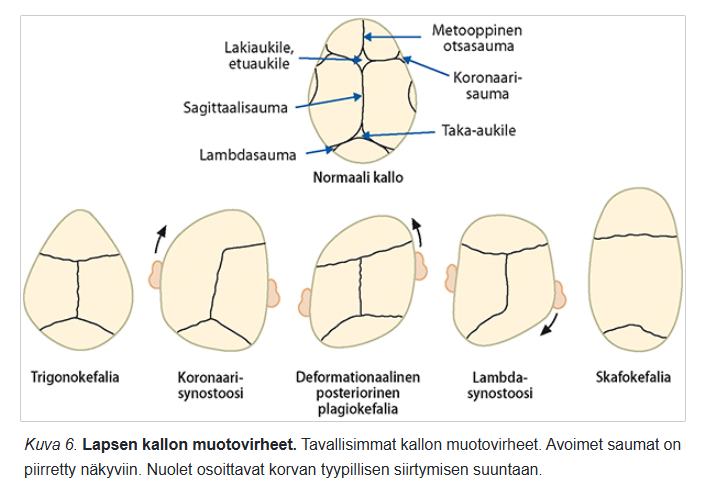
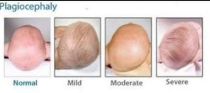
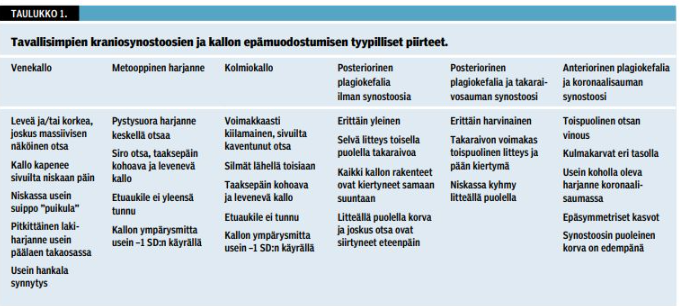

  

### Selitä lyhyesti: Labiasynekia {#Labiasynekia-selita}

  <button class="solution-button"
          data-label="Vastaus"
          data-hide-label="Piilota vastaus">
    Vastaus
  </button>
  

      
Labiasynekia on **kalvomainen kiinnike pienten häpyhuulten välissä,** joka ilmenee yleensä sattumalöydöksenä neuvolatarkastuksessa tai vaipanvaihdossa. Tunnetaan myös nimellä häpyhuulikiinnike tai labiaaliadheesio.

---

Fysiologinen ilmiö prepubertaalisilla; **vaaraton tila,** jossa pienten häpyhuulten sisäreunat ovat liimautuneet tai kasvaneet yhteen. 

Ei vaadi hoitoa tai seurantaa. Hoituu itsestään viimeistään hormonitoiminnan aktivoituessa. Ei yleensä kannata aukaista ”väkisin”. 

---

Jos kiinnike on erittäin tiukka tai peittää lähes koko emättimen ja virtsaputken suun, oireina voi esiintyä virtsaamisongelmia, mutta tämä on todella harvinaista. Rakon tyhjeneminen syytä varmistaa ultraäänellä, jos epäilyä virtsaamisvaikeudesta. Voi joskus häiritä katetrointia (esim. leikkauksissa); jolloin voidaan sormella vetäen avata kiinnikettäsen verran että katetri saadaan laittetua paikalle. Jos kiinnike haittaa virtsaamista tai aiheuttaa tulehduksia, voi määrätä estrogeenivoidetta tai kortisonivoidetta. Voidetta levitetään kuuriluontoisesti suoraan kiinnityslinjaan, mikä pehmentää ihoa ja auttaa sitä avautumaan. 

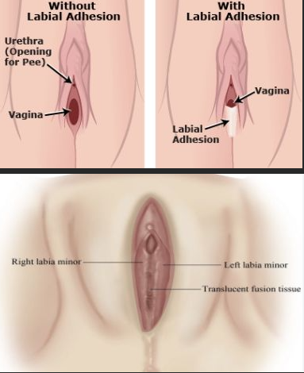
  

### Selitä lyhyesti: Monteggian murtumaluksaatio {#Monteggia-selita}

  <button class="solution-button"
          data-label="Vastaus"
          data-hide-label="Piilota vastaus">
    Vastaus
  </button>
  

      
Monteggian murtuma tarkoittaa **kyynärluun yläosan (proksimaalisen 1/3) murtumaa, johon liittyy proksimaalisen radioulnaarisen nivelen (PRUJ) luksaatio.** Voi syntyä pienienergiaisenkin vamman seurauksena. 

---

Lapsilla suhteellisesti yleisempi kuin aikuisilla; käsittävät kuitenkin alle 1 % lasten kyynärvarren murtumista

---

Vamma jää huomaamatta jopa noin neljänneksessä tapauksista ja voi johtaa hoitamattomana pitkäkestoisiin ongelmiin. Jälkikäteen asiaa arvioitaessa voi olla vaikeaa erottaa synnynnäistä värttinäluun pään luksaatiota Monteggian murtuman jälkitilasta. Vammaa tule epäillä herkästi kaikissa kyynärvarren vammoissa ja ottaa tarvittaessa erillinen kyynärniveleen kohdistettu röntgenkuva (laadukkaat etu- ja sivusuunnan kuvat tärkeät).

---

Hoidossa on olennaista korjata kyynärluun deformiteetti, jolloin värttinäluu yleensä reponoituu. Tämä onnistuu tuoreissa vammoissa useimmiten sulkeisesti (+kulmakipsi stabiloinniksi). Instabiili kyynärluunmurtuma (eli yleensä) kannattaa ydinnaulata antegradisesti kyynärlisäkkeen kärjestä/ylemmästä metafyysistä joko taipuisalla naulalla tai K-piikillä. Kyynärluun murtuman asennon korjaus tehdään tarvittaessa avoimesti, joko K-piikeillä tai yli 10-vuotiailla lapsilla levyllä. Radiohumeraalinivel reponoidaan avoimesti, jos värttinäluun pää ei reponoidu vaikka kyynärluun asento on korjattu.

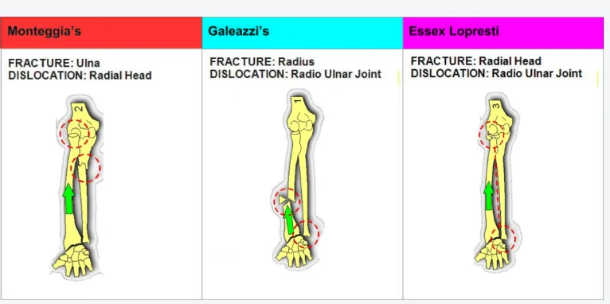
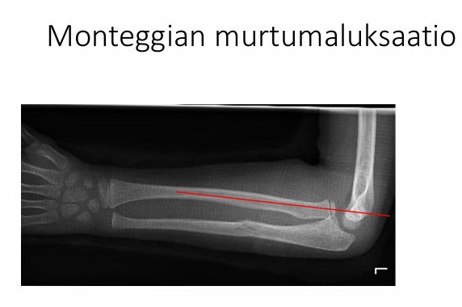
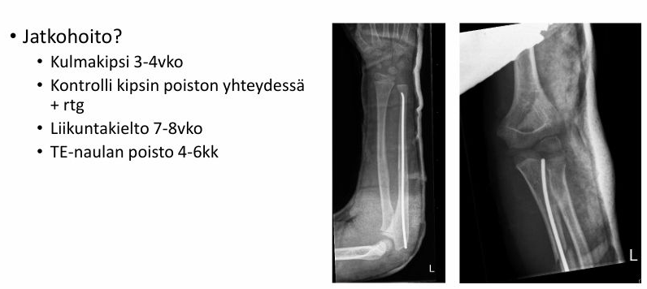

  

### Selitä lyhyesti: Vesikoureteriaalinen refluksi (VUR) {#VUR-selita}

  <button class="solution-button"
          data-label="Vastaus"
          data-hide-label="Piilota vastaus">
    Vastaus
  </button>
  

      
Vesikoureteraalinen refluksi (VUR) tarkoittaa **virtsan virtaamista rakosta takaisin virtsanjohtimeen;** havaitaan yleensä lapsuudessa toistuvina pyelonefriitteinä. _Voi johtua mm. ureterin poikkeavasta tulokulmasta rakkoon nähden tai synnynnäisestä rakennepoikkeavuudesta vesikoureteraalisessa läpässä._

---

Refluksia tapahtuu erityisesti paineen noustessa rakossa (esim. virtsaamisen yhteydessä). VUR:n lievässä muodossa (aste I) takaisinvirtaus rajoittuu virtsanjohtimiin, mutta virtsa voi kulkeutua myös munuaisaltaisiin (aste II) ja aiheuttaa painetta munuaiskudokseen (asteet III–V). Tilanteeseen voi liittyä myös virtsanjohtimen laajentuminen. 

---

**Lievä VUR on yleinen pienillä lapsilla ja useimmiten korjaantuu itsestään ajan kuluessa.** Vaikeammat muodot (III–V) altistavat munuaistason infektioiden kehittymiselle ja niiden uusimisille. Toistuvat virtsatieinfektiot voivat johtaa krooniseen munuaisten vajaatoimintaan erityisesti, jos virtsateissä todetaan niitä ahtauttava rakennevika tai lapsella on munuaisten kehityshäiriö. Tietyissä tilanteissa virtsatieinfektioiden ehkäisemiseksi käytetään mikrobilääke-estohoitoa. Harvoin hoitona voi olla endoskooppinen tai jopa kirurginen hoito. Endoskopiassa sisäpuolelta virtsanjohtimen suuaukkoon voidaan ruiskuttaa täyteainetta, joka vahvistaa venttiiliä ja estää takaisinvirtausta. Kirurgiassa virtsanjohtimen ja rakon välinen liitoskohta voidaan korjata avo- tai tähystysleikkauksella. 

  

### Selitä lyhyesti: Hirschsprungin tauti {#Hirschsprung-selita}

  <button class="solution-button"
          data-label="Vastaus"
          data-hide-label="Piilota vastaus">
    Vastaus
  </button>
  

      
Hirschsprungin tauti on **synnynnäinen loppusuolen aganglionoosin aiheuttama sairaus, joka ilmenee useimmiten suolenvetovaikeutena jo vastasyntyneisyyskaudella.** Gangliosolut, joiden laskeutuminen epäonnistuu Hirschsprungin taudissa, ovat peräisin hermopienasta. Hermopienasolujen kulkeutumisen puuttuminen distaalisen paksusuolen ja peräsuolen myenteeriseen ja submukosaaliseen pleksukseen johtaa näiden alueiden relaksaation ja peristaltiikan epäonnistumiseen -> dilataatio hermottomasta alueesta proksimaalisesti

Suurin osa, noin 75 % tapauksista rajoittuu peräsuolen alueelle, mutta hankalimmissa tilanteissa koko suolen hermotus voi olla poikkeava. Hirschsprungin tautia pitää epäillä, jos suolenvetovaikeus on alkanut heti syntymän jälkeen, etenkin jos ensimmäinen mekonium ei ole tullut normaalisti ensimmäisen 24-48h aikana. Suurin osa diagnosoidaan jo ennen sairaalasta kotiutumista, mutta lievemmissä tapauksissa oireena voi olla hankala, hoitoon reagoimaton ummetus, vatsan pömpötys ja huono painonnousu.

---

Diagnoosiin päästään koepalatutkimuksella ja loppusuolen varjoainekuvalla pystytään arvioimaan, kuinka pitkälle tauti ulottuu suolessa oraalisuuntaan. **Valtaosa pystytään hoitamaan leikkauksella peräaukon kautta, jossa aganglionoottinen osa suolta poistetaan.** Hirschsprungin tautiin liittyy noin 15–30 %:ssa tapauksista sille ominainen suolistotulehdus, enterokoliitti, joka voi ilmaantua joko taudin ensioireena ennen leikkausta tai myös leikkauksen jälkeen. Tämän oireena on vatsan pömpötys, poikkeuksellisen pahanhajuinen ripuli ja kuume. Tila voi olla pahimmillaan hengenvaarallinen, ja siksi nämä potilaat on syytä ohjata nopeasti sairaalaan jatkohoitoon.

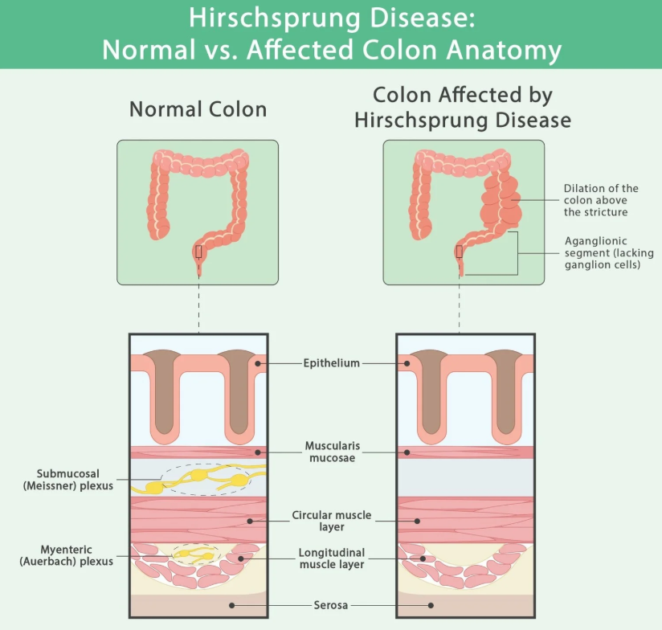
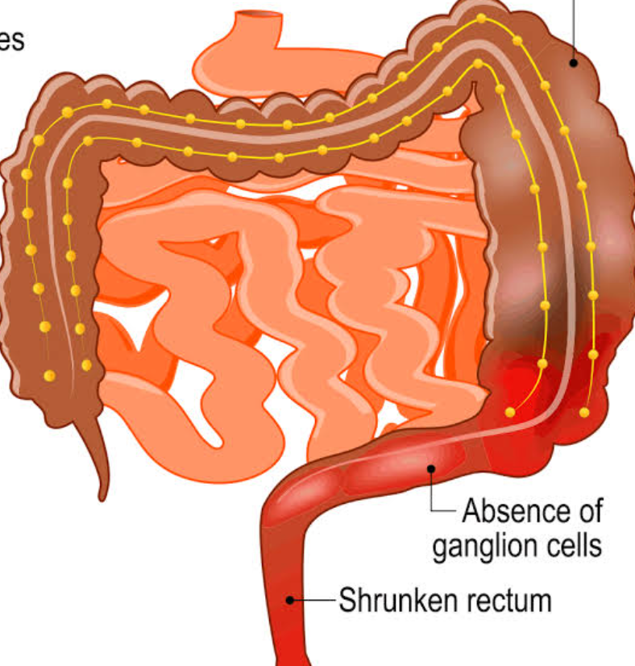

  

### Selitä lyhyesti: Salter-Harris 3 luokan morfologia {#SH3-selita}

  <button class="solution-button"
          data-label="Vastaus"
          data-hide-label="Piilota vastaus">
    Vastaus
  </button>
  

      
Salter-Harrisin luokan 3 murtuma kulkee kasvulevyn kautta epifyysin läpi nivelpintaan. 

---

Kasvulevyyn ulottuvat murtumat luokitellaan tavallisimmin Salter-Harris-luokituksen avulla. On myös Petersonin luokitus, joka on tarkempi on käytössä mm. Helsingissä enemmän; muuten maailmalla SH-luokitus on yleisemmin käytössä.

<li>SH1 = Murtuma on pelkästään kasvulevyn hypertrofisessa vyöhykkeessä; epifyysi erkanee metafyysistä</li>
<li>SH2 = Murtuma kulkee kasvulevyn halki metafyysiin; yleisin tyyppi</li>
<li>SH3 = Murtuma kulkee kasvulevyn kautta epifyysin läpi nivelpintaan</li>
<li>SH4 = Murtuma kulkee metafyysin, kasvulevyn ja epifyysin läpi nivelpintaan</li>
<li>SH5 = Kasvulevyn puristusvamma, jossa kasvulevy murskautuu; ei dislokoitumista tyypillisesti; hyvin harvinainen</li>

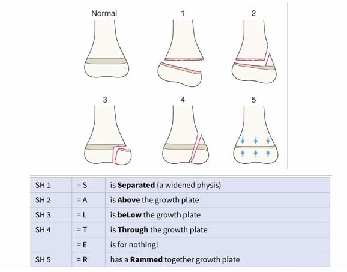
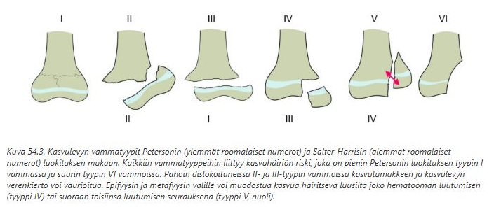

  

### Selitä lyhyesti: Hypospadia {#Hypospadia-selita}

  <button class="solution-button"
          data-label="Vastaus"
          data-hide-label="Piilota vastaus">
    Vastaus
  </button>
  

      
Virtsaputken alahalkio eli hypospadia on virtsaputken urogenitaalipoimujen sulkeutumishäiriö, jossa tavallisesta anatomiasta poiketen **virtsaputki aukeaa siittimen alapinnalle eikä terskan kärkeen.** 

Hypospadian tausta on monitekijäinen ja esiintyvyys noin 20/10 000 syntynyttä. Hypospadia luokitellaan virtsaputken suuaukon mukaan: distaalinen, peniili, proksimaalinen. Virtsaputken suuaukon sijainti ei välttämättä riitä kuvaamaan vaikeusastetta, mistä johtuen käytännön luokittelussa huomioidaan lisäksi koko, terskan muoto, uretralevyn laatu ja peniksen käyryys. 

Myös esinahka on hypospadiassa usein poikkeava. Piilokiveksisyyden ja nivustyrän esiintyvyys on hypospadiapotilailla noin 10 %. Epäselvän sukupuolen selvittelyt tulee tehdä niillä, joilla on proksimaalinen hypospadia ja piilokiveksisyys. 

Mikäli virtsasuihku on poikkeava tai virtsaputki pullistuu virtsatessa, tulee virtsaputken suuaukon ahtauma poissulkea. Virtsanpidätyskyky on näillä lapsilla normaali. _Hypospadia korjataan tilanteen mukaan leikkauksella useimmiten ensimmäisen ikävuoden jälkeen._

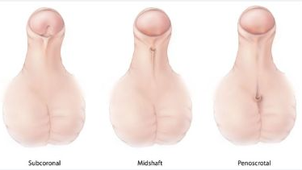
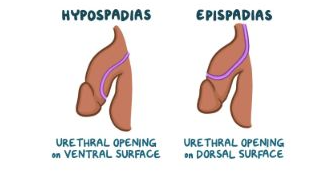

  

### Selitä lyhyesti: Appendix testis {#Appendix-testis-selita}

  <button class="solution-button"
          data-label="Vastaus"
          data-hide-label="Piilota vastaus">
    Vastaus
  </button>
  

      
Kiveslisäke eli appendix testis on arviolta 90 %:lla miehistä kiveksen yläosissa tai lisäkiveksessä sikiökaudelta jäänyt muutaman millimetrin mittainen varrellinen lisäke, joka saattaa kiertyä oman vartensa ympäri ja mennä nekroosiin. 

Kiveslisäkkeen kiertymässä kiveksen ja lisäkiveksen vieressä tuntuu aristava nappula, joka voi myös sinertää ihon läpi (blue dot sign). 

Kiveslisäkkeen kiertymä ei välttämättä tarvitse leikkausta. Usein päädytään leikkaukseen epäselvän diagnostiikan takia (erotusdiagnostiikka testistorsion suhteen vaikea) ja toisaalta voimakkaat kivut paranevat nopeasti leikkauksella.

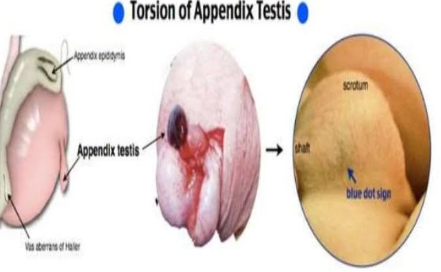

  

### Selitä lyhyesti: Urakusjäänne {#Urakusjaanne-selita}

  <button class="solution-button"
          data-label="Vastaus"
          data-hide-label="Piilota vastaus">
    Vastaus
  </button>
  

Napavarren irtoamisen jälkeen napaan voi jäädä erittävä granulooma. Se rauhoittuu yleensä puhdistuksella tai laapistuksella eli hopeanitraattikäsittelyllä. Jos napa erittää useita kuukausia, pitää epäillä napafisteliä, joka on sikiöaikaisen rakenteen jäänne.
      
Sikiökehityksen aikana siis sekä virtsateistä (urachus) että suolistosta (ductus omphalomesentericus) on yhteys napaan. Sikiöaikaiset jäänteet, kuten virtsarakon tai suolen limakalvojäänteet (urakusremnantti, omfalomesenteerinen remnantti; yhteyksiä siis joko rakosta tai suolesta napaan) muistuttavat granuloomaa, mutta erittävät mahdollisesti jopa virtsaa tai ulostetta eivätkä reagoi granulooman tavallisiin hoitoihin. 

Näitä tutkimuksia varten vauva lähetetään kiireettömään lastenkirurgin arvioon. UÄ selvittelyssä, tarvittaessa MRI. Hoito on usein operatiivinen. 

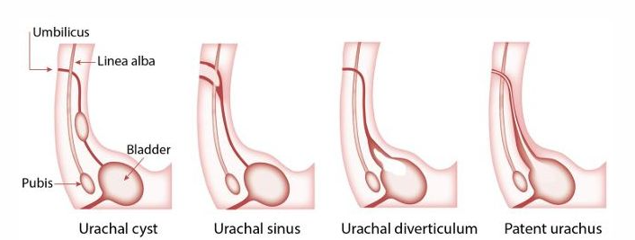
  

### Selitä lyhyesti: BXO {#BXO-selita}

  <button class="solution-button"
          data-label="Vastaus"
          data-hide-label="Piilota vastaus">
    Vastaus
  </button>
  

      
Balanitis xerotica obliterans (BXO) on **krooninen peniksen tulehdussairaus, joka esiintyy useimmiten esinahan ja terskan alueella.** BXO:ta on pidetty valkojäkälän varianttina miehen genitaalialueella, ja sitä tavataan kaiken ikäisillä (yleisintä pojilla n. 9-11v ja aikuisilla n. 30-60v)

Etiologialtaan avoin. Taudissa epiteeli muuttuu ympäristöään vaaleammaksi ja fibrotisoituu. Osalle syntyy kiinnikkeitä. _Fibrotisoituminen voi aiheuttaa patologista fimoosia._

Valkojäkälä on suurin yksittäinen ei-papilloomavirusinfektioihin liittyvien peniksen karsinoomien riskitekijä (lisääntynyt levyepiteelikarsinooman riski (4-5 %))

---

BXO diagnoosi tehdään yleensä kliinisesti todettaessa patologinen sekundaarinen fimoosi (esinahassa oleva vaalea kiristävä rengas)

**BXO on tavallisin lääketieteellinen syy ympärileikkaukseen.** Hoitamalla BXO:ta glukokortikoidivoiteella voidaan välttää ympärileikkaus noin kolmasosalla potilaista; kannattaakin yrittää hoitaa lievää esinahkaan rajoittuvaa BXO:ta ensin esim. bemetson 1x/vrk 4-8vk. 

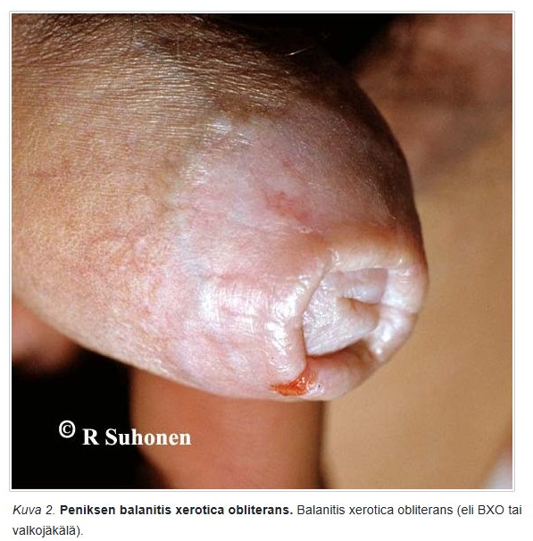
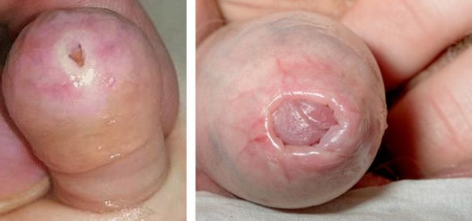
  

### Selitä lyhyesti: NEC {#NEC-selita}

  <button class="solution-button"
          data-label="Vastaus"
          data-hide-label="Piilota vastaus">
    Vastaus
  </button>
  

      
Nekrotisoivaa suolitulehdusta eli enterokoliittia (Necrotizing enterocolitis, NEC) ilmenee erityisesti tehohoidossa olevilla, hyvin ennenaikaisilla lapsilla, mutta sitä ilmenee joskus myös esimerkiksi täysiaikaisilla vastasyntyneillä, joilla on vaikea synnynnäinen sydänvika tai suoliston alueen kehityshäiriö. 

Nekroottisen enterokoliitin taustatekijöitä ovat mm. vähentynyt suoliston verenkierto ja tulehdus. Mikrobiologisen etiologian osuus on epäselvä. Korvikemaitoruokituilla pikkukeskosilla nekroottinen enterokoliitti on tavallisempi kuin rintamaitoa saaneilla lapsilla. 

**Vaikeassa suolitulehduksessa suoleen voi syntyä kuolioalueita ja jopa reikiä.** 

Vaikean nekroottisen enterokoliitin hoito on kirurginen. Lievempioireisia tapauksia voidaan hoitaa konservatiivisesti antibiooteilla ja suonensisäisellä ravitsemuksella, kunnes tulehdus suolessa on asettunut.

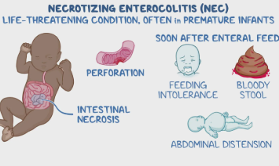
  

### Selitä lyhyesti: Wilmsin tuumori {#Wilmsin-tuumori-selita}

  <button class="solution-button"
          data-label="Vastaus"
          data-hide-label="Piilota vastaus">
    Vastaus
  </button>
  

      
**Yleisin munuaisen maligni kasvain aikaisessa lapsuudessa on Wilmsin tuumori eli nefroblastooma;** nuorten lasten vatsan alueen malignin möykyn yleisin syy. 

---

Wilmsin tuumori on pahanlaatuinen embryonaalinen kasvain, joka koostuu kolmesta eri komponentista: erilaistumaton blasteema (epäkypsä munuaisen mesenkyymi, pieniä ja niukkasytoplasmaisia soluja), epiteeli (tiehyitä, primitiivisiä glomeruluksia ja tubuluksia) ja strooma (yleensä fibrosyyttistä).

---

Valtaosa Wilmsin kasvaimista todetaan alle viisivuotiailla; keski-ikä diagnoosille n. 3v. Usein lapsella todetaan poikkeava resistenssi vatsalla, muuten useimmiten oireeton. Joskus ilmenee verivirtsaisuutta (minimaalisesta traumasta aiheutuu makroskooppinen hematuria; noin 20–30 %) tai kohonnut verenpaine (25 %). _Vatsan palpointi tulee epäilyssä suorittaa varovasti, ettei tuumori repeä ja leviä._ UÄ on hyvä primaaritutkimus. Ei ylitä keskilinjaa.

---

Leikkaus on usein helpompi tehdä lyhyen solunsalpaajahoidon jälkeen, jolloin kasvain on kutistunut. Samalla saadaan myös histologinen arvio lääkevasteesta. Paikallinen kasvain voidaan hoitaa kevyellä solunsalpaajalääkityksellä. Paikallisesti ja systeemisesti (keuhkot) levinneen Wilmsin kasvaimen hoitoon käytetään pidempää solunsalpaajahoitoa ja sädehoitoa.

**Wilmsin kasvaimen ennuste on erinomainen,** ja jopa keuhkojen etäpesäkkein uusiutuvan kasvaimen hoidossa on mahdollista saavuttaa pysyvä paraneminen.

  

### Selitä lyhyesti: Parafimoosi {#Parafimoosi-selita}

  <button class="solution-button"
          data-label="Vastaus"
          data-hide-label="Piilota vastaus">
    Vastaus
  </button>
  

      
Parafimoosi (esinahan luiskahdus) tarkoittaa, että kireä esinahka luiskahtaa terskan taakse eikä enää palaudu. Voi obstruktoida terskan verenkiertoa ja jatkaa turpoamista, jonka takia hoidettava nopeasti päivystyksellisesti (ei nyt mikään älyttömän kiireinen hätätilanne kuitenkaan kyseessä). Hoitona siis vedetään esinahka takaisin paikalleen; varsinkin lapsilla kannattaa puudutegeelillä puuduttaa alue edeltävästi. 

---

Fimoosi (esinahka on niin kireä, ettei sitä saa vedettyä kunnolla pois terskan päältä) voi johtaa parafimoosiin, jossa ahdas esinahka ei pääse taakse vetämisen jälkeen takaisin terskan päälle. 

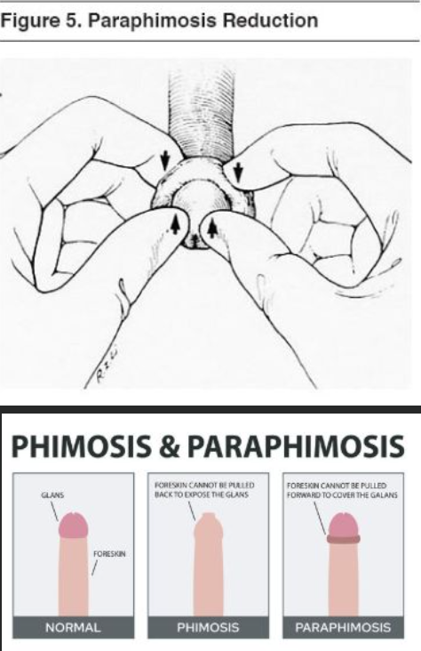
  

### Selitä lyhyesti: Lonkan transientti synoviitti {#Selita-Lonkan-transientti-synoviitti}

  <button class="solution-button"
          data-label="Vastaus"
          data-hide-label="Piilota vastaus">
    Vastaus
  </button>
  

      
Lonkan transientti synoviitti (aseptinen koksiitti, coxitis simplex) eli lonkan nivelkalvon ohimenevä tulehdus on yleisin 3-10(-12)-vuotiaan lapsen ontumisen syy. Kyseessä on äkillisesti alkanut, yleensä toispuoleinen, aseptinen tulehdus. Oireena on kivulias ontuminen tai varaamattomuus. Kipu voi tuntua nivusessa tai usein tyypillisen harhaanjohtavasti polvi- tai reisikipua. Tyypillisesti lonkka on fleksiossa ja ulkorotaatiossa. Tutkittaessa erityisesti lonkan kiertoliikkeet ovat rajoittuneet.

Yleisoireita ei ole, ja lasko ja CRP ovat normaalit tai vain lievästi suurentuneet.

Niveltulehduslöydös vahvistuu kaikukuvauksella, ja diagnoosi varmistuu, kun oirekuva ja löydökset väistyvät muutaman päivän - parin viikon kuluessa. 

Hoito: lepo, NSAID; kontrolli tarvittaessa, jos oireet ei häviä 2 viikossa (harkinnan mukaan rtg). Voi uusia.

  

### Selitä lyhyesti: Torusmurtuma {#Torusmurtuma-selita}

  <button class="solution-button"
          data-label="Vastaus"
          data-hide-label="Piilota vastaus">
    Vastaus
  </button>
  

      
Lapsilla metafyysi voi aksiaalisen voiman vaikutuksesta murtua siten, että **kompressiopuolen hohkaluu puristuu kasaan ja kuorikerros rypistyy,** kun taas distraktiopuolen kuorikerros jää joko ehjäksi tai siihen tulee lievä taipuma. 

Tällainen lapsille tavallinen murtuma (ns. torus- tai bucklemurtuma) on **stabiili, eikä sitä ole syytä reponoida.** Ryppymurtumaa voi luonnehtia lapselle ja vanhemmille luun "nitkahtamisena" eikä "murtumana", sillä se on täysin stabiili luuvamma. Torusvammassa luun asento ei huonone eikä radiologista seurantaa tarvita. _Ranteen torusmurtuma hoituu 1-3 viikon tarrakiinnitteisellä ortoosilla tai yksilöllisellä dorsaalisella kipsilastalla, jonka tarkoituksena on kivunhoito._ Sen käyttö voidaan lopettaa sovitun ajan kuluttua kotona 

---

Lapsen luu on elastisempaa ja periosti paksumpaa kuin aikuisen, jonka takia lapsilla tulee muistaa epätäydelliset murtumat, joita ovat torusmurtuma (buckle), pajunoksamurtuma (greenstick) ja taipuma.

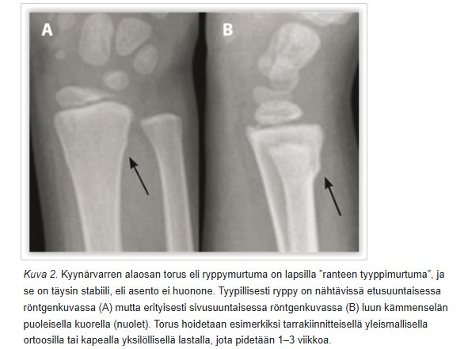
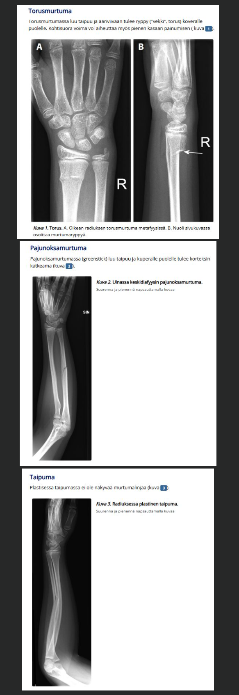
  

### Selitä lyhyesti: Mesenteriaalinen lymfadeniitti {#Mes-lymf-selita}

  <button class="solution-button"
          data-label="Vastaus"
          data-hide-label="Piilota vastaus">
    Vastaus
  </button>
  

      
**Mesenteriaalinen lymfadeniitti on virusinfektion / sen jälkitilan aiheuttama ileokekaalikulman imusolmukkeiden turvotus.** Tyypillisin ikä on alle 15-vuotiaat lapset ja nuoret (esiintyvyyshuipentuma noin 3–10 vuoden iässä). Aikuisiällä vaiva on harvinainen. 

**Oirekuva matkii oireiltaan erityisesti äkillistä umpilisäkkeen tulehdusta ja onkin yleisin erotusdiagnostinen vaihtoehto appendisiitille.** Kuumetta, pahoinvointia ja oksentelua, lievää ripulia/muita suolisto-oireita; usein taustalla edeltävä hengitystieinfektio. 

Diagnoosi perustuu kliiniseen kuvaan ja vatsan alueen ultraäänitutkimukseen. Ultraäänessä nähdään suoliliepeessä useita suurentuneita imusolmukkeita (halkaisija lyhyellä akselilla >8 mm), kun taas umpilisäke todetaan normaaliksi. HUOM! Myös appendisiitti voi turvottaa imusolmukkeet, mutta tällöin tietysti umpilisäke olisi kuitenkin poikkeava (paksuseinäinen). 

**Paranee itsestään 1-4vkossa, hoito oireenmukainen.** Jos ei parane / systeemioireita, niin poissuljettava IBD, maligniteetti, tuberkuloosi jne.

  

### Selitä lyhyesti: Kampurajalka {#Kampurajalka-selita}

  <button class="solution-button"
          data-label="Vastaus"
          data-hide-label="Piilota vastaus">
    Vastaus
  </button>
  

      
Kampurajalka on yleisin (esiintyvyys on noin 1/1 000) synnynnäinen alaraajapoikkeavuus ja sille on tyypillistä latinankielisen nimensä talipes equinovarus mukaan jäykkä virheasento, jossa yhdistyy jalkaterän etuosan kääntyminen keskiviivaa kohti (adductus), jalkapohjan kiertyminen sisäänpäin (supinaatio) ja koko jalkaterän voimakas varvistusasento (ekvinus). Kaikki kampurajalat eivät kuitenkaan ole samanlaisia: eri virheasentojen osuus ja jalkaterän jäykkyys vaihtelevat. 

---

Diagnoosi tehdään usein jo raskauden aikana kaikukuvauksen perusteella 18.-21. raskausviikolla (tosin kaikukuvaus ei kuitenkaan varmuudella pysty erottamaan kampurajalkaa sikiön normaalisti kehittyvästä jalasta (posturaalinen kampurajalka), joka on kampuramaisessa asennossa ahtaassa kohdussa). 

Syntymän jälkeen oikea diagnoosi voidaan tehdä aina kliinisesti: todellinen kampurajalka on jäykkä, eikä sen asennon korjaus onnistu kuin osittain - posturaalisen kampurajalan asennon voi korjata helposti normaaliksi. 

Kampurajalka voi liittyä erilaisiin oireyhtymiin ja neuromuskulaarisiin sairauksiin, kuten artrogrypoosiin, CP-vammaan tai meningomyeloseeleen, mutta suurin osa potilaista on muuten terveitä. Kampurajalan diagnoosin kannalta alkuvaiheessa otetuista röntgenkuvista ei ole hyötyä.

---

**Hoitona käytetään niin sanottua toistokipsausta (Ponsetin metodi),** jossa virheasentoa pyritään asteittain korjaamaan viikon välein vaihdettavilla kipseillä. Jalan etuosaa (veneluu ja sitä distaalisempi osa) painetaan sisäsivulta ja samalla tuetaan peukalolla jalkaterän ulkosivua telaluun kaulan kohdalta. Saavutettu asento säilytetään kipsaamalla.

<li>Ensimmäisellä kerralla korjataan pääasiassa etujalan supinaatiota ja adduktiota. Toisella kerralla päästään yleensä adduktion suhteen lähelle neutraaliasentoa. Kolmannella kerralla pyritään tukemaan jalkaterä ulkokiertoon. Neljännellä kerralla lisätään ulkokiertoa, jolloin nilkan ja jalkaterän ekvinus korjautuu samalla osittain.</li>
<li>Ponseti suositteli käyttämään toistokipsauksissa kalkkikipsiä, mutta nykyisin monet keskukset ovat siirtyneet synteettisen pehmytkipsin käyttöön. Kampurajalan korjaus onnistuu pehmytkipseillä yhtä hyvin kuin kalkkikipsillä.</li>

---

**Kipsihoidon päätteeksi valtaosa kampuravauvoista tarvitsee akillesjänteen katkaisun.** Akillesjänteen katkaisu eli tenotomia tehdään yleensä 4-6 toistokipsauksen jälkeen, kun jalkaterä on saatu lähelle neutraaliasentoa. **Tenotomian jälkeen asetetaan reisimittainen pitkä alaraajakipsi,** niin, että polvi on 90 asteen kulmassa ja nilkka on lievässä dorsifleksiossa. Katkaistun jänteen päät kasvavat kipsihoidon aikana yhteen aiempaa pidemmäksi. 

<li>**Kipsihoito korvataan tankokengillä kolme viikkoa akillesjänteen katkaisun jälkeen. Jalkaterät asetetaan hyvin istuviin ja oikean kokoisiin kenkiin, jotka on kiinnitetty lapsen hartioiden levyisen tangon päihin. Tankokenkähoidolla ylläpidetään saavutettu jalkaterän asento. Monissa paikoissa käytäntönä on jatkaa ympärivuorokautista tankokenkähoitoa, kunnes lapsi oppii seisomaan ja tämän jälkeen jatkaa yöhoitoa viiteen ikävuoteen saakka,** vaikka varmaa tietoa ympärivuorokautisen tankokenkähoidon hyödystä ensimmäisen elinvuoden aikana ei ole</li>
<li>Seuranta lastenortopedialla on tärkeää, koska virheasento voi uusia. Hoitotulokset ovat suurimmalla osalla hyviä, jos perhe sitoutuu hoitoon. **Huono hoitomyöntyvyys tankokenkähoitoon on merkittävin yksittäinen riskitekijä kampuravirheasennon palautumiselle.** Tankokenkien liian vähäinen käyttö johtuu yleensä siitä, että virheasennon korjaus ei ole ollut riittävä. Alikorjattu jalkaterä (residuaalinen kampurajalka) istuu huonosti tankokenkään. Toinen merkittävä syy tankokenkähoidon epäonnistumiselle on se, etteivät vanhemmat sitoudu hoidon toteuttamiseen. Vanhempien jatkuva motivoiminen tankokenkähoitoon on tärkeää hoidon onnistumiseksi. Hoito vaatii perheeltä sitoutumista lapsen viiden ensimmäisen elinvuoden aikana. Kampuralasten vanhemmat voivat hakea hoitotukea Kelalta. Tämän hakemuksen liitteeksi lääkäri tekee C-todistuksen.</li>
<li>Korjatun kampurajalan asento huononee (residiivi) eri seurantatutkimuksien mukaan noin 10-30 %:lla potilaista. Tankokenkähoidon aikana huonontuneeseen jalkaterän asentoon on puututtava aktiivisesti, koska tankokenkä ei korjaa jalan virheasentoa. Residiivin hoito toteutetaan uudella toistokipsaussarjalla ja tarvittaessa akillesjänne katkaistaan (uudestaan), jos potilas on alle vuoden ikäinen. Tämän jälkeen tankokenkähoito aloitetaan uudestaan alle viisivuotiailla. Yli viisivuotiailla residiivikampuran hoito toteutetaan ensisijaisesti toistokipsauksella pitkällä synteettisellä alaraajakipsillä, joka vaihdetaan 2-3 kertaa 1-2 viikon välein. Hoidon ajaksi potilas tarvitsee kyynärsauvat tai pyörätuolin, koska astuminen kipsillä on vaikeaa. Hoitoa jatketaan tämän jälkeen vielä muutama viikko lyhyellä synteettisellä saapaskipsillä, jolla kävely onnistuu ilman apuvälineitä. Etummaisen säärilihaksen jänteen kiinnityspisteen siirtoa ulommaiseen vaajaluuhun kannattaa harkita kipsihoidon jälkeen saavutetun asennon ylläpitämiseksi. </li>

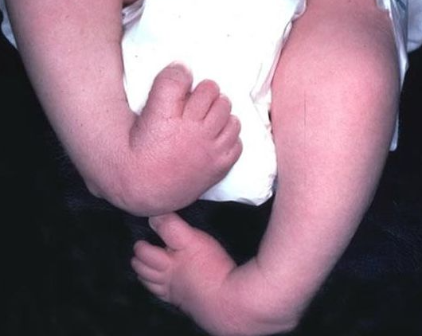
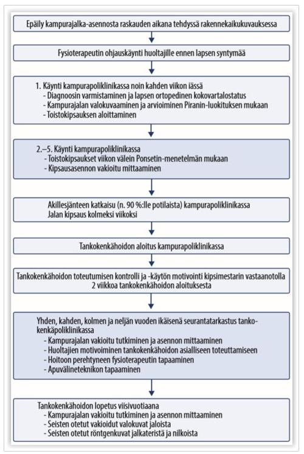
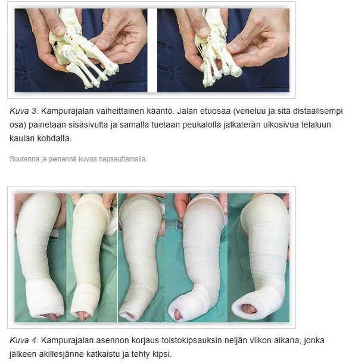
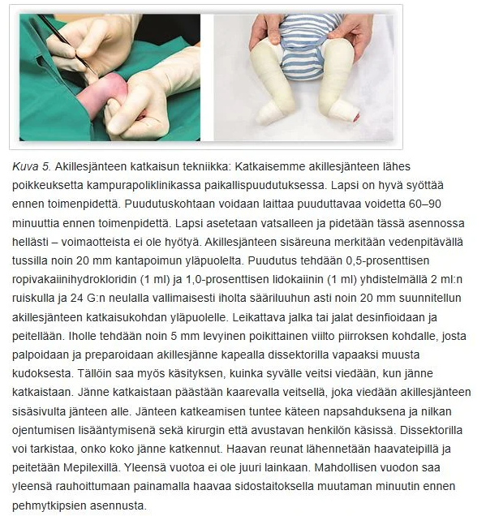
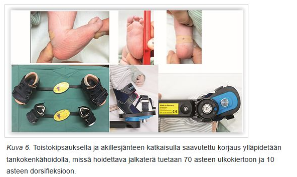

  

### Selitä lyhyesti: Harjurinta {#Harjurinta-selita}

  <button class="solution-button"
          data-label="Vastaus"
          data-hide-label="Piilota vastaus">
    Vastaus
  </button>
  

      
Pectus carinatum on kansankielellä harjurinta tai pulunrinta. Se on rintakehän rakennepoikkeama, jossa rintalasta ja kylkiluut työntyvät ulospäin

---

Tavallisimpia rintakehän epämuodostumia ovat kuopparinta (pectus excavatum, suutarinkuoppa) ja harjurinta (pectus carinatum, pulunrinta)

Näiden rakennepoikkeavuuksien tarkkaa syytä ei tunneta, mutta jossain määrin ne assosioituvat sidekudossairauksiin (Marfan, Ehlers–Danlos) ja osalla potilaista todetaan suvussa vastaavia epämuodostumia. 

**Ne ovat pääosin oireettomia ja haitta on yleensä kosmeettinen.** _Yleensä synnynnäisiä ongelmia ja pahenevat murrosiässä kasvun myötä._

---

Syvään kuopparintaan voidaan tarjota korjaavaa leikkausta, jos ongelma häiritsee. Leikkauksessa rintakehälle asetetaan metallitanko nostamaan rintalastaa. Kyseessä on iso leikkaus eikä siten ole ollenkaan riskitön.

**Harjurintakaan ei tarvitse yleensä hoitoa, mutta varsinkin kasvuiässä aloitettu ortoosihoito vähentää virhemuodostumaa. Osa mukautuu ortoosin käyttöön ja kirurginen hoito on varsin harvinaista.**

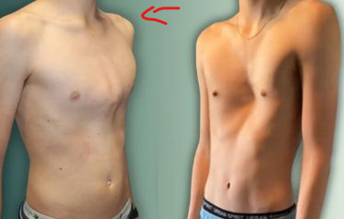
  

### Selitä lyhyesti: Uretraläppä {#Uretralappa-selita}

  <button class="solution-button"
          data-label="Vastaus"
          data-hide-label="Piilota vastaus">
    Vastaus
  </button>
  

**Virtsaputken takaosan läppä (posterior urethral valve, PUV) eli uretraläppä on synnynnäinen rakennepoikkeama; virtsaputken sulkijalihaksen seudussa sijaitseva kalvomainen rakenne, joka esiintyy vain pojilla.** Uretraläppä tukkii virtsaputkea ja aiheuttaa painetta virtsateihin. Tämä häiritsee virtsarakon ja munuaisten toimintaa.

---

Useimmiten uretraläppä todetaan jo sikiöaikana ultraäänitutkimuksessa. Jos uretraläppä havaitaan vasta syntymän jälkeen, se löydetään usein virtsatietulehduksen tutkimuksissa.

Syntymän jälkeen virtsateiden UÄ kuuluu tehdä mm, jos todetaan imeväisiällä virtsatieinfektio tai muutenkin lapsella kuumeinen virtsatieinfektio. Jos pojalla todetaan kuumeeton mutta diagnostisesti varma virtsatieinfektio imeväisiän jälkeen, ultraäänitutkimus on myös tarpeen, sillä pojilla virtsatieinfektiot ovat harvinaisia ja infektio voi liittyä todennäköisemmin merkittävään rakennepoikkeavuuteen. Lisäksi tulee huomioida ahtaan esinahan eli fimoosin mahdollisuus.

Ultraäänitutkimuksen tavoitteena on löytää varhain virtsateitä ahtauttavat synnynnäiset viat ja muut merkittävät synnynnäiset rakennepoikkeavuudet kuten munuaisen kehityshäiriö (munuaisen agenesia, aplasia tai dysplasia). Varhainen virtsateiden ahtauttavan vian löytäminen on tarpeellista riittävän aikaisen kirurgisen hoidon suunnittelua ja toteuttamista varten. Vaikea todettu rakennepoikkeavuus voi puolestaan vaikuttaa munuaisten toimintaan, ja lapsi voi vaatia munuaisten toiminnan seuraamista. **Tärkeimpiä etsittäviä virtsankulkua estäviä eli ahtauttavia rakennepoikkeavuuksia ovat hydronefroosi ja uretraläppä.** Toispuoleisen hydronefroosin voi aiheuttaa pelveoureteraalinen stenoosi. **Uretraläppä on vakava, pojilla todettava poikkeavuus, jonka kliinisenä löydöksenä voidaan havaita huono virtsasuihku ja usein jo sikiöultraäänitutkimuksessa todettava molemminpuolinen hydronefroosi. Erityisesti uretraläppä voi aiheuttaa molempien munuaisten vaurioitumisen jo kohdussa, mikä voi johtaa munuaisten vajaatoimintaan syntymän jälkeisestä kirurgiasta huolimatta.**

---

Vaikka läppäongelmaa olisikin epäilty jo ultraäänitutkimuksessa, tehdään varsinainen läppädiagnoosi miktiokystografia-tutkimuksella, kun lapsen yleiskunto on riittävän hyvä. Tutkimuksessa rakko täytetään katetrin avulla varjoaineella. Lapsen virtsatessa läppä saadaan näkyviin kuvauksella. Jos lapsi on riittävän iso (yleensä yli 2500 g) ja yleistila hyvä, tehdään diagnoosin varmistuttua virtsaputken ja -rakon tähystys, jonka yhteydessä läppä avataan. Toimenpiteen jälkeen lapsella on yleensä kestokatetri 1–3 päivää. Sen jälkeen katsotaan, että virtsaaminen sujuu ongelmitta ja nestetasapaino normalisoituu, minkä jälkeen lapsi voi kotiutua.

---

Aikaisemmin vaikeimmissa tapauksissa pyrittiin joskus tekemään toimenpiteitä jo sikiökaudella virtsankulun korjaamiseksi. Taustalla oli ajatus auttaa munuaisten kehitystä. Hoitotulokset eivät kuitenkaan olleet odotettuja ja hoitomuotoa voidaan edelleen pitää kokeellisena.

Nykyään sikiötoimenpidettä saatetaan harkita keuhkojen kehityksen auttamiseksi, jos lapsivesi uhkaa loppua. Jos vastasyntynyt on erittäin huonokuntoinen, saatetaan tarvita tehostettua hengityshoitoa. Näissä vaikeimmissa tapauksissa saattaa joskus olla tarpeen tehdä tilapäinen virtsa-avanne. Siinä useimmiten molemmin puolin virtsanjohtimet nostetaan iholle siten, että virtsa tulee näistä avanteista sekä myös alakautta normaalireittiä pitkin.

Avannevirtsa voi valua yleensä suoraan vaippaan tai haluttaessa avannepussiin. Useimmiten avanteet suljetaan vuoden iässä. Vaikeimmissa tapauksissa jopa vastasyntyneelle voi olla tarpeen aloittaa dialyysihoito eli keinomunuaishoito. Toisinaan munuaistoiminta näissäkin tapauksissa käynnistyy niin, että dialyyseistä voidaan luopua ainakin tilapäisesti.

---

Läpän avauksen jälkeen potilas kutsutaan yleensä kontrollitutkimuksiin useimmiten ensimmäisen kerran jo muutaman viikon kuluttua ja ensimmäisen vuoden aikana muutamaan otteeseen. Kontrollien yhteydessä laboratoriotutkimuksilla selvitetään munuaisten toiminta ja nestetasapaino. Ultraäänellä tarkistetaan, onko munuaisaltaan turvotus lievittynyt. Läpän aukaisualueelle saattaa kehittyä arpiahtautta tai läppäjäänne saattaa edelleen aiheuttaa ahtautta. Niinpä läppäalueen auki pysyminen voidaan varmistaa tähystystutkimuksella tai rakon varjoainekuvauksella tai molemmilla. Ensimmäisen ikävuoden aikana tehdään myös munuaisten isotooppitutkimus, jolla selvitetään kummankin munuaisen kunto erikseen.

Jatkossa potilaat tarvitsevat sekä seurantaa yleensä 1–2 vuoden välein läpi kasvuiän, elleivät mahdolliset ongelmat edellytä tiiviimpää seurantaa. Munuaistoimintaa seurataan ja tarvittaessa hoidetaan munuaisten vajaatoimintaa. Urologian poliklinikalla seurataan virtsateiden toimintaa ja rakon kokoa ja tyhjenemistä. Vastasyntyneisyyskaudella läppäpotilaan rakko on tyypillisesti erittäin pienikokoinen, voimakkaasti supisteleva ja korkeapaineinen. Lapselle tehdään tarpeen vaatiessa urodynamiatutkimus, jolla selvitetään rakon paineolosuhteita, varsinkin jos munuaisten turvotus ei ala helpottaa hoidon myötä tai lapsen kuivaksi oppimisessa on ongelmia.

Tyypillisesti läppäpotilaan kuivaksi oppiminen on jonkin verran hitaampaa kuin keskimäärin. Jos lapsella on munuaisvajaatoiminta, on virtsaeritys yleensä tavanomaista runsaampi, mikä osaltaan saattaa myös vaikeuttaa kastelua ja pitää yllä ylempien virtsateiden turvottelua. Myöhemmin rakko saattaa pyrkiä venymään lapsen pidättelytaipumuksen takia. Tällöin rakon tyhjeneminen saattaa vaikeutua, mikä osaltaan lisää tulehdusriskiä ja kasteluongelmaa. Seurannan aikana onkin syytä huolehtia, että lapsi käy säännöllisesti virtsalla ja että rakko tyhjenee.

---

Potilaan munuaisennuste on hyvin vaihteleva. Osalla potilaista munuaistoiminta on täysin normaali, mutta noin kolmasosa päätyy munuaissiirtoon ja näistä kolmasosa vasta aikuisina. Melko hyvän ennusteen munuaissiirtotarpeesta antaa varhaisvaiheen munuaistoiminta. Nuorilla aikuisilla potilailla esiintyy häiritseviä virtsaoireita, kuten kastelua tai virtsaamisvaikeutta jonkin verran enemmän kuin ikätovereilla. Kuitenkin useimmat potilaat ovat oireettomia rakon toiminnan suhteen.

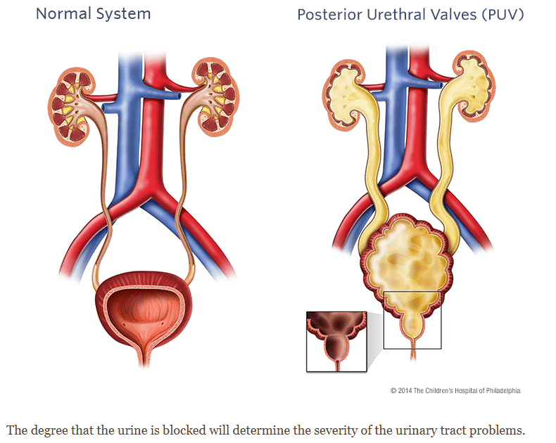
  

### Selitä lyhyesti: Omfaloseele {#Omfaloseele-selita}

  <button class="solution-button"
          data-label="Vastaus"
          data-hide-label="Piilota vastaus">
    Vastaus
  </button>
  

Omfaloseele (napanuoratyrä) on vatsaontelon synnynnäinen sulkeutumishäiriö, missä suolistoa työntyy kroonisesti (hernioituu) napanuoraan. Suolea siis ympäröi peritoneumpussi (vrt. gastroskiisi, jossa ei suojaavaa kalvopussia). Normaalisti n. rvk 11 suolet palaavat vatsaonteloon, mutta omfaloseelessä suolet jäävät vatsaontelon ulkopuolelle. 

Tyrän laajuus vaihtelee suuresti, ulos voi työntyä vain muutama suolenmutka tai sitten lähes koko suolisto ja osa maksaakin. Napanuoratyrään liittyy lähes puolissa tapauksista pään, kasvojen ja sydämen epämuodostumia sekä kromosomianomalioita.

Diagnoosi tehdään tavallisesti raskauden aikana ultraäänellä. 

Hoito on kirurginen ja ennuste isoloiduissa tapauksissa hyvä, jos kirurgiaan päästään varhain. Esiintyvyydeksi on arvioitu 1/8500 syntyvää lasta.

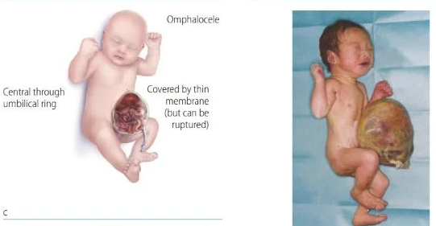
  

### Selitä lyhyesti: Spondylolisteesi {#Spondylolisteesi-selita}

  <button class="solution-button"
          data-label="Vastaus"
          data-hide-label="Piilota vastaus">
    Vastaus
  </button>
  

Spondylolisteesi tarkoittaa nikamansiirtymää, ja se johtuu tyypillisesti spondylolyysistä lapsilla ja nuorilla

---

Lapsilla yleisimpiä selkäkivun aiheuttajia ovat rasitusmuutokset varsinkin urheilullisesti aktiivisilla nuorilla ja nämä ovat kehityksellisellä jatkumolla: rasitusosteopatia -> spondylolyysi (yleensä pars interarticulariksen rasitusmurtuma; nikamanhöltymä) -> spondylolisteesi (siirtymä). Tyypillisesti nämä esiintyvät L5-nikamassa. 

Spondylolyysin ja spondylolisteesin yleisimpiä oireita nuorilla ovat selkäkipu ja kireät takareidet (harmstring-kireys). 

Rasitusosteopatiassa useimmat lapset palaavat oireettomina entiseen lajiharrastukseensa. Todennäköisesti kuitenkin osassa tapauksista kehittyy spondylolyysi ja näistä osalle kehittyy spondylolisteesi. Jos etenee rasitusmurtumaksi: liikuntakielto 4 kk:n ajan. 

Spondylolisteesissä oireilevan nuoren nikamasiirtymää seurataan lannerangan sivukuvalla puolen vuoden välein ja häntä kielletään rasittamasta selkää. Luudutusleikkaus on aiheellinen, jos selkä oireilee toistuvasti tai siirtymä on suurempi kuin ⅓ siirtyneen nikaman syvyydestä. 

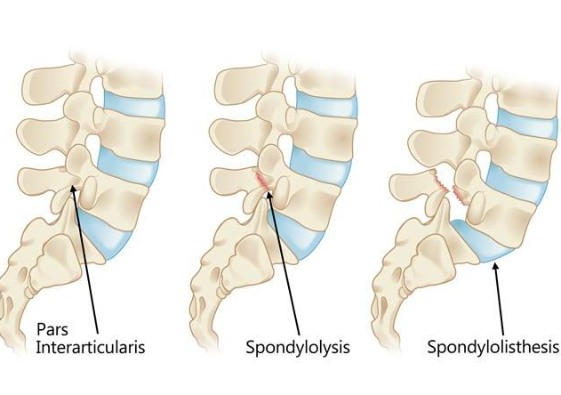
  

### Selitä lyhyesti: Venekallo {#Venekallo-selita}

  <button class="solution-button"
          data-label="Vastaus"
          data-hide-label="Piilota vastaus">
    Vastaus
  </button>
  

Yleisin kraniosynostoosi eli kallon sauman ennenaikainen luutuminen on **lakisauman (sagittaalisauma) ennenaikainen luutuminen. Tällöin kallo ei pysty kasvamaan leveyssuunnassa, vaan siitä tulee pitkä ja kapea, samalla otsa tulee prominentiksi ja kasvaa sekä eteenpäin että leveyssuunnassa, eli muodostuu niin sanottu venekallo.** Kallo kapenee niskaan päin. Tämä on siis päinvastaista normaaliin kallon muotoon nähden, jossa otsa on kapeampi tai saman levyinen kallon takaosan kanssa. Sivuprofiilissa venekallon korkein kohta on etuaukileen tasolla ja profiili laskeutuu takaraivoa kohti. 

Otsan massiivisuus korostuu ensimmäisen ikävuoden aikana, koska synostoosin vuoksi aivot työntyvät eteenpäin saadakseen lisää tilaa. Takaraivo muodostuu usein suipoksi, koska osa aivojen kasvusta suuntautuu tilanpuutteen vuoksi myös taakse alaviistoon. 

---

Kraniosynostoosit aiheuttaa kallon muotovirheen lisäksi usein myös muita ongelmia, kuten kuuroutta, sokeutta, puheen ja oppimisen viivästymistä sekä sydän- ja keuhko-ongelmia. Otsasauma eli metooppinen (frontaalinen) sauma on kallon saumoista ainoa, joka saa olla sulkeutunut lapsen syntyessä. Aiheuttaa ns. metooppisen harjanteen, joka on harmiton. 

Koronaarisauman, sagittaalisauman tai lambdasauman enneaikaiseen luutumiseen liittyvä progressiivinen kallon muodon poikkeavuus edellyttää plastiikkakirurgista konsultaatiota. **Kraniosynostoosit hoidetaan leikkauksella.** Koska leikkausikä vaikuttaa kirurgisen menetelmän valintaan, potilas olisi hyvä saada arvioon jo ensimmäisten elinkuukausien aikana.

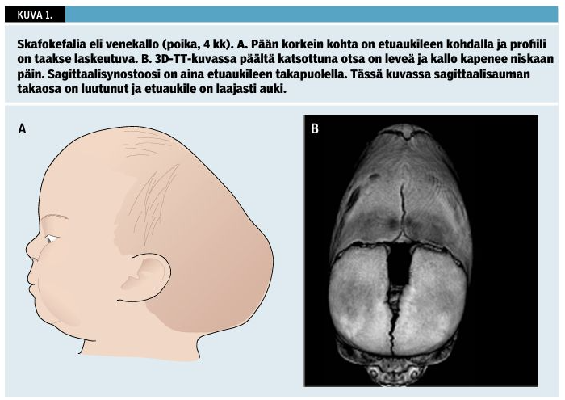
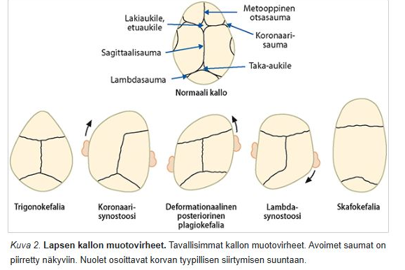
  

### Selitä lyhyesti: Scheuermannin tauti {#Scheuermann-selita}

  <button class="solution-button"
          data-label="Vastaus"
          data-hide-label="Piilota vastaus">
    Vastaus
  </button>
  

**Kasvun muodostaman kyfoosin yleisin muoto on Scheuermannin tauti (morbus Scheuermann), jossa selkärangan nikamasolmu (corpus) kasvaa poikkeavasti.** Scheuermannin tauti ilmenee kasvun loppuvaiheessa tyypillisimmin rintarangan alaosassa.

Tauti on osittain periytyvä, ja se on neljä kertaa yleisempi miehillä kuin naisilla. Ilmaantuvuuden arvellaan olevan noin 1–5 %. 

---

Sairauden varsinaista etiologiaa ei tunneta, mutta kyseessä on _osteokondrooseihin luokiteltava kasvuhäiriö nikaman päätelevyn kasvurustossa_ ennen sen luutumista, joka tytöillä tapahtuu 13–15 ikävuoden ja pojilla 15–17 ikävuoden välillä. Tautia ei juuri esiinny alle 10-vuotiailla. Kompression seurauksena nikaman etuosan kehitys hidastuu. Nikama muuttuu kiilamaiseksi, mikä useampien nikamien kasvuhäiriön myötä johtaa rintarangan hyperkyfoosiin. Bradfordin mukaan Scheuermannin taudin kriteerit ovat:

<li>epäsäännölliset nikamien päätelevyt</li>
<li>selkeä nikamien välilevyjen madaltuminen</li>
<li>yksi tai useampi (monissa lähteissä 3 vierekkäistä nikamaa rajana) nikama kiilautuu > 5° ja</li>
<li>normaali kyfoosi lisääntyy > 40°</li>

---

**Useimmilla lapsilla ei ole mitään oireita. Mahdollisina oireina voi kasvuikäisillä esiintyä kipua rintarangan, mutta myös lannerangan alueella, jäykkyyttä selän liikkeissä ja kireyttä hamstring-lihaksissa.**

Kivun etiologia on epäselvä, mutta sen ajatellaan liittyvän sagittaalisen tasapainon säilyttämiseen. Hyperkyfoosin seurauksena yläruumis taipuu eteenpäin, jolloin selkärangan posterioriset lihakset aktivoituvat ja lisäävät kompensatorisesti lannerangan lordoosia. Selkälihasten jatkuva aktivaatio aiheuttaa niiden väsymistä ja kipeytymistä. Lisäksi hyperlordoosi saattaa kuormittaa fasettiniveliä ja lisätä kipua. Etutaivutustestissä tyypillinen löydös on niin sanottu round back – korostunut köyryselkä. Potilaita häiritsevätkin tyypillisimmin kipu ja kosmeettinen haitta.

---

Ensisijainen ja lähes aina tarvittava diagnostinen kuvantamismenetelmä on natiiviröntgenkuva rinta- ja lannerangasta tai koko rangan käsittävä tasapainokuva. TT ja MRI näyttävät nikamien muodon sekä pääte- ja välilevyjen muutokset tarkemmin, mutta ne eivät ole välttämättömiä, ellei potilaalla ole selkäytimen tai hermojuurien ahtaumaan sopivia oireita tai ellei potilaalle suunnitella leikkaushoitoa. 

Sairastuneet nikamat ovat radiologisesti kiilamaisia ja päätelevyt epämuotoisia. Nikamasolmut ovat usein myös tavallista hieman pidempiä. Myöhemmässä vaiheessa Schmorlin prolapsit (= päätelevyn painaumat nikamakorpukseen); eivät ole spesifisiä taudille. 

Erotusdiagnoosi: tuberkuloosi, murtumat, tuumorit

---

Taudin pitkäaikaisennuste on hyvä, joskin vaikeaan (> 100°) kyfoosiin on kuvattu liittyvän selkäytimen ja keuhkojen toimintahäiriön riski, jotka lisäävät morbiditeettia huomattavasti. Potilaat säilyttävät normaalisti toiminta- ja työkykynsä. **Hoito on siksi ensisijaisesti konservatiivinen.**

On epäselvää, voidaanko kyfoosin etenemistä kasvun aikana hidastaa ekstensiotukiliivillä tai selän ojennusharjoituksilla. Mikäli selkä on erittäin kipeä ja tauti on alkanut kehittyä äkillisesti, voidaan joutua turvautumaan muutaman viikon vuodelepoon ja sen jälkeiseen tukikorsettihoitoon. Hitaasti kehittyvässä taudin kuvassa erityistä hoitoa ei tarvita. Raskasta fyysistä kuormitusta, kuten painonnostoa, pitäisi välttää kasvun loppuun asti. Korsettihoidon indikaationa pidetään yli 60 asteen kyfoosia kasvavalla lapsella. Korsettihoito on sitä tehokkaampi, mitä nuorempi potilas on ja mitä myötäävämpi selkä on. Leikkausta voidaan miettiä mm. > 75 asteessa tai kun on merkittäviä kipuja tai neurologisia puutosoireita. Ennen leikkaushoitoa varmistetaan kasvun päättyminen, koska kasvun jatkuminen vielä fuusioleikkauksen jälkeen voi altistaa junktionaaliselle kyfoosille (muodostuu selkäinstrumentin yläpuolelle luudutusalueen yläpuolisiin nikamaväleihin)

---

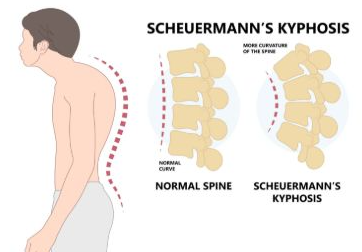
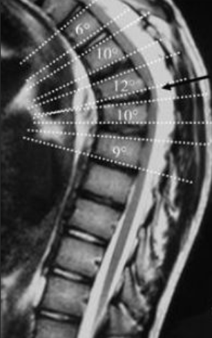
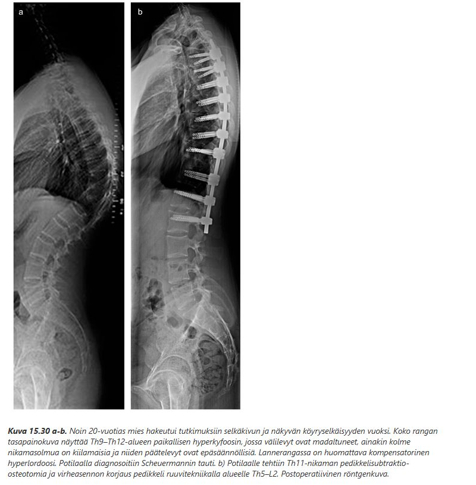
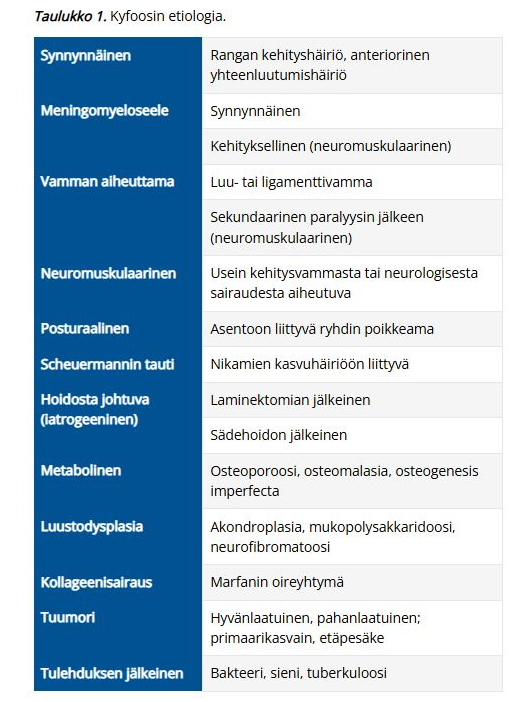

  

### Selitä lyhyesti - Meningomyeloseele {#Meningomyeloseele-selita}

  <button class="solution-button"
          data-label="Vastaus"
          data-hide-label="Piilota vastaus">
    Vastaus
  </button>
  

  
**Hermostoputken kaudaalisen (distaalisen) pään sulkeutumishäiriöt aiheuttavat selkärankahalkion (spina bifida).** Hermostoputken sulkeutumishäiriöt syntyvät raskausviikolla 3-4 (päivät 18-28) tapahtuvan neurulaation häiriöstä. Riskitekijöitä ovat mm. riittämätön foolihapon eli B9-vitamiinin saanti, perimä, äidin diabetes ja tietyt lääkkeet (esim. valproaatti ja karbamatsepiini)

Spina bidifa on siis yleistermi hermoston putken kaudaalipään sulkeutumishäiriöille; ovat selvästi yleisempiä kuin proksimaalipään sulkeutumishäiriöt. Spina bifida voidaan vielä jakaa eri tyyppeihin: 

<li>Spina bifida occulta (selkärangan piilohalkio) – Ainoastaan avoin nikamankaari ilman pullistumaa; yleensä oireeton. Havaitaan usein myöhään ulkoisesti kuoppana tai epänormaalina karvoituksena vaurion kohdalla vauvan selässä</li>
<li>Meningoseele (aivokalvotyrä) ja meningomyeloseele (MMC, aivokalvoselkäydintyrä) – aivokalvot **(tai meningomyeloseelessä aivokalvot ja selkäydin) työntyvät ulos pussiksi selkäydinkanavasta.** Meningoseele on usein suhteellisen oireeton, koska selkäydin ei ole vaurioitunut. _Meningomyeloseele on vaikeampi ja yleisempi; aiheuttaa tasosta riippuen eriasteisia alaraajahalvauksia, tuki- ja liikuntaelimistön virheasentoja sekä rakon ja suolen toimintahäiriöitä._ </li>
  <ul>
    <li>Yleensä nämä korjataan leikkauksella mahdollisimman pian syntymisen jälkeen.</li>
    <li>Hydrokefalus alkaa kehittyä tyypillisesti muutamia päiviä selkäaukileen sulun jälkeen, ja se hoidetaan yleensä aivokammiosta vatsaonteloon johdetulla (ventrikuloperitoneaalisella) suntilla tavallisimmin kolmen kuukauden ikään mennessä. Hydrokefalus kehittyy 85–90 %:lle lapsista, joilla on MMC. Hydrokefalus on sitä todennäköisempi, mitä ylempänä selkäytimen vaurio on. Yksi hydrokefalukseen johtavista syistä on Arnold–Chiarin tyypin II rakennepoikkeavuus, jossa aivojen takakuoppa on ahdas, pikkuaivot ovat dysplastiset ja ulottuvat niska-aukon (foramen magnum) alapuolelle, neljäs aivokammio on kapea ja ulottuu yleensä foramen magnumin tasolle ja aivorunko, ydinjatke sekä kaulaydin ovat siirtyneet alaspäin ja muodostavat noin 70 %:ssa tapauksista poikkeavan mutkan ydinjatkeen ja selkäytimen rajalle</li>
    <li>Meningomyeloseeleen liittyy myös monia muita poikkeavuuksia, kuten syringomyelia eli nestemäisten kystien muodostuminen selkäytimeen. Syringomyeliaa ilmenee itsekseenkin ja moniin muihinkin ongelmiin liittyen, ei ole spesifiä MMC:lle.</li>
  </ul>

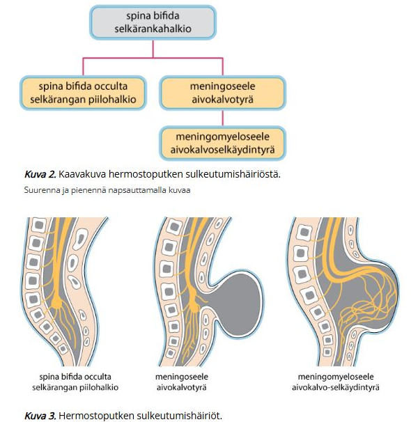
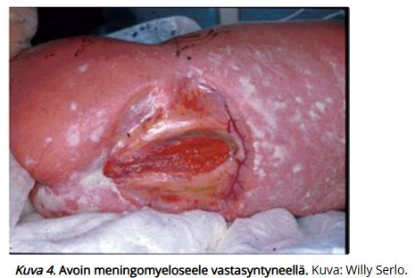
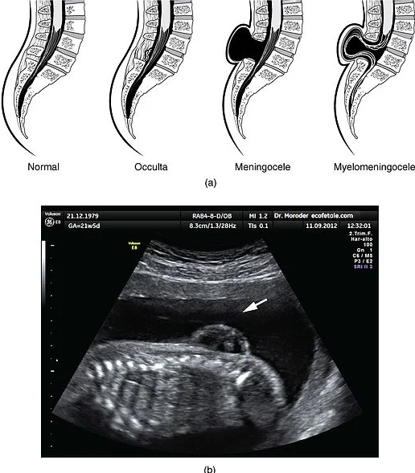

  

### Akuutti scrotum: yleisin aiheuttaja, erotusdg, miksi on kiire, mikä on blue dot sign? {#Akuutti-scrotum}

  <button class="solution-button"
          data-label="Vastaus"
          data-hide-label="Piilota vastaus">
    Vastaus
  </button>
  

      
Akuutin kiveskivun aiheuttajia ovat _kiveksen kiertymä, kiveslisäkkeen kiertymä, kuroutunut nivustyrä, trauma ja lisäkiveksen tulehdus._ **Yleisimmät kaksi näistä ovat kiveslisäkkeen kiertymä ja lisäkiveksen tulehdus, mutta kiveksen kiertymä on aina syytä pystyä poissulkemaan.** Syyltään epäselväksi jäänyt akuutti kivespussin kipu on kiireellisen leikkausarvion aihe -- pääasiassa juuri kiveskiertymän takia.

Kiveksen kiertymä esiintyy tyypillisimmillään vastasyntyneisyyskaudella tai murrosiän käynnistyttyä, mutta voi esiintyä missä iässä tahansa. Aiemmat samankaltaiset kiveskivut eivät sulje pois kiveksen kiertymää, sillä osalla potilaista esiintyy aiempia kipukohtauksia, jotka viittaavat mahdollisesti jaksoittaiseen kiveskiertymään. **Kiveskiertymä ilmenee yleensä äkillisenä kiveskipuna, arkoina ja ylös vetäytyneinä kiveksinä ja cremaster-heijasteen puuttumisena. Tehdään välittömästi päivystyslähete yksikköön jossa kirurginen eksploraatio mahdollista;** doppler-UÄ voi varmistaa torsion diagnoosin, mutta niiden suorittamiseen ei aina ole aikaa, sillä kiveksen kuolion vaara lisääntyy nopeasti ajan kuluessa. Kaikukuvaus voi myös osoittaa verenkiertoa kiveksessä vielä kiertymän alkuvaiheessa eikä ole kiertymän suhteen täysin luotettava tutkimus. Kiveskiertymä voi johtaa kiveksen hemorragiseen infarktiin. Ensiapuna kiveksen kiertymään voi manipulaatiolla yrittää purkaa torsiota kiertämällä kivestä ulospäin. Leikkaus tehdään kuitenkin mahdollisimman pian, viiden tunnin kuluessa, oireiden alkamisesta ja useimmiten kivespussin keskiviivaan tehdystä viillosta. Kiertynyt kives palautetaan oikeaan asentoon ja kiinnitetään. Koska taustalla oleva poikkeavuus saattaa olla molemminpuolinen, on tarkistettava ja kiinnitettävä myös toinen kives. Kuoliossa oleva kives poistetaan. Jos osoittautuukin, että kyseessä on kiveksen lisäkkeen kiertymä, riittää pelkkä lisäkkeen poisto eikä toista kivestä tarvitse paljastaa.
Joissakin tapauksissa kiveksen kiertymä menee ohi spontaanisti tai kivespussin tutkimuksen yhteydessä. Näissäkin tapauksissa kiinnitysleikkaus on myöhemmin aiheellinen.

---

**Kiveslisäkkeen kiertymässä kiveksen ja lisäkiveksen vieressä tuntuu aristava nappula, joka voi myös sinertää ihon läpi (blue dot sign).** Kiveslisäkkeen kiertymä ei välttämättä tarvitse leikkausta. Usein päädytään leikkaukseen epäselvän diagnostiikan takia ja toisaalta voimakkaat kivut paranevat nopeasti leikkauksella.

Lisäkiveksen tulehdus voi pienillä pojilla johtua virtsatietulehduksesta, mutta myös manipulaatiot kuten esim. katetrointi voi altistaa lisäkivestulehdukselle. Aina lisäkivestulehdukseen ei liity bakteeri-infektiota vaan kyseessä on niin sanottu aseptinen/steriili tulehdusreaktio. Useimmiten kuitenkin syy epäselväksi ja potilas saa usein antibioottikuurin, vaikka tulehduskipulääke voisi olla riittävä. Paikallinen kipu alkaa yleensä vähitellen voimistuvana, mutta joskus kipu voi alkaa akuutisti, jolloin erotusdiagnostiikka kiveksen kiertymän suhteen voi olla hankalaa. Turvotuksen lisääntyessä rakenteiden erottaminen toisistaan palpoiden voi olla mahdotonta, ja myöhemmässä vaiheessa palpaatiolöydös voi olla samankaltainen kuin kiveksen pahanlaatuisissa kasvaimissa. Sairaan puolen kivespussi on turvonnut, kuumottava ja punoittava. Yleisoireena kuumeilu on tavallista. Usein tulehdus leviää kivekseen (epididymo-orkiitti) ja voi aiheuttaa absessimuodostusta. Kivespussin ultraäänitutkimus selkeyttää diagnostiikkaa epäselvissä tapauksissa ja paljastaa mahdolliset leikkaushoitoa vaativat absessit. Positiiviset viljelytulokset virtsasta tukevat diagnoosia. Klamydia- ja gonokokkimääritykset on myös syytä tehdä (nuorilla ja aikuisilla klamydia- tai gonokokkitartunta on yleinen taudin aiheuttaja)

Idiopaattisessa kivespussin turvotuksessa molemmat kivespussit turpoavat, mutta tilaan ei liity voimakasta kipua. Idiopaattinen kivespussin tulehdus paranee itsestään.

  

### Alaraajojen pituusero: diagnoosit? tutkimukset? hoidot?

  <button class="solution-button"
          data-label="Vastaus"
          data-hide-label="Piilota vastaus">
    Vastaus
  </button>
  

Alaraajojen pituusero on suhteellisen yleistä (arviolta 60–90 prosentilla ihmisistä esiintyy alaraajoissa pituuseroa.) ja sen tutkimisessa kliinisesti voidaan käyttää jalkojen pituuden arviota makuuasennossa tai optimaalisempi tapa on **puupalikoilla** (asetetaan palikkoja jalan alle, kunnes lantio on suorassa) Alaraajojen pituuseroa voidaan tutkia ja määrittää myös radiologisesti potilaan seistessä. Tämä on tarkin tapa; yleisin radiologinen kuvantamismenetelmä on röntgenkuvaus, jossa mitataan sääri- ja reisiluiden pituudet erikseen sekä alaraajan pituus kokonaisuutena -- ei kylläkään aina tarvita.

On myös tärkeää arvioida kävelyä ja ryhtiä (etsi ontumista, kompensoivaa varvaskävelyä tai polven koukistusta, tutki selkä skolioosin varalta jalkojen pituuseron korjaamisen jälkeen). 

---

Lapsen ja nuoren alaraajojen pituuseron erotusdiagnostiikka jaetaan **rakenteellisiin ja toiminnallisiin syihin.**

Rakenteellisia ovat mm. idiopaattinen pituusero (mahdollisesti perinnöllisiä tekijöitä), kehityshäiriöt (esim. synnynnäinen lonkkaluksaatio, kampurajalka...) tai geneettisistä syistä toisen puolen ylikasvu. Hankinnaisia syitä ovat mm. traumat (kasvulevyyn ulottuva murtuma voi pysäyttää pituuskasvun tai esim. erityisesti reisiluun varren murtuma voi vastoin stimuloida luun pituuskasvua) ja infektiot (osteomyeliitti/septinen artriitti voivat vaurioittaa kasvulevyä).

Toiminnallisia syitä ovat mm. neuromuskulaariset sairaudet (esim. CP-vammasta johtuva toisen puolen spastisiteetti ja kontraktuurat), skolioosi (vaikea selkärangan ryhtivirhe voi vetää lantion vinoon) ja nivelongelmat, kuten länkisäärisyys ja pihtipolvisuus tai polvien yliojentuminen. 

---

Pituuseroon tulee kiinnittää huomioita viimeistään siinä vaiheessa, jos sen arvioidaan aiheuttavan ongelmia. Lapsilla alaraajojen pituusero muuten terveellä lapsella on yleistä ja hoito vaihtelee eron vaikeusasteen (ja tietysti aiheuttajan) mukaan: 

<li>Alle senttimetrin pituusero ei tavallisesti aiheuta oireita eikä vaadi hoitoa</li>
<li>1–2 cm:n pituuseron hoidoksi yleensä riittää ylimääräinen pohjallinen lyhyemmän jalan kengän sisään</li>
<li>Jos pituusero lähestyy kahta senttimetriä tai on sen yli, on lapsi syytä lähettää erikoissairaanhoidon arvioon</li>

  

### Laskeutumaton kives (testisretentio): mihin asti voi seurata, milloin lähete, mihin mennessä tulisi tehdä leikkaus {#Laskeutumaton-kives-lkir}

  <button class="solution-button"
          data-label="Vastaus"
          data-hide-label="Piilota vastaus">
    Vastaus
  </button>
  

**Voi seurata 6kk ikään asti, jolloin tehdään myös lähete. Leikkaus tehdään 12kk ikään mennessä.**

---

Kivekset laskeutuvat vatsaontelosta kivespussiin yleensä raskausviikoilla 28–32. Laskeutumaton kives todetaan noin 2 %:lla täysiaikaisista vastasyntyneistä ja keskosilla tila on huomattavasti yleisempi. 

Kivesten tutkimus kannattaa tehdä lämpimin sormin pojan maatessa selällään tai istuessa räätälinasennossa vanhemman sylissä. Ennen palpaatiota on tärkeää ihan visuaalisesti arvioida tilannetta. Esim. saltans saattaa näkyä ennen koskemista ja paeta sitten ylemmäs. Tutkimuksessa kiinnitetään huomiota myös kivespussien kehittymiseen ja symmetrisyyteen. Jos kivespussit ovat asymmetriset, niin se puhuu siitä, että laskeutumaton kives ole viettänyt paljoa aikaa toisessa kivespussissa. 

Kiveksen varovaisella "lypsämisellä" tai vetämisellä alaspäin on keskeinen rooli laskeutumattoman kiveksen diagnoosin tekemisessä

<li>Kun kives saadaan palpoitua, se pyritään lypsämään kivespussiin ja vetämään kivespussin pohjalle. Kiveksen koko arvioidaan ja sitä verrataan vastakkaiseen puoleen.</li>
<li>Jos kivestä ei saada lypsettyä kivespussiin, niin kyseessä on laskeutumaton/osittain laskeutumaton kives</li>
<li>Taas jos normaalikokoinen kives on vedettävissä kivespussin pohjalle ja se siellä pysyy ainakin hetken kiveksestä irti päästettäessä, niin kyseessä on todennäköisesti testis saltans eli hyppivä kives. Se johtuu ylivilkkaasta cremasterrefleksistä, joka on voimakkaimmillaan 1-9-vuotiailla. Kyseessä on kuitenkin fysiologinen ilmiö, joka ei vaadi erikoissairaanhoidon seurantaa vaan normaali neuvolan ja koululääkärin seuranta riittää. Kives vetäytyy helposti cremaster-lihaksen refleksin takia esimerkiksi kylmän, kivun tai jännityksen takia. Kivespussit ovat normaalisti kehittyneet ja symmetriset. Jos taas kives on pienentynyt, ei yllä täysin kivespussiin asti tai kivespussi on alikehittynyt, niin saattaa olla, että kyseessä ei ole pelkästään hyppivä kives enää kyseessä.</li>

---

**Jollei kives ole lypsettävissä kivespussiin tai palpaatiolla toista/molempia kiveksiä löydy kuuden kuukauden ikään mennessä, on lastenkirurgin konsultaatio aiheellinen.** Jos vastasyntyneellä ei löydy kumpaakaan kivestä ja penis on poikkeava, on syytä tehdä epäselvän sukupuolen selvittelyt.

<li>Laskeutumattoman kiveksen kasvu häiriintyy jo puolen vuoden iässä ja sukusolut alkavat kadota laskeutumattomasta kiveksestä viimeistään 1,5 vuoden iästä alkaen. Kives siis tarvitsee kivespussin hieman viileämmän ympäristön ja ei pärjää sen ulkopuolella. Laskeutumattomaan kivekseen liittyy myös lievästi kohonnut kivessyövän riski leikkauksen jälkeenkin. </li>
<li>**Laskeutumattoman kiveksen leikkaus suositellaan nykyisin tehtäväksi (6-)9–12 kk:n iässä.** Jos kives ei palpoidu, niin tehdään tähystysleikkaus, jolloin voidaan todeta kives vatsaontelon puolella ja tehdä tarvittavat toimenpiteet tai todeta kiveksen atrofioituneen. Jos taas kives on palpoitavissa nivuskanavassa tai nivusessa (high scrotal on yleisin lokaatio), niin voidaan tehdä paikallisesta viillosta leikkaus (haava nivuseen ja pussiin, irrotellaan ’kiinnikkeet’ funikkelin vierestä, tarvittaessa katkaistaan cubernaculum ja kiinnitetään kives ompeleilla pussiin) </li>
<li>Tähystysleikkaus tehdään yleensä kaksivaiheisesti eli ensin laparoskopiassa jos kives löytyy, katkaistaan ylhäältä tulevat kiristävät verisuonet ja odotetaan noin 3–6 kk, jotta alakautta tuleva verisuonitus vahvistuu (jos vedettäisiin suoraan paikoilleen, niin nykyinen verisuonitus ei yltäisi kivespussiin). Toisessa leikkauksessa, kives tuodaan vatsaontelosta useimmiten tähystinavusteisesti alas kivespussiin, minne se kiinnitetään ompelein. Jos ensimmäisessä leikkauksessa ei löydykään kivestä, saatetaan tähystyksessä kuitenkin todeta avoin reitti nivuskanavaan. Nivusen avoimessa tarkastelussa löytyy usein jo lähes täysin tuhoutunut pieni kiveksen jäänne, joka poistetaan. Vatsaontelossa sijaitsevista kiveksistä noin 15% ei kestä leikkausta vaan surkastuu. Leikkaus kuitenkin kannattaa, jotta siittiöille annetaan mahdollisuus kehittyä.</li>
<li>Päiväkirurgisen leikkauksen jälkeen lapsi toipuu sairaalaassa pari tuntia, ja vanhempi pääsee lapsen luokse, kun lapsi on riittävästi herännyt. Kotiutuminen on mahdollista, kun lapsi on juonut, syönyt ja virtsannut. Lapsilla käytetään sulavia ompeleita. Viikko tai pari toimenpiteen jälkeen tulee välttää saunaa ja kylpemistä. Leikattujen kivesten tarkistus on hyvä tehdä noin puoli vuotta tai vuosi leikkauksen jälkeen. Kivesten tunnustelu voi tapahtua esimerkiksi lääkärineuvolakäynnin yhteydessä. Jos pojalla on ollut molempien kivesten laskeutumattomuus ja kivekset ovat sijainneet vatsaontelossa, tulisi tarkastus tehdä vielä murrosiässä.</li>
<li>Leikkauksesta huolimatta laskeutumaton kives on usein aikuisenakin huomattavasti pienempi toiseen puoleen verrattuna. Jos vain toinen kives oli laskeutumaton, on potilaan hedelmällisyys aikuisena samankaltainen kuin muussakin väestössä. Molemmin puoleinen kiveksen laskeutumattomuus heikentää hedelmällisyyttä, varsinkin jos hoito viivästyy. Jos pojalla on toimimaton, pieni kives, se yleensä poistetaan ja voidaan haluttaessa korvata proteesilla kouluikäisenä tai mieluummin lähempänä aikuisikää.</li>

  

### N. 10v lapsen ranteen rtg. Mikä murtuma? Miten hoidat (kipsi, repositio + kipsi, leikkaussaliin)? {#Lapsen-ranteen-rtg-lkir}

Ei esimerkkikuvaa wikissä, mutta tekstin perusteella valitsin sopivan kuvan tähän tarkasteltavaksi. 

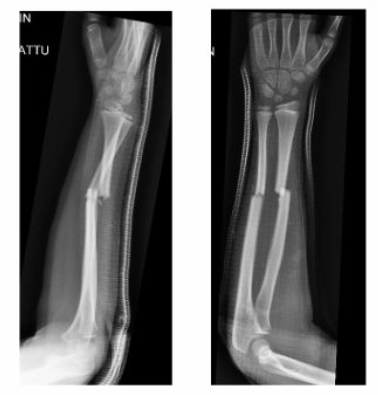

  <button class="solution-button"
          data-label="Vastaus"
          data-hide-label="Piilota vastaus">
    Vastaus
  </button>
  

Kyseessä antebracchiummurtuma eli sekä radius että ulna ovat murtuneet. Yleensä antebrachium-murtumalla viitataan ulnan ja radiuksen distaalipäiden samanaikaiseen murtumaan (vain PSU:n murtuma esim. Collesin murtuman yhteydessä ei yleensä lasketa antebrachium-murtumaksi). 

Värttinä- ja kyynärluun diafyysimurtumien repositiokriteerit ja leikkausindikaatiot riippuvat lapsen iästä. Remodellaatiopotentiaali on diafyysialueella vähäinen. 

**Yli 10-vuotiailla dislokoituneen kyynärvarren diafyysimurtuman hyvään asentoon luutuminen on syytä pääsääntöisesti varmistaa kiinnittämällä murtuma operatiivisesti,** useimmiten taipuisilla ydinnauloilla (yleisin). Leikkaushoito on perusteltua myös tätä nuoremmilla lapsilla jos suljettu asennon korjaus/retentio ei onnistu.

  

### Meckelin divertikkelin tyypillisin oire?

- a. Verenvuoto
- b. Ripuli
- c. Ummetus

  <button class="solution-button"
          data-label="Vastaus"
          data-hide-label="Piilota vastaus">
    Vastaus
  </button>
  

      a

Meckelin divertikkelin aiheuttamat ongelmat/oireet ovat yleisyysjärjestyksessä. 

<li>verenvuoto (meleena tai kirkas; voi olla anemisoiva); Meckelin divertikkeli on yleisin pienen lapsen maha-suolikanavan anemisoivan verenvuodon syy</li>
  <ul>
    <li>Divertikkelissä voi olla heterotrooppista mahalaukun (tai haiman) limakalvoa (kyseessä siis koristooma), jonka tuottamat hapot ärsyttää suolta ja voi aiheuttaa vuotavan haavauman</li>
  </ul>
<li>suolitukos (kiinnikkeet navan ja divertikkelin välillä)</li>
<li>divertikuliitti (oireilee appendisiittimäisesti)</li>

---

Meckelin divertikkeli on sikiöaikaisen omfalomesenteerisen tiehyen jäänne, joka sijaitsee suoliliepeen vastakkaisella puolella sykkyräsuolen alueella usein lähellä ileokekaalikulmaa. Kyseessä on ns. "todellinen" divertikkeli eli kaikki kolme suolen seinämän kerrosta pullistuvat. Vaikka esiintyvyys väestössä on noin 2 %, vain pieni osa näistä oireilee. 

Useimmiten Meckelin divertikkeli todetaan sattumalöydöksenä muun toimenpiteen yhteydessä. Jos etsitään divertikkeliä ihan oireiden perusteella, niin usein diagnostisesti (ja samalla hoidollisesti) tehdään laparoskopia. Aikaisemmin on käytetty isotooppikuvantamista (teknetium-99m-perteknetaatti-Meckel scan), mutta tästä on pitkälti huonon herkkyyden vuoksi luovuttu (herkkyys n. 70-85%, spesifisyys 90%)

Hoitona kirurginen resektio. Oireettomia ei tarvitse poistaa. 

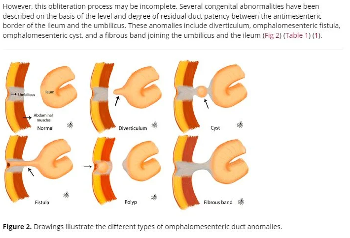
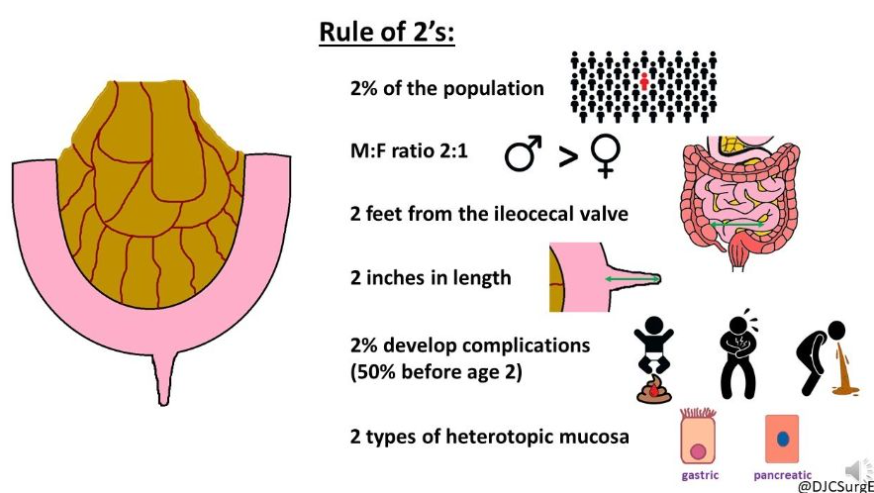

  

### 12-vuotias poika kaatunut jalkapalloillessa, liitteenä lonkan rtg, mikä diagnoosi ja hoito? {#12v-jalkapallo}

Ei esimerkkikuvaa, joten vaikeaa vastata järkevästi. Mikä olisi näistä pelkästään tehtävänannon anamneesin perusteella todennäköisin?

- a. Epifyseolyysi ja leikkausjonoon
- b. Septinen artriitti
- c. Perthesin tauti
- d. Lonkkamurtuma

  <button class="solution-button"
          data-label="Vastaus"
          data-hide-label="Piilota vastaus">
    Vastaus
  </button>
  

      a

**Pelkästään anamneesin ja iän perusteella todennäköisin vaihtoehto on epifyseolyysi (Slipped Capital Femoral Epiphysis / SCFE).** Tyypillinen potilas on (10-)11–16-vuotias lapsi, jonka kasvulevy (epifyysilinja) on tässä iässä hormonitoiminnan ja nopean kasvun seurauksena mekaanisesti heikommassa tilassa. Pojilla tauti on n. 2 kertaa yleisempi kuin tytöillä. Ylipaino on tärkein yksittäinen altistava tekijä, mutta epifyseolyysi voi myös liittyä endokrinologisiin sairauksiin, kuten kasvu- tai muiden aivolisäkehormonien sekä kilpirauhashormonin vajauksiin. Tarvittaessa konsultoidaan lastenlääkäriä. 

Oire voi alkaa akuutisti tai useammin vähitellen. Lieviä oireita esiintyy tavallisesti usean viikon tai kuukauden ajan. Epifyseolyysin tyyppioire on ontuminen, joka on usein jatkunut pitkään ennen hoitoon hakeutumista. Potilas pitää raajaa ulkokierrossa (tai tutkijan koukistaessa lonkkaa jalka kääntyy ulkokiertoon). Akuutissa taudinkuvassa kipu alkaa äkillisesti eikä potilas välttämättä pysty varaamaan raajalle ollenkaan. Potilas voi paikallistaa kivun nivuseen, reiteen tai polveen. Lonkan sisäkierto, loitonnus ja koukistus ovat rajoittuneet. 

_Diagnoosi perustuu rtg-kuvaan._ Siirtymä näkyy usein selvimmin Lauensteinin projektiossa (sivukuva), joka tulee aina ottaa. Etusuunnan kuvassa niin sanottu Kleinin linja (reisiluun kaulan yläreunaa pitkin vedetty linja) ei osu epifyysiin. Sivusuunnan kuvassa siirtymä näkyy selvemmin. Röntgenkuva tulee ottaa aina päivystyksellisesti, jos yli 10-vuotiaalla on ontumista aiheuttava lonkan tai polven kipu. 

**Tilanne vastaa reisiluun kaulan murtumaa: potilas lähetetään päivystyksellisesti lastenortopediseen yksikköön. Potilaalle annetaan kyynärsauvat ja häntä ohjeistetaan olemaan varaamatta kipeälle raajalle. Hoito on aina kirurginen: ensisijaisesti liukuman sulkeinen paikalleen asetus ja ruuvikiinnitys.**

---

b: Septinen infektio olisi useimmiten kuumeinen ja antaisi toksisen yleiskuvan. Vammatausta voisi kylläkin olla, mutta ei tällä anamneesilla herää vahvaa epäilyä. 

c: Perthesin tauti (reisiluun pään aseptinen nekroosi) on nuorempien lasten sairaus. Sen tyypillisin ilmenemisikä on 4–8 vuotta. Lisäksi oireilu on hiipivää ja pitkäaikaista, ei akuutti kaatumisen seuraus.

d: Varsinainen reisiluun kaulan murtuma vaatii suurienergiaisen vamman (esim. korkealta putoaminen tai liikenneonnettomuus) ja on harvinainen lapsella ilman taustasairautta. Lapsen lonkan urheiluvammassa useammin pettää nimenomaan kasvulevy, ei itse luu.

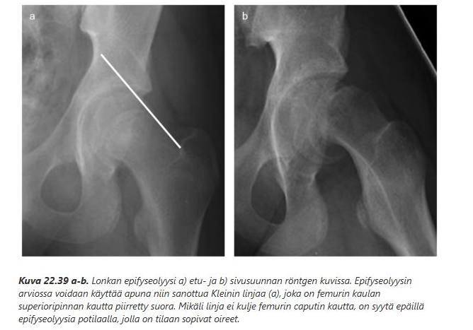
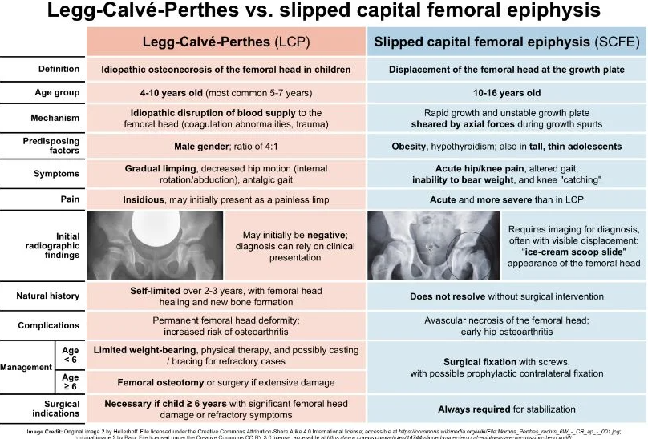
  

### Invaginaation hoito

- a. seuranta
- b. leikkaus
- c. ilmarepositio

  <button class="solution-button"
          data-label="Vastaus"
          data-hide-label="Piilota vastaus">
    Vastaus
  </button>
  

      c

Mikäli ei kliinisesti ole epäilyä suolen puhkeamisesta, pyritään ileokoolinen invaginaatio hoitamaan ensisijaisesti ilma- tai varjoainerepositiolla peräaukon kautta, jossa kevyellä paineella läpivalokontrollissa pyritään työntämään invaginoitunut suoli takaisin paikoilleen. "Air enema":ssa; ilmaa syötetään suolistoon (paine alle 100 cmH2O) ja sen tarkoituksena on työntää invaginoitunut suoli paikalleen; sama idea varjoaineella (varjoaine ainakin TYKS:ssä käytetympi). 

Mikäli tämä ei onnistu tai epäillään perforaatiota (peritoniittioireet), pitää invaginaatio hoitaa leikkauksella. Leikkauksessa useimmiten riittää käsin tehty suolen repositio eikä suolen osan poistoa tarvita yleensä, ellei todeta patologista syytä invaginaatiolle. 

Sairaalaseurantaa tarvitaan toimenpiteiden jälkeen siihen saakka, kunnes syöminen alkaa sujua ja kivut ovat hallinnassa. Perheitä on hyvä informoida noin 5 %:n uusimisriskistä.

---

Suolentuppeumassa (intussusseptio, invaginaatio) suolta työntyy toisen suolenosan sisään. Tyypillisesti tämä tapahtuu ileokekaalikulmassa, jolloin ohutsuolen loppuosa invaginoituu nousevaan paksusuoleen. 

**Invaginaation tyyppi-ikä on 6–18 kuukautta,** ja tauti on yleisempi pojilla kuin tytöillä. 

Suurin osa (yli 3/4) tapauksista on idiopaattisia, mutta toisinaan aiheuttajana voi olla poikkeava rakenne (lead point) kuten Meckelin divertikkeli tai polyyppi. 

<li>Patologista lead pointia tulisi epäillä etenkin, jos invaginaatio esiintyy tyyppi-ikää vanhemmalla lapsella (voi esiintyä myös aikuisilla ja n. 90% aikuisten tapauksista johtuu patologisesta "lead pointista", joka on yleisimmin tuumori).</li>
<li>Erityisesti viimeaikaisen virusinfektion (erityisesti rota- tai adenovirus / tai jopa rotavirusrokotteen (tämän riskin takia on ikäraja annolle eikä anneta rokotusohjelman ulkopuolella)) saaneella lapsella yleinen syy intussusseptiolle on lymfaattinen hyperplasia; Peyerin laikkujen kasvu vasteena virusinfektiolle -> toimii tarttumiskohtana intussusseptiolle </li>

---

_Suolentuppeuma aiheuttaa tyypillisesti erittäin voimakkaita, koliikkimaisia (aaltomaisia) vatsakipuja._ Taudin edetessä oirekuvaan liittyy usein myös oksentelua ja suolen limakalvovaurion aiheuttamana verilimaisia ulosteita. Jos lapsi antaa tutkia vatsaa, voi invaginaatiokohta tuntua vatsan palpaatiossa makkaramaisena kyhmynä. Tuseerattaessa ampulla on aina tyhjä ulosteesta, mutta siellä voi olla vähän ”punaviinimarjamehua”.

**Lapsi, jolla epäillään invaginaatiota, pitää lähettää välittömästi sairaalaan. Diagnoosi tehdään vatsan ultraäänitutkimuksella.**

  

### Lasten sormimurtumissa

- a. rotaatiovirheen korjaa kasvu
- b. UCL-vamma näkyy röntgenissä avulsiomurtumana
- c. Kynsipedin vammoja ei tarvitse korjata
- d. Kynsipedin vammoissa röntgentutkimus on turha

  <button class="solution-button"
          data-label="Vastaus"
          data-hide-label="Piilota vastaus">
    Vastaus
  </button>
  

      b

Lapsilla ja kasvuikäisillä nivelsiteet (kuten peukalon MCP-nivelen kyynärsyrjän puoleinen kollateraaliligamentti eli UCL, ulnar collateral ligament) ovat usein mekaanisesti vahvempia kuin niiden luukiinnityskohdat tai kasvulinjat. Tämän vuoksi ligamenttivamma ilmenee lapsella erittäin usein avulsiomurtumana, jossa kireälle joutunut nivelside repäisee pienen luupalan irti sormiluun tyvestä. Tämä irtonainen luukappale näkyy selvästi natiiviröntgenkuvassa.

Peukalon MP-nivelen UCL-vamma syntyy abdusoivan voiman vaikutuksesta eli tyypillisesti peukalon vääntyessä radiaalisesti esim. kaaduttaessa. Vanha nimi oli gamekeeper's thumb (Nimensä se sai skotlantilaisista metsästäjistä, jotka lopettivat jäniseläimet asettamalla niskan peukalonhankaan ja nykäisemällä eläimen jaloista, jolloin tapahtui äkillinen kranioservikaalinen dislokaatio. MCP I -niveleen kohdistui näin voimakas hyperabduktio). Nykyään huomattavasti yleisempi syntymekanismi on kaatuminen hiihtäessä, joten nimitykseksi on vakiintunut hiihtäjän peukalo eli "skier's thumb".

Hoidetaan neljän viikon ajan kipsillä, jos nivel on tukeva ja avulsiokappaleessa on alle 2 mm verran siirtymää.

a: Lasten luuston muovautuminen pystyy korjaamaan merkittäviäkin kulmavirheitä nivelen liiketasossa, mutta kasvu ei korjaa rotaatiovirhettä lainkaan. Rotaatiovirhe arvioidaan kliinisesti (laitetaan käsi nyrkkiin ja katsotaan risteävätkö sormet), koska se ei näy rtg-kuvasta. Pienikin rotaatiovirhe on aina reponoitava anatomisesti oikeaan asentoon.

c: Kynsipedin repeämät ja vauriot täytyy korjata ja ommella huolellisesti (ohulla resorboituvalla langalla), jotta kynsipeti paranee tasaisesti ja vältytään kynnen pysyviltä kasvuhäiriöiltä (esim. kynnen halkeaminen tai epämuodostuma).

d: Röntgentutkimus on ehdottoman tärkeä ja rutiininomainen, sillä kynsipedin repeämään liittyy erittäin usein kärkijäsenen (phalanx distalis) murtuma (esim. Seymouren murtuma, joka on vain lapsilla esiintyvä kärkijäsenen kasvulinjan myötä kulkeva murtuma, joka aiheuttaa kynsivamman ja kynsipedin rikkoutumisen. Kynsipedin vaurio tekee kärkijäsenen murtumasta avomurtuman, joka vaatii perusteellisen puhdistuksen, murtuman reponoinnin ja usein infektioprofylaksin (antibiootin). Kynnen tyvi palautetaan paikalleen kynsitaskuun sekä kiinnitetään sulavin ompelein (onnistuu etenkin isommilla lapsilla usein johtopuudutuksessa). Hoitamatta jättäminen (vammaa ei tunnisteta avomurtumaksi) voi johtaa osteomyeliittiin.

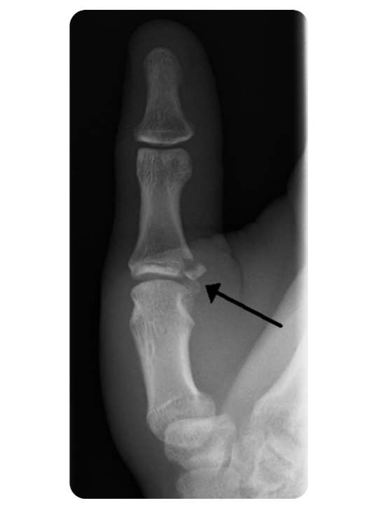
  

### 2 vuoden ikäinen aiemmin terve lapsi, verisiä ulosteita 2 päivän ajan, Hb ~70, todennäköisin syy? {#2v-verisia-ulosteita-anemia}

- a. Meckelin divertikkeli
- b. gastroenteriitti
- c. peräpukamat
- d. ulkus

  <button class="solution-button"
          data-label="Vastaus"
          data-hide-label="Piilota vastaus">
    Vastaus
  </button>
  

      a

Meckelin divertikkelin aiheuttamat ongelmat/oireet ovat yleisyysjärjestyksessä. 

<li>verenvuoto (meleena tai kirkas; voi olla anemisoiva); **Meckelin divertikkeli on yleisin pienen lapsen maha-suolikanavan anemisoivan verenvuodon syy**</li>
  <ul>
    <li>Divertikkelissä voi olla heterotrooppista mahalaukun (tai haiman) limakalvoa (kyseessä siis koristooma), jonka tuottamat hapot ärsyttää suolta ja voi aiheuttaa vuotavan haavauman</li>
  </ul>
<li>suolitukos (kiinnikkeet navan ja divertikkelin välillä)</li>
<li>divertikuliitti (oireilee appendisiittimäisesti)</li>

---

Meckelin divertikkeli on sikiöaikaisen omfalomesenteerisen tiehyen jäänne, joka sijaitsee suoliliepeen vastakkaisella puolella sykkyräsuolen alueella usein lähellä ileokekaalikulmaa. Kyseessä on ns. "todellinen" divertikkeli eli kaikki kolme suolen seinämän kerrosta pullistuvat. Vaikka esiintyvyys väestössä on noin 2 %, vain pieni osa näistä oireilee. 

Useimmiten Meckelin divertikkeli todetaan sattumalöydöksenä muun toimenpiteen yhteydessä. Jos etsitään divertikkeliä ihan oireiden perusteella, niin usein diagnostisesti (ja samalla hoidollisesti) tehdään laparoskopia. Aikaisemmin on käytetty isotooppikuvantamista (teknetium-99m-perteknetaatti-Meckel scan), mutta tästä on pitkälti huonon herkkyyden vuoksi luovuttu (herkkyys n. 70-85%, spesifisyys 90%)

Hoitona kirurginen resektio. Oireettomia ei tarvitse poistaa. 

---

b: Jos mukana olisi kuumetta, kovia vatsakipuja ja ripulia, niin voisi olla todennäköisempi. Pelkkä gastroenteriitti ei myöskään yleensä romahduta hemoglobiinia tasolle 70 g/l ilman vaikeaa yleistilan laskua tai toksisuutta.

c: Lapsilla ei oikein ilmene aikuistyyppisiä peräpukamia. Ne aiheuttaisivat aikuisillakin korkeintaan pientä, kirkasta veriviirua ulosteen pinnalla, eivät koskaan syvää anemiaa.

d: Ulkukset ovat äärimmäisen harvinaisia lapsilla. 

  

### Sääriluun distaalimurtuma, jalka retrocurvatum-asennossa, ei tuntoa jalkapohjassa, minkä hermon vaurio {#Saariluu-hermovamma}

- a. Suralis
- b. peroneus
- c. tibialis
- d. safenus

  <button class="solution-button"
          data-label="Vastaus"
          data-hide-label="Piilota vastaus">
    Vastaus
  </button>
  

      c

N. tibialis kulkee säären takaosassa ja laskeutuu nilkkaan sisäkehräsen takaa jalkapohjaan. Se vastaa koko jalkapohjan tunnosta.

Sääriluun distaalimurtuman retrocurvatum-virheasento (taaksepäin kulmautuminen) venyttää, puristaa tai leikkaa suoraan sen takana kulkevia anatomisia rakenteita, mistä seuraa jalkapohjan tuntopuutos.

---

a: N. suralis vastaa jalkaterän ja kantapään lateraalisivun tunnosta 

b: Jalkapöydän tunnosta vastaa pääasiassa n. peroneus superficialis ja 1. ja 2. varpaan välisen ihopoimun tunnosta vastaa n. peroneus profundus

d: N. saphenus vastaa tibian sisäkehräsen alueen tunnosta vastaa

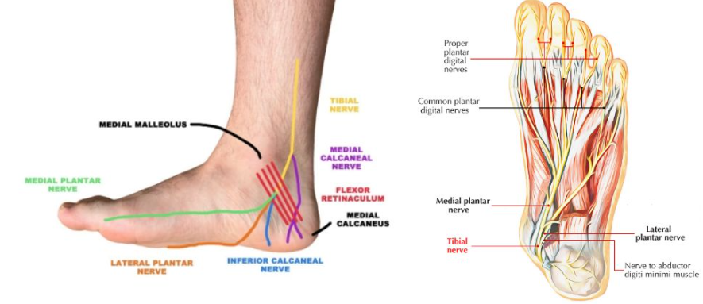
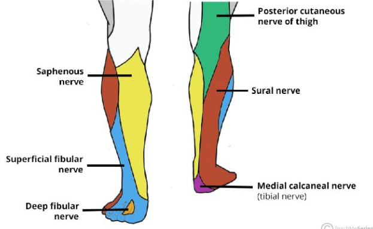
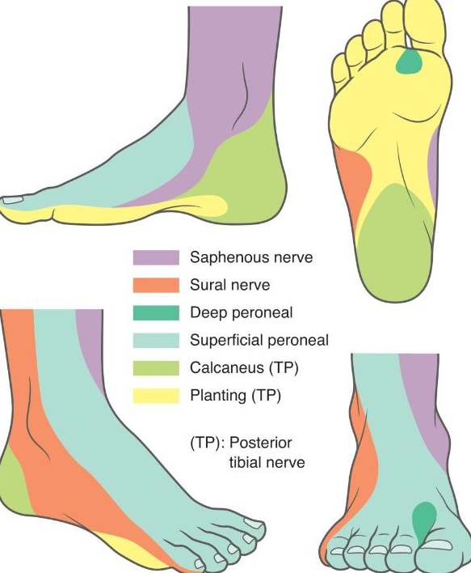

  

### Taapero nielaissut nappipariston 3h sitten, mitä teet päivystyksessä {#Taapero-nielaissut-nappipariston}

- a. kotiutus
- b. annat ruokaa ja juomaa ja katsot, pystyykö niellä
- c. ravinnotta ja seuranta
- d. röntgen ja ravinnotta

  <button class="solution-button"
          data-label="Vastaus"
          data-hide-label="Piilota vastaus">
    Vastaus
  </button>
  

      d

Etenkin pienet lapset nielevät usein vahingossa erilaisia vierasesineitä kuten kolikoita ja lelun osia. Vatsan puolelle ulottuvalla keuhkojen röntgenkuvalla pystytään varmistamaan, onko (röntgenpositiivinen) vierasesine ruokatorvessa vai jo pidemmällä ruuansulatuskanavassa.

Erityisen vaarallisia ovat nappiparistot ja (multippelit) magneetit:

**Jos niellyn esineen tiedetään tai epäillään olevan elohopeaparisto, lapsi lähetetään välittömästi sairaalaan, jossa otetaan kuva ja paristo poistetaan endoskooppisesti.**

<li>Erityisen vaarallisia ovat ns. kolikkoparistot, jotka kiinni juuttuessaan voivat syövyttää ruokatorven seinämän hyvinkin nopeasti.</li>
<li>Useimmat nappiparistot sisältävät alkalisen elektrolyytin, joka voi liuetessaan vaurioittaa limakalvoa. Elektrolyytti joutuu ruoansulatuskanavaan, jos patterin kuori rikkoutuu. Kuoren rikkoutuminen nopeutuu, jos patterissa on paljon virtaa jäljellä.</li>

---

Kaikki ruokatorveen kiinni jääneet esineet poistetaan lapsilta yleisanestesiassa tähystimen avulla enintään 24 tunnin kuluessa. **Varsinkin nappiparisto kuitenkin poistetaan välittömästi.** _Toimenpide tehdään, vaikka lapsi ei olisi ollut ravinnotta ennen anestesiaa._ Jos diagnoosiin päästään viiveellä, vasta yli 12 tuntia nielemisestä, tulee harkita jo kehittyneiden komplikaatioiden poissulkemiseksi kaulan ja rintakehän tietokonekerroskuvausta ennen tähystystä.

---

Jos vähäoireista lasta, jonka ruokatorvessa on (röntgenpositiivinen) vierasesine, on kuitenkin seurattu yön yli, kannattaa harkita uusintakuvausta ennen tähystystutkimusta sijainnin varmistamiseksi ja turhien toimenpiteiden välttämiseksi.

<li>Jos vierasesine on päässyt ruokatorven kautta mahalaukkuun, tulee se lähes varmasti myös luonnollista reittiään ulos (mukaan lukien terävät esineet kuten nuppineula).</li>
<li>Kookkaat esineet (alle 1-vuotiailla yli 2 cm, vanhemmilla lapsilla yli 3 cm) eivät välttämättä mahdu mahanportin läpi. Tähystyspoisto on tällöin perusteltu, ainakin jos vierasesine ei kulkeudu suoliston puolelle ja poistu ulosteen mukana 1–2 viikon kuluessa</li>
<li>Poikkeuksen edellä mainittuun hoitolinjaan muodostavat paristot ja magneetit (jos magneetteja on useampi kuin yksi). Multippelit magneetit voivat eri kohdissa suolta attraktoida suolta, jolloin suolenseinämä voi jäädä näiden väliin puristuksiin ja puhjeta. Natiivikuvia tulkitessa pitää muistaa, että yhteen liimautuneet magneetit saattavat näyttää vain yhdeltä vierasesineeltä. Jos varmuutta määrästä ei ole, hoito ja seuranta on toteutettava kuten niitä olisi useampi.</li>
<li>Paristojen suhteen tähystyksen tarve arvioidaan potilaskohtaisesti (kons lastenkirurgi)</li>

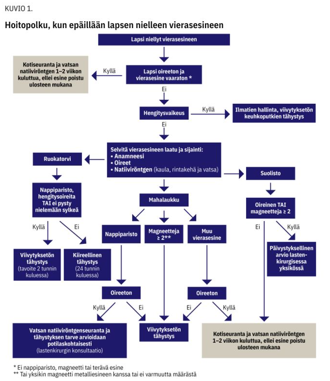
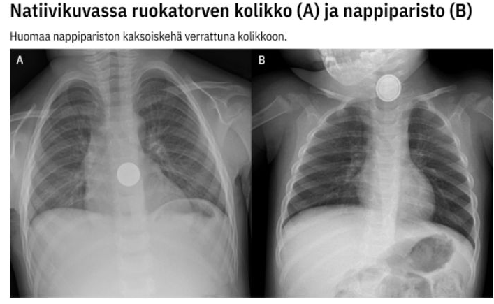

  

### Humerusmurtuma, miten varmistat käden verenkierron? {#Humerusmurtuma-verenkierto}

- a. Punakka käsi
- b. Avomurtuma josta suihkuaa verta
- c. Sormet liikkuu
- d. Sormissa tunto tallella

  <button class="solution-button"
          data-label="Vastaus"
          data-hide-label="Piilota vastaus">
    Vastaus
  </button>
  

      a

Koska murtuma sijaitsee aivan kyynärnivelen yläpuolella, siinä on riski, että luun terävät päät tai turvotus painavat alueen tärkeitä verisuonia tai hermoja. Varsinkin dislokoituneissa suprakondylaarisissa humerusmurtumissa voi tapahtua a. brachialiksen vaurio, jonka takia verenkiertostatus on aina tärkeää tehdä. Tyypin 3 murtumassa (dislokoitunut huomattavasti) jopa 10-20%:ssa tapauksista ei radialis-pulssi tunnu (pulseless hand).

**Kuitenkin käsi on tästä huolimatta yleensä lämmin ja pinkki (kollateraalivirtaus on hyvää), kapillaaritäyttö ok -> pink pulseless hand, jolloin verisuonikorjausta ei yleensä tarvita, hoito on murtuman nopea reduktio ja seuranta.** Jos kollateraalivirtaus ei kata perfuusiota ja käsi kylmä/kalpea/iskeeminen, niin verisuonikirurgia tarpeellista. Todellinen korjausta vaativa verisuonivamma vain 0.3%:lla. 

Jos pulssi ei palaudu heti reponoinnin jälkeen, niin voidaan seurantaa yleensä jatkaa; lähes aina palautuu (harvoin voidaan tehdä tarkempia kuvantamisia). 

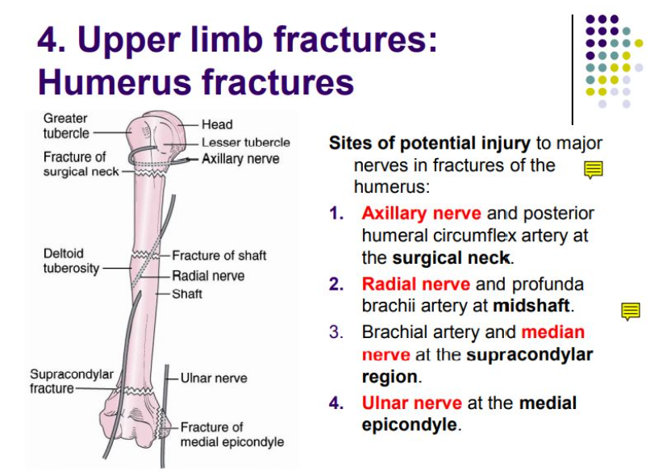
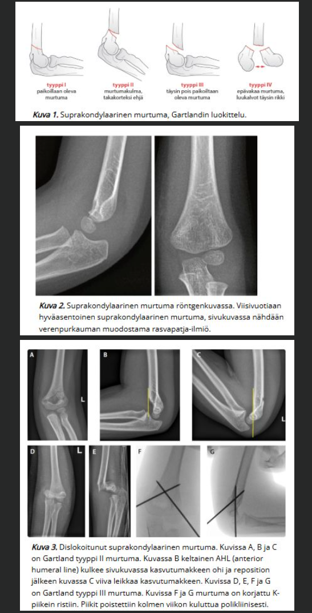
  

### Vatsakipu lapsella

- a. Vatsakipuisen lapsen tuseeraus ei yleensä tarpeellista
- b. Kiveksiä ei tarvitse tutkia
- c. Umpilisäkkeen tulehduksia ei ole alle 5-vuotiailla
- d. Umpilisäkkeen tulehduksessa crp ja leukosyytit yleensä normaalit

  <button class="solution-button"
          data-label="Vastaus"
          data-hide-label="Piilota vastaus">
    Vastaus
  </button>
  

      a

Tuseeraus aiheuttaa lapselle usein huomattavaa pelkoa ja kipua, ja se harvoin tuo juurikaan lisäarvoa diagnostiikkaan verrattuna muihin tutkimuksiin ja muuhun statukseen. 

b: Kivekset on aina tutkittava akutisti vatsakipuiselta pojalta, koska kyseessä voi olla kiveksen kiertymä (kivestorsio), joka vaatii välitöntä leikkaushoitoa.

c: Umpilisäkkeen tulehdus on alle 5-vuotiailla harvinaisempi kuin vanhemmilla lapsilla, mutta sitä esiintyy myös pikkulapsilla ja imeväisillä

d: Umpilisäkkeen tulehduksessa tulehdusarvot (CRP ja leukosyytit) ovat yleensä koholla, tosin CRP-pitoisuus ei suurene taudin alkuvaiheessa, joten se on harvoin suuri, jos oireiden kesto on alle vuorokauden. Myöhemmin n. 1/100 aikuispotilaasta leuk ja CRP ovat normaalit vaikka appendisiitti ja n. 6/100 lapsista leuk ja CRP normaalit, koska lasten immunologia hieman erilainen kuin aikuisilla. Appendisiittipotilaan suuri CRP-pitoisuus voi ennustaa komplisoitunutta appendisiittia, mutta pieni CRP-pitoisuus ei poissulje taudin mahdollisuutta. Mitään selvää erotusdiagnostista CRP:n raja-arvoa ei ole todettu.

  

### Päivystyksessä 1v aaltomaista kovaa vatsakipua ja verensekaista ulostetta. Vatsakipukohtausten välillä vointi hyvä. Mikä diagnoosi tod näk: {#1v-aaltomaista-kipua}

- a. ummetus
- b. invaginaatio
- c. umppari
- d. gastroenteriitti

  <button class="solution-button"
          data-label="Vastaus"
          data-hide-label="Piilota vastaus">
    Vastaus
  </button>
  

      b
      
Suolentuppeumassa (intussusseptio, invaginaatio) suolta työntyy toisen suolenosan sisään. Tyypillisesti tämä tapahtuu ileokekaalikulmassa, jolloin ohutsuolen loppuosa invaginoituu nousevaan paksusuoleen. 

**Invaginaation tyyppi-ikä on 6–18 kuukautta,** ja tauti on yleisempi pojilla kuin tytöillä. 

Suurin osa (yli 3/4) tapauksista on idiopaattisia, mutta toisinaan aiheuttajana voi olla poikkeava rakenne (lead point) kuten Meckelin divertikkeli tai polyyppi. 

**Suolentuppeuma aiheuttaa tyypillisesti erittäin voimakkaita, koliikkimaisia (aaltomaisia) vatsakipuja; kipujen välillä lapsi voi olla täysin normaali.** Taudin edetessä oirekuvaan liittyy usein myös oksentelua ja suolen limakalvovaurion aiheuttamana verilimaisia ulosteita. Jos lapsi antaa tutkia vatsaa, voi invaginaatiokohta tuntua vatsan palpaatiossa makkaramaisena kyhmynä. Tuseerattaessa ampulla on aina tyhjä ulosteesta, mutta siellä voi olla vähän ”punaviinimarjamehua”.

**Lapsi, jolla epäillään invaginaatiota, pitää lähettää välittömästi sairaalaan. Diagnoosi tehdään vatsan ultraäänitutkimuksella.**

Erotusdiagnostisia vaihtoehtoja ovat mm. akuutti gastroenteriitti (ei ole tyypillisesti syklistä kohtauskipua eikä ole palpoituvaa massaa tai UÄ-löydöstä), akuutti appendisiitti (harvinainen alle 2v, kipu on jatkuvaa ja paikantuu usein oikealle alavatsalle), kuroutunut nivustyrä (voi aiheuttaa oksentelua ja vatsakipua, mutta nivusalueelta palpoituu arka patti) ja volvulus (äkillinen, henkeä uhkaava suolitukos ja sappimainen oksentelu hyvin pienellä imeväisellä; potilas menee nopeasti huonokuntoiseksi). 

Mikäli ei kliinisesti ole epäilyä suolen puhkeamisesta, pyritään ileokoolinen invaginaatio **hoitamaan ensisijaisesti ilma- tai varjoainerepositiolla peräaukon kautta,** jossa kevyellä paineella läpivalokontrollissa pyritään työntämään invaginoitunut suoli takaisin paikoilleen. "Air enema":ssa; ilmaa syötetään suolistoon (paine alle 100 cmH2O) ja sen tarkoituksena on työntää invaginoitunut suoli paikalleen; sama idea varjoaineella (varjoaine ainakin TYKS:ssä käytetympi). 

Mikäli tämä ei onnistu tai epäillään perforaatiota (peritoniittioireet), pitää invaginaatio hoitaa leikkauksella. Leikkauksessa useimmiten riittää käsin tehty suolen repositio eikä suolen osan poistoa tarvita yleensä, ellei todeta patologista syytä invaginaatiolle. 

Sairaalaseurantaa tarvitaan toimenpiteiden jälkeen siihen saakka, kunnes syöminen alkaa sujua ja kivut ovat hallinnassa. Perheitä on hyvä informoida noin 5 %:n uusimisriskistä.

a: Voi aiheuttaa vatsakipua ja kovan ulosteen mekaanisesti aiheuttaman anaalifissuuran vuoksi pienen verenviirun ulosteen pinnalle, mutta ei selitä aaltomaista rajuoireista kohtauskipua ja verensekaista ulostetta

c: Appendisiitissa kipu on tyypillisesti jatkuvaa ja pahenevaa, ei aaltomaista. Lapsella on usein kuumetta. Lisäksi appendisiitti on 1-vuotiaalla harvinainen.

d: Aiheuttaa ripulia, oksentelua ja kuumetta. Kipu ei noudata näin selkeää aaltomaista kaavaa, jossa lapsi on välillä täysin oireeton.
  

### Kiveskipu

- a. Testistorsiota ei voi olla vastasyntyneellä
- b. Kiveskivun yleisimmät aiheuttajat ovat epididymiitti ja appendix testis -torsio
- c. Torsion leikkauspäätös vaatii aina kuvantamisen
- d. Kiveskivussa usein ei ole kyse mistään vakavasta

  <button class="solution-button"
          data-label="Vastaus"
          data-hide-label="Piilota vastaus">
    Vastaus
  </button>
  

      b
      
Lapsilla ja nuorilla akuutin kiveskivun (akuutti skrotum) kaksi yleisintä syytä ovat kiveksen lisäkkeen kiertymä (appendix testis -torsio, noin 40–60 % tapauksista) ja kiveslisäkkeen tulehdus (epididymiitti, noin 30–40 % tapauksista). Varsinainen kiveksen kiertymä (testistorsio) selittää vain noin 10–15 % akuuteista kiveskivuista, vaikka se on leikkaushoidon kannalta kriittisin.

a: Testistorsio voi tapahtua periaatteessa jo kohdussa tai heti synnytyksen jälkeen.

c: Testistorsio on periaatteessa kliininen diagnoosi ja aina ei edes ole aikaa kuvantamiselle. Jos epäily kiveskiertymästä on vahva, potilas pitää viedä välittömästi leikkaussaliin ilman viivyttäviä kuvantamistutkimuksia (ensisijaisesti UÄ).

d: Akuuttiin kiveskipuun suhtaudutaan aina mahdollisena leikkaushätätilanteena, kunnes kiveskiertymä on varmuudella suljettu pois
  

### Antebrachiumin diafyysimurtuman kipsityyppi, missä ei toteudu kolmen pisteen periaate {#Antebrachium-kolmen-pisteen}

- a. Sirkulaarinen kulmakipsi
- b. Kyynärvarren dorsaalinen kipsilasta volaarisella tuella
- c. Dorsaalinen kulmakipsilasta

  <button class="solution-button"
          data-label="Vastaus"
          data-hide-label="Piilota vastaus">
    Vastaus
  </button>
  

      b

Kolmen pisteen tuen periaate on murtumien kipsauksessa ja lastoituksessa käytettävä biomekaaninen periaate, jonka mukaan murtuma tulisi tukea kolmella voimalla eri pisteissä: murtumakohdassa, murtumakohdasta distaalisesti ja murtumakohdasta proksimaalisesti.

Antebrachiumin (kyynärvarren) diafyysi- eli varren murtumissa lihasvoimat pyrkivät kiertämään ja taivuttamaan murtumakappaleita. Murtuman pysyvyyden takaamiseksi tarvitaan aina kulmakipsi (kipsi, joka ulottuu kyynärnivelen yli olkavarteen saakka), jotta kyynärvarren kiertoliike (pro-supinaatio) estetään ja kolmen pisteen periaate (murtumakohdan tuenta vastakkaiselta puolelta sekä murtuman proksimaalis- ja distaalipuolelta saman puolen tuennalla) toteutuu mekaanisesti. Pelkkä kyynärvarren lyhyt lasta ei lukitse kyynärniveltä eikä pysty muodostamaan tarvittavaa kolmen pisteen biomekaanista tukea diafyysimurtumassa.     

  

### Imeväisen (tai vastasyntyneen) nivustyrä kuroutuu helpommin kuin lapsella? 

- a. Kyllä
- b. Ei 

  <button class="solution-button"
          data-label="Vastaus"
          data-hide-label="Piilota vastaus">
    Vastaus
  </button>
  

      a (Kyllä)

Lapsilla nivustyrän kuroutumisriski on merkittävästi korkeampi kuin aikuisilla; suurin riski on alle 1-vuotiailla. 

Lapsilla rutiinisti kaikki nivustyrät aina hoidetaan operatiivisesti, vaikka olisivatkin oireettomia. Leikkaus suoritetaan pääasiassa kureutumisriskin takia. Aikuisilla voisi sanoa, että nivustyrät leikataan myös hyvin usein, mutta oireettomia nivustyriä ei välttämättä tarvitse leikata, mutta inkarseraatioriskistä tulee informoida ja ohjata potilas palaamaan hoitoon nopeasti, jos ilmenee huomattavaa kipua tai tyrä ei reponoidu

Jos tyrä kuroutuu eikä ole painettavissa pois, kun lapsi on pitkällään ja rauhoittunut, lapsi pitää viedä päivystyksenä lääkäriin. Kuroutunut tyrä saadaan yleensä painettua takaisin. Toisella kädellä tuetaan nivuskanavan ulkosuulta, ja toisella kädellä painetaan tyrää tasaisella kompressiolla nivuskanavan suuntaisesti vatsaonteloon päin. Painamisen pitää olla tasainen ja riittävän pitkä. Kokenut reponoitsija saa lähes aina nivustyrän reponoitua. Jos on epävarma tyrän reponoitumisesta, lapsi pitää lähettää sairaalaan. Kun kuroutunut tyrä on saatu reponoitua, odotetaan turvotuksen laskeutumista 1–2 vuorokautta, jonka jälkeen tyrä leikataan.

  

### Meckelin divertikkelin sijainti suolistossa

Ei vaihtoehtoja wikissä, mutta yritä vastata ilman. 

  <button class="solution-button"
          data-label="Vastaus"
          data-hide-label="Piilota vastaus">
    Vastaus
  </button>
  

      

Meckelin divertikkeli on sikiöaikaisen omfalomesenteerisen tiehyen jäänne, joka sijaitsee suoliliepeen vastakkaisella puolella sykkyräsuolen alueella usein **lähellä ileokekaalikulmaa (keskiarvolta n. 60cm siitä proksimaalisesti).** Kyseessä on ns. "todellinen" divertikkeli eli kaikki kolme suolen seinämän kerrosta pullistuvat. Vaikka esiintyvyys väestössä on noin 2 %, vain pieni osa näistä oireilee. 

---

Meckelin divertikkelin aiheuttamat ongelmat/oireet ovat yleisyysjärjestyksessä. 

<li>verenvuoto (meleena tai kirkas; voi olla anemisoiva); **Meckelin divertikkeli on yleisin pienen lapsen maha-suolikanavan anemisoivan verenvuodon syy**</li>
  <ul>
    <li>Divertikkelissä voi olla heterotrooppista mahalaukun (tai haiman) limakalvoa (kyseessä siis koristooma), jonka tuottamat hapot ärsyttää suolta ja voi aiheuttaa vuotavan haavauman</li>
  </ul>
<li>suolitukos (kiinnikkeet navan ja divertikkelin välillä)</li>
<li>divertikuliitti (oireilee appendisiittimäisesti)</li>

---

Meckelin divertikkeli on sikiöaikaisen omfalomesenteerisen tiehyen jäänne, joka sijaitsee suoliliepeen vastakkaisella puolella sykkyräsuolen alueella usein lähellä ileokekaalikulmaa. Kyseessä on ns. "todellinen" divertikkeli eli kaikki kolme suolen seinämän kerrosta pullistuvat. Vaikka esiintyvyys väestössä on noin 2 %, vain pieni osa näistä oireilee. 

Useimmiten Meckelin divertikkeli todetaan sattumalöydöksenä muun toimenpiteen yhteydessä. Jos etsitään divertikkeliä ihan oireiden perusteella, niin usein diagnostisesti (ja samalla hoidollisesti) tehdään laparoskopia. Aikaisemmin on käytetty isotooppikuvantamista (teknetium-99m-perteknetaatti-Meckel scan), mutta tästä on pitkälti huonon herkkyyden vuoksi luovuttu (herkkyys n. 70-85%, spesifisyys 90%)

Hoitona kirurginen resektio. Oireettomia ei tarvitse poistaa. 

---

  

### 3kk itkuinen lapsi päivystykseen. Pullotus kivespussin yläosassa nivuskanavan seudussa. Palpoiden kiinteä ja aristava. Onko 

- a. kureutunut nivustyrä
- b. kureutumaton nivustyrä
- c. paise

  <button class="solution-button"
          data-label="Vastaus"
          data-hide-label="Piilota vastaus">
    Vastaus
  </button>
  

      a

Imeväisen nivuskanavan seutuun ilmaantuva kiinteä, aristava ja palpoitaessa reponoitumaton patti, johon liittyy lapsen kova itkuisuus ja kipuoireilu, on oppikirjamainen kureutuneen nivustyrän (hernia inguinalis incarcerata) kliininen kuva. Tyrän pussiin painunut suolenosa on jäänyt puristuksiin ahtaaseen nivuskanavaan.

Välitön hoito on tehokas kipulääkitys ja manuaalinen repositioyritys. Jos ei onnistu (kirurginkaan toimesta) tai epäillään jo suolen nekroosia, potilas lähetetään välittömästi päivystysleikkaukseen. 

b: Kureutumaton (vapaasti reponoituva) nivustyrä on palpoitaessa pehmeä, yleensä kivuton ja menee helposti takaisin vatsaonteloon kevyellä painamisella tai lapsen rauhoittuessa

c: Pehmytkudospaise aiheuttaisi paikallisia tulehdusoireita (ihon kuumotus, punoitus ja mahdollinen fluktuaatio). Lisäksi pelkkä paise nivuskanavan/kivespussin yläosan alueella ilman edeltävää haavaa tai ihoinfektiota on pikkulapsella harvinainen. 
  

## 2024 

### Selitä lyhyesti: Testis saltans {#Testis-saltans-selita}

  <button class="solution-button"
          data-label="Vastaus"
          data-hide-label="Piilota vastaus">
    Vastaus
  </button>
  

      
Hyppivä kives (testis saltans) on erittäin tavallinen leikki-ikäisillä ja tarkoittaa, että yliaktiivisen kremasterrefleksin takia kivekset sijaitsevat vain ajoittain kivespussissa. 
 

---

Kiveksen varovaisella "lypsämisellä" tai vetämisellä alaspäin on keskeinen rooli laskeutumattoman kiveksen diagnoosin tekemisessä

<li>Kun kives saadaan palpoitua, se pyritään lypsämään kivespussiin ja vetämään kivespussin pohjalle. Kiveksen koko arvioidaan ja sitä verrataan vastakkaiseen puoleen.</li>
<li>Jos kivestä ei saada lypsettyä kivespussiin, niin kyseessä on laskeutumaton/osittain laskeutumaton kives</li>
<li>Taas jos normaalikokoinen kives on vedettävissä kivespussin pohjalle ja se siellä pysyy ainakin hetken kiveksestä irti päästettäessä, niin kyseessä on todennäköisesti testis saltans eli hyppivä kives. Se johtuu ylivilkkaasta cremasterrefleksistä, joka on voimakkaimmillaan 1-9-vuotiailla. Kyseessä on kuitenkin fysiologinen ilmiö, joka **ei vaadi erikoissairaanhoidon seurantaa vaan normaali neuvolan ja koululääkärin seuranta riittää.** Kives vetäytyy helposti cremaster-lihaksen refleksin takia esimerkiksi kylmän, kivun tai jännityksen takia. Kivespussit ovat normaalisti kehittyneet ja symmetriset. Jos taas kives on pienentynyt, ei yllä täysin kivespussiin asti tai kivespussi on alikehittynyt, niin saattaa olla, että kyseessä ei ole pelkästään hyppivä kives enää kyseessä.</li>

---

**Jollei kives ole lypsettävissä kivespussiin tai palpaatiolla toista/molempia kiveksiä löydy kuuden kuukauden ikään mennessä, on lastenkirurgin konsultaatio aiheellinen.** Jos vastasyntyneellä ei löydy kumpaakaan kivestä ja penis on poikkeava, on syytä tehdä epäselvän sukupuolen selvittelyt.

<li>Laskeutumattoman kiveksen kasvu häiriintyy jo puolen vuoden iässä ja sukusolut alkavat kadota laskeutumattomasta kiveksestä viimeistään 1,5 vuoden iästä alkaen. Kives siis tarvitsee kivespussin hieman viileämmän ympäristön ja ei pärjää sen ulkopuolella. Laskeutumattomaan kivekseen liittyy myös lievästi kohonnut kivessyövän riski leikkauksen jälkeenkin. </li>
<li>**Laskeutumattoman kiveksen leikkaus suositellaan nykyisin tehtäväksi (6-)9–12 kk:n iässä.** Jos kives ei palpoidu, niin tehdään tähystysleikkaus, jolloin voidaan todeta kives vatsaontelon puolella ja tehdä tarvittavat toimenpiteet tai todeta kiveksen atrofioituneen. Jos taas kives on palpoitavissa nivuskanavassa tai nivusessa (high scrotal on yleisin lokaatio), niin voidaan tehdä paikallisesta viillosta leikkaus (haava nivuseen ja pussiin, irrotellaan ’kiinnikkeet’ funikkelin vierestä, tarvittaessa katkaistaan cubernaculum ja kiinnitetään kives ompeleilla pussiin) </li>
<li>Tähystysleikkaus tehdään yleensä kaksivaiheisesti eli ensin laparoskopiassa jos kives löytyy, katkaistaan ylhäältä tulevat kiristävät verisuonet ja odotetaan noin 3–6 kk, jotta alakautta tuleva verisuonitus vahvistuu (jos vedettäisiin suoraan paikoilleen, niin nykyinen verisuonitus ei yltäisi kivespussiin). Toisessa leikkauksessa, kives tuodaan vatsaontelosta useimmiten tähystinavusteisesti alas kivespussiin, minne se kiinnitetään ompelein. Jos ensimmäisessä leikkauksessa ei löydykään kivestä, saatetaan tähystyksessä kuitenkin todeta avoin reitti nivuskanavaan. Nivusen avoimessa tarkastelussa löytyy usein jo lähes täysin tuhoutunut pieni kiveksen jäänne, joka poistetaan. Vatsaontelossa sijaitsevista kiveksistä noin 15% ei kestä leikkausta vaan surkastuu. Leikkaus kuitenkin kannattaa, jotta siittiöille annetaan mahdollisuus kehittyä.</li>
<li>Päiväkirurgisen leikkauksen jälkeen lapsi toipuu sairaalaassa pari tuntia, ja vanhempi pääsee lapsen luokse, kun lapsi on riittävästi herännyt. Kotiutuminen on mahdollista, kun lapsi on juonut, syönyt ja virtsannut. Lapsilla käytetään sulavia ompeleita. Viikko tai pari toimenpiteen jälkeen tulee välttää saunaa ja kylpemistä. Leikattujen kivesten tarkistus on hyvä tehdä noin puoli vuotta tai vuosi leikkauksen jälkeen. Kivesten tunnustelu voi tapahtua esimerkiksi lääkärineuvolakäynnin yhteydessä. Jos pojalla on ollut molempien kivesten laskeutumattomuus ja kivekset ovat sijainneet vatsaontelossa, tulisi tarkastus tehdä vielä murrosiässä.</li>
<li>Leikkauksesta huolimatta laskeutumaton kives on usein aikuisenakin huomattavasti pienempi toiseen puoleen verrattuna. Jos vain toinen kives oli laskeutumaton, on potilaan hedelmällisyys aikuisena samankaltainen kuin muussakin väestössä. Molemmin puoleinen kiveksen laskeutumattomuus heikentää hedelmällisyyttä, varsinkin jos hoito viivästyy. Jos pojalla on toimimaton, pieni kives, se yleensä poistetaan ja voidaan haluttaessa korvata proteesilla kouluikäisenä tai mieluummin lähempänä aikuisikää.</li>

  

### Selitä lyhyesti: Gastroskiisi {#Gastroskiisi-selita}

  <button class="solution-button"
          data-label="Vastaus"
          data-hide-label="Piilota vastaus">
    Vastaus
  </button>
  

**Gastroskiisi (vatsahalkio) on synnynnäinen rakennehäiriö, jossa sisäelimet työntyvät ulos vatsaontelosta anteriorisesti ilman suojaavaa kalvopussia (vrt. omfaloseelessä (napanuoratyrä) taas työntyvää suolistoa ympäröi kalvopussi).** Gastroskiisissa suolisto on raskauden aikana vapaasti kosketuksissa lapsiveden kanssa aiheuttaen usein suolen turvotusta ja joskus katteisuutta.

---

Gastroskiisin tarkkaa syytä ei tunneta, mutta tunnettuja riskitekijöitä ovat äidin nuori ikä ja tupakointi. Toisaalta äidin lihavuus tai ylipaino vaikuttavat suojaavan gastroskiisilta. Esiintyvyys Suomessa on noin 1:5 000 elävänä syntynyttä. Yli 90 % tapauksista havaitaan jo raskauden aikana, mikä helpottaa synnytysten keskittämistä lastenkirurgiseen yksikköön.

Gastroskiisiin liittyy harvoin muita synnynnäisiä kehityspoikkeamia, mutta suoliatresiaa esiintyy noin 10–20 %:lla, ja pienellä osalla esiintyy sydämen rakennepoikkeavuuksia, joten sydämen ultraäänitutkimus tulee tehdä ensimmäisen hoitojakson aikana. Omfaloseele on useammin yhteydessä muihin epämuodostumiin -> huonompi ennuste (isoloituna kuitenkin hyvä ennuste, kuten gastroskiisissakin) 

---

Normaali alatiesynnytys on usein mahdollista. Syntymän jälkeen suoli ja vatsan alue peitetään muovikelmulla lämpö- ja nestehukan minimimoimiseksi ja lapsi siirretään vastasyntyneiden teho-osastolle odottamaan toimenpidettä nenä-mahaletkun kanssa.

Toimenpiteessä suoli pyritään palauttamaan vatsaontelon puolelle ja faskiadefekti suljetaan joko ompelein tai teippaamalla napanuora defektin yli sen peitoksi. Jos suolistoa ei saada takaisin vatsaonteloon ilman merkittävää vatsaontelon paineen nousua, asetetaan faskia-aukkoon silikonisiilo. Siiloon jätetty suolisto pyritään reponoimaan painovoiman ja vaiheittaisen puristamisen keinoin tähdäten defektin sulkuun, joko suoraan tai paikkamateriaalia hyödyntäen, muutaman päivän sisään. Mahdollinen suoliatresia hoidetaan vasta vatsanpeitteiden sulun jälkeen.

---

Gastroskiisin ennuste on pääsääntöisesti hyvä ja imeväiskuolleisuus on alle 10 %. Etenkin alkuvaiheissa gastroskiisiin liittyy usein merkittäviä suolen motiliteettivaikeuksia, ja sen vuoksi pääsy täyteen enteraaliseen ravitsemukseen kestää usein viikoista jopa kuukausiin. Tämän vuoksi keskuslaskimoyhteys asetetaan käytännössä rutiinisti kaikille gastroskiisin sulun yhteydessä. Myöhemmällä iällä kiinnikkeiden vuoksi toimenpiteitä tarvitsee vain noin viisi prosenttia.

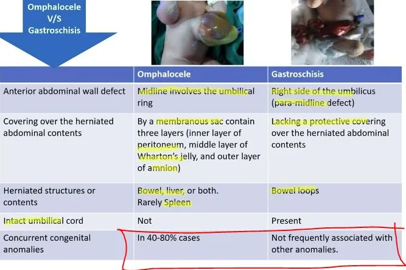
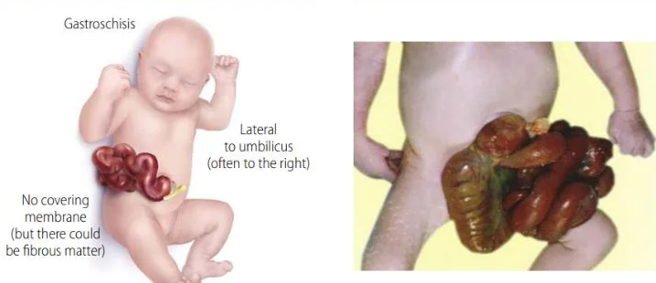
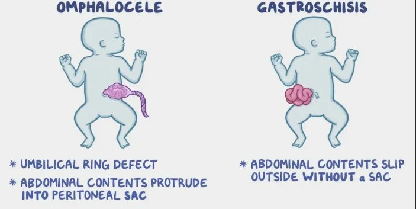
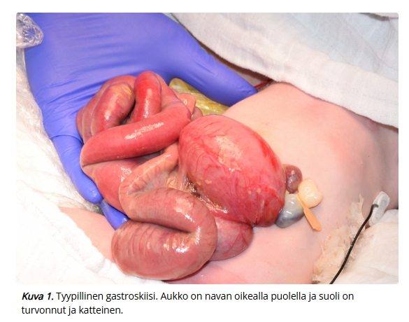
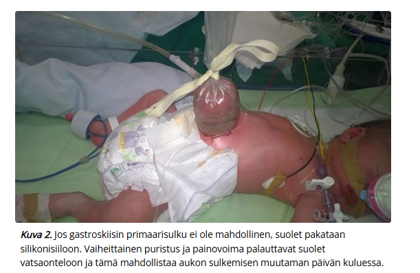

  

### Lapsen lonkkaluksaation tutkiminen ja hoidot

  <button class="solution-button"
          data-label="Vastaus"
          data-hide-label="Piilota vastaus">
    Vastaus
  </button>
  

Tarkoitetaan todennäköisesti epätukevaa lonkkaniveltä vauvalla eli synnynnäistä lonkkaluksaatio (Developmental dysplasia of the hip, DDH). Vastasyntyneen kotiinlähtö- ja neuvolalääkärin tarkastuksissa 2 vuoteen saakka tutkitaan lonkkastatus arvioimalla Galeazzin oiretta ja täyden abduktion symmetrisyyttä sekä tutkimalla lonkkanivelten tukevuus Ortolanin testillä ja Barlow'n testillä. 

---

Aluksi silmämääräisesti arvioidaan, näyttävätkö lapsen raajat ja selkä normaaleilta tai onko niissä virheasentoja, pituuseroa tai muuta epäsymmetriaa

Sitten lonkat tutkitaan vauvan maatessa selällään reidet 90°:n koukistuksessa, jolloin arvioidaan, ovatko lapsen polvet eri tasolla (Galeazzin oire) - kokonaan luksaatiossa olevan lonkan vuoksi polvi on tervettä puolta alempana. 

Seuraavaksi rekisteröidään lonkkien loitonnus asteina (rajoittunut tai epäsymmetrinen loitonnus voi viitata lonkkaluksaatioon).

Lonkkanivelten tukevuus tutkitaan Ortolanin ja Barlow'n testeillä

<li>Ortolanin testin tulos on positiivinen, kun taaksepäin luksoitunut reisiluun pää menee lonkkaa loitontaessa ja anteriorisesti hieman kammeten paikalleen lonkkamaljaan, mikä tuntuu selvänä lonksahduksena. </li>
<li>Barlow'n testin tulos on positiivinen, kun lonkkamaljassa sijaitsevan reisiluun pää saadaan painettua kevyellä voimalla pois paikoiltaan -- aluksi lonkkaa adduktoidaan ja sitten painetaan posteriorisesti. Tämän jälkeen lonkkanivel menee takaisin paikalleen Ortolanin testissä. Monet kuitenkin suosittelevat, että ensin tehdään Ortolanin koe ja tarkistetaan onko lonkka jo valmiiksi pois paikaltaan. Ortolanin testi on aika harvinaisesti positiivinen, Barlow hieman useammin. </li>
<li>Vastasyntyneen epätukeva lonkka on lähes poikkeuksetta diagnosoitavissa Ortolanin ja Barlow'n testeillä.</li>

---

Asianmukainen lonkkien tutkimus tehdään lämpimin käsin ja rauhallisin liikkein, eikä se aiheuta lapselle kipua. Tutkimuksen tekemiseen voi mennä aikaa, koska jotkut lapset liikehtivät paljon eikä sopivaa hetkeä tahdo löytyä tutkimuksen tekemiseksi luotettavasti. Tutkimus onnistuu yleensä, kun vauva on kylläinen.

---

**Jos lonkkastatus poikkeava –> lähete lastenkirurgialle. Jos havaittu kotiutustarkastuksessa, niin ensimmäinen tutkimus on lastenkirurgian polilla noin kahden viikon iässä (UÄ + kliininen tutkimus).**

Mikäli 2vk tutkimuksessa on poikkeavaa, hoidetaan lonkkaluksaatio yleisimmin niin sanotuilla **Pavlikin valjailla** (tai von Rosenin lastalla; tämä yleisempää Helsingissä ja Kuopiossa). Valjaita pidetään vaatteiden päällä, _tavoitteena 23h / vrk. Hoidon pituus on lähtökohtaisesti kuusi viikkoa (yksi väliktrl 3vk kohdalla (valjassäätö), minkä jälkeen hoitovaste arvioidaan._

<li>Jos kliinisesti ja radiologisesti tilanne hyvä, valjashoito voidaan lopettaa ja tilanne kontrolloidaan 1,5 v iässä (lantion rtg). Tarvittaessa valjashoitoa voidaan kylläkin jatkaa 6-8 viikkoa ja kontrolloidaan tilanne</li>

---

Jos 2 vkon iässä lonkat tutkittaessa normaalit, tarkistetaan vielä noin 6 vkon kuluttua uä -> tarv voidaan vielä aloittaa valjashoito. Vastasyntyneenä todettu ja hoidettu lonkkaluksaatio paranee täysin ja lopputuloksena on normaalit lonkat.

---

Tutkiminen on aina tärkeää, koska jos aikainen diagnoosi mahdollistaa tehokkaan, ei-kirurgisen hoidon ja ehkäisee pysyviä nivelvaurioita. Jos diagnoosi viivästyy, niin tarvitaan usein avoin lonkan paikoilleen asettaminen ja kipsaus. Ajoissa aloitettu ja onnistunut hoito myös varmistaa, että lapsen liikkuminen kehittyy aikataulussa eikä vaiva viivästytä kävelemään oppimista. Hoitamaton tai myöhään hoidettu lonkkaluksaatio johtaa myöhemmällä iällä ontumiseen, alaraajojen pituuseroon, kroonisiin kipuihin sekä ennenaikaiseen nivelrikkoon jo nuorella aikuisiällä.

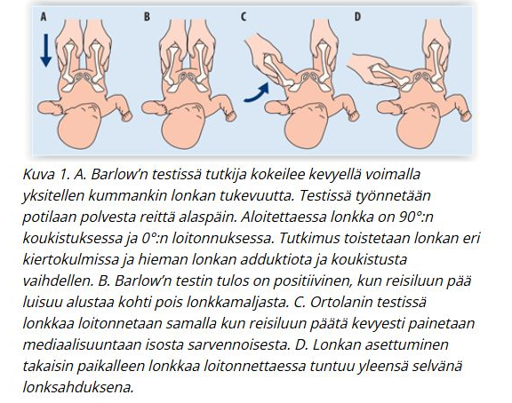
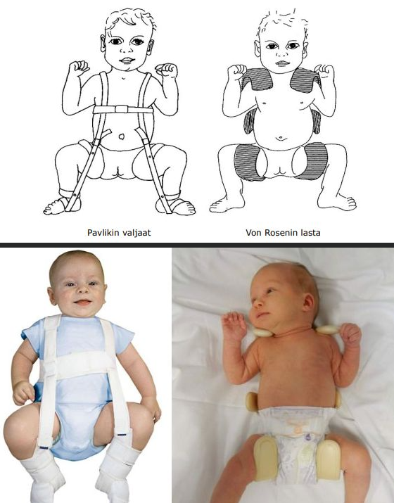
  

### Missä ajassa nappiparisto pitää poistaa, kun lapsi on sellaisen nielaissut {#Missa-ajassa-paristo}

Ei vaihtoehtoja, koita vastata ilman.

  <button class="solution-button"
          data-label="Vastaus"
          data-hide-label="Piilota vastaus">
    Vastaus
  </button>
  

      2 tunnissa

Etenkin pienet lapset nielevät usein vahingossa erilaisia vierasesineitä kuten kolikoita ja lelun osia. Vatsan puolelle ulottuvalla keuhkojen röntgenkuvalla pystytään varmistamaan, onko (röntgenpositiivinen) vierasesine ruokatorvessa vai jo pidemmällä ruuansulatuskanavassa.

Erityisen vaarallisia ovat nappiparistot ja (multippelit) magneetit:

**Jos niellyn esineen tiedetään tai epäillään olevan elohopeaparisto, lapsi lähetetään välittömästi sairaalaan, jossa otetaan kuva ja paristo poistetaan endoskooppisesti.**

<li>Erityisen vaarallisia ovat ns. kolikkoparistot, jotka kiinni juuttuessaan voivat syövyttää ruokatorven seinämän hyvinkin nopeasti.</li>
<li>Useimmat nappiparistot sisältävät alkalisen elektrolyytin, joka voi liuetessaan vaurioittaa limakalvoa. Elektrolyytti joutuu ruoansulatuskanavaan, jos patterin kuori rikkoutuu. Kuoren rikkoutuminen nopeutuu, jos patterissa on paljon virtaa jäljellä.</li>

---

Kaikki ruokatorveen kiinni jääneet esineet poistetaan lapsilta yleisanestesiassa tähystimen avulla enintään 24 tunnin kuluessa. **Varsinkin nappiparisto kuitenkin poistetaan välittömästi.** _Toimenpide tehdään, vaikka lapsi ei olisi ollut ravinnotta ennen anestesiaa._ Jos diagnoosiin päästään viiveellä, vasta yli 12 tuntia nielemisestä, tulee harkita jo kehittyneiden komplikaatioiden poissulkemiseksi kaulan ja rintakehän tietokonekerroskuvausta ennen tähystystä.

---

Jos vähäoireista lasta, jonka ruokatorvessa on (röntgenpositiivinen) vierasesine, on kuitenkin seurattu yön yli, kannattaa harkita uusintakuvausta ennen tähystystutkimusta sijainnin varmistamiseksi ja turhien toimenpiteiden välttämiseksi.

<li>Jos vierasesine on päässyt ruokatorven kautta mahalaukkuun, tulee se lähes varmasti myös luonnollista reittiään ulos (mukaan lukien terävät esineet kuten nuppineula).</li>
<li>Kookkaat esineet (alle 1-vuotiailla yli 2 cm, vanhemmilla lapsilla yli 3 cm) eivät välttämättä mahdu mahanportin läpi. Tähystyspoisto on tällöin perusteltu, ainakin jos vierasesine ei kulkeudu suoliston puolelle ja poistu ulosteen mukana 1–2 viikon kuluessa</li>
<li>Poikkeuksen edellä mainittuun hoitolinjaan muodostavat paristot ja magneetit (jos magneetteja on useampi kuin yksi). Multippelit magneetit voivat eri kohdissa suolta attraktoida suolta, jolloin suolenseinämä voi jäädä näiden väliin puristuksiin ja puhjeta. Natiivikuvia tulkitessa pitää muistaa, että yhteen liimautuneet magneetit saattavat näyttää vain yhdeltä vierasesineeltä. Jos varmuutta määrästä ei ole, hoito ja seuranta on toteutettava kuten niitä olisi useampi.</li>
<li>Paristojen suhteen tähystyksen tarve arvioidaan potilaskohtaisesti (kons lastenkirurgi)</li>

  

### Monivalintakysymys radiusmurtuman angulaatiosta 

Ei vaihtoehtoja, koita hieman miettiä hyväksytyn asennon ohjeita lasten radiusmurtumissa. 

  <button class="solution-button"
          data-label="Vastaus"
          data-hide-label="Piilota vastaus">
    Vastaus
  </button>
  

      
Lasten ja aikuisten distaalisten radiusmurtumien hyväksyttävän asennon kriteerit eroavat toisistaan. Yleisohjetta rannemurtuman "hyväksyttävästä virheasennosta" on vaikeaa määritellä, eikä asiasta sen vuoksi ole yksituumaisuutta asiantuntijoidenkaan kesken.

Kasvuikäisillä lapsilla ranteen liikelaajuuden suunnassa oleva kallistuma eteen tai taaksepäin kuitenkin korjautuu keskimäärin nopealla tahdilla, jopa 2-8 asteen kuukausivauhtia. Hyväksytyn dorsaalisen kallistuksen ohjeistukset eroavat lähteestä toiseen ja työpaikasta toiseen. **Nyrkkisääntö on, että yleensä lapsen rannemurtumassa mitä nuorempi lapsi, niin sitä löysemmät ovat hyväksyttyjen virheasentojen rajat.** Tällä hetkellä TYKS:ssä käytetään ohjeistusta:

<li>Alle 5v: Alle 30 astetta</li>
<li>6-10-vuotias: Alle 20</li>
<li>Vanhemmilla lapsilla 0-20 riippuen luuston kypsyydestä</li>
<li>*Ranteen liikealan vastainen kallistus eli ulnaarinen tai radiaalinen kulmavirhe korjautuu huonosti ja nuoremmilla lapsilla enintään 15 asteen kallistus voidaan hyväksyä, murrosikäisillä alle kymmenen astetta.</li>

---

Silmämääräisesti näkyvä deformiteetti reponoidaan usein riippumatta radiologisesta kulmasta, koska vaikka ei ylittäisikään niin päällepäin näkyvää deformiteettia eivät potilaat eivätkä heidän vanhempansa hevin hyväksy.

  

### Monivalintakysymys kastelusta

Ei vaihtoehtoja. Ehkä voi miettiä vastausta kysymykseen: "Onko lapsen kastelu yleensä kirurgisesti hoidettavasta ongelmasta johtuvaa?"

  <button class="solution-button"
          data-label="Vastaus"
          data-hide-label="Piilota vastaus">
    Vastaus
  </button>
  

      
Niin yö- taikka päiväkastelu ei yleensä johdu kirurgisesta syystä -- varsinkaan yökastelu, joka voidaan pääsääntöisesti hoitaa PTH:ssa. 

Päiväkastelu sen sijaan yleensä kuuluu ESH:n selvittelyihin, jossa yleensä tehdään kertaalleen virtsaelinten kaikukuvaus ja tarvittaessa muita erityistutkimuksia. Virtsateiden anatomiaan tai hermotukseen liittyviä poikkeavuuksia todetaan kuitenkin vain pienellä osalla päiväkastelijoista -- yleisin syy on virtsaustapoihin liittyvät ongelmat. Myös mm. VTI, ummetus yms voi olla taustalla. 

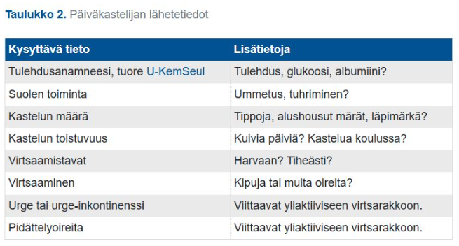
  

## 2023 

### Neuvola case: 3vk ikäisellä vauvalla napatynkä irronnut 1vk iässä. Navan seutu erittää ja tuhrii vaatteet {#Napatynka-pt-tapaus}

- Mitä kysyt vielä äidiltä? Mikä tod.näk. diagnoosi? Miten hoidetaan? Jos hoito ei auta, mitä tehdään?

  <button class="solution-button"
          data-label="Vastaus"
          data-hide-label="Piilota vastaus">
    Vastaus
  </button>
  

      
**Napavarren irtoamisen jälkeen vauvan napaan voi jäädä erittävä granulooma, joka on paranemisreaktion aiheuttama hyvänlaatuinen liikakasvumassa.**

Napatynkä kuivuu ja irtoaa yleensä 1–2 viikon kuluessa syntymästä. Tämän jälkeen navan pohjalle muodostuu normaalisti granulaatiokudosta (uudiskudosta) suojaamaan haavapintaa. Jos ihosolukko ei kasva ajoissa granulaatiokudoksen yli, kyseinen kudos jatkaa kasvamistaan muodostaen punaisen, kostean kudosmöykyn eli granulooman. Granuloomassa ei ole hermopäätteitä, joten se ei ole lapselle kivulias. 

**Tyypillisimpiä oireita ovat navan kirkas, kellertävä tai lievästi verinen limainen eritys.** Kosteus voi ärsyttää ja punottaa napakuopan ympärillä olevaa ihoa. Voi haiskahtaa hieman, mutta merkittävää infektioon viittaavaa ei ole todettavissa. **Kannattaa kysyä varsinkin, onko selkeästi virtsaa tai ulosteita tullut navasta.**

---

**Hoito on neuvolassa laapistus** (sama laapistikku siis kuin esim. nenäverenvuodoissa). Hopeanitraatti syövyttää ja kuivattaa kudosnystyrän, jolloin se muuttuu tummaksi ja kuivuu pois muutamassa päivässä. 

Kotihoitona voi myös kokeilla vaihtoehtoisesti _ruokasuolahoitoa,_ jossa ensin napa puhdistetaan kevyesti vedellä/saippualla ja kuivataan, jonka jälkeen granulooman päälle laitetaan pieni hyppysellinen hienoa ruokasuolaa. Napa peitetään puhtaalla harsolla tai teipillä ja anna suolan vaikuttaa noin 30 minuuttia, jonka jälkeen se huuhdellaan pois. Tätä toistetaan 2x/vrk 3-5pv, jonka aikana kudos kuivuu ja kutistuu. 

---

**Jos ei hoidu laapistuksella ja napa erittää useita kuukausia, niin voi miettiä eri vaihtoehtoja ja varsinkin napafisteleitä.** Sikiöaikaiset jäänteet, kuten virtsarakon tai suolen limakalvojäänteet (urakusremnantti, omfalomesenteerinen remnantti;: yhteyksiä siis joko rakosta tai suolesta napaan) muistuttavat granuloomaa, mutta erittävät mahdollisesti jopa virtsaa tai ulostetta eivätkä reagoi granulooman tavallisiin hoitoihin. Sikiökehityksen aikana siis sekä virtsateistä (urachus) että suolistosta (ductus omphalomesentericus) on yhteys napaan. Näitä tutkimuksia varten **vauva lähetetään kiireettömään lastenkirurgin arvioon.**

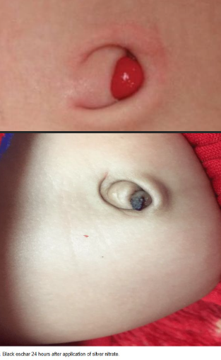
  

### Ontuva 5-vuotias: todennäköinen dg, erotusdg, miten tutkit? {#Ontuva-5v}

  <button class="solution-button"
          data-label="Vastaus"
          data-hide-label="Piilota vastaus">
    Vastaus
  </button>
  

      
Lapsen ontuminen on aina selvittelyjä vaativa asia. Ontuminen on lapsella aina merkki jostain: kivusta, liikerajoituksesta tai mekaanisesta ongelmasta alaraajassa tai lantiossa. Lapsi ei ontu "tottumuksesta" tai syyttä, minkä vuoksi syy on aina selvitettävä – vaikka kyseessä olisi useimmiten vaaraton ja itsestään ohi menevä vaiva.

Etenkin pienen lapsen on vaikea paikantaa kipua tarkkaan, joten alaraajat on syytä tutkia lonkista varpaisiin erikseen luurakenteiden ja nivelten liikkeiden osalta. Säteilykipu on tavallista (erityisesti lonkkanivelen ongelmat tuntuvat tyypillisesti kipuna reidessä tai polvessa). Vanhemmilta pyritään selvittämään mahdolliset vammat tai infektio-oireet. 

---

Anamneesissa: 

<li>Vamma- ja tapaturmatausta</li>
<li>Infektiotausta; onko ollut punkkia? matka-anamneesi?</li>
<li>Yleisoireet. Paikalliset tai yleistyneet infektio-oireet voivat olla merkki luun tai nivelen bakteeri-infektiosta, ja tuolloin vaaditaan päivystykselliset selvittelyt erikoissairaanhoidossa.</li>
<li>Oireiden kesto ja kulku: aamujäykkyys? pahempi/parempi rasituksen jälkeen? Alkoiko ontuminen äkillisesti/vähitellen? On tärkeää selvittää, onko ensioireena ollut kipu, ontuminen vai turvotus.</li>
  <ul>
    <li>Lapsuusiän idiopaattisessa niveltulehduksessa (lastenreuma) lapsen valittama kipu on harvoin ensimmäinen oire. Ensiksi havaitaan yleensä nivelen käytön varominen tai turvotus. Sen sijaan infektioartriitissa ja lonkan transientissa synoviitissa kipu alkaa sangen äkisti ja on usein voimakasta. Lastenreumassa ontuminen tai nivelen jäykkyys on vaikeampaa aamuisin, kun taas ei-tulehduksellisissa (ortopedisissä) nivelsairauksissa nivelen tai raajan kipu yleensä pahenee päivän mittaan ja rasituksessa.</li>
  </ul>
<li>Sukuanamneesissa tulee selvittää reumasairaudet, psoriaasi, tulehdukselliset suolistosairaudet, keliakia ja muut autoimmuunisairaudet (diabetes, MS-tauti, hypotyreoosi) sekä hemofilia.</li>

---

Statuksessa:

<li>Kuume, kontakti, yleisvointi</li>
<li>Kävely ja inspektio (lihasatrofia, turvotukset, vammajäljet). Trendelenburgin testi. Selän liikkuvuus ja ryhti.</li>
<li>Kivun ja oireiden lokaatio: Etenkin pienen lapsen on vaikea paikantaa kipua tarkkaan, joten alaraajat on syytä tutkia lonkista varpaisiin erikseen luurakenteiden ja nivelten liikkeiden osalta. Säteilykipu on tavallista (erityisesti lonkkanivelen ongelmat tuntuvat tyypillisesti kipuna reidessä tai polvessa). Tutkien etsitään mahdolliset paikalliset aristukset, turvotukset, kuumotukset ja punoitukset. </li>
<li>Iho ja imusolmukkeet: Petechiat, nokkosihottumat tai purpura (IgA-vaskuliitti / HSP), imusolmukkeet (varsinkin nivustaipeen)</li>

---

**Lonkan nivelkalvon ohimenevä tulehdus eli transientti synoviitti on yleisin 3-10(-12)-vuotiaan lapsen ontumisen syy.** Kyseessä on äkillisesti alkanut, yleensä toispuoleinen, aseptinen tulehdus. Oireena on kivulias ontuminen tai varaamattomuus. Kipu voi tuntua nivusessa tai usein tyypillisen harhaanjohtavasti polvi- tai reisikipua. Tyypillisesti lonkka on fleksiossa ja ulkorotaatiossa. Tutkittaessa erityisesti lonkan kiertoliikkeet ovat rajoittuneet. Yleisoireita ei ole, ja lasko ja CRP ovat normaalit tai vain lievästi suurentuneet.

Niveltulehduslöydös vahvistuu kaikukuvauksella, ja diagnoosi varmistuu, kun oirekuva ja löydökset väistyvät muutaman päivän - parin viikon kuluessa. Hoito: lepo, NSAID; kontrolli tarvittaessa, jos oireet ei häviä 2 viikossa (harkinnan mukaan rtg). Voi uusia.

---

Toisia syitä ovat mm. Perthesin tauti, trauma/vamma ja päivystyksellisesti vakavat syyt (septinen artriitti, osteomyeliitti, akuutti leukemia). 

Infektiosyytä tutkien etsitään mahdolliset paikalliset aristukset, turvotukset, kuumotukset ja punoitukset. Paikalliset tai yleistyneet infektio-oireet voivat olla merkki luun tai nivelen bakteeri-infektiosta, ja tuolloin vaaditaan päivystykselliset selvittelyt erikoissairaanhoidossa. **PVK ja CRP voidaan tutkia, jos ei varaa raajalle / merkittävän kivulias, vaikka olisikin kuumeeton.**

Trauman suhteen voi olla murtuma, pehmytkudosvamma tai jopa puutikku/vierasesine jalkapohjassa (muista aina tarkistaa jalkapohjat!)

Perthesin taudin eli idiopaattisen reisiluun pään nekroosin taudinkuva muistuttaa lonkan ohimenevää synoviittia, mutta oireilu alkaa hitaammin ja kestää pitkään. Oireena on ajoittaista tai rasituksessa tuntuvaa lonkkakipua, johon lepo auttaa. Kipu voi tuntua nivusen, reiden tai polven alueella. Tautia esiintyy 5-12-vuotiailla ja pojilla jopa viisi kertaa enemmän kuin tytöillä. Trendelenburgin testi on positiivinen ja lonkka voi olla sisärotaatiossa. Röntgentutkimus varmistaa diagnoosin. Tauti paranee ajan kanssa itsestään. Perthesin taudin hoito kuuluu erikoissairaahoitoon. Lähete tehdään kiireellisenä (ei päivystyksellisenä).

On paljon monia muitakin syitä. 

---

Jos lapsella ei ole yleisoireita eikä mitään poikkeavia tutkimuslöydöksiä, voidaan tilannetta seurata. Mikäli selvää kipukohtaa tai muutoin paikantuvaa ongelmaa ei löydy, diagnoosi ei ole aivan selvä ja oire on pitkittynyt, lapsi tulee lähettää erikoissairaanhoitoon. Yleisoireinen tai infektioepäily päivystyksellisesti. 

Jos kattavassa statuksessa todetaan poikkeava löydös, on oireisen alueen röntgenkuvaus aiheellinen. Poikkeuksena tyypillinen rasitusapofysiitti ja lonkan transientti synoviitti. Selvä nivelen turvotus tai liikerajoitus ilman poikkeavaa röntgenlöydöstä viittaa niveltulehdukseen

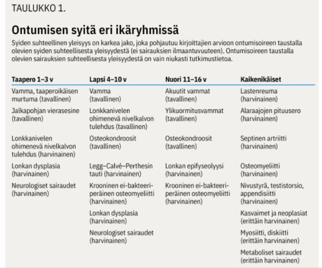
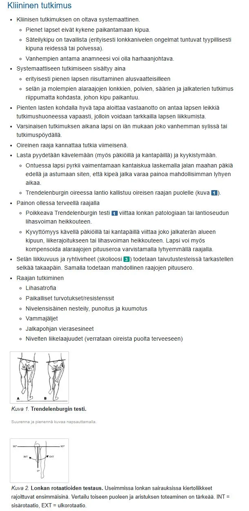

  

### Selkäkipuinen lapsi {#Selkakipuinen-lapsi}

  <button class="solution-button"
          data-label="Vastaus"
          data-hide-label="Piilota vastaus">
    Vastaus
  </button>
  

      
Selkäkipu on epätavallinen oire alle kymmenvuotiaalla lapsella, mutta selkäkivun esiintyvyys alkaa lisääntyä murrosiän kasvupyrähdyksen jälkeen. Alle kouluikäisen lapsen selkäkivun taustalta on useimmiten tunnistettavissa selvä orgaaninen syy, ja hoito edellyttää usein nopeaa diagnostiikkaa ja suunnittelua. Tästä syystä alle kouluikäisen selkäkipu on lähes aina aihe erikoissairaanhoidon tutkimuksiin. 

<li>Alle kouluikäisillä oireen taustalla voi olla hyvin monenlaisia syitä, esimerkiksi nikaman hyvänlaatuinen kasvain (mm. osteoidi osteooma, osteoblastooma) tai eosinofiilinen granulooma, selkärangan bakteeritulehdus (kuume, korkea lasko, CRP:n nousu) tai selkäytimen kasvain. Joskus harvoin syynä voi olla yleissairaus, kuten leukemia tai aineenvaihdunnan häiriö.</li>
<li>Kaikki nämä sairaudet ovat harvinaisia. Diagnostiikka edellyttää laboratoriokokeita (täydellinen verenkuva, CRP, La, virtsanäyte) ja kuvantamistutkimuksia, kuten koko selkärangan magneettikuvauksen, joka pienelle lapselle on usein tehtävä yleisanestesiassa. Mikäli selkäkivun aiheuttajaksi epäillään selän virheasentoa, otetaan selkärangan röntgenkuva pystyasennossa; siihen liittyy säderasitus.</li>
<li>Erotusdiagnostiikassa tulee myös ottaa huomioon muut selkäkipua aiheuttavat sairaudet, kuten kuumeinen munuaisaltaan tason bakteeritulehdus.</li>

---

Valtaosa vanhempien lapsen selkäkivuista ohittuu nopeasti eikä edellytä laajoja jatkotutkimuksia. **Yli 10-vuotiaalla lapsella voidaan hyvällä kliinisellä tutkimuksella ja lannerangan natiiviröntgenkuvauksella useimmiten sulkea pois ”ikävät” leikkaushoitoa vaativat alaselän kipua aiheuttavat sairaudet, kuten suuriasteinen spondylolisteesi ja luun kasvaimet sekä myös mm. spondylodiskiitti eli selkärangan bakteeritulehdus kannattaa pitää mielessä. Jos kliininen tilanne vaatii kuvantamista, on lastenortopedin konsultaatio yleensä tarpeen; jatkotutkimuksena usein voidaan tarvita MRI:tä.** Vakaville selkäsairauksille tyypillisiä piirteitä ovat muun muassa toistuva tulehduskipulääkkeen tarve, yöllinen selkäkipu, selkäkivun säteileminen alaraajoihin, kävelyn vaikeutuminen, alaraajojen heikkous, virtsaamisvaikeudet ja bakteeritulehduksien yhteydessä kuumeilu. _Mikäli kliininen tutkimus on täysin normaali, lapsi voidaan kutsua uudelleen arvioon 1-2 viikon kuluttua, ennen kuin edetään kuvantamistutkimuksiin._ Akuutin päivystyksellisen selkäkipukäynnin yhteydessä tai epäselvää pitkittynyttä selkäkipua tutkittaessa on perusteltua tutkia perusverenkuva, CRP-pitoisuus ja lasko.

**Yleisimpiä syitä selkäkivulle ovat rasitusosteopatia, spondylolyysi ja spondylolisteesi, välilevypullistumat ja selän virheasennot (esim. idiopaattinen skolioosi tai Scheuermannin tauti).**

<li>Pitkittyvä, rasitukseen liittyvä selkäkipu on usein oire selän rasitusosteopatiasta tai tuoreesta spondylolyysistä. Rasitusosteopatia tarkoittaa vain MK:ssa esille tulevaa (ei tarvitse rutiinisti ottaa) luun turvotusta nikaman takarakenteissa, joka edeltää rasitusmurtumaa (spondylolyysi). Spondylolyysi voi olla tois- tai molemminpuolinen, ja se sijoittuu nikaman pars interarticulariksen alueelle. Alaselkäkipujen tavallisin aiheuttaja lapsilla on lannerangan spondylolyysi. Nikamansiirtymä (spondylolisteesi) edellyttää molemminpuolista spondylolyysiä (istminen spondylolisteesi) tai nikaman takarakenteiden poikkeavaa rakennetta (dysplastinen spondylolisteesi).</li>
  <ul>
    <li>Yleisin lokaatio spondylolyysille ja -listeesille on presakraaliväli eli L5. Tyypillinen potilas on yli 10-vuotias liikunnallisesti aktiivinen lapsi, jolla on rasitukseen liittyvää alaselkäkipua ja "kireät takareidet". Kliinisenä löydöksenä voidaan todeta L5-nikaman okahaarakkeen palpaatioarkuus.</li>
    <li>Rasitusosteopatia paranee liikunnan kahden kuukauden tauottamisella ja soveltuu perusterveydenhuollossa hoidettavaksi.</li>
    <li>Tuore spondylolyysi paranee kahdella kolmasosalla lapsipotilaista mutta vaatii liikunnan tauottamisen neljäksi kuukaudeksi. Toispuolinen tai tuore molemminpuolinen spondylolyysi voidaan myös hoitaa neljän kuukauden korsettihoidolla. Ilman ortoosihoitoa merkittävä osa rasitusmurtumista jää luutumatta. Merkittävä osa spondylolyyseistä muuttuu kuitenkin vähäoireisiksi, vaikka itse lyysikohta ei olisikaan parantunut.</li>
    <li>Spondylolisteesissäkin hoito on liikunnan tauottaminen ja tuoreissa murtumissa korsetti. Lapsuusiässä leikkaushoitoa tarvitaan, kun siirtymä kehittyy suuriasteiseksi (yli 50 % nikaman pituudesta) tai potilaalla on hankala alaraajoihin säteilevä selkäkipuoireisto.</li>
  </ul>
<li>Välilevyjen rappeutuminen alkaa heti 10 ikävuoden jälkeen. Pienellä osalle näistä nuorista voi kehittyä oireinen lannerangan välilevypullistuma. </li>
  <ul>
    <li>Välilevypullistuman hoito on myös lapsella ensisijaisesti konservatiivinen, mikäli ei kehity neurologista puutosoiretta. Pullistuma ei lapselle aiheuta aina selkäkipua tai alaraajaan säteilevää kipua, vaan oireena voi olla myös pelkästään kipuskolioosi. Lapsella vaivan spontaani paranemistaipumus ja ennuste eivät ole yhtä hyvät kuin aikuisella ja oireiston helpottuminen kestää pidempään. Leikkaushoitoon joudutaan, mikäli oirekuva ei riittävän pitkän seurannan (vähintään 3 kk) jälkeen helpotu.</li>
    <li>Välilevyn pullistuman kaltaisen oirekuvan voi myös aiheuttaa niin kutsuttu apofyysin nurkkamurtuma, joka on kuvantamislöydösten perusteella erotettavissa välilevyn pullistumasta</li>
  </ul>
<li>Selän virheasentoihin, kuten idiopaattiseen skolioosiin tai Scheuermannin tautiin, liittyy noin kolmasosalla lapsista selkäkipua </li>
  <ul>
    <li>Kivuliaan skolioosin taustalta tulee kuitenkin sulkea pois muut syyt. Muiden syiden todennäköisyys kasvaa, jos käyryys on epätyypillinen, esimerkiksi vasemmalle kupera rintarangan käyryys.</li>
    <li>Skolioosin suhteen PTH:ssa skoliometri ja mm. jalkojen pituuseron tarkistaminen. Jos skoliometri >6º -> lähete erikoissairaanhoitoon lastenkirurgian poliklinikalle.</li>
  </ul>
<li>Selkärangan kasvaimet voivat olla hyvänlaatuisia, kuten osteoidi osteooma, eosinofiilinen granulooma tai aneurysmaalinen luukysta, tai harvoin pahanlaatuisia, kuten Ewingin sarkooma. Osteoidin osteooman hoidossa tyypillistä on erinomainen vaste tulehduskipulääkkeeseen. Joskus lapset alkavat pyytää tulehduskipulääkettä ennen nukkumaanmenoa, mikä on tyypillistä tämän kasvaimen tapauksessa. Pahanlaatuiset kasvaimet aiheuttavat useammin neurologisia puutosoireita.</li>
<li>Traumoista maininta: Terveen lapsen selkärangan murtuma syntyy suurienergiaisen vamman seurauksena. Ensihoito ohjaa suurienergiaisen vamman saaneet laajan päivystyksen sairaaloihin. Kliininen tutkimus noudattelee traumaprotokollaa. Suurienergiaisen vamman saaneen potilaan tutkiminen käynnistyy vitaalitoimintojen arvioinnilla ja systemaattisella traumastatuksella. Suurienergiaisen vamman saaneen potilaan arvioinnissa tarvitaan TT:tä. Valtaosa lasten selkämurtumista on stabiileja, jolloin aktiivisuuden rajoittaminen riittää hoidoksi. Neurologinen puutosoire edellyttää MK:ta.</li>

  

### Selitä lyhyesti: Fysiologinen fimoosi {#Fysiologinen-fimoosi-selita}

  <button class="solution-button"
          data-label="Vastaus"
          data-hide-label="Piilota vastaus">
    Vastaus
  </button>
  

      
Ahdas esinahka on vastasyntyneellä ja leikki-ikäisellä pojalla fysiologinen ilmiö (fysiologinen fimoosi). 

Fimoosi voi kyllä myös johtua jostain sairaudesta; tärkein on arpinen fimoosi, jonka yleisin aiheuttaja on balanitis xerotica obliterans (BXO). Fysiologisen fimoosin ja patologisen fimoosin voi erottaa varsinkin siitä, että fysiologisessa fimoosissa esinnahka menee kevyesti vedettäessä tötterölle suppilomaisesti, mutta se on kiinnikkeiden vuoksi vielä kiinni terskassa. Patologisessa fimoosissa esinahka muodostaa tiukan, joustamattoman "renkaan", joka ei veny. 

Murrosiän lähestyessä esinahka löystyy itsekseen hormonitoiminnan aktivoituessa. Esinahka on tiukka kouluiän kynnyksellä noin 8 %:lla pojista ja 16-vuotiaista enää noin yhdellä prosentilla. Näin ollen olennaisin hoitokeino on ajan kuluminen. Ei saa pestessä väkisin vetää nahkaa taakse, ettei tule vaurioita esinahkaan tai parafimoosia. 

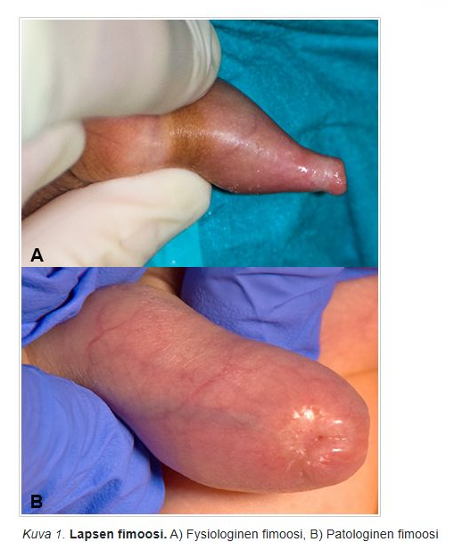
  

### Rtg-kuva nilkasta: onko murtumaa, miten tutkit, miten hoidat {#RTG-nilkasta}

Ei vaihtoehtoja. Vastaa näihin kysymyksiin

- a. Mikä on Tillaux-murtuma? Mikä on sen ensisijainen hoito? 
- b. Mikä on tavallisin lasten distaaliseen kasvulinjaan ulottuva säärimurtuma? Mikä on sen ensisijainen hoito?

  <button class="solution-button"
          data-label="a"
          data-hide-label="a - Piilota vastaus">
    a
  </button>
  

Tillaux-murtuma tarkoittaa erityisesti teini-ikäisillä esiintyvää sääriluun etulateraalinurkan avulsiomurtumaa (lig. tibiofibulare anterior). 

Tyypillinen juuri kasvulinjojen sulkeutumisen transitiovaiheessa; aluksi keskimmäiset ja mediaaliset osat kasvulevystä sulkeutuvat ja lateraalinen pysyy auki -> altistaa epätasaisesti vahvat kasvulevyn murtumille. On Salter-Harris III -tyypin murtuma. Syntyy supinaatio-ulkorotaatiomekanismilla. 

Näiden murtumien asento korjataan nukutuksessa ja murtuma tuetaan saapaskipsillä 4-6 viikoksi. Varaamatta ensimmäiset 4vk. Avoin asennonkorjaus ja ruuvikiinnitys ovat aiheellisia, ellei nivelpintaa saada sulkeisesti anatomiseksi. Merkittävää deformiteettia ei yleensä ehdi kehittyä, vaikka murtuma aiheuttaisi osittaisen kasvulukon, koska kasvu on yleensä päättymässä murtuman tapahtuessa. Liikuntakielto 8-10vk.

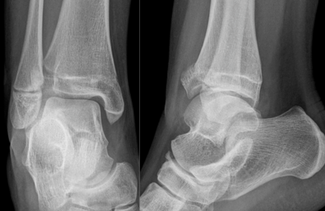
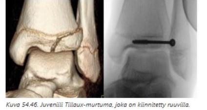

  

  <button class="solution-button"
          data-label="b"
          data-hide-label="b - Piilota vastaus">
    b
  </button>
  

Salter–Harrisin luokittelun II tyypin murtuma, jossa sääriluun alaosan epifyysi on liukunut taaksepäin. Ns. kahden tason murtuma on kiivaan pituuskasvun ja kasvun loppuvaiheen aikana tavallinen murtumatyyppi. Murtumalinja kulkee vaakasuoraan pitkin kasvulevyä ja pitkittäin metafyysissä, lähes kohtisuorassa kasvulevyn tasoa vastaan. Nilkkanivel jää ehjäksi.

Hoidetaan ensisijaisesti asettamalla paikalleen ja tukemalla nilkka neutraaliasentoon 4–6 viikoksi, n. 2kk liikuntakielto. Toistuvat ja viivästyneet repositioyritykset lisäävät kasvulukon riskiä, joten niitä tulee välttää. Hyväksyttävä nivelpinnan kallistuma on potilaan iän mukaan 5–10 astetta. Jos hyväksyttävää asentoa ei saavuteta, murtuma asetetaan paikalleen tarvittaessa avoimesti ja kiinnitetään metafyysialueelta ruuvilla. Röntgenkuva otetaan 6kk kuluttua vammasta kasvulukon varalta. 

**Tarvittaessa otetaan herkästi TT, jos epäillään nivelpinnalle tulevaa murtumalinjaa.**

Aitiopaineoireyhtymän mahdollisuus aina muistettava nilkan ja varsinkin säären diafyysialueen murtumissa. Tutki siis verenkierto-, hermo- ja kipustatus tarkasti. Nilkkamurtumissa tulee myös aina muistaa palpoida koko tibia ja fibula, voi olla murtunut myös ylempää (Maisonneuven murtuma tarkoittaa, että on todettavissa korkea fibulamurtuma + epästabiili nilkkavamma; proksimaalinen fibula tulisi aina kuvata mm. jos 1) proksimaalinen fibula aristaa palpoitaessa 2) kyseessä on takakolmion isoloitunut murtuma 3) mediaalinen nivelrako on leventynyt ilman murtumaa 4) mediaalimalleolissa on isoloitunut repeämismurtuma TC-nivelen distaalipuolella; pelkkä isoloitu mediaalimalleolin murtuma vaatii usein operaation ja hoitolinjan valinta tehdään ESH:ssa). 

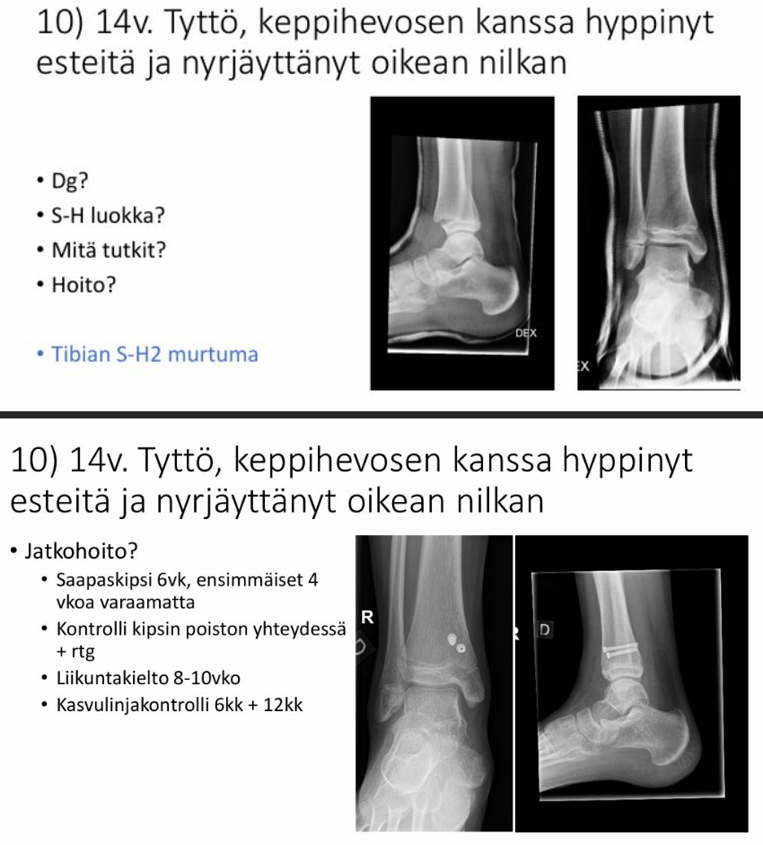

  

### Nivustyrä ja hydrocele, mistä johtuu, mitä eroa, miten hoidetaan {#Nivustyra-ja-hydroseele}

  <button class="solution-button"
          data-label="Vastaus"
          data-hide-label="Piilota vastaus">
    Vastaus
  </button>
  

Vesikives eli hydroseele tarkoittaa tunica vaginaliksen eli kiveksen tuppikalvon viskeraali- ja parietaalikalvojen väliin kehittynyttä nestekertymää. Voi olla synnynnäinen tai hankinnainen. 

**Lapsilla vesikiveksen (hydroseele) taustalla on useimmiten synnynnäinen vesikives, joka johtuu auki jääneestä vatsakalvon tuppilisäkkeestä (processus vaginalis).** Hankinnainen vesikives voisi olla primaarinen (idiopaattinen) tai sekundaarinen. Primaarisessa vesikiveksessä nesteenkertymiselle ei ole osoittaa erityistä syytä. Sekundaarisen hydroseelen syynä voi olla vamma, kiveksen kiertymä, tulehdus tai kasvain.

<li>Processus vaginalis on peritoneumin uloke, jota kivekset vetävät laskeutuessaan vatsaonteloa pitkin kivespussiin. Lopulta processus normaalisti obliteroituu ja sulkee kiveksen kivespussiin.</li>
<li>**Processuksen obliteroitumisen epäonnistumisen seurauksena kivespussi on suorassa yhteydessä vatsaonteloon ja peritoneaalinesteitä voi kertyä tunica vaginalikseen. Samasta syystä aiheutuu myös epäsuorat nivustyrät (eli suolta työntyy tätä samaa reittiä pitkin nivuskanavaan ja jopa kivespussiin saakka).**</li>

---

Erotus:

<li>Hydroseelessä lampulla testattaessa valo kajastaa kivespussin läpi eli vesikives transilluminoi. Tyrä taas ei. Palpaatiotuntuma on myös erilainen (hydroseele nesteäminen, hernia irregulaarinen).</li>
<li>Tyrä on yleensä reponoitavissa. Jos ei ole, niin on ns. kureutunut ja vaatii päivystyksellisen reponoinnin joko uudestaan yritettynä hereillä tai sitten salissa. </li>
<li>Tyrä näkyy yleensä pullistumana nivusseudussa nivuspoimun yläpuolella (vrt. vesikives, joka ei yleensä aiheuta nivuksen pullotusta). Pojilla tyrä voi laskeutua kivespussiin. </li>

---

Hoito: 

<li>Todettu tyrä hoidetaan aina -> kiireetön lähete lastenkirurgialle arvioon (tällä välillä kerrotaan vanhemmille, että jos tyrä kureutuu eikä ole painettavissa pois, kun lapsi on pitkällään ja rauhoittunut, lapsi pitää viedä päivystyksenä lääkäriin). Herniotomia on yleisin lastenkirurginen leikkaus. Viilto nivuseen (laparotomiasta ei ole lapsille merkittävää hyötyä, koska anatomia on niin pientä, että suora lähestymistapa ei aiheuta merkittävästi isompaa haavaa), tyräpussin erilleen preparointi ja sulku, ei verkkoa lapsille (voi aiheuttaa lapsen kasvaessa liikakiristystä). Uusinut tyrä ja bilateraalinen tyrä leikataan usein laparoskooppisesti.</li>
<li>Kommunikoiva vesikives häviää useimmiten processus vaginaliksen sulkeutumisen myötä spontaanisti 2–4 vuoden ikään mennessä. Mikäli näin ei käy, leikkaus suoritetaan ennen kouluikää (eli siis n. 5v iässä). Hoidetaan koska jos se ei ole sulkeutunut itsestään varhaislapsuudessa, niin todennäköisesti tyräreitti jatkaa suurenemistaan ja jossain kohtaa alkaa suoltakin tulla tyräaukon kautta nivuseen (nivustyrä), jolloin pitäisi tilanne muutenkin leikata. Joskus harvoin vesikives on hyvin suuri ja kireä, jolloin leikkaus on parempi tehdä jo varhaislapsuudessa.</li>

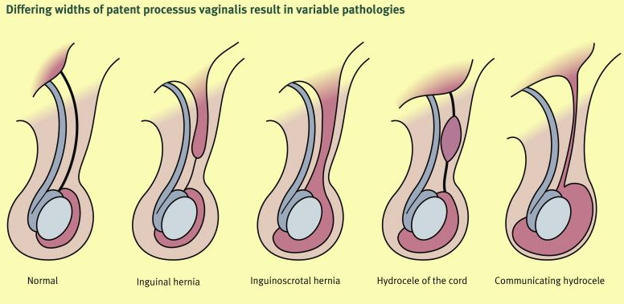
  

### Selitä lyhyesti: Salter harris 2 {#Salter-Harris-2-selita}

  <button class="solution-button"
          data-label="Vastaus"
          data-hide-label="Piilota vastaus">
    Vastaus
  </button>
  

Salter-Harrisin luokan 2 murtuma kulkee kasvulevyn halki metafyysiin; on yleisin lasten kasvulevymurtumamorfologia. 

---

Kasvulevyyn ulottuvat murtumat luokitellaan tavallisimmin Salter-Harris-luokituksen avulla. On myös Petersonin luokitus, joka on tarkempi on käytössä mm. Helsingissä enemmän; muuten maailmalla SH-luokitus on yleisemmin käytössä.

<li>SH1 = Murtuma on pelkästään kasvulevyn hypertrofisessa vyöhykkeessä; epifyysi erkanee metafyysistä</li>
<li>SH2 = Murtuma kulkee kasvulevyn halki metafyysiin; yleisin tyyppi</li>
<li>SH3 = Murtuma kulkee kasvulevyn kautta epifyysin läpi nivelpintaan</li>
<li>SH4 = Murtuma kulkee metafyysin, kasvulevyn ja epifyysin läpi nivelpintaan</li>
<li>SH5 = Kasvulevyn puristusvamma, jossa kasvulevy murskautuu; ei dislokoitumista tyypillisesti; hyvin harvinainen</li>

     

  

### 2-vuotiaan akuutti vatsakipu: tutkimukset, erotusdg, tavallisimmat syyt

  <button class="solution-button"
          data-label="Vastaus"
          data-hide-label="Piilota vastaus">
    Vastaus
  </button>
  

Lapsen ikä on syytä ottaa huomioon selvitettäessä vatsakivun tai -vaivojen syytä, koska osa taudeista esiintyy tyypillisesti tietyssä iässä.

Yleisimpiä syitä 2-vuotiaan akuutille vatsalle ovat:

<li>invaginaatio (intussusseptio, suolentuppeuma); tyyppi-ikä on 6–18 kuukautta (käytännössä 0-3 vuotta)</li>
  <ul>
    <li>Suolentuppeumassa suolta työntyy toisen suolenosan sisään; tyypillisimmin ileokekaalikulmassa. Kipu on aaltoilevaa. Diagnoosi tehdään vatsan ultraäänitutkimuksella. Hoitona ilma- tai varjoainerepositio peräaukon kautta, jos ei epäilyä suolen puhkeamisesta.</li>
  </ul>
<li>appendisiitti alkaa yleistymään (leikki-ikä ei vielä ihan tyypillinen, mutta mahdollinen) ja tämän erotusvaihtoehtona mesenteriaalinen lymfadeniitti</li>
<li>kureutunut tyrä</li>
<li>malrotaatio ja volvulus</li>
  <ul>
    <li>Suolen epätäydellinen sikiöaikainen kiertyminen on tila, jota kutsutaan suolen virhekiertymäksi eli malrotaatioksi. Altistaa volvulukselle, jossa suoli kiertyy oman liepeensä ympärille. Volvulus voi oireilla akuutisti tai kroonisesti. Akuutissa volvuluksessa lapsi voi huonosti, oksentelee sapen värjäämää nestettä. Pahimmillaan koko suolen verenkierto on estynyt, ja lapselle kehittyy metabolinen asidoosi. Vatsa on kipeä. Ulosteet voivat olla verisiä (hematoketsia) johtuen suolen limakalvon kuoliosta (strangulaatio ja infarkti) myöhäisvaiheessa. Akuutti muoto todetaan useimmiten ensimmäisten elinviikkojen aikana tai viimeistään ensimmäisen elinvuoden aikana. Krooninen muoto voi paljastua missä iässä tahansa useimmiten toistuvien oksenteluepisodien selvittelyjen pohjalta.</li>
    <li>Diagnoosi saadaan ruuansulatuskanavan suolistovarjoainekuvalla (passage-tutkimus)</li>
  </ul>
<li>Meckelin divertikkelin tulehdus tai sen aiheuttama suolitukos</li>
<li>ruuansulatuskanavan vierasesine myös tärkeää muistaa (varsinkin nappiparistot ja multippelit magneetit)</li>
<li>gastroenteriitti</li>
<li>muita ovat mm. sepsis, virtsatieinfektiot/pyelonefriitti, IgA-vaskuliitti, akuutti scrotum (kiveskiertymä, kiveslisäkkeen kiertymä) ja diabeettinen ketoasidoosi</li>
<li>tietysti myös ummetus voi olla pahentuneen vatsakivun taustalla</li>

---

Anamneesissa tärkeää selvittää: 

<li>Kivun luonne: Onko kipu aaltomaista/kohtauksittaista (invaginaatio) vai jatkuvaa ja pahenevaa (appendisiitti, peritoniitti)?</li>
<li>Oksentelu: Onko oksennusta? Oksennus ruokaa/maitoa vai sapenvihreää? (sapenvihreä oksennus on aina aihe välittömään kirurgiseen arvioon suolitukoksen (esim. volvulus) vuoksi).</li>
<li>Ulostaminen: Milloin ulostanut viimeksi? Onko ulosteessa limaa tai verta?</li>
<li>Liitännäisoireet: Onko hengitystieoireita, uneliaisuutta tai ihomuutoksia? Kuumetta? Yleistila?</li>

---

Statuksessa yleistila ja kattava yleisstatus. Varsinkin vatsan palpaatio (tarvittaessa ärsytystestejä, kuten psoaskoe tai obturatorkoe tai Rovsingin koe) ja mm. kivesten tutkiminen tärkeää. 

---

Vatsan UÄ useimmiten ensisijainen monissa akuuteissa vatsaepäilyissä (appendisiitti, invaginaatio). Volvuluksessa diagnoosi saadaan ruuansulatuskanavan varjoainekuvalla. Natiivirtg vierasesine-epäilyissä. 

  

### Akuutti vatsa imeväisellä: tavallisimmat syyt {#Akuutti-vatsa-imevaisella}

  <button class="solution-button"
          data-label="Vastaus"
          data-hide-label="Piilota vastaus">
    Vastaus
  </button>
  

Imeväisiällä taas tärkeimmät akuutin vatsan aiheuttajat ovat: 

<li>pylorusstenoosi (tyyppi-ikä 3-6vk)</li>
  <ul>
    <li>Tyypillisesti vanhemmat kertovat vauvan syövän halukkaasti, mutta oksentelu alkaa pian syömisen jälkeen. Taudin edetessä oksennus tulee usein paineella (kaaressa) ja sisältää ainoastaan mahan sisältöä (maitoa) eikä ole sapen värjäämää. Pylorusstenoosiin liittyy usein painon kehityksen hidastuminen tai jopa painon lasku, ja lisäksi se voi aiheuttaa kuivumista ja neste- ja elektrolyyttitasapainon ongelmia.</li>
    <li>Dg UÄ:llä, labroissa ainakin astrup. Hoitona on leikkaus, jossa halkaistaan pyloruslihas pitkittäissuunnassa (pyloromyotomia) joko avoleikkauksessa tai laparoskooppisesti. Leikkaus suoritetaan vasta, kun ollaan saatu nestetasapaino korjattua suonensisäisellä nesteytyksellä. Kyseessä ei siis ole niin välittömästi hengenvaarallinen asia, että tarvitsisi siirtyä välittömästi leikkauspöydälle ja altistaa lapsi turhan vaaralliselle yleisanestesialle, jossa hän olisi vielä merkittävässä kuivumassa ja hypokaleemisessa alkaloosissa.</li>
  </ul>
<li>invaginaatio (intussusseptio, suolentuppeuma) mahdollinen; tyyppi-ikä on 6–18 kuukautta (käytännössä 0-3 vuotta)</li>
<li>malrotaatio ja volvulus</li>
<li>ummetus</li>
<li>Meckelin divertikkelin tulehdus tai sen aiheuttama suolitukos</li>
<li>Hirschprungin tauti varsinkin jo vastasyntyneisyyskaudella</li>
<li>Sappitieatresia: paheneva keltaisuus</li>
<li>gastroenteriitti</li>
<li>muita ovat mm. sepsis, virtsatieinfektiot/pyelonefriitti, akuutti scrotum (kiveskiertymä, kiveslisäkkeen kiertymä)</li>

  

### Perthesin tauti

- a. oireet
- b. diagnostiikka
- c. erotusdiagnostiikka
- d. missä iässä
- e. hoito

  <button class="solution-button"
          data-label="a"
          data-hide-label="a - Piilota vastaus">
    a
  </button>
  

**(Legg–Calvé–)Perthesin tauti on reisiluun pään luutumistumakkeen verenkiertohäiriö tai kuolio, jonka syy on tuntematon.** Perthesin tauti on yleisempi pojilla kuin tytöillä (4:1). Molemminpuolinen Perthesin tauti on harvinainen (10 %) ja yleensä eritahtinen.

---

Oireet alkavat yleensä vähitellen ja aaltoilevasti. Perthesin tauti on alkuun oireeton. Reisiluun luutumistumake menee osittain tai kokonaan kuolioon. Verenkierto palaa itsestään, mistä seuraa ensin luutumistumakkeen painumamurtuma. Tässä vaiheessa lonkkaan tulee tulehdus, joka aiheuttaa **kipua, liikerajoitusta ja ontumista.** Kipu voi tuntua lonkan sijasta polvessa. 

  

  <button class="solution-button"
          data-label="b"
          data-hide-label="b - Piilota vastaus">
    b
  </button>
  

Diagnoosi perustuu röntgenkuvaan, jossa reisiluun luutumistumake näkyy aluksi epäsäännöllisempänä verrattuna terveeseen puoleen. Taudin edetessä luutumistumake painuu kasaan ja näyttää tervettä puolta skleroottisemmalta. Tautipuolen nivelrako leviää. Hitaan paranemisvaiheen (2–4 vuotta) aikana reisiluun luutumistumake vahvistuu pikkuhiljaa. Luutumistumakkeen muoto palautuu sitä paremmin entiselleen, mitä nuorempana tauti on alkanut.

Mahdollisesti voidaan joskus olla otettu kaikukuvaus, jossa todettu lisääntynyt nivelnesteily lonkkanivelessä voi olla taudin alkuvaiheen ainoa löydös muistuttaen transientin synoviitin ultraäänilöydöstä ja johtaen diagnostiikassa harhaan. 
  

  <button class="solution-button"
          data-label="c"
          data-hide-label="c - Piilota vastaus">
    c
  </button>
  

Yleisimpiä erotusdiagnostisia vaihtoehtoja ovat mm:

<li>Lonkan transientti synoviitti</li>
  <ul>
    <li>Lonkan nivelkalvon ohimenevä tulehdus eli transientti synoviitti on yleisin 3-10(-12)-vuotiaan lapsen ontumisen syy. Kyseessä on äkillisesti alkanut, yleensä toispuoleinen, aseptinen tulehdus. Oireena on kivulias ontuminen tai varaamattomuus. Kipu voi tuntua nivusessa tai usein tyypillisen harhaanjohtavasti polvi- tai reisikipua. Tyypillisesti lonkka on fleksiossa ja ulkorotaatiossa. Tutkittaessa erityisesti lonkan kiertoliikkeet ovat rajoittuneet.</li>
    <li>Yleisoireita ei ole, ja lasko ja CRP ovat normaalit tai vain lievästi suurentuneet.</li>
    <li>RTG-kuva on normaali. Niveltulehduslöydös vahvistuu kaikukuvauksella, ja diagnoosi varmistuu, kun oirekuva ja löydökset väistyvät muutaman päivän - parin viikon kuluessa. Hoito: lepo, NSAID; kontrolli tarvittaessa, jos oireet ei häviä 2 viikossa (harkinnan mukaan rtg). Voi uusia.</li>
  </ul>
<li>Septinen artriitti, osteomyeliitti</li>
  <ul>
    <li>Kuume, ei varaa jalalle lainkaan, tulehdusarvot koholla, yleisvointi huono...</li>
  </ul>
<li>Reisiluun pään epifyseolyysi (SCFE)</li>
  <ul>
    <li>Esiintyy vanhemmilla lapsilla ja varhaisnuorilla (tyypillisesti 10–15 v), usein ylipainoisilla tai kasvupyrähdyksessä olevilla. Röntgenkuvassa todetaan epifyysilinjan liukuma. </li>
  </ul>
<li>Lastenreuma</li>
  <ul>
    <li>Yli 6 viikkoa kestänyt niveltulehdus, johon liittyy aamujäykkyyttä. Usein useampi kuin yksi nivel oireinen. Poissulkudiagnoosi. </li>
  </ul>
<li>Lymen borrelioosi</li>
  <ul>
    <li>Yleensä polvessa, taustalla punkinpisto. Joskus erythema migrans -ihottuma muistettuna. Borrelia-vasta-aineet-koholla. Yleensä ei kuumetta; tulehdusarvot korkeintaan kohtalaisesti suurentuneet.</li>
  </ul>
<li>Akuutti leukemia (ALL) ja luukasvaimet (esim. Ewingin sarkooma, osteosarkooma)</li>
  <ul>
    <li>ALL voi oireilla epämääräisenä raaja- ja luustokipuna. Luukipu on usein yöllistä lepokipua, johon voi liittyä poikkeavuuksia verenkuvassa (anemia, leukopenia/leukosytoosi, trombosytopenia) ja näiden aiheuttamia oireita.</li>
  </ul>

  

  <button class="solution-button"
          data-label="d"
          data-hide-label="d - Piilota vastaus">
    d
  </button>
  

Alkaa tyypillisesti (4-)5–9 vuoden iässä.

  

  <button class="solution-button"
          data-label="e"
          data-hide-label="e - Piilota vastaus">
    e
  </button>
  

**Tauti paranee ajan kanssa itsestään.**

Perthesin taudin hoito kuuluu erikoissairaahoitoon. Lähete tehdään kiireellisenä (ei päivystyksellisenä)

<li>Alle 6-vuotiailla lapsilla ei yleensä tarvita varsinaista hoitoa, mutta lonkkia rasittava liikunta, esimerkiksi trampoliinilla hyppely, kielletään. Hoidon kulmakivenä on fysioterapia eli kevyempi liikunta (esim. uiminen, pyöräily), jolla pyritään ylläpitämään lonkan liikkeitä.</li>
<li>Ennusteeseen vaikuttavat lapsen ikä taudin toteamishetkellä ja verenkiertohäiriön laajuus. Alle 6-vuotiaan lapsen ennuste toimintakyvyn palautumisen suhteen on pääsääntöisesti hyvä</li>
<li>Leikkaushoidon tarve arvioidaan tapauskohtaisesti. Hankalimmissa tapauksissa voidaan joutua leikkaushoitoon, jolla pyritään minimoimaan vauriot lonkkanivelen toiminnan osalta</li>

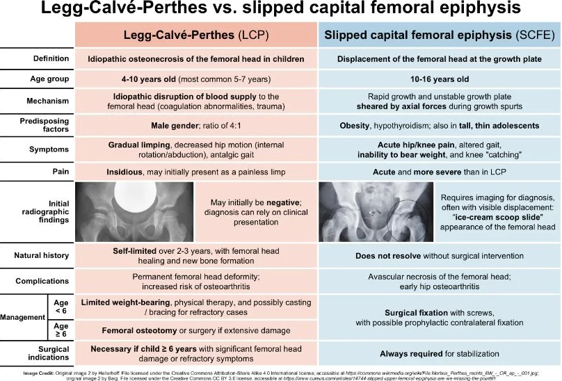
  

### Selitä lyhyesti: Epifyseolyysi {#Epifyseolyysi-selita}

  <button class="solution-button"
          data-label="Vastaus"
          data-hide-label="Piilota vastaus">
    Vastaus
  </button>
  

Reisiluun kaulan kasvulinjan liukuma (lonkan epifyseolyysi/SCFE/SUFE, slipped capital femoral epiphysis); toisin sanoen reisiluun pää eli epifyysi liukuu paikaltaan reisiluun kaulan suhteen. 

Tyypillinen potilas on (10-)11–16-vuotias ylipainoinen lapsi. Pojilla tauti on n. 2 kertaa yleisempi kuin tytöillä. Tummaihoisilla noin neljä kertaa yleisempi vaaleaihoisiin verrattuna. Yleensä ei sairautta taustalla, mutta epifyseolyysi voi liittyä endokrinologisiin sairauksiin, kuten kasvu- tai muiden aivolisäkehormonien sekä kilpirauhashormonin vajauksiin. Tarvittaessa konsultoidaan lastenlääkäriä. 

**Oire voi alkaa akuutisti (voi siis liittyä traumaan laukaisevana tekijänä) tai useammin vähitellen.** Lieviä oireita esiintyy tavallisesti usean viikon tai kuukauden ajan. 

<li>Epifyseolyysin **tyyppioire on ontuminen,** joka on usein jatkunut pitkään ennen hoitoon hakeutumista. Potilas pitää raajaa ulkokierrossa (tai tutkijan koukistaessa lonkkaa jalka kääntyy ulkokiertoon). Akuutissa taudinkuvassa kipu alkaa äkillisesti eikä potilas välttämättä pysty varaamaan raajalle ollenkaan</li>
<li>Potilas voi paikallistaa kivun nivuseen, reiteen tai polveen. Lonkan sisäkierto, loitonnus ja koukistus ovat rajoittuneet.</li>

---

Diagnoosi perustuu rtg-kuvaan. Siirtymä näkyy usein selvimmin Lauensteinin projektiossa (sivukuva), joka tulee aina ottaa

<li>Etusuunnan kuvassa niin sanottu Kleinin linja (reisiluun kaulan yläreunaa pitkin vedetty linja) ei osu epifyysiin. Sivusuunnan kuvassa siirtymä näkyy selvemmin</li>
<li>Röntgenkuva tulee ottaa aina päivystyksellisesti, jos yli 10-vuotiaalla on ontumista aiheuttava lonkan tai polven kipu</li>
<li>MK-tutkimus voi olla tarpeen, jos röntgenkuva on normaali, mutta kliininen epäily liukumasta vahva</li>

---

**Tilanne vastaa reisiluun kaulan murtumaa: potilas lähetetään päivystyksellisesti lastenortopediseen yksikköön.** Potilaalle annetaan kyynärsauvat ja häntä ohjeistetaan olemaan varaamatta kipeälle raajalle

<li>**Hoito on aina kirurginen:** ensisijaisesti liukuman sulkeinen paikalleen asetus ja ruuvikiinnitys</li>
<li>Potilailla on n. 10–20 %:n riski saada myöhemmin epifysiolyysi myös toiselle puolelle. Tämän vuoksi myös terveen puolen ennaltaehkäisevää kiinnitystä tulee harkita. </li>
<li>Jos diagnoosi viivästyy, voi reisiluun pää luutua virheasentoon, jonka korjaaminen edellyttää avoleikkausta. Toimenpiteeseen sisältyy huomattava reisiluun pään verenkiertohäiriön riski, ja ne tulisi keskittää yliopistosairaaloiden lastenortopedisiin yksiköihin</li>
<li>Noin kolmasosalle potilaista jää kipua. Noin viisi prosenttia tarvitsee seuraavan 20 vuoden aikana lonkan tekonivelen reisiluun päähän jääneen virheasennon aiheuttaman nivelrikon vuoksi. Liukuma voi aiheuttaa toimenpiteitä vaativan alaraajojen pituuseron. </li>
<li>Reisiluun pään verenkiertohäiriö (AVN, avaskulaarinen nekroosi) heikentää ennustetta. Radiologinen seuranta vähintään vuoden ajan verenkiertohäiriön havaitsemiseksi (kuormitettu lantion röntgenkuva (seisten)). Potilas ja huoltaja ohjeistetaan hakeutumaan päivystyksellisesti arvioon, jos oireet uusiutuvat tai ilmenevät toisessa alaraajassa.</li>

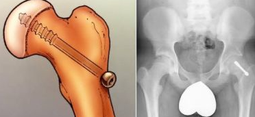
  

### Ahtaan esinahan syyt, eri syiden oireet ja hoito

  <button class="solution-button"
          data-label="Vastaus"
          data-hide-label="Piilota vastaus">
    Vastaus
  </button>
  

Ahtaan esinahan (fimoosi) taustalla voi olla normaali kehityksellinen ilmiö tai arpeuttava sairaus. Hoito ja lähestymistapa määräytyvät täysin sen mukaan, onko kyseessä fysiologinen vai patologinen ahtaus.

Ahdas esinahka on vastasyntyneellä ja leikki-ikäisellä pojalla useimmitten fysiologinen ilmiö (fysiologinen fimoosi). 

Fimoosi voi kyllä myös johtua jostain sairaudesta. Fysiologisen fimoosin ja patologisen fimoosin voi erottaa varsinkin siitä, että fysiologisessa fimoosissa esinnahka menee kevyesti vedettäessä tötterölle suppilomaisesti, mutta se on kiinnikkeiden vuoksi vielä kiinni terskassa. Patologisessa fimoosissa esinnahka muodostaa tiukan, joustamattoman "renkaan", joka ei veny. Fysiologisessakin fimoosissa virtsatessa esinahka saattaa hieman "palloilla" (laajentua pussimaisesti), mikä on vaaratonta, jos virtsaaminen ei ole kivuliasta eikä esty. Esinahan alla voi näkyä vaaleita, vaarattomia talikertymiä (smegma). 

Murrosiän lähestyessä esinahka löystyy itsekseen hormonitoiminnan aktivoituessa. Esinahka on tiukka kouluiän kynnyksellä noin 8 %:lla pojista ja 16-vuotiaista enää noin yhdellä prosentilla. Näin ollen olennaisin hoitokeino on ajan kuluminen. Ei saa pestessä väkisin vetää nahkaa taakse, ettei tule vaurioita esinahkaan tai parafimoosia. Normaali pesu ulkoisesti vedellä ilman esinahan väkivaltaista vetämistä riittää. 

---

Patologisen fimoosin tärkeimpiä syitä ovat arpeuttavat syyt: balanitis xerotica obliterans (BXO), toistuvat balanopostiitit ja trauma. 

<li>Balanitis xerotica obliterans (BXO) on **krooninen peniksen tulehdussairaus, joka esiintyy useimmiten esinahan ja terskan alueella.** BXO:ta on pidetty valkojäkälän varianttina miehen genitaalialueella, ja sitä tavataan kaiken ikäisillä (yleisintä pojilla n. 9-11v ja aikuisilla n. 30-60v).</li>
  <ul>
    <li>Etiologialtaan avoin. Taudissa epiteeli muuttuu ympäristöään vaaleammaksi ja fibrotisoituu. Osalle syntyy kiinnikkeitä. _Fibrotisoituminen voi aiheuttaa patologista fimoosia._</li>
    <li>Valkojäkälä on suurin yksittäinen ei-papilloomavirusinfektioihin liittyvien peniksen karsinoomien riskitekijä (lisääntynyt levyepiteelikarsinooman riski (4-5 %))</li>
    <li>BXO diagnoosi tehdään yleensä kliinisesti todettaessa patologinen sekundaarinen fimoosi (esinahassa oleva vaalea kiristävä rengas). </li>
    <li>**BXO on tavallisin lääketieteellinen syy ympärileikkaukseen.** Hoitamalla BXO:ta glukokortikoidivoiteella voidaan välttää ympärileikkaus noin kolmasosalla potilaista; kannattaakin yrittää hoitaa lievää esinahkaan rajoittuvaa BXO:ta ensin esim. bemetson 1x/vrk 4-8vk.</li>
  </ul>
<li>Toistuvat balanopostiitit voivat arpeuttaa esinauhan suuaukkoa. </li>
  <ul>
    <li>Infektioiden hoito. Hygienia. Paikalliset kortikosteroidit, tarvittaessa ympärileikkaus. </li>
  </ul>
<li>Trauma (esim. pakotettu taakseveto) ja sitä kautta arpikudos</li>
  <ul>
    <li>Hygienia. Paikalliset kortikosteroidit, tarvittaessa ympärileikkaus. </li>
  </ul>

  

### Lapsi kaatunut pyörällä ja tanko osunut vatsaan voimakkaasti {#Lapsi-kaatunut-pyoralla}

- a. miten tutkit (status, labrat, yms.)
- b. mikä ensisijainen kuvantamismenetelmä
- c. mitkä elimet todennäköisimmin vaurioituneet
- d. miten lähdetään hoitamaan vaurioita

  <button class="solution-button"
          data-label="a"
          data-hide-label="a - Piilota vastaus">
    a
  </button>
  

ABCDE aluksi, sitten tarkempi status, tutkitaan päästä varpaisiin. 

Traumalabrat: PVK, astrup, veriryhmä+x-koe, virtsanäyte, Na, K, Krea, glukoosi, ALAT, ASAT, Amyl; vaikka ei olisi selkeitä viitteitä merkittävästä vammasta.

Asetetaan IV-yhteys

  

  <button class="solution-button"
          data-label="b"
          data-hide-label="b - Piilota vastaus">
    b
  </button>
  

Periaatteessa voidaan tehdä FAST-UÄ-tyylinen kuvantaminen aina traumatilanteissa, mutta lapsilla vatsan alueen vammoissa kliinisen tutkimuksen lisäksi tärkeimmät tutkimukset ovat **TT-tutkimus varjoainetehosteisena** (ja yleensä thorax-rtg, jos ei oteta täyttä trauma-tt:tä traumahälytyksissä (esim. tippunut korkealta). Ultraäänikuvauksella nähdään osa vammoista, mutta se ei aina ole riittävä vamman laajuuden arvioimiseksi. Joskus harvoin stabiileissa tilanteissa voidaan tehdä varjoaine-UÄ-tutkimuksia. 

  

  <button class="solution-button"
          data-label="c"
          data-hide-label="c - Piilota vastaus">
    c
  </button>
  

Tavallisin intra-abdominaalisen vuodon aiheuttaja on **pernarepeämä.** Vammamekanismina on tylppä isku tavallisimmin putoamisen tai liikennetapaturman seurauksena. 

**Maksarepeämä** on lapsilla joissakin aineistoissa jopa tavallisempi tylpän väkivallan aiheuttama vatsaontelon elinten vamma kuin pernaruptuura. 

**Varsinkin haimavammassa tavallinen vammamekanismi on polkupyörän ohjaustangon aiheuttama isku keskelle ylävatsaa, jolloin usein nähdään rengasmainen mustelma ylävatsan iholla.** Haimavamma liittyy myös liikennetapaturmiin. Alkuvaiheen oireet voivat olla lievät, mutta anamneesin ja kliinisen löydöksen perusteella seuranta sairaalassa on aina perusteltua. Haimavammalle on tyypillistä vakavien oireiden ilmaantuminen viiveellä. Seerumin amylaasipitoisuuden seuranta on tärkeää. TT-tutkimuksella selvitetään haimatiehyiden tila ja parenkyymivaurion laajuus. Haimavammaan voi samanaikaisesti liittyä pohjukaissuolen vamma.

Voi tietysti myös mm. olla munuaisvamma tai kylkiluuvamman kautta keuhkolaseraatiokin.

  

  <button class="solution-button"
          data-label="d"
          data-hide-label="d - Piilota vastaus">
    d
  </button>
  

Kansainvälinen parenkyymielinvammojen luokittelu perustuu TT-kuvausten löydöksiin ja antaa suuntaviivoja konservatiivisen hoidon linjauksille. 

Ensilinjan hoito lasten sisäelinvammoissa on lähes aina konservatiivinen. Interventio on lähtökohtaisesti indisoitu, jos potilaan hemodynamiikka on epästabiili konservatiivisesta hoidosta huolimatta -> tällöin voidaan tilanteesta riippuen ensiksi yrittää esim. embolisaatiota ja sitten vasta siirtyä laparotomiseen hoitoon, jos se ei onnistu. Voidaan myös siirtyä suoraan laparotomiaan, jos massiivinen jatkuva vuoto (vuoto >40ml/kg/h) tai peritoniitti tai runsaasti ilmaa vatsaontelossa. 

Potilas tarvitsee kuitenkin teho-osastoseurannan. Siellä tarvittaessa mm. punasoluja ja trombosyyttejä ja voidaan seurata vointia arteriakanyylillä. UÄ-kontrolli tehdään ainakin ennen kotiutumista. 
Pernavammoissa rokostusharkinta pediatrian kautta kotiutuksen jälkeen (pernan vamma voi jättää potilaan hypospleeniseksi ja altistaa kapselillisille infektioille) ja jatkoon lastenurologin kontrolli (renografia). 

Haiman vammoissa tarvitaan usein alkuun ravinnotta oloa, iv-nesteytystä ja tarvittaessa tilanteen pitkittyssä parenteraalista nutritiota. 

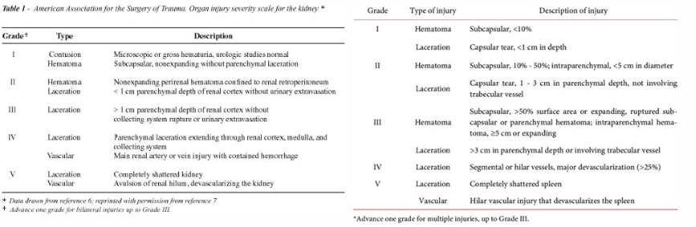
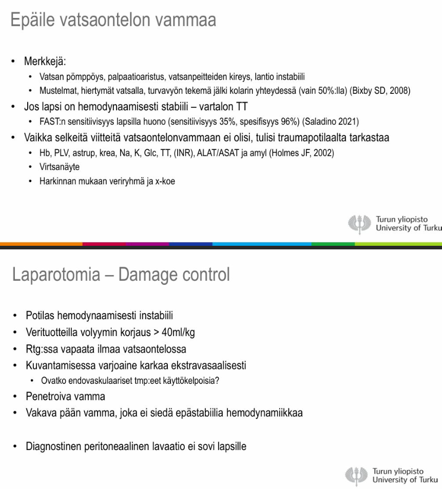
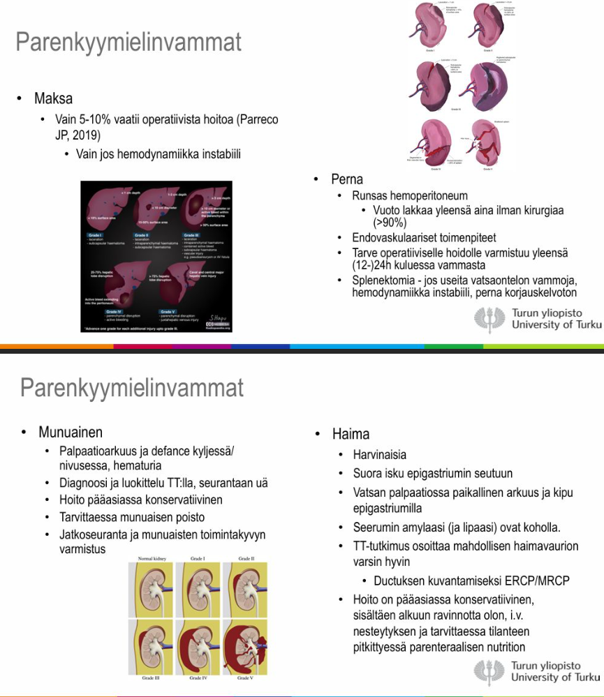

  

### Neuvola case: 2-vuotiaalla pojalla aikaisemmissa merkinnöissä kivekset +/+. Uhmaikäisenä vastustaa kaikkea tutkimista, hoitaja ja äiti pitävät kiinni ja saat palpoitua oikean puolen kiveksen nivuskanavassa, vedettyä tämän alas muttei pysy siellä. Vasemmalla puolella olet epävarma. {#Kivekset-plus-plus-mutta-ei-nyt}

- Miten tarkennat anamneesia ja mihin kiinnität tutkiessa huomiota? Miten etenet? Millä indikaatiolla lähetät eteenpäin?

  <button class="solution-button"
          data-label="Vastaus"
          data-hide-label="Piilota vastaus">
    Vastaus
  </button>
  

Anamneesissa tulisi selvittää, että onko kivekset siis todettu olevan kivespusseissa lääkärin toimesta (ja onko tämä toistetusti varmasti) vai ovatko vanhemmat vain nähneet ne kotona.

Myös kannattaa kysyä muista oireista ja historiasta: onko nivusalueella ollut kipua, turvotusta tai aiempia leikkauksia (esim. tyräleikkausta)? Traumaa kivesten alueelle?

Jos kivekset ovat varmasti todettu olevan kivespussissa aikaisemmin, niin kyseessä on pääsääntöisesti hyvänlaatuinen hyppivä kives, joka johtuu yliherkästä cremasterrefleksistä. Tietysti on mahdollista, että on hankittu kryptorkidismi esim. liian nopeasti pituuskasvusta tai toisista harvinaisista syistä, joita ei edes kaikkia tunneta. 

---

Tärkeintä tutkiessa on yrittää saada lapsi hetkeksi rentoutumaan, koska pelko, kipu, itku ja laitteista/pitelystä aiheutuva stressi laukaisevat voimakkaan kremasteriheijasteen, joka vetää kivekset välittömästi ylös nivuskanavaan. Lapsen piteleminen kiinni väkisin tekee luotettavan tutkimuksen mahdottomaksi ja antaa lähes aina virheellisen löydöksen. Tutkimusasento kannattaa tehdä räätälinasennossa vanhemman sylissä. Kives lypsetään nivuskanavaa pitkin alaspäin kohti kivespussia, suljetaan nivuskanava toisella kädellä. 

Jos kivespussi on normaalisti ja symmetrisesti kehittynyt, niin se viittaa siihen, että kives viettää siellä aikaa -> puhuu hyppivän kiveksen puolesta. 

Jos kives saadaan lypsettyä kivespussin pohjalle asti ja se pysyy siellä hetken ilman jännitystä, niin kyseessä on testis saltans eli hyppivä kives. Jos taas vetäytyy välittömästi takaisin ylös kuin kuminauha (joustamaton siemennuora) -> aito piilokives / nouseva kives (tämäkin kyllä kannattaa varmistaa rauhallisessa ja lämpimässä ympäristössä, jos nyt vaikuttaa tältä). 

Jos ei saada luotettavaa statusta tehtyä ja lapsi vastustaa tutkimusta edelleen, ei tehdä hätiköityjä johtopäätöksiä. Annetaan vanhemmille ohje seurata kiveksiä kotona esim. kylvyn yhteydessä. Varataan myös uusi lyhyt kontrolliaika esim. 1-2vk päästä. 

---

Oikean piilokiveksen hoitoikä olisi tavoitteellisesti alle 12kk, joten 2-vuotiaalla selvä piilokives vaatisi viivytyksettä erikoissairaanhoidon arviota. **Tehdään lähete LKIR, jos kotona/kontrollissakaan ei todeta kivestä kivespussissa tai saada sitä sinne lypsetyksi/ei pysy hetkeäkään siellä lypsämisen jälkeen.** Mikäli kontrollissa todetaan klassinen hissikives, joka laskeutuu kivespussin pohjalle ja jää sinne itsekseen ilman jännitystä, lähetettä ei tarvita, vaan tilannetta seurataan neuvolassa. 

  

### 13-v potilas. Kaatunut lasketellessa. Onko murtumaa, jos on niin mikä? Hoito terkassa ja hoito sairaalassa? {#13v-laskettelu}

Ei esimerkkikuvaa, mutta wikin vastauksen perusteella valittu sopiva kuva ja muokattu tehtävänantoa hieman. 

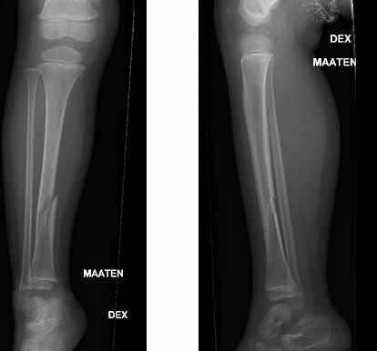

  <button class="solution-button"
          data-label="Vastaus"
          data-hide-label="Piilota vastaus">
    Vastaus
  </button>
  

Tibian diafyysimurtuma, ei kasvulevyaffisiota. 

Suurimmassa osassa sääriluun varren murtumista sääriluu on hyvässä asennossa ja pohjeluu on ehjä. Murtuma on huomattavasti vakaampi kuin tyypillinen aikuispotilaan säärimurtuma.

Konsultoidaan ESH hoidosta, mutta periaatteessa voidaan hoitaa PTH:kin (nuori potilas ja kestänee kipsauksen). Todennäköisesti kuitenkin ottavat ESH. Tietysti tutkitaan ensin ABCDE, arvioidaan neurovaskulaaristatus, ihon kunto, avomurtumamahdollisuus ja aitiopaineoireyhtymän oireita. Kivunhoito, immobilisaatio kourulla. Sitten rtg. 

Ensisijainen hoito on pitkä sirkulaarinen umpinainen saapaskipsi 4vk, sitten 2vk lyhyt saapaskipsi. Korkeaenergiaisen vamman jälkeen kannattaa kipsi halkaista ja potilaan tilannetta seurata ainakin muutaman tunnin ajan kipsauksen jälkeen (aitiopaikkaoireyhtymä).  Yleensä varauslupien aloitus 4vkon kohdalla. Kontrolli (rtg) 1vk + 2vk + 4vk + 6vk. Liikuntakielto 8-12vk.

Jos murtuman asentoa ei saada tuettua kipsillä, voidaan käyttää joustavia ydinnauloja. 

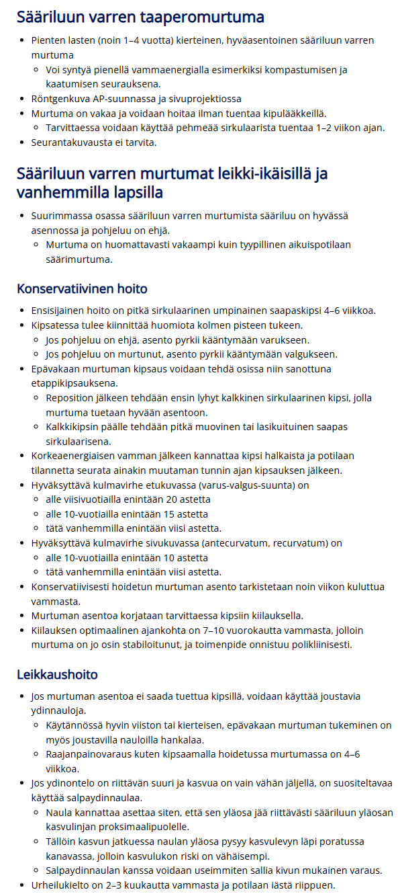

  

### 10v tyttö vääntänyt nilkan koulussa. Aristaa lateraalimalleolin palpointia, kohdassa hematooma. Liitteenä rtg-kuva. Dg, onko murtumaa? Kliininen tutkiminen? Miten hoidetaan? Jatkohoito? {#Nilkan-vaantaja}

Ei esimerkkikuvaa tai mainintaa oikeasta vastauksesta, mutta leikitään, että ei ollut murtumaa. Miten vastaat muihin kysymyksiin? Lisäksi myös: Milloin nilkkavammoissa otetaan rtg?

  <button class="solution-button"
          data-label="Vastaus"
          data-hide-label="Piilota vastaus">
    Vastaus
  </button>
  

Tutkimisessa anamneesi ja status tärkeitä varsinkin sen päättämisessä, otetaanko rtg. Vammamekanismi tärkeää selvittää, yleensä nilkan nyrjähdyksissä kyseessä plantaarifleksio+inversiovamma. Statuksessa turvotus, hematooma, liikerajoitukset, varaaminen, aristukset, vetolaatikkotestit, inversio- ja eversiotestit, syndesmoositestit (”Squeeze”-testissä puristetaan sääriluun ja pohjeluun alaosaa yhteen) ja koko säären/jalan alueen palpaatio (tarvittaessa siis esim. fibulan proksimaalipään kuvantaminen, jos siellä kipua). 

Kuva otetaan **Ottawan nilkkasäännöstön** mukaan: Nilkan röntgenkuvaus on aiheellinen, jos kehräsluuseudussa on kipua ja lisäksi ainakin yksi seuraavista ehdoista täyttyy:

<li>sääriluu aristaa sisemmästä takareunasta alimman 6 cm:n matkalta tai sisemmän kehräsluun kärjestä</li>
<li>luu aristaa pohjeluun takareunasta alimman 6 cm:n matkalla tai pohjeluun kärjestä</li>
<li>potilas ei kykene varaamaan jalalla neljää askelta</li>
<li>On myös Ottawan jalkasäännöstö: Jalkaterä kuvataan, jos jalan keskiosassa tuntuu kipua ja lisäksi luu aristaa V metatarsaalin tyvessä tai veneluun seudussa.</li>

---

Jos ei ole murtumaa tai siihen viittaavaa rtg:ssä, niin kyseessä on vain tyypillinen nilkan nyrjähdys tai nilkan nivelsiteen repeämä. Nilkan nyrjähdysvamman hoito on konservatiivinen, hoitoprotokollaksi suositellaan nykyään **PEACE (akuutti hoito) - LOVE (jatkohoito)**

<li>P (Protect) – Suojele. Vältä varausta tai rajoita liikettä ensimmäisten päivien (1–3) aikana vamman jälkeen vähentääksesi verenvuotoa ja välttääksesi lisävaurioiden muodostumista vamma-alueelle</li>
<li>E (Elevate) – Pidä koholla. Nosta mahdollisuuksien mukaan vammautunut raaja tai muu kehonosa sydämen yläpuolelle auttaaksesi kudosnesteen poistumista vamma-alueelta</li>
<li>A (Avoid anti-inflammatory modalities) – Pyri välttämään tulehdusprosessia estävien tekijöiden käyttöä ensihoidossa (tulehduskipulääkkeet, pitkittynyt kylmähoito</li>
<li>C (Compress) – Kompressoi. Mekaaninen puristus vammautuneen kudoksen ympärillä vähentää turvotusta ja kudoksensisäistä verenvuotoa.</li>
<li>E (Educate) – Ohjeista. Kannusta potilasta aktiiviseen ja omatoimiseen kuntoutumiseen. Passiivisista hoitomuodoista on harvoin hyötyä akuutin vamman hoidossa. Vältä ylihoitoa ja rohkaise potilasta ottamaan paranemisprosessi omaan hallintaansa. Anna hänelle realistinen kuva paranemisen kestosta</li>
<li>L (Load) – Kuormita. Lepo suositellaan korvaamaan optimaalisella kuormituksella</li>
<li>O (Optimism) – Ole optimistinen. Tue myönteistä asennoitumista paranemista kohtaan pysyen samalla realistisena paranemisen aikataulusta. Katastrofointi, masentuneisuus ja liikkeen pelko yhdistyvät heikompaan lopputulokseen vammasta toipuessa</li>
<li>V (Vascularisation) – Tue uudisverisuonituksen muodostumista (aktiivinen lepo eli vähäkipuisia aktiviteetteja kuten aerobista harjoittelua, joka lisää verenkiertoa alueelle)</li>
<li>E (Exercise) – Tee uusia vammoja ehkäiseviä harjoitteita. Aloita terapeuttinen harjoittelu aikaisin palauttaen liikeratoja, voimaa ja asentotuntoaistia</li>

---

_Jos on vain lievä (gr I-II eli nilkka vetolaatikkotestissä tukeva ja pystyy varaamaan ontuen) nilkan nyrjähdys, niin ei yleensä tarvita mitään immobilisaatiota/tukea, mutta sivuttaisväännön estävällä irrotettavalla nilkkaortoosilla/ilmalastalla voidaan tarvittaessa tukea nilkkaa lyhytaikaisesti (1-4vk)._

Jos on **vaikeampi vamma eli gr III,** niin silloin potilas ei yleensä pysty varaamaan nilkalle ja nilkka saattaa antaa periksi vetolaatikkotestissä (yleisimmin anteriorisesti johtuen FTA-ligamentin repeämästä). **Tällöin voidaan asettaa kipsisaapas 1-2vk, jonka jälkeen jatkotukea ilmalastalla tai nilkkatuella 4-6 viikkoa.** Varaaminen ja nilkan liikeharjoitteet, nilkka tukilastaan tuettuna, aloitetaan heti kivun salliessa. Samoin toimitaan, jos on harvinaisempi mediaalinen ligamenttivamma tai molemminpuolinen vamma. 

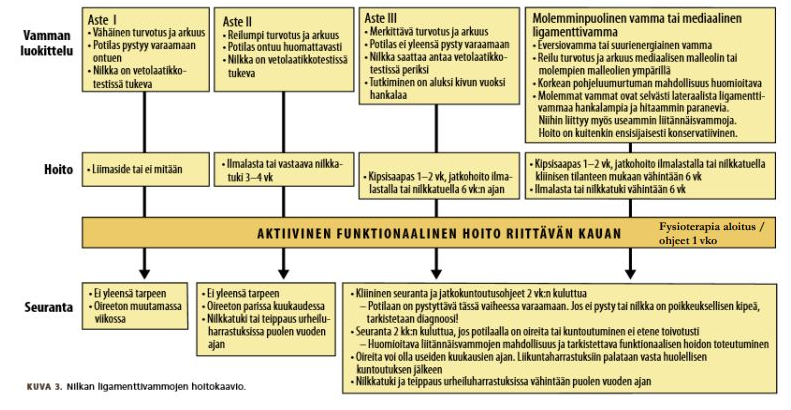
  

## 2022 

### Invaginaatio. Oireet, hoito, kuvantaminen, tyyppi-ikä ja erotusdg

  <button class="solution-button"
          data-label="Vastaus"
          data-hide-label="Piilota vastaus">
    Vastaus
  </button>
  

Suolentuppeumassa (intussusseptio, invaginaatio) suolta työntyy toisen suolenosan sisään. Tyypillisesti tämä tapahtuu ileokekaalikulmassa, jolloin ohutsuolen loppuosa invaginoituu nousevaan paksusuoleen. 

**Invaginaation tyyppi-ikä on 6–18 kuukautta,** ja tauti on yleisempi pojilla kuin tytöillä. 

Suurin osa (yli 3/4) tapauksista on idiopaattisia, mutta toisinaan aiheuttajana voi olla poikkeava rakenne (lead point) kuten Meckelin divertikkeli tai polyyppi. 

<li>Patologista lead pointia tulisi epäillä etenkin, jos invaginaatio esiintyy tyyppi-ikää vanhemmalla lapsella (voi esiintyä myös aikuisilla ja n. 90% aikuisten tapauksista johtuu patologisesta "lead pointista", joka on yleisimmin tuumori).</li>
<li>Erityisesti viimeaikaisen virusinfektion (erityisesti rota- tai adenovirus / tai jopa rotavirusrokotteen (tämän riskin takia on ikäraja annolle eikä anneta rokotusohjelman ulkopuolella)) saaneella lapsella yleinen syy intussusseptiolle on lymfaattinen hyperplasia; Peyerin laikkujen kasvu vasteena virusinfektiolle -> toimii tarttumiskohtana intussusseptiolle </li>

---

_Suolentuppeuma aiheuttaa tyypillisesti erittäin voimakkaita, koliikkimaisia (aaltomaisia) vatsakipuja._ Taudin edetessä oirekuvaan liittyy usein myös oksentelua ja suolen limakalvovaurion aiheuttamana verilimaisia ulosteita. Jos lapsi antaa tutkia vatsaa, voi invaginaatiokohta tuntua vatsan palpaatiossa makkaramaisena kyhmynä. Tuseerattaessa ampulla on aina tyhjä ulosteesta, mutta siellä voi olla vähän ”punaviinimarjamehua”.

**Lapsi, jolla epäillään invaginaatiota, pitää lähettää välittömästi sairaalaan. Diagnoosi tehdään vatsan ultraäänitutkimuksella.**

Erotusdiagnostisia vaihtoehtoja ovat mm. akuutti gastroenteriitti (ei ole tyypillisesti syklistä kohtauskipua eikä ole palpoituvaa massaa tai UÄ-löydöstä), akuutti appendisiitti (harvinainen alle 2v, kipu on jatkuvaa ja paikantuu usein oikealle alavatsalle), kuroutunut nivustyrä (voi aiheuttaa oksentelua ja vatsakipua, mutta nivusalueelta palpoituu arka patti) ja volvulus (äkillinen, henkeä uhkaava suolitukos ja sappimainen oksentelu hyvin pienellä imeväisellä; potilas menee nopeasti huonokuntoiseksi). 

---

Mikäli ei kliinisesti ole epäilyä suolen puhkeamisesta, pyritään ileokoolinen invaginaatio **hoitamaan ensisijaisesti ilma- tai varjoainerepositiolla peräaukon kautta,** jossa kevyellä paineella läpivalokontrollissa pyritään työntämään invaginoitunut suoli takaisin paikoilleen. "Air enema":ssa; ilmaa syötetään suolistoon (paine alle 100 cmH2O) ja sen tarkoituksena on työntää invaginoitunut suoli paikalleen; sama idea varjoaineella (varjoaine ainakin TYKS:ssä käytetympi). 

Mikäli tämä ei onnistu tai epäillään perforaatiota (peritoniittioireet), pitää invaginaatio hoitaa leikkauksella. Leikkauksessa useimmiten riittää käsin tehty suolen repositio eikä suolen osan poistoa tarvita yleensä, ellei todeta patologista syytä invaginaatiolle. 

Sairaalaseurantaa tarvitaan toimenpiteiden jälkeen siihen saakka, kunnes syöminen alkaa sujua ja kivut ovat hallinnassa. Perheitä on hyvä informoida noin 5 %:n uusimisriskistä.

  

### Selitä lyhyesti: Osgood-Schlatterin tauti {#Osgood-Schlatter-selita}

  <button class="solution-button"
          data-label="Vastaus"
          data-hide-label="Piilota vastaus">
    Vastaus
  </button>
  

Osgood–Schlatterin tauti on yleinen polvivaivan aiheuttaja aktiivisesti urheilevilla nuorilla useimmiten kasvupyrähdyksen aikaan. **Patellajänteen ja sen kiinnitysalueen rusto tulehtuu liian voimakkaan vetorasituksen (traktioapofysiitti) takia tyypillisesti 12–15-vuotiaalla urheilijalla, jonka lajiin kuluu paljon hyppyjä** (kori-, lento- ja jalkapallo tai juoksu). Tytöillä Osgood–Schlatterin tauti on harvinaisempi, ja oireet alkavat aikaisemmin (8–12 vuoden iässä).

**Kipu paikantuu sääriluun kyhmyn (tuberositas tibiae) seutuun. Tuberositas tibiaen kohdalla todetaan usein selvä kyhmy.** Akuutissa vaiheessa kyhmyä särkee, ja se on selvästi aristava. Akuutin tilanteen rauhoituttua särky ja painoarkuus häviävät, mutta lievää kipua esiintyy usein edelleen rasituksen jälkeen. 

---

Kuvantamistutkimuksia ei tarvita, mikäli tila on molemminpuolinen. Toispuoleisissa tapauksissa on hyvä poissulkea muu patologia (kasvain, infektio) AP- ja sivuröntgenkuvin.

---

Hoidossa tärkeintä on perheelle annettava informaatio. _Liikuntarajoitukset jätetään potilaan ja vanhempien päätettäviksi._ Oireiden voimakkuus vaihtelee niin paljon, että tarkkoja ajallisia ohjeita esim. urheilutauon kestosta yksittäisen potilaan kohdalla ei voida antaa. 

<li>Hoitona riittää kipua provosoivien harjoitteiden eli useimmiten juoksemisen ja hyppimisen välttäminen (esim. pari viikkoa) ja tarvittaessa korvaaminen esimerkiksi uinnilla tai pyöräilyllä. Keskeistä on, että vain kipua aiheuttava liikuntaa tauotetaan. Tauko on tarpeen aina, jos oireet palaavat. Fysioterapian tehosta ei ole selvää näyttöä, mutta fysioterapeutti voi ohjata alaraajan lihashallintaa parantavia lihasharjoitteita.</li>
<li>**Akuutissa vaiheessa oireita voidaan lievittää tulehduskipulääkityksellä ja kylmällä,** ja pahimmassa tapauksessa polven voi immobilisoida esimerkiksi ortoosilla pariksi viikoksi.</li>
<li>Leikkaushoitoa voidaan harkita niissä harvoissa tapauksissa, joissa todetaan irrallinen kipeä luufragmentti patellajänteen alla kasvun päätyttyä. Kasvuiässä vaivaa ei hoideta kirurgisesti.</li>

---

Osgood–Schlatterin taudin oireet kestävät muutamasta kuukaudesta pariin vuoteen ja häviävät valtaosalla potilaista viimeistään kasvun päättyessä. Kyhmy jää, ja yli puolet potilaista kokee polvilla seisomisen pysyvästi kipeäksi. Komplikaatiot (apofyysin ennenaikainen luutuminen, akuutti murtuma) ovat hyvin harvinaisia.

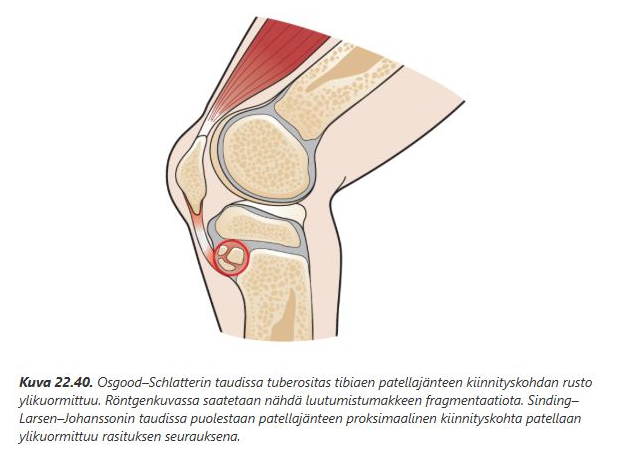
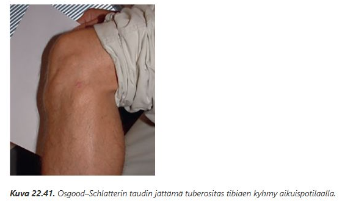

  

### Selitä lyhyesti: Napsusormi {#Napsusormi-selita}

  <button class="solution-button"
          data-label="Vastaus"
          data-hide-label="Piilota vastaus">
    Vastaus
  </button>
  

Napsusormi (trigger finger) tarkoittaa sormen koukistajajänteen jännetupen tulehdusta (tenosynoviitti), joka aiheuttaa jännetupen ahtautumisen. Sormien koukistajajänteiden jännetuppitulehdus (ns. napsusormi) on tavallisin käden alueen tenosynoviiteista. 

Se esiintyy tavallisimmin peukalossa, nimettömässä sormessa tai keskisormessa. **Peukalon napsusormea esiintyy myös vastasyntyneillä, ja sitä saatetaan luulla ojentajajänteen toimimattomuudeksi tai sormen kärjen sijoiltaanmenoksi.** Peukalo ei suoristu tai napsahtaa suoristuessaan. Esiintyy n. 1:2000 lasta. 

Tavallisimmin napsusormi esiintyy kuitenkin 40–50-vuotiailla naisilla sormissa III ja IV. Erityisen yleistä diabeetikoilla. 

---

**Hellittää yleensä itsestään kouluikään mennessä! -> Ei pistetä kortisonia** (vrt. muuten napsusormen hoito, joka on ensisijaisesti kortisonipistos) 

_Tarvittaessa leikkaus 5. ikävuonna ennen kouluun siirtymistä, jos peukalo ei lähde suoristumaan normaalisti_ (on syytä, jottei kehity pysyvää nivelkuroumaa)

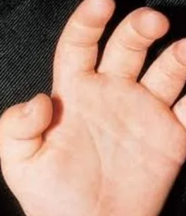
  

### Selitä lyhyesti: Kuopparinta {#Kuopparinta-selita}

  <button class="solution-button"
          data-label="Vastaus"
          data-hide-label="Piilota vastaus">
    Vastaus
  </button>
  

Tavallisimpia rintakehän epämuodostumia ovat kuopparinta (pectus excavatum, suutarinkuoppa) ja harjurinta (pectus carinatum, pulunrinta). Kupparinnassa nimensä mukaan rinta on kuopalla ja harjurinnassa koholla.

Näiden rakennepoikkeavuuksien tarkkaa syytä ei tunneta, mutta jossain määrin ne assosioituvat sidekudossairauksiin (Marfan, Ehlers–Danlos) ja osalla potilaista todetaan suvussa vastaavia epämuodostumia. 

**Ne ovat pääosin oireettomia ja haitta on yleensä kosmeettinen.** _Yleensä synnynnäisiä ongelmia ja pahenevat murrosiässä kasvun myötä._

---

**Syvään kuopparintaan voidaan tarjota korjaavaa leikkausta, jos ongelma häiritsee.** Leikkauksessa rintakehälle asetetaan metallitanko nostamaan rintalastaa. _Kyseessä on iso leikkaus eikä siten ole ollenkaan riskitön, jonka takia sen toteuttamista tulee harkita vain vakavin perustein._

Harjurintakaan ei tarvitse yleensä hoitoa, mutta varsinkin kasvuiässä aloitettu ortoosihoito vähentää virhemuodostumaa. Osa mukautuu ortoosin käyttöön ja kirurginen hoito on varsin harvinaista.

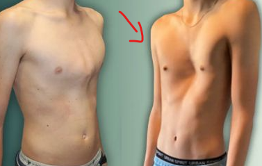
  

### 7v poika tippunut kiipeilytelineestä. Kuva humeruksesta. Diagnoosi? Hoito pth ja esh? {#7v-poika-humerus}

Ei esimerkkikuvaa; leikitään, että tämänlainen kuva olisi ollut kyseessä: 

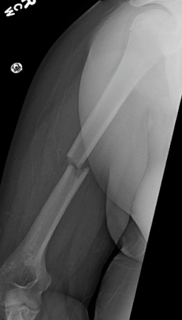

  <button class="solution-button"
          data-label="Vastaus"
          data-hide-label="Piilota vastaus">
    Vastaus
  </button>
  

Humeruksen diadyysimurtuma; hoidetaan yleensä konservatiivisesti. 30 asteen kulmavirhe kaikkiin suuntiin hyväksytään, jos kasvupyrähdystä ei vielä ole tapahtunut. Alle kouluikäisillä voidaan hyväksyä suurempikin asentovirhe.

Hoitona on rannekaulalenkki ja isommilla lapsilla tarvittaessa lisäksi yksilöllinen ortoosi. Kuukauden immobilisaatio on pääsääntöisesti riittävä murtuman tukevoitumiseksi. Tämän jälkeen voimakasta kuormitusta ja raajan varaan kaatumista tulisi välttää kahteen kuukauteen asti uusintamurtuman riskin vuoksi.

Murtuman asento tulee tarkistaa 1–2 viikon kuluttua hoidon aloittamisesta. Urheilukielto on 2–3 kuukauden ajan potilaan iästä ja urheilulajista riippuen.

Käytännössä sama hoito metafyysimurtumissakin (alla). Eli siis kantoside 3-4vk, kontrolliröntgenit ohjeista riippuen 1+4vk, liikuntakielto n. 2kk; pendelöinnit sallittu viikon jälkeen. Hyvinkin suuri virhekulma sallittu, koska hyvä remodelaatiokapasiteetti ja kyseessä pallonivel. 

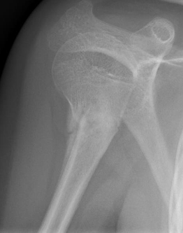

  

### 11-v tyttö, jolla rintarangan alueella skoliometrilla 9 asteen heitto. Mitä tutkit lisää kliinisesti? Mitä kuvantamisia tarvitaan esh:ssa? Hoitovaihtoehdot? {#Skoliometri-9-astetta}

  <button class="solution-button"
          data-label="Vastaus"
          data-hide-label="Piilota vastaus">
    Vastaus
  </button>
  

Skolioosin diagnostiikassa tärkeintä on status (ja nyt siis lisää tarvitaan varsinkin alaraajojen pituuseron arviointi) ja kuvantaminen 

Statuksessa aloitetaan vartalon symmetrian arvioimisella. Lisäksi on tärkeää mitata etutaivutuksessa (Adamsin testi) selkään piirtyvän kylkikohouman määrä asteina - tässä käytetään skoliometria. Aseta se tasaisesti selän poikki, kohtisuoraan selkärankaan nähden ja keskitettynä okahaarakkeiden päälle. Siirrä sitä hitaasti yläselästä alaselkään ja pysähdy jokaisen alueen kohdalla. Kirjaa suurin lukema ja sen sijainti. Merkintä ”8°, oikea rintaranka” on puolen vuoden kuluttua paljon hyödyllisempi kuin pelkkä ”8°”. Alaraajojen pituusero määritetään tarvittaessa lyhyemmän raajan alle asetettujen korotuspalojen avulla. **Poikkeava löydös skoliometrillä on >6º -> lähete erikoissairaanhoitoon lastenkirurgian poliklinikalle**

Jos skoliometrilukema on 7° tai enemmän, on perusteltua ottaa **skolioosiröntgenkuva seisten taka-etusuunnassa; sivukuvaa ei yleensä tarvita.** _Kuvaus voidaan periaatteessa tehdä perusterveydenhuollon lähetteellä, kannattaa tutustua oman alueen sopimuksiin porrastuksesta._ Kuvasta tarkistetaan Cobbin kulma (käyrän eniten kallellaan olevien äärinikamien päätelevyjen suuntaisiin viivoihin piirretään kohtisuorat, joiden leikkauskulma on haettu tulos) jonka ollessa >10 astetta on skolioosi diagnosoitu. Sen perusteella myös voidaan päätellä hoitolinjaa.  Lieväkin kivulias skolioosi tulee tutkia natiiviröntgenkuvien lisäksi myös magneettikuvauksella. Magneettikuvaus tehdään myös ennen leikkaushoitoa tai jos taudinkuva on poikkeava. Natiivirtg:n suhteen otetaan myös taivutuskuvia ennen leikkaushoitoa. 

**Skolioosin hoitovaihtoehtoja ovat seuranta, korsettihoito tai leikkaushoito.** Hoidon valinta riippuu käyrän suuruudesta, etenemisestä, sijainnista ja potilaan luustoiästä. Selän pituuskasvu on virheasennon etenemisen kannalta keskeisin ennusteellinen tekijä, ja siksi kasvuvaiheen arviointi on tärkeää virheasentopotilasta arvioitaessa. Tytöillä kuukautisten (menarche) alkaminen lopettaa nopeimman pituuskasvun ja on siksi erinomainen ennustetekijä selän pituuskasvun loppumiselle. Käden röntgenkuva soveltuu erinomaisesti kasvuvaiheen arviointiin. Lantion takasiiven kasvurustojen (Risserin apofyysit) ja selkänikaman rengasrustojen sulkeutumisen jälkeen kasvu on päättynyt, eikä skolioosin pahenemista enää tapahdu suuriasteisimpia muutoksia lukuun ottamatta.

<li><25 astetta -> seuranta</li>
<li>25-40 astetta kasvavalla lapsella -> korsetti; korsetti ei oikaise rankaa, mutta tavoitteena on ehkäistä muutoksen pahenemista</li>
<li>45 astetta (aikuisella >50) -> leikkaus; indikaatiorajan asettelu perustuu siihen, että yli 40 asteen skolioosi pyrkii edelleen kasvun päätyttyä hitaasti etenemään ja yli 60 asteen rintarangan skolioosiin liittyy merkittävä keuhkotilavuuden alenema. Hoitamattomaan yli 70 asteen skolioosiin liittyy merkittävästi kohonnut kuolleisuus. Leikkauksena posteriorinen luudutus tai torakoskooppinen Tethering-leikkaus</li>
<li>Voimistelu, fysioterapia ja manipulaatiohoidot ovat tehottomia</li>

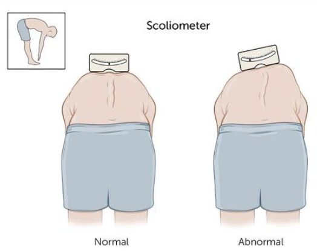
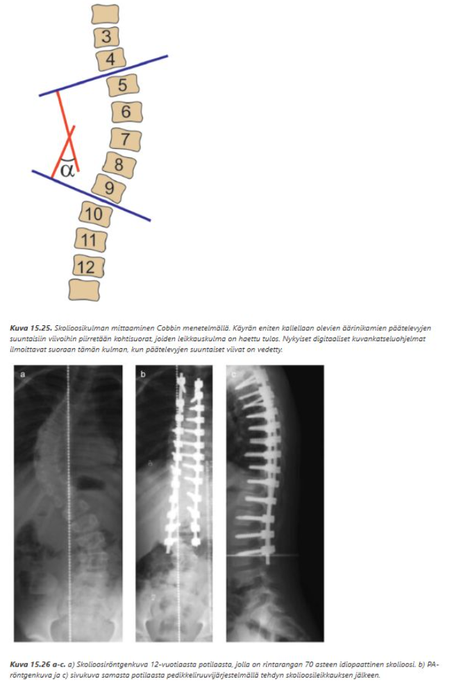
  

## 2020

### Humeruksen suprakondylaarinen murtuma, miten hoidat PTH:ssa ja ESH:ssa?

  <button class="solution-button"
          data-label="Vastaus"
          data-hide-label="Piilota vastaus">
    Vastaus
  </button>
  

Suprakondylaarinen humerusmurtuma käsittää yli puolet kaikista kyynärseudun vammoista lapsilla. Esiintyvyyshuippu on 5–10 ikävuoden välillä. 

Olkaluun suprakondylaarimurtuma syntyy lapsen kaatuessa tai pudotessa ojennetun yläraajan varaan siten, että kyynärnivel vääntyy yliojennukseen. Kyynärlisäke kampeaa olkaluun poikki fossa olecranin tasolta sen ohuimmasta kohdasta, jolloin murtuman distaalikappale taittuu/siirtyy taaksepäin. Anatomia siis altistaa. 

<li>Muita mahdollisia murtumia ovat lateraalikondyylin ja mediaalisen epikondyylin murtumat. Lateraalisen epikondyylin ja mediaalisen kondyylin murtumat ovat harvinaisia</li>
<li>Kasvukauden lopulla esiintyy nivelpintaan ulottuvia T-tyypin murtumia, joiden hoidossa voidaan käyttää levy- ja ruuvikiinnitystä</li>

---

Statuksessa tärkeää on kuten aina raajamurtumissa: verenkierto- ja hermostatus. 

<li>Käden verenkierron arvioiminen (väri, a. radialiksen palpaatio)</li>
  <ul>
    <li>Koska murtuma sijaitsee aivan kyynärnivelen yläpuolella, siinä on riski, että luun terävät päät tai turvotus painavat alueen tärkeitä verisuonia tai hermoja. Varsinkin dislokoituneissa suprakondylaarisissa humerusmurtumissa voi tapahtua a. brachialiksen vaurio, jonka takia verenkiertostatus on aina tärkeää tehdä. Tyypin 3 murtumassa (dislokoitunut huomattavasti) jopa 10-20%:ssa tapauksista ei radialis-pulssi tunnu (pulseless hand). **Kuitenkin käsi on tästä huolimatta yleensä lämmin ja pinkki (kollateraalivirtaus on hyvää), kapillaaritäyttö ok -> pink pulseless hand, jolloin verisuonikorjausta ei yleensä tarvita, hoito on murtuman nopea reduktio ja seuranta.** Jos kollateraalivirtaus ei kata perfuusiota ja käsi kylmä/kalpea/iskeeminen, niin verisuonikirurgia tarpeellista. Todellinen korjausta vaativa verisuonivamma vain 0.3%:lla. Jos pulssi ei palaudu heti reponoinnin jälkeen, niin voidaan seurantaa yleensä jatkaa; lähes aina palautuu (harvoin voidaan tehdä tarkempia kuvantamisia).</li>
  </ul>
<li>Toinen riski on antebrachiumin compartment-syndrooma, joka kuitenkin suhteellisen harvinainen (n. 0.1-0.3%)</li>
<li>Hermovamman riski on n. 15 % täysin dislokoituneissa murtumissa: tavallisimmin vaurioituu joko keski- (yleisin) tai värttinähermo (yleisimmin medianushermon haara nimeltään n. interosseus antebrachii anterior, joka hermottaa muutamia syviä lihaksia käsivarressa -> pareesi voi ilmentyä mm. flexor pollicis longus- ja radiaalisissa flexor digitorum profundus -lihaksissa -> ei pysty tehdä OK-merkkiä; ei paljoakaan tuntohermotusta -> ei tuntohäiriötä aina). Kyynärhermon vammat ovat usein valitettavasti iatrogeenisia.</li>

---

Suprakondylaariset murtumat luokitellaan yleensä seuraavasti: 

<li>tyyppi I, hyväasentoiset murtumat (ei siirtymää, korkeintaan minimaalinen kulmavirhe)</li>
<li>tyyppi II, murtumafragmentit ovat hyvässä kontaktissa, mutta distaalifragmentti on kallistunut taaksepäin</li>
<li>tyyppi III, täysin dislokoitunut murtuma</li>
<li>On vielä tyyppi IV, jossa murtuma on myös täysin dislokoitunut, mutta eroten tyypistä 3, niin ei ole ollenkaan tyypille 3 mahdollista vaihtelevan voimakasta pehmytkudossaranaa ja periostium on täysin sirkumferentiaalisesti revennyt</li>

---

Hoitoperiaatteet:

<li>**Hyväasentoiset murtumat (tyyppi I) immobilisoidaan rannekaulasidoksella kyynärnivel 120°:n fleksioon tai kulmalastalla 90°. Vanhemmat voivat itse poistaa rannekaulasidoksen 3-4 viikon kuluttua. Uusia röntgenkuvia tai kliinistä rutiinikontrollia ei tarvita, mikäli kyynärnivelen toiminta palautuu normaaliksi 2–3 kuukaudessa.**</li>
<li>Lievästi yhdessä tasossa anguloituneet tyypin II murtumat voi hoitaa kuten yllä, kuitenkin tyyppiä 1 useammin lastalla. Tällöin lapselle on syytä antaa kipulääkitys ennen rannekaulalenkin asentamista, koska kyynärnivelen koukistaminen 120°:een reponoi murtumaa ja aiheuttaa lapselle merkittävää kipua. Kyynärnivelen tiukka koukistus varmistaa murtuman luutumisen hyvään asentoon, eikä rannekaulalenkkiä saa näissä tapauksissa poistaa väliaikaisestikaan ennen murtuman lujittumista. Jos turvotus on merkittävää, kulmavirhettä on paljon/kahdessa tasossa, murtumassa on kompressiota tai jos harkitaan piikkikiinnitystä, murtuman asennon korjaus on syytä tehdä anestesiassa. Jos asennon korjaus tehdään leikkaussalissa (alkuvaiheessa tai kun asennon tarkistuksessa on todettu asennon pettäneen), murtuma kiinnitetään yleensä K-piikein ja tuetaan kulmalastaan.</li>
<li>**Tyypin III ja IV murtumat hoidetaan operatiivisesti piikkikiinnityksellä (avoin tai sulkeinen paikalleen asetus ja kiinnitys K-piikeillä).** Kulmalastaa pidetään piikkien poistoon asti. Urheilukielto on 2–3 kuukauden ajan potilaan iästä ja urheilulajista riippuen. _Huom! huomattavasti dislokoitunut murtuma tuetaan ensimmäisessä hoitopaikassa kulmalastalla pieneen fleksioon._ Murtumaa ei yritetä reponoida ensimmäisessä hoitopaikassa. Kyynärniveltä ei yritetä saada lastassa 90 asteen kulmaan.</li>

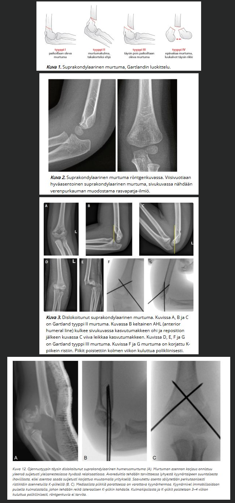
  

### Adoleskentti idiopaattinen skolioosi. Mitä tarkoittaa? Oireet, diagnostiikka, hoidon periaatteet? {#Nuoruusian-idiopaattinen-skolioosi}

  <button class="solution-button"
          data-label="Vastaus"
          data-hide-label="Piilota vastaus">
    Vastaus
  </button>
  

Normaali selkäranka on takaa katsottuna lähes suora. **Poikkeavuutta tästä eli selkärangan sivuttaista kaareutumista, johon liittyy kiertyminen, kutsutaan nimellä skolioosi eli selän vinous. Skolioosi on siis selkärangan kolmiulotteinen virheasento. Etu-takasuunnassa otetussa röntgenkuvassa nähdään nikamien välinen vinous, joka on määritelmän mukaan yli 10 astetta (Cobb-kulma).** Etu-takasuuntaisen vinouden lisäksi skolioosi tekee rankaan kiertymää.

Skolioosi on erittäin yleinen: suomessa skolioosi todetaan noin 1–3 %:lla nuorista (jopa 9%:lla suomalaistytöistä on lievä skolioosi; todetaan useammin tytöillä); hoitoa vaatii noin 0,2 % ikäluokasta. Skolioosi voi kehittyä pitkään ilman näkyviä vartalon muutoksia. Kouluterveydenhuollossa tehtävä ryhtitarkistus etutaivutuksin on keskeinen idiopaattisen (tuntemattomasta syystä johtuvan) skolioosin varhaisessa diagnoosissa. Skolioosi on alkuvaiheessa lähes aina kivuton. 

---

Skolioosi on yleensä idiopaattista ja se jaotellaan toteamisiän perusteella infantiiliin (imeväisiän, 0–3 v), juveniiliin (lapsuusiän, 4–10 v) ja adoleskenttiin (nuoruusiän, yli 10 v) tautimuotoon. **Nuoruusiän idiopaattinen skolioosi on lasten ja nuorten tavallisin leikkaushoitoa vaativa selkäsairaus.**

Voi myös olla synnynnäistä (nikamaepämuodostumista johtuvaa, esim. puolinikamat) tai sekundaarista (vammat, infektiot, tuumorit, alaraajojen pituusero, neuromuskulaariset ongelmat, Marfanin oireyhtymä yms.) 

Skolioosi voi sijaita pääosin rintarangan alueella (torakaalinen), rinta-lannerangan rajalla (torakolumbaalinen), lannerangan alueella (lumbaalinen) tai edellisten yhdistelmänä (torakaalinen ja lumbaalinen). Tyypillisessä idiopaattisessa skolioosissa torakaalinen käyristymä on oikealle konveksi ja lumbaalinen vasemmalle. Jos käyryydet ovat päinvastoin, on aihetta epäillä, että skolioosin taustalta löytyykin jokin etiologinen tekijä, esimerkiksi selkäytimen anomalia. 

---

**Skolioosin diagnostiikassa tärkeintä on status ja kuvantaminen.**

Statuksessa aloitetaan vartalon symmetrian arvioimisella. **Lisäksi on tärkeää mitata etutaivutuksessa (Adamsin testi) selkään piirtyvän kylkikohouman määrä asteina - tässä käytetään skoliometria.** Aseta se tasaisesti selän poikki, kohtisuoraan selkärankaan nähden ja keskitettynä okahaarakkeiden päälle. Siirrä sitä hitaasti yläselästä alaselkään ja pysähdy jokaisen alueen kohdalla. Kirjaa suurin lukema ja sen sijainti. Merkintä ”8°, oikea rintaranka” on puolen vuoden kuluttua paljon hyödyllisempi kuin pelkkä ”8°”. Alaraajojen pituusero määritetään tarvittaessa lyhyemmän raajan alle asetettujen korotuspalojen avulla. **Poikkeava löydös skoliometrillä on >6º -> lähete erikoissairaanhoitoon lastenkirurgian poliklinikalle**

Jos skoliometrilukema on 7° tai enemmän, on perusteltua ottaa **skolioosiröntgenkuva seisten taka-etusuunnassa; sivukuvaa ei yleensä tarvita.** _Kuvaus voidaan periaatteessa tehdä perusterveydenhuollon lähetteellä, kannattaa tutustua oman alueen sopimuksiin porrastuksesta._ Kuvasta tarkistetaan Cobbin kulma (käyrän eniten kallellaan olevien äärinikamien päätelevyjen suuntaisiin viivoihin piirretään kohtisuorat, joiden leikkauskulma on haettu tulos) jonka ollessa >10 astetta on skolioosi diagnosoitu. Sen perusteella myös voidaan päätellä hoitolinjaa.  Lieväkin kivulias skolioosi tulee tutkia natiiviröntgenkuvien lisäksi myös magneettikuvauksella. Magneettikuvaus tehdään myös ennen leikkaushoitoa tai jos taudinkuva on poikkeava. Natiivirtg:n suhteen otetaan myös taivutuskuvia ennen leikkaushoitoa. 

---

**Skolioosin hoitovaihtoehtoja ovat seuranta, korsettihoito tai leikkaushoito.** Hoidon valinta riippuu käyrän suuruudesta, etenemisestä, sijainnista ja potilaan luustoiästä. Selän pituuskasvu on virheasennon etenemisen kannalta keskeisin ennusteellinen tekijä, ja siksi kasvuvaiheen arviointi on tärkeää virheasentopotilasta arvioitaessa. Tytöillä kuukautisten (menarche) alkaminen lopettaa nopeimman pituuskasvun ja on siksi erinomainen ennustetekijä selän pituuskasvun loppumiselle. Käden röntgenkuva soveltuu erinomaisesti kasvuvaiheen arviointiin. Lantion takasiiven kasvurustojen (Risserin apofyysit) ja selkänikaman rengasrustojen sulkeutumisen jälkeen kasvu on päättynyt, eikä skolioosin pahenemista enää tapahdu suuriasteisimpia muutoksia lukuun ottamatta.

<li><25 astetta -> seuranta</li>
<li>25-40 astetta kasvavalla lapsella -> korsetti; korsetti ei oikaise rankaa, mutta tavoitteena on ehkäistä muutoksen pahenemista</li>
<li>45 astetta (aikuisella >50) -> leikkaus; indikaatiorajan asettelu perustuu siihen, että yli 40 asteen skolioosi pyrkii edelleen kasvun päätyttyä hitaasti etenemään ja yli 60 asteen rintarangan skolioosiin liittyy merkittävä keuhkotilavuuden alenema. Hoitamattomaan yli 70 asteen skolioosiin liittyy merkittävästi kohonnut kuolleisuus. Leikkauksena posteriorinen luudutus tai torakoskooppinen Tethering-leikkaus</li>
<li>Voimistelu, fysioterapia ja manipulaatiohoidot ovat tehottomia</li>

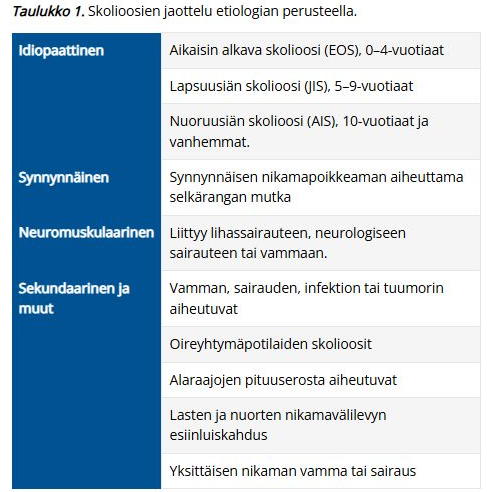

  

## 2019 

### Selitä lyhyesti: Malrotaatiovolvulus {#Malrotaatiovolvulus-selita}

  <button class="solution-button"
          data-label="Vastaus"
          data-hide-label="Piilota vastaus">
    Vastaus
  </button>
  

**Suolen epätäydellinen sikiöaikainen kiertyminen on tila, jota kutsutaan suolen virhekiertymäksi eli malrotaatioksi.** Malrotaatiossa suolen anatomia ja kiinnittyminen ovat poikkeavia. Ilmenee n. 1/500 lapsista, mutta oireita kehittyy vain osalle.

Ohutsuolen suolilieve on hyvin kapea ja altistaa sen vuoksi suolen kiertymälle (volvulus). **Volvulus = intraperitoneaalisen suolen kiertyminen sen oman suolilipeen (mesenteria) ympäri, mikä aiheuttaa verenkierron stranguloitumisen (ja sitä kautta infarktin) ja mekaanisen suoliobstruktion.**

Volvulus voi oireilla akuutisti tai kroonisesti.

<li>Akuutissa volvuluksessa lapsi voi huonosti, oksentelee sapen värjäämää nestettä. Pahimmillaan koko suolen verenkierto on estynyt, ja lapselle kehittyy metabolinen asidoosi. Akuutti muoto todetaan useimmiten ensimmäisten elinviikkojen aikana tai viimeistään ensimmäisen elinvuoden aikana (mahdollisesti kuitenkin myöhemmin)</li>
<li>Krooninen muoto voi paljastua missä iässä tahansa useimmiten toistuvien oksenteluepisodien selvittelyjen pohjalta. </li>

---

**Akuutti volvulus on aina kirurginen hätätilanne, ja sitä pitäisi epäillä aina, jos imeväisellä esiintyy vihertäviä oksennuksia ilman muuta selittävää syytä.**

<li>**Diagnoosi saadaan ruuansulatuskanavan suolistovarjoainekuvalla (passage-tutkimus)**</li>

---

**Volvuluksen hoito on kirurginen (Laddin leikkaus):** laparotomiassa kierre vapautetaan ja kapea suolilieve pyritään levittämään mahdollisimman leveäksi. Tyypillisesti appendix poistetaan samalla, koska Laddin toimenpiteessä suolisto järjestellään uudelleen siten, että ohutsuoli sijoitetaan vatsaontelon oikealle puolelle ja paksusuoli vasemmalle puolelle. Tämän seurauksena umpilisäke jää vatsan vasemmalle puolelle (normaalin oikean alavatsan sijaan). Poistaminen vähentää tulevaisuudessa appendisiitin diagnosointiongelmia. 

Suolta ei kiinnitetä paikalleen, vaan suolen uudelleenasettelu ja uusiutuvien kiertymien ehkäisy perustuu täysin suoliliepeen (mesenteriumin) leventämiseen ja anatomiseen uudelleenjärjestelyyn. Riski uusiutumiselle on lähteestä riippuen n. 2-10%.

Leikkaus tehdään päivystyksellisesti niin nopeasti kuin ehditään. Pahimmillaan diagnoosin viivästyessä voidaan suolen kuolion vuoksi joutua laajoihinkin suolen poistoihin, mikä johtaa lyhytsuolioireyhtymään.

<li>Jos malrotaatio todetaan sattumalöydöksenä jonkin muun syyn takia tehdyn kuvantamisen yhteydessä, niin voidaan joskus ehdottaa potilaalle preventiivistä leikkausta, mutta useimmiten tästä jättäydytään varsinkin aikuisten kohdalla. Potilasta ohjeistetaan tulemaan nopeasti sairaalaan äkillissä vatsakipuoireiluissa ja silloin tilanne kuvannetaan volvuluksen diagnosoimiseksi</li>

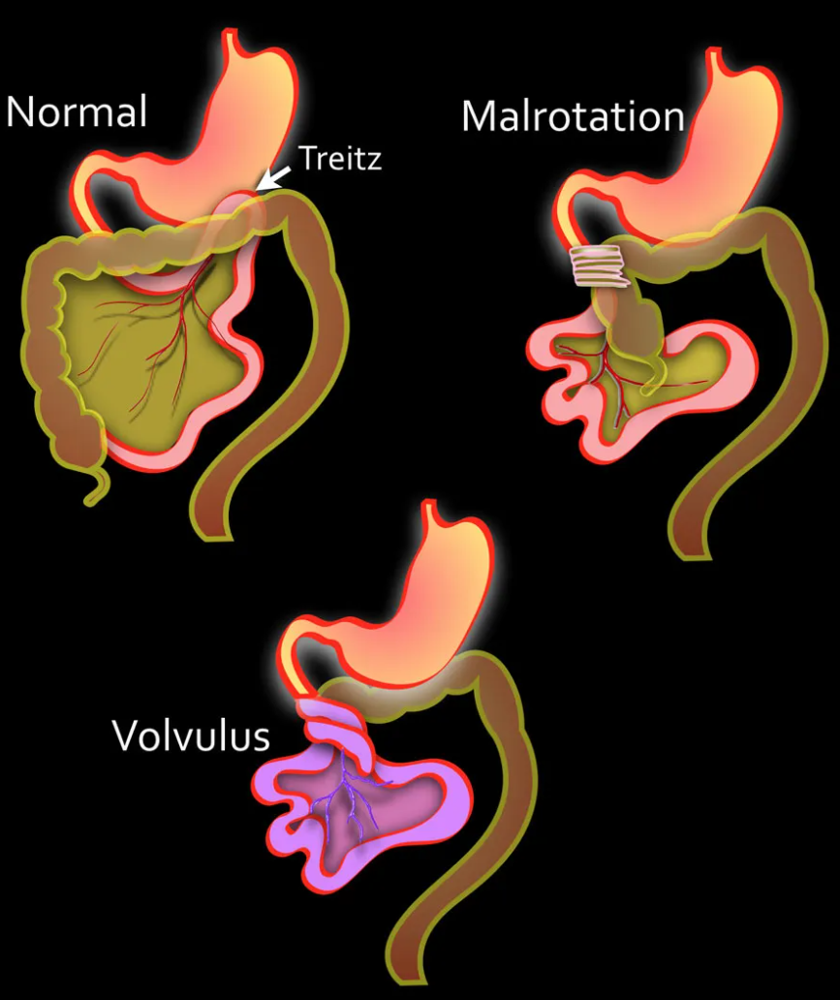

  

### Gastroskiisin ja omfaloseelen vertailu taulukossa

Ei tarvitse nyt taulukkoa täyttää, mutta mieti eroja mielessäsi. 

  <button class="solution-button"
          data-label="Vastaus"
          data-hide-label="Piilota vastaus">
    Vastaus
  </button>
  

Sijainti: Gastroskiisi sijaitsee paraumbilikaalisesti lähinnä navan oikealla puolella. Omfaloseele taas sijaitsee suoraan napanuoran tyvessä keskilinjassa napa-aukossa. 

Suojakalvo: **Gastroskiisi (vatsahalkio) on synnynnäinen rakennehäiriö, jossa sisäelimet työntyvät ulos vatsaontelosta anteriorisesti ilman suojaavaa kalvopussia. Vrt. omfaloseelessä (napanuoratyrä) taas työntyvää suolistoa ympäröi kalvopussi.**

_Tyräytyneet elimet: Gastroskiisissä maksa ei juuri koskaan tyräydy, pääasiassa ohut- ja paksusuolta. Omfaloseelessä taas suoliston lisäksi mm. maksa, perna ja munasarjat/kivekset aika usein tyräytyvät._ 

Suolen kunto synnyttäessä: Gastroskiisissa usein turvonnut ja paksuuntunut sekä katteinen, koska sisältö vapaassa kosketuksessa sikiöveteen. Omfaloseelessä kalvo suojaa sikiöveden ärsytykseltä ja on hyvässä kunnossa.

**Liitännäissairaudet: Gastroskiisissä harvinaisia (<10%) ja rajoittuvat lähinnä suoliston kehityshäiriöihin. Omfaloseelessä erittäin tavallisia ja mm. trisomiat, vakavat sydänviat yms ovat yleisiä.** 

Sikiöseulonta: Gastroskiisissa äidin seerumin ja sikiöveden alfa-fetoproteiini (AFP) erittäin korkea (suora yhteys sikiöveteen sikiön sisäelimistä), omfaloseelessä koholla matalammin. 

Synnytystapa: Molemmat voidaan periaatteessa synnyttää alatieteitse, suurissa omfaloseeleissä maksarepeämän ehkäisemiseksi usein keisarileikkauksella. 

Ennuste: Molemmissa isoloituna erinomainen; riippuu liitännäissairauksista. 

  

## 2018 

### Vastasyntynyt, joka pyörittelee sylkeä suussa, kröhii ymym., nenämahaletku ei mene kuin 10 cm perille. Mikä dg, mitä teet, miten hoidat ja mitä kerrot vanhemmille? {#Nenamahaletku-ei-etene}

  <button class="solution-button"
          data-label="Vastaus"
          data-hide-label="Piilota vastaus">
    Vastaus
  </button>
  

Vastasyntyneen limaisuus, hengitysvaikeudet, kuolaaminen ja maidon välitön oksentaminen sekä erityisesti se, ettei nenämahaletku etene pitkälle, viittaavat vahviten **esofagusatresiaan.**

**Diagnoosi tehdään lapsen natiiviröntgenkuvauksella, jossa nenä-mahaletku pysähtyy 10–13 cm:n päähän hammasrivistä (kuva otetaan siis niin, että röntgenpositiivinen letku on asetettu).** Ilman näkyminen suolistossa viittaa ruokatorven alaosan ja henkitorven väliseen fisteliin ja ilmaton suolisto fistelin puuttumiseen.

Atresia voidaan siis jakaa viiteen anatomiseen ryhmään A-E. Yleisin tyyppi on C, jossa on esofagusatresia ja alasegmentin fisteli. 

Taas henkitorvifisteli ilman atresiaa aiheuttaa hengitysvaikeuksia syödessä ja keuhkokuumeita. Diagnoosi tehdään tähystyksellä tai varjoainekuvauksella usein vasta imeväisiässä. Synnynnäinen ruokatorvistenoosi on usein rustoinen ruokatorven alaosan ahtautuma. Synnynnäinen ruokatorvistenoosi hoidetaan pallolaajennuksella tai resektiolla.

---

Yli puolella potilaista on muita kehityspoikkeamia sydämessä (20 %), maha-suolikanavassa (15 %), virtsa- ja sukupuolielimissä (15 %), tuki- ja liikuntaelimissä (> 50 %), kasvojen ja pään alueella (10 %, suulakihalkio, nenä-nieluaukon atresia, korva-kehityspoikkeamat, keskushermostossa (5–10 %) ja kromosomeissa (5 %).

Ruokatorviatresia liittyy yhtenä osana VACTERL-assosiaatioon (Vertebral, Cardiovascular, Anal, Tracheoesophageal, Renal, Limbs). 

**Usein tehdään sydämen UÄ ennen leikkausta liitännäisvikojen selvittelyksi.**

---

Hoito: 

<li>**Syöttökielto aspiraation vuoksi.** Suonensisäinen glukoosi- ja elektrolyyttihoito tarvittaessa preoperatiivisesti. Aspiraatiopneumonian ehkäisyyn usein antibioottisuoja. </li>
<li>**Asetetaan puoli-istuvaan/istuvaan asentoon. Yläsegmentti tyhjennetään syljestä jatkuvalla imulla.**</li>
<li>Vältetään ylipainehengitystä, jos lapsi tarvitsee hengitystukea. Ylipaine voi täyttää henkitorvifistelin kautta suolen ilmalla, mikä vaikeuttaa hengitystä edelleen ja saattaa johtaa mahalaukun puhkeamiseen.</li>
<li>**Valmistellaan välitön siirto yliopistosairaalan lastenkirurgiseen yksikköön. Leikkaus tehdään ensimmäisen elinvuorokauden aikana,** jolloin ruokatorven ylä- ja alaosan yhdistäminen on useimmiten mahdollista tapauksissa, joissa ruokatorven alaosan ja henkitorven välillä on fisteli. Ruokatorveen jätetään nenä-mahaletku. Ravitsemus aloitetaan 1–3 päivän kuluttua ensin nenä-mahaletkun kautta.</li>
  <ul>
    <li>Hyvin pienipainoiselta ja huonokuntoiselta keskoselta on ensimmäisessä leikkauksessa turvallisempaa sulkea vain henkitorvifisteli ja korjata ruokatorvi myöhemmin.</li>
    <li>Tapauksissa, joissa ruokatorven alaosan ja henkitorven välinen fisteli puuttuu, lapsen annetaan kasvaa sylki-imun ja gastrostoomaan annettavan ravitsemuksen avulla. 2–4 kuukauden kuluttua ruokatorven päät yhdistetään joko suoraan, käyttämällä verisuonivarrellista ohutsuolisiirrettä tai yhdistämällä ruokatorven yläosa välikarsinaan nostettuun mahalaukkuun.</li>
  </ul>

---

Vanhemmille voi kertoa (ainakin diagnoosin jälkeen), että vauvalla on todettu synnynnäinen rakennevirhe ruokatorvessa, jota kutsutaan ruokatorven atresiaksi. Tarkoittaa, että ruokatorvi ei ole kehittynyt yhtenäiseksi putkeksi suusta mahaan asti, vaan se päättyy umpipussiin. Tämän vuoksi nielty sylki ei pääse mahaan, vaan kertyy suuhun ja aiheuttaa yskimistä ja kröhimistä. Tämän vuoksi vauvaa ei saa nyt syöttää suun kautta, jotta maito ei pääsisi keuhkoihin. Vauva saa nyt tarvitsemansa nesteet suoraan verisuoneen ja siirrämme vauvan lastenkirurgiseen yliopistosairaalaan, jossa rakennevirhe arvioidaan tarkemmin ja voidaan korjata leikkauksella. Tulokset ovat nykyään hyviä. 

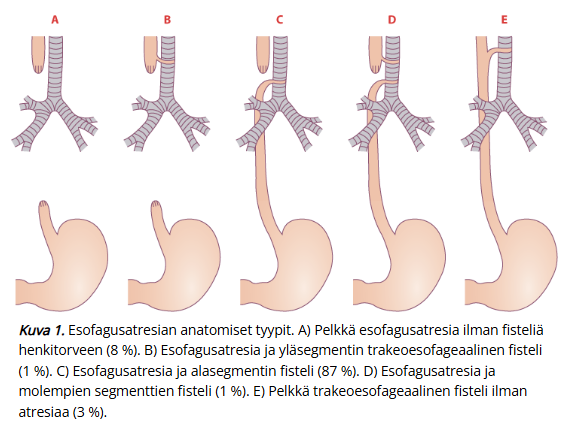
  

### Selitä lyhyesti - Palleatyrä {#Palleatyra-selita}

  <button class="solution-button"
          data-label="Vastaus"
          data-hide-label="Piilota vastaus">
    Vastaus
  </button>
  

Lapsella palleatyrä voi olla joko vakava, jo syntymässä todettu synnynnäinen palleatyrä tai harvinaisempi myöhemmin ilmenevä hiatustyrä. 

Aikuisilla palleatyrä on yleensä ns. hiatushernia, mahalaukun osa luisuu pallean ruokatorvihiatuksen läpi. Hiatushernioiden katsotaan aikauisilla olevan tavallisesti hankittuja, eli ne ovat kehittyneet kudosten löystymisen seurauksena ajan myötä. Normaalitilanteessa ruokatorvi kulkee palleassa olevan hiatusaukon kautta vatsaontelon puolelle. Vatsaontelon puolelle ruokatorvea ulottuu normaalitilanteessa hiatusaukon läpi vähintään 2 cm. Tällöin mahalaukun kardia muodostaa jyrkän kulman ruokatorven kanssa toimien takaiskuventtiilin tavoin vatsaontelon paineen lisääntyessä ja estäen näin refluksia mahalaukusta ruokatorveen.

---

Synnynnäinen palleatyrä (Congenital Diaphragmatic Hernia, CDH) tarkoittaa kehityspoikkeamaa, jossa palleaan jää vaihtelevan kokoinen posterolateraalinen (Bochdalekin tyrä; yleisempi) tai anteriorinen aukko (Morgagnin tyrä). Esiintyvyys on noin 1:3 000 elävänä syntynyttä lasta.

**Sallii suoliston ja pernan sekä joskus mahalaukun ja maksan työntymisen rintaonteloon. Tähän liittyy keuhkojen vajavainen kehitys ja keuhkoverenkierron suurentunut vastus molemmissa keuhkoissa. Palleatyrä aiheuttaa yleensä vastasyntyneelle nopeasti merkittävän hengitysvajauksen.**

Palleatyrä näkyy sikiöllä ultraäänitutkimuksessa 20.–24. raskausviikon kohdalla ja noin 60 %:ssa tapauksista diagnoosi tehdään ennen syntymää.

---

Maksan työntyminen rintaonteloon ja raskausviikkoihin nähden pieni keuhkotilavuus korreloivat syntymänjälkeiseen kuolleisuuteen. Sikiöaikana todettuun palleatyrään liittyy merkittävä syntymänjälkeisen menehtymisen riski ja siksi synnytykset tulee keskittää keskukseen, jossa on kaikki tarvittavat valmiudet palleatyrän hoitoon. Jotta sikiön keuhkojen kypsyminen olisi mahdollisimman pitkällä ennen syntymää, raskautta pyritään jatkamaan yli 38. raskausviikon.

Syntymän jälkeen hengityksen tukihoidossa pyritään välttämään korkeita hengitystiepaineita ja näin estämään keuhkojen painevamma ja ilmarinta. Tehohoidossa käytetään tavallista tai korkeataajuista hengityskonehoitoa yhdistettynä lääkehoitoon (typpioksiduuli, sildenafiili ja milrinoni) keuhkoverenpaineen ja sydämen oikean kammion kuormituksen vähentämiseksi. Huonontuva happeutuminen ja kaasujen vaihto ja jatkuva epävakaa tila voivat vaatia kehonulkoista happeutusta (ECMO).

Palleatyrä pyritään leikkaamaan vasta potilaan tilan vakiinnuttua ja keuhkoverenkierron vastuksen vähennyttyä. Yli puolet potilaista tarvitsee palleaan keinoainepaikan. Syntymän jälkeinen kuolleisuus on 20–30 % parhaissakin keskuksissa. Myöhäissairastavuutta aiheuttavat palleatyrän uusiminen, krooninen hengitysvajaus, gastroesofageaalinen refluksi ja tukirangan ongelmat.

Morgagnin tyrässä tai pienessä Bochdalekin tyrässä suoliston työntyminen rintaonteloon voi olla vähäistä tai tapahtua vasta syntymän jälkeen, jolloin sikiön keuhkot kehittyvät normaalisti. Röntgenkuvassa näkyvä toisen puolen pallean kohoasento voi johtua palleaeventraatiosta tai pallearelaksaatiosta. Palleaeventraatio johtuu kalvomaisesta pallealihaksen keskusosasta ja pallearelaksaatio taas palleahermon iatrogeenisesta vauriosta. Oireinen palleaeventraatio tai pallearelaksaatio tulee hoitaa pallean kiristysompeleilla ensimmäisen ikävuoden aikana ja aikaisemmin, mikäli hengityksen tukihoitojen tarve pitkittyy.

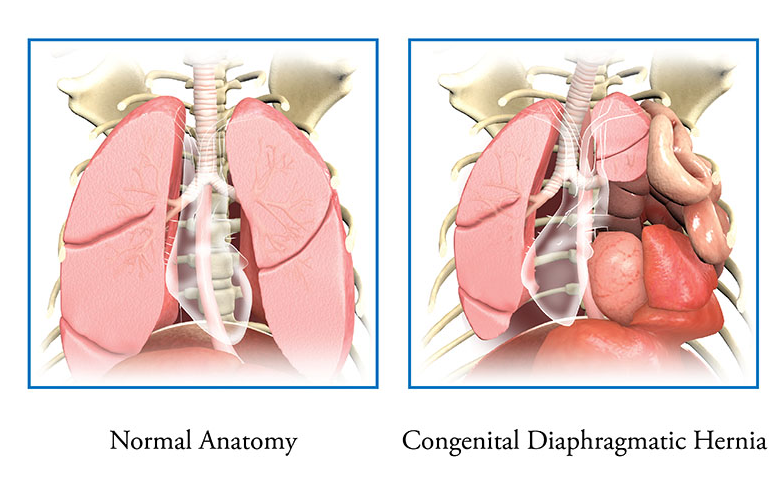
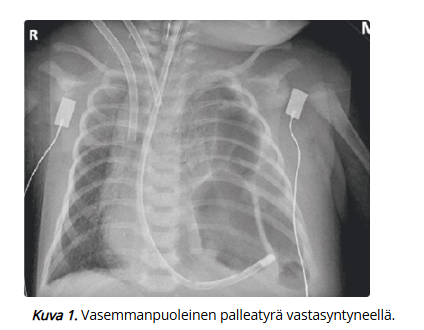
  

### 3 vko ikäinen vauva, oksentelee sappimaisia oksennuksia. Mitä epäilet, miten hoidat, mitä kerrot vanhemmille? {#3vk-sappimaiset-oksennukset}

  <button class="solution-button"
          data-label="Vastaus"
          data-hide-label="Piilota vastaus">
    Vastaus
  </button>
  

Vastasyntyneen tai imeväisen sappimainen (vihreä tai keltavihreä) oksennus on aina päivystysluonteinen lastenkirurginen hätätilanne, kunnes toisin todistetaan. Sappitiet avautuvat pohjukaissuoleen (Papilla Vateri), joten sappimainen oksennus tarkoittaa aina sitä, että suoliston tukos sijaitsee tämän kohdan distaalipuolella.

Ensisijainen ja tärkein epäily on **volvulus** (malrotaatiovolvulus) eli sikiöaikainen suoliston kiertymishäiriö, jossa ohutsuolen lieve jää kapeaksi ja suoli pääsee kiertymään itsensä ympäri. Tämä johtaa nopeasti ohutsuolen verenkierron estymiseen, iskemiaan ja kuolioon. Akuutti volvulus  todetaan useimmiten ensimmäisten elinviikkojen aikana tai viimeistään ensimmäisen elinvuoden aikana (mahdollisesti kuitenkin myöhemmin).

Myös mm. sepsis, vaikea ummetus, kureutunut tyrä yms voi olla taustalla. 

---

**Konsultoidaan lastenkirurgia. Hoito kuuluu välittömästi lastenkirurgiseen yksikköön.** Ei mitään suun kautta. Nenämahaletkulla dekompressio. Asetetaan iv-yhteys ja isotoninen iv-nestehoito. 

Kultainen standardi malrotaation ja volvuluksen toteamiseksi on varjoainekuva (passage). 

---

**Volvuluksen hoito on kirurginen (Laddin leikkaus):** laparotomiassa kierre vapautetaan ja kapea suolilieve pyritään levittämään mahdollisimman leveäksi. Tyypillisesti appendix poistetaan samalla, koska Laddin toimenpiteessä suolisto järjestellään uudelleen siten, että ohutsuoli sijoitetaan vatsaontelon oikealle puolelle ja paksusuoli vasemmalle puolelle. Tämän seurauksena umpilisäke jää vatsan vasemmalle puolelle (normaalin oikean alavatsan sijaan). Poistaminen vähentää tulevaisuudessa appendisiitin diagnosointiongelmia. 

Suolta ei kiinnitetä paikalleen, vaan suolen uudelleenasettelu ja uusiutuvien kiertymien ehkäisy perustuu täysin suoliliepeen (mesenteriumin) leventämiseen ja anatomiseen uudelleenjärjestelyyn. Riski uusiutumiselle on lähteestä riippuen n. 2-10%.

Leikkaus tehdään päivystyksellisesti niin nopeasti kuin ehditään. Pahimmillaan diagnoosin viivästyessä voidaan suolen kuolion vuoksi joutua laajoihinkin suolen poistoihin, mikä johtaa lyhytsuolioireyhtymään.

<li>Jos malrotaatio todetaan sattumalöydöksenä jonkin muun syyn takia tehdyn kuvantamisen yhteydessä, niin voidaan joskus ehdottaa potilaalle preventiivistä leikkausta, mutta useimmiten tästä jättäydytään varsinkin aikuisten kohdalla. Potilasta ohjeistetaan tulemaan nopeasti sairaalaan äkillissä vatsakipuoireiluissa ja silloin tilanne kuvannetaan volvuluksen diagnosoimiseksi</li>

---

Vanhemmille voi kertoa, että sappimainen oksennus on merkki mahdollisesti vaarallisesta ruuansulatuskanavan tukoksesta ja aina tulee epäillä suoliston kiertymää, joka vaatii välitöntä lastenkirurgin arviota ja jatkotutkimuksia. Siirrämme vauvan välittömästi yliopistosairaalaan, jossa tehdään tarkemmat tutkimukset ja mahdollisesti operatiivinen hoito. 

  

## 2017

### Esofagusatresia: oirekuva, luokittelu, hoito

  <button class="solution-button"
          data-label="Vastaus"
          data-hide-label="Piilota vastaus">
    Vastaus
  </button>
  

**Oireena ovat vastasyntyneen limaisuus, hengitysvaikeudet, kuolaaminen ja maidon välitön oksentaminen.** Nenä-mahaletku ei etene yleensä pitkälle. Ruokatorviatresian ilmaantuvuus on 1:2 500–3 000 elävänä syntynyttä.

Atresia voidaan siis jakaa viiteen anatomiseen ryhmään A-E: A) Pelkkä esofagusatresia ilman fisteliä henkitorveen (8 %). B) Esofagusatresia ja yläsegmentin trakeoesofageaalinen fisteli (1 %). **C) Esofagusatresia ja alasegmentin fisteli (87 %).** D) Esofagusatresia ja molempien segmenttien fisteli (1 %). E) Pelkkä trakeoesofageaalinen fisteli ilman atresiaa (3 %).

Taas henkitorvifisteli ilman atresiaa aiheuttaa hengitysvaikeuksia syödessä ja keuhkokuumeita. Diagnoosi tehdään tähystyksellä tai varjoainekuvauksella usein vasta imeväisiässä. Synnynnäinen ruokatorvistenoosi on usein rustoinen ruokatorven alaosan ahtautuma. Synnynnäinen ruokatorvistenoosi hoidetaan pallolaajennuksella tai resektiolla.

---

**Diagnoosi tehdään lapsen natiiviröntgenkuvauksella, jossa nenä-mahaletku pysähtyy 10–13 cm:n päähän hammasrivistä (kuva otetaan siis niin, että röntgenpositiivinen letku on asetettu).** Ilman näkyminen suolistossa viittaa ruokatorven alaosan ja henkitorven väliseen fisteliin ja ilmaton suolisto fistelin puuttumiseen.

---

Yli puolella potilaista on muita kehityspoikkeamia sydämessä (20 %), maha-suolikanavassa (15 %), virtsa- ja sukupuolielimissä (15 %), tuki- ja liikuntaelimissä (> 50 %), kasvojen ja pään alueella (10 %, suulakihalkio, nenä-nieluaukon atresia, korva-kehityspoikkeamat, keskushermostossa (5–10 %) ja kromosomeissa (5 %).

Ruokatorviatresia liittyy yhtenä osana VACTERL-assosiaatioon (Vertebral, Cardiovascular, Anal, Tracheoesophageal, Renal, Limbs). 

**Usein tehdään sydämen UÄ ennen leikkausta liitännäisvikojen selvittelyksi.**

---

Hoito: 

<li>**Syöttökielto aspiraation vuoksi.** Suonensisäinen glukoosi- ja elektrolyyttihoito tarvittaessa preoperatiivisesti. Aspiraatiopneumonian ehkäisyyn usein antibioottisuoja. </li>
<li>**Asetetaan puoli-istuvaan/istuvaan asentoon. Yläsegmentti tyhjennetään syljestä jatkuvalla imulla.**</li>
<li>Vältetään ylipainehengitystä, jos lapsi tarvitsee hengitystukea. Ylipaine voi täyttää henkitorvifistelin kautta suolen ilmalla, mikä vaikeuttaa hengitystä edelleen ja saattaa johtaa mahalaukun puhkeamiseen.</li>
<li>**Valmistellaan välitön siirto yliopistosairaalan lastenkirurgiseen yksikköön. Leikkaus tehdään ensimmäisen elinvuorokauden aikana,** jolloin ruokatorven ylä- ja alaosan yhdistäminen on useimmiten mahdollista tapauksissa, joissa ruokatorven alaosan ja henkitorven välillä on fisteli. Ruokatorveen jätetään nenä-mahaletku. Ravitsemus aloitetaan 1–3 päivän kuluttua ensin nenä-mahaletkun kautta.</li>
  <ul>
    <li>Hyvin pienipainoiselta ja huonokuntoiselta keskoselta on ensimmäisessä leikkauksessa turvallisempaa sulkea vain henkitorvifisteli ja korjata ruokatorvi myöhemmin.</li>
    <li>Tapauksissa, joissa ruokatorven alaosan ja henkitorven välinen fisteli puuttuu, lapsen annetaan kasvaa sylki-imun ja gastrostoomaan annettavan ravitsemuksen avulla. 2–4 kuukauden kuluttua ruokatorven päät yhdistetään joko suoraan, käyttämällä verisuonivarrellista ohutsuolisiirrettä tai yhdistämällä ruokatorven yläosa välikarsinaan nostettuun mahalaukkuun.</li>
  </ul>

  

### Selitä lyhyesti: Miten avomurtuman hoito eroaa umpimurtuman hoidosta? {#Avomurtuma-miten-eroaa}

  <button class="solution-button"
          data-label="Vastaus"
          data-hide-label="Piilota vastaus">
    Vastaus
  </button>
  

Avomurtuman ja umpimurtuman hoidon keskeisin ero johtuu korkeasta infektioriskistä sekä pehmytkudosvaurion vakavuudesta. Avomurtuma on myös kirurgisesti kiireellisempi. 

Avomurtumassa tarvitaan iv-antibiootti välittömästi, kun siihen on mahdollisuus. Samoin jäykkäkouristussuoja tulee tarkistaa ja tarvittaessa tehostaa. 

Avomurtuman alkuhoito lapsilla päivystyksessä:

<li>Mahdollinen verenvuoto pyritään tyrehdyttämään kompressiolla, ja verityhjiötä käytetään vain, mikäli vuotoa ei saada hallittua muuten.</li>
<li>Avomurtuma-alue huuhdellaan, irtolika voidaan poistaa</li>
<li>Vamma-alue peitetään steriileillä taitoksilla ja raaja lastoitetaan (raaja voidaan vetää pituussuunnassa suoraksi, tosin väkisin ei kannata vetää eikä sinänsä reponoida; luun paloja ei myöskään saa yrittää survoa väkisin takaisin sisälle)</li>
<li>Antibioottihoito (yleensä käytetään 2. polven kefalosporiinia (kefuroksiimi) ja penisilliiniallergisille klindamysiiniä; metronidatsoli liitetään mikäli epäillään anaerobista kontaminaatiota (maatalousvammat tai rautatievammat)) aloitetaan välittömästi, kun siihen on mahdollisuus</li>
<li>Jäykkäkouristusrokotuksen voimassaolo varmistetaan ja annetaan tarvittaessa tehosteannos</li>

---

Potilas leikataan välittömästi, mikäli potilaalla on

<li>muita henkeä tai toimintakykyä uhkaavia vammoja, jotka vaativat leikkauksen</li>
<li>kompressioon reagoimaton verenvuoto tai todettu tai epäilty leikkaushoitoa vaativa verisuonivamma</li>
<li>epäily lihasaitiopaineoireyhtymästä</li>
<li>erittäin kontaminoitunut haava</li>

---

Muut kuin edellä kuvatut potilaat voidaan yleensä leikata viimeistään seuraavana aamuna ensisijaisesti ortopedin ja plastiikkakirurgin yhteistyönä. Leikkaussalissa vamma-alue puhdistetaan huolellisesti kirurgisesti ja huuhdellaan matalapaineisella keittosuolahuuhtelulla. Aitiopaineoireyhtymää epäiltäessä kaikki säären lihasaitiot tarkistetaan ja tehdään tarvittaessa faskiotomiat. Laajoja viiltoja tehtäessä tulee huomioida haavan sijainti sekä mahdolliset murtumakorjaukseen tarvittavat avaukset.

Pienienergiaiset vammat, joihin ei liity laajaa pehmytkudosvammaa (Gustilon–Andersonin gradus 1–2), voidaan hoitaa yleensä yksivaiheisesti. Huolellisen puhdistuksen jälkeen murtuma korjataan ja haava suljetaan. Suurienergiaiset vammat (Gustilon–Andersonin gradus 3A-C) vaativat pääsääntöisesti vaiheistetun hoidon; tarvittaessa eksternifiksaatio. Lopullinen murtuman kiinnitys toteutetaan samassa leikkauksessa kuin haavan pysyvä sulku. Suurienergiaiset vammat vaativat usein haavan sulun paikallisella tai mikrovaskulaarisella kielekkeellä.

  

### Selitä lyhyesti: Napatyrä {#Napatyra}

  <button class="solution-button"
          data-label="Vastaus"
          data-hide-label="Piilota vastaus">
    Vastaus
  </button>
  

Napatyrät (hernia umbilicalis) johtuvat suolen sisällön työntymisestä naparenkaan (anulus umbilicalis) läpi. Vastasyntyneellä on valkeassa jännesaumassa (linea alba) napanuoran mentävä reikä, jota ympäröi naparengas (annulus umbilicalis). Syntymän jälkeen napatyrä on melko yleinen, mutta ensimmäisten elinvuosien aikana reikä yleensä pienenee ja tyrä häviää itsestään. 

Napatyrä on sormenpäällä tunnettavissa oleva aukko navan kohdalla. **Napatyrä aiheuttaa erittäin harvoin oireita, vaikka saattaa lapsen itkiessä olla kookaskin (perussääntö on, että tyrä pullistuu koska lapsi huutaa, ei päinvastoin)**. Jos napatyrästä on oikeasti vaivoja tai tyräportti on suuri, voidaan leikkaus tehdä normaalia aiemmin.

<li>Pienet napatyrät paranevat itsestään, ja jos tyräportin läpimitta on alle 1,5 cm, yli 90 % tyristä paranee. </li>
<li>**Napatyrän kuroutumisen ollessa harvinaista seuranta viiteen ikävuoteen asti on perusteltua. Tyrä leikataan ennen kouluikää, jos se on vielä jäljellä.**</li>

---

Paraumbilikaalinen tyrä muistuttaa päällepäin napatyrää. Faskiadefekti ei ole navassa, vaan juuri sen vieressä/yläpuolella (tuntuu tyräportin palpaatiossa). Päinvastoin kuin napatyrä, paraumbilikaalinen tyrä ei ole sinänsä luonnollinen sikiöaikaisten rakenteiden jatkumo eikä siten parane itsestään vaan hoidetaan päiväkirurgisesti noin vuoden iässä.

Navan yläpuolella keskiviivassa oleva epigastrinen tyrä jää usein tunnistamatta. Keskiviivan faskiassa on aukko, jossa tuntuu pieni patti silloin tällöin tai jatkuvasti ja reikiä voi olla useampi kuin yksi. Patti on useimmiten faskia-aukosta luiskahtavaa preperitoneaalista rasvaa. Jos epigastrinen tyrä aiheuttaa kipuja tai häiritsee kosmeettisesti, hoidetaan se päiväkirurgisesti.

Vielä yksi vatsan alueen "tyrä" on rektusdiastaasi, jolla tarkoitetaan linea alban elastisuutta, joka aiheuttaa ylävatsalle etenkin ponnistaessa ilmaantuvan harjannemaisen kohouman. Se ei vaadi hoitoa, vaan paranee itsestään vatsalihasten kehittymisen myötä.

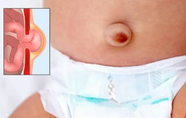
  

### Murtumakuva. Miten tutkit, mikä diagnoosi, miten hoidat PTH ja ESH?

Ei esimerkkikuvaa wikissä, mutta tässä wikin mukaisen vastauksen perusteella valittu kuva. 

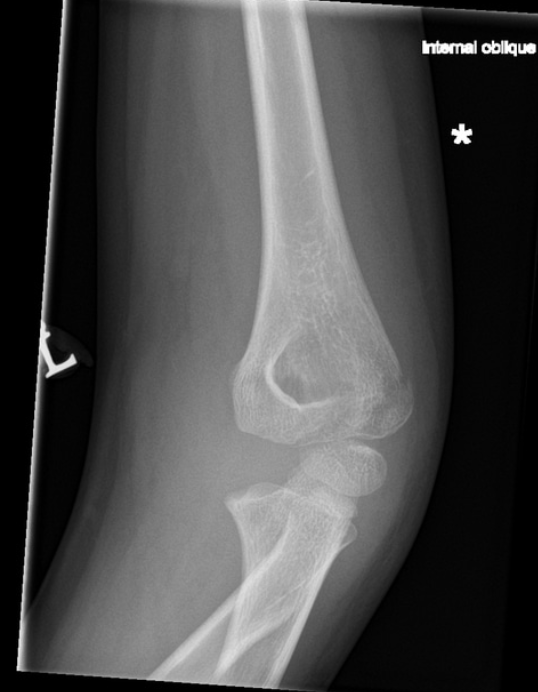

  <button class="solution-button"
          data-label="Vastaus"
          data-hide-label="Piilota vastaus">
    Vastaus
  </button>
  

Humeruksen lateraalikondyylin murtuma; on toiseksi yleisin kyynärpäämurtuma (suprakondylaarinen yleisin). 

Yleensä mekanismina avulsiomurtuma: kaatuminen ojennetuille käsille ojennetun kyynärnivelen vääntyessä varukseen aksiaalisesti kuormitettuna. Myös valgusväännön aiheuttama murtuma on mahdollinen; tällöin värttinäluun pää talttaa kapitellumin irti.

Murtuma on vaikea diagnosoida röntgenkuvasta pienillä lapsilla. Etu- ja sivukuvien lisäksi viisto projektio voi paljastaa mahdollisen siirtymän. Etenkin pienillä lapsilla nivelpinnan siirtymän arvioiminen on haastavaa, koska värttinänastan (capitellum humeri) luutumistumake ei näy vielä röntgenkuvissa

Murtuma yltää yleensä nivelrakoon ja on luonteeltaan epävakaa -> **hoito on yleensä operatiivinen**

<li>Röntgenkuvassa varmasti hyväasentoinen murtuma immobilisoidaan kulmalastalla 90°:n kulmaan. Kolmannes murtumista on niin stabiileja (luokka 1), että hoidoksi riittää kyynärnivelen tukeminen. Asennon pysyminen tulee noin viikon kohdalla varmistaa röntgenkuvalla</li>
<li>Jos siirtymää on yli 2 mm, asento korjataan yleensä avoimesti ja murtuma kiinnitetään K-piikeillä tai ruuveilla. Kulmalastaa käytetään kuukauden ajan, minkä jälkeen myös K-piikit poistetaan. Murtumaan liittyy luutumattomuutta, siksi otetaan röntgenkuva piikkien poiston yhteydessä.  </li>
<li>Röntgenkuvaseuranta 6 kuukauden kuluttua mahdollisen kasvuhäiriön toteamiseksi</li>

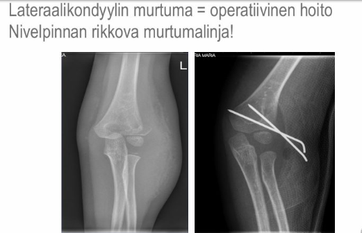
  

