# Lastenneurologia

## 2026 

Pitkälti samoja kuin edeltävinä vuosina.

### 14 v tyttö, jolla n. vuoden ajan jatkuvaa päänsärkyä. Pidetty migreenityyppisenä, mutta Propral ei auta eikä päänsärkylääkkeestä vastetta. Lisäksi huimausta ja väsymystä: mitä anamnestisesti haluat tietää? mitä tutkit? mikä dg sinulla tulee mieleen perusteluineen {#14v-jatkuva-paansarky}

  <button class="solution-button"
          data-label="Vastaus"
          data-hide-label="Piilota vastaus">
    Vastaus
  </button>
  

Tilanne vaatii uudelleenarviointia niin diagnoosin, selvittelyjen tarpeen ja hoidon suhteen. 

Tässä tilanteessa on selvitettävä systemaattisesti elintavat, psykososiaalinen tilanne, lääkkeiden käyttö sekä poissuljettava sekundaariset, mahdollisesti vakavat syyt.

---

Anamneesi: 

<li>Päänsäryn luonne:</li>
  <ul>
    <li>Minne lokalisoituu, onko toispuolista, vaihteleeko lokaatio?</li>
    <li>Laatu (sykkivä, jatkuva); onko laatu muuttunut?</li>
    <li>Onko jatkuvaa/jaksottaista (ja jos jaksottaista niin kuinka kauan kohtaus kestää ja kuinka usein kohtauksia on)</li>
    <li>Milloin ilmenee; herättääkö särky öisin, onko pahinta aamuisin vai iltaisin</li>
    <li>Provosoivia tekijöitä</li>
    <li>Pahentaako liikkuminen päänsärkyä</li>
    <li>Pahentaako ponnistelu, yskiminen tai jokin asento (kumartuminen) päänsärkyä (viittaisi kohonneeseen kallonsisäiseen paineeseen)</li>
  </ul>
<li>Lääkehistoria</li>
  <ul>
    <li>Särkylääkkeiden käyttömäärä (tiheys, määrä, mitä lääkkeitä)</li>
    <li>Muut lääkkeet ja luontaistuotteet; varsinkin E-pillerit</li>
  </ul>
<li>Muut oireet / liitännäisoireet</li>
  <ul>
    <li>Jos on päänsärkykohtauksia, niin onko niitä ennen auraoireita? Onko jälkioireita?</li>
    <li>Huimauksesta: laatu (pyörittävä, keinuttava...), liittyykö muita oireita (esim. asennonmuutoksiin liittyvää mustenemista silmissä)</li>
    <li>Onko pahoinvointia tai oksentelua</li>
    <li>Väsymys: Kuinka paljon nukkuu? Unen laatu? Onko kuorsausta tai hengityskatkoksia? Bruksismia? Onko väsymys jatkuvaa vai päiväaikaista poikkeavaa uneliaisuutta?</li>
    <li>Onko näössä ongelmia?</li>
  </ul>
<li>Psykososiaaliset ja ympäristölliset tekijät</li>
  <ul>
    <li>Mieliala ja stressi: Miten koulu sujuu? Onko kiusaamista, ahdistusta tai masennusta?</li>
    <li>Elintavat: Ruutuaika ja ergonomia (niska-hartiaseudun jännitys), ateriarytmi (verensokerin heittelyt), veden juonti ja liikunta</li>
  </ul>
<li>Kasvu- ja kehityshistoria</li>
<li>Sukuanamneesi</li>

---

Statuksessa:

<li>Täysi neurologinen status</li>
<li>Silmänpohjat</li>
<li>Niska-hartiaseudun ja purennan status (lihaskireydet, leukanivelongelmat)</li>
<li>Kattava yleispediatrinen status</li>
<li>Verenpaine ja syke!</li>

---

Todennäköisesti **monitekijäinen päänsärkyongelma:** taustalla mahdollisesti oikeasti migreeni, mutta sen lisäksi myös voi olla **samaan aikaan kroonista jännityspäänsärkyä, särkylääkepäänsärkyä ja psykososiaalista kuormitusta.** Tietysti on myös huomioitava se, että **pahenevat/hoitoresistentit päänsäryt kannattaa lähettää ESH** ja siellä tarpeen mukaan otetaan esim. MRI selvittelynä tuumorien poissulkemiseksi.

<li>Varsinkin särkylääkepäänsärky voi tässä tapauksessa olla todennäköinen, koska potilas on ehkä käyttänyt paljon päänsärkylääkkeitä (jos käyttää >15kk/kk NSAIDeja tai parasetamoli tai >10krt/kk triptaaneja) tilanteen pahentuessa. Tämä on voinut johtaa siihen, että alkuperäinen päänsärky on muuttunut päivittäiseksi.</li>
<li>Krooninen jänmnityspäänsärky on myös yleistä nykynuorilla runsaan älylaitteiden ja huono ergonomian sekä stressin seurauksena. **Jatkuva lihasjännitys niskassa (servikogeeninen syy) voi aiheuttaa myös huimausta** ja jatkuva kipu uuvuttaa (väsymys).</li>
<li>Epämääräinen, lääkkeille reagoimaton päivittäinen kipu, uupumus ja huimaus (joka voi olla psykogeenista) voivat myös olla merkki vaikeasta stressistä, ahdistuksesta tai alkavasta masennuksesta. Somaattiset oireet ovat nuorilla usein psyykkisen pahan olon ensisijainen ilmenemismuoto.</li>

  

## 2025 

### 4kk varhaisheijasteet voimakkaat ja ekstensiotonus, onko poikkeavaa ja mitä erotusdiagnooseja {#4kk-ekstensiotonus}

  <button class="solution-button"
          data-label="Vastaus"
          data-hide-label="Piilota vastaus">
    Vastaus
  </button>
  

Kyllä, löydös on poikkeava ja edellyttää lastenneurologin arviota.

Normaalissa motorisessa kehityksessä varhaisheijasteiden (kuten moro ja ATNR) tulisi yleensä 4 kuukauden iässä jo vaimentua tai olla väistymässä; yleensä 4-5kk asti säilyminen on epäilyttävää ja yli 6kk jo huolestuttavaa. Niiden voimakas esiintyminen estää tahdonalaisen motoriikan, kuten käsien tuomisen keskiviivaan, tarttumisen ja kääntymisen harjoittelun. 

Voimakas ekstensiotonus (ojentajaylijännite, vartalon taakseveto, jalkojen ojennus; kehoon, päähän tai raajoihin tulee ojennustaipumus) on vauvoilla hälyttävä merkki, sillä vauvan asennonhallinnan tulisi olla usein pääasiassa normitonuksisesti koukistuksellinen eikä hypertonisesti eksensiivinen. 

Oirekuva viittaa ensisijaisesti ylemmän motoneuronin vaurioon tai keskushermoston säätelyhäiriöön.

---

Erotusdiagnostiikkaan kuuluu ensisijaisesti **CP-vamma** (sikiöaikana, vastasyntyneisyysvaiheessa tai varhaislapsuudessa tapahtuneen keskushermoston liikettä säätelevien, kehittyvien alueiden kertavauriota, jonka seurauksena on kehittynyt pysyvä ei-etenevä aivovaurio ja liikuntavamma), mutta myös mm. keskushermoston synnynnäiset rakennepoikkeavuudet, geneettiset oireyhtymät ja aineenvaihduntasairaudet. Periaatteessa myös Sandiferin oireyhtymän (GERD aiheutaa spastisen tortikolliksen tai ekstension (lapsi yrittää kaulan asennolla hallita suuhun pyrkivää refluksia), raudanpuuteanemian ja rumpupalikkosormet) voi pitää mielessään harvinaisena syynä vauvan oudoille vartaloasennoille, tosin se ei aiheuttaisikaan varhaisheijasteiden poikkeavaa säilymistä. 

---

Tämä potilas tarvitsee lähetteen erikoissairaanhoitoon lastenneurologialle. Ennen lähetteen laatimista statuksessa ja anamneesissa on olennaista huomioida seuraavat seikat:

<li>Raskaus ja synnytys: Oliko raskausaikana infektioita, poikkeavia uä-löydöksiä, tai oliko synnytyksessä asfyksiaa? Apgar-pisteet? Bilirubiinitasot ja niiden hoito vastasyntyneisyyskaudella?</li>
<li>Vakavia sairauksia, keskushermostoinfektioita tai pään traumoja taustalla?</li>
<li>Kohtausoireet: Onko ollut kouristuskohtauksia? Poissaolokohtauksia? Nykimistä? Silmien poikkeavia liikkeitä?</li>
<li>Päänkasvu: Onko päänympäryksen kasvu taittunut tai kiihtynyt poikkeavasti? Kasvu (pituus, paino) muuten?</li>
<li>Katsekontakti ja sosiaalisuus: Seuraako vauva katseellaan, hymyileekö, äänteleekö? (onko enemmän puhdasta motorista häiriötä kuin laaja-alaista kehitysvammaa)</li>

  

### 4v lapsi, jolla päänsärkyä 2 kertaa kuukaudessa. Oksentelua ja pahoinvointia tämän yhteydessä. Parasetamolilla helpottuu. Säryn helpotettua nukkuu hyvin. Mitä lisäkysymyksiä ja miksi? Mitä erotusdiagnostisia vaihtoehtoja? Perustelut? Tarvitaanko jatkotutkimuksia? Miten ohjeistat perhettä? {#4v-paansarkya-2krt-kk}

  <button class="solution-button"
          data-label="Vastaus"
          data-hide-label="Piilota vastaus">
    Vastaus
  </button>
  

Päänsärkypotilaan anamneesissa ja statuksessa tulee aina pyrkiä ensin poissulkemaan punaiset liput. Päänsäryn hälytysmerkit (red flags) viittaavat sekundaariseen päänsäryn syyhyn ja merkeillä diffataan vaarallista tilaa päänsäryn taustalla. Oireet voi muistaa SNNOOP10-muistisäännöstä (Käypä Hoidossa opetetaan S2NOOP4, jossa on muutama oire vähemmän mainittu). Tähän ei-akuuttiin tilanteeseen, jossa lapsi tulee vastaanotolle valittamaan toistuvia päänsärkyjä viime aikoina, ei tietystikään kaikki näistä sovellu. On kuitenkin tärkeää kysyä mm: 

<li>Päänsäryn ajoitus: Herättääkö päänsärky lapsen yöllä unesta tai onko se pahimmillaan aamulla heti herätessä? (klassinen kohonneen kallonsisäisen paineen (ICP) ja aivokasvaimen merkki)</li>
<li>Neurologiset oireet kohtausten aikana ja välillä. Onko tasapaino, kävely tai hienomotoriikka normaalia? Onko ilmennyt karsastusta, luonteenmuutoksia tai taantumista kehityksessä? (etenevät neurologiset oireet viittaavat rakenteelliseen vikaan tai tilaa vievään prosessiin)</li>
<li>Onko ollut pään traumaa ennen kuin päänsäryt alkoivat</li>
<li>Infektio-oireet</li>
<li>Kipulääkkeiden pitkäaikainen käyttö (särkylääkepäänsärky) tai uusi lääke päänsäryn ilmenemisen yhteydessä</li>

---

Jos ajattelee, että ei ole kyseessä vaarallinen sekundaarinen syy, niin primaarisen päänsäryn jaottelu perustuu pääasiassa anamneesiin ja kliiniseen kuvaan. Tulee kysyä mm.

<li>Kohtausten kestosta ja sijainnista sekä tiheydestä. Päänsäryn luonne ja esiintymistiheys ilmenevät yleensä esitäytetystä päänsärkypäiväkirjasta, joka vanhemmille kannattaa lähettää etukäteen ajanvarauksen yhteydessä.</li>
<li>Liitännäisoireista (vilkkuvat tai kirkkaat valot, hajut, paasto, valvominen)</li>
<li>Sukuhistoria</li>
<li>Käytetyt lääkkeet ja niiden vasteet päänsärkyyn</li>
<li>Muut sairaudet ja lääkitykset</li>
<li>Yhdessä lapsen ja vanhemman kanssa keskustellen selvitetään lapsen elinolosuhteet, elintavat, koulunkäynti, kaverisuhteet ja harrastukset. Unesta tarkasti myös (uniapneaan viittaavaa, nukkuuko riittävästi, säännöllisyys?)</li>
<li>Myös huolellinen lastenneurologinen anamneesi on tärkeä: kehitykselliset ongelmat? oppiminen?</li>

---

**Statuksessa tietysti normaali kattava pediatrinen yleistutkimus sekä neurologinen tutkimus.** Huolelliseen neurologiseen tutkimukseen kuuluu arvio lapsen liikuntakyvystä mukaan lukien tasapaino, koordinaatio, lihasvoimat ja puolierot raajojen toiminnassa. _Näöntarkkuuden (kauko- ja lähinäkö), näkökenttien ja silmänpohjien tutkiminen_ kuuluu myös päänsärkypotilaan kliiniseen tutkimukseen. Myös papillan ulkonäkö ja silmien liikkeet (karsastus) on tärkeä tutkia. Pään lihasten kiinnityskohdat on syytä palpoida ja arvioida niskan ja hartioiden lihasjännitystä. **Verenpaineen mittaus, puberteettistatus, ryhti ja purenta, kasvun arviointi kasvukäyrän perusteella ja leikki-ikäisten päänympäryksen mittaus kuuluvat aina päänsärkypotilaan somaattiseen tutkimukseen.** 

**Rutiininomaisten laboratoriotutkimusten hyöty on yleensä vähäinen,** tarvittaessa niistä kyllä voi olla hyötyä. Mikäli lapsella on runsaasti tulehdussairauksia, hänen ruokailutottumuksensa ovat epäterveelliset tai yleisvointi askarruttaa, perusverenkuva ja CRP-arvo on syytä selvittää. Sinuiitti aiheuttaa subakuuttia päänsärkyä, mikä tulee huomioida ylähengitystieinfektion jälkeen alkaneen päänsäryn selvittelyssä.

---

**Erotusdiagnostisesti kyseessä voi olla ainakin mm. migreeni (todennäköisin anamneesin perusteella), aivokasvain/muu kallonsisäistä painetta kohottava prosessi, jännityspäänsärky, psykogeeninen päänsärky, taittovika/karsastus tai näiden yhdistelmä.**

<li>Migreeni (ilman auraa) - Oirekuva on klassinen: kohtauksittainen särky, johon liittyy pahoinvointia/oksentelua. Lääkevaste parasetamolille on hyvä, ja nukkuminen katkaisee usein migreenikohtauksen lapsilla. Kohtauksia on kohtuullinen määrä (2 krt/kk) ja oireilu on episodimaista</li>
<li>Kohonnut ICP/aivokasvain - Pidetään aina mielessä. Oireet kuitenkin ilmenevät potilaalla ilmeisesti illalla (ei mainintaa aamuyöstä tai heräämisestä kipuun) ja tila vaikuttaa sykliseltä eikä etenevältä. Ei myöskään ole muita oireita (esim. neurologian), jolloin aivotuumori on erityisen harvinainen päänsäryn aiheuttaja. </li>
<li>Jännityspäänsärky - Erittäin yleinen (liikunnan vähäisyys, stressi yms):  Joskus lapsen jännityspäänsärky voi olla vaikeaa erottaa migreenistä, sillä se voi olla myös kohtauksittaista ja migreenilapsilla voi esiintyä myös jännityspäänsärkyä migreenikohtausten välissä (nuorilla migreeni voi painottua takaraivolle, jolloin sen voi helposti sekoittaa jännityspäänsärkyyn)</li>
<li>Psykogeeninen päänsärky - Psykogeenisesta päänsärystä voidaan puhua silloin, kun häiriön pääasiallinen ylläpitäjä on psyykkinen tekijä, jonka poistuminen lopettaa myös päänsäryt kokonaan. Särky on kuitenkin yleensä luonteeltaan jatkuvaa eikä särky häiritse tavallista toimintaa yhtä paljon kuin migreeni tai jännityspäänsärky eikä siihen yleensä kuulu liitännäisoireita. Vaste kipulääkitykselle on usein vaatimaton. </li>
<li>Taittovika/karsastus aina mahdollista päänsäryssä. Ei yleensä aiheuta voimakasta pahoinvointia ja oksentelua. Kipua esiintyisi enemmän tarkkaa näköä vaativan tekemisen (piirtäminen, katselu) jälkeen. </li>
<li>Epilepsiakin voidaan pitää mielessä; esim. Panayiotopoulosin oireyhtymä, joka voi aiheuttaa autonomisia oireita kuten oksentelua, johon liittyy päänsärkyä ja poikkeavaa väsymystä. Migreeni on huomattavasti yleisempi, ja epileptisiin kohtauksiin liittyy usein tajunnan hämärtymistä tai katseen deviaatiota, jota ei ole raportoitu tässä.</li>

---

Huolellinen anamneesi ja status ovat usein riittävät päänsäryn selvittelyssä ja jatkotutkimukset ohjautuvat potilaskohtaisesti anamneesin mukaan (pään MRI, likvor, silmälääkäri, hammaslääkäri, EEG yms...). 

Pään MRI ei todellakaan ole aina tarvittu tutkimus, mutta se on järkevää ottaa hyvin herkästi, jos lapsi on alle 5-vuotias, kuten tässä. **Tehdään ainakin konsultaatiolähete lastenneurologialle, kun päänsärky nyt alkanut alle 5-vuotiaana -- he voivat päättää lopullisesti otetaanko MRI vai ei.**

---

**Perhettä tulisi ohjeistaa pitämään päänsärkypäiväkirjaa.** Kirjataan ylös kohtausten ajankohta, kesto, voimakkuus, mahdolliset laukaisijat, annetut lääkkeet ja niiden teho. Tämä on hyvä työkalu diagnoosin varmentamisessa ja seurannassa.

**Ohjeistetaan myös päänsäryn kohtauslääkehoito: Kipuherkistymisen estämiseksi annetaan heti riittävän suuri määrä lääkettä ja uusi annos tarvittaessa 2 t:n kuluttua. Ensisijainen lääke on ibuprofeeni suun kautta (10mg/kg kerta-annos), ja siihen voi yhdistää parasetamolin (15mg/kg kerta-annos); lapsilla yhteiskäytöstä ei tosin ole tutkimusnäyttöä.** Triptaaneja voidaan migreenissä miettiä yli 12-vuotiailla  (>6 vuotiaille > 20 kg painaville), jos nämä eivät riitä. Pahoinvointilääkkeet migreenin hoidossa joskus tarpeen (ondansetroni), mutta ei kirjoiteta tätä kotiin nyt, yleensä vain sairaalapäivystyksessä. Metoklopramidi aiheuttaa lapsille usein ekstrapyramidaalioireita, eikä sitä tule käyttää lasten pahoinvoinnin hoidossa.

_Jos ei mene mitenkään ohi ja kipu on vaikea, niin voi hakeutua päivystykseen._

Myös lääkkeettömän hoidon periaatteita voidaan soveltaa kaikkiin päänsärkytyyppeihin, joiden taustalla ei ole hoidettavaa perussairautta. Usein jo tieto siitä, ettei kyseessä ole vakava sairaus, helpottaa tilannetta. Tuki ja informointi päänsäryn laadusta, kipumekanismeista ja itsehoitokeinoista on tärkeää. Pieni osa migreeniä sairastavista saattaa saada migreenikohtauksen jostakin ruoka- tai lisäaineesta, mutta erityisiä eliminaatiodieettejä ei suositella. **Säännöllinen ateria-, ulkoilu- ja unirytmi, ruutuajan rajaaminen, riittävä juominen sekä silmien suojaaminen valolta voivat merkittävästi harventaa migreenikohtauksia ja muistakin syistä esiintyvää toistuvaa päänsärkyä.**

---

Estohoito voi olla aiheellinen, mikäli migreenikohtauksia on yli 2 kuukaudessa ja/tai ne ovat pitkäkestoisia ja ne heikentävät merkittävästi lapsen tai nuoren toimintakykyä. **Voidaan kyllä ensin nyt kokeilla elämäntapaohjauksella, itsehoidolla ja laukaisevien tekijöiden välttämisen kautta ensin koittaa vähentää kohtauksia, mutta jos ei riitä, niin mietitään estolääkitystäkin.** Estolääkkeellä ei pyritä päänsärkyjen loppumiseen kokonaan, vaan riittävänä hoitovasteena pidetään päänsärkyjen vähenemistä puoleen. Tämän vuoksi päänsärkypäiväkirjaa on tärkeä pitää ennen ja jälkeen lääkkeen aloituksen. Hyväksi todettua estolääkitystä jatketaan yleensä 3–12 kk:n ajan, jonka jälkeen kokeillaan lääkepurkua; voi tarvittaessa aloittaa uudelleen, jos tilanne jatkuu hankalana. 

Pääsääntöisesti päänsäryn hoito kuuluu perusterveydenhuoltoon, jossa voidaan myös asettaa migreenidiagnoosi ja aloittaa tarvittaessa estolääkitys. Lääkkeenä voidaan käyttää propranololia 0,5-2 mg/kg/vrk (max. 160 mg/vrk) (voi aloittaa pth:ssa); vaikeimmissa tapauksissa erikoislääkärin määräyksellä amitriptyliiniä tai topiramaattia. ATR:n salpaajien tehosta ei ole näyttöä nuorten migreenin estossa kuten aikuisilla. Ellei muilla lääkkeillä ole saatu vastetta, voidaan harkita kandesartaanin käyttöä (poikkeuskäyttö).

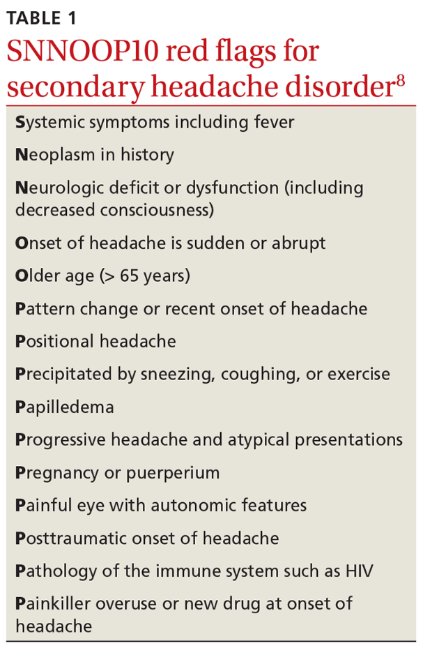

  

### 9v-potilas. Päänsärky, migreenipiirteitä. {#9v-paansarky}

Käytiin jo yllä käytännössä tärkeimmät tämänkaltaisesta keissistä -- erona nyt vain, että lapsi >5v ja jos ei muuta hälyttävää, niin voi hoitaa PTH:ssa ilman MRI:tä. 

_Otetaan tämä tilaisuus käymään läpi migreenin tyyppipiirteet (miten erottaa jännityspäänsärystä) ja diagnostiset kriteerit lapsilla. Kertaa lisäksi päässäsi migreenin akuutti hoito niin kotona kuin vaikeissa tapauksissa päivystyksessä sekä estohoidon aloituksen aiheet ja toteutus._

  <button class="solution-button"
          data-label="Vastaus"
          data-hide-label="Piilota vastaus">
    Vastaus
  </button>
  

Migreenin diagnostiset kriteerit ovat käytännössä samat aikuisilla kuin lapsilla; ainoa ero on kohtauksen kestossa (aikuisilla 4-72h ja lapsilla 2-72h ilman hoitoa). 

Aurattoman migreenin diagnostiset kriteerit ovat: Vähintään 5 kohtausta, jotka täyttää seuraavat kriteerit

<li>Kohtauksen kesto 2–72 t mukaan lukien mahdollinen jälkiuni</li>
<li>Vähintään kaksi seuraavista oireista: Päänsärky on</li>
  <ul>
    <li>sykkivää</li>
    <li>toispuolista (lapsilla kuitenkin usein molemminpuolista otsa-ohimoalueella) </li>
    <li>kohtalaista tai kovaa</li>
    <li>pahenee fyysisessä rasituksessa tai johtaa rasituksen välttämiseen</li>
  </ul>
<li>Mukana on vähintään yksi seuraavista liitännäisoireista:</li>
  <ul>
    <li>pahoinvointi ja/tai oksentelu</li>
    <li>valonarkuus ja ääniherkkyys</li>
  </ul>

---

Migreeni voi myös olla aurallinen eli esioireellinen. Sen kriteerit taas ovat: Vähintään 2 kohtausta, jotka täyttävät seuraavat kriteerit: 

<li>Aura muodostuu täysin palautuvasta auraoireesta: näköoire, tunto-oire, puheen tuoton tai ymmärtämisen vaikeus; harvinaisempia ovat motorinen oire, aivorunkoperäinen oire (=ainakin 2 seuraavista oireista: dysartria, vertigo, tinnitus, hypoacusis, diplopia, ataksia, tajunnantason lasku) tai verkkokalvoperäinen oire (näköhäiriö pelkästään toisessa silmässä)</li>
<li>Mukana on vähintään kaksi seuraavista neljästä piirteestä</li>
  <ul>
    <li>Ainakin yksi auraoire kehittyy hitaasti laajeten vähintään 5 minuutin aikana, tai peräkkäisiä auraoireita on kaksi tai useampia</li>
    <li>Yksittäinen auraoire kestää 5–60 minuuttia</li>
    <li>Ainakin yksi auraoire on toispuolinen (lapsilla kuitenkin usein molemminpuolinen)</li>
    <li>Auran aikana tai 60 minuutin kuluessa esiintyy päänsärkyä</li>
  </ul>

---

Migreenikohtaus voidaan jakaa neljään vaiheeseen:

<li>1 - Ennakko-oireet</li>
<li>2 - Auraoireet</li>
<li>3 - Päänsärkyvaihe</li>
<li>4 - Jälkioireet</li>
<li>Kaikilla ei ilmene kaikkia vaiheita, esim. aurattomassa migreenissä ei ole todettavissa auraoireita ja aurallisessakin migreenissä voi olla aurattomia kohtauksia. </li>

---

**Jännityspäänsärky on yleisin primaarinen päänsärky ja migreeni on toiseksi yleisin primaarinen päänsärky. Eroavaisuudet:**

<li>Tausta:</li>
  <ul>
    <li>Tensiopäänsäryssä ei usein perinnöllistä taustaa (liittyy henkiseen ja fyysiseen stressiin; sisältää sekä lihasjännityksestä johtuvat että henkisestä jännittyneisyydestä johtuvat päänsäryt; voi siis esiintyä ilman merkittävää lihaskireyttä)</li>
    <li>Sukutausta altistaa migreenipäänsärylle</li>
  </ul>
<li>Alkamisikä:</li>
  <ul>
    <li>Molemmissa voi alkaa hyvin varhain, jopa leikki-ikäisenä. Yleistyvät nuoruusikään tultaessa.</li>
  </ul>
<li>Esioireisuus</li>
  <ul>
    <li>Tensiopäänsäryssä ei esioireita</li>
    <li>Migreenikohtauksessa usein ennakko-oireita ja/tai auraoireita itse päänsärkyä edeltävästi. Ennakko-oireet ovat usein aika epäspesifisiä ja alkavat n. 1-3pv ennen kohtausta. Monet potilaat kuvaavat vain tunteen, että päänsärky on tulossa. Jotkut kuvaavat muutosta mielialassa, jotkut muutosta käytöksessä. Jotkut kuvaavat masennusta, kognitiivisten kykyjen laskua tai ruoanhimoa. Auraoireet kestävät n. 5-60 min ja päänsärkyvaihe 2-72h. Kohtauksen jälkeen voi vielä olla jälkioireita, jotka kestävät pari tuntia - pari päivää ja niitä voi yleensä kuvailla krapulamaisiksi</li>
  </ul>
<li>Kipukohtauksen kesto</li>
  <ul>
    <li>Tensiopäänsäryssä kipukohtaus voi kestää minuuteista-4-6h(-tai jopa kuukausia ja vuosia)</li>
    <li>Migreenikohtaus voi kestää 2-72h hoitamattomana</li>
  </ul>
<li>Päänsäryn tyyppi</li>
  <ul>
    <li>Tensiopäänsäryssä päänsärky on jatkuvaa pantamaista ja puristavaa koko pään alueella</li>
    <li>Migreenissä kipu sykkivää ja toispuoleista</li>
  </ul>
<li>Palpaatiolöydökset</li>
  <ul>
    <li>Tensiopäänsäryssä mahdollisesti aristuksia ohimoilla, takaraivossa, niskassa ja hartioilla</li>
    <li>Migreenissä ei palpoituvia kipupaikkoja kallon ulkopuolella</li>
  </ul>
<li>Fyysisen rasituksen vaikutus oireisiin</li>
  <ul>
    <li>Tensiopäänsäryssä oireet helpottavat fyysisessä rasituksessa</li>
    <li>Migreenissä oireet pahenevat fyysisessä rasituksessa</li>
  </ul>
<li>Liitännäisoireet</li>
  <ul>
    <li>Tensiopäänsäryssä ei usein liitännäisoireita tai vain yksi lievä oire kerrallaan (joskus kävellessä huimausta tai lievää pahoinvointia, mutta ei varsinaista oksentelua. Myös foto- ja fonofobiaa ilmenee. Näistä vain yksi voi olla kerrallaan!)</li>
    <li>Migreenille taas on tyypillistä, että esiintyy liitännäisoireita (ovat diagnostisissa kriteereissäkin; tyypillisiä ovat pahoinvointi, oksentelu sekä valo- ja ääniarkuus, komplisoituneissa jopa puhe- ja halvaushäiriöitä)</li>
  </ul>

---

Migreenin ensisijainen kohtaushoito on ibuprofeeni suun kautta (10mg/kg kerta-annos), ja siihen voi yhdistää parasetamolin (15mg/kg kerta-annos); lapsilla yhteiskäytöstä ei tosin ole tutkimusnäyttöä. Triptaaneja voidaan migreenissä miettiä yli 12-vuotiailla  (>6 vuotiaille > 20 kg painaville), jos nämä eivät riitä. Annokset saa toistaa 2h kuluttua. Pahoinvointilääkkeet migreenin hoidossa joskus tarpeen (ondansetroni).

_Jos ei mene mitenkään ohi ja kipu on vaikea, niin voi hakeutua päivystykseen._

Päivystyksessä voidaan hoitaa vaikeassa tai pitkittyneessä tapauksessa iv-hoidollakin. On tärkeää selvittää päivystyksessä, onko potilas kokeillut jo kotona tyypillistä kohtauslääkitystään ja tarvittaessa annostella se, jos sitä ei vielä olla kokeiltu (eli siis NSAID+parasetamoli (ja usein myös pahoinvointilääke tai jopa triptaanikin) yleensä isommallakin annoksella, kuten migreeneissä yleensä tapana). Päivystyksessä usein kuitenkin potilaat ovat jo kokeilleet kohtauslääkitystään, mutta vaste ei ole ollut riittävä. Päivystyksessä tulee tällöin korjata dehydraatiota ja antaa ns. migreenitippa, jonka koostumus eroaa paikasta toiseen ja lasten ja aikuisten välillä ainakin monien lähteiden mukaan (aikuisilla ketorolaakki 30 mg + metoklopramidi 10 mg + deksametasoni 4 mg i.v. + parasetamolia 1000mg i.v.; usein voidaan myös miettiä diatsepaamia lisäksi 2.5 mg iv, jos mukana merkittävä ahdistus/lihastensiokomponentti). Lapsilla ainakin yhden lähteen mukaan annetaan ondansetronia 0.15mg/kg ja deksketoprofeenia 0.5-1mg/kg. Jos potilas ei ole vielä käyttänyt triptaania tähän kyseiseen kohtaukseen tai sen käytöstä on yli 2 tuntia, niin tipan lisäksi usein annostellaan triptaanikin (esim. subkutaanisti), jos sille ei ole vasta-aiheita. 
 

---

**Estohoidon aloitukselle ei ole tarkkoja rajoja, mutta voidaan aloittaa, kun potilas kokee migreenikohtauksista sen verran haittaa, että hän on itse halukas käyttämään säännöllistä lääkitystä niiden vähentämiseksi (esimerkiksi esim. jo 2 tai 3 migreenipäivää kuukaudessa voi olla aihe tai vähemmänkin, jos migreeni hankaloittaa jokapäiväistä elämää).**

Estohoito aloitetaan lähtökohtaisesti pth:ssa niin lapsilla kuin aikuisilla. **Lapsilla ensisijainen on propranololi** (muistakin beetasalpaajista hyötyä, lapsilla
tutkimusnäyttöä ainoastaan propranololista), aikuisilla voidaan kokeilla useampiakin (2-3) estolääkkeitä ennen lähettämistä neurologin arvioon.

Lapsilla siis propranololia 0,5-2 mg/kg/vrk (max. 160 mg/vrk); vaikeimmissa tapauksissa _erikoislääkärin määräyksellä_ (toisen linjan estolääkitykset ovat lapsipotilailla ESH:n alle porrastettuja) amitriptyliiniä tai topiramaattia. ATR:n salpaajien tehosta ei ole näyttöä nuorten migreenin estossa kuten aikuisilla. Ellei muilla lääkkeillä ole saatu vastetta, voidaan harkita kandesartaanin käyttöä (poikkeuskäyttö).

Lääkkeetön hoito on myös tärkeää:

<li>Säännöllinen liikunta!</li>
<li>Ravinto- ja nautintoaineet (alkoholi, tupakka, säännöllinen ruokavalio)</li>
<li>Ympäristö (ärsyttävien tekijöiden välttäminen)</li>
<li>Unihäiriöiden rotiin saaminen</li>

---

Estohoidossa  50% kohtausvähenemä on hyvä vaste. Seurataan päänsärkypäiväkirjalla ennen estohoitoa ja estohoidon aikana. Hyväksi todettua estolääkitystä jatketaan yleensä 3–12 kk:n ajan, jonka jälkeen kokeillaan lääkepurkua; voi tarvittaessa aloittaa uudelleen, jos tilanne jatkuu hankalana. 

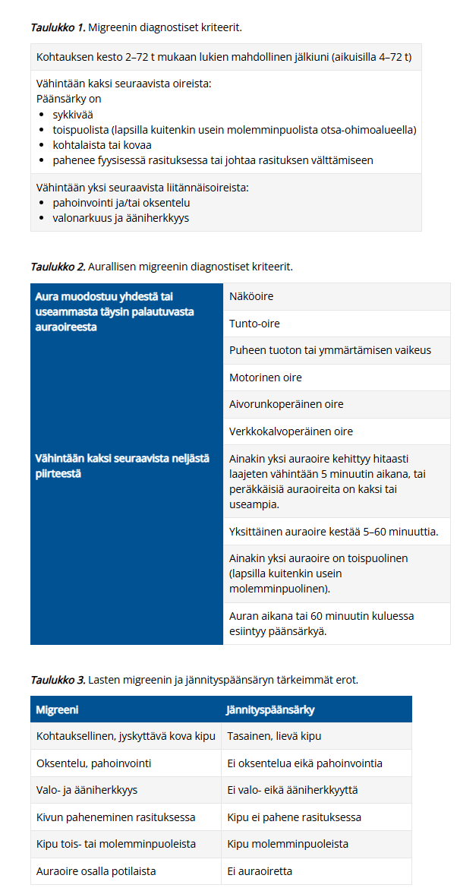
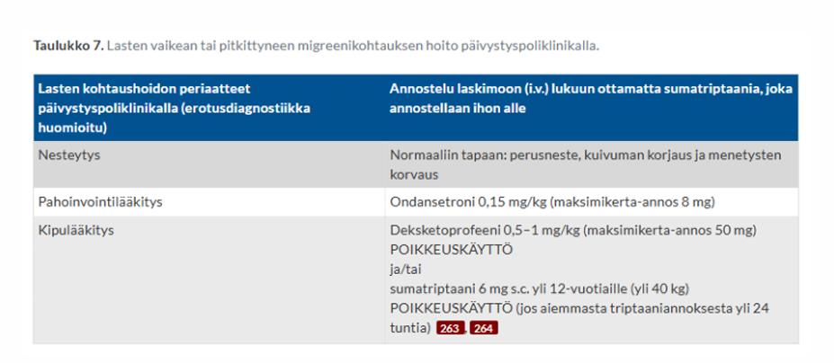

  

### 6kk. Ei kannattele itse päätään. Ei seuraa lelua 20cm etäisyydeltä. Eikä yritä tarttua leluun. ANTR voimakas. Mitä kysyt, mitä tutkit, onko ikään nähden poikkeavaa (perustele) ja mitä jatkotutkimuksia ohjelmoit {#6kk-kehitys}

On myös toinen, jossa alkanut vastikään seurata katseellaan 20-30 cm päässä olevia leluja. 

  <button class="solution-button"
          data-label="Vastaus"
          data-hide-label="Piilota vastaus">
    Vastaus
  </button>
  

**Löydökset ovat poikkeavia.**

Pään kannattelu: Normaalisti pään hallinta saavutetaan n. 3–4 kuukauden iässä. 6 kuukauden iässä vauvan tulisi pystyä pitämään päänsä täysin vakaana ja useimmiten jo harjoitella istumista tuettuna.

Katseen kohdistaminen: Vauva kiinnittää katseensa kasvoihin tai leluun ja seuraa liikettä kaikkiin katsesuuntiin n. 20cm etäisyydeltä yleensä jo 1–2 kuukauden iässä

Tarttumisen puute: Vauvan tulisi tavoitella ojennettua esinettä 4kk iässä ja 6kk iässä tarttua nyrkkiotteella ja alkaa vaihtaa lelua kädestä toiseen

Voimakas ANTR (asymmetrinen tooninen niskaheijaste): Primitiiviheijaste, joten sammuu ihljalleen viimeistään 4-6kk mennessä

---

Tulisi selvitellä **tarkasti anamneesi ja tehdä kattava neurologinen / yleispediatrinen status** (mukaanlukien pituus, paino, päänympärys). Anamneesissa:

<li>Raskaus- ja synnytyshistoria: Raskausajan päihteet, infektiot, sikiön kasvu? Synnytyksen kulku; apgar, asfyksia...? Täysiaikainen vai keskonen? </li>
<li>Varhaiskehitys ja havainnot: Taantumista? Ottaako kontakti? Onko ollut kohtauksellisia oireita?</li>
<li>Arki ja elintoiminnot: Miten syöminen ja nieleminen sujuu. Onko lapsi poikkeuksellisen veltto tai jäykkä?</li>
<li>Suku- ja perhetausta: Onko suvussa lihassairauksia, kehitysvammoja, neurologisia sairauksia tai perinnöllisiä oireyhtymiä?</li>
<li>Muut sairaudet</li>
<li>Pään traumat</li>

---

Todetaan laaja-alainen motoriikan kehityshäiriö; taustalla voi olla mm. CP-vamma, geneettinen oireyhtymä/aineenvaihduntasairaus tai aivojen synnynnäinen rakennepoikkeavuus. -> **Tulisi tehdä lähete ESH.** Siellä sitten tilanteesta riippuen mm. pään ultra, MRI, labroissa genetiikkaa, kromosomitutkimuksia, aineenvaihduntalabroja, EEG, silmälääkärin arvio, kuulontutkimus yms ja tehdään kuntoutusarvio. 

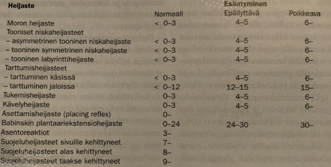
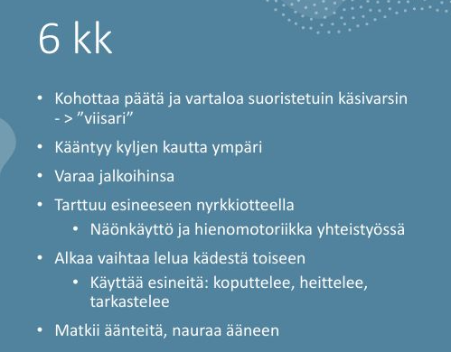
  

### Infantiilispasmi

Ei tehtävänantoa tarkemmin. Selitä mikä on, mitä oireita, hoito, ennuste? 

  <button class="solution-button"
          data-label="Vastaus"
          data-hide-label="Piilota vastaus">
    Vastaus
  </button>
  

Infantiilispasmioireyhtymä (Westin oireyhtymä) edustaa vajaata puolta imeväisiässä alkavista epilepsioista. **Se on erityisen tärkeää tunnistaa, koska aiheuttaa kehityksen pysähtymisen ja pitkään jatkuessaan taantumisen.**

Alkamisikä vaihtelee muutamasta kuukaudesta vuoteen; **tyypillisimmin oireet alkavat noin puolen vuoden (2-12kk) iässä.** Oireyhtymän syinä voivat olla vastasyntyneisyyskauden aivoinfarkti tai vaikea asfyksia, aivojen epämuodostumat, tuberoosiskleroosi sekä aivojen kehitykseen vaikuttavat aineenvaihduntasairaudet tai geneettiset syyt, mutta aina syytä ei löydetä (n. 20% idiopaattisia). Suomessa n. 20-30 lasta/vuosi

---

**Tyypillinen kohtaus on infantiilispasmisarja, jonka aikana lapsi jäykistyy toistuvasti noin 0.5-1 sekunnin ajaksi koukistus- tai ojennusasentoon ja joka tavallisimmin alkaa heräämisen jälkeen.** Spasmisarja alkaa ja loppuu yleensä vähitellen ja voi kestää muutamasta minuutista puoleen tuntiinkin. Spasmit voivat olla epäsymmetrisiä tai hyvin lieviä. Tällaisen sarjan aikana lapseen ei saa kontaktia. 

_Toisinaan kohtaukselliset oireet ovat niin vähäisiä, että vanhemmat eivät niitä edes huomaa, ja lapsi tulee tutkimuksiin kehityksen hidastumisen tai jopa taantumisen vuoksi._

---

Jotta diagnoosi ei viivästyisi, kaikkien heräämisen jälkeen sarjamaisesti toistuvien stereotyyppisten oireiden tulisi herättää infantiilispasmiepäily. Lisäoireena on usein kehityksen pysähtyminen tai taantuminen, joka voi alkaa jo ennen kuin kohtausoireet havaitaan tai vasta kohtausten kestettyä jo useamman viikon. 

Paras ennuste on lapsilla, jotka ovat päässeet nopeasti hoitoon, ja jotka reagoivat hoitoon hyvin. Nykyhoidoilla spasmit saadaan loppumaan lähes kaikilta niiltä lapsilta, joiden sairauden etiologia on tuntematon, ja noin puolelta rakenteellis-metabolisen etiologiaryhmän potilaista. Kuitenkin vain 5-12 % kehittyy normaalisti. Ne lapset, joiden spasmit jatkuvat vielä yhden vuoden iässä, osoittautuvat yleensä seurannassa vaikeasti kehitysvammaisiksi.

Infantiilispasmien hoitona käytetään joko kortikotropiinia (ACTH) tai vigabatriinia. **Lapset, joilla epäillään infantiilispasmeja, tulee ohjata päivystyksenä lastenneurologian yksikköön.**

  

### Kuumekouristus erotusdiagnostiikka ja hoito

  <button class="solution-button"
          data-label="Vastaus"
          data-hide-label="Piilota vastaus">
    Vastaus
  </button>
  

Kuumekouristuksia on 2–5 %:lla lapsista; yli ⅔ niistä on lyhyitä, yksinkertaisia kuumekouristuksia; < 10%:lla etenee statukseen. Kriteerit kuumekouristukselle: 

<li>Potilas on tyypillisesti 6 kk:n–5 v:n ikäinen.</li>
<li>Potilaalla on kuumetta yli 38.0 °C (täysin tarkkaa rajaa kuumeen korkeudelle kuumekouristusten yhteydessä ei ole määritetty, mutta usein kuume nousee korkeaksi, yli 38.5 °C).</li>
<li>Kuumetta ei välttämättä ole havaittu ennen kouristelua, vaan kouristelu voi olla kuumeen ensimmäinen merkki.</li>
<li>Yksinkertainen kuumekouristus on neurologisesti terveellä lapsella esiintyvä lyhyt, yleensä 1–2 min ja korkeintaan 15 min kestävä aivoperäinen kohtaus, joka ei toistu saman vuorokauden sisällä. Itse kouristelu on tyypillisesti toonis-klooninen kohtaus, jossa lapsi menee tajuttomaksi ja yläraajat, alaraajat tai molemmat nykivät ja jäykistelevät symmetrisesti eli kehon molemmin puolin. Osa lapsista ei kouristele, vaan menee ainoastaan veltoksi.</li>
<li>Monimuotoinen kuumekouristus kestää yli 15 min ja/tai kouristelut ovat epäsymmetrisiä ja/tai uusiutuvat 24 t:n kuluessa ja/tai niiden jälkeen on epäsymmetrisiä raajapareeseja (Toddin pareesi).</li>

---

Kuumekouristusten ensihoito toteutetaan kuten epileptisen kohtauksen ensihoito. Suurin osa kuumekouristuksista on lyhyitä, kestoltaan 1–2 min, ja ne loppuvat ilman mitään erityistoimia.

Kuumeen aikainen kohtaus voi kyllä olla bakteerimeningiitin, enkefaliitin tai sepsiksen oire, joten ensimmäistä kertaa kouristanut lapsi on syytä pyytää päivystyksellisesti lääkärin tutkittavaksi, vaikka kohtaus olisi ollut lyhyt ja lapsi olisi siitä toipunut. Poissuljetaan keskushermostoinfektio (ei tarvitse rutiinisti likvoria siis), tarkistetaan verensokeri, varmistetaan statuksen normaalistuminen. Herkästi EKG. Laboratoriotutkimuksia (C-reaktiivinen proteiini, perusverenkuva, natrium, kalium, kalsium, verikaasuanalyysi jne.) määritetään kliinisen arvion perusteella tarvittaessa. Kuumeen taustalla olevaa infektiota tutkitaan tavallisen käytännön mukaisesti. **Jos lapsi on muutaman tunnin seurannassa kohtauksen jälkeen hyväkuntoinen eikä lääkärin tutkimuksessa tule esiin mitään poikkeavaa, häntä ei tarvitse lähettää sairaalaseurantaan, ja vanhemmille kerrotaan kuumekouristusten hyvänlaatuisuudesta sekä annetaan tarkat ohjeet lapsen voinnin seurannasta; tarvittaessa bukkaalinen midatsolaami tai diatsepaamirektiolit kotiin.** Kuumekouristuksen saanut lapsi kuuluu lähettää päivystyksellisesti lastenlääkärin arvioitavaksi erikoissairaanhoitoon ainakin, jos kuumekouristus on kestänyt yli 5 min tai se on ollut monimuotoinen, tajunnantaso jää kohtauksen jälkeen alentuneeksi, jos epäillään keskushermostoinfektiota tai sepsistä tai jos yleistila sitä muuten vaatii. Usein myös merkittävän nuoret tai vanhat lapset lähetetään (alle 6kk tai yli 6v). 

Ensiapulääkettä ei määrätä rutiininomaisesti kotiin kaikille kuumekouristuspotilaille. Ensiapulääke on kuitenkin hyvä olla varalla erityisesti potilailla, joiden kuumekouristus on ollut pitkittynyt tai joilla pitkähköön kuumekouristukseen liittyy esim. välimatkasta johtuva viive pääsyssä ensiapua antavaan yksikköön. Ellei kotona annettu ensiapulääkkeen kerta-annos auta tai lapsi ei toivu kuumekouristuksesta nopeasti, hänet on vietävä ambulanssilla päivystyksellisesti sairaalahoitoon. 

---

EEG- tai kuvantamistutkimuksia ei normaalisti kehittyneillä ja muuten terveillä yksinkertaisia kuumekouristuksia saavilla lapsilla tarvita jatkotutkimuksina siinäkään tapauksessa, että kuumekouristukset uusiutuvat myöhempien kuumeiden aikana. Em. tutkimukset ovat aiheellisia, jos lapselle tulee myös kuumeettomia kouristuksia.

Jatkotutkimuksia ei tarvita, jos 6 kk:n–5 v:n ikäisellä lapsella esiintyy vain kuumeen aikana yksinkertaisia tajuttomuus-kouristuskohtauksia, joista lapsi toipuu normaalisti. Välttämättä nämä eivät ole tarpeen myöskään 6(–7) v:n ikäisellä yksinkertaisen kuumekouristuksen saaneella etenkään, jos lapsella on ollut taipumus toistuviin yksinkertaisiin kuumekouristuksiin pienempänäkin.

**Estolääkkeitä ei tule käyttää,** sillä yhtä aikaa tehokkaita ja turvallisia estolääkkeitä ei ole saatavilla. Tulevat kuumeet hoidetaan kuten muidenkin lasten kuumeet, koska ei ole osoitettu, että tehokaskaan kuumeen hoito ehkäisisi kuumekouristuksia. 

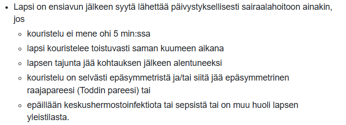
  

### 6v lapsi kömpelö ollut aina mutta nyt lisääntyvästi, ei pysy kavereiden perässä, ottaa reisistä tukea kun nousee seisomaan, ei pääse selältä vatsalihasten avulla istumaan. Esikoulu alkanut muuten hyvin. Mitä lisätietoja? Mitä teet vastaanotolla? Erotusdiagnostiikkaa? {#6v-kompelo}

  <button class="solution-button"
          data-label="Vastaus"
          data-hide-label="Piilota vastaus">
    Vastaus
  </button>
  

Anamneesissa:

<li>Oireiden alku ja eteneminen</li>
  <ul>
    <li>Milloin kömpelyys tai heikkous alkoi? Onko kyseessä selvästi etenevä oire eli onko lapsi menettänyt jo aikaisemmin opittuja taitoja (esim. juokseminen, portaiden nousu, hyppääminen)?</li>
    <li>Mitä on pystynyt siis tekemään aikaisemmin (ollut aina kompelö, mitä tarkoittaa?)</li>
  </ul>
<li>Muut oireet (sydänoireet yms)</li>
  <ul>
    <li>Sydänoireet, ptoosi, nielemisvaikeus, puhe...</li>
  </ul>
<li>Sukuanamneesi</li>
  <ul>
    <li>Onko suvussa varhaista liikuntakyvyn menetystä, lihassairauksia, sydänsairauksia tai nuorena menehtyneitä poikia?</li>
  </ul>
<li>Pään tai selkärangan traumaa taustalla?</li>
<li>Varhaiskehitys. Raskaus ja synnytys.</li>

---

**Vastaanotolla tehdään laaja neurologinen (ja yleispediatrinenkin) status.** Erityisesti tarkastellaan lihasvoimia, jänneheijasteita, kävelyä... Gowersin merkki on klassinen testi eli pyydetään lasta istumaan lattialle ja nousemaan ylös ilman tukea: Jos lapsi "kiipeää" käsillään reisien kautta ylös, kyseessä on positiivinen Gowersin merkki, joka kertoo lantiorenkaan ja reiden ojentajalihasten voimakkaasta heikkoudesta. 

Pohkeiden arvio: Ovatko pohkeet huomiotava herättävän paksut (ns. pseudohypertrofia eli rasva- ja sidekudoksen korvaama lihasmassa). 

Kasvu ja yleistila. 

---

Herää erityisesti epäily proksimaalisesta lihassairaudesta, koska lapsella on Gowersin merkki ja lisääntyvää motorista heikkoutta. Tärkeimmät aiheuttajat ovat **perinnölliset lihastaudit ja erityisesti lihasdystrofiat.** Lihasdystrofiat ovat perinnöllisiä eteneviä myopatioita, joissa lihassyyt vaurioituvat ja korvautuvat rasva- ja sidekudoksella. Yleisin perinnöllinen lihasdystrofia on poikalasten dystrofinopatia (x-periytyvä), joka johtuu mutaatioista dystrofiinigeenissä. Dystrofiinia tarvitaan lihaksen sytoskeletonin sitomiseen ekstrasellulaarimatriksiin.

Tyypillisin muoto lihasdystrofioista on **Duchennen lihasdystrofia (DMD),** joka on vaikeampi kuin Beckerin muoto. Duchenne alkaa yleensä jo 2-5 vuoden iässä, Becker 5-15v-aikuisikä. Duchennessa potilaat joutuvat pyörätuoliin n. 10-12-vuotiaina ja kuolevat hengityslihasten tai sydänlihaksen pettämiseen yleensä 20-30-vuotiaina. Beckerin muodossa elinikä lähentelee normaalia. Perinnölliset lihasdystrofiat affisioivat usein sydäntä ja aiheuttavat dilatoivaa kardiomyopatiaa; usein tärkein tekijä elinajanodotteen kannalta.
 

Voi myös olla kyseessä hartia-lantiodystrofia (LGMD - Limb-Girdle Muscular Dystrophy) tai synnnynnäiset myopatiat/metaboliset lihassairaudet. Sekundaarisetkin myopatiat ovat mahdollisia (kilpirauhashäiriöt, hyperkalsemia...). Tietysti myös statuksessa voi tulla esille jotain hermostoperäiseen ongelmaan viittaavaa myös (traumat, spinaaliset lihasatrofiat, perinnölliset polyneuropatiat). 

---

Pelkän oirekuvauksen perusteella ei yleensä voida tehdä lihastaudin diagnoosia, vaan oireet edellyttävät neurologista jatkoselvittelyä keskussairaalassa tai yliopistollisessa sairaalassa. **Tehdään kiireellinen lähete lastenneurologialle.**

Tilanteesta riippuen eri selvittelyjä: CK on useissa lihastaudeissa suurentunut (ei poissulje), ENMG, lihasbiopsia, lihasten kuvantaminen, genetiikka. 

---

Perinnöllisten lihasdystrofioiden hoidossa ensisijainen etenemistä hidastava hoito on kortikosteroidit. Tulisi pohtia jo ennen fyysisen toimintakyvyn heikkenemistä; ihanteellinen aika aloittaa steroidien käyttö on kävelyvaihe ennen fyysisten taitojen merkittävää heikkenemistä

On myös käytössä atalureeni, jota käytetään Duchennen lihasdystrofian (DMD) nonsense-mutaatiosta johtuvan sairaiden perussyyn hoitoon; atalureeni muokkaa proteiinisynteesiä niin, että se ohittaa ennenaikaiset lopetuskodonit. Lääke kuuluu korvausjärjestelmän piiriin vähintään 2-vuotiailla potilailla, joilla on nonsense-mutaatiosta johtuva Duchennen lihasdystrofia (nmDMD) ja jotka kykenevät kävelemään. Ei ole vielä tarpeeksi kerättyä dataa vielä eliniän pidentämisestä; hidastaa kylläkin motoristen ongelmien etenemistä jopa vuosilla

  

### 5v kouristava lapsi, edeltävästi flunssaa. Ei ennakko-oireita. Tuodaan kouristaen tk, kestänyt jo 10min. Mitä teet TK, erotusdiagnostiikka ja ESH-päivystyksessä mitä teet? {#5v-kouristaja}

  <button class="solution-button"
          data-label="Vastaus"
          data-hide-label="Piilota vastaus">
    Vastaus
  </button>
  

**ABCDE kuten aina:** 

A ja B: Asetetaan lapsi vakaalle alustalle kylkiasentoon ainakin kouristelun vähentyessä, jotta hengitystiet pysyvät auki ja vältetään aspiraatio. Ei yritetä väkisin estää lapsen kouristusliikkeitä, vaan pää voidaan suojata tyynyllä. Mikäli saturaatio on alle 94 %, annetaan lisähappea maskilla. 

C: Arvioi verenkierto, pulssi ja iho. 

D: Arvioi tajunnantaso ja kouristuksen luonne. Mittaa pikaverensokeri; tarvittaessa korjataan. 

E: Tutki trauman merkit, ihottumat, lämpö... 

---

Koska kouristus on jo kestänyt 10 minuuttia, niin kyseessä on pitkittynyt kohtaus ja tilaa pitäisi käsitellä uhkaavana status epilepticuksena (jo yli 5min näin). 

Jo perus-ABCDE-settiä tehdessään voi määrätä hoitajaa hakemaan kohtauslääkkeen. **Annetaan kohtauslääkkeenä bukkaalinen midatsolaami (esim. Buccolam 0.25mg/kg ad 10mg) tai rektaalinen diatsepaami (esim. Stesolid 0,5 mg /kg eli käytännössä 5mg <15kg painoisille ja 10mg >15kg painoisille).**

Tulee myös ottaa yhteys lähimpään sairaalapäivystykseen ja ilmoittaa siitä, että tullaan lähettämään pitkittyneesti kouristava lapsi sinne. **Siirto ambulanssilla saatettuna. Siirtoa valmistellessa voidaan yrittää avata iv-yhteys. Kun suoniyhteys on avattu, kohtauksen jatkuessa annetaan lisäannoksia bentsodiatsepiinia (i.v.); esim. loratsepaami 0.1mg/kg ad 4mg (voidaan uusia 10-15min kuluttua, jos sanut vasta yhden kerran).**

---

Keskussairaalassa annetaan ensilinjan lääkitys, jos sitä ei ole vielä annettu tai uusitaan se. **Jos vieläkin kouristelee toistetun 1. linjan lääkityksen jälkeen siirretään lapsi teholle ja voidaan annostella 2. vaiheen hoitona epilepsialääkkeitä latausannoksin. Ensisijaisia ovat fosfenytoiini, fenobarbitaali, levetirasetaami tai valproaatti.**

Jos tämänkin jälkeen jatkuu, niin _kolmannen linjan lääkityksenä käytetään suonensisäisesti annosteltua syvän unen indusointia (kons. anestesiologi). Otetaan EEG-viimeistään tässä vaiheessa. Potilas intuboidaan ja monitoroidaan EEG:tä jatkuvasti. Alle 16-vuotiaiden hoidossa käytössä ovat yleensä tiopentaali ja midatsolaami_ (yleensä aikuisilla ensisijaisesti valitaan propofoli ja tarvittaessa lisätään midatsolaami-infuusio tai tiopentaaliboluksia (lapsilla ei propofolia koska siihen saattaa liittyä vakavia haittavaikutuksia (metabolinen asidoosi, vähentynyt sydänlihaksen supistuvuus, rabdomyolyysi)). Anestesiaa jatketaan 12 tuntia. Tämän jälkeen anto lopetetaan (propofolilla hitaasti, esimerkiksi 6–12 tunnin aikana potilaan kliinisiä oireita ja EEG:tä seuraten, mutta tiopentaalin ja midatsolaamin käytön asteittainen lopettaminen ei ole tarpeen, koska ne kumuloituvat pitkän anestesian aikana elimistöön ja niiden poistuminen elimistöstä on hidasta). 

Toisen vaiheen hoitoja voidaan periaatteessa aloittaa muuallakin kuin sairaalassa, jos tähän on koulutuksellinen kyvykkyys ja lääkkeitä saatavilla (esim. anestesiakoulutuksen saanut ensihoitolääkäri voi antaa tiopentaalia tai midatsolaamia lapselle muualla kuin sairaalassakin harvinaistapauksissa; ensisijaisesti pyritään kyllä saamaan fosfenytoiinin kyllästysannos). Sairaalaan tultua arvioidaan jatkoanestesian tarve.

---

Etiologisia selvittelyitä sairaalassa tarkemmin: kuumekouristus (anamneesin perusteella ja poissuljetaan muut vakavat), keskushermostoinfektio, metaboliset/elektrolyyttiperäiset häiriöt, myrkytys...

Alkuvaiheen etiologisina selvityksinä tehtävät tutkimukset: Kaikille tehdään perusverikokeet (PVKT, Na, K, CRP, Gluk, CA-Ion, krea, verikaasuanalyysi (HE-tase)) ja EKG-rekisteröinti. Harkinnan mukaan selvitetään epilepsialääkkeiden pitoisuudet, otetaan intoksikaationäytteet ja NH4, GT, alat, B-PEth ja tehdään huumeseula. Pään tietokonetomografia on ensisijainen kuvantamismenetelmä päivystyksessä. Tarvittaessa harkitaan aivojen magneettitutkimusta. Aivo-selkäydinnestenäyte otetaan tarvittaessa keskushermostoinfektion ja autoimmuunienkefaliitin sulkemiseksi pois (erityisesti jos lapsella on tajunnantason laskua, niskajäykkyyttä tai merkittävän poikkeava yleistila kouristuksen jälkeen).

Seuranta lastenpäivystyksessä tai teho-osastolla riippuen kohtauksen kestosta ja lapsen toipumisesta. Perheelle ohjaus kotihoitoon ja tarvittaessa nesteytys- ja kuumelääkitysohjeet sekä epilepsialääkkeen (esim. Buccolam) resepti kotiin varalle.

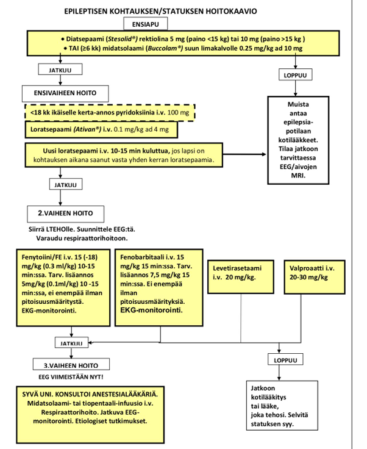
  

### 2-vuotias lapsi lyönyt kotona pään oveen, tästä seurannut raivokas itkukohtaus, lapsi lakannut hengittämästä, kouristanut, mennyt veltoksi. Vironnut nopeasti mutta ollut unelias ja nukkunut. Vanhempien mukaan kohtaus kestänyt ehkä minuutin. Nyt vastaanotolla leikkii normaalisti. Mitä lisätietoja kysyt vanhemmilta? Mitä tutkit? Pohdi erotusdiagnostiikkaa. {#2v-lyonyt-paan-oveen}

  <button class="solution-button"
          data-label="Vastaus"
          data-hide-label="Piilota vastaus">
    Vastaus
  </button>
  

Anamneesi: 

<li>Tarkistetaan kohtauksen tarkka kulku</li>
  <ul>
    <li>Alkoiko kohtaus tyyppiä isku → kipu/raivoitku →hengityksen pidättäminen → värin muutos → tajuttomuus ja kouristus/velttous?</li>
    <li>Hengityskatkon luonne: Pysähtyikö hengitys uloshengitysvaiheeseen itkun päätteeksi?</li>
    <li>Lapsen ihonväri: Menikö lapsi kohtauksen aikana siniseksi/sinerryksiin (syanoottinen) vai hyvin kalpeaksi/harmaaksi (valkea/pallidi kohtaus)?</li>
    <li>Kouristuksen ja veltostumisen piirteet: Oliko raajoissa nykimistä, jäykistymistä vai pelkkää velttoutta? Olivatko silmät kiinni? Tuliko virtsat alle? Puriko kieltä/suuta?</li>
    <li>Toipuminen: Oliko lapsella kohtauksen jälkeen jännite- tai halvausoireita, vai oliko hän uneliaisuutta lukuun ottamatta normaali virkoamisen jälkeen?</li>
  </ul>
<li>Vammamekanismi</li>
  <ul>
    <li>Kuinka kova isku oli kyseessä (vauhti, osumakohta)?</li>
    <li>Oksensiko iskun jälkeen. Onko korvista tai nenästä tullut kirkasta eritettä tai verta? Muita trauman merkkejä?</li>
  </ul>
<li>Taustatiedot ja sukuhistoria</li>
  <ul>
    <li>Onko vastaavia kohtauksia ollut aiemmin suututtavan, pelottavan tai kivuliaan tilanteen yhteydessä?</li>
    <li>Onko lapsella ollut kuumekouristuksia tai epileptisiä kohtauksia?</li>
    <li>Esiintyykö suvussa kouristuskohtauksia, epilepsiaa, selittämättömiä pyörtymisiä, rytmihäiriöitä tai varhaisia äkkikuolemia (pitkä QT -syndrooma)?</li>
    <li>Onko lapsella kuumetta, infektiota tai todettua anemiaa / raudanpuutetta?</li>
  </ul>

---

Statuksessa kattava neurologinen status ja yleisstatus: 

<li>Yleistila, vitaalit, sydän, keuhkot yms</li>
<li>Vamman merkit (kallo, tärykalvot, nenä, raajat, suu...)</li>
<li>Tajunnantaso, virkeys, pupillit, aivohermot, yms</li>

---

Todennäköisin erotusdiagnostinen vaihtoehto tämän anamneesin perusteella on ns. **affektikohtaus (tikahtumiskohtaus, breathholding spell).** Niitä esiintyy erityisesti leikki-ikäisillä ja jopa n. 5%:lla lapsista. 

Tikahtumiskohtaukset voidaan jakaa syanoottisuus- tai kalpeuskohtauksiin. Syanoottiset tikahtumiskohtaukset ovat yleisempiä (85 % tapauksista) kuin kalpeat ja pienellä osalla lapsista esiintyy molempia muotoja

<li>Syanoottinen kohtaus alkaa tyypillisesti mielipahan tai lievänkin kivun aiheuttamasta itkusta. Tavallisesti lapsi itkee hyvin ponnekkaasti ja itkun aikana tikahtuu sinistyen ennen kuin menettää hetkellisesti tajuntansa</li>
<li>Affektikohtauksen harvinaisempi (15 %) muoto on pienen lapsen kalpeus-velttouskohtaus, joka liittyy useimmiten kipuärsykkeeseen tai pelästymiseen. Itku voi jäädä hyvin lyhyeksi tai huomaamattomaksi, ja äänekkään syvään hengityksen jälkeen hengityksen pysähdys on lyhyt. Lapsi menee kalpeaksi, muutoin oireet ja kohtauksen kesto muistuttavat syanoottista kohtausta. Kalpean tikahtumiskohtauksen jälkeen lapsella voi olla jälkiväsymystä, varsinkin jos lapsella on ollut aivojen hapenpuutteesta johtuva lyhyt kouristus</li>

---

Tikahtumiskohtausten patogeneesi on epäselvä, mutta se on todennäköisesti monitekijäinen. Mahdollisena taustasyynä on pidetty autonomisen hermoston säätelyn häiriötä. Tikahtumiskohtauksia esiintyy 20–35 %:ssa tapauksista myös muilla perheenjäsenillä, joten niihin liittyy todennäköisesti geneettinen alttius. Raudanpuuteanemia on tunnettu altistava tekijä (varsinkin kehitysmaissa). 

**Tyypilliset provosoivat tekijät ja tyypillinen oirekuva riittävät yleensä tikahtumiskohtausdiagnoosiin.** Tikahtumiskohtauksia saavilta lapsilta voi harkita raudanpuuteanemian poissulkemista. Kalpeissa tikahtumiskohtauksissa on muistettava pitkä QT -oireyhtymän mahdollisuus -> **EKG siis herkästi ja suositellaan ottamaan aina, jos lapsi tulee tajunnanmenetyksen vuoksi lääkäriin.**

Jos tikahtumiskohtausoireita esiintyy ilman selkeää altistavaa syytä tai unessa, suositellaan tarkempia jatkoselvittelyjä. Tikahtumiskohtausten ennuste on hyvä, ja niillä ei ole todettu olevan vaikutusta lasten kehitykseen

---

Tietysti tulee pitää mielessä mm. traumaattinen pään vamma ja sen aiheuttama kouristus, mutta kouristusta edelsi itkuvaihe eikä vamma kuulostanut korkeaenergiseltä. Seurataan kuitenkin aivovamman varalta (esim. jos ilmenee toistuvaa oksentelua tai poikkeavaa vetämättömyyttä).

Mahdollisuutena voi myös olla epileptinen kohtaus, mutta anamneesi kuulostaa enemmänkin ei-epileptiseltä. Kuumekouristuskin pidettävä mielessä, jos kohtaushetkellä tai sen jälkeen todetaan nouseva kuume tai taustalla oleva infektio.

Mahdollinen vaihtoehto vielä on kardiologinen tai heijasteperäinen synkopee. Kivusta tai säikähdyksestä laukeava vakava rytmihäiriö voi aiheuttaa pyörtymisen ja aivohypoksiasta johtuvan kouristuksen. Samoin heijasteperäisenä voi synkopee tapahtua. 

---

**Eli siis: Jos kliininen tutkimus ja neurologinen status ovat täysin normaalit ja anamneesi tukee affektikohtausta, vanhemmille annetaan tieto kohtauksen vaarattomuudesta. Otetaan EKG pidentyneen QT-ajan ja muiden kardiologisten syiden poissulkemiseksi. Ainakin jos tulee samanlainen kohtaus, niin tarkistetaan laboratorioarvot (kuten p-ferritiini ja hemoglobiini), sillä raudanpuute altistaa affektikohtauksille ja sen hoito usein vähentää kohtauksia.**

  

### 3v lapsi. Oppinut huonosti puhumaan. Sanavarasto noin 20 sanaa ja puhuu lisäksi omaa kieltä, mitä vaan vanhemmat ymmärtää. Mikä ensisijainen diagnoosi? Mitä ja miten tutkit? {#3v-puhuu-omaa-kielta}

  <button class="solution-button"
          data-label="Vastaus"
          data-hide-label="Piilota vastaus">
    Vastaus
  </button>
  

2-3-vuotiaan lapsen tulisi hallita jo n. 50-600 sanaa (tarkan määrän arviointi alkaa tässä kohtaa monesti jo olla vaikeaa); 2-vuotias puhuu ainakin 2-3 sanan yhdistelmiä ja 3-vuotias jo 3-5 sanan lauseita. 3-vuotiaana kielessä myös monipuolisesti verbejä ja taivutusmuotoja, kertoo pieniä tapahtumia ja kuvailee asioita. Puhe yhä paremmin ymmärrettävää vieraalle kuulijalle (n. 75%). 

Tämä kielellinen kehitys on siis merkittävästi vajavaista. Ensisijainen työdiagnoosi on siis **kehityksellinen kielihäiriö (DLD; F80.1 (tuotto) ja F80.2 (ymmärtäminen)).** Mahdollisia erotusdiagnostisia syitä ovat mm. _heikko kuulo, laaja-alainen kehitysviive/kehitysvamma, neurodegeneratiiviset sairaudet, autisminkirjon häiriö sekä puheen motoriset häiriöt._

---

Perusterveydenhuollossa aloitetaan tietysti anamneesista ja statuksesta. 

<li>Anamneesissa</li>
  <ul>
    <li>Kokonaiskehitys, taantuminen, arjen taidot (syöminen, juominen; kuolaako, osaako pureskella)</li>
    <li>Perheen psykososiaalinen tilanne</li>
    <li>Leikkiminen, sosiaalinen vuorovaikutus, päiväkodin palaute</li>
    <li>Raskaus, synnytys</li>
    <li>Onko vanhemmilla/muilla herännyt huolta kuulosta</li>
    <li>Perussairaudet, lääkitys, onko sairastellut paljon</li>
    <li>Sukuanamneesi</li>
    <li>Ajattelevatko vanhemmat, että on enemmän ongelma ymmärtämisessä vai tuottamisessa? Muita huolen aiheita? Miten toimivat lapsen kanssa arjessa? Onko jo jotain hoitokokeiluja?</li>
  </ul>
<li>Status</li>
  <ul>
    <li>Yleinen terveydentila, yleisstatus, dysmorfiset ulkonäköpiirteet, ulkoiset anommaliat, iho (neurokutaanioireyhtymät)</li>
    <li>Kasvu (pituus, paino, päänympärys)</li>
    <li>Huulien, kitalaen ja kielijänteen anatomian tarkastus. </li>
    <li>Näkö, kuulo</li>
    <li>Ymmärrys (ymmärtääkö yksivaiheisia ohjeita, entä kaksivaiheisia?); osaako nimetä asioita kuvista jos osoittaa</li>
    <li>Korvaavien viestintäkeinojen käyttö: Osoittaako lapsi haluamiaan asioita, käyttääkö eleitä, ilmeitä tai ottaako aikuista kädestä kiinni?</li>
    <li>Vuorovaikutus ja leikki: Miten lapsi ottaa katsekontaktia? Esiintykö yhteistä huomiota (joint attention, esim. näyttääkö lapsi lelua vanhemmalle innoissaan)? Millaista leikki on?</li>
    <li>Motoriikan arvio</li>
  </ul>

---

Seuraavaksi vaaditaan neuvolassa puheterapeutin arvio. Jos herää epäily laajemmasta kehitysviiveestä (≥2 kehityksen osa-alueen selkeä poikkeama ikäodotuksesta; esim. kielellisten taitojen lisäksi motoristen taitojen puute), niin lähete muihinkin selvittelyihin (esim. psykologi tai fysioterapeutti) ja lähete esh:n tutkimuksiin, mikäli kauttaaltaan/kokonaisuutena erittäin heikot kognitiiviset taidot = kehitysvammaepäily. 

Pyydetään myös arvio lapsen viestinnästä vertaisryhmässä, jos sitä ei ole vielä (eli siis päiväkodin arvio tilanteesta). 

---

**Lapsen kuntoutus ja muut tukitoimet tulee aloittaa heti, kun lapsen viivästynyt kielen kehitys havaitaan. Puheterapeutti ohjaa vanhempia ja lapsen päivähoidon henkilökuntaa kielen kehityksen tukemisessa ja aloittaa tarvittaessa myös yksilökuntoutuksen. **

On tärkeää, että lapsen kielen kehitystä lähdetään tukemaan heti ongelmien ilmaannuttua, eikä jäädä odottelemaan mahdollista kehityksellisen kielihäiriön diagnoosia. Mikäli lapsen kielelliset vaikeudet ovat huomattavia, puhetta tukevat ja korvaavat kommunikointikeinot, kuten kuvat ja viittomat (AAC-keinot), otetaan käyttöön mahdollisimman varhain. Näin lapselle tulee mahdollisuus itseilmaisuun ja kommunikaatioon ja myös puheen ymmärtäminen saa tukea. Toimiva kommunikointi lapsen ja hänen lähipiiriinsä kuuluvien ihmisten välillä on tärkeää.

Kehityksellisen kielihäiriön ensisijainen hoito on usein on puheterapia (määrä vaihtelee tilanteen mukaan esim. 20 (HVA:n tuottamana) - 45 (yleensä Kelan tuottamana) x45min/vuosi), mutta sen lisäksi tai sijasta voidaan tarpeen mukaan suositella myös muita terapioita, kuten neuropsykologista kuntoutusta. Lapsen puheterapian sisältö ja määrä suunnitellaan aina yksilöllisesti. Puheterapia tukee erityisesti niiden kielellisten osa-alueiden kehitystä, joissa on ongelmia. 

Kun lapsella on diagnosoitu kehityksellinen kielihäiriö, lääkärin johtama moniammatillinen työryhmä suunnittelee terapian keskeiset tavoitteet, tiiviyden ja arvioi vaikuttavuuden. Tässä tapauksessa kyseessä on sen verran vaikea tilanne, että hoito kuuluu pääasiassa ESH. _Puheterapeutin arvion jälkeen siis todennäköisesti tehdään lähete ESH ja aloitetaan samalla jo tukitoimia._

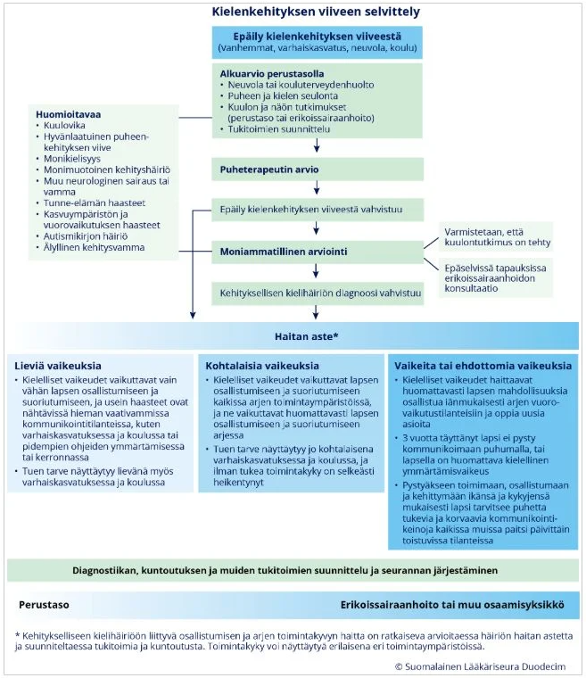
  

### 10kk käyttää vain vasenta kättä hienomotorisissa taidoissa. Erotusdg. Mitä teet? {#10kk-vain-vasen-kasi}

  <button class="solution-button"
          data-label="Vastaus"
          data-hide-label="Piilota vastaus">
    Vastaus
  </button>
  

Alle vuoden ikäisen vauvan kuuluisi käyttää molempia käsiään suunnilleen symmetrisesti ja yhtä paljon. Jos imeväisikäinen suosii toista kättä, tämä on poikkeavaa, vaikka lievä suosiminen onkin mahdollista normaalivariaation kautta. Lapsen todellinen kätisyys alkaa kehittyä ja näkyä selvemmin vasta 2–4 vuoden iässä, ja se vakiintuu lopullisesti vasta esikoulu- tai kouluiän kynnyksellä. Vaikka kätisyys määräytyykin osittain jo varhain sikiökaudella, vauvavuoden aikana molemmanpuoleinen ja tasainen raajojen käyttö on merkki normaalista motorisesta kehityksestä. 

**Jos pieni vauva suosii selkeästi toista kättä, niin tulisi pysähtyä ja miettiä, onko taustalla jotain patologista. Mahdollisia erotusdiagnostisia vaihtoehtoja ovat mm. CP-vamma tai hartiapunoksen/muun ääreishermon vamma.**

---

Vastaanotolla otetaan **perusteellinen anamneesi ja yleisstatus+neurologinen status.** Pyritään arvioimaan käden suosimista tarkasti: Tarjoa lelua suoraan keskiviivaan tai oikealle puolelle. Ojentaako vauva aina vasemman käden? Ottaako oikealla kiinni lainkaan vai jääkö oikea käsi passiiviseksi? Onko oikeassa kädessä ollenkaan liikettä, yritä tunnistaa lihasheikkous? Onko käyttänyt kättä aiemmin normaalisti: onko kyseessä taantuma vai puutoksen jatkuvuus?

---

Lapsesta tulee tehdä kiireellinen lähete lastenneurologille, jos vaikuttaa siltä, että kyseessä voisi olla CP-vamma. Taantuminenkin on aina poikkeavaa (eli jos käyttänyt kättä aikaisemmin hyvin) -> neurodegeneratiivisena sairautena/neuromuskulaarisairautena yms lähete ESH. 

  

### 14-v tyttö, voimakas toispuoleinen päänsärky, pahoinvointia ja oksentelua, edeltävästi oikean raajaparin tunnottomuus ja heikkous, kotona kipulääkkeet eivät ole auttaneet. Mitä anamnestisia tietoja? Erotusdiagnostiikka? Kuinka toimit?  {#14v-voimakas-paanvarky}

  <button class="solution-button"
          data-label="Vastaus"
          data-hide-label="Piilota vastaus">
    Vastaus
  </button>
  

Pääasiallisesti on tärkeintä erottaa vaaralliset keskushermostoa affisioivat sairaudet tyypillisestä migreenikohtauksesta. Erotusdiagnostiikkaan tällä oirekuvalla siis kuuluu pääasiassa **hemipleginen migreeni, aivoinfarkti/TIA/sinusvenustromboosi tai intrakraniaalinen prosessi (SAV, ICH, kasvain).** Tietysti myös keskushermostoinfektiot tulee pitää mielessä akuuteissa päänsäryissä.

Todennäköisin on hemipleginen migreeni, joka ilmenee useimmiten nuorilla päänsärkynä, näköauroina ja itsestään paranevina toispuoleisina halvausoireina. Triptaaneja ei tule käyttää näiden migreenien hoidossa; samoin jos on aivorunkomigreeni (huimaus, näönmenetys, puheentuoton häiriö, silmän liikehäiriö, tinnitus, raajakömpelyys, vireystason lasku).

---

Anamneesissa: 

<li>Anamneesissa</li>
  <ul>
    <li>Oireiden alku ja kehitys: Alkoivatko puutumiset ja heikkoudet äkillisesti (sekunneissa/minuuksissa, viittaa vaskulaariseen tapahtumaan) vai kehittyivätkö ne vähitellen yli 5–20 minuutin aikana (tyypillinen migreeniaura)?</li>
    <li>Auran kesto: Kuinka kauan toispuoleinen tunnottomuus ja heikkous kestivät/ovat kestäneet (Auraoire kestää tyypillisesti alle 60 minuuttia ennen päänsäryn alkua; yli tunnin kestävät tai pysyvät puutokset ovat poikeavia)</li>
    <li>Suku- ja migreenihistoria: Onko tytöllä tai lähisuvussa (äiti/sisarukset) diagnosoitu migreeniä? Onko kyseessä tuttu oirekuva aiemmista kohtauksista?</li>
    <li>Muut neurologiset oireet: Onko esiintynyt kaksoiskuvia, näkökenttäpuutoksia, huimausta, tasapainovaikeuksia, puheen puuroutumista tai tajunnan heikkenemistä?</li>
    <li>Lääkehistoria ja laukaisijat: Mitä kipulääkkeitä on otettu ja millä annoksella? Onko tyttö aloittanut yhdistelmäehkäisytabletit (e-pillerit), joihin liittyy veritulppariski aurasairailla? Liittyykö tilanteeseen valvomista, stressiä, runsasta ruutuaikaa? Kuukautiskierron vaihe?</li>
  </ul>
<li>Statuksessa</li>
  <ul>
    <li>Välitön ABCDE</li>
    <li>Yleisstatus, neurologinen status, vitaalit</li>
  </ul>

---

Konsultoidaan lastenneurologia. Jos kyseessä on ensimmäinen hemipleginen kohtaus tai jos raajojen heikkous ja puutokset eivät ole täysin väistyneet, aivot on kuvattava välittömästi aivoinfarktin, tai verenvuodon poissulkemiseksi. **Aivoverenkiertohäiriö täytyy sulkea pois akuuteissa migreeneissä erityisesti, kun esiintyy ensimmäistä kertaa motorinen (hemipleginen) tai aivorunkoperäinen auraoire tai aura pitkittyy huomattavasti tai on muuten epätyypillinen.**

Jos ei poikkeavaa kuvassa, niin hoito on iv nsaid+parasetamoli ja ondansetroni sekä tarvittaessa nesteytys. Triptaanit ovat vasta-aiheisia hemiplegisessä migreenissä. 

Jatkossa hoidossa mm. nsaid+parasetamoli kotona päänäsrkyyn ja E-pillerikielto: Mikäli tytöllä on migreeni auraoireinen migreeni, yhdistelmäehkäisytablettien (estrogeeni) käyttö on vasta-aiheinen aivoinfarktiriskin vuoksi

  

### 2-vuotias joka ei puhu ymmärrettäviä sanoja eikä leiki ikätovereiden kanssa {#2v-ei-leiki}

  <button class="solution-button"
          data-label="Vastaus"
          data-hide-label="Piilota vastaus">
    Vastaus
  </button>
  

Sanamattomuus ja ikätovereihin kohdistuvan kiinnostuksen tai leikin puute 2-vuotiaalla lapsella ovat merkittäviä kehityksen punaisia lippuja. Tässä iässä lapselta odotetaan yleensä noin 50 sanan sanavarastoa, 2-3 sanan lauseita, reagoimista omaan nimeen sekä kiinnostusta muihin lapsiin (vähintään rinnakkaisleikkiä ja toisten havainnointia).

Puutokset sekä kielellisissä että sosiaalisissa taidoissa edellyttävät aina kokonaisvaltaista kehityksellistä arviointia. Erotusdiagnostiikkaan kuuluu mm. autismikirjon häiriöt, laaja-alainen kehitysviive, kuulonalenema, kehityksellinen kielihäiriö ja deprivaatio. 

---

Anamneesissa: 

<li>Sosiaalinen vuorovaikutus ja kommunikaatio: Reagoiko lapsi omalle nimelleen? Osoittaako hän sormella asioita näyttääkseen niitä muille tai pyytääkseen jotain? Ottaako lapsi luontevaa katsekontaktia? Käyttääkö hän kehonkieltä, vilkuttamista, pään nyökkäämistä? Hymyileekö lapsi?</li>
<li>Leikkiminen: Huomioiko lapsi toisia lapsia laisinkaan. Leikin sisältö? </li>
<li>Joustavuus ja aistit: Suuttuuko lapsi poikkeavan voimakkaasti pienistä rutiinien muutoksista? Esiintykö aistiherkkyyksiä (esim. kovien äänien peittäminen, tiettyjen vaatteiden tai ruoka-aineiden ehdoton torjunta)?</li>
<li>Puheen ymmärtäminen: Ymmärtääkö lapsi arjen tuttuja kehotuksia ilman elekielen tukea</li>
<li>Muu kehitys esim. kävely, juoksu, esineisiin tarttuminen, arjen toiminnot</li>

---

Status: 

<li>Yleisstatus</li>
<li>Korvat, kuulo</li>
<li>Kasvu: pituus, paino, pää</li>
<li>Motoriikka</li>
<li>Puhe, ymmärtääkö kehoituksia</li>
<li>Leikkiminen vastaanotolla</li>

---

Koska oirekuvassa yhdistyvät kielellinen viive ja sosiaalisen vuorovaikutuksen haasteet, lapsi tarvitsee moniammatillisen arvioinnin:

Neuvolassa puheterapeutin arvio sekä psykologin arvio. Mikäli herää selvä epäily autismikirjon häiriöstä tai laaja-alaisesta kehitysviiveestä, lapsi lähetetään erikoissairaanhoitoon diagnostisiin jatkoselvityksiin. Puhetta tukevien menetelmien (kuvat, tukiviittomat) käyttö aloitetaan välittömästi kodissa ja varhaiskasvatuksessa, eikä esim. kielellisen kehityksen häiriö diagnoosia jäädä odottamaan.

  

## 2024 

### Lapsella 2kk ajan päänsärkyä, nyt lähes päivittäin. Särky alkaa öisin/aamuisin. Oksentelua, pahoinvointia. Ollut koulustakin poissa. Kipulääke ei tehoa, särky ohittuu päivän mittaan. Mitä tutkit? Mitä diagnoosivaihtoehtoja? Jatkot? {#2kk-paansarkya-lahes-paivittain}

  <button class="solution-button"
          data-label="Vastaus"
          data-hide-label="Piilota vastaus">
    Vastaus
  </button>
  

Tämä oirekuva on hälyttävä (ns. red flag) ja vaatii kiireellisiä jatkotutkimuksia erikoissairaanhoidossa. 

_Yöllä tai aamulla herättävä päänsärky, johon liittyy aamuisin esiintyvää pahoinvointia ja oksentelua ja johon kipulääke ei tehoa, viittaa vahvasti kohonneeseen kallonsisäiseen paineeseen (kohonnut ICP)._ Oireiden paheneminen kahden kuukauden aikana kertovat etenevästä ja orgaanisesta syystä; todennäköisimmin jokin **aivokasvain** kyseessä.

---

Anamneesissa 

<li>Selvitellään kivun luonnetta tarkemmin: Paheneeko särky makuulla ollessa, yskiessä, ponnistellessa tai päätä taivuttaessa? (Makuuasento nostaa kallonsisäistä painetta)</li>
<li>Näkö- ja neurologiset oireet: Onko esiintynyt kaksoiskuvia, näön hämärtymistä, tasapainovaikeuksia tai raajojen kömpelyyttä?</li>
<li>Käytös ja yleistila: Onko lapsella ollut poikkeavaa väsymystä, persoonallisuuden muutoksia, muistihäiriöitä tai ruokahaluttomuutta?</li>
<li>Muita oireita? Sukuanamneesi? Säteilyhoitoa pään alueella? Perussairauksia? Lääkitys?</li>
<li>Kehityksessä taantumaa?</li>
<li>Uni?</li>

---

Statuksessa 

<li>Silmänpohjat: papillaturvotus?</li>
<li>Kattava neurologinen ja yleinen status</li>
<li>Verenpaine ja syke</li>

---

Muita mahdollisuuksia ovat mm. uniapnea (aamupäänsärky), lääkepäänsärky (jos saanut päivittäin pitkän aikaa kipylääkkeitä), migreeni (ei yleensä kyllä ole kipulääkkeille reagoimaton ja aamuyöstä herättävä)... 

Epäilys kohonneesta kallonsisäisestä paineesta ja etenevät oireet -> tehdään **päivystyslähete ESH** (voidaan kyllä konsultoida päivystäjää ja kysyä ottavatko mieluummin esim. kiireellisesti seuraavana arkiaamuna vai miten toimitaan, mutta periaatteessa päivystyslähete on indikoitu). Pään MRI varjoaineella on ensisijainen kuvantamiskeino. 

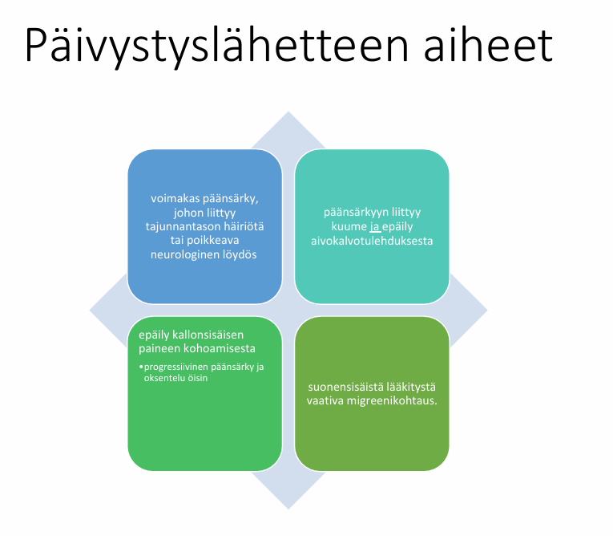
  

### Vanhemmat tuo 6kk vauvan neuvolavo:lle. Vauva on ollut itkuisempi edeltävät viikot, vanhemmat kertovat ettei vauva ole kehittynyt. Vauva myös herätessä/heräämisen jälkeen levittää käsiä sarjamaisesti sivuilleen. Mikä todnäk dg? Muu erotusdg? Mitä lisätietoja kaipaat? Mihin kiinnität huomiota kliinisessä tutkimuksessa? Mitä jatkoja PTH:ssa? {#6kk-itkuisempi-ei-kehity}

  <button class="solution-button"
          data-label="Vastaus"
          data-hide-label="Piilota vastaus">
    Vastaus
  </button>
  

Tärkein diagnoosi, joka pitää tulla mieleen on infantiilispasmit (Westin oireyhtymä). Infantiilispasmioireyhtymä edustaa vajaata puolta imeväisiässä alkavista epilepsioista. **Se on erityisen tärkeää tunnistaa, koska aiheuttaa kehityksen pysähtymisen ja pitkään jatkuessaan taantumisen.**

Alkamisikä vaihtelee muutamasta kuukaudesta vuoteen; **tyypillisimmin oireet alkavat noin puolen vuoden (2-12kk) iässä.** Oireyhtymän syinä voivat olla vastasyntyneisyyskauden aivoinfarkti tai vaikea asfyksia, aivojen epämuodostumat, tuberoosiskleroosi sekä aivojen kehitykseen vaikuttavat aineenvaihduntasairaudet tai geneettiset syyt, mutta aina syytä ei löydetä (n. 20% idiopaattisia). Suomessa n. 20-30 lasta/vuosi

---

**Tyypillinen kohtaus on infantiilispasmisarja, jonka aikana lapsi jäykistyy toistuvasti noin 0.5-1 sekunnin ajaksi koukistus- tai ojennusasentoon ja joka tavallisimmin alkaa heräämisen jälkeen.** Spasmisarja alkaa ja loppuu yleensä vähitellen ja voi kestää muutamasta minuutista puoleen tuntiinkin. Spasmit voivat olla epäsymmetrisiä tai hyvin lieviä. Tällaisen sarjan aikana lapseen ei saa kontaktia. 

_Toisinaan kohtaukselliset oireet ovat niin vähäisiä, että vanhemmat eivät niitä edes huomaa, ja lapsi tulee tutkimuksiin kehityksen hidastumisen tai jopa taantumisen vuoksi._

---

Muita mahdollisia erotusdiagnostisia aiheuttajia voi olla mm. hyvänlaatuinen varhaisiän myoklonus (nykäyksiä nukahtaessa tai herätessä, mutta lapsen kehitys jatkuu täysin normaalina eikä EEG:ssä todeta poikkeavaa), GERD ja sen aiheuttama Sandiferin oireyhtymä (syömisen jälkeistä kipuitkua ja kaulan tortikollista/ekstensiota, joka voidaan sekoittaa kouristeluun), muut epilepsiat, metaboliset sairaudet ja aivovammat / aivoverenvuoto. 

Anamneesissa: 

<li>Esiintyykö kohtauksia aina tietyssä vuorokaudenajassa (esim. juuri herätessä)? Kuinka montia nykäystä yhteen sarjaan kuuluu, kuinka tiheään ne toistuvat. **Onko vanhemmilla videota kohtauksesta?**</li>
<li>Kehityshistoria, mitä on jo oppinut, mitä ei nyt osaa?</li>
<li>Raskaus, synnytys? Sukuanamneesi</li>

---

Statuksessa vuorovaikutus, neurologinen kehitystaso, ihotarkistus (esim. "Ash-Leaf" Spots tuberoosiskleroosissa, joka on yksi tärkeä Westin oireyhtymän aiheuttaja), päänympärys, kasvukäyrät, aivohermot ja heijasteet... 

---

Jotta infantiilispasmien diagnoosi ei viivästyisi, kaikkien heräämisen jälkeen sarjamaisesti toistuvien stereotyyppisten oireiden tulisi herättää infantiilispasmiepäily. Lisäoireena on usein kehityksen pysähtyminen tai taantuminen, joka voi alkaa jo ennen kuin kohtausoireet havaitaan tai vasta kohtausten kestettyä jo useamman viikon. **Lapset, joilla epäillään infantiilispasmeja, tulee ohjata päivystyksenä lastenneurologian yksikköön.** Ei siis jatkoja PTH:ssa. 

  

## 2023 

### 1-vuotias lapsi ei varaa ollenkaan alaraajoilleen: erotusdg, mitä teet {#1v-ei-varaa-jaloille}

  <button class="solution-button"
          data-label="Vastaus"
          data-hide-label="Piilota vastaus">
    Vastaus
  </button>
  

1-vuotiaan lapsen äkillinen tai nopeasti alkanut alaraajavarauksen puuttuminen (lapsi ei suostu seisomaan, varaamaan jalalleen tai konttaa mieluummin) on aina päivystyksellinen oire, kunnes vakavat tulehdukset ja murtumat on poissuljettu.

Tietysti kyseessä on eri asia, jos lapsi ei ole koskaan varannut jaloilleen ja kyseessä on enemmänkin hidas kehitys. **Jo 6kk ikäisen vauvan tulisi varata jalkoihinsa jonkin verran; tulisi huolestua viimeistään, jos ei varaa alaraajoilleen osittainkaan 8kk iässä.** 9kk nousee jo pystyyn tukea vasten. 12kk tulisi jo osata kävellä tukien tai tuetta. 

Erotusdiagnostiset vaihtoehdot siis poikkeavat merkittävästi sen suhteen, onko kyseessä uusi ongelma vai tilanne, jossa lapsi ei ole oppinut varaamaan jaloilleen. Kehityksellisessä ongelmassa erotusdiagnostisia vaihtoehtoja ovat mm. CP-vamma, laaja-alainen kehitysviive, perifeeriset neurologiset ja lihakselliset sairaudet (spinaalinen lihasatrofia, lihasdystrofiat), ortopediset rakenneviat (molemminpuolinen lonkkaluksaatio, alaraajojen virheasennot), luutuumorit (aiheuttavat varaamisessa kipua)... 

---

Anamneesissa: 

<li>Onko joskus varannut jaloilleen?</li>
<li>Kehityshistoria tarkemmin; motorinen, kielellinen, sosiaalinen kehitys?</li>
<li>Raskaus ja synnytys?</li>
<li>Sukuanamneesi?</li>
<li>Ravitsemusanamneesi?</li>

---

Statuksessa: 

<li>Tonus, heijasteet, koetetaan pystyasennossa ottaako tukea jaloilla...</li>
<li>Lonkkien tutkiminen, lihasmassa...</li>
<li>Yleisstatus, kasvu</li>
<li>Miten liikuttaa jalkojaan yleisesti; onko lihasheikkouteen viittaavaa. Hypotonia ilman lihasheikkoutta viittaa aivoperäiseen syyhyn</li>

---

**Lähetä potilas ESH.** Vaatii CP-vammaepäilynä (tai jos olisi jokin muukin, niin silloinkin kyllä lähes aina tarvitsee ESH) ESH-tutkimuksia (aivojen MRI yms). 

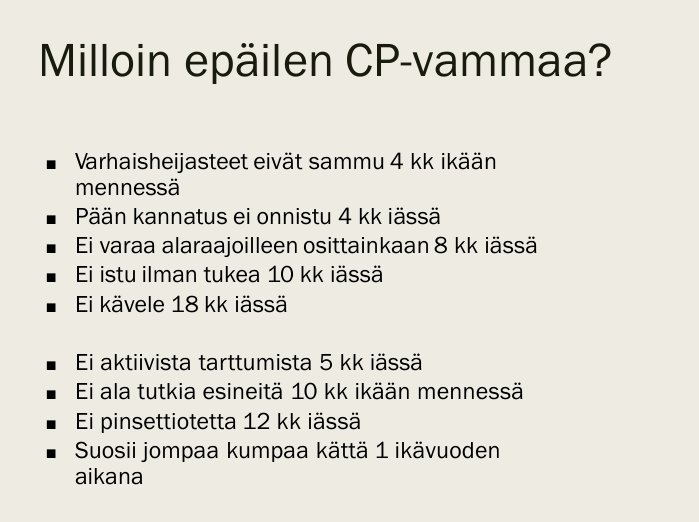
  

### 15 v tajuton, vanhemmat eivät ole saaneet hereille, hengittää, saturaatio, ht ja rr normaalin rajoissa, ollut kavereiden kanssa, vanhemmat nukkumassa kun tuli kotiin. Tulee ambulanssilla päivystykseen. Mitä toimenpiteitä ja tutkimuksia suunnittelet? Mitkä erotusdg pitää pitää mielessä? {#15v-tajuton}

  <button class="solution-button"
          data-label="Vastaus"
          data-hide-label="Piilota vastaus">
    Vastaus
  </button>
  

Aina edetään ABCDE: 

<li>A ja B: hengittää ilmeisesti hyvin; ota happisaturaatio ja tarvittaessa lisähappea. Valmistaudu intubaatioon/larynksmaskin asettamiseen, jos merkittävän matala GCS (8 tai alle).</li>
<li>C: verenpaine, syke ilmeisesti ok; seurantaa jatketaan</li>
<li>D: verensokeri heti (korjaa tarvittaessa), arvioi GCS, tarkista pupillit</li>
<li>E: ruumiinlämpö, etsi vamman merkkejä, petekioita, piikkijälkiä, eritteitä yms</li>

---

Kun potilaan tila on vakaa, aloitetaan tajuttomuuden syyn selvittäminen. Mahdollisten silminnäkijöiden kertomus tajuttomuuden alusta ja sitä edeltäneistä oireista on ensiarvoisen tärkeä, samoin kaikki saatavilla olevat tiedot aiemmista sairauksista ja lääkityksistä.

Tajuttomuuden yleisimmät syyt voi muistaa yleisessä käytössä olevasta muistisäännöstä "VOI IHME!"

<li>V = Vuoto kallon sisällä (spontaani, traumaattinen)</li>
<li>O = O2 puute (globaali anoksia, aivoinfarkti)</li>
<li>I = Intoksikaatio (muista epäillä!)</li>
<li>I = Infektio (meningiitti, enkefaliitti)</li>
<li>H = Hypoglykemia (muista mitata!)</li>
<li>M = Matala verenpaine</li>
<li>E = Epilepsia; lapsen tajuttomuuden yleisin syy on epileptinen kohtaus (voi olla jälkiuni tai nonkonvulsiivinen status epilepticus</li>
<li>! = Simulaatio (poissulkudiagnoosi)</li>

---

EKG, thx-rtg, astrup, elektrolyytit, PVK, CRP, Krea, Urea, ALAT, EtOH, huumeseula, u-kemseul, CK, TnT. Likvori aina paikallaan epäiltäessä infektiota (tai tulehduksellista keskushermostosairautta) tai jos tajuttomuuden syy ei muuten selviä (esim. kuume, niskajäykkyys, infektioanamneesi).

Pään natiivi tietokonetomografia (TT) on yleensä tajuttoman potilaan ensisijainen kuvantamistutkimus ja tehdään viipymättä jos ei löydy metabolista/toksista syytä, todetaan puolieroja, epäillään pään vammaa...; tarvittaessa MRI tai angiografia. 

EEG tarvitaan usein, varsinkin jos epäillään ns. nonkonvulsiivista status epilepticusta. Voi antaa viitteitä myös infektioista (esim. herpes-enkefaliitti).
  

### 8 kk lapsi itkuinen, ei ota kontaktia, ei kiinnostu tai seuraa katseellaan leluja, oppinut aikaisemmin kääntymään kyljen kautta muttei nyt ole tehnyt tätä viikkoon, muutoin perusterve esikoinen, vanhemmat huolissaan. Mikä todennäköisin dg., jatkosuunnitelmat? {#8kk-itkuinen-ei-kaanny-enaa}

  <button class="solution-button"
          data-label="Vastaus"
          data-hide-label="Piilota vastaus">
    Vastaus
  </button>
  

Lapsella taantumaa: oppinut aikaisemmin ottamaan hyvin kontaktia, seuraamaan leluja ja kääntymään kyljen kautta. Nyt ei ainakaan viikkoon ole kääntymistä kyljen kautta tehnyt. Taantuma on aina neurologinen hälytysmerkki. 

Taustalla voi olla mm. jokin epileptinen enkefalopatia / infantiilispasmit, kallonsisäinen prosessi/kohonnut ICP, keskushermostoinfektio tai metabolinen/neurodegeneratiivinen sairaus. Todennäköisimmin jos ei ole muita oireita kuin vain taantuma, niin työdiagnoosina voidaan pitää infantiilispasmeja, koska tässä iässä (tyypillisesti 2–12 kk) alkava Westin oireyhtymä ilmenee oppikirjamaisesti oppitujen taitojen taantumisena, sosiaalisen kontaktin ja katsekontaktin sammumisena sekä selittämättömänä itkuisuutena/ärtyneisyytenä. Vanhemmat eivät välttämättä ole vielä tunnistaneet hienovaraisia nykäyksiä tai sivuille suuntautuvia sarjamaisia käsi- tai vartalospasmeja

Kerätään vastaanotolla myäs tarkempi anamneesi vanhemmilta (onko ollut nykäyksiä varsinkin heräämisen yhteydessä, onko lapsella ollut pään vammoja, kuumetta tai infektio-oireita). Tehdään tarkka yleispediatrinen ja neurologinen status. Mitataan päänympärys. 

**Lapset, joilla epäillään infantiilispasmeja, tulee ohjata päivystyksenä lastenneurologian yksikköön.** 

  

### Vanhemmat epäilevät 2.5-vuotiaalla Jeminalla autismia, kehitys ollut normaalia - anamnestiset lisätiedot, erotusdg mahdollisuudet ja miten suhtaudun lääkärinä tähän tapaukseen? {#Autismi-2v}

Entä jos onkin autismityyppisiä poikkeuksia kehityksessä? Autismin diagnostiset kriteerit ja diagnostiikan järjestelyt? 

  <button class="solution-button"
          data-label="Vastaus"
          data-hide-label="Piilota vastaus">
    Vastaus
  </button>
  

Nykyisin käytetään termiä autismikirjon häiriö (autism spectrum disorder = ASD). Yleensä kylläkin kehityksessä on jotakin poikkeavaa, mutta **tulee suhtautua asiaan avoimesti ja kerätä kattava anamneesi ja status** -- vanhempien huoli voi olla täysin perusteltukin, vaikka aikaisemmilla vastaanotoilla ei olisikaan tullut tekstien mukaan mitään poikkeavaa esille. 

---

Autismikirjon häiriöön viittaavien ja toimintakykyä heikentävien piirteiden varhainen tunnistaminen on tärkeää. Näin voidaan käynnistää tarvittavat tukitoimet, ympäristön muokkaus ja kuntoutus.

**Epäily autismikirjon häiriöstä pienellä lapsella syntyy tyypillisesti, kun lapsi ei tavalliseen tapaan hakeudu vuorovaikutukseen muiden kanssa, ei tule katsekontaktiin eikä reagoi nimeensä. Lapsi ei pyri jakamaan muille kiinnostuksenkohteitaan esimerkiksi osoittamalla eikä vuorottele tai jäljittele toisen toimintoja.**

<li>Niukan kielellisen kommunikaation kompensointi ei-kielellisin keinoin, kuten elein, ilmein ja kehon asennoin, on vähäistä. Esiintyessään puhe voi olla toistavaa, fraasimaista tai kaikupuhetta ja sen käyttö kommunikaatioon vähäistä.</li>
<li>Lapsi on usein kiinnostuneempi esineistä kuin ihmisistä. Hänen käyttäytymistään voivat leimata toistavat käsien tai muiden kehonosien liikkeet, tutkiva ja järjestelevä kaavamainen leikki, mielikuvitusleikkien puute, rutiinisidonnaisuus ja aistisäätelyn poikkeavuudet (aistihakuisuus sekä yli- ja aliherkkyys).</li>
<li>Leikki- ja kouluikäisellä lapsella, nuorella ja aikuisella sosiaalisen vuorovaikutuksen erityispiirteet voivat ilmetä lisäksi vaikeutena luoda ja ylläpitää ystävyyssuhteita sekä lähestyä muita.</li>
<li>Toisen aikeiden ja sosiaalisten sääntöjen ymmärtäminen sekä niihin sopeutuminen ja sopivan etäisyyden pitäminen on vaikeaa. Reagointi toisten pyyntöihin, kasvonilmeisiin tai tunteisiin voi olla tavanomaista vähäisempää tai poikkeavaa.</li>
<li>Sosiaalisen kommunikaation vaikeudet voivat ilmetä myös monotonisena tai toistavana puheena, keskustelutaidon vaikeutena tai puhutun kielen kirjaimellisena ymmärtämisenä.</li>
<li>Joustamaton ja toistava käytös voi ilmetä epätavallisen intensiivisinä tai rajoittuneina kiinnostuksenkohteina, jäykkänä ajatteluna, voimakkaana tarpeena tehdä asiat omalla tavallaan tai "juuri oikein" ja pitää kiinni totutuista rutiineista sekä sopimattoman voimakkaina emotionaalisina reaktioina. Muutoksiin sopeutuminen voi olla vaikeaa, ja henkilö voi reagoida niihin ahdistuksella tai aggressiolla</li>

---

Kerätään siis aina tarkka anamneesi ja status: 

<li>Katsekontakti ja yhteinen tarkkaavuus (Joint Attention): Katsooko Jemina silmiin? Osoittaako hän sormella kiinnostavia asioita (esim. lintua, koiraa) jakaakseen kokemuksen muiden kanssa, vai käyttääkö hän kättä pelkkänä työkaluna?</li>
<li>Reagointi nimeen ja sosiaalinen hymy: Reagoiko Jemina, kun häntä kutsutaan nimeltä? Tuleeko vastavuoroista hymyä ja ilmehdintää?</li>
<li>Kielellinen kehitys: Onko sanoja tullut, ovatko sanat kadonneet (taantuma eli regression on aina hälytysmerkki), tai käyttääkö hän puheen sijaan pelkkää ääntelyä tai aikuista välikappaleena?</li>
<li>Aistiherkkyydet ja rutiinit: Reagoiko hän voimakkaasti arjen äänille, valoille tai vaatteiden saumoille? Vaatiiko hän tarkkoja rutiineja ja suuttuuko silminnähden pienistä muutoksista?</li>
<li>Leikki: Miten Jemina leikkii? Onko leikki mielikuvitusleikkiä (esim. syöttää nukkea) vai leikkiikö hän mekaanisesti, rivittääkö tavaroita jonoon tai pyöritteleekö pyöriä?</li>
<li>Varhaiskehitys: Ovatko motoriset taidot (kävely, juoksu) kehittyneet normaalisti? Raskaus, synnytys?</li>
<li>Kuulo ja näkö?</li>
<li>Perheen psykososiaalinen tilanne? Psykiatriset häiriöt lähiperheessä?</li>
<li>Perussairaudet, lääkitys?</li>

---

Epäilyn syntyessä autismikirjon häiriöön viittaavia oireita voi kartoittaa myös oirekyselylomakkeilla. Niitä voi hyödyntää arvioitaessa tarvetta ohjata henkilö tarkempaan diagnostiseen arvioon. Diagnostisista menetelmistä laajimmassa kansainvälisessä käytössä ovat vanhempien diagnostinen haastattelu Autism diagnostic interview-revised (ADI-R) sekä tutkittavan diagnostinen havainnointi Autism diagnostic observation schedule (ADOS-2).

**Autismikirjon häiriö on syytä erottaa muun muassa spesifisistä oppimisvaikeuksista (erityisesti puheen ja kielen ongelmista; kielihäiriöisillä lapsilla on yleensä iän mukaista pyrkimystä vuorovaikutukseen, kuten etusormella mielenkiinnon kohteen osoittamista ja tavanomaisten eleiden käyttöä), sensorisista poikkeavuuksista (erityisesti kuuroudesta), reaktiivisesta kiintymyssuhdehäiriöstä (lapsen sosiaalinen vastavuoroisuus on poikkeavaa, kuten autismikirjossakin, mutta asianmukaisessa huolenpidossa ja hoivassa tämä piirre yleensä lievenee, jos kysymys on reaktiivisesta kiintymyssuhdehäiriöstä), pakko-oireisesta häiriöstä (alkaa yleensä myöhemmin kuin autismi, eivätkä sille ole tyypillisiä sosiaalisen vuorovaikutuksen ja kommunikaation poikkeavuudet; OCD:ssa käyttäytymisen muodot ovat ego-dystonisia), kehitysviivästymistä, ahdistuneisuushäiriöistä mukaan luettuna selektiivinen mutismi, ja lapsuudessa alkavasta skitsofreniasta. Jos taitojen taantumista, niin ESH lähete suoraan.**

_Itse autismikirjon diagnostiikka tulisi toteuttaa moniammatillisessa erikoislääkärijohtoisessa työryhmässä, jossa on riittävä osaaminen autismikirjon häiriöstä. Lähete ESH on siis aiheellinen, jos on todellinen epäily autismista._ **Etenkin lapsilla psykologin kehitystason tutkimus ja puheterapeutin arvio ovat usein tarpeen ennen varsinaista autismikirjon tutkimusta erotusdiagnostiikan pohtimiseksi ja oikean jatkohoitopaikan määrittelyä varten.**

---

Autismikirjon häiriön diagnostiset kriteerit perustuvat Suomessa vielä toistaiseksi ICD-10-tautiluokitukseen, jossa autismikirjon häiriöstä käytetään diagnoosinimikettä laaja-alaiset kehityshäiriöt. Diagnostiikka tulee muuttumaan uuden ICD-11:n käyttöönoton myötä; ICD-11-luokituksessa on kuvattu tarkemmin mm. piirteiden ilmenemisikää sekä piirteiden laadullisen poikkeavuuden asteen vaihtelua eri tilanteissa. Lisäksi ydinpiirteet kuvataan pysyviksi, henkilön ikäodotuksiin ja älylliseen kehitystasoon nähden suuremmiksi vaikeuksiksi. Diagnostiikassa voidaan käyttää apuna myös DSM-5-kriteeristöä, mutta on huomioitava, että Suomessa diagnostiikka perustuu ICD-luokitteluun.

**Autismikirjon pääoireet muodostavat niin sanotun autistisen triadin: 1) sosiaalisen vuorovaikutuksen poikkeavuudet, 2) kommunikaatiokyvyn poikkeavuudet sekä 3) stereotypiat. Diagnostiset kriteerit ovat tällä hetkellä tiivistettynä tämänsuuntaiset (kuvana tarkemmin alla):**

<li>A. Poikkeava tai viivästynyt kehitys ennen kolmen vuoden ikää (toisinaan oirekuva voi tulla selvemmin esille vasta myöhemmin ympäristön haasteiden ylittäessä henkilön taidot)</li>
<li>B. Laadullisia poikkeavuuksia sosiaalisessa vuorovaikutuksessa + kommunikaatiossa ja rajoittuneet, toistavat ja kaavamaiset käytöstavat, kiinnostuksen kohteet ja toiminnat</li>
<li>C. Ei selkeää muuta selittävää sairautta (vaikka voikin esiintyä samanaikaisesti muita häiriöitä)</li>

---

Vanhemmat kiinnittävät huomionsa lapsen poikkeaviin piirteisiin usein jo ennen lapsen ensimmäistä tai toista syntymäpäivää, ja autismikirjon diagnoosia ennustavia käyttäytymismalleja on havaittu jo 1-vuotissyntymäpäivien kotivideoissa: katsekontaktin vähäisyys, reagoimattomuus omaan nimeen, esineiden esittelemisen puute sekä puute osoittaa etusormella mielenkiinnon kohdetta. Kuitenkin autismidiagnoosi asetetaan nykyisin keskimäärin vasta 3–4 vuoden iässä, ja tätä ikää pitää edelleen saada alemmaksi.

Joskus diagnoosi tehdään vasta nuoruudessa. Diagnosointi nuoruusiässä on vaikeampaa, koska autismikirjon häiriön oireet ovat useimmiten puhtaimmillaan lapsuudessa. Diagnosoinnin vaikeutta lisää se, että monille on nuoruusiässä ehtinyt kehittyä samanaikaisia psykiatrisia ja neuropsykiatrisia häiriöitä yleisemmin kuin lapsuusiässä. 

---

**Tukitoimet ja tarpeenmukainen ympäristön muokkaus tulee käynnistää heti, kun epäily tai huoli autismikirjon piirteistä herää, ja arvioida niiden tarvetta uudelleen diagnoosin varmistuttua tai tilanteen muuten muuttuessa.**

Ensimmäisenä tukitoimena tulee huolehtia, että ympäristö on toimintakykyä tukeva. Autismiystävällinen oppimis- ja toimintaympäristö vahvistaa ja ylläpitää autismikirjon henkilön toimintakykyä. Se vähentää ja ennaltaehkäisee stressiä ja tukee mielen hyvinvointia. Autismiystävällinen oppimisympäristö on ennakoiva, vahvuuksiin perustuva, sosiaalisesti turvallinen ja aistiesteetön. Tukitoimet ja tarpeenmukaisen ympäristön muokkaaminen eivät vaadi diagnoosia, vaan ne tulee aloittaa heti, kun vaikeuksia ja haasteita ilmenee.

Tukitoimien käynnistäjänä voi olla esimerkiksi lastenneuvolan ammattilainen, varhaiskasvatuksen erityisopettaja, koulun erityisopettaja ja oppilashuoltotyöryhmä tai muu perustason ammattilainen. 

Autismikirjon lasten ja nuorten kuntoutuksen suunnittelu edellyttää hyvää toimintakyvyn arviota. Kuntoutuksen toteutus on useimmiten pitkäaikaista, jopa vuosia kestävää yhteistyötä vanhempien ja eri alojen ammattilaisten välillä, ja se tapahtuu yksilöllisesti lapsen kykyprofiili huomioiden.

Autismikirjon häiriön heterogeenisyyden takia ei ole olemassa yhtä interventiota, joka olisi tehokas tai edes tarpeellinen kaikille autismikirjon häiriön diagnoosin saaneille. **Kuntoutuksen yksilöllinen suunnittelu ja toteutus on siten olennaista. Lisäksi on huomioitava, että yksilön tarpeet voivat olla erilaiset eri ikäkausina.**

_Autismikirjon häiriön ydinoireisiin ei ensisijaisesti suositella lääkehoitoa missään ikävaiheessa. Tietysti komorbiditeettejä voidaan hoitaa vaaditulla tavalla._ 

---

Tulosten saavuttamiseksi kuntoutuksessa vanhempien ohjaus on erittäin tärkeää. Autismikirjon lapsen kuntoutuksessa huomioitavia asioita ovat mm. kommunikaation kehittäminen visuaalisin keinoin (esimerkiksi Picture exchange communication system PECS), jäljittely-, vuorovaikutus- ja sosiaalisten taitojen sekä tunteiden tunnistamisen kehittäminen, tunteiden ja aistimusten säätelyyn vaikuttaminen (esimerkiksi sensorisen integraation terapia) sekä toiminnanohjauksen ja oman kehon hahmotuksen kehittäminen kaiken kaikkiaan syy-seuraussuhteita selkiyttämällä ja vahvistamalla. Erityisesti pienten puhumattomien autismikirjon lasten kohdalla on lisäksi tärkeää vahvistaa auditiivista kanavaa, jotta puheelle suuntautumiselle, ymmärtämiselle ja puhekielen omaksumiselle luodaan auditiivisia perusteita käytössä olevien visuaalisten kommunikaatiomenetelmien rinnalla. Varhaiseen kommunikaatiotaitojen kuntoutukseen panostaminen on erittäin tärkeää, sillä kommunikaatiotaidot vaikuttavat keskeisesti lapsen elämänlaatuun ja ennusteeseen.

Nykykäsityksen mukaan autismikirjon lapsen ja nuoren arjen tulisi olla kasvatuksellista kuntoutusta, johon tarvittavat yksilö- ja ryhmäterapiat, kuten puhe- ja toimintaterapia nivoutuvat tärkeiksi kuntoutuksen osatekijöiksi. Toteuttamalla terapiat arkiympäristössä eli lapsen kotona, päiväkodissa ja koulussa yhteistyössä vanhempien ja muiden lähi-ihmisten kanssa voidaan parhaiten vastata arjen haasteisiin, jolloin opeteltavat taidot yleistyvät. Monen autismikirjon lapsen kohdalla kuntoutus nivoutuu päiväkotitoimintaan. Päiväkodin ja koulun erityisryhmissä on yleensä valmiuksia autismikirjon lapsen kuntoutuksen ja opetuksen toteuttamiseen. Jos lapsi sijoitetaan tavalliseen ryhmään, on varmistettava henkilökunnan saama ohjaus ja tuki autismikirjon lapsen kohtaamiseen sekä kuntoutuksen ja opetuksen toteuttamiseen. Tarvittaessa lapselle on järjestettävä osaava henkilökohtainen avustaja.

Autismikirjon häiriön ennusteeseen vaikuttaa oleellisesti häiriön vaikeusaste ja samanaikaisten häiriöiden lukumäärä ja vaikeus. Hyvä tai erittäin hyvä ennuste on mahdollinen jopa puolella autismikirjon henkilöistä, jotka ovat kognitiiviselta tasoltaan normaaleja tai lähes normaaleja. He siis pystyvät aikuisena asumaan sekä selviämään arjen toimista ja työelämässä suhteellisen itsenäisesti tai vain pienten tukitoimien avulla. Varhainen tunnistaminen ja viiveetön diagnoosiin pääseminen sekä kuntoutuksen nopea käynnistyminen ovat siis ensiarvoisen tärkeitä.

<li>Autismikirjon henkilöiden älykkyys vaihtelee. Tyypillistä monilla on älykkyysprofiilin epätasaisuus: toisilla aloilla heillä voi olla erittäin hyviä kognitiivisia ominaisuuksia ja toisilla aloilla taas ikätasoaan jäljessä.</li>

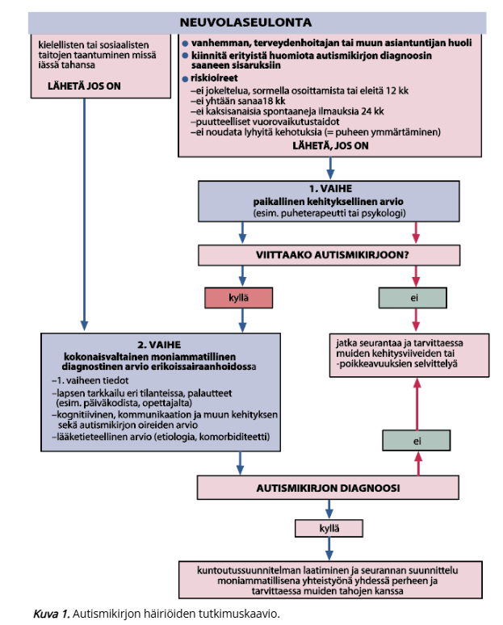
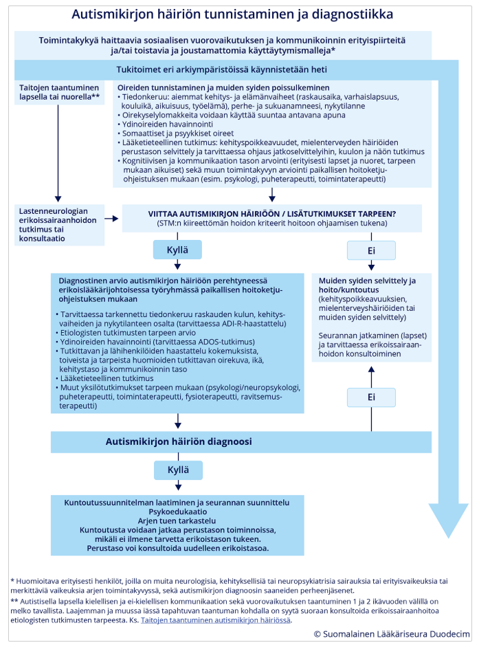
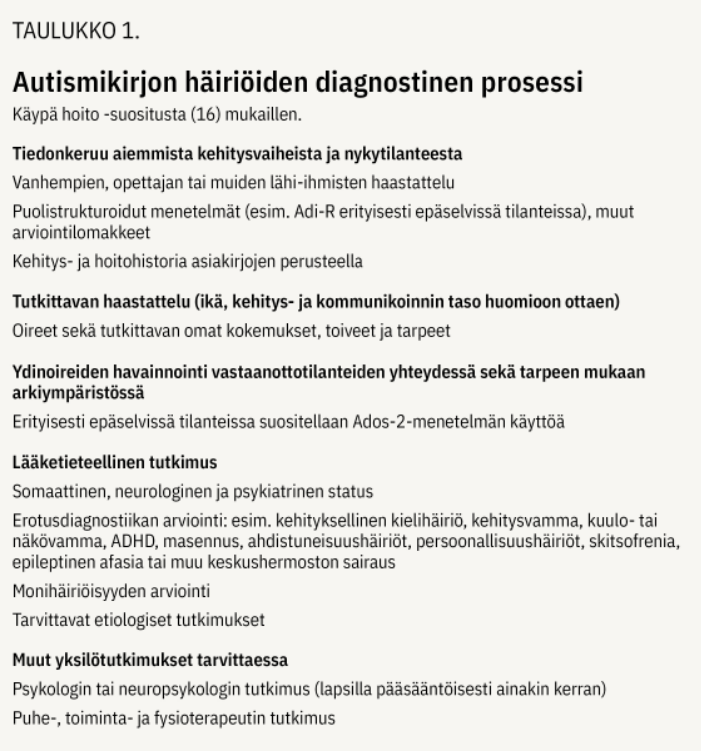
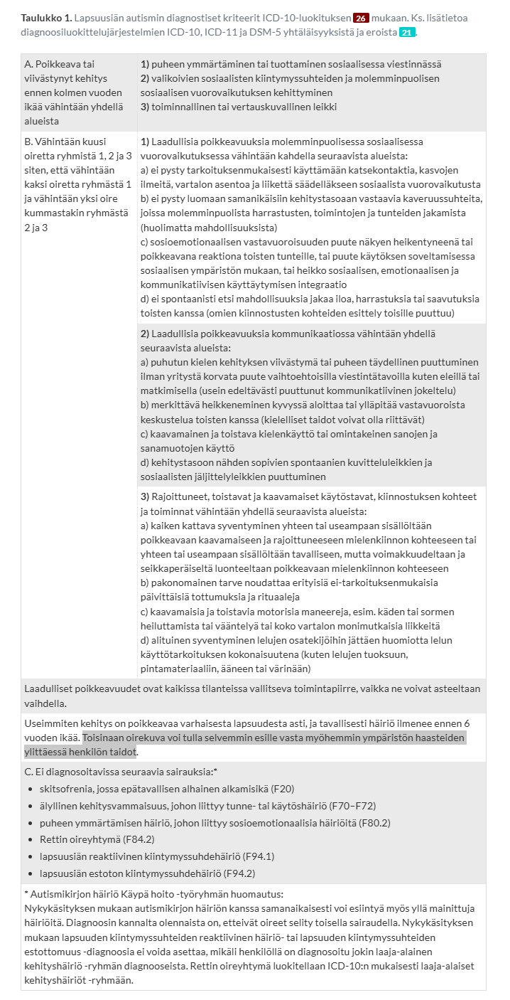
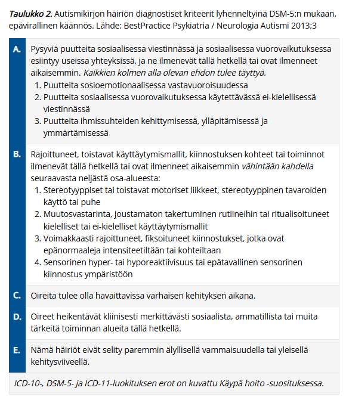
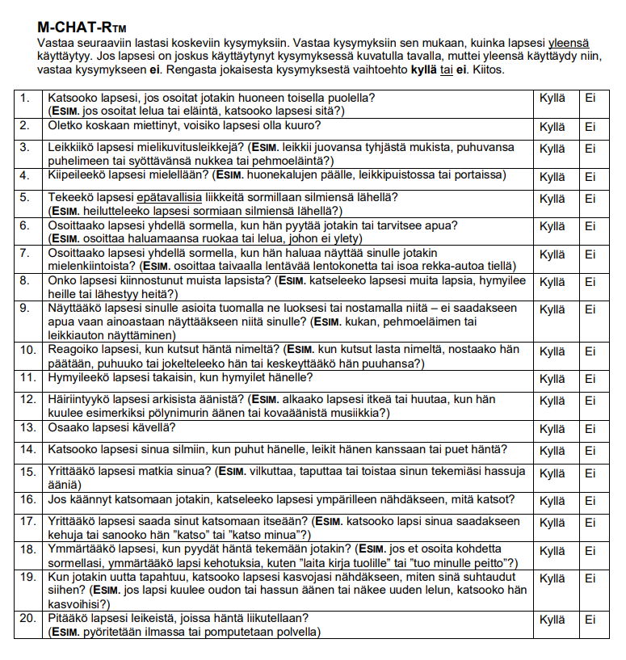
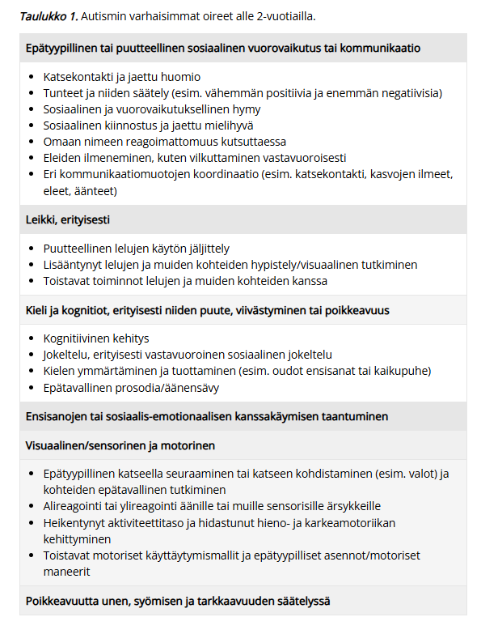
  

### Kouristava lapsi - anamnestiset lisätiedot, erotusdiagnostiset vaihtoehdot, mitä teen lääkärinä terkassa {#Kouristava-lapsi-tkssa}

Esim. miten hoidat jos kouristus jatkuu tk, mitä teet jos ohittunut matkalla, erotusdiagnostiset vaihtoehdot ja miksi

  <button class="solution-button"
          data-label="Vastaus"
          data-hide-label="Piilota vastaus">
    Vastaus
  </button>
  

Kun lapsi tuodaan terveyskeskukseen kouristavana tai juuri kouristaneena, tehdään aluksi tietysti ABCDE-arvio

A ja B: Asetetaan lapsi vakaalle alustalle kylkiasentoon ainakin kouristelun vähentyessä, jotta hengitystiet pysyvät auki ja vältetään aspiraatio. Ei yritetä väkisin estää lapsen kouristusliikkeitä, vaan pää voidaan suojata tyynyllä. Mikäli saturaatio on alle 94 %, annetaan lisähappea maskilla. 

C: Arvioi verenkierto, pulssi ja iho. 

D: Arvioi tajunnantaso ja kouristuksen luonne. Mittaa pikaverensokeri; tarvittaessa korjataan. 

E: Tutki trauman merkit, ihottumat, lämpö... 

---

Anamneesissa kouristuksen tarkka kesto, kouristuksen luonne, edeltävät oireet ja laukaisijat (voimakas itku/säikähtäminen (-> affektikohtaus), pitkään seisominen (vasovagaalinen synkopee ja sen yhteydessä pari kouristusta), kuume, flunssa, vatsatauti, päänsärky, oksentelu, niskajäykkyys, päänvamma), lääkehistoria, myrkytysvaaran mahdollisuus, jälkioireet (jos ohi jo), sukuhistoria, raskaus+synnytyshistoria... Tärkeää myös selvittää, onko ollut aikaisempia kohtauksia.

Statuksessa iän mukainen neurologinen status ja yleisstatus. Vitaalit. 

Erotusdiagnostisia vaihtoehtoja ovat siis mm. kuumekouristus, epileptinen kohtaus, keskushermostoinfektio, metabolinen häiriö tai affektiokohtaus/synkopee. 

---

TK:ssa toiminta riippuu täysin siitä, onko lapsi vastaanotolle tullessa vielä kouristamassa vai onko kouristus jo ohittunut. Jos kouristaa vieläkin (>5min), niin ABCDE-arvion ja turvaamisen jälkeen annetaan välitön lääkehoito eli bukkaalinen midatsolaami tai rektaalinen diatsepaami ja sitten kun suoniyhteys on auki, niin tarvittaessa jatkoannostelu voidaan antaa iv (loratsepaami), jos kouristus ei lakkaa. Lähetetään lapsi kuitenkin kiireellisesti ambulanssisiirrolla saatettuna ESH-päivystykseen, vaikka kouristus menisikin ohi. Soitetaan päivystykseen ja kerrotaan tilanteesta. 

Jos kouristus on lakannut jo ennen saapumista, niin samalla tavalla ABCDE-arvion kautta rauhoitetaan tilanne ja kerätään anamneesi. **Jos on ensimmäinen ei-kuumeperäinen kouristuskohtaus tai pitkittynyt tilanne, lapsi lähetetään aina lastenpäivystykseen jatkotutkimuksiin. Jos kyseessä on selvä, tunnettu kuumekouristus hyvävointisella lapsella, joka on jo täysin vironnut, voidaan tilannetta seurata tk:ssa.** Kuumeen aikainen kohtaus voi kyllä olla bakteerimeningiitin, enkefaliitin tai sepsiksen oire, joten ensimmäistä kertaa kouristanut lapsi on syytä pyytää päivystyksellisesti lääkärin tutkittavaksi, vaikka kohtaus olisi ollut lyhyt ja lapsi olisi siitä toipunut. Poissuljetaan keskushermostoinfektio (ei tarvitse rutiinisti likvoria siis), tarkistetaan verensokeri, varmistetaan statuksen normaalistuminen. Herkästi EKG. Laboratoriotutkimuksia (C-reaktiivinen proteiini, perusverenkuva, natrium, kalium, kalsium, verikaasuanalyysi jne.) määritetään kliinisen arvion perusteella tarvittaessa. Kuumeen taustalla olevaa infektiota tutkitaan tavallisen käytännön mukaisesti. **Jos lapsi on muutaman tunnin seurannassa kohtauksen jälkeen hyväkuntoinen eikä lääkärin tutkimuksessa tule esiin mitään poikkeavaa, häntä ei tarvitse lähettää sairaalaseurantaan, ja vanhemmille kerrotaan kuumekouristusten hyvänlaatuisuudesta sekä annetaan tarkat ohjeet lapsen voinnin seurannasta; tarvittaessa bukkaalinen midatsolaami tai diatsepaamirektiolit kotiin.** Kuumekouristuksen saanut lapsi kuuluu lähettää päivystyksellisesti lastenlääkärin arvioitavaksi erikoissairaanhoitoon ainakin, jos kuumekouristus on kestänyt yli 5 min tai se on ollut monimuotoinen, tajunnantaso jää kohtauksen jälkeen alentuneeksi, jos epäillään keskushermostoinfektiota tai sepsistä tai jos yleistila sitä muuten vaatii. Usein myös merkittävän nuoret tai vanhat lapset lähetetään (alle 6kk tai yli 6v). 

Ensiapulääkettä ei määrätä rutiininomaisesti kotiin kaikille kuumekouristuspotilaille. Ensiapulääke on kuitenkin hyvä olla varalla erityisesti potilailla, joiden kuumekouristus on ollut pitkittynyt tai joilla pitkähköön kuumekouristukseen liittyy esim. välimatkasta johtuva viive pääsyssä ensiapua antavaan yksikköön. Ellei kotona annettu ensiapulääkkeen kerta-annos auta tai lapsi ei toivu kuumekouristuksesta nopeasti, hänet on vietävä ambulanssilla päivystyksellisesti sairaalahoitoon. Muuten uusien myöhempien kuumejaksojen aikana perhe voi hoitaa tällaisen yksittäisen kouristuksen itse kotona.

  

### Päänsärkypotilas {#Paansarky-yleisesti}

Paljon samoja kysymyksiä eri vuosina. Pääasiassa siis usein kouluikäinen, jolla poissaoloja vähintään viikottain päänsäryn takia. Mitä erilaisia primaarisia päänsärkytyyppejä lapsilla on? Sekundaaristen päänsärkyjen varoitusmerkit? Päänsärkypotilaan anamneesi, status, tutkimukset? Mitkä ovat pään MRI:n harkinnan indikaatiot lapsilla?

  <button class="solution-button"
          data-label="Vastaus"
          data-hide-label="Piilota vastaus">
    Vastaus
  </button>
  

  
Päänsäryssä on aina tärkeää selvittää, onko potilaalla jotain vaaralliseen sekundaariseen päänsärkyyn viittaavaa (SN2NOOP4 tai SNNOOP10). Jos on syytä muistisääntöjen perusteella epäillä jotain vaarallista syytä, niin harkitse päivystykseen tai esh-pkl:lle lähettämistä tilanteen mukaan -> tarvittaessa herkästi konsultoi päivystäjää. Jos on epäily subaraknoidaalivuodosta, on ollut tajunnanmenetys/aleneminen, uusi neurologinen statuslöydös, epäily keskushermoston infektiosta, ponnistelun/yskimisen yhteydessä alkava päänsärky tai löytyy staasipapilla, niin aina päivystykseen; useimmiten otetaan vähintään pään natiivi-TT päivystyksellisesti. Muiden kanssa voi miettiä vähän enemmän. Tärkeä kysymys on aina: Onko särky uusi ja äkillinen vai toistuva ja tuttu? 

<li>Systemic = Yleisoireet (mahdollisesti esim. keskushermostoinfektio)</li>
<li>Neurologic = Neurologiset oireet/löydökset (mukaanlukien tajuttomuuskohtaus, tajunnantason lasku, niskajäykkyys yms)</li>
<li>Neoplasm = Maligniteetti muualla elimistössä (mahdollinen metastaasi)</li>
<li>Old = Vanha ikä (>50v) ja uusi oire (esim. mahdollinen temporaaliarteriitti); myös jos merkittävän nuori eli herkästi konsultaatio, jos päänsärky alkaa alle 5-vuotiaalla</li>
<li>Onset = Äkillisyys ("thunderclap"; viittaa vahvasti verenvuotoon ja varsinkin subaraknoidaalivuotoon)</li>
<li>Pattern = Kivun tyylin vaihtuminen</li>
<li>Positional = Positionaalinen provokaatio (esim. postpunktionaalinen päänsärky pahempi seistessä tai istuessa)</li>
<li>Precipitated = Pahenee ponnistellessa tai yskiessä (viittaa kohonneeseen kallonsisäiseen paineeseen)</li>
<li>Papilledema = Papillödeema (viittaa kohonneeseen kallonsisäiseen paineeseen)</li>
<li>Progressive = Progressiivinen ja hoitoresistentti/atyyppinen (esim. endokrinologisia oireita) päänsärky</li>
<li>Puking (/Pregnancy) = Pahoinvointi (erityisesti aamulla), oksentelu</li>
<li>Painful eye = Kivulias silmä ja autonomisia oireita (viittaa Hortonin neuralgiaan eli sarjoittaiseen päänsärkyyn, joka on primaarinen päänsärky, mutta voi myös johtua rakenteellisista syistä ja usein kannattaa lähettää neurologin hoitoon)</li>
<li>Posttraumatic = Posttraumaattinen päänsärky</li>
<li>Pathology of the immune system = Immuunipuutos (kohonnut riski vaarallisille sekundaari- ja opportunisti-infektioille)</li>
<li>Painkillers = Kipulääkkeiden pitkäaikainen käyttö (särkylääkepäänsärky) tai uusi lääke otettu käyttöön päänsäryn ilmenemisen yhteydessä</li>

---

**Lisäksi tulee miettiä myös hieman ei-niin-vaarallisia sekundaarisia syitä kuin allergiaoireet, nälkä ja jano, piilokarsastus ja taittoviat, purentaviat ja uniapnea.**

Krooninen tai toistuva päiväaikainen pahenematon päänsärky muuten hyvin voivan lapsen ainoana oireena ei viittaa aivokasvaimeen. Tällaisen potilaan etiologiset tutkimukset voidaan tehdä ensisijaisesti perusterveydenhuollossa. Akuutin päänsäryn selvittelyssä on suljettava pois yleiset infektiosairaudet (esim. sinuiitti) ja harvinaisemmat mutta vakavat infektiot (esim. meningiitti ja meningoenkefaliitti).

Jos ei ole mitään epäilyä sekundaarisesta syystä tai ne on poissuljettu, niin primaarisia hyvänlaatuisia päänsärkyjä ovat mm. jännityspäänsärky ja migreeni. Lapsilla sarjoittainen päänsärky ja muut (esim. trigeminusneuralgia) ovat harvinaisia. Erotusdiagnostiikka perustuu pitkälti anamneesiin ja kuvaukseen särystä ja muista oireista. Jatkotutkimukset ohjautuvat potilaskohtaisesti anamneesin 
mukaan (pään MRI, likvor, silmälääkäri, hammaslääkäri yms.)

Anamneesissa ja statuksessa mm: 

<li>Kohtausten kestosta ja sijainnista sekä tiheydestä. Päänsäryn luonne ja esiintymistiheys ilmenevät yleensä esitäytetystä **päänsärkypäiväkirjasta,** joka vanhemmille kannattaa lähettää etukäteen ajanvarauksen yhteydessä.</li>
<li>Liitännäisoireista (vilkkuvat tai kirkkaat valot, hajut, paasto, valvominen)</li>
<li>Sukuhistoria</li>
<li>Käytetyt lääkkeet ja niiden vasteet päänsärkyyn</li>
<li>Muut sairaudet ja lääkitykset</li>
<li>Yhdessä lapsen ja vanhemman kanssa keskustellen selvitetään lapsen elinolosuhteet, elintavat, koulunkäynti, kaverisuhteet ja harrastukset. Unesta tarkasti myös (uniapneaan viittaavaa, nukkuuko riittävästi, säännöllisyys?)</li>
<li>Myös huolellinen lastenneurologinen anamneesi on tärkeä: kehitykselliset ongelmat? oppiminen?</li>
<li>Statuksessa normaali pediatrinen yleistutkimus (muista verenpaine!) ja neurologinen status (muista näön tutkiminen: näöntarkkuus, näkökentä, silmänpohjat!). </li>

---

**Lastenneurologin konsultaation aiheet (pään MRI-tutkimusta harkitaan), jos:**

<li>päänsärkyä ja oksentelua esiintyy öisin tai heti ylös noustessa (usein päivystykseen)</li>
<li>päänsäryn yhteydessä esiintyy tajunnan häiriöitä (usein päivystykseen)</li>
<li>äkillinen fyysinen ponnistus tai yskiminen laukaisee voimakkaan päänsäryn</li>
<li>kyseessä on säännönmukaisesti aina samalla puolella toispuolinen sykkivä päänsärky</li>
<li>kyseessä on paheneva tai hoitoresistentti päänsärky</li>
<li>lapsen luonne tai käytös muuttuu</li>
<li>lapsen kasvu on poikkeavaa</li>
<li>pään kasvu kiihtyy (varhaislapsuudessa)</li>
<li>havaitaan poikkeavia neurologisia löydöksiä tai poikkeavaa kehitystä</li>
<li>pään kasvu kiihtyy (varhaislapsuudessa)</li>
<li>aivoverenkiertohäiriö täytyy sulkea pois erityisesti, kun esiintyy ensimmäistä kertaa motorinen(hemipleginen) tai aivorunkoperäinen auraoire tai aura pitkittyy huomattavasti tai on muuten epätyypillinen (tällöin mahdollisesti TT-tutkimuskin)</li>
<li>lapsi on alle 5-vuotias</li>

---

Jännityspäänsärky on yleisin päänsäryn syy. Se sisältää sekä lihasjännityksestä johtuvat että henkisestä jännittyneisyydestä johtuvat päänsäryt; voi siis esiintyä ilman merkittävää lihaskireyttä. 

<li>Jännityspäänsäryn kipukohtausten kesto vaihtelee minuuteista vuosiin.</li>
<li>Siihen ei liity auraoireita.</li>
<li>Särky tuntuu useana päivänä yleensä ohimoilla ja niskassa takaraivolla, alkuun enemmän toisella puolella mutta säryn pahentuessa koko päässä. Klassinen kuvaus on pantamainen purista/kiristävä jatkuva (ei sykkivä) särky. </li>
<li>Kaulan lihasten jännittymiseen voi liittyä niskalihasten kipua ja käsien yöllistä puutumista</li>
<li>Voi esiintyä huimausta ja tasapainon menettämisen tunnetta (niskaperäinen huimaus)</li>
<li>Valonarkuutta/ääniherkkyyttä voi esiintyä, samoin pahoinvointia, mutta vain yksi tällainen liitännäisoire voi esiintyä kerrallaan, jotta voidaan päänsäryn sanoa olevan puhtaasti jännityspäänsärkyä.</li>
<li>Liikkuminen lievittää oireita. Usein särky vähenee loma- ja viikonloppuaikoina. Kipulääkkeillä usein vaatimaton teho</li>
<li>Usein pahimmillaan ilta-aikaan, kun päivällä kertynyt stressi ja lihasjännitys pahentaa oireita. Joskus oireet kuitenkin voivat olla pahempia aamulla johtuen esim. huonosta nukkumisasennosta, uniapneasta tai bruksismista (hampaiden narskuttamisesta)</li>
<li>Statuksessa voidaan usein todeta aristuksia ohimoilla tai takaraivolla sekä niskassa ja hartioissa.</li>

---

Migreeni 

<li>Toiseksi yleisin primaarinen päänsärky (jännityspäänsärkyä voi tosin esiintyä migreenin ohella).</li>
<li>Jaetaan auralliseen (n. 15%) ja aurattomaan (n. 85%) päämuotoon</li>
<li>Aurallisessa migreenissä tyypilliset auraoireet ovat näköoireita (yleisin aura), tuntohäiriöitä tai puheen tuoton ongelmia ja niille on ominaista täydellinen palautuvuus. Harvinaisia auraoireita ovat retinaaliset oireet, motoriset oireet hemiplegisessä migreenissä ja aivorunko-oireet aivorunkomigreenissä. Yksittäiset auraoireet kestävät 5-60 minuuttia. Toisinaan auraoiretta ei seuraa päänsärky, ja joskus auraoireet pitkittyvät. Harvinaiset oireet edellyttävät tilannearviota ja diagnosointia erikoissairaanhoidossa.</li>
<li>Migreenin päänsärkykohtaukset kestävät tyypillisesti 2-72 (aikuisilla 4-72 kriteereissä) tuntia ilman hoitoa tai jos hoito ei tehoa. Samalla potilaalla voi esiintyä kestoltaan ja voimakkuudeltaan vaihtelevia kohtauksia, sekä aurallisena että aurattomana.</li>
<li>Päänsärky on tyypillisesti voimakasta, toispuoleista ja sykkivää (erottelee jännityspäänsärystä, joka ilmenee pantamaisena, puristavana särkynä koko pään alueella). Nuorilla migreeni voi painottua takaraivolle, jolloin sen voi helposti sekoittaa jännityspäänsärkyyn</li>
<li>Rasitus pahentaa migreenin päänsärkyä (vrt. jännityspäänsärky, jossa lievittää)</li>
<li>Tyypillisesti ilmenee liitännäisoireita, kuten pahoinvointia/oksentelua, valoarkuutta (fotofobia) ja/tai ääniarkuutta (fonofobia)</li>

---

Sarjoittainen päänsärky (Hortonin neuralgia, cluster headaches)

<li>Yleisempää miehillä (vrt. muut primaariset päänsäryt enemmän naisilla. Sukupuolten välinen suhde on noin 5/1). Alkaa tyypillisesti 20-50 v iässä. Kyseessä on harvinainen sairaus, jota esiintyy noin 0,1–0,9 % väestöstä.</li>
<li>Kohtaukset kestävät 15–180 minuuttia ja voivat toistua useita kertoja päivässä, tiettyyn vuodenaikaan liittyen, usein loppuvuonna ja keväällä (usein erityisesti vuodenajan vaihteissa liittyen valonmäärän muutoksiin).</li>
<li>Oireena on erittäin voimakas (lempinimeltään suicide headaches, koska itsemurha-ajatukset vaikeista kivuista johtuen ovat yleisiä), toispuoleinen päänsärky (yleensä silmän takana polttavana) ja erotuksena migreenistä siihen liittyy lähes aina levottomuus eli kävely helpottaa, eikä pahenna särkyä. Lisäksi oire on 95 % aina samalla puolella.</li>
<li>Autonomiset oireet, kuten silmän verestys, kyynelvuoto, nenän tukkoisuus ovat yleisiä</li>
<li>Oirekuvaan voi liittyä Hornerin oireyhtymä eli ptoosi+mioosi(+anhidroosi) affisioidulla puolella.</li>

---

Trigeminusneuralgia (kolmoishermosärky)

<li>Valtaosalla (n. 75%) potilaista trigeminusneuralgian oireisto selittyy kolmoishermon juuren verisuonikompressiolla aivorungossa; tätä kutsutaan klassiseksi kolmoishermosäryksi (sekundaarisen (n. 15%) tyypin taustalla taas olisi esim. MS-tauti tai aivorunkokasvain; idiopaattisia on n. 10% tapauksista)</li>
<li>Sairaus alkaa yleensä 50–60 vuoden iässä</li>
<li>Tyypillistä äkilliset toistuvat lyhytaikaiset sähkömäiset kivut toisella puolella kasvoja, erityisesti leuan, posken tai hampaiden alueella; kevyt ärsyke (kosketus, ilmavirta) oirealueelle voi liipaista kivun esiin. Kipu on yleensä erittäin voimakas estäen pahimmillaan mm. syömisen</li>
<li>Kipujakso kestää yhdestä sekunnista n. 2 min:iin ja se voi toistua lukuisia kertoja päivän mittaan. Oireilu voi kestää viikkoja tai kuukausia. Pitkäkestoista kasvokipua esiintyy lyhytkestoisten kipusävähdysten lisäksi n. 25–50 %:lla potilaista. Se tuntuu samalla alueella kuin lyhyet kipusävähdykset. Kivun luonne on esim. polttavaa tai sykkivää.</li>

  

### Lapsi, joka muuten kehittynyt hienosti, mutta motoriikka kehittynyt hitaasti, puheessa vaikeutta - anamnestiset lisätiedot, erotusdiagnostiset vaihtoehdot, jatkotutkimukset {#Lapsen-motoriikka-ja-puhe-hitaasti-kehittyneet}

  <button class="solution-button"
          data-label="Vastaus"
          data-hide-label="Piilota vastaus">
    Vastaus
  </button>
  

Statuksessa tarkka yleispediatrinen ja neurologinen status (näkö ja kuulo tutkitaan myös). Anamnestisesti kuten aina niin kerätään:

<li>Tarkka kehitysanamneesi (niin motorisesti, kielellisesti kuin sosiaalisesti): opitut merkkipaalut, onko tapahtunut taitojen taantumista</li>
<li>Yleisvointi, jaksaminen arjessa</li>
<li>Perinataalihistoria ja suku-anamneesi</li>
<li>Perheen psykoekonomissosiaalinen tilanne</li>
<li>Somaattiset ja psyykkiset sairaudet sekä mahdolliset vammat</li>

---

Erotusdiagnostisesti vaihtoehtoja ovat mm. kehityksellinen koordinaatiohäiriö (DCD) ja kehityksellinen kielihäiriö (DLD) -> monimuotoinen kehityshäiriö, kehitysvamma, pelkkä motorinen häiriö (motoriikassa häiriö ja puhemotoriikassa häiriö), lievä CP-vamma, neuromuskulaariset sairaudet (voi näkyä motorisena oppimisen hitautena ja taantumisena), kuulovamma tai uusiutuvat välikorvaongelmat (haittaa kielen kehitystä), geneettiset tai metaboliset häiriöt. 

Jatkotutkimukset PTH:ssa ovat tarkempi kuulontutkimus ja näöntutkimus (jos epäily sen ongelmasta), puheterapeutin arvio ja fysioterapeutin arvio sekä usein psykologin arvio. Lähete esh:n tutkimuksiin, mikäli kauttaaltaan/kokonaisuutena erittäin heikot kognitiiviset taidot = kehitysvammaepäily. Samoin jos on epäily lihastaudista, ääreishermoston sairaudesta, CP-vammasta (neurologisessa statuksessa poikkeavaa esim. spastisuutta, hypotoniaa, ataksiaa, puolieroja, heijastepoikkeavuuksia, pysyviä primitiiviheijasteita...; lapsi ei ole pelkästään siis kömpelö), oireyhtymästä tai kertymäsairaudesta. 

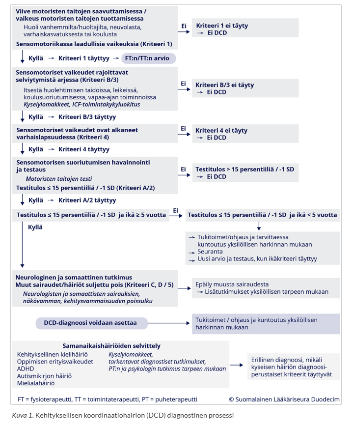
  

### 3 v 6 kk lapsi jolla puheen tuottaminen viivästynyt, tuottaa 3 lyhyttä sanaa, vaikuttaa kuitenkin ymmärtävän puhetta, ei muuta poikkeavaa, päivähoidossa kavereita ym.. Minkä diagnoosin kerrot vanhemmalle, keneltä saat lisätietoa, jatkosuunnitelmat, hoito ja seuranta? {#3v6kk-ymmartaa}

  <button class="solution-button"
          data-label="Vastaus"
          data-hide-label="Piilota vastaus">
    Vastaus
  </button>
  

3,5-vuotiaan iässä odotetaan jo satojen sanojen sanavarastoa ja monisanaisia lauseita, joten vain yhteensä kolmen sanan tuottaminen on huomattava viive. Vanhemmille on tärkeää korostaa, että lapsen normaali puheen ymmärtäminen, sosiaalisuus ja hyvät kaveritaidot ovat erinomaisia vahvuuksia, mutta kielellinen kehitys on nyt viivästynyttä. Ei vielä ole tarvetta sanoa yhtä varmaa diagnoosia, mutta kyseessä voi olla ns. kehityksellinen kielihäiriö, ilmaisullisen kielen vaikeus / puheen tuottamisen häiriö (ICD-10: F80.1 Ilmaisullisen kielen häiriö), ei todennäköisesti haluttomuus viestiä eikä älyllinen puute.

Anamnestista lisätietoa saa vanhemmilta, varhaiskasvatuksen palautteesta ja neuvolateksteistä. Selvitetään tarkemmin aikaisempi kehityshistoria, onko taantumaa, perhetilanne, perinataaliajat, sukuhistoria, muut oireet...

Tutkimuksina kliininen status vastaanotolla, jatkoon kuulon tarkastus ja PTH:ssa puheterapeutin arvio. Mikäli kognitiivisesta kehityksestä herää huoli, niin myös psykologin tutkimus. 

---

**Lapsen kuntoutus ja muut tukitoimet tulee aloittaa heti, kun lapsen viivästynyt kielen kehitys havaitaan. Puheterapeutti ohjaa vanhempia ja lapsen päivähoidon henkilökuntaa kielen kehityksen tukemisessa ja aloittaa tarvittaessa myös yksilökuntoutuksen. **

On tärkeää, että lapsen kielen kehitystä lähdetään tukemaan heti ongelmien ilmaannuttua, eikä jäädä odottelemaan mahdollista kehityksellisen kielihäiriön diagnoosia. Mikäli lapsen kielelliset vaikeudet ovat huomattavia, puhetta tukevat ja korvaavat kommunikointikeinot, kuten kuvat ja viittomat (AAC-keinot), otetaan käyttöön mahdollisimman varhain. Näin lapselle tulee mahdollisuus itseilmaisuun ja kommunikaatioon ja myös puheen ymmärtäminen saa tukea. Toimiva kommunikointi lapsen ja hänen lähipiiriinsä kuuluvien ihmisten välillä on tärkeää.

Kehityksellisen kielihäiriön ensisijainen hoito on usein on puheterapia (määrä vaihtelee tilanteen mukaan esim. 20 (HVA:n tuottamana) - 45 (yleensä Kelan tuottamana) x45min/vuosi), mutta sen lisäksi tai sijasta voidaan tarpeen mukaan suositella myös muita terapioita, kuten neuropsykologista kuntoutusta. Lapsen puheterapian sisältö ja määrä suunnitellaan aina yksilöllisesti. Puheterapia tukee erityisesti niiden kielellisten osa-alueiden kehitystä, joissa on ongelmia. 

Kun lapsella on diagnosoitu kehityksellinen kielihäiriö, lääkärin johtama moniammatillinen työryhmä suunnittelee terapian keskeiset tavoitteet, tiiviyden ja arvioi vaikuttavuuden. Tässä tapauksessa kyseessä on sen verran vaikea tilanne, että hoito kuuluu pääasiassa ESH. _Puheterapeutin arvion jälkeen siis todennäköisesti tehdään lähete ESH ja aloitetaan samalla jo tukitoimia._

  

## 2022 

### Lapsen neurologinen status, mitä tutkit ja miksi?

  <button class="solution-button"
          data-label="Vastaus"
          data-hide-label="Piilota vastaus">
    Vastaus
  </button>
  

Lapsen neurologinen tutkimus sisältää esitietojen kysymisen sekä neurologisen ja somaattisen tutkimuksen. Vaikka lapsen neurologisessa tutkimuksessa arvioidaan samoja asioita kuin aikuisen vastaavassa tutkimuksessa, lapsen tutkimusmenetelmät ja niiden tulkinta täytyy mukauttaa lapsen kehitysvaihetta vastaaviksi. Tutkijan täytyy arvioida, missä iässä normaalisti kehittyvä lapsi pystyy suorittamaan erilaisia neurologisen tutkimuksen osioita. Kouluikäisten lasten neurologinen tutkimus voidaan keskeisiltä osin tehdä samoin kuin aikuispotilaiden tutkimus.

Poikkeavien löydösten merkitys tuleekin aina suhteuttaa lapsen ikäodotuksen mukaiseen toimintaan, lapsen yhteistyökykyyn tutkimustilanteessa ja neurologisen tutkimustarpeen aiheuttaneeseen kliiniseen ongelmaan. Mitä pienemmästä lapsesta on kyse, sitä suurempi merkitys on lapsen spontaanin toiminnan (esim. liikkuminen tutkimushuoneessa, lelujen käsittely ja leikki, piirtäminen, vuorovaikutus vanhempaan) tarkkailulla. Keskimäärin 4 vuoden iästä ylöspäin pystytään vakiintuneiden neurologisten testien avulla tutkimaan neurologista tilaa toistettavasti ja luotettavasti

Myös muu somaattinen tutkimus on keskeinen osa lapsen neurologista tutkimusta. Myöhemmillä käynneillä arvioidaan somaattisen tutkimuksen tarve potilaskohtaisesti. Somaattiset sairaudet voivat vaikuttaa esimerkiksi lapsen päänsärkyoireisiin, keskittymiskykyyn ja kommunikaatiotaitoihin (esim. liimakorva). Poikkeavat ulkonäköpiirteet, poikkeava ihon pigmentaatio ja rakenteelliset epämuodostumat (esim. rakenteellinen sydänvika) voivat toimia "diagnostisina kahvoina", joiden avulla voi herätä epäily spesifisestä sairausryhmästä tai jopa yksittäisestä sairaudesta neurologisten oireiden ja löydösten aiheuttajana.

---

Neurologinen tutkimus aloitetaan lapsen tajunnan tason ja vireystilan arvioinnilla. Akuuteissa tilanteissa lapsen tajunnan tasoa ja sen mahdollisia muutoksia arvioidaan Glasgow'n asteikolla (Pediatric Glasgow coma scale). Ei-akuuteissa tilanteissa lapsi pyritään tutkimaan silloin kun hän on mahdollisimman hyvässä vireystilassa, ja tutkimus mahdollisuuksien mukaan ajoitetaan siten, etteivät lapsen tavanomaiset ruokailu- ja päiväuniajat häiriinny.

Motoriikka, lihasjäntevyys ja lihasvoima: 

<li>Passiivinen liikuteltavuus, raajojen spontaanit liikeet, kätisyyden puolierot; ohjeita ymmärtävillä vastustusvoima, kävely, erilaiset temput (yhdellä jalalla seisominen, tasajalkahyppy, yhdellä jalalla hyppy...)</li>
  <ul>
    <li>Etsitään hypotoniaa, spastisuutta (esim. CP-vamma), kömpelyyttä (esim. DCD); arvioidaan mitä osaa tehdä suhteessa ikäänsä (saavuttaako kehityksen virstanpylväitä)</li>
  </ul>
<li>Passiivinen liikuteltavuus, raajojen spontaanit liikeet, kätisyyden puolierot; ohjeita ymmärtävillä vastustusvoima, kävely</li>

---

Primitiiviheijasteet, jänneheijasteet 

<li>Vilkkaat jänneheijasteet -> ylämotoneuronivaurio; puuttuvat tai vaimenneet -> alamotoneuronivaurio tai perifeerinen hermovaurio</li>
<li>Primitiiviheijasteiden säilyminen >4-6kk -> keskushermoston kypsymishäiriö tai esim. CP-vamma</li>

---

Tuntojärjestelmä (kosketus, kipu)... 

Aivohermot lapsen ko-operaatiokyvystä riippuen samoin kuin aikuisilla tai sitten enemmän observoimalla. 

Pikkuaivotoiminta ja koordinaatio vanhemmilla lapsilla esim. SNK, KPK, DDK, Romberg; imeväisillä istumatasapaino, tavoitteluliikkeiden sujuvuus yms. 

  

### Poissaolokohtauksia 7v pojalla, mitä lisätietoja kaipaat ja miksi? Erotusdiagnostisia vaihtoehtoja ja toimenpiteitä kunkin kohdalla? {#7v-poissaolokohtauksia}

  <button class="solution-button"
          data-label="Vastaus"
          data-hide-label="Piilota vastaus">
    Vastaus
  </button>
  

Poissaolokohtausten arviossa on keskeisintä erottaa aito **epileptinen poissaolokohtaus, muu epileptinen kohtaus (paikallisalkuinen) sekä ahdistus, vaaraton päiväunelmointi, tarkkaamattomuus (mahdollisesti ADHD) ja unnutus.**

Anamneesissa

<li>Kohtauskuvaus: Kauan kestää, kuinka usein, alku ja palautuminen, onko keskeytettävissä ulkoisella ärsykkeellä, liitännäisoireet (automatismeja, kuten silmien räpyttelyä, maiskutusta, silmien kiertymistä ylöspäin...), laukaisevia tekijöitä, koulumenestys, muut sairaudet</li>
<li>Koulumenestys</li>
<li>Sukuanamneesi</li>
<li>Muut sairaudet, lääkitys</li>
<li>Kehityshistoria</li>

---

Lapsuusiän poissaoloepilepsiassa esiintyy lyhyitä muutamasta sekunnista 20 sekuntiin kestäviä pysähtymisiä, joiden aikana lapsi keskeyttää toimintansa yhtäkkisesti. Usein ilmenee yllä mainittuja automatismeja samalla. Kohtauksia esiintyy yleensä kymmeniä päivittäin, mutta lyhyytensä vuoksi ne saattavat jäädä aluksi huomaamatta. Kyseessä on yleistynyt epilepsia. Kohtaukset erottuvat esiintymistiheydellään ja lyhyydellään paikallisalkuisista tajunnanhämärtymiskohtauksista, jotka puolestaan esiintyvät harvemmin ja kestävät yleensä yli 30 sekuntia. Paikallisalkuisiin kohtauksiin liittyy useimmiten myös jälkiväsymys, kun taas yleistyneessä poissaoloepilepsiassa lapsi jatkaa toimintaansa heti kohtauksen mentyä ohi. Tyypillistä lapsuudessa (alkaa yleisimmin 5-7 –vuotiaana tai teini-iässä); poissaoloepilepsioiden esiintyvyys on noin 1/1 000 alle 16-vuotiasta, ja periytyvyydellä on merkittävä osuus tämän epilepsian esiintymisessä. 

<li>Epilepsiaepäily (oli sitten poissaolo- tai fokaalinen), vaatii lähetteen ESH. Siellä EEG (esim. poissaolokohtauksessa varsinkin hyperventilaatioprovokaatiossa) ja usein MRI. Ohjeistetaan kotiin, että voi ottaa videon kohtauksesta, jos sellainen tulee ennen vastaanottoa. Turvallisuusohjeiksi nyt kannattaa välttää korkealla kiipeilyä, uimista ilman valvontaa... </li>
<li>Poissaolokohtaukset aiheuttavat vaaratilanteita esimerkiksi liikenteessä ja katkaisevat lapsen keskittymistä. Tämän vuoksi lääkehoito on tärkeää. Vaikka kohtauksia on alussa usein tiheästi, yli 90 prosentilla potilaista lääkehoito tehoaa kohtauksiin hyvin. Poissaolokohtausepilepsian hoitoon käytetään yleisesti etosuksimidia. Jos sairaus reagoi hyvin etosuksimidiin, ennuste on hyvä. Toinen usein käytetty lääkehoitovaihtoehto on valproaatti. Yli puolella lapsista kohtaukset jäävät kokonaan pois ja lääkitys puretaan ennen aikuisikää. Osalla epilepsia vaatii pitkäkestoista lääkitystä, mutta heilläkin lääkehoito tehoaa yleensä hyvin.</li>

---

Tärkeä erotusdiagnostinen vaihtoehto on **ADHD,** joka voi ilmentyä hyvin samalla tavalla. Lapsi "vajoaa omiin ajatuksiinsa" passiivisissa tilanteissa. Katse pysähtyy. Tuijottelukohtauksia (staring spells) esiintyy lapsilla ilman ADHD:takin etenkin väsyneenä tai tylsissä tilanteissa. Erotuksena poissaolokohtaukseen lapsi kuitenkin reagoi ja virkoaa heti, kun häntä kosketetaan tai hänelle puhutaan napakasti eikä jälkiväsymystä tai tokkuraisuutta esiinny. Tyypillisissä tilanteissa jatkotutkimukset eivät ole tarpeen.

Automatismityyppiset liikehdinnät eivät myöskään poissulje hyvänlaatuista poissaolevuutta. **Unnutus** eli lapsen itsetyydytys on tästä hyvä esimerkki. Itsestimulaatio-oireessa lapsi voi kosketella sukupuolielimiään tai hieroa jalkojaan rytmisesti yhteen esim. syöttötuolissa tai turvaistuimessa ollessaan, ja saattaa vaikuttaa poissaolevalta. Liike on tahdonalaista mielihyvän hakemista ja voidaan keskeyttää esim. asennonvaihdoksella. Oire on vaaraton ja usein väistyy ajan myötä. Tärkeää on, ettei lapsen oireeseen suhtauduta paheksuen tai tuomiten. Mikäli lapsen unnutus rajoittaa lapsen normaalia arkea tai häiritsee toisia lapsia, tällöin toiminta on huolestuttavaa ja silloin pitää pysähtyä tutkimaan, onko lapsella jokin hätä. Jatkotutkimukset eivät yleensä ole tarpeen, mutta mahdollinen vaippa-alueen iho-ongelma on hyvä sulkea pois ja hoitaa. Tärkeintä on tiedottaa vanhemmille oireen hyvänlaatuisuudesta ja ohjata heitä kiinnittämään lempeästi lapsen huomio tarvittaessa muuhun aktiviteettiin. Lapsi, jolla on kehitysviivästymä tai pitkäaikaissairaus, saattaa kokea olevansa yksinäinen tai stressaantunut ja nämä tunteet ja kokemukset voivat tällöin näyttäytyä unnuttamisena.

  

### 2v lapsi kouristanut symmetrisesti heräämisen jälkeen. Virtsat tulleet alle. Edeltävästi väsymystä. Kouristuksen jälkeen mitattu kuume 39 astetta. Työdiagnoosi ja erotusdiagnostiset vaihtoehdot, perustele. Mitä tutkit? Milloin lähetät esh? Mitä teet pth:ssa, jos kouristus pitkittyy? {#2v-kouristanut-kuume-mitattu}

  <button class="solution-button"
          data-label="Vastaus"
          data-hide-label="Piilota vastaus">
    Vastaus
  </button>
  

Todennäköisin syy on yksinkertainen kuumekouristus. Lapsen ikä (2 vuotta) sijoittuu tyypilliseen kuumekouristusikään (6 kk – 5 v). Kouristus oli symmetrinen (yleistynyt), siihen liittyi kuume ja virtsankarkailu on tyypillinen ilmiö yleistyneen tonic-clonic -kohtauksen yhteydessä. Edeltävä väsymys sopii alkavaan infektioon ja usein kuume nousee nopeasti. 

Tärkeimpänä erotusdiagnostisena vaihtoehtona pidetään keskushermostoinfektiota (lapsi on poikkeavan väsynyt, unelias, ärtynyt, niskajäykkä tai iholla on petekkioita.). Muita ovat mm. muut epileptiset kohtaukset, metaboliset häiriöt ja myrkytys. 

---

Tutkimus aloitetaan ABCDE-tyyppisesti riippumatta siitä, onko kouristus jo päättynyt. 

A ja B: Asetetaan lapsi vakaalle alustalle kylkiasentoon ainakin kouristelun vähentyessä, jotta hengitystiet pysyvät auki ja vältetään aspiraatio. Ei yritetä väkisin estää lapsen kouristusliikkeitä, vaan pää voidaan suojata tyynyllä. Mikäli saturaatio on alle 94 %, annetaan lisähappea maskilla. 

C: Arvioi verenkierto, pulssi ja iho. 

D: Arvioi tajunnantaso ja kouristuksen luonne. Mittaa pikaverensokeri; tarvittaessa korjataan. Aivokalvoärsytysoireet: niskajäykkyys, Brudzinskin ja Kernigin merkit (pikkulapsella uneliaisuus ja ärtyneisyys voivat olla ainoat merkit).

E: Tutki trauman merkit, ihottumat, lämpö... 

---

Kuumekouristusten ensihoito toteutetaan kuten epileptisen kohtauksen ensihoito. **Jos kohtaus pitkittyy, niin ABCDE-arvion jälkeen annostellaan ensisijainen lääkehoito (midatsolaami bukkaalisesti tai diatsepaami rektaalisesti). Hälytetään 112 ja siirto ESH, avataan iv-yhteys ja soitetaan päivystykseen tilanteesta.**

Suurin osa kuumekouristuksista on lyhyitä, kestoltaan 1–2 min, ja ne loppuvat ilman mitään erityistoimia.

Kuumeen aikainen kohtaus voi kyllä olla bakteerimeningiitin, enkefaliitin tai sepsiksen oire, joten ensimmäistä kertaa kouristanut lapsi on syytä pyytää päivystyksellisesti lääkärin tutkittavaksi, vaikka kohtaus olisi ollut lyhyt ja lapsi olisi siitä toipunut. Poissuljetaan keskushermostoinfektio (ei tarvitse rutiinisti likvoria siis), tarkistetaan verensokeri, varmistetaan statuksen normaalistuminen. Herkästi EKG. Laboratoriotutkimuksia (C-reaktiivinen proteiini, perusverenkuva, natrium, kalium, kalsium, verikaasuanalyysi jne.) määritetään kliinisen arvion perusteella tarvittaessa. Kuumeen taustalla olevaa infektiota tutkitaan tavallisen käytännön mukaisesti. **Jos lapsi on muutaman tunnin seurannassa kohtauksen jälkeen hyväkuntoinen eikä lääkärin tutkimuksessa tule esiin mitään poikkeavaa, häntä ei tarvitse lähettää sairaalaseurantaan, ja vanhemmille kerrotaan kuumekouristusten hyvänlaatuisuudesta sekä annetaan tarkat ohjeet lapsen voinnin seurannasta; tarvittaessa bukkaalinen midatsolaami tai diatsepaamirektiolit kotiin.** Kuumekouristuksen saanut lapsi kuuluu lähettää päivystyksellisesti lastenlääkärin arvioitavaksi erikoissairaanhoitoon ainakin, jos kuumekouristus on kestänyt yli 5 min tai se on ollut monimuotoinen, tajunnantaso jää kohtauksen jälkeen alentuneeksi, jos epäillään keskushermostoinfektiota tai sepsistä tai jos yleistila sitä muuten vaatii. Usein myös merkittävän nuoret tai vanhat lapset lähetetään (alle 6kk tai yli 6v). 

Ensiapulääkettä ei määrätä rutiininomaisesti kotiin kaikille kuumekouristuspotilaille. Ensiapulääke on kuitenkin hyvä olla varalla erityisesti potilailla, joiden kuumekouristus on ollut pitkittynyt tai joilla pitkähköön kuumekouristukseen liittyy esim. välimatkasta johtuva viive pääsyssä ensiapua antavaan yksikköön. Ellei kotona annettu ensiapulääkkeen kerta-annos auta tai lapsi ei toivu kuumekouristuksesta nopeasti, hänet on vietävä ambulanssilla päivystyksellisesti sairaalahoitoon. 

---

EEG- tai kuvantamistutkimuksia ei normaalisti kehittyneillä ja muuten terveillä yksinkertaisia kuumekouristuksia saavilla lapsilla tarvita jatkotutkimuksina siinäkään tapauksessa, että kuumekouristukset uusiutuvat myöhempien kuumeiden aikana. Em. tutkimukset ovat aiheellisia, jos lapselle tulee myös kuumeettomia kouristuksia.

Jatkotutkimuksia ei tarvita, jos 6 kk:n–5 v:n ikäisellä lapsella esiintyy vain kuumeen aikana yksinkertaisia tajuttomuus-kouristuskohtauksia, joista lapsi toipuu normaalisti. Välttämättä nämä eivät ole tarpeen myöskään 6(–7) v:n ikäisellä yksinkertaisen kuumekouristuksen saaneella etenkään, jos lapsella on ollut taipumus toistuviin yksinkertaisiin kuumekouristuksiin pienempänäkin.

**Estolääkkeitä ei tule käyttää,** sillä yhtä aikaa tehokkaita ja turvallisia estolääkkeitä ei ole saatavilla. Tulevat kuumeet hoidetaan kuten muidenkin lasten kuumeet, koska ei ole osoitettu, että tehokaskaan kuumeen hoito ehkäisisi kuumekouristuksia. 

  

## 2018 

### 4v. lapsi, jolla ilm. puheentuoton ja ymmärryksen ongelmaa. Ei pärjää ikäistensä kanssa päiväkodissa, ei ole kiinnostunut satujen kuuntelusta, ajautuu siirtymätilanteissa käsirysyyn ikätoverien kanssa. Mikä työdg, mitä erotusdg vaihtoehtoja? Mitä otat huomioon anamnestisesti? {#4v-kasiryysy}

Samalle lapselle piti laatia kuntoutussuunnitelma, kun oli nähtävillä neuropsykologin arvio 6 kk ensimmäisen vastaanoton jälkeen.

  <button class="solution-button"
          data-label="Vastaus"
          data-hide-label="Piilota vastaus">
    Vastaus
  </button>
  

Työdiagnoosi on kehityksellinen kielihäiriö (F80.1 ja F80.2 eli puheen tuottamisen ja puheen ymmärtämisen häiriö). Lapsella on haasteita sekä puheen tuottamisessa että sen ymmärtämisessä (ei jaksa kuunnella satuja, mikä viittaa sanallisen viestinnän ja tarinan hahmottamisen vaikeuteen). Siirtymätilanteiden käsirysyt ja ikätovereiden seurasta syrjään jääminen selittyvät usein turhautumisella, joka johtuu kielellisestä ymmärtämättömyydestä ja kyvyttömyydestä ilmaista omia tarpeitaan tai tahtojaan. 

Erotusdiagnostisia vaihtoehtoja ovat mm. autismikirjon häiriö, laaja-alainen kehityshäiriö, huonokuuloisuus, psykososiaaliset tekijät, kaksikielisyys.

---

Perusterveydenhuollossa aloitetaan tietysti anamneesista ja statuksesta. 

<li>Anamneesissa</li>
  <ul>
    <li>Kokonaiskehitys, taantuminen, arjen taidot</li>
    <li>Perheen psykososiaalinen tilanne? Muita huolen aiheita? Miten toimivat lapsen kanssa arjessa?</li>
    <li>Leikkiminen, sosiaalinen vuorovaikutus, päiväkodin palaute</li>
    <li>Raskaus, synnytys</li>
    <li>Onko vanhemmilla/muilla herännyt huolta kuulosta</li>
    <li>Perussairaudet, lääkitys, onko sairastellut paljon</li>
    <li>Sukuanamneesi</li>
    <li>Onko jo jotain hoitokokeiluja?</li>
    <li>Kaksikielisyys? Osaako toista kieltä paremmin?</li>
  </ul>
<li>Status</li>
  <ul>
    <li>Yleinen terveydentila, yleisstatus, dysmorfiset ulkonäköpiirteet, ulkoiset anommaliat, iho (neurokutaanioireyhtymät)</li>
    <li>Kasvu (pituus, paino, päänympärys)</li>
    <li>Huulien, kitalaen ja kielijänteen anatomian tarkastus. </li>
    <li>Näkö, kuulo</li>
    <li>Ymmärrys (ymmärtääkö yksivaiheisia ohjeita, entä kaksivaiheisia?); osaako nimetä asioita kuvista jos osoittaa</li>
    <li>Korvaavien viestintäkeinojen käyttö: Osoittaako lapsi haluamiaan asioita, käyttääkö eleitä, ilmeitä tai ottaako aikuista kädestä kiinni?</li>
    <li>Vuorovaikutus ja leikki: Miten lapsi ottaa katsekontaktia? Esiintykö yhteistä huomiota (joint attention, esim. näyttääkö lapsi lelua vanhemmalle innoissaan)? Millaista leikki on?</li>
    <li>Motoriikan arvio</li>
  </ul>

---

Seuraavaksi vaaditaan neuvolassa puheterapeutin arvio, tässä tilanteessa myös hyvä ottaa psykologin arvio (esim. autismi, laajempi kognitiivinen ongelma). Pyydetään myös arvio lapsen viestinnästä vertaisryhmässä, jos sitä ei ole vielä (eli siis päiväkodin arvio tilanteesta). Lähete esh:n tutkimuksiin, mikäli kauttaaltaan/kokonaisuutena erittäin heikot kognitiiviset taidot = kehitysvammaepäily. Samoin jos epäily autismista. 

---

**Lapsen kuntoutus ja muut tukitoimet tulee aloittaa heti, kun lapsen viivästynyt kielen kehitys havaitaan. Puheterapeutti ohjaa vanhempia ja lapsen päivähoidon henkilökuntaa kielen kehityksen tukemisessa ja aloittaa tarvittaessa myös yksilökuntoutuksen. **

On tärkeää, että lapsen kielen kehitystä lähdetään tukemaan heti ongelmien ilmaannuttua, eikä jäädä odottelemaan mahdollista kehityksellisen kielihäiriön diagnoosia. Mikäli lapsen kielelliset vaikeudet ovat huomattavia, puhetta tukevat ja korvaavat kommunikointikeinot, kuten kuvat ja viittomat (AAC-keinot), otetaan käyttöön mahdollisimman varhain. Näin lapselle tulee mahdollisuus itseilmaisuun ja kommunikaatioon ja myös puheen ymmärtäminen saa tukea. Toimiva kommunikointi lapsen ja hänen lähipiiriinsä kuuluvien ihmisten välillä on tärkeää.

Kun lapsella on diagnosoitu kehityksellinen kielihäiriö, lääkärin johtama moniammatillinen työryhmä suunnittelee terapian keskeiset tavoitteet, tiiviyden ja arvioi vaikuttavuuden. 

Kehityksellisen kielihäiriön ensisijainen hoito on usein on puheterapia (määrä vaihtelee tilanteen mukaan esim. 20 (HVA:n tuottamana) - 45 (yleensä Kelan tuottamana) x45min/vuosi), mutta sen lisäksi tai sijasta voidaan tarpeen mukaan suositella myös muita terapioita, kuten neuropsykologista kuntoutusta. Lapsen puheterapian sisältö ja määrä suunnitellaan aina yksilöllisesti. Puheterapia tukee erityisesti niiden kielellisten osa-alueiden kehitystä, joissa on ongelmia. 

---

Kuntoutussuunnitelman sisältöön kuuluu

<li>Diagnoosit, lyhyt kuvaus sairauden/vamman luonteesta ja hoidosta</li>
<li>Toimintakyky ja sen arviointimenetelmät</li>
<li>Aiemmin saatu kuntoutus, sen vaikutukset</li>
<li>Suositeltava kuntoutus: kesto, ajoitus, käyntitiheys muoto, maksajataho yms. </li>
<li>Apuvälineet</li>
<li>Päiväkodin ja koulun tukitoimet</li>
<li>Muut arjen tukitoimet (kuljetukset, avustajat yms)</li>
<li>Sosiaaliedut (vammaistuki, nuoren kuntoutusraha)</li>

---

Esimerkki:

Tulosyy: kielellisen kehityksen viivästyminen 

Esitiedot: Anamneesista varhaisvaiheet, terveydentila, miksi tulee arvioon, suku, kehityksellinen kulku, puheterapeutin arvio, neuvolapsykologin arvio, aiempi kuntoutus, arjen toimintakyky, päiväkodin palaute...

Status: yleistila, yleisstatus, neurologinen status, kasvutiedot 

Ongelman kuvaus tarkemmin: "Esim. todetaan merkittävä kielenkehityksen hitaus, joka vaikeuttaa selvästi suoriutumista päiväkodin arjessa ja aiheuttaa päivittäistä tuen tarvetta. Näönvaraiset påäättelytaidot kuvautuvat ikätasoisina. Kuvaavin diagnoosi on kielellinen kehityshäiriö, joskin lieviä autismipiirteitä mukana myös. Diagnoosia tarkennetaan myöhemmin lapsen kasvaessa ja kuntoutuksen edetessä. 

Kuntoutussuunnitelma ajalle ___:

<li>Suositellaan yksilöllistä puheterapiaa Kelan lääkinnällisenä kuntoutuksena 45x45min/vuosi vastaanotto-/koti-/päiväkotikäynteinä. Terapian tarkoituksena ovat 1) kielen tuottamisen kehittyminen lähemmäs iänmukaista 2) kielen ymmärtämisen kehittyminen lähemmäs iänmukaista 3) sosiaalisten vuorovaikutusten kehittyminen tätä kautta</li>
<li>Suositellaan ryhmäavustajaa päiväkotiin tukemaan lasta leikkeihin osallistumisessa ja yhteiseen toimintaan rauhoittumisessa. Suositellaan, että tehtävät vastaisivat taitotasoa, jotta lapsi saisi onnistumisen kokemuksia. Suositellaan kielihäiriöisten lasten tukitoimia, kuten ohjeiden pilkkomista ja yksinkertaistamista sekä kuvatuen käyttöä viestinnän tukena sekä kotona että päiväkodissa. Suositellaan Aivotalon ja Papunetin nettisivuihin tutustumista. </li>
<li>Säännöllinen puheterapia sekä kotona tehtävät harjoitteet aiheuttavat vanhemmilla lapsen ikätasoa suurempaa rasitetta arkeen, joten suositellaan Kelan alle 16-vuotiaan vammaistuen myöntämistä</li>
<li>Seuranta moniammatillisen työryhmän toimesta (toimipaikassamme tällä aikataululla). Pyydetään kuntoutusohjaajan yhteydenottoa perheeseen Kelan hakemusten ohjaamiseksi</li>

  

