# Lastenpsykiatria

## 2026 

Tenttirakenne täysin poikkeava aikaisemmista vuosista: koostuu muutamasta aukkotehtävästä ja 30 tosi/epätosi-väittämästä. 

### Aukkotehtävät {#Aukkotehtavat-2026}

#### Mentalisaatio tarkoittaa ...? 

  <button class="solution-button"
          data-label="Vastaus"
          data-hide-label="Piilota vastaus">
    Vastaus
  </button>
  

      
yksilön varhaisessa vuorovaikutuksessa kehittyvää kykyä havaita ja ymmärtää itseä ja toista

---

Mentalisaatiokyky on yksi keskeisimmistä ihmisen kehitystavoitteista vuorovaikutuskyvyn ja omien tunnetilojen säätelyn kannalta.

Yksilö alkaa kehityksensä alkutaipaleella vähitellen havaita, että toinen ihminen on olemassa ja että toisella on oma itsenäinen mielensä. Tämän perusasian ymmärtäminen ja harjoittelu johtavat sosiaalisten taitojen karttumiseen sekä mahdollisuuteen, että voi ottaa toisen ihmisen huomioon itsenäisenä toisena ihmisenä, johon oman mielen vaikutusvalta ei ulotu.

**Mentalisaatiokyky voi jäädä kehittymättä tai puutteelliseksi, jos varhaislapsuuden hoivaaja ei kykene reflektoimaan vauvan tunnetiloja eli vastaanottamaan, tulkitsemaan ja työstämään niitä riittävän osuvalla tavalla eikä palauttamaan niitä sitten vauvalle.** Jos läheinen hoivaaja on lisäksi esimerkiksi pahantahtoinen, ei kasvava lapsi voi sijoittaa häneen ajatusta itsestä riippumattomista intentioista, koska tällöin ohut mielikuva hyvästä hoivaajasta tulee uhatuksi. Mentalisaatioprosessi estyy ja lisäksi mielikuvat hyvästä ja pahasta jäävät toisistaan lohkoutuneiksi, integroitumattomiksi. Lapselle ei myöskään voi kehittyä toimivaa itsereflektiokykyä, jos hänellä ei ole ollut hoivaajan suhteen reflektoivaa vuorovaikutusta, joka voisi sisäistyä. Tämän seurauksena voi olla monenlaista arkipäivän tunteensiirtoon ja molemminpuolisuuden tavoittamattomuuteen liittyvää hankaluutta ihmissuhteissa. Näitä vaikeuksia voidaan kutsua esimerkiksi epävakaudeksi ja narsistisuudeksi.

  

#### Tikapuuanamneesissa olennaista on (1) ____, (2) ____ ja (3) _____ ajallinen yhteys toisiinsa (3p)

  <button class="solution-button"
          data-label="Vastaus"
          data-hide-label="Piilota vastaus">
    Vastaus
  </button>
  

      

(1) lapsen kehityksen/terveydentilan, (2) ympäristön/elämänmuutosten ja (3) hoitokontaktien

---

Vanhemman haastattelun perusteella on siis hyödyllistä tehdä lapsen kehityskaavio, tikapuuanamneesi, josta nähdään lapsen kehitys ja ympäristön tapahtumat ajan funktiona.

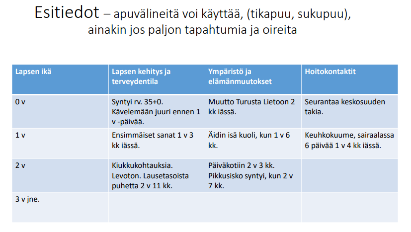
  

#### Paniikkihäiriö: nimeä 3 oiretta (3p) {#Paniikkihairio-3-oiretta}

  <button class="solution-button"
          data-label="Vastaus"
          data-hide-label="Piilota vastaus">
    Vastaus
  </button>
  

  
**Esimerkiksi sydämentykytys, hikoilu, vapina**

Tai yleisemmin ajateltuna esim. **autonomisen kiihotustilan oireet, rinnan/Vatsan alueen oireet ja psyykkiset oireet**

---
      
Paniikkihäiriö on mielenterveyden häiriö, jonka keskeisin piirre on toistuvien paniikkikohtausten esiintyminen. Yksittäisiä paniikkikohtauksia voi esiintyä satunnaisesti terveilläkin henkilöillä, joilla ei ole varsinaista ahdistuneisuushäiriötä. Väestötutkimuksissa jopa 10–15 %:lla haastatelluista on joskus ollut paniikkikohtaus. Paniikkikohtauksia voi esiintyä myös jonkin muun ahdistuneisuushäiriön, erityisesti agorafobian yhteydessä. Paniikkihäiriössä kohtauksia esiintyy kuitenkin toistuvasti ja varsinkin häiriön alkuvaiheessa ilman laukaisevaa tekijää, keskeisin diagnostinen piirre onkin se, että **potilaalla esiintyy toistuvasti odottamattomia, spontaaneja paniikkikohtauksia.**

Paniikkikohtauksilla on usein huomattavia jälkivaikutuksia, jotka ilmenevät **käyttäytymisen muutoksina.** Kohtaukset ovat siinä määrin tuskallisia, ahdistavia ja pelottavia, että ne aiheuttavat jatkuvan huolen kohtauksen uusiutumisesta, sen välittömistä kielteisistä seurauksista, esimerkiksi itsen hallinnan menettämisestä, sydänkohtauksesta tai "hulluksi tulemisesta" tai muutoin muuttavat merkittävästi potilaan käyttäytymistä.

Paniikkikohtauksella tarkoitetaan **äkillisesti ilmaantuvaa, erittäin voimakasta ahdistuksen, pelon tai pakokauhun tunnetta.** Se alkaa yleensä nopeasti muutaman (<10) minuutin kuluessa, ja siihen liittyy voimakkaita somaattisia ja kognitiivisia oireita. Kohtaus kestää tavallisesti minuutteja, useimmiten alle puoli tuntia, mutta joskus jopa tunteja.

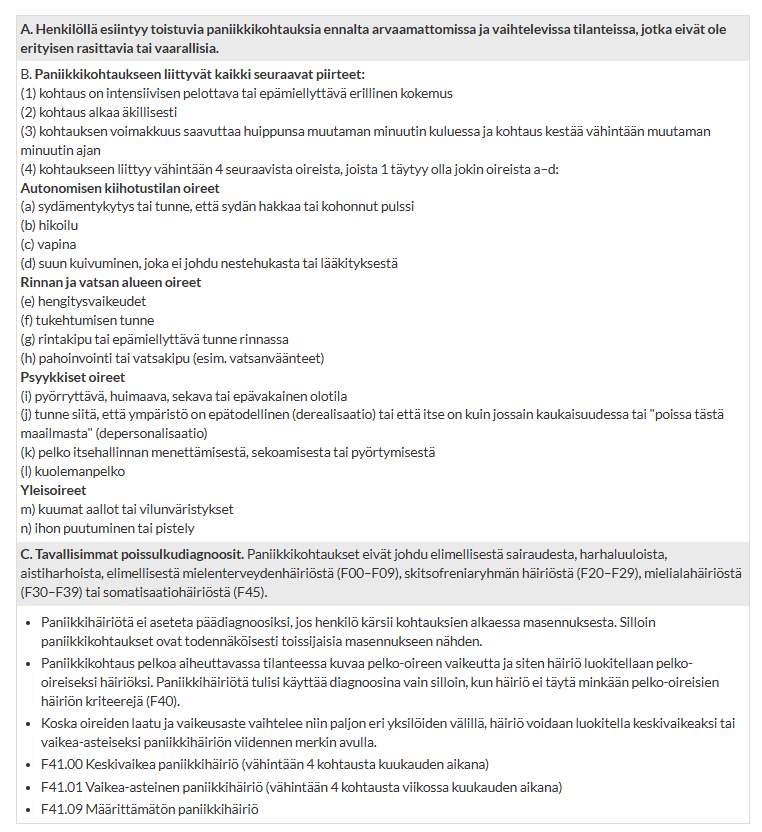

  

#### Ahdistuneisuuden noidankehä muodostuu (1) _____, (2) ______, (3) ______, ja (4) ______. (4p) {#Ahdistuneisuuden-noidankeha}

  <button class="solution-button"
          data-label="Vastaus"
          data-hide-label="Piilota vastaus">
    Vastaus
  </button>
  

  
**ajatuksista, tunteista, fyysisistä oireista ja käyttäymisestä**

---

Muodostavat ns. ahdistuksen noidankehän, jossa osa-alueet vahvistavat toisiaan. 

Esimerkiksi: 

<li>Tilanne: Pitää pitää esitelmä.</li>
<li>Ajatus: "Menen täysin lukkoon."</li>
<li>Tunteet: Pelko ja ahdistus</li>
<li>Kehon reaktio: Sydän hakkaa. Punastuu.</li>
<li>Tulkinta kehosta: "Kaikki huomaavat tämän."</li>
<li>Käyttäytyminen: Välttelen esitelmiä, jotta tätä ei tapahdu uudestaan -> tulevaisuudessa samoissa tilanteissa pahaa enteilevät ajatukset voivat olla vahvempia ja siten reaktio vielä vahvempi -> tulevaisuudessa ei ehkä edes pysty pitämään esityksiä, vaikka olisi pakko</li>

---

**Välttely on keskeinen ylläpitävä tekijä** monissa ahdistuneisuushäiriöissä, koska ihminen ei saa kokemusta siitä, että selviäisi tilanteesta

Ajatusten tasolla voidaan edetä myös kyseisen tilanteen ulkopuolelle; esim. punastuminen -> ”näytän muiden mielestä typerältä” -> ”tulen aina olemaan yksin” (katastrofiajatus)

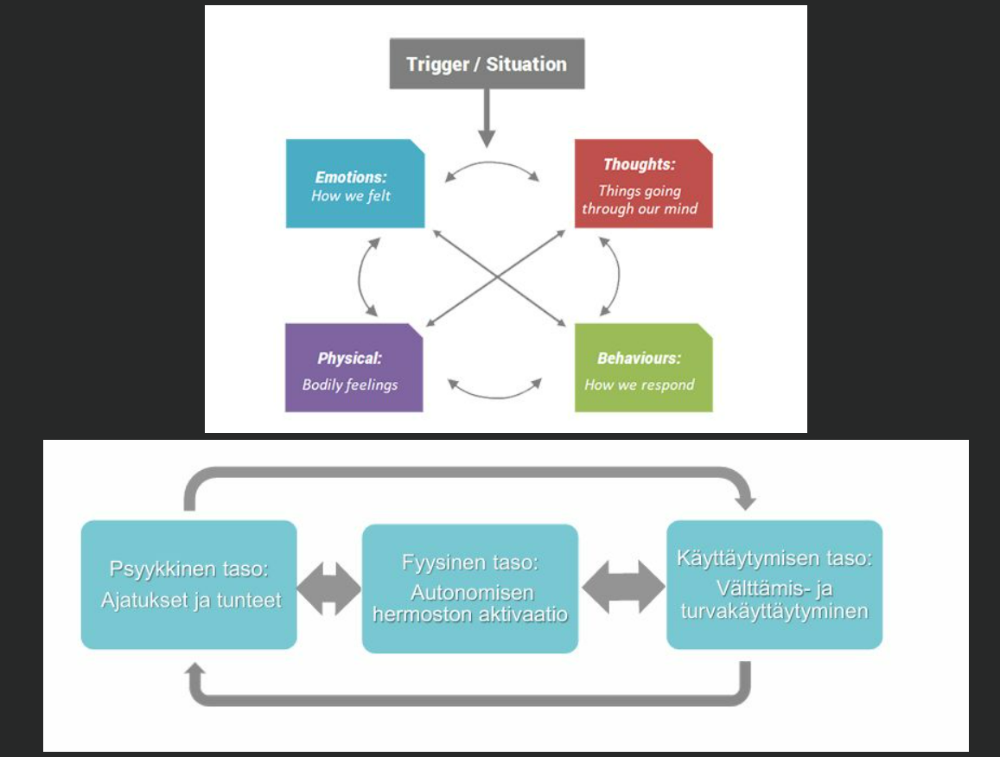

  

#### ADHD:n 3 pääkriteeriä ovat (1) _____, (2) _____ ja (3) _____ (nimet riittää) {#ADHD-paakriteerit}

  <button class="solution-button"
          data-label="Vastaus"
          data-hide-label="Piilota vastaus">
    Vastaus
  </button>
  

  
ylivilkkaus, levottomuus ja impulsiivisuus

---

ADHD:n arvioitavat oireet kuuluvat kahteen/kolmeen ryhmään eli tarkkaamattomuuteen ja yliaktiivisuuteen/impulsiivisuuteen (ICD10:ssä yliaktiivisuus/impulsiivisuus ovat erillisiä diagnostisissa kriteereissä, DSM5:ssä eivät). 

Tarvitaan riittävä määrä oireita, jotta voidaan diagnosoida ADHD. ICD10:ssä vaaditaan 6 tarkkaamattomuusoiretta, 3 impulsiivisuusoiretta ja 3 yliaktiivisuusoiretta; DSM5 vaaditaan vähintään 6 oiretta tarkaamattomuudesta tai yliaktiivisuudesta/impulsiivisuudesta. ADHD:stä voidaan tunnistaa kolme ilmenemismuotoa sen mukaan, painottuvatko oireet tarkkaamattomuuteen (pääasiassa tarkkaamaton ilmenemismuoto), yliaktiivisuuteen ja impulsiivisuuteen (pääasiassa yliaktiivis-impulsiivinen ilmenemismuoto) vai esiintyykö kaikkia ydinoireita (yhdistetty ilmenemismuoto). 

Tuleva ICD-11-luokitus ei enää määrittele vaadittavien oireiden tarkkaa lukumäärää, vaan kuvaa keskeisiä oireita oireryhminä. 

**Diagnostisesti oireita on ollut jo ennen ikävuotta 12 ((ICD10:ssä virallisesti 7v iässä viimeistään, mutta ennen 12v ICD11 ja DSM5) oireiden arvioimisessa monilähteisen tiedonkeryyn hyödyntäminen), oireet ovat kestäneet vähintään 6kk, oireita on useammalla elämän alueella, on todisteita oireiden haitasta elämässä ja että oireet eivät ole selkesti jostain muusta syystä johtuvia.** Muu psykiatrinen diagnoosi ei ole este ADHD-diagnoosille silloin, kun on kyse selkeästi erillisistä mutta samanaikaisista häiriöistä. Erotusdiagnostiikan luotettavuuden kannalta olisi hyvä, että psykiatrista oireistoa tai päihdehäiriötä olisi yritetty hoitaa ennen ADHD:n tutkimista, mutta hoitoresistentissä tilanteessa arviota voidaan yrittää erikoissairaanhoidossa tehdä.

  

#### Resilienssi tarkoittaa ____ ____ ____ 

  <button class="solution-button"
          data-label="Vastaus"
          data-hide-label="Piilota vastaus">
    Vastaus
  </button>
  

valmiutta ja kykyä joustaa sekä sopeutua muutoksiin

---

Mielenterveyden joustavuus ilmenee mm. myönteisinä odotuksina ja optimistisena tulevaisuudenkuvana, toivon ylläpitämisenä. Tätä positiivisen mielenterveyden kokonaisuutta luonnehditaan usein termillä resilienssi. Se voidaan ymmärtää myös kapeammin joustavana selviytymisenä kuormittavista tilanteista.

resilienssi (< re + salire 'uudestaan' + 'hypätä'). Palautumiskyky, toipumiskyky.

  

#### ADHD-stimulanttilääkkeitä on (1) _____-, (2) _____- ja (3) _____vaikutteisia, kesto vaihtelee ___ ____ tuntiin {#ADHD-laakkeet-vaikutusajat}

  <button class="solution-button"
          data-label="Vastaus"
          data-hide-label="Piilota vastaus">
    Vastaus
  </button>
  

lyhyt-, keskipitkä- ja pitkävaikutteisia; kahdesta 14 tuntiin

---

Atomoksetiini ja guanfasiini taas ovat lääkkeitä, jotka otetaan 1krt vrk ja vaikuttavat n. 24h. Näiden vaikutus myös alkaa hitaammin kuin stimulanttien. 

  

#### Selitä mikä on ACE (3p) {#Mika-on-ACE}

  <button class="solution-button"
          data-label="Vastaus"
          data-hide-label="Piilota vastaus">
    Vastaus
  </button>
  

Lapsuudenaikainen haitallinen kokemus (adverse childhood events, ACE, childhood adversity)

---

Varhaislapsuuden ACEt voivat aiheuttaa stressiä, joka häiritsee aivojen rakennetta ja toimintaa, muuttaa stressi- ja immuunijärjestelmien säätelyä, vaikuttaa suolistomikrobiomiin, heikentää tunnesäätelyä sekä mahdollisesti nopeuttaa biologista ikääntymistä, lisäten riskiä terveys-, kehitys- ja mielenterveyshaitoille läpi elämän.

Esim. lapsen kokema uhka, epävarmuus, väkivalta, seksuaalinen hyväksikäyttö, hylkäämiskokemukset sekä muu kaltoinkohtelu, kuten lapsen kehityksellisesti tärkeiden tarpeiden tyydyttymisen laiminlyönti... -> liittyvät myöhemmin aikuisena koettuihin mielenterveyden ongelmiin, erityisesti masennukseen.

Tutkimukset laitoksiin sijoitetuista lapsista osoittavat palautuvuutta ACE:jen jälkeen: Perheympäristöön sijoittamisen jälkeen lasten (aivo)kehitys korjaantuu, etenkin kun heidät sijoitetaan jo nuorena. 

  

#### Ahdistuneisuushäiriöitä on esim ___ (mainitse 3) {#Mainitse-3-ahdistuneisuushairiota}

  <button class="solution-button"
          data-label="Vastaus"
          data-hide-label="Piilota vastaus">
    Vastaus
  </button>
  

<li>Julkisten paikkojen pelko (agorafobia) (F40.0)</li>
<li>Sosiaalisten tilanteiden pelko (Lapsuuden sosiaalinen ahdistushäiriö on F93.2, mutta sosiaalisten tilanteiden pelon dg on F40.1)</li>
<li>Paniikkihäiriö (kohtauksittainen ahdistus) (F41.0)</li>

---

Muita mm. 

<li>Yleistynyt ahdistuneisuushäiriö (Lapsuuden yleistynyt ahdistushäiriö on F93.8 ja on hieman suppeampi oirevalikoiman suhteen; muuten diagnoosi on F41.1)</li>
<li>Alla olevat eivät virallisesti ICD-10:ssä ole ahdistuneisuushäiriöiden alla (ovat F90-diagnooseja), mutta ICD-11:ssa ovat pääsääntöisesti:</li>
  <ul>
    <li>(Lapsuuden) eroahdistushäiriö (F93.0)</li>
    <li>Pelko-oireinen ahdistuneisuushäiriö (F93.1)</li>
    <li>Selektiivinen mutismi (valikoiva puhumattomuus) (F94.0)</li>
    <li>Muut ja sekamuotoiset</li>
  </ul>

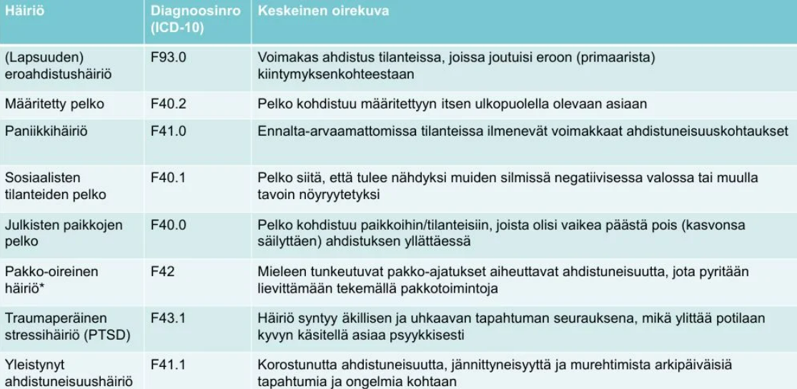
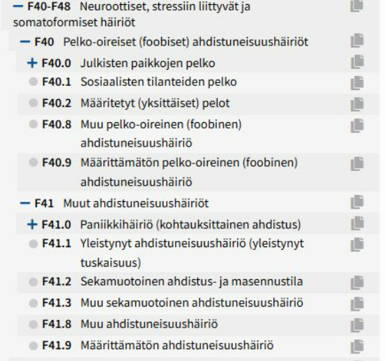
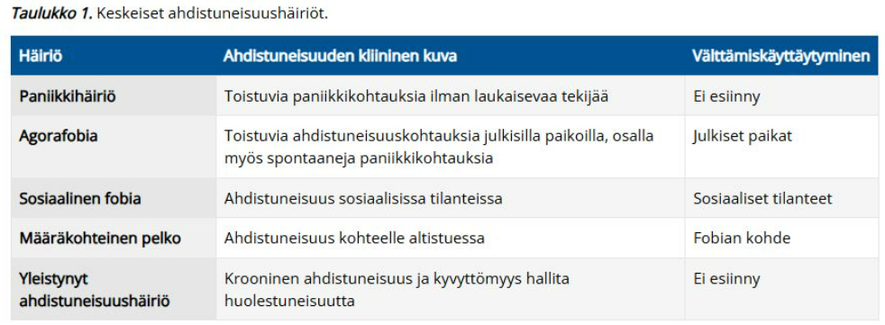
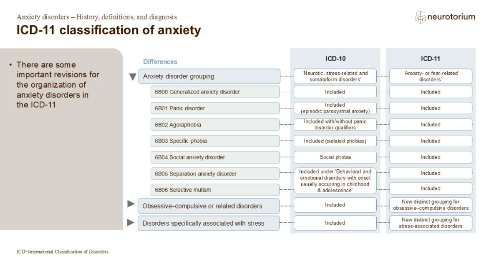

  

#### ADHD-lääkityksen seurannassa tarkkaillaan (fyysiset asiat) (5 viivaa, 3p) {#ADHD-laakityksen-seurannassa}

  <button class="solution-button"
          data-label="Vastaus"
          data-hide-label="Piilota vastaus">
    Vastaus
  </button>
  

**pituus, paino, verenpaine, syke, uni**

---

Yleinen stimulanttien haittavaikutus on **ruoanhalun väheneminen,** mikä voi lapsilla johtaa kasvun hidastumiseen. Tämän takia lapsilla kasvun kehityksen seuranta on todella tärkeää. Uni voi myös häiriintyä lääkkeistä. 

Stimulantit voivat myös _nostaa sykettä ja aiheuttaa verenpaineenkin nousua,_ minkä takia kardiovaskulaarianamneesi on tärkeää selvittää ennen hoidon alkua ja jatkaa haitavaikutusten seurantaa hoidossa. Aikuisilla rutiinisti otetaan EKG ennen hoidon aloitusta, mutta lapsilla status ja anamneesi riittää yleensä.
Hyvän hoitovasteen saavuttamisen jälkeen lääkehoitoa arvioidaan säännöllisesti yksilöllisen tarpeen mukaan, alussa tiiviisti ja jatkossakin kuitenkin vähintään kerran vuodessa

<li>Arvion yhteydessä tarkistetaan kokonaistilanne, lääkeannoksen teho ja riittävyys sekä lääkityksen jatkamisen tarve</li>
<li>Lääkehoidon aikana seurataan sykettä ja verenpainetta sekä lapsilla ja nuorilla painon ja pituuden kehitystä kasvukäyrien avulla lääkehoidon alkuvaiheessa ja muuttuessa 3–6 kuukauden välein</li>

  

#### Nimeä lapselle täytettäväksi annettavia lomakkeita (3kpl) {#Lapselle-lomakkeita}

  <button class="solution-button"
          data-label="Vastaus"
          data-hide-label="Piilota vastaus">
    Vastaus
  </button>
  

Tässä nyt neljä: RCADS, SDQ, CDI, SCARED

---

<li>RCADS (Revised Children’s Anxiety and Depression Scale) – ahdistus- ja masennusoireita kartoittava kyselylomake</li>
<li>SDQ (Strengths and Difficulties Questionnaire) - lyhyt lapsen käyttäytymistä kartoittava kysely (kerätään tietoa 3–16-vuotiaan lapsen psykososiaalisesta hyvinvoinnista omilla lomakkeillaan vanhemmalta, opettajalta (päivähoito, koulu) ja yli 11-vuotiailta lapsilta itseltään)</li>
<li>CDI (Children's Depression Inventory) – lasten ja nuorten masennusoireiden kartoitus- ja seulontamenetelmä</li>
<li>SCARED (Screen for Child Anxiety Related Disorders) - seulotaan ja arvioidaan lasten ja nuorten ahdistuneisuusoireita </li>

  

#### Nimeä 3 opettajalle annettavaa lapsen oirekyselylomaketta {#Opettajalle-lomakkeita}

  <button class="solution-button"
          data-label="Vastaus"
          data-hide-label="Piilota vastaus">
    Vastaus
  </button>
  

Tässä nyt neljä: SDQ, Keskittymiskysely, ADHD-RS, Viivi (5-15R, FTF, five-to-fifteen)

---

<li>SDQ (Strengths and Difficulties Questionnaire) - lyhyt lapsen käyttäytymistä kartoittava kysely (kerätään tietoa 3–16-vuotiaan lapsen psykososiaalisesta hyvinvoinnista omilla lomakkeillaan vanhemmalta, opettajalta (päivähoito, koulu) ja yli 11-vuotiailta lapsilta itseltään)</li>
<li>Keskittymiskysely - kartoitetaan kouluikäisten lasten ja nuorten tarkkaavuuden ja toiminnanohjauksen vaikeuksia; yleensä opettaja kouluympäristössä on täyttäjä (Pienemmille lapsille on olemassa vastaava PikkuKesky - Pienten lasten keskittymiskysely, jota käytetään varhaiskasvatuksessa)</li>
<li>ADHD-RS-kysely on diagnostiseen oirekartoitukseen tarkoitettu kysely, jossa lapsen käyttäytymistä koskevat väittämät perustuvat DSM-tautiluokituksen mukaisiin oirekriteereihin. Kyselylomakkeesta on alkuperäisversiossa olemassa rinnakkaiset identtiset versiot vanhemmille ja opettajalle</li>
<li>Viivi-kysely soveltuu 5–17-vuotiaan lapsen kehityksen eri toiminta-alueiden, motoriikan, toiminnanohjauksen, hahmotuksen, muistin, kielen, sosiaalisten taitojen ja oppimisen ongelmien, kartoittamiseen kliinisessä työssä - Vanhempien ja opettajien versiossa on yhteensä 17 väittämää motoriikan osa-alueelta: 7 karkeamotoriikasta ja 10 hienomotoriikasta</li>

  

### Kolmen sukupolven mallissa perehdytään ---, --- ja --- asioihin {#3-sukupolven-mallissa}

  <button class="solution-button"
          data-label="Vastaus"
          data-hide-label="Piilota vastaus">
    Vastaus
  </button>
  

lapsen, vanhempien ja isovanhempien 

---

Peheen toiminnan ja sisäisten vuorovaikutussuhteiden tarkastelussa on tärkeää ottaa huomioon myös vanhempien primaariperheiden vaikutus. Äidin ja isän kokemukset ja kasvatus vaikuttavat myös heidän näkemyksiinsä ja toimintatapoihin. 

Tietysti myös geneettiset tekijät vaikuttavat perheen lapsien riskeihin ja on hyvä selvittää vanhempienkin vanhempien taustoja.
  

### Tosi/Epätosi-väittämät {#Vaittamat-2026}

#### ADHD:n periytyvyys on 40-50% 

  <button class="solution-button"
          data-label="Vastaus"
          data-hide-label="Piilota vastaus">
    Vastaus
  </button>
  

      Väärin 
      
Riippuu lähteestä, joten vähän huono kysymys. Käypä Hoidon mukaan arviot periytyvän komponentin osuudesta vaihtelevat välillä 74–88 %. Kyseessä on yksi periytyvimmistä (neuro)psykiatrisista häiriöistä.

---

Vakiintuneen käsityksen mukaan ADHD:n tausta on monitekijäinen ja sen ilmenemiseen vaikuttavat yhdessä erilaiset altistavat ja suojaavat tekijät perimässä ja ympäristössä. Monimuotoinen tausta selittää myös ADHD:n monimuotoisen ilmiasun

ADHD:n periytymisen todennäköisyys perheissä on huomattavan korkea. Jos vanhemmalla on diagnoosi, lapsella on noin 25-50 prosentin riski saada sama häiriö. Jos sekä vanhemmalla että sisaruksella on ADHD, riski on vielä korkeampi.

Kyse on alttiudesta, ei varmasta periytymisestä.

  

#### Masennus ja ahdistus voi ilmentyä ADHD:n kaltaisena oireiluna {#Mas-ahd-adhd}

  <button class="solution-button"
          data-label="Vastaus"
          data-hide-label="Piilota vastaus">
    Vastaus
  </button>
  

      Oikein 
      
Masennus tai ahdistuneisuushäiriö voi aiheuttaa mm. toiminnanohjauksen vaikeuksia, keskittymiskyvyttömyyttä, muistivaikeuksia, levottomuutta ja sisäistä rauhattomuutta -> muistuttaa ADHD:n keskeisiä oireita -> erotusdiagnostiikka tärkeää. 

  

#### Huolimattomuusvirheet ja tavaroiden hukkaaminen ovat tyypillisiä tarkkaamattomuuden oireita {#Huolimattomuusvirheet-tarkaamattomuus}

  <button class="solution-button"
          data-label="Vastaus"
          data-hide-label="Piilota vastaus">
    Vastaus
  </button>
  

      Oikein 
      
ADHD:n keskeisiä diagnostisia oireita keskittymiskyvyttömyyslokerosta. 

  

#### ADHD voi ilmentyä ylivilkkautena tai toiminnan hidastumisena {#ADHD-ylivilkkaus-tai-hidastuminen}

  <button class="solution-button"
          data-label="Vastaus"
          data-hide-label="Piilota vastaus">
    Vastaus
  </button>
  

      Oikein 
      
Ylivilkkaus tietysti tyypillistä, mutta toiminnan hidastuminen liittyy erityisesti tarkkaamattomuuteen (ADD). Tehtävien aloittaminen ja toiminnan suunnittelu voi olla vaikeaa -- tämä onkin yski keskittymiskyvyttömyyden kriteeristön oireista.

On olemassa myös ns. sluggish cognitive tempo (SCT) -häiriö, joka on on tarkkaavaisuus- ja ylivilkkaushäiriöstä täysin erillinen tarkkaavaisuushäiriö, jota ei ole sisällytetty ICD tai DSM-kriteeristöihin. 

  

#### Komplisoitumattoman ADHD:n voi hoitaa PTH:ssa 

  <button class="solution-button"
          data-label="Vastaus"
          data-hide-label="Piilota vastaus">
    Vastaus
  </button>
  

      Oikein (pääasiassa) 
      
Lasten ja nuorten diagnostinen arvio ja hoito- ja kuntoutussuunnitelma tehdään moniammatillisesti ensisijaisesti perusterveydenhuollon palveluissa, ellei erityistä perustetta vaativampiin palveluihin ole esimerkiksi erotusdiagnostisista syistä. 

_Mahdollisesti lääkekokeilua tarvitsevat alle 6-vuotiaat lapset ohjataan erikoissairaanhoitoon._

Aikuisten ADHD:ssa paikallisten ohjeiden mukaan voidaan usein PTH:ssa aloittaa diagnostiikka ja mahdollisesti lääkityskin, mutta psykiatrin konsultaatio tulisi tehdä viimeistään, jos ensimmäisen ADHD:n lääkehoidon aloittava lääkäri ei ole erikoislääkäri. 

---

ESH:n vastuulla ovat erikoissairaanhoitoa tarvitsevien potilaiden erotusdiagnostiset selvittelyt ja niihin kuuluvat lisätutkimukset, vaativien lääkehoitojen aloittaminen, vaativan hoidon ja kuntoutuksen suunnittelu sekä jatkohoidosta ja -seurannasta sopiminen. Lisäksi erikoissairaanhoidon tehtäviin kuuluvat riittävien konsultaatiomahdollisuuksien ja koulutuksen järjestäminen. Erikoissairaanhoidon arviota tarvitaan, jos: 

<li>perusterveydenhuollon hoito- ja kuntoutustoimet ovat osoittautuneet konsultaatiotuesta huolimatta riittämättömiksi</li>
<li>tarvitaan erityistä osaamista vaativaa erotusdiagnostista arviointia (käytännössä siis komorbiditeetteja häiritsemässä)</li>
<li>lääkehoidon toteutuksessa tai hoitovasteessa on ongelmia, jotka eivät ratkea konsultaatiotuen avulla tai</li>
<li>kokonaistilanteen ongelmallisuuden vuoksi tarvitaan erikoissairaanhoidon osaamista tai usean erikoisalan yhteistyötä</li>

  

#### EPDS voidaan käyttää autismikirjon häiriön seulonnassa {#EPDS-tismi}

  <button class="solution-button"
          data-label="Vastaus"
          data-hide-label="Piilota vastaus">
    Vastaus
  </button>
  

      Väärin 
      
EPDS (Edinburgh Postnatal Depression Scale) on 10-osainen kyselylomake, jota käytetään raskaudenaikaisen ja synnytyksenjälkeisen masennuksen tunnistamiseen. 

---

Autismikirjon seulontaan soveltuvia oirekyselylomakkeita ja arviointimenetelmiä on kehitetty eri ikäisille, esim.: 

<li>SCQ (Social Communication Questionnaire, Sosiaalisen kommunikaation kyselylomake). SCQ-lomakkeen Elinikäinen-versio ilmeisesti soveltuu autismikirjon häiriön seulontaan yli 4-vuotiaille. Sen voi täyttää vanhempi tai huoltaja, joka on tuntenut lapsen 4–5 vuoden iässä. Tällä hetkellä -version voi täyttää lisäksi esimerkiksi opettaja tai muu tutkittavan henkilön hyvin tunteva henkilö</li>
<li>M-CHAT R/FTM (The Modified Checklist for Autism in Toddlers -revised-with follow-up) -seulonnan käyttö 16–30 kuukauden ikäisille saattaa aikaistaa autismidiagnoosia</li>
<li>ASSQ (Autism Spectrum Screening Questionnaire) kartoittaa autistisia piirteitä (sosiaalisen vuorovaikutuksen ja kommunikaation erityispiirteitä sekä rajoittunutta ja toistavaa käyttäytymistä) 7–16-vuotiailta lapsilta ja nuorilta, jotka ovat kognitiivisesti hyvätasoisia tai lievästi älyllisesti kehitysvammaisia. ASSQ-lomakkeen täyttävät opettaja ja vanhemmat. ASSQ-REV on ASSQ:n laajennettu versio, johon on lisätty väittämiä, joiden avulla voidaan tunnistaa paremmin autismikirjon tytöt</li>
<li>AQ eli autismikirjon osamäärä (Autism Spectrum Quotient) on itsearviointilomake, jonka tarkoituksena on tunnistaa henkilöitä, joille voi olla perusteltua tehdä tarkempi autismikirjon häiriön diagnostinen tutkimus. AQ soveltuu 16 vuotta täyttäneille nuorille ja aikuisille</li>
<li>AQ eli autismikirjon osamäärä (Autism Spectrum Quotient) on itsearviointilomake, jonka tarkoituksena on tunnistaa henkilöitä, joille voi olla perusteltua tehdä tarkempi autismikirjon häiriön diagnostinen tutkimus. AQ soveltuu 16 vuotta täyttäneille nuorille ja aikuisille</li>
<li>ESB (Early Sociocognitive Battery) on 2–5 vuoden ikäisten lasten sosiaalisen kognition taitojen arviointimenetelmä, joka on tarkoitettu muun muassa puheterapeuttien ja psykologien käyttöön. Sen avulla voidaan tunnistaa lapsia, joilla on riski kielen kehityksen, sosiaalisen kommunikaation tai autismikirjon häiriöön</li>
<li>CCC-2-lomakkeen (Children's Communication Checklist) voi täyttää joko vanhempi tai huoltaja tai ammattihenkilö. Sen avulla voidaan seuloa lapsen tai nuoren mahdollinen kielihäiriö, kielen pragmatiikan ongelma ja autismikirjon häiriön piirteet, ja lomakkeen antamaa tietoa voidaan hyödyntää jatkotutkimusten suunnittelussa. Sitä voidaan käyttää apuna myös kuntoutustavoitteiden seuraamisessa</li>
<li>GQ-ASC (Girls Questionnaire for Autism Spectrum Condition) on autismikirjon häiriöön liittyvien käyttäytymismallien ja kykyjen tunnistamiseen tarkoitettu itsearviointilomake 17-vuotiaille ja sitä vanhemmille cis- ja transnaisille</li>
<li>SRS (Social Responsiveness Scale) on arviointilomake, johon vastaa lapsen tai nuoren (4–18 vuotta) vanhempi, huoltaja, opettaja tai muu tämän hyvin tunteva henkilö. SRS-lomaketta voidaan käyttää autismikirjon häiriön piirteiden tunnistamisessa, mutta sen osoittamat sosiaalisen kompetenssin haasteet voivat johtua myös muusta kuin autismikirjon häiriöstä</li>

  

#### Neuvolapsykologi on käytössä joko lasten- tai äitiysneuvolassa

  <button class="solution-button"
          data-label="Vastaus"
          data-hide-label="Piilota vastaus">
    Vastaus
  </button>
  

      Väärin 
      
Neuvolapsykologi on sekä lasten- että äitiysneuvolan käytettävissä -- ei ole rajattu vain jompaankumpaan. 

  

#### PTSD:n ilmaantuvuus on 30% traumaattisen kokemuksen kokeneilla lapsilla

  <button class="solution-button"
          data-label="Vastaus"
          data-hide-label="Piilota vastaus">
    Vastaus
  </button>
  

      Väärin 
      
PTSD:n prevalenssi on trauman kokeneilla lapsilla/nuorilla n. 15.9%. 

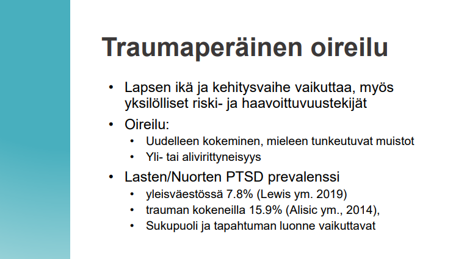
  

#### Komorbiditeetti on lastenpsykiatrialla harvinaista 

  <button class="solution-button"
          data-label="Vastaus"
          data-hide-label="Piilota vastaus">
    Vastaus
  </button>
  

      Väärin 
      
Komorbiditeetti eli rinnakkaissairastavuus on lastenpsykiatrialla erittäin tavallista. Riippuen lähteestä jopa yli puolella lastenpsykiatrisista potilaista on enemmän kuin yksi diagnostinen kriteeri täyttyneenä (esim. ADHD + uhmakkuushäiriö, ahdistuneisuus + masennus yms).

  

#### Jos lapsella on toimintakyvyn laskua, saattaa kyseessä olla lastenpsykiatrinen häiriö {#Toimintakyvyn-laskua-hairio}

  <button class="solution-button"
          data-label="Vastaus"
          data-hide-label="Piilota vastaus">
    Vastaus
  </button>
  

      Oikein 
      
Määräävä kriteeri yleisesti psykiatrisissa häiriöissä (mukaan lukien lastenpsykiatriset häiriöt) on se, että oireet aiheuttavat merkittävää toimintakyvyn laskua tai kärsimystä arjessa – esimerkiksi kotona, koulussa, päiväkodissa tai kaverisuhteissa

Pelkkä yksittäinen oire tai oireilu ei pääsääntöisesti vielä täytä diagnostisia kriteereitä, jos toimintakyky säilyy hyvänä. Toimintakyvyn heikkeneminen on siis keskeinen merkki mahdollisesta psykiatrisesta häiriöstä.
  

#### Stressi ja ympäristötekijät eivät voi aiheuttaa lapsilla tunne-elämän häiriöitä {#Stressi-ja-ymparisto-ei}

  <button class="solution-button"
          data-label="Vastaus"
          data-hide-label="Piilota vastaus">
    Vastaus
  </button>
  

      Väärin 
      
Stressi, traumaattiset kokemukset, turvaton kasvuympäristö ja muut ympäristötekijät ovat keskeisiä tunne-elämän häiriöiden (kuten ahdistuneisuuden ja masennuksen) aiheuttajia ja laukaisevia tekijöitä lapsilla.

  

#### Joskus olennaisinta lastenpsykiatrialla on lapsen vanhemman psykiatrisen häiriön hoito ja sosiaalitoimet {#Joskus-olennaisinta-lpsy}

  <button class="solution-button"
          data-label="Vastaus"
          data-hide-label="Piilota vastaus">
    Vastaus
  </button>
  

      Oikein 
      
Lasten psykiatriset oireet ja vointi ovat tiiviissä yhteydessä perheen kokonaistilanteeseen. Vanhemman hoitamaton psykiatrinen häiriö tai perheen sosiaaliset kuormitustekijät (esim. perheväkivalta, päihdeongelmat tai vakavat toimeentulo-ongelmat) vaikuttavat suoraan lapsen turvallisuudentunteeseen ja kehitykseen. Tällöin lapsen oireilu voi helpottaa parhaiten tukemalla vanhempaa ja vakauttamalla perheen arki sosiaalitoimen keinoin.

  

#### Käytöshäiriön oireita on mm. varastelu, omaisuuden tuhoaminen, väkivaltainen käyttäytyminen {#Kaytoshairion-oireita}

  <button class="solution-button"
          data-label="Vastaus"
          data-hide-label="Piilota vastaus">
    Vastaus
  </button>
  

      Oikein 
      
Käytöshäiriöllä tarkoitetaan lapsilla ja nuorilla esiintyvää pitkäaikaista ja laaja-alaista toisten oikeuksista ja hyvinvoinnista sekä yhteisön laeista, normeista ja säännöistä piittaamatonta käyttäytymistä, joka heikentää yksilön toimintakykyä kliinisesti merkittävässä määrin

Diagnoosia asetettaessa on muistettava, että käyttäytymisongelmien tulee olla pitkäaikaisia ja poiketa selvästi iänmukaisista sosiaalisista odotuksista sekä aiheuttaa toiminnallista haittaa lapselle ja hänen ympäristölleen. 

Käytöshäiriöisen lapsen oirekuva on usein heterogeeninen ja voi painottua enemmän joko reaktiiviseen aggressiiviseen käyttäytymiseen tai proaktiiviseen aggressioon. Ensin mainitussa lapsi reagoi aggressiivisella käyttäytymisellä ympäristöstä tuleviin virikkeisiin, kun taas jälkimmäisessä lapsi itse aloittaa tappeluita tai rikkoo sosiaalisia normeja esimerkiksi kiusaamalla muita.

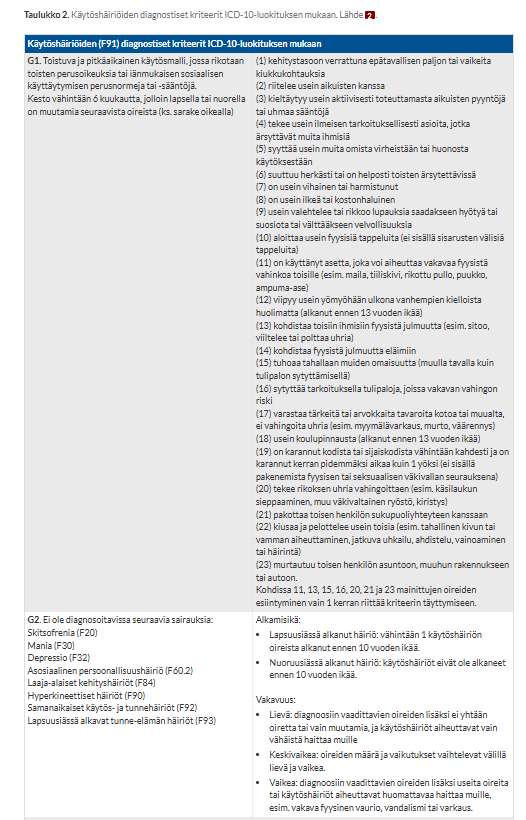
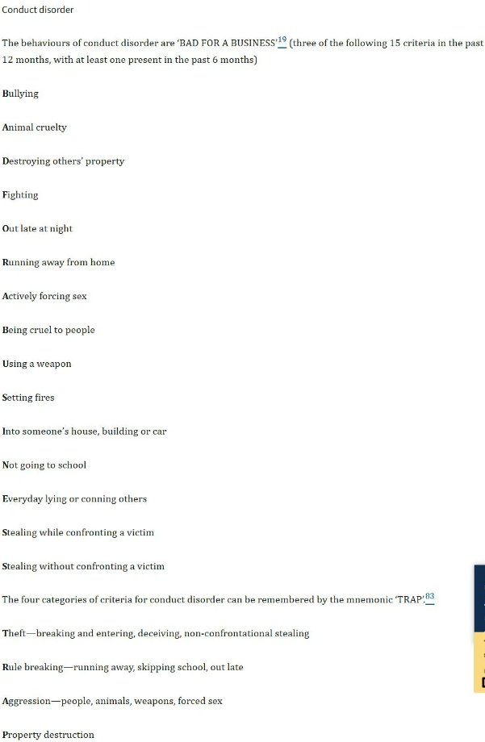

  

#### Käytöshäiriöiden ilmentymiseen vaikuttaa äidin raskaudenaikainen ylipaino, stressi, tupakointi ja alkoholinkäyttö {#Kaytoshairioiden-riskitekijoita}

  <button class="solution-button"
          data-label="Vastaus"
          data-hide-label="Piilota vastaus">
    Vastaus
  </button>
  

      Oikein 
      
Käytöshäiriöiden kehittymiselle voivat nykykäsityksen mukaan altistaa monet tekijät: niin perimä kuin biologiset ja psykososiaaliset ympäristötekijät sekä niiden yhteisvaikutus. 

Monet raskaudenaikaiset tekijät voivat myös aiheuttaa hermoston kehitykseen ja sitä kautta aiheuttaa psykiatrisia/neuropsykiatrisia oireita. 
  

#### Tic-oireet ovat erit. leikki-ikäisillä pojilla yleisiä {#Tic-oireet-leikki-ika}

  <button class="solution-button"
          data-label="Vastaus"
          data-hide-label="Piilota vastaus">
    Vastaus
  </button>
  

      Oikein 

Tic-oire on äkillinen, tarkoitukseton, usein samankaltaisena toistuva, rytmitön, pääosin tahdosta riippumaton, joko tietyn lihaksen tai lihasryhmän alueella ilmenevä nykäys (motorinen tic-oire) tai tarkoitukseton, äkillinen äänne, sana tai lause (vokaalinen tic-oire) 

Tic-oireet voivat olla yksinkertaisia, vain yhtä lihasryhmää koskevia (esim. nenän nyrpistys, huudahdusääni), tai monimuotoisia, jolloin ticiin osallistuu useita lihasryhmiä (esim. liikesarjat, fraasien toistelu). Yksinkertaiset tic-oireet ovat lapsilla tavallisia eivätkä yleensä haittaa toimintakykyä.

Kun tic-oireet ovat pitkäkestoisia, niitä esiintyy sekä motorisina että vokaalisina ja ainakin osa oireista on monimuotoisia, kyseessä on Touretten oireyhtymä. Sen esiintyvyys on lapsuus- ja nuoruusiässä pojilla noin 1,0 % ja tytöillä noin 0,3 %. Touretten oireyhtymässä tic-oireet alkavat tyypillisesti 3–8 vuoden iässä, ovat voimakkaimmillaan 10–12-vuotiaana ja helpottuvat usein merkittävästi nuoruusiässä tai nuoressa aikuisuudessa

Tic-häiriöiden esiintyvyys aikuisilla on matalampi, mutta luotettavaa tutkimustietoa on niukalti. Ohimenevät tic-oireet ovat lapsilla hyvin tavallisia, joidenkin arvioiden mukaan yleisyys olisi jopa 20 %.

  

#### On huolestuttavaa, jos pieni lapsi pelkää mörköjä tai on eroahdistusta vanhemmista {#Pelkaako-morkoja}

  <button class="solution-button"
          data-label="Vastaus"
          data-hide-label="Piilota vastaus">
    Vastaus
  </button>
  

      Väärin 

Pienillä lapsilla eroahdistus on tavallinen, normaalikehitykseen kuuluva piirre, varsinkin n. 9kk iästä alkaen ikävuoteen 3-4 asti. Samoin lievät spesifiset pelot, jotka eivät kuitenkaan ole suhteettoman voimakkaita ja toimintakykyä lamaavia. 

  

#### Masennuksen oireita ovat esim. univaikeudet, keskittymisvaikeudet ja itsesyytökset {#Masennuksen-oireita}

  <button class="solution-button"
          data-label="Vastaus"
          data-hide-label="Piilota vastaus">
    Vastaus
  </button>
  

      Oikein 

Kuuluvat diagnostisiin oireisiin. Kuvassa masennuksen diagnostiset kriteerit. 

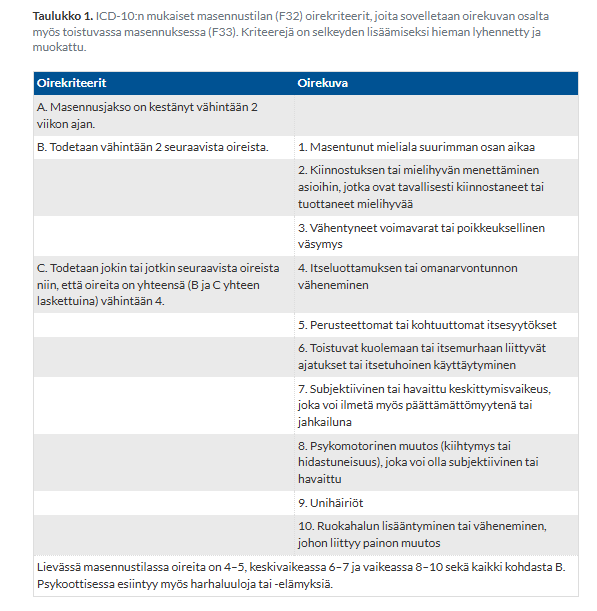
  

#### Hyvään vuorovaikutukseen kuuluu lapsen tarpeisiin vastaaminen ja lapsen tunteisiin virittäytyminen {#Hyva-vuorovaikutus}

  <button class="solution-button"
          data-label="Vastaus"
          data-hide-label="Piilota vastaus">
    Vastaus
  </button>
  

      Oikein 

Lapsen tarpeisiin vastaaminen ja tunteisiin virittäytyminen (attunement, reflektiivinen kyky) muodostavat toimivan vuorovaikutuksen ytimen. 

Virittäytymisessä vanhempi havaitsee ja tunnistaa lapsen tunnetilan (esim. pelon, kiukun tai ilon) ja peilaa sitä sopivalla tavalla. Tämä auttaa lasta ymmärtämään omia tunteitaan ja kehittää hänen kykyään säätellä niitä. 

Tarpeisiin tulee vastata johdonmukaisesti ja sopivalla herkkyydellä, mikä luo pohjan turvalliselle kiintymyssuhteelle. 
  

#### Itsetuhoisuudesta ei kannata kysyä suoraan

  <button class="solution-button"
          data-label="Vastaus"
          data-hide-label="Piilota vastaus">
    Vastaus
  </button>
  

      Väärin 

Itsetuhoisuuden kartoittaminen ei lisää riskiä itsetuhoisuudelle! Iällä ei ole väliä tämän suhteen. 

  

#### Mentalisaatio on keskeistä hyvälle vanhemmuudelle? {#Mentalisaatio-vanhemmuudelle}

  <button class="solution-button"
          data-label="Vastaus"
          data-hide-label="Piilota vastaus">
    Vastaus
  </button>
  

       Oikein

Mentalisaatiokyky eli yksilön varhaisessa vuorovaikutuksessa kehittyvä kyky havaita ja ymmärtää itseä ja toista on yksi vanhemmuuden ja lapsen kehityksen tärkeimmistä kulmakivistä. 

Yksilö alkaa kehityksensä alkutaipaleella vähitellen havaita, että toinen ihminen on olemassa ja että toisella on oma itsenäinen mielensä. Tämän perusasian ymmärtäminen ja harjoittelu johtavat sosiaalisten taitojen karttumiseen sekä mahdollisuuteen, että voi ottaa toisen ihmisen huomioon itsenäisenä toisena ihmisenä, johon oman mielen vaikutusvalta ei ulotu.

**Mentalisaatiokyky voi jäädä kehittymättä tai puutteelliseksi, jos varhaislapsuuden hoivaaja ei kykene reflektoimaan vauvan tunnetiloja eli vastaanottamaan, tulkitsemaan ja työstämään niitä riittävän osuvalla tavalla eikä palauttamaan niitä sitten vauvalle.** Jos läheinen hoivaaja on lisäksi esimerkiksi pahantahtoinen, ei kasvava lapsi voi sijoittaa häneen ajatusta itsestä riippumattomista intentioista, koska tällöin ohut mielikuva hyvästä hoivaajasta tulee uhatuksi. Mentalisaatioprosessi estyy ja lisäksi mielikuvat hyvästä ja pahasta jäävät toisistaan lohkoutuneiksi, integroitumattomiksi. Lapselle ei myöskään voi kehittyä toimivaa itsereflektiokykyä, jos hänellä ei ole ollut hoivaajan suhteen reflektoivaa vuorovaikutusta, joka voisi sisäistyä. Tämän seurauksena voi olla monenlaista arkipäivän tunteensiirtoon ja molemminpuolisuuden tavoittamattomuuteen liittyvää hankaluutta ihmissuhteissa. Näitä vaikeuksia voidaan kutsua esimerkiksi epävakaudeksi ja narsistisuudeksi.

  

#### Vuoron odottamisen haaste on tyypillinen tarkkaamattomuusoire

  <button class="solution-button"
          data-label="Vastaus"
          data-hide-label="Piilota vastaus">
    Vastaus
  </button>
  

       Väärin

Kyseessä on impulsiivisuusoire. 

  

#### ADHD:n diagnosoimiseksi vaaditaan 9 tarkkaamattomuusoiretta

  <button class="solution-button"
          data-label="Vastaus"
          data-hide-label="Piilota vastaus">
    Vastaus
  </button>
  

       Väärin

Kyseessä on impulsiivisuusoire. 

---

ADHD:ssa arvioitavat oireet kuuluvat kahteen ryhmään eli tarkkaamattomuuteen ja yliaktiivisuuteen/impulsiivisuuteen (ICD10:ssä yliaktiivisuus/impulsiivisuus ovat erillisiä diagnostisissa kriteereissä). 

Tarvitaan riittävä määrä oireita, jotta voidaan diagnosoida ADHD. **ICD10:ssä vaaditaan 6 tarkkaamattomuusoiretta, 3 impulsiivisuusoiretta ja 3 yliaktiivisuusoiretta;*** DSM5 vaaditaan vähintään 6 oiretta tarkaamattomuudesta tai yliaktiivisuudesta/impulsiivisuudesta. ADHD:stä voidaan tunnistaa kolme ilmenemismuotoa sen mukaan, painottuvatko oireet tarkkaamattomuuteen (pääasiassa tarkkaamaton ilmenemismuoto), yliaktiivisuuteen ja impulsiivisuuteen (pääasiassa yliaktiivis-impulsiivinen ilmenemismuoto) vai esiintyykö kaikkia ydinoireita (yhdistetty ilmenemismuoto). 

Tuleva ICD-11-luokitus ei enää määrittele vaadittavien oireiden tarkkaa lukumäärää, vaan kuvaa keskeisiä oireita oireryhminä. 

  

#### Lapsen ahdistuneisuushäiriön ensisijainen hoito on SSRI {#SSRI-ensisijainen-ahd-laps}

  <button class="solution-button"
          data-label="Vastaus"
          data-hide-label="Piilota vastaus">
    Vastaus
  </button>
  

       Väärin

Ensisijainen hoito perustuu aina psykososiaalisiin hoitoihin ja kognitiiviseen käyttäytymisterapiaan. 

Hoidon rungon muodostavat psykoedukaatio, vanhempainohjaus sekä lapselle suunnattu psykoterapia. 

Lääkkeet ovat lapsilla toisen linjan hoitomuoto. Lääkehoitoa voidaan harkita osana kokonaishoitoa silloin, kun kyseessä on vaikea-asteinen ahdistuneisuus, johon psykosiaalinen hoito ei ole tuonut riittävää vastetta. Lääkehoidon aloituksen tulee aina perustua lastenpsykiatrisen erikoissairaanhoidon arvioon.
  

#### Uhmaikä ja rajojen testaaminen kuuluu normaaliin lapsen kehitykseen

  <button class="solution-button"
          data-label="Vastaus"
          data-hide-label="Piilota vastaus">
    Vastaus
  </button>
  

       Oikein

Uhmakkuushäiriön diagnoosia asetettaessa on muistettava, että käyttäytymisongelmien tulee olla pitkäaikaisia ja poiketa selvästi iänmukaisista sosiaalisista odotuksista sekä aiheuttaa toiminnallista haittaa lapselle ja hänen ympäristölleen.

Uhmakkuushäiriön diagnoosi asetetaan usein nuoremmille lapsille noin 8–10 vuoden iässä, ja se edeltää usein varsinaista käytöshäiriötä. **Uhmakkuushäiriöisen lapsen käytös muistuttaa nuoremman, noin 2–3-vuotiaan lapsen normaalikehitykseen kuuluvaa "uhmaikää".** Osalla lapsista uhmakas käyttäytyminen on jatkunut tuosta saakka eikä ole iänmukaisesti muuntunut, osalla lapsista uhmakas käytös alkaa vasta kouluiässä.

  

#### Jos tic-oireita on paljon ja niistä on merkittävää haittaa, voi tehdä ESH-lähetteen {#Tic-esh}

  <button class="solution-button"
          data-label="Vastaus"
          data-hide-label="Piilota vastaus">
    Vastaus
  </button>
  

       Oikein

_Tärkeintä tic-oireiden hoidossa on oirekuvaan liittyvä tieto, neuvonta ja ohjaus_ niin lapselle ja hänen perheelleen kuin lähiympäristölle (päivähoito, koulu), sopeutumisvalmennus, vertaistuki sekä lapsen yleisen sosiaalisen selviytymisen tukeminen. **Neuvonta ja ohjaus voidaan tehdä perusterveydenhuollossa.**

Käyttäytymisterapeuttinen hoito ja/tai lääkehoito on perusteltua, jos tic-oireet häiritsevät lasta tai ne aiheuttavat toiminnallista tai sosiaalista haittaa. Ensisijaisesti suositellaan käyttäytymisterapeuttista hoitoa.

<li>**Jos lapsi tarvitsee terapiaa tai lääkehoitoa, niiden suunnittelu kuuluu asiaan perehtyneelle erikoislääkärille** (esim. lastenpsykiatri tai lastenneurologi paikallisen hoitokäytännön mukaisesti)</li>

  

#### Jos käytöshäiriö ei laannu 3vk psykososiaalisella hoidolla, voi aloittaa lääkehoidon PTH:ssa {#Kaytoshairio-laakehoito-PTH}

  <button class="solution-button"
          data-label="Vastaus"
          data-hide-label="Piilota vastaus">
    Vastaus
  </button>
  

       Väärin

Lääkehoitoa käytetään vain erikoislääkärin aloittamana vaikeahoitoisissa tapauksissa muun hoidon rinnalla -- ei siis aloiteta PTH:ssa. 
  

#### Atomoksetiini on stimulantti

  <button class="solution-button"
          data-label="Vastaus"
          data-hide-label="Piilota vastaus">
    Vastaus
  </button>
  

       Väärin

Atomoksetiini on ei-stimulanttilääkitys ADHD:n hoidossa. 

Sillä on kylläkin hyvin samanlaisia haittavaikutuksia kuin stimulanteilla (metyylifenidaatti ja amfetamiinijohdokset), koska sen vaikutusmekanismi perustuu samoihin reitteihin. Atomoksetiini siis vaikuttaa siten, että se estää selektiivisesti NAT-kuljetusproteiinia, joka estää noradrenaliinin mutta myös dopamiinin takaisinottoa prefrontaalikorteksilla. 

Stimulantit taas vapauttavat vapauttavat dopamiinia/noradrenaliinia nopeasti. Atomoksetiini vaikuttaa hitaammin (parissa viikossa säännöllisessä käytössä) ja tasaisesti vuorokauden ympäri. 
  

#### Jos psykososiaalisesta hoidosta ei ole riittävästi hyötyä, sen voi lopettaa ja tilalle lääkitys {#Psyksos-lopettaa-laakitys}

  <button class="solution-button"
          data-label="Vastaus"
          data-hide-label="Piilota vastaus">
    Vastaus
  </button>
  

       Väärin

Lääkehoidon aloittaminen ei korvaa psykososiaalisia hoitoja ja tukitoimia, vaan lääkehoito aloitetaan aina psykosiaalisten hoitojen ja tukitoimien rinnalla, ei niiden tilalle. 

  

#### ADHD voi viitata runsas puhuminen ja joku ihme verbi (känkkäily tier setit) {#Kankkaily}

  <button class="solution-button"
          data-label="Vastaus"
          data-hide-label="Piilota vastaus">
    Vastaus
  </button>
  

       Oikein

Runsas puhuminen ja tunteiden säätelyn vaikeudet voivat molemmat olla ADHD:n oireita tai siihen liittyviä liitännäishaasteita. 

Vaikka emotionaalinen säätelyvaikeus ei itsessään ole erillinen ydindiagnostinen kriteeri, se liittyy hyvin tiiviisti ADHD-oirekuvaan. 

  

#### Useat psykiatriset häiriöt, esim. ADHD ja ahdistus, voidaan diagnosoida oirepohjaisesti {#Oirepohjaisesti-dg}

  <button class="solution-button"
          data-label="Vastaus"
          data-hide-label="Piilota vastaus">
    Vastaus
  </button>
  

       Oikein

Psykiatriset ja neuropsykiatriset häiriöt (kuten ADHD, ahdistuneisuushäiriöt, masennus tai käytöshäiriöt) diagnosoidaan nykyään pääsääntöisesti oire- ja toimintakykypohjaisesti järjestelmällisen kliinisen arvioinnin perusteella (käyttäen esim. ICD- tai DSM-luokituksia).

Diagnosointi perustuu esitietoihin (haastattelut), oirekyselyihin, käyttäytymisen havainnointiin eri ympäristöissä (koti, koulu/työ) sekä oireiden pitkäkestoisuuden ja toimintakykyhaitan arviointiin

Psykiatriassa fyysisiä kokeita (kuvantamista, labroja) käytetään diagnoosin tukena poissulkevina tutkimuksena; varmistetaan, ettei oireet johdu esim. kilpirauhasen toimintahäiriöistä, raudanpuutteesta yms. 

  

#### Erot normaalissa ahdistuneisuudessa vanhemmasta erotessa vaihtelevat eri ikäryhmillä {#Erot-normaalissa-ahdistuneisuudessa}

  <button class="solution-button"
          data-label="Vastaus"
          data-hide-label="Piilota vastaus">
    Vastaus
  </button>
  

       Oikein

Eroahdistushäiriössä pääasiallisena oireena on ikään ja kehitystasoon nähden epätarkoituksenmukainen ja poikkeuksellisen voimakas pelko, joka liittyy eroon kiintymyksen kohteista. Ahdistuneisuus voi ilmetä esimerkiksi pelkona siitä, että läheisille sattuu jotain, somaattisina tuntemuksina, vaikeutena nukahtaa yksin, erotilanteiden välttämisenä tai vaikeutena mennä kouluun eli koulupelkona.

**Pienillä lapsilla eroahdistus on tavallinen, normaalikehitykseen kuuluva piirre.** Sen sijaan eroahdistushäiriölle ominaista on poikkeuksellisen voimakas ahdistuneisuus, josta aiheutuu huomattavaa toimintakyvyn haittaa.

Toisinaan ahdistus purkautuu kiukkuna tai raivona tilanteissa, joissa lapsen pitäisi jäädä yksin. Kieltäytyminen koulunkäynnistä on yksi tavallisista eroahdistushäiriön ilmenemismuodoista lapsilla. Nuoruusikäisillä koulupelon taustalla on tavallisemmin kouluun liittyvä stressi tai sosiaalinen ahdistuneisuus kuin pelko erossaolosta. Koulusta kieltäytyminen voi olla myös käytöshäiriön oire, ja tuolloin haluttomuuteen käydä koulua liittyy myös muitakin sääntöjä rikkovaa käytöstä.

---

Diagnosoitaessa eroahdistushäiriötä saadaan usein erilaisia raportteja lapsen eri arkipäivän tilanteisiin liittyvistä peloista ja toimintatavoista riippuen siitä, mitä informaatiolähdettä käytetään. Tietojen arviointi kokonaisuutena on tärkeää. Erityisesti nuoruusikäisillä korostuu henkilökohtaisen haastattelun tarve arvioitaessa pelkojen sisältöjä ja toimintaa. Myös lasten arvioinnissa on tärkeää saada riittävä käsitys lapsen tilannekohtaisista peloista. Diagnostiikassa voi käyttää apuna standardoitua, strukturoitua haastattelua sekä erilaisia kyselyjä. Esimerkiksi SCAS-kyselyn (Spence Children's Anxiety Scale) lapselle ja vanhemmalle kohdistetut versiot sisältävät myös eroahdistusta mittaavan osion.

  

#### Derealisaatio ei ole ahdistuneisuuden oire, vaan merkki psykoosisairaudesta

  <button class="solution-button"
          data-label="Vastaus"
          data-hide-label="Piilota vastaus">
    Vastaus
  </button>
  

       Väärin

Derealisaatio (ja depersonalisaatiokin) on hyvinkin yleinen ahdistushäiriöiden oire (yleensä osa diagnostisten oireiden listaa eri häiriöissä) eikä yksinään ole merkki psykoosisairaudesta. 

<li>Derealisaatio tarkoittaa tunnetta, että ympäristö on muuttunut epätodelliseksi ja vieraaksi</li>
<li>Depersonalisaatio = Itsensä epätodelliseksi ja vieraaksi tunteminen; on kuin jossain kaukaisuudessa tai "poissa tästä maailmasta</li>

---

Psykoosissa ihmisen todellisuudenkäsitys on vääristynyt tai murtunut (esim. harhaluulot tai aistiharhat, joita ihminen pitää täytenä totena). Derealisaatiossa kyse on poikkeavasta kokemuksesta tai tunteesta, ei todellisuudentajun menettämisestä.

  

## 2025 

### Milloin tehdään päivystyksellinen/akuuttilähete lastenpsykiatrialle? {#Milloin-paiv-lpsy}

  <button class="solution-button"
          data-label="Vastaus"
          data-hide-label="Piilota vastaus">
    Vastaus
  </button>
  

Käytännössä jos on huoli alle 13-vuotiaan (lastenpsykiatriaraja) lapsen turvallisuudesta / terveydestä / hengissä pysymisestä; **indikaatioita ovat siis mm. epäily psykoottisesta häiriöstä, itsetuhoisuus, vakava syömishäiriö, väkivaltainen/uhkaava käytös, lapsen kaltoinkohtelu, toimintakyvyn täysin vievä ahdistuneisuushäiriö**... 

Usein tarvitaan lastensuojeluilmoitus ja joissain tapauksissa ilmoitus poliisillekin (kun syytä epäillä lapseen kohdistunutta rikoslain 20 luvussa seksuaalirikoksena rangaistavaksi säädettyä tekoa tai 21 luvussa henkeen ja terveyteen kohdistuvana rikoksena rangaistavaksi säädettyä tekoa, josta säädettävä enimmäisrangaistus on vähintään kaksi vuotta vankeutta (esim. lievää pahoinpitelyä merkittävämpi pahoinpitely)). 

Kannattaa muistaa, että samoin kuten aikuisillakin, niin somatiikka on ensisijainen eli jos lapsella on akuutti myrkytys (esim. lääkeintoksikaatio), merkittäviä fyysisiä vammoja tai vakavia elinhäiriöitä, niin lapsi lähetetään ensisijaisesti lastentautien päivystykseen ja hoidetaan somaattinen akuutti ongelma ensin. 

---

Alaikäisillä tarvittaessa voidaan tehdä M1-lähete paljon helpommin kuin aikuisilla. **M1-kriteerit alaikäisillä ovat:**

Kaikki seuraavat kolme ehtoa täyttyvät samanaikaisesti:

<li>1 - Hänellä on vakava mielenterveyden häiriö tai mielisairaus</li>
  <ul>
    <li>Aikuisilla tulisi olla mielisairaus, mutta alaikäisillä riittää vakava mielenterveyden häiriö. Nyrkkisääntö: Voi olla lähes mikä tahansa mielenterveyden häiriö, joka olennaisesti vaarantaa nuoruusiän kehityksen ja/tai aiheuttaa merkittävän toimintakyvyn aleneman. Kannattaa myös huomioida, että akuutit psykoottistasoiset oireet tulkitaan alaikäisellä käytännössä aina vakavaksi mielenterveyden häiriöksi -> vaikka alaikäinen potilas olisi psykoottinen, hänellä voi aina käyttää perusteena vakavaa mielenterveyden häiriöitä (eikä mielisairautta)</li>
  </ul>
<li>2 - Hän on hoidon tarpeessa vakavan mielenterveyden häiriön tai mielisairauden vuoksi siten, että hoitoon toimittamatta jättäminen olennaisesti pahentaisi hänen sairauttaan tai vakavasti vaarantaisi hänen terveyttään tai turvallisuuttaan tai vakavasti vaarantaisi muiden henkilöiden terveyttä tai turvallisuutta.</li>
<li>3 - Mitkään muut mielenterveyspalvelujen vaihtoehdot eivät sovellu käytettäviksi</li>

  

### Keneltä saat tietoa lapsen masennus- ja ahdistusoireilusta? {#Kenelta-tietoa-lapsen-masennuksesta}

  <button class="solution-button"
          data-label="Vastaus"
          data-hide-label="Piilota vastaus">
    Vastaus
  </button>
  

Kun arvioidaan lapsen psykiatrisia oireita, tietoa on kerättävä monesta eri lähteestä, sillä lapset eivät aina osaa tai pysty itse sanoittamaan tuntemuksiaan, ja oireet voivat vaihdella eri ympäristöissä. 

Tärkeimmät tiedon lähteet ovat: 

<li>Lapsi itse</li>
  <ul>
    <li>Lapsen ikätason huomioiden kartoitetaan hänen mielialaa, pelkoja, univaikeuksia, jaksamista ja ajatuksia....</li>
    <li>Voidaan käyttää ikäryhmälle sopivia strukturoituja itsearviointilomakkeita</li>
  </ul>
<li>Vanhemmat/huoltajat</li>
  <ul>
    <li>Tietoa lapsen kehityshistoriasta, arjesta, käyttäytymisen muutoksista, perhetilanteesta ja mahdollisesta oireilun kestosta sekä laukaisevista tekijöistä kotona</li>
    <li>Vanhempien täyttämät oirekyselyt</li>
  </ul>
<li>Päiväkoti tai koulu</li>
  <ul>
    <li>Vanhempien luvalla kerätään tietoa lapsen käyttäytymisestä koulussa tai päivähoidossa. Koulu- tai päiväkotiympäristö tarjoaa arvokasta tietoa lapsen sosiaalisesta toimintakyvystä, keskittymisestä, kaverisuhteista, koulunkäynnistä ja siitä, miten oireet näkyvät vertaisryhmässä (eroaako tilanne kodista)</li>
    <li>Opettajien yms ja koulukuraattorin/koulupsykologin arviot sekä opettajien täyttämät arviointilomakkeet. Opettajat ja päiväkodeissa työskentelevät asiantuntijat näkevät paljon samanikäisiä lapsia, ja heidän arvionsa lapsen käyttäytymisestä ja suoriutumisesta koulussa on tärkeä lisä koottavaan tietoon.</li>
  </ul>
<li>Jos koko perhe sattuu olemaan vastaanotolla yhteisymmärryksessä, niin mahdollisilta sisaruksilta/muilta perheenjäseniltäkin voi kysyä</li>
<li>Vanhat terveydenhuollon tekstit</li>
  <ul>
    <li>Jos ei aikaisempaa mainintaa tai käyntiä ongelman takia, niin esim. jo aikaisemmat statuksetkin (esim. lapsen kontakti, kehitys yms) kertoo paljon</li>
  </ul>

  

### Lapsen mielenterveyteen vaikuttavat ympäristöt {#Ymparistot}

  <button class="solution-button"
          data-label="Vastaus"
          data-hide-label="Piilota vastaus">
    Vastaus
  </button>
  

Lukuisat epidemiologiset tutkimukset ovat osoittaneet, että ympäristötekijät ovat yhteydessä lasten mielenterveyden häiriöihin.

Lapsilla psykiatristen häiriöiden esiintyvyyteen vaikuttavat yleensä sekä geeniperimä että ympäristötekijät; toisissa tapauksissa geeneillä on merkittävämpi osuus ja toisissa ympäristöllä. On myös osoitettu, että ympäristö voi aktivoida tai olla vaikutukseton geenien toimintaan. Geenien ja ympäristön vaikutukset lastenpsykiatristen häiriöiden ilmenemiseen ovat nykykäsityksen mukaan vastavuoroisia.

Tärkeimpiä ympäristöjä, joissa lapsi liikkuu ovat perhe/koti, koulu/päiväkoti ja harrastukset sekä vapaa-ajan kaveripiirit. 

**Perheeseen liittyviä riskitekijöitä** ovat perheen hajoaminen, vanhemman vakava psyykkinen häiriö, isän rikollisuus, päihdeongelmat ja psykopatia, vaikeat perheensisäiset ristiriidat, epäselvät, rankaisevat ja ristiriitaiset kasvatusmenetelmät, liiallinen ruutuaika perheessä ja vanhemman vakava sairastuminen tai kuolema. Monet prenataalitekijät, kuten keskosuus, raskauskomplikaatiot, sikiön altistuminen päihteille ja odottavan äidin psyykkinen pahoinvointi ovat yhteydessä erityisesti lasten neuropsykiatrisiin häiriöihin. Vanhemman ja sisarusten psykiatriset häiriöt ovat yhteydessä lastenpsykiatrisiin häiriöihin, ja täten psykiatriset häiriöt kasaantuvat perheisiin. 

**Yhteisöllisiä riskitekijöitä ovat huonot olosuhteet päiväkodissa ja koulussa, koulukiusaaminen, epäsosiaalinen ystäväpiiri ja sosiaalisesti puutteellinen asuinympäristö.** Asuinalue ja fyysinen ympäristö voi myös olla vaarallinen tai palveluiltaan vähäinen (ei esim. luontoa/liikkumismahdollisuuksia, huonosti nuorisotiloja yms). 

Tietysti **makrotason yhteiskunnallisetkin rakenteet ja taloudellinen tilanne** vaikuttavat lapseen; yhteiskunnan tarjoama sosiaaliturva, terveydenhuollon ja mielenterveyspalvelujen saavutettavuus (esim. matalan kynnyksen apu) sekä yleinen yhteiskunnallinen vakaus tai epävarmuus (kuten sodat tai globaalit kriisit). 

Nykyaikana tulee myös huomioida **virtuaaliympäristöt.** Nykylapsille digitaalinen maailma on luonnollinen osa sosiaalista vuorovaikutusta ja viihtymistä, mutta se tuo mukanaan uudenlaisia kuormitustekijöitä. Tärkeitä vaikuttavia piirteitä ovat mm. liiallinen ruutuaika (syrjäyttää unta, liikuntaa ja kasvokkain tapahtuvaa vuorovaikutusta), altistuminen ikätasolle sopimattomalle sisällölle (väkivalta, pornografia), verkkokiusaaminen ja sosiaalisen median luomat vääristyneet vertailupaineet.

---

Ympäristöt voivat myös olla suojaavia. Psyykkiseltä häiriöltä lasta suojaavat mm. lämpimät ja turvalliset ihmissuhteet, positiiviset koulukokemukset (hyvä älyllinen suorituskyky ja koulumenestys) sekä lämmin, sensitiivinen ja johdonmukainen vanhemmuus. 

  

### Potilastapaus, jossa perhe tullut pakolaisena Suomeen, lapsi pian 7v, aloittanut koulun, häiriökäyttäytymistä ja ylivilkkautta:

- a. mitkä ovat lapsen mielenterveyttä suojaavia tekijöitä ja mitkä riskitekijöitä
- b. mitä diagnoosivaihtoehtoja (psykiatriset ja ei-psykiatriset)
- c. mitä lisäselvityksiä haluaisin lapsesta ja millä keinoin lisätietoja saa
- d. mitä apuja voi tarjota koululääkärinä
- e. miksi lähettää erikoissairaanhoitoon
- f. käytännön neuvot äidille

  <button class="solution-button"
          data-label="a"
          data-hide-label="a - Piilota vastaus">
    a
  </button>
  

Suojaavat tekijät: 

<li>Perheen turvaverkko - Vanhempien läsnäolo, heidän halu hakea apua ja yhteinen selviytymistarina pakolaisuudesta huolimatta (resilienssi)</li>
<li>Yhteiskunnalliset palvelut: Suomen julkinen terveydenhuolto, kouluterveydenhuolto ja varhainen tuki ovat helposti saavutettavissa</li>
<li>Koulu: Tarjoaa uusia rakenteita, vertaisryhmän ja mahdollisuuden integroitua suomalaiseen yhteiskuntaan; koululla on myös vahva tukiverkosto</li>

---

Riskitekijöitä: 

<li>Pakolaistausta ja traumaattiset kokemukset: Mahdolliset sota-, väkivalta- tai pakenemiskokemukset, menetetyt ihmissuhdeverkostot ja turvattomuus ennen Suomeen tuloa</li>
<li>Sopeutumisen stressi: Uusi kieli, uusi kulttuuri, uudet sosiaaliset säännöt ja koulujärjestelmä voivat aiheuttaa valtavaa kuormitusta</li>
<li>Aikaisemmat heikot palvelut: Mahdolliset puutteet varhaiskasvatuksessa tai terveydenhuollon seurannassa lähtömaassa</li>
<li>Vanhempien voimavarat: Vanhempien oma traumatausta, mahdolliset mielenterveyshaasteet ja sopeutumisvaikeudet</li>

  

  <button class="solution-button"
          data-label="b"
          data-hide-label="b - Piilota vastaus">
    b
  </button>
  

Mahdollisia erotusdiagnostisia vaihtoehtoja ovat mm. 

<li>Traumaperäinen stressihäiriö (PTSD), sopeutumishäiriö</li>
  <ul>
    <li>Pakolaistausta ja mahdolliset traumat voivat ilmetä lapsilla ylivilkkautena, ärtyvyytenä, keskittymisvaikeuksina ja käytöshäiriöinä</li>
  </ul>
<li>ADHD</li>
  <ul>
    <li>Ylivilkkaus, levottomuus ja impulsiivisuus ovat ydinoireita, jotka usein korostuvat koulun vaativassa ympäristössä</li>
  </ul>
<li>Käytöshäiriöt (uhmakkuushäiriö ja käytöshäiriö)</li>
  <ul>
    <li>Haastava häiriökäyttäytyminen, sääntöjen vastustaminen tai aggressiivisuus suhteessa ikätovereihin.</li>
  </ul>
<li>Kielen ja kommunikaation vaikeudet / oppimisvaikeudet</li>
  <ul>
    <li>Suomen kielen puutteellinen taito tai uuden kielen oppimisen aiheuttama turhautuminen voi näkyä "häiriökäyttäytymisenä", kun lapsi ei ymmärrä ohjeita tai ei pysty ilmaisemaan itseään. Voi myös olla ihan muutenkin oppimisvaikeuksia kielestä riippumatta.</li>
  </ul>
<li>Muut, esim: eroahdistus, masennus, autismikirjon häiriö, </li>
<li>Somaattisista syistä mm. kuulo- tai näkövamma</li>
  <ul>
    <li>Aina poissuljettava somaattinen tausta keskittymisvaikeuksien taustalla</li>
  </ul>

  

  <button class="solution-button"
          data-label="c"
          data-hide-label="c - Piilota vastaus">
    c
  </button>
  

Lapsen haastattelu ja status (niin somaattinen, neurologinen kuin psykiatrinen). Aikaisemmat terveydenhuollon tekstit. 

Koulun ja opettajan / kouluterveydenhoitojan havainnot: Miten oireet näkyvät luokassa? Onko kyseessä tilannesidonnainen levottomuus vai laaja-alainen ongelma? Onko oppimisvaikeuksia tai poikkeavaa kognitiota suomen kielen ulkopuolellakin? VOi antaa opettajille esim. keskittymiskyselyn täytettäväksi.

Vanhempien haastattelu ja kotitilanteen arvio: Esiintyykö ylivilkkautta ja levottomuutta myös kotona? Miten lapsi nukkuu ja syö? Perhetilanne, elämäntilanne, elämäntavat, mahd. stressitekijät? Suvun sairaudet (perinnöllisyys…)? Aiemmat hoidot/kuntoutukset? Vanhemmillekin voi antaa ADHD-kyselylomakkeita. 

Kielen ja kommunikaation arviointi: Onko kyseessä suomen kielen oppimiseen liittyvä haaste? Tarvittaessa tulkin käyttö on ehdotonta, jotta vanhempien kanssa saadaan tarkka anamneesi ilman väärinymmärryksiä.

Tarvittaessa esim. psykologin, puheterapeutin, neuropsykologin, toimintaterapeutin, fysioterapeutin arviot, jos herää epäily oppimisvaikeuksista tai kehityshäiriöistä.  
  

  <button class="solution-button"
          data-label="d"
          data-hide-label="d - Piilota vastaus">
    d
  </button>
  

ADHD-epäilyissä tukitoimet käynnistettävä heti, jos kotona tai koulussa koetaan hankaluuksia – ei vaadi dg eikä sitä välttämättä tarvita, mikäli jo tästä riittävä apu.

Kouluyhteisön tuen ja pedagogisen tuen käynnistäminen: Yhteistyö koulukuraattorin, koulupsykologin ja erityisopettajan kanssa. Koulupäivän rakenteen ja tukitoimien suunnittelu (selkeät rutiinit, rauhoittumistila).

Kielitaidon ja kotoutumisen tuki: Varmistetaan, että lapsi saa riittävästi tukea suomi toisena kielenä (S2) -opetuksessa, mikä vähentää kommunikaatioturhautumista.

Perheen tukeminen ja ohjaus: Matalan kynnyksen keskustelut vanhempien kanssa, perheohjauksen tai maahanmuuttajaperheille suunnattujen palveluiden (esim. järjestöjen tai sosiaalitoimen) piiriin ohjaaminen. **Erityistä huomiota kiinnitettävä hyvinvointia tukeviin elintapoihin (uni, päivärytmi, liikunta, ravitsemus, sähköisen median käyttö).**

Kouluterveydenhuollon seuranta: Sovitaan tiiviimpi kontrolliaika (esim. 1–2 kuukauden päähän), jossa arvioidaan koulunkäynnin sujumista.
  

  <button class="solution-button"
          data-label="e"
          data-hide-label="e - Piilota vastaus">
    e
  </button>
  

Erikoissairaanhoitoon voidaan lähettää, jos kyseessä on monimutkainen yhdistelmä traumaperäistä oireilua, neuropsykiatrista häiriötä (ADHD) tai käytöshäiriötä tai muuten vaikea tilanne. Jos pelkkä epäily lievästä ADHD:sta ja sen aiheuttamista oireista, niin voi hoitaa PTH:ssakin. 

  

  <button class="solution-button"
          data-label="f"
          data-hide-label="f - Piilota vastaus">
    f
  </button>
  

Luokaa kotiin selkeä ja säännöllinen päivärytmi (syöminen, nukkumaanmeno, ulkoilu). Ruutuaikasäännöt. 

Johdonmukainen vanhemmuus: Yhtenäiset säännöt vanhempien kesken, pidetään kiinni säännöistä ja ohjeista. Strukturoituihin vanhemmuustaito-ohjelmiin osallistuminen vähentää lapsen vanhemman arvioimia ADHD-oireita, lisää positiivisia kasvatuskäytäntöjä ja parantaa kokemusta vanhemmuudesta sekä lapsen ja vanhemman välisestä suhteesta.

Kehu lasta onnistumisista, älä säti liikaa epäonnistumisia. Lasta ei saa lyödä Suomessa. 

Rohkaise äitiä pitämään matalaa kynnystä yhteydenpitoon opettajan kanssa, jotta koulu ja koti ovat yhteisymmärryksessä kaikesta. 

Muistuta äitiä siitä, että hänen oma jaksamisensa on lapsen tärkeä tukipilari; apua on saatavilla myös vanhemmille ja kotikäyntejäkin suoritetaan sosiaalityöntekijöiden toimesta tarpeen mukaan. 

  

### Potilastapaus 4 v poika. Vanhempia kohtaan uhmakas ja aggressiivinen. Päiväkodissa ei niin voimakasta oireilua.

- a. Mitä riskejä tällaiseen käytökseen liittyy?
- b. Miten voisit auttaa perhettä?
- c. Mitä käytännön neuvoja antaisit vanhemmille?

  <button class="solution-button"
          data-label="a"
          data-hide-label="a - Piilota vastaus">
    a
  </button>
  

Pitkittyessään uhmakkuus ja aggressiivisuus johtavat helposti negatiiviseen vuorovaikutuskehään (kieltojen, komentamisen ja rangaistusten kierteeseen), mikä kuluttaa vanhempien voimavarat ja heikentää vanhemmuutta. Jos vanhemmat eivät pysty tarjoamaan turvallista ja rauhallista kehystä lapsen tunnekuohuille, lapsen kyky oppia itse säätelemään tunteitaan vaarantuu. 

Vaikka oireilu ei vielä näkyisi vahvasti päiväkodissa, niin jos tilanne pahenee, se voi ajan myötä levitä myös vertaissuhteisiin ja päiväkotiryhmään toiminnanohjauksen vaikeuksina.

Hoitamattomana varhaislapsuuden käytösongelmat tai tunnesäätelyn pulmat voivat altistaa myöhemmille kouluvaikeuksille, sosiaalisille ongelmille sekä ahdistuneisuus- tai käytöshäiriöille.

  

  <button class="solution-button"
          data-label="b"
          data-hide-label="b - Piilota vastaus">
    b
  </button>
  

Validointi ja psykoedukaatio: Kuuntele vanhempia syyllistämättä. Kerro, että 4-vuotiaalle on tyypillistä testata rajoja (uhmaikä eli tahtoikä on normaali, noin 2–4-vuotiaalla lapsella ilmenevä itsenäistymisvaihe, johon kuuluvat voimakkaat tunteet, rajojen testaus ja kiukkukohtaukset), mutta voimakas aggressio on merkki siitä, että lapsen oma tunnesäätelykapasiteetti on ylittynyt. Ilmiö, jossa oireet purkautuvat vain kotona ("kotona räjähtäjä"), on hyvin tyypillinen: lapsi purkaa kaiken kerääntyneen stressinsä turvallisimpaan paikkaan eli vanhempiinsa.

Vanhemmuuden tukiohjelmat ovat ensisijaisia hoitomuotoja käytöshäiriöiden hoidossa. Voimaperheet-vanhempainohjauksen toimintamallissa yhdistyvät lastenneuvolassa toteutettava käytösongelmien varhainen tunnistaminen ja internetin ja puhelimen välityksellä toteutettava 3-4 kuukautta kestävä vanhempainohjausohjelma. Perheille tarjottava strukturoitu ohjaus toteutetaan ohjelmaan koulutetun terveydenhuollon ammattihenkilön viikoittaisessa ohjauksessa. Voimaperheet-vanhempainohjauksen vaikuttavuutta on tutkittu Suomessa ja sen on todettu olevan tehokas menetelmä lapsuusiän käytösongelmien varhaisessa hoidossa. 

Erotusdiagnostisesti tulee myös miettiä, voisiko taustalla olla mm. varhaisia ADHD-piirteitä tai autismikirjon piirteitä (ei todnäk, kun vain kotona ongelmia), aistisäätelyn häiriöitä tai univaikeuksia. Myös pitää selvitellä tarkasti arjen kulku, ruutuaika yms ja sitä kautta tarjota sopivia ohjeita arjen rutiinien korjaamiseen. 
  

  <button class="solution-button"
          data-label="c"
          data-hide-label="c - Piilota vastaus">
    c
  </button>
  

Voimaperheet-vanhempainohjauksessa saadaan tarkemmin ohjeita, mutta psykoedukaatiota voi toteuttaa jo itsekin. 

Vanhempia kannattaa ohjata kiinnittämään enemmän huomiota lapsen hyväksyttävään käyttäytymiseen sen sijaan, että lapsi saa huomiota huonosta käyttäytymisestään. Vanhempana tulee myös itse pysyä rauhallisena, aikuinen ei voi rauhoittaa lasta huutamalla tai suuttumalla. 

Kotona tulee olla selkeät ja johdonmukaiset säännöt. 

Yhteiset rutiinit ja riittävä lepo on tärkeää. Väsyneenä tai nälkäisenä 4-vuotiaan kyky hallita impulssejaan romahtaa. Varmista säännöllinen ruokailu- ja unirytmi.

  

### Potilastapaus kohta 8v poika, 2.lk. Koulussa oireiluna ylivilkkautta, keskittymisvaikeuksia, ei jaksa odottaa omaa vuoroa, ilkeää puhetta opettajalle yms… Perhe vasta muuttanut paikkakunnalle, vanhempi työkyvyttömyyseläkkeellä, toinen jäänyt työttömäksi. Isoveljellä ADHD. Paljon muutakin anamneesissa, perheessä vaikea tilanne, riitelyä (fyysistä?). Aiemmin äiti jättänyt saapumatta paikalle tapaamiseen, nyt äiti ja lapsi koululääkärillä. Aiemmista asuinpaikoista ja neuvolasta ei mitään tietoja. Päiväkodissa oppiminen ikätasoisesti edennyt. Aina ollut “vauhdikas” lapsi. Äiti miettii voisiko siirtää erityisluokalle. {#Ylivilkas-8v}

- a. kehityksen suojatekijät ja riskitekijät
- b. mistä keräät lisää tietoa
- c. lastenpsykiatrisia diagnoosivaihtoehtoja? muut tekijät?
- d. mitä konkreettisia vinkkejä annat äidille
- e. Mitä apua kouluterveydenhuollosta voi saada
- f. milloin lähetät esh

  <button class="solution-button"
          data-label="a"
          data-hide-label="a - Piilota vastaus">
    a
  </button>
  

Suojaavia: 

<li>Aikaisempi kehitys vaikuttaa olevan ihan ok: päiväkodissa ikätasoisesti kehittynyt (kognitiivinen kapasiteetti ja perustaidot ovat todennäköisesti kunnossa)</li>
<li>Äidin mukanaolo vastaanotolla: Vaikka aiemmin on jätetty saapumatta tapaamiseen, äiti on nyt paikalla hakemassa apua ja osoittaa huolta lapsensa tilanteesta.</li>
<li>Kouluympäristö: Koulu tarjoaa struktuuria ja mahdollisuuden puuttua tilanteeseen</li>

---

Riskitekijöitä: 

<li>Sukuanamneesi: Isoveljellä on ADHD</li>
<li>Perheen vaikea sosioekonominen ja psykososiaalinen tilanne: Vanhempien työkyvyttömyyseläkkeellä olo/työttömyys ja epäilyt perheen sisäisestä (fyysisestäkin) riitelystä/väkivallasta luovat turvatonta ja kuormittavaa kasvuympäristöä</li>
<li>Stressi: Perheen muutto toiselle paikkakunnalle on rasite lapselle</li>
<li>Heikot tiedot aikaisemmasta: Aiemmista asuinpaikoista ja neuvolasta ei ole tietoja, mikä vaikeuttaa tilanteen arviointia</li>

  

  <button class="solution-button"
          data-label="b"
          data-hide-label="b - Piilota vastaus">
    b
  </button>
  

Lastenpsykiatriassa kannattaa tavoitella saada tietoa tilanteesta monesta lähteestä: lapsi itse, vanhemmat, koulun henkilökunta ja aiemmat rekisterit (voidaan pyytää äitiä tuomaan esim. fyysinen neuvolakortti tai etsiä papereita neuvolakäynneistä yms, jos kannassa ei ole mitään). 
  

  <button class="solution-button"
          data-label="c"
          data-hide-label="c - Piilota vastaus">
    c
  </button>
  

Erotusdiagnostisia vaihtoehtoja ovat mm. ADHD, uhmakkuushäiriö, sopeutumishäiriö, masennus/ahdistus... Muita tekijöitä ovat mm. somaattiset syyt, koulukiusaaminen, mahdolliset oppimisvaikeudet ja perheongelmat. Todennäköisesti kyseessä on monitekijäinen ongelma

<li>ADHD: Poika on ollut aiemminkin vauhdikas ja koulun tuomat haasteet voivat saada oireilun enemmän esille</li>
<li>Uhmakkushäiriö: Anamneesissa ainakin uhmaavaa käytöstä opettajaa kohtaan</li>
<li>Sopeutumishäiriö: Muuttaminen, uusi opettaja, muuttunut luokkadynamiikka yms</li>
<li>Lapsuusiän masennus tai ahdistus: Mieliala- ja ahdistuneisuushäiriöt voivat näkyä ärtyneisyytenä, keskittymisvaikeuksina...</li>
<li>Somaattiset syyt: Kilpirauhasen toimintahäiriöt, kuorsaus/uniapnea, epäsäännöllinen uni-/ruokarytmi, aistitoimintojen puutteet (huono kuulo/näkö), varhaispuberteetti</li>
<li>Koulukiusatuksi tuleminen voi ilmentyä ongelmakäyttäytymisenä, samoin streesi kotona</li>
<li>Oppimisvaikeudet -> Turhautuminen ja sen purkautuminen oireiluna</li>

  

  <button class="solution-button"
          data-label="d"
          data-hide-label="d - Piilota vastaus">
    d
  </button>
  

Rauhoitetaan äitiä erityisluokkasiirrosta, ensin pitää arvioida tilanne kokonaisvaltaisesti ja yrittää tavallisempia tukitoimia. 

Kotona on tärkeää saada selkeät rutiinit ja terveellisen arjen: liikuntaa, ruutuajan rajoittamista, yhteiset ruokailut, säännöllisen unirytmin... Kannattaa myös vanhempana kiinnittää huomiota enemmän lapsen onnistumisiin kuin vain keskittyä lapsen moittimiseen epäonnistumisista. Muistuta äitiä siitä, että perheellä on oikeus tukeen. Tarjoa tietoa sosiaalihuollon matalan kynnyksen perhetyöstä.
  

  <button class="solution-button"
          data-label="e"
          data-hide-label="e - Piilota vastaus">
    e
  </button>
  

Lähete lastenpsykiatrialle on ajankohtainen silloin, jos kouluterveydenhuollon ja opiskelijahuollon omat tukitoimet eivät tuo helpotusta tilanteeseen tai jos on merkittävän monimutkaista oireilua ja erotusdiagnostiikka ei ole selkeää. 
  

### ADHD diagnostiset kriteerit

  <button class="solution-button"
          data-label="Vastaus"
          data-hide-label="Piilota vastaus">
    Vastaus
  </button>
  

ADHD on oirediagnoosi; spesifisiä diagnostisia tutkimuksia ei ole. Diagnoosia ei voi asettaa yksittäisen kyselylomakkeen kautta, vaan se vaatii laajemman haastattelun ja kattavan anamneesin (perustuu huolelliseen oireiden kartoittamiseen ja toimintakyvyn arvioon eri toimintaympäristöissä nyt ja aiemmin) sekä tarvittaessa myös somaattisten syiden poissulkua (esim. kilpirauhasen toiminnan häiriöt, päihteiden käyttö). _Tärkeimpänä osana selvittelyä on siis laaja yleispsykiatrinen tutkimus. Alussa tulee myös heti ohjata mahdollisten altistavien elämäntapojen ohjaus ja muutkin tukitoimet. Näiden toimien ollessa riittämättömiä tehdään tarkempi diagnostinen arvio._ Diagnostinen arvio voidaan usein toteuttaa pth:ssa. Arvion tulee kattaa lapsen kokonaistilanne (psyykkinen ja 
fyysinen terveydentila, kehityshistoria, elämäntilanne ja muut oireisiin mahdollisesti vaikuttavat tekijät).

**Koska ADHD on keskushermoston kehityksellinen häiriö, niin oireet alkavat jo lapsuudessa (ADHD:n diagnosoiminen aikuispotilaalla vaatisi myös lapsuuden oireiden selvittämistä).**

<li>Tietoa kerätään kattavasti vanhemmilta, päiväkodista/koululta yms. Myös lapsi tulee haastatella ja tutkia tarkasti </li>
<li>On hyvä huomioida, että oirekuva voi muuttua lapsen kasvaessa Erityisesti yliaktiivisuus- ja impulsiivisuusoireet tyypillisesti lievittyvät aikuisuuteen tultaessa (aikuisella voi pitemminkin olla sisäistä levottomuutta tai paikallaan oloa edellyttävien tapahtumien välttelyä). Tarkkaavuuden säätelyn vaikeus voi ilmetä alle kouluikäisen leikkien lyhytjänteisyytenä, kouluikäisellä häiriöherkkyytenä, omiin ajatuksiin vaipumisena, huolimattomuusvirheinä ja tavaroiden unohteluna. Aikuisella tarkkaamattomuus voi ilmetä esim. hajamielisyytenä, vaikeutena ylläpitää keskittymistä pitkäjänteisesti yrittämisestä huolimatta, asioiden ja tehtävien unohteluna, huolimattomuutena, jatkuvana myöhästelynä ja toistuvina peruuttamattomina poisjäänteinä vastaanotoilta sekä taipumuksena tehdä toissijaisia asioita tärkeän tehtävän sijasta. Tavallista on myös ikätasoon nähden epätavallinen tuen tarve toisilta ihmisiltä elämänhallinnan onnistumiseksi.</li>
  <ul>
    <li>Tyypilliset ADHD-oireet ovat usein havaittavissa jo leikki-iässä, mutta diagnoosin tekeminen ennen kouluikää vaatii erityistä huolellisuutta. Luotettava diagnosoiminen ei oireiden epäspesifisyyden vuoksi useinkaan ole mahdollista ennen 5 vuoden ikää</li>
  </ul>
<li>Muu psykiatrinen diagnoosi ei ole este ADHD-diagnoosille silloin, kun on kyse selkeästi erillisistä mutta samanaikaisista häiriöistä. Erotusdiagnostiikan luotettavuuden kannalta olisi hyvä, että psykiatrista oireistoa tai päihdehäiriötä olisi yritetty hoitaa ennen ADHD:n tutkimista, mutta hoitoresistentissä tilanteessa arviota voidaan yrittää erikoissairaanhoidossa tehdä.</li>

---

**Alla on ADHD:n diagnostiset kriteerit DSM-5-luokituksen mukaan (tentissä olisi tietysti kirjoitettuna omana tekstinään). Ehkä oikeampaa olisi kirjoittaa ICD-10-kriteerit, mutta Käypä Hoidon mukaan jo nytkin vielä ICD-10-aikakautta elettäessä voidaan diagnostisessa arvioinnissa käyttää myös uudempia DSM-5- ja ICD-11-järjestelmien määritelmiä.** Oireiden on tulla kestänyt vähintään 6kk. Oirekartoitukseen soveltuvia kyselyitä ovat esim. ADHD Rating Scale IV (lapselle/kotiin/koululle/varhaiskasvatukseen) ja keskittymiskysely (varsinkin opettajilla). Pelkän kyselylomakkeen mukaan diagnoosia ei voi tehdä, vaan perustuu kattavaan haastatteluun, jonka tukena voi käyttää puolistrukturoituja haastattelumalleja (aikuisilla yleensä DIVA-5, lapsilla esim. DAWBA). Myös muita hyödyllisiä lomakkeita on, kuten Viivi (five-to-fifteen), jota voi käyttää mm. käyttäytymisen ja neurokehityksellisten vaikeuksien arvioon. 

---

Tenttivastauksen rakentamisen vihjeitä: 

<li>Vastauksessa tulee tulla ilmi, että aluksi tehdään yleispsykiatrinen tutkimus ja vasta myöhemmin tarkennetaan diagnostiikkaa ADHD:seen. Tärkeintä tässä vastauksessa on antaa pääpiirteet diagnostisista kriteereistä, eli se, että **oireita on ollut jo ennen ikävuotta 12 (tässä monilähteisen tiedonkeryyn hyödyntäminen), oireita on useammalla elämän alueella, on todisteita oireiden haitasta elämässä ja että oireet eivät ole selkesti jostain muusta syystä johtuvia.** Näiden lisäksi tulee tietysti mainita, että arvioitavat oireet kuuluvat kahteen ryhmään eli tarkkaamattomuuteen ja yliaktiivisuuteen/impulsiivisuuteen. Mahdollisesti voi saada täydet/lähes täydet pisteet vastauksesta ilman, että muistaa kaikkia mahdollisia yksittäisiä oireita (koska esim. tulevassa ICD-11:ssa ei edes ole kriteeriä, jonka mukaan pitäisi olla tietty numeromäärä oireita), mutta jos haluaa muistaa kaikki DSM-5-luokituksessa arvioitavat oireet, voi ne muistaa muistisäännöistä **CALLFORFRED ja RUNSFASTT:**</li>

  

## 2024 

### Miten lasten psykiatrisen oireilun erottaa normaalista kehityksestä? {#Normaali-vs-psykiatrinen}

  <button class="solution-button"
          data-label="Vastaus"
          data-hide-label="Piilota vastaus">
    Vastaus
  </button>
  

Aikuispsykiatriaan verrattuna lastenpsykiatriassa korostuu lapsuusiän voimakas psyykkinen ja fyysinen kehitys. Tähän kehitykseen vaikuttavat lapsen rakenteelliset tekijät, lapsen ympäristö ja monet sosiokulttuuriset tekijät. Lapsen käyttäytymisen ja tunne-elämän poikkeavuuden tunnistaminen edellyttää lapsen normaalin kasvun ja kehityksen tuntemusta. Esimerkiksi motorinen aktiivisuus, impulsiivisuus, tarkkaavuus, työmuistin toiminta ja aggressiivisuuden määrä muuttuvat iän mukaisesti normaalikehityksessä. **Se, mikä on normaalia käyttäytymistä tiettynä ikäkautena, saattaa olla poikkeavaa toisena ikäkautena.**

<li>Esimerkiksi lievät käytösongelmat kuuluvat lasten normaaliin kehitykseen erityisesti tietyissä ikävaiheissa, kuten uhma- eli tahtoiässä, joka sijoittuu yleensä n. (1.5-)2–4 ikävuoden tienoille.</li>
<li>Useat lasten oireista esiintyvät jatkumoina normaalista. Uhmaiät ja rajojen kokeilu kuuluvat lapsen kehitykseen, voimakas ja pitkäkestoinen väkivaltainen tai epäsosiaalinen käyttäytyminen eivät edes uhmaikäisellä. </li>

---

**Luokitukseen pohjautuva psykiatrinen tai neuropsykiatrinen diagnoosi annetaan vain, jos oireista on lapselle selvää pitkäaikaista haittaa iänmukaisessa selviytymisessä päivittäisistä toiminnoista.** Tämä on yleinen periaate psykiatriassa muutenkin, eli häiriöistä puhutaan silloin, kun oireet haittavat toimintakykyä/aiheuttavat huomattavaa rasitusta. 

Ikä- ja toimintakyvyn lisäksi mm. oireiden laaja-alaisuus on usein tärkeä asia ottaa huomioon. Lapsen oireet voivat esiintyä useissa eri tilanteissa tai paikoissa tai vain tietyssä tilanteessa tai paikassa. Useat psykiatriset häiriöt näkyvät useissa ympäristöissä (esim. koulu ja koti). Jos lapsen oireet esiintyvät vain tietyssä ympäristössä, tulee miettiä, mikä juuri siinä ympäristössä vaikuttaa lapsen käyttäytymiseen. 

Lapsen psyykkinen oireilu voi liittyä perheen muun jäsenen ongelmaan, vuorovaikutusongelmiin tai kouluvaikeuksiin, jolloin ennen diagnoosin asettamista tulee puuttua näihin kuormittaviin tekijöihin. Luokitukseen pohjautuvan diagnoosin asettaminen lapselle voi olla vaikeaa, koska monilla lapsilla esiintyy monenlaisia oireita. Niiden monipuolinen dimensionaalinen kartoitus onkin usein hyödyllistä, esimerkiksi oirekyselylomakkeiden avulla. Erityisesti pienemmillä lapsilla eri käyttäytymisen alueita ja toimintoja kartoittava dimensionaalinen diagnostinen arviointi on kliinisesti käyttökelpoisempi kuin luokitteleva diagnostinen arviointi. Lapsen mielialan, ajatuskulun ja käyttäytymisen arvioinnin lisäksi lasta diagnosoitaessa on pidettävä mielessä perhetilanne ja muut psykososiaaliset tekijät, jotka vaikuttavat lapsen elämässä, samoin kuin lapsen biologinen rakenne ja temperamentti sekä sukuanamneesi vakavien mielenterveydenhäiriöiden suhteen (esimerkiksi kaksisuuntainen mielialahäiriö).

  

### Mitä lasten psykiatrisessa anamneesissa tulee huomioida? {#Psykiatrinen-anamneesi}

  <button class="solution-button"
          data-label="Vastaus"
          data-hide-label="Piilota vastaus">
    Vastaus
  </button>
  

Anamneesia kerätessä kannattaa miettiä, mitä tietoja jo on saatu esim. neuvolasta, koulusta ja muilta tahoilta. Tarvittaessa kerätään näistä lähteistä tietoa jälkikäteenkin. 

Sitten vastaanotolla jutellen haastatellaan vanhempaa, lasta ja mahdollisesti koko perhettä, jos paikalla. Kerätään esitiedot lapsesta, perheestä, oireista, toimintakyvystä (lapsi ja perhe). Tietysti samalla aina arvioidaan psykiatrista statusta ja perhedynamiikkaa. Yleinen periaate lastenpsykiatriassa on se, että lapsi ei ole koskaan vain yksilönä arvioitava henkilö, vaan **perhe (ja muu ympäristö) tulee aina huomioda anamneesissa.**

Tarvittaessa tiettyjen aiheiden ympärillä haastatellaan yksitellen lasta tai vai vain vanhempia; tämä usein myös muutenkin hyvä tehdä, vaikka ei olisikaan niin arkaluontoista aihetta käsiteltävänä juuri senhetkisessä haastattelussa. 

<li>Esitiedot lapsesta (kannattaa hyödyntää tikapuuanamneesia, jossa kerätään vuosi vuodelta kehityksen tärkeimmät kohdat ja muutokset elämässä yms.):</li>
  <ul>
    <li>Lapsen kehityshistoria raskausajasta alkaen</li>
    <li>Somaattinen terveydentila ja mahdollinen lääkehoito</li>
    <li>Päivähoito- ja koulupolku, ikätoverisuhteet, harrastukset</li>
    <li>Aikaisemmat tutkimukset ja niiden tulokset</li>
    <li>Hoidot ja kuntoutukset sekä niiden vaikutus</li>
    <li>Muut mahdolliset tukitoimet</li>
  </ul>
<li>Esitiedot perheestä:</li>
  <ul>
    <li>Perheen rakenne eli kuka kuuluu perheeseen</li>
    <li>Eronneiden vanhempien huoltajuus ja yhteistyön sujuminen</li>
    <li>Sosioekonominen tilanne</li>
    <li>Sairaudet ja psyykkiset häiriöt</li>
    <li>Vuorovaikutus ja ihmissuhteet</li>
    <li>Olennaiset elämäntapahtumat</li>
    <li>Vanhempien kasvatusmenetelmät, kyky johdonmukaisuuteen ja ennustettavuuteen</li>
    <li>Perheenjäsenten väliset suhteet, vuorovaikutus, viestintä, empatia</li>
    <li>Yksilöllisten tekijöiden huomioiminen arvioinnissa, esim. kulttuurilliset seikat</li>
  </ul>
<li>Oireet:</li>
  <ul>
    <li>Emotionaaliset oireet</li>
    <li>Käyttäytymisen oireet</li>
    <li>Kehitykselliset häiriöt</li>
    <li>Ihmissuhdevaikeudet</li>
    <li>Muut oireet</li>
    <li>Useilla lapsilla on monenlaisia oireita! Mitä pienempi lapsi sen useammin esim. puheessa, motoriikassa, oppimisessa, tunne-elämässä haasteita samanaikaisesti</li>
  </ul>
<li>Toimintakyky:</li>
  <ul>
    <li>Miten oire vaikuttaa lapsen toimintakykyyn? Kykeneekö lapsi ikätasoiseen suoriutumiseen ja osallistumiseen? Viittaako oire häiriöön?</li>
    <li>Sosiaaliset vaikutukset, suoriutuminen ja osallistuminen</li>
    <li>Arki ja sen sujuminen</li>
    <li>Vanhemman psyykkinen vointi, kuormitus, uupumus</li>
    <li>Vanhemman kyky kestää ja ottaa vastaan lapsen erilaisia tunnetiloja</li>
    <li>Vanhemman kyky erottaa lapsen halut ja tarpeet omistaan</li>
    <li>Huomaa perheen toimintakykyä ja vuorovaikutusta heikentävät riskitekijät (esim. päihteet, perheensisäinen väkivalta, rikollisuus, mielenterveysongelmat)</li>
  </ul>

  

### Potilastapaus, väsynyt äiti neuvolassa, itkuinen vauva. Kysymyksenä, miten etenet ja miksi?

  <button class="solution-button"
          data-label="Vastaus"
          data-hide-label="Piilota vastaus">
    Vastaus
  </button>
  

On tunnistettava nopeasti mahdolliset vauvan tai vanhemman vakavat ongelmat ja toisaalta tarjottava välitöntä tukea. Väsynyt, itkuinen äiti ja jatkuvasti itkevä vauva muodostavat herkästi negatiivisen vuorovaikutuskehän, joka altistaa uupumukselle, masennukselle ja pahimmillaan vauvaan kohdistuvalle kaltoinkohtelulle (esim. shaken baby -syndrooman eli ravistellun vauvan syndrooman riski).

Arvioidaan vastaanotolla heti, että vauvalla (ja äidillä) on kaikki somaattisesti ok eikä äiti ole psykiatrisessa hätätilanteessa (psykoottinen, itsetuhoinen, lastaansa kohden väkivaltainen) 

On tärkeää kartoittaa äidin ja perheen tilanne ja jaksaminen. Keskustellaan syyllistämättömästi ja empaattisesti, esim. "Näen, että saatat olla väsynyt ja arki voi olla raskasta. Miten pärjäilet? Miten arki sujuu?". Arvioidaan äidin masennusoireistoa. Kysytään miten vauvan itku vaikuttaa oloon ja onko joskus tehnyt mieli ravistaa vauvaa / koskaan tehnyt näin. Tämä kysytään syyttämättömästi ja ohjeistetaan, että jos tuntuu, että omat voimat loppuvat täysin, vauvan voi laskea turvallisesti pinnasänkyyn selälleen, poistua huoneesta, laittaa oven kiinni ja hengittää syvään 5–10 minuuttia toisessa tilassa, kunnes omat kierrokset laskevat.

Validoidaan tunnetta, että äiti ei ole yksin asian kanssa ja vauvaikäisten vanhemmat kokevat samoja ongelmia eikä vauvan itkuisuus ole vanhemmuustaidoista johtuvaa (jos siis vauva täysin muuten terve eikä ole elimellistä syytä itkuisuudelle). Tutkitaan vauva ja vahvistetaan äidille, että kaikki on ok vauvalla. 

Voidaan tarjota konkreettista apua äidille ottamalla yhteyttä sosiaalityöntekijään, joka voi auttaa tarjoamaan palveluita arkeen (on jopa palveluita, joissa tehdään kotikäyntejä ja vanhemmat saavat hieman lepoa sen ajaksi). Tietysti myös turvaverkkoa arvioiden voidaan ehdottaa hakemaan tukea lähipiiristään, jotta äiti saisi lepoaikaa. 

Varataan kontrolliaika neuvolaan (esim. viikon parin päähän) tilanteen seurantaa varten. Jos herää epäily vaikeasta äidin masennuksesta, voidaan tehdä lähete psykiatriselle poliklinikalle tai tarvittaessa jopa psykiatriseen päivystykseen. Tarvittaessa (jos vauvan kehitys ja hoiva on uhattuna) tehdään kiireellinen lastensuojeluilmoitus.
  

### Potilastapaus, (neuvolassa 8 kk lapsi, joka ei kotona leiki eikä kiinnostu saduista, kauppaan ei voi viedä koska muuttuu niin levottomaksi. Vastaanotolla lapseen ei saa kontaktia.). Kysymyksenä oli, että miten etenet ja miksi? {#8kk-ei-kiinnosta-sadut}

  <button class="solution-button"
          data-label="Vastaus"
          data-hide-label="Piilota vastaus">
    Vastaus
  </button>
  

8kk on aikainen ikä arvioida lapsen kiinnostumista saduista tai merkittävää leikkimiskykyä, mutta se, että vauvaa ei kiinnosta ollenkaan leikkiä tai olla vuorovaikutuksessa niin vastaanotolla kuin kotonaakaan, on hälytysmerkki. Voi viitata mm. joko laaja-alaiseen kehitysviiveeseen, autismikirjon häiriöön tai aistiongelmaan. 

Vastaanotolla tehdään tarkka yleispediatrinen status (varsinkin reagoiko ääneen tai seuraako mitään esinettä edessä (näkö)) ja neurologinen status ja kerätään kehityshistoria. Tarkennetaan anamneesia vanhemmilta (esim. osoittaako vauva asioita, onko sosiaalista hymyä, miten jokeltelee/tuottaa ääniä, aistiherkkyydet, motorinen kehitys, onko taantumaa). 

Tehdään lähete lastenneurologian poliklinikalle jos epäily siitä, että poikkeavuus kehityksessä on huomattava tai on taantumaa. 

  

## 2017 

Tässä välissä joka vuonna vain samanlaisia kysymyksiä 

### Minkä takia vanhemman psykiatrisen taustan selvittäminen on tärkeä osa lastenpsykiatrista tutkimusta? {#Miksi-vanhempien-tausta-on-tarkeaa}

  <button class="solution-button"
          data-label="Vastaus"
          data-hide-label="Piilota vastaus">
    Vastaus
  </button>
  

Syyt tähän liittyvät sekä biologisiin (perinnöllisiin) että ympäristöllisiin ja vuorovaikutuksellisiin tekijöihin.

<li>Perinnölliset:</li>
  <ul>
    <li>Monet psykiatriset ja neuropsykiatriset häiriöt ovat vahvasti osittain periytyviä: esim. ADHD, autismi, bipolaarinen, masennus, ahdistuneisuushäiriöt vanhemmalla -> nostaa merkittävästi lapsen riskiä sairastua samaan tai toiseen psykiatriseen häiriöön</li>
  </ul>
<li>Ympäristölliset ja vuorovaikutukselliset tekijät:</li>
  <ul>
    <li>Huonossa hoitotasapainossa oleva vanhemman masennus, ahdistuneisuus tai päihdeongelma heikentää vanhemman kykyä vastata lapsen tunne-elämän ja arjen tarpeisiin</li>
    <li>Lapsi oppii tunteiden säätelyä ja stressinhallintaa seuraamalla vanhempiaan. Vanhemman psykiatriset oireet voivat vaikeuttaa lapsen oman tunnesäätelyn kehittymistä</li>
    <li>Psykiatrisista ongelmista kärsivän vanhemman kotona arki saattaa olla katkonaista, arvaamatonta tai kaaottista. Lapsen oireilu (esim. levottomuus, käytöshäiriöt tai ahdistuneisuus) voi olla suora reaktio kodin turvattomuuteen tai kummuta lapsen huolesta vanhemman pärjäämisestä</li>
    <li>Äidin raskaudenaikainen hoitamaton masennus, voimakas stressi tai lääkitys/päihteiden käyttö voivat vaikuttaa suoraan sikiön hermostolliseen kehitykseen</li>
  </ul>

---

On myös tärkeää selvittää vanhempien tilanne, koska lasten psykiatrinen hoito perustuu usein pitkälti perhehoidollisiin malleihin, jotka vaativat toteutuakseen vanhemman sitoutumista ja tukea. Jos vanhemman oma psykiatrinen oireilu jää tunnistamatta ja hoitamatta, lapselle annetut tukitoimet tai terapia menevät usein hukkaan. Lapsen auttamiseksi on usein ensin autettava vanhempaa saamaan oma hoitonsa kuntoon.
  

### Pitkä potilastapausteksti {#Pitka-pt}

Toimit koululääkärinä. Kyseessä 8-vuotias, 2.lk Viljami. Koulussa oltu pitkään huolissaan häiriökäyttäytymisestä: jatkuvaa paikalla pyörimistä, luokassa ääneen puhumista ja tuuppimista esim. välitunneille siirryttäessä. Viljami usein myöhästelee ja tavarat usein hukassa tai kotona. Ohjeiden kuuntelu ja tehtävien tekeminen vaikeaa.

Ollut alusta asti keskitason oppilas. On isossa, normaaliluokassa. Lukemaan oppiminen hidasta, saanut tukiopetusta. Muuten kehitys tavanomaista. Otiittikierre varhaislapsuudessa, muuten somaattisesti terve. Nyt opettaja huolissaan, miettii pärjääkö normaaliluokalla. Häiriökäyttäytyminen pahentunut.

Terveydenhoitaja yrittänyt tavoittaa äitiä, sopivan ajan löytyminen ollut vaikeaa äidin vuorotöiden takia. Lisäksi asiaa vaikeuttanut taustalta kuulunut nuorempien sisarusten meluaminen, äiti on sanonut, että ei koe pystyvänsä keskittymään puheluun. Lopulta saatu sopiva aika järjestymään.

Vastaanotolla äiti ja Viljami. Äiti on 28v opiskelija, joka nyt töissä. Viljamin isä lähti kotoa noin 1v sitten ja perheen taloudellinen tilanne ei anna äidin opiskella. Isän lähtöä edelsi runsas riitely. Äidin mukaan kuitenkaan lapset eivät tätä ole kuulleet. Isäänsä Viljami ei ole eron jälkeen tavannut kertaakaan. Lastenhoitoapua äidin ystäviltä ja vanhemmilta. Äidin äidillä vaikeita masennusjaksoja, jotka rajoittaneet hänen toimintakykyään. Äidin ja Viljamin suhde lämmin, puuhaavat yhdessä kaikenlaista. Perheessä myös 5v poika ja 2v tyttö.

Äiti kertoo, että kotona haastavaa. Hän on huolissaan Viljamin ja koko perheen tilanteesta ja toivoo apua ja tukea. Viljamin läksyjen teko takkuaa, sisarusten välillä paljon riitoja. Arki on äidin mukaan “yhtä sähellystä”. Viljami nukkuu huonosti, saattaa pelata kännykällä pitkin yötä. Aamupala jää välillä syömättä, koska Viljami lähtee kouluun vasta, kun äiti ja nuoremmat sisarukset lähteneet. Äiti vaikuttaa vastaanotolla väsyneeltä ja vastaa hyvin lyhyesti ja hiljaisella äänellä kysymyksiin.

Viljami on vastaanotolla hiljaisen oloinen ja totinen. Hän istuu aika kaukana äidistä, mutta katsoo paljon äidin suuntaan. Viljami kertoo, että hänellä on vain yksi kaveri koulussa. “Aiemmin oli enemmän”, Viljami sanoo. Naapurustossa on enemmän ystäviä. Harrastuksena ollut partio, mutta nyt sieltäkin välillä poissa.

- a. Mitä kehityksen riskitekijöitä ja suojaavia tekijöitä tekstissä tulee esiin?
- b. Mitä diagnoosivaihtoehtoja tulee mieleen?
- c. Mitkä muut tekijät (kuin varsinaiset lastenpsykiatriset häiriöt) voisivat selittää Viljamin oireilua?
- d. Mitä lisätietoja haluat arvion tueksi ja millä menetelmillä (keneltä? miten?) voisit hankkia niitä?
- e. Mitkä tekijät vaikuttavat päätökseesi lähettää erikoissairaanhoitoon? Mitä muita tukitoimia ehdottaisit perheelle?

  <button class="solution-button"
          data-label="a"
          data-hide-label="a - Piilota vastaus">
    a
  </button>
  

Suojaavat tekijät: 

<li>Lämmin vanhempi–lapsisuhde: Äidin ja Viljamin välinen suhde on lämmin, ja he tekevät asioita yhdessä. Viljami hakee myös vastaanotolla turvaa katsomalla äitiään</li>
<li>Somaattinen terveystausta: Ei kroonisia somaattisia sairauksia</li>
<li>OK kognitiivinen perustaso & ikätasoiset taidot: Keskitason oppilas alusta asti; oppinut lukemaan tukiopetuksen turvin</li>
<li>Sosiaaliset suhteet & vapaa-aika: Yksi ystävä koulussa, naapurustossa enemmän kavereita, sekä osallistuminen partioon</li>
<li>Tukiverkosto: Äidillä on jonkin verran apua omilta vanhemmiltaan ja ystäviltään</li>

---

Riskitekijät: 

<li>Mielihäiriöitä suvussa (ei tosin anamnestisesti vanhemmilla)</li>
<li>Perheen psyykkinen ja elämäntilanteellinen kuormitus: isän lähtö (jota edeltänyt riitely), yksinhuoltajuus kolmesta pienestä lapsesta, vuorotyö, taloudellinen tiukkuus, äidin väsymys</li>
<li>Oireiden kärjistyminen ja yksinäisyys: Ystäväsuhteiden väheneminen koulussa, partiosta poissaolot ja sisarusten välinen jatkuva riitely</li>

  

  <button class="solution-button"
          data-label="b"
          data-hide-label="b - Piilota vastaus">
    b
  </button>
  

Erotusdiagnostisesti mm. ADHD, sopeutumishäiriö (esim. jos uusi opettaja yms), uhmakkuushäiriö, masennus-/ahdistuneisuushäiriö. 

  

  <button class="solution-button"
          data-label="c"
          data-hide-label="c - Piilota vastaus">
    c
  </button>
  

Muita tekijöitä ovat mm. somaattiset syyt (näkö- ja kuulo-ongelmat, kilpirauhasen toimintahäiriöt, elämäntapaongelmat (ruutuaika, uniongelmat...)), koulukiusaaminen, mahdolliset oppimisvaikeudet ja perheongelmat. Todennäköisesti kyseessä on monitekijäinen ongelma

<li>Lapsuusiän masennus tai ahdistus: Mieliala- ja ahdistuneisuushäiriöt voivat näkyä ärtyneisyytenä, keskittymisvaikeuksina...</li>
<li>Somaattiset syyt: Kilpirauhasen toimintahäiriöt, kuorsaus/uniapnea, epäsäännöllinen uni-/ruokarytmi, aistitoimintojen puutteet (huono kuulo/näkö), varhaispuberteetti</li>
<li>Koulukiusatuksi tuleminen voi ilmentyä ongelmakäyttäytymisenä, samoin streesi kotona</li>
<li>Oppimisvaikeudet -> Turhautuminen ja sen purkautuminen oireiluna</li>

  

  <button class="solution-button"
          data-label="d"
          data-hide-label="d - Piilota vastaus">
    d
  </button>
  

Opettajat/koulu (oirekyselyt, kirjalliset lausunnot toiminnasta), äidille myös oirekyselyt/unitaulukko/päiväkirja, koulupsykologilla kognitiivisen tason arviointi, kouluterveydenhoitajalla kasvu/aistit...

Tietysti lasta itseäänkin tulee haastatella
  

  <button class="solution-button"
          data-label="e"
          data-hide-label="e - Piilota vastaus">
    e
  </button>
  

ESH lähetetään, jos perusterveydenhuollon ja koulun omat tukitoimet (pedagoginen tuki, perhetyö, elintapojen korjaukset) on käynnistetty, mutta oireet ovat vaikeita ja estävät oppimisen/toimintakyvyn. 

Samoin kannattaa lähettää ESH, jos monia samanaikaisia psykiatrisia häiriöitä tai muuten vaikea ja diagnostiikaltaan vaikea tilanne. 

---

Koulussa suositellaan arviota pedagogisen tuen tarpeesta, lisätään struktuuria luokassa (istumapaikka), mahdollistetaan vilkkauden purku esim. härväystuoleihin yms. Kodin ja arjen strukturointi on tärkeää (unihygieni, ruutuaika, aamurutiinit)... 

Ohjataan kunnan lapsiperheiden sosiaalipalveluihin / perhetyöhön (kotiin saatava konkreettinen apu arjen hallintaan ja vanhemman jaksamiseen). Tarpeen mukaan äidin ohjaaminen oman terveysaseman tai työterveydenhuollon piiriin vanhemman uupumuksen ja mielialan arvioimiseksi. 

Kouluun koulukuraattorin tapaamiset Viljamille tunnesäätelyn ja kaveritaitojen tueksi. 

  

### ADHD:n lääkehoidon periaatteet {#ADHD-laakehoito}

  <button class="solution-button"
          data-label="Vastaus"
          data-hide-label="Piilota vastaus">
    Vastaus
  </button>
  

ADHD:n lääkehoidon voi aloittaa PTH:ssa varsinkin kouluikäisillä lapsilla (työpaikan toimiohjeista riippuen omatoimisestikin; aikuisilla periaatteessa vaatii virallisesti vähintään konsultaation, jos ei ole erikoislääkäri). **Alle 6-vuotiaiden lasten lääkehoito vaatii erityistä huolellisuutta ja toteutetaan pääasiassa ESH.** Lasten ADHD:n hoito kannattaa ohjata lähetteellä ESH:hon, jos ADHD on hoitoresistentti tai komplisoitunut (komorbiditeetteja).

**Lääkehoidon tarvetta arvioidaan, jos muut tuki- ja hoitomuodot osoittautuvat riittämättömiksi tai oireet ovat niin vai**keita, että muiden hoitomuotojen toteuttaminen ei onnistu. Pelkkä lääkehoito ei kuitenkaan ole koskaan vastaus: tarpeellisia tukitoimia ja psykososiaalisia hoitomuotoja jatketaan lääkehoidon aikana. Mikäli lääkehoito aloitetaan, sen seurannan täytyy olla systemaattista ja erityisesti alussa riittävän tiivistä vasteen, tarpeen ja haittavaikutusten arvioimiseksi. 

**Ennen ADHD:n lääkehoidon aloitusta tulee kartoittaa lääkkeen käyttöön liittyviä riskejä,** erityisesti siis toteutetaan: 

<li>verenpaineen mittaus</li>
<li>fokusoitu kardiovaskulaarianamneesi; tarvittaessa kardiologin konsultaatio (käytetyt lääkkeet ovat yleensä stimulantteja (esim. metyylifenidaatti, lisdeksamfetamiini) ja täten kardiovaskulaariongelmat tulee kartoittaa hyvin)</li>
<li>EKG* (lapsilla yleensä esitiedot (ja sukuanamneesi) ja somaattinen status ((RR, pulssi, auskultaatio yms) riittää ja EKG:ta ei aina tarvita)</li>
<li>päihdehäiriöiden poissulku anamnestisesti, kliinisesti ja tarvittaessa laboratoriokokein</li>

---

Ensisijainen lääkevalmiste valitaan yksilöllisesti. ADHD:n hoidossa käytettävät lääkkeet voidaan jakaa stimulantteihin ja non-stimulantteihin, joista yleisimmässä käytössä ovat: 

<li>Stimulantit: metyylifenidaatti, deksamfetamiini, lisdeksamfetamiini</li>
<li>Non-stimulantit: atomoksetiini, guanfasiini (vaikutus alkaa hitaammin parissa viikossa (vrt. stimulantit heti) ja käytetään 1x/vrk annostelulla)</li>

---

Yleisimmin käytetty ensisijainen lääkevalmiste ADHD:n hoidossa on niin aikuisilla kuin lapsillakin **metyylifenidaatti.** 

ADHD-lääkitys aloitetaan pienellä annoksella, minkä jälkeen annosta suurennetaan tarvittaessa yksilöllisen vasteen mukaisesti 1–2 viikon välein vähitellen hoitovastetta ja haittavaikutuksia seuraten. Valittu lääkehoito aloitetaan valmisteyhteenvedossa kuvatulla aloitusannoksella ja vastetta seurataan siten että käytön jatkamista arvioidaan viimeistään 3kk kuluttua, mutta yleensä aina näiden annosmuutosten yhteydessä tiheämmin. Jos lääkkeen teho on riittämätön tai vaste sopimaton voidaan siirtyä vaihtoehtoiseen lääkitykseen

Jos ensimmäinen kokeiltu valmiste ei tuota toivottua vastetta edes riittävän korkealle nostetulla annoksella, voi olla perusteltua kokeilla vielä toista, profiililtaan erilaista metyylifenidaattivalmistetta, jonka jälkeen siirrytään joko lisdeksamfetamiiniin, atomoksetiiniin tai alaikäisillä deksamfetamiiniin tai guanfasiiniin; Osalle lääkkeistä peruskorvattavuus myönnetään vain lääkärinlausunnon perusteella, jos metyylifenidaatti ei tehoa tai sovellu muuten käytettäväksi. Perusterveydenhuollon vastuulle siirretyn ADHD-potilaan lääkehoitoa arvioidaan hyvän hoitovasteen saavuttamisen jälkeen säännöllisesti vähintään kerran vuodessa. 

**ADHD-lääkehoidon vastetta ja haittavaikutuksia arvioidaan strukturoidusti:**

<li>Anamneesi</li>
<li>Seurataan sykettä ja verenpainetta, tarvittaessa EKG</li>
<li>**Lapsilla ja nuorilla painon ja pituuden kehitystä kasvukäyrien avulla**</li>
<li>Oireita tarkemmin oirekyselyillä</li>
<li>Stimulanttihoidossa voidaan myös ihan taktisesti pitää hoitotaukoja, jolloin lääkettä vain ei oteta tiettyinä päivinä. Usein näin toimitaan myös sen suhteen, että viikonloppuisin ei käytetä lääkettä, kun ei ole koulussa keskittymisen tarvetta. Ainakin kerran vuodessa olisi arvioitava oiretaso ilman lääkitystä, etenkin mietittäessä lääkehoidon jatkoa. </li>

---

Tavallisimpia haittavaikutuksia stimulanteilla (metyylifenidaatti ja amfetamiinijohdokset) ja atomoksetiinilla ovat:

<li>ruokahalun väheneminen -> voi vaikuttaa kasvuun -> tärkeää seurata</li>
<li>päänsärky</li>
<li>erilaiset lievät mahavaivat</li>
<li>käytösoireet (ärtyisyys, aggressiivisuus)</li>
<li>univaikeudet</li>
<li>verenpaineen nousu ja syketaajuuden suureneminen</li>
<li>Guanfasiini on alfa-2-agonisti ja sen ainoa virallinen käyttöaihe on lasten ja nuorten ADHD. Se vaikuttaa muihin lääkkeisiin verrattuna erilain ja sen yleisimpiä haittavaikutuksia taas ovat uneliaisuus/väsymys, verenpaineen/syketaajuuden lasku ja painonnousu. Lopetuksessa tärkeää tehdä lopetus hitaasti.</li>

  

### Autismin olennaiset oireet

  <button class="solution-button"
          data-label="Vastaus"
          data-hide-label="Piilota vastaus">
    Vastaus
  </button>
  

Autismikirjon diagnostiikka tulisi toteuttaa moniammatillisessa erikoislääkärijohtoisessa työryhmässä, jossa on riittävä osaaminen autismikirjon häiriöstä. Lähete ESH on siis aiheellinen, jos on todellinen epäily autismista. Etenkin lapsilla psykologin kehitystason tutkimus ja puheterapeutin arvio ovat usein tarpeen ennen varsinaista autismikirjon tutkimusta erotusdiagnostiikan pohtimiseksi ja oikean jatkohoitopaikan määrittelyä varten.

---

Autismikirjon häiriön diagnostiset kriteerit perustuvat Suomessa vielä toistaiseksi ICD-10-tautiluokitukseen, jossa autismikirjon häiriöstä käytetään diagnoosinimikettä laaja-alaiset kehityshäiriöt. Diagnostiikka tulee muuttumaan uuden ICD-11:n käyttöönoton myötä; ICD-11-luokituksessa on kuvattu tarkemmin mm. piirteiden ilmenemisikää sekä piirteiden laadullisen poikkeavuuden asteen vaihtelua eri tilanteissa. Lisäksi ydinpiirteet kuvataan pysyviksi, henkilön ikäodotuksiin ja älylliseen kehitystasoon nähden suuremmiksi vaikeuksiksi. Diagnostiikassa voidaan käyttää apuna myös DSM-5-kriteeristöä, mutta on huomioitava, että Suomessa diagnostiikka perustuu ICD-luokitteluun.

**Autismikirjon pääoireet muodostavat niin sanotun autistisen triadin: 1) sosiaalisen vuorovaikutuksen poikkeavuudet, 2) kommunikaatiokyvyn poikkeavuudet sekä 3) stereotypiat. Diagnostiset kriteerit ovat tällä hetkellä tiivistettynä tämänsuuntaiset (kuvana tarkemmin alla):**

<li>A. Poikkeava tai viivästynyt kehitys ennen kolmen vuoden ikää (toisinaan oirekuva voi tulla selvemmin esille vasta myöhemmin ympäristön haasteiden ylittäessä henkilön taidot)</li>
<li>B. Laadullisia poikkeavuuksia sosiaalisessa vuorovaikutuksessa + kommunikaatiossa ja rajoittuneet, toistavat ja kaavamaiset käytöstavat, kiinnostuksen kohteet ja toiminnat</li>
<li>C. Ei selkeää muuta selittävää sairautta (vaikka voikin esiintyä samanaikaisesti muita häiriöitä)</li>

---

Vanhemmat kiinnittävät huomionsa lapsen poikkeaviin piirteisiin usein jo ennen lapsen ensimmäistä tai toista syntymäpäivää, ja autismikirjon diagnoosia ennustavia käyttäytymismalleja on havaittu jo 1-vuotissyntymäpäivien kotivideoissa: katsekontaktin vähäisyys, reagoimattomuus omaan nimeen, esineiden esittelemisen puute sekä puute osoittaa etusormella mielenkiinnon kohdetta. Kuitenkin autismidiagnoosi asetetaan nykyisin keskimäärin vasta 3–4 vuoden iässä, ja tätä ikää pitää edelleen saada alemmaksi.

Joskus diagnoosi tehdään vasta nuoruudessa. Diagnosointi nuoruusiässä on vaikeampaa, koska autismikirjon häiriön oireet ovat useimmiten puhtaimmillaan lapsuudessa. Diagnosoinnin vaikeutta lisää se, että monille on nuoruusiässä ehtinyt kehittyä samanaikaisia psykiatrisia ja neuropsykiatrisia häiriöitä yleisemmin kuin lapsuusiässä. 

  

### Pitkä ja diffuusi potilastapausteksti {#Pitka-diffuusi}

Äiti tulee ranuan terveyskeskukseen sinun kesäkandina pitämään iltapäivystysvastaanottoon. Äiti vastaanotolla hätääntynyt ja kertoo lähteneensä perheen isää karkuun pari vuotta jatkuneen “kirvesjumpan” pelottamana nyt siskonsa luokse. Kirvesjumpassa siis perheen isä uhkaillut ja riidellyt perheen äidin kanssa, usein humalassa, ottaen viestin voimakeinoksi kirveen käteensä. Ennestään tiedät että 3v lapsi harrastaa päiväkodissa heijaamista ja nyt 5v lapsi on aloittanut yökastelun. Mitä teet terveyskeskuslääkärinä? laadi toimintasuunnitelma yms tilanteen pohjalta

  <button class="solution-button"
          data-label="Vastaus"
          data-hide-label="Piilota vastaus">
    Vastaus
  </button>
  

Tilanne tulee ottaa rauhallisesti vastaan ja selvittää akuutti uhka. Tietysti tulee yrittää haistella, onko äiti psykoosissa ja puhuuko hän ihan totta, mutta oletetaan vastauksessa, että äiti on realiteeteissa. Tietysti hän voi myös valehdella ilman, että on psykoosissa. Kesäkandina kannattaa konsultoida takapäivystäjää tilanteesta, mutta oletetaan että hän ei vastaa.

Tilanne myös hieman vaihtelee sen mukaan ovatko lapset mukana vai kotona isän kanssa vai äidin siskolla. 

---

Kerätään tarkka anamneesi ja kirjataan isän tekemä väkivalta ja kirveellä uhkailu täsmällisesti ja sitaatteja käyttäen (Äidin mukaan "isä uhkaillut kirveellä humalassa kahden vuoden ajan..."). Tämä merkintä on kriittinen myöhemmän rikosilmoituksen, lähestymiskiellon ja huoltajuusriitojen kannalta.

Tarkistetaan äidiltä ja lapsilta mahdolliset aiemmat tai tuoreet fyysisen väkivallan jäljet (mustelmat, murtumat) ja dokumentoi ne sairauskertomukseen sanallisesti ja valokuvaten (suostumuksella).

Jos on epäily siitä, että isä tietää siskon osoitteen ja on matkalla sinne kirveen kanssa tai uhkailee edelleen, soitetaan poliisille ja ilmoitetaan uhkatilanteesta. Samoin jos on ajatus siitä, että äiti tai lapset ovat tulleet lievää pahoinpitelyä pahemmin pahoinpidellyiksi, niin ilmoitus poliisille. 

Tehdään kiireellinen lastensuojeluilmoitus; ei tarvitse sanoa varmaksi, että isä on sekaisena kirveen kanssa, vaan sanotaan miten asia on (eli äiti kertoo näin; eihän tässä tilanteessa vielä voida tietää oikeaa tarinaa). Keskustellaan sosiaalipäivystäjän kanssa lasten ja äidin akuutista majoituksesta ja turvallisuudesta. 

Lapsia ei tulisi haastatella liikaa aiheesta (vain avoimin kysymyksin, ei johdattelua) tai äitiä lasten läsnäollessa, jotta heidän tarinansa eivät merkittävästi vaikutu haastattelusta. 

---

Tee lähete lastenpsykiatrian poliklinikalle tai kasvatus- ja perheneuvolaan lasten kokeman mahdollisen trauman vuoksi, ei tulisi jättää hoitoa vain päivystyskäyntiin. 

  

## 2015 

### Kysymyksiä ADHD:sta, vastaa lyhyesti:

- a. Esiintyvyys ja sukupuolijakauma
- b. Miten neuvot vanhempia ADHDsta?
- c. Miten neuvot koulua ADHDsta?
- d. Diagnoosin pääpiirteet lyhyesti?
- e. Lääkehoito TK-lääkärin näkökulmasta
- f. Komorbiditeetti?
- g. Mitkä muut häiriöt aiheuttavat levottomuutta?

  <button class="solution-button"
          data-label="a"
          data-hide-label="a - Piilota vastaus">
    a
  </button>
  

Vuonna 2023 julkaistun meta-analyysin mukaan ADHD:n esiintyvyydeksi 3–12-vuotiailla lapsilla arvioitiin 7,6 % (6,1–9,4 %) ja 12–18-vuotiailla 5,6 % (4,8–7 %). Esiintyvyys on yleisempää pojilla: 7–12-vuotiailla pojilla 11,3 % ja tytöillä 3,9 %, nuoruusikäisillä pojilla 9,5 % ja tytöillä 5,7 %. 

Esiintyvyyden on arvioitu olevan aikuisilla 2,2–3,4 %; ero sukupuolien välillä tasoittuu iän myötä. 
  

  <button class="solution-button"
          data-label="b"
          data-hide-label="b - Piilota vastaus">
    b
  </button>
  

Rakenna selkeä ja ennakoitava arjen struktuuri (rutiinit, visuaaliset lukujärjestykset, yhtenäiset säännöt). Paloittele ohjeet lyhyiksi ja yksinkertaisiksi; anna positiivista palautetta onnistumisista -- älä keskity epäonnistumisien sättimiseen. Huolehdi unihygieniasta ja rajaa iltaruutuaikaa. Kannusta liikuntaan. Huolehdi terveellisestä ravinnosta ja ruokarytmistä. 
  

  <button class="solution-button"
          data-label="c"
          data-hide-label="c - Piilota vastaus">
    c
  </button>
  

Istumapaikka pois häiriötekijöistä, härväyspenkit. Ohjeiden pilkkominen, apuvälineet (esim. kuulosuojaimet) ja tauoista huolehtiminen. 

Aloita pedagogiset tukitoimet välittömästi – diagnoosia ei tarvitse jäädä odottamaan. 
  

  <button class="solution-button"
          data-label="d"
          data-hide-label="d - Piilota vastaus">
    d
  </button>
  

**Oireita on ollut jo ennen ikävuotta 12 ((ICD10:ssä virallisesti 7v iässä viimeistään, mutta ennen 12v ICD11 ja DSM5) oireiden arvioimisessa monilähteisen tiedonkeryyn hyödyntäminen), oireet ovat kestäneet vähintään 6kk, oireita on useammalla elämän alueella, on todisteita oireiden haitasta elämässä ja että oireet eivät ole selkesti jostain muusta syystä johtuvia.** Muu psykiatrinen diagnoosi ei ole este ADHD-diagnoosille silloin, kun on kyse selkeästi erillisistä mutta samanaikaisista häiriöistä. Erotusdiagnostiikan luotettavuuden kannalta olisi hyvä, että psykiatrista oireistoa tai päihdehäiriötä olisi yritetty hoitaa ennen ADHD:n tutkimista, mutta hoitoresistentissä tilanteessa arviota voidaan yrittää erikoissairaanhoidossa tehdä.

Arvioitavat oireet kuuluvat kahteen ryhmään eli tarkkaamattomuuteen ja yliaktiivisuuteen/impulsiivisuuteen (ICD10:ssä yliaktiivisuus/impulsiivisuus ovat erillisiä diagnostisissa kriteereissä). 

Tarvitaan riittävä määrä oireita, jotta voidaan diagnosoida ADHD. ICD10:ssä vaaditaan 6 tarkkaamattomuusoiretta, 3 impulsiivisuusoiretta ja 3 yliaktiivisuusoiretta; DSM5 vaaditaan vähintään 6 oiretta tarkaamattomuudesta tai yliaktiivisuudesta/impulsiivisuudesta. ADHD:stä voidaan tunnistaa kolme ilmenemismuotoa sen mukaan, painottuvatko oireet tarkkaamattomuuteen (pääasiassa tarkkaamaton ilmenemismuoto), yliaktiivisuuteen ja impulsiivisuuteen (pääasiassa yliaktiivis-impulsiivinen ilmenemismuoto) vai esiintyykö kaikkia ydinoireita (yhdistetty ilmenemismuoto). 

Tuleva ICD-11-luokitus ei enää määrittele vaadittavien oireiden tarkkaa lukumäärää, vaan kuvaa keskeisiä oireita oireryhminä. 

  

  <button class="solution-button"
          data-label="e"
          data-hide-label="e - Piilota vastaus">
    e
  </button>
  

ADHD:n lääkehoidon voi aloittaa PTH:ssa varsinkin kouluikäisillä lapsilla (työpaikan toimiohjeista riippuen omatoimisestikin; aikuisilla periaatteessa vaatii virallisesti vähintään konsultaation, jos ei ole erikoislääkäri). **Alle 6-vuotiaiden lasten lääkehoito vaatii erityistä huolellisuutta ja toteutetaan pääasiassa ESH.** Lasten ADHD:n hoito kannattaa ohjata lähetteellä ESH:hon, jos ADHD on hoitoresistentti tai komplisoitunut (komorbiditeetteja).

**Lääkehoidon tarvetta arvioidaan, jos muut tuki- ja hoitomuodot osoittautuvat riittämättömiksi tai oireet ovat niin vai**keita, että muiden hoitomuotojen toteuttaminen ei onnistu. Pelkkä lääkehoito ei kuitenkaan ole koskaan vastaus: tarpeellisia tukitoimia ja psykososiaalisia hoitomuotoja jatketaan lääkehoidon aikana. Mikäli lääkehoito aloitetaan, sen seurannan täytyy olla systemaattista ja erityisesti alussa riittävän tiivistä vasteen, tarpeen ja haittavaikutusten arvioimiseksi. 

**Ennen ADHD:n lääkehoidon aloitusta tulee kartoittaa lääkkeen käyttöön liittyviä riskejä,** erityisesti siis toteutetaan: 

<li>verenpaineen mittaus</li>
<li>fokusoitu kardiovaskulaarianamneesi; tarvittaessa kardiologin konsultaatio (käytetyt lääkkeet ovat yleensä stimulantteja (esim. metyylifenidaatti, lisdeksamfetamiini) ja täten kardiovaskulaariongelmat tulee kartoittaa hyvin)</li>
<li>EKG* (lapsilla yleensä esitiedot (ja sukuanamneesi) ja somaattinen status ((RR, pulssi, auskultaatio yms) riittää ja EKG:ta ei aina tarvita)</li>
<li>päihdehäiriöiden poissulku anamnestisesti, kliinisesti ja tarvittaessa laboratoriokokein</li>

---

Ensisijainen lääkevalmiste valitaan yksilöllisesti. ADHD:n hoidossa käytettävät lääkkeet voidaan jakaa stimulantteihin ja non-stimulantteihin, joista yleisimmässä käytössä ovat: 

<li>Stimulantit: metyylifenidaatti, deksamfetamiini, lisdeksamfetamiini</li>
<li>Non-stimulantit: atomoksetiini, guanfasiini (vaikutus alkaa hitaammin parissa viikossa (vrt. stimulantit heti) ja käytetään 1x/vrk annostelulla)</li>

---

Yleisimmin käytetty ensisijainen lääkevalmiste ADHD:n hoidossa on niin aikuisilla kuin lapsillakin **metyylifenidaatti.** 

ADHD-lääkitys aloitetaan pienellä annoksella, minkä jälkeen annosta suurennetaan tarvittaessa yksilöllisen vasteen mukaisesti 1–2 viikon välein vähitellen hoitovastetta ja haittavaikutuksia seuraten. Valittu lääkehoito aloitetaan valmisteyhteenvedossa kuvatulla aloitusannoksella ja vastetta seurataan siten että käytön jatkamista arvioidaan viimeistään 3kk kuluttua, mutta yleensä aina näiden annosmuutosten yhteydessä tiheämmin. Jos lääkkeen teho on riittämätön tai vaste sopimaton voidaan siirtyä vaihtoehtoiseen lääkitykseen

Jos ensimmäinen kokeiltu valmiste ei tuota toivottua vastetta edes riittävän korkealle nostetulla annoksella, voi olla perusteltua kokeilla vielä toista, profiililtaan erilaista metyylifenidaattivalmistetta, jonka jälkeen siirrytään joko lisdeksamfetamiiniin, atomoksetiiniin tai alaikäisillä deksamfetamiiniin tai guanfasiiniin; Osalle lääkkeistä peruskorvattavuus myönnetään vain lääkärinlausunnon perusteella, jos metyylifenidaatti ei tehoa tai sovellu muuten käytettäväksi. Perusterveydenhuollon vastuulle siirretyn ADHD-potilaan lääkehoitoa arvioidaan hyvän hoitovasteen saavuttamisen jälkeen säännöllisesti vähintään kerran vuodessa. 

**ADHD-lääkehoidon vastetta ja haittavaikutuksia arvioidaan strukturoidusti:**

<li>Anamneesi</li>
<li>Seurataan sykettä ja verenpainetta, tarvittaessa EKG</li>
<li>**Lapsilla ja nuorilla painon ja pituuden kehitystä kasvukäyrien avulla**</li>
<li>Oireita tarkemmin oirekyselyillä</li>
<li>Stimulanttihoidossa voidaan myös ihan taktisesti pitää hoitotaukoja, jolloin lääkettä vain ei oteta tiettyinä päivinä. Usein näin toimitaan myös sen suhteen, että viikonloppuisin ei käytetä lääkettä, kun ei ole koulussa keskittymisen tarvetta. Ainakin kerran vuodessa olisi arvioitava oiretaso ilman lääkitystä, etenkin mietittäessä lääkehoidon jatkoa. </li>

---

Tavallisimpia haittavaikutuksia stimulanteilla (metyylifenidaatti ja amfetamiinijohdokset) ja atomoksetiinilla ovat:

<li>ruokahalun väheneminen -> voi vaikuttaa kasvuun -> tärkeää seurata</li>
<li>päänsärky</li>
<li>erilaiset lievät mahavaivat</li>
<li>käytösoireet (ärtyisyys, aggressiivisuus)</li>
<li>univaikeudet</li>
<li>verenpaineen nousu ja syketaajuuden suureneminen</li>
<li>Guanfasiini on alfa-2-agonisti ja sen ainoa virallinen käyttöaihe on lasten ja nuorten ADHD. Se vaikuttaa muihin lääkkeisiin verrattuna erilain ja sen yleisimpiä haittavaikutuksia taas ovat uneliaisuus/väsymys, verenpaineen/syketaajuuden lasku ja painonnousu. Lopetuksessa tärkeää tehdä lopetus hitaasti.</li>

  

  <button class="solution-button"
          data-label="f"
          data-hide-label="f - Piilota vastaus">
    f
  </button>
  

ADHD:n kanssa esiintyy usein samanaikaisesti muita häiriöitä tai sairauksia. Osalla niistä lienee samantyyppinen neurobiologinen alkuperä, mutta osa voi kehittyä sekundaarisina, esimerkiksi reaktiivinen masennus toistuvien epäonnistumisten seurauksena. Psykiatriset samanaikaishäiriöt myös komplisoivat ADHD:n hoitoa ja lisäävät oppimiseen ja toimintakykyyn liittyviä ongelmia. 

ADHD-diagnoosin saaneilla samanaikaishäiriöiden esiintyvyys on 5–20 vuoden iässä n. 77 %.

---

Keskeisimmät samanaikaiset neurokehitykselliset oireyhtymät: 

<li>Hieno- ja karkeamotoriikan sekä aistitiedon käsittelyn vaikeuksia esiintyy eri tutkimusten mukaan 30–80 %:lla ADHD-diagnoosin saaneista lapsista</li>
<li>Puheen ja kielen kehityksen häiriöiden riski on ADHD-oireisilla lapsilla jopa kolminkertainen, mutta arviot kehityksellisen kielihäiriön ja ADHD:n samanaikaisuudesta kuitenkin vaihtelevat</li>
<li>Erityiset oppimisvaikeudet ovat tavallisempia ADHD-diagnoosin saaneilla kuin verrokeilla</li>
<li>Autismikirjon häiriön (autism spectrum disorder, ASD) yhteydessä esiintyvän ADHD:n esiintyvyydeksi lapsilla on arvioitu 30–80 %. ADHD:n yhteydessä samanaikaisia autismikirjon häiriön piirteitä taas on arvioitu esiintyvän 20–50 %:lla lapsista.</li>
<li>Tic-oireita esiintyy noin 20–30 %:lla ADHD-oireisista lapsista</li>

---

Keskeisimmät neurologiset ja somaattiset samanaikaishäiriöt

<li>Unihäiriöt ovat ADHD-diagnoosin saaneilla yleisiä -- voi olla lääkityksenkin haittavaikutus</li>
<li>Epilepsia on yleisempää: epilepsialla ja ADHD:llä ei ole syy-seuraussuhdetta keskenään, vaan niiden taustalla on yhteisiä syytekijöitä</li>

---

Keskeisimmät psykiatriset samanaikaishäiriöt

<li>**Käytöshäiriö on lapsilla ja nuorilla tavallisin ADHD:n kanssa samanaikaisesti esiintyvä psykiatrinen häiriö**</li>
<li>Ahdistuneisuushäiriöitä esiintyy 15–50 %:lla lapsista ja nuorista, joilla on ADHD</li>
<li>Masennusta esiintyy samanaikaisesti ADHD:n kanssa 20–70 %:lla lapsista ja 35–50 %:lla aikuisista</li>
<li>Kaikkien syömishäiriöiden riski on suurentunut etenkin naisilla ja tytöillä, joilla on ADHD</li>
<li>Päihdehäiriöt ovat ADHD-diagnoosin saaneilla aikuisilla 2–3 kertaa yleisempiä kuin muulla väestöllä</li>
<li>Lapsuudessa tai nuoruudessa ADHD-diagnoosin saaneilla on suurentunut riski sairastua psykoottiseen häiriöön</li>

  

  <button class="solution-button"
          data-label="g"
          data-hide-label="g - Piilota vastaus">
    g
  </button>
  

Ahdistuneisuus, masennus, bipolaarinen, psykoottinen häiriö, sopeutumishäiriö/trauma (PTSD), autismikirjo, oppimisvaikeudet... 

Tietysti myös somaattiset/ympäristölliset syyt, kuten uniongelmat, kuulon/näön heikous, kilpirauhasen toimintahäiriöt, turvattomuus kotiympäristössä (esim. perheväkivalta, vanhemman uupumus), pitkä ruutuaika ja haitallinen sosiaalisen median käyttö...
  

